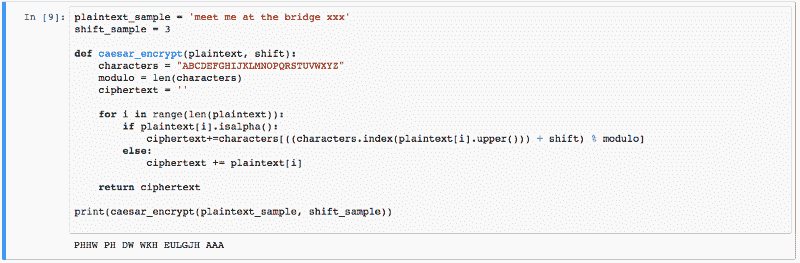
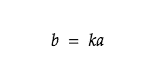
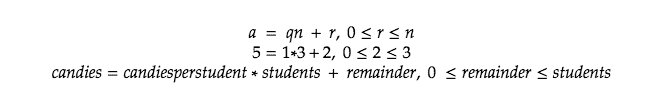
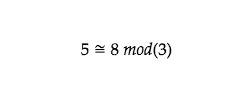
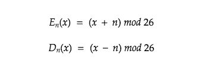
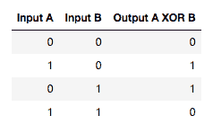
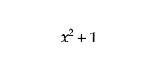
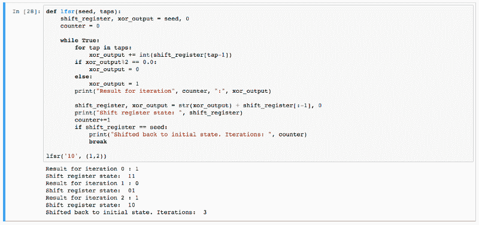

# 密码学和线性反馈移位寄存器介绍

> 原文：<https://www.freecodecamp.org/news/cryptography-and-lfsr/>

我们周围的数据传输速度比以往任何时候都快。敏感数据也是我们日常生活的一部分。为了保护数据，我们使用加密技术。当我们加密数据时，它会以某种方式发生变化，使其对可能的查看者无用，但当它安全到达目标接收者时，可以变回原始状态。这些转换在很大程度上依赖于数学，尤其是一个叫做数论的数学领域。这本书从数学的角度和编程的角度向我们介绍了密码学的基础知识。

#### 昨天和今天的密码

自从书写出现以来，加密的概念就一直伴随着纯文本书写而存在和发展。为了保守秘密，使文本看起来不可理解的想法一直是核心，特别是在军事用途和政治方面。密码一词源于中世纪，来源于拉丁语 *cifra* 和阿拉伯语*صفر***(sifr)等词，意为“零”。关于为什么零会被用来描述加密，有许多理论，包括零的概念不是罗马数字系统的一部分，而是被视为数字中的一个谜。在军事领域使用的最古老和最广为人知的密码之一是凯撒密码，也称为凯撒移位。**

**

Caesars Shift in Python3.** 

**Caesars shift 使用一个密钥，用于移动明文中的每个字符。这个密钥是这种密码的弱点:一旦计算出正确的移位，整个信息就被揭示了。在数学上，这种类型的密码可以写成模运算中的一个问题，模运算处理特定范围内的值。我们稍后将更深入地讨论这一点。**

**

Shift encryption and decryption as modular arithmetic using a 26-letter alphabet.** 

**我们从加密文本中解出明文的方法是找到密钥。在凯撒密码的值为 3 的情况下，找出密钥(3)可以让我们在一个块中解密整个文本。密钥指定加密算法的输出。**

#### **因数和质数**

**也许令人惊讶的是，为加密奠定基础的基本概念之一是可分性。为了定义它的含义，让我们制定一些规则。首先，如果我们有 *a* 和 *b* 都是整数并且 *a* 不为 0，a 除 *b* 如果有这样一个整数 *k* 满足下面的语句。**

**

A is a factor of b.** 

**如果我们找到一个大于 1 的整数，并且除了 1 和它本身之外没有其他正因子，我们称它为*素数*。大于一的非素数整数被称为*合数*，这是因为它们的合成性质。例如，4 大于 1，它有一个因子 2。因此，它是一个合成物。另一方面，3 是一个大于 1 的整数，但它除了 1 和它本身之外没有任何其他的正因子。这是一个质数。其他小素数是 2，5，7，11，13。**

**根据算术基本定理，每个大于 1 的整数都可以写成素数的唯一乘积。这对密码学家来说是个好消息，因为他们喜欢和素数打交道。为什么会这样？嗯，最直接的原因之一是大数的质因数分解要花很多时间。许多众所周知的加密系统，如 RSA，完全基于这一事实。它的工作原理是存在一个用于加密消息的公钥(两个大素数的乘积)和一个用于解密消息的私钥(包含那些素数)。这些素数通常大约有 300 位数长。**

#### **一致性的问题**

**模块化是密码学的基础支柱之一。让我们先从分工的角度来探讨这个概念。如果我们有 5 颗小糖果和三个学生，会发生什么？每个学生得到一块糖，还剩两块。这可以描述如下。**

**

R is the remainder of a when divided by n.** 

**当分给 3 个学生时，你能找到剩下 2 个剩余的糖果数量吗？下一个数字是 8，因为每个学生会得到两个糖果，还会剩下两个。这可以用同余来描述。8 和 5 是模 3 的全等数，这意味着它们被 3 除时有相同的余数。**

**

5 is congruent to 8 in modulo 3.** 

**在凯撒移位的例子中，我们使用由 26 个字母组成的字母表。我们只处理这 26 个值。在 Z 之后，我们回到 A。这就是实践中的模块化。在我们的 26 个字母的列表中,' A '总是在位置 1，所以我们得到的任何位置计数，如果我们除以 26，余数是 1，我们知道使用' A'。这将我们的数字包装成一个有限域，其中最大值是 26。实际上，如果我的秘密信息是“ABC ”,我会先把它转换成数字 123。之后，我会申请轮班。如果键是 3，移位将产生 456。在此之后，我会将数字指向它们的字母表示，即模 26 类。加密的消息变成“DEF”。**

**

Again, encryption and decryption as modular arithmetic using a 26-letter alphabet.** 

**你可以把它想象成一个时钟。当箭头绕着时钟转了一圈，它会回到起点。在模运算中，第一个整数跟在最后一个整数后面。理解这一点的另一种方式是，一个特定模的世界，只存在那个数量的值。例如，在模 2 中，只存在 2 个值。在我们的字母表中，有 26 个值，以此类推。**

#### **密码的类型**

**密码使用哪种密钥可用于将密码分为非对称密钥和对称密钥。它们的不同之处在于使用哪个密钥进行加密和解密。对称密码使用相同的密钥加密和解密(如 Caesars 密码)。非对称密钥密码是用不同于创建时的密钥解密的，例如我们前面简单讨论过的 RSA 加密系统。这导致创建加密的时间更长，但结果也更安全。**

**对密码进行分类的另一种方式是根据它们在流或块中的操作方式。流密码是对称密钥密码，对连续的符号流进行操作。例如，蓝牙中使用的加密是一种流密码。不用说，在需要加密的无线通信时代，流密码已经成为移动技术的重要组成部分。**

#### **流密码一瞥**

**还记得我们之前讨论过模运算的概念吗？简而言之，模运算是有限域中的运算。现在，让我们来看看另一种使用有限值域(也称为伽罗瓦域)的密码。然而，这种密码在相同的输入下并不总是产生相同的值，就像移位一样。其目的是产生用于加密另一个流的密钥流。就像蛇吃自己的尾巴(一个常用来表示永恒的符号)，线性反馈移位寄存器是靠自己的输出来工作的。它们的构造方式使得它们在输出看似随机的模式时无休止地循环通过一个值模式。种子和所有输出的值都是二进制的，这意味着它们得到值 0 或 1。创建新值的方法是使用逻辑运算符，通常是异或(XOR)。**

**

Logical Gate XOR.** 

**为了以一种实用的方式描述这一点，让我们开始看看我们需要什么来创建一个 LFSR。我们需要一个种子，它是一个由 1 和 0 组成的列表。种子将是我们开始转移的。除了我们的种子(或移位寄存器)，我们还有一个抽头集合。点击告诉我们反馈信息时使用寄存器的哪一部分。假设我们有一个种子 001 和两个抽头 1 和 3。这意味着当我们开始移位时，新值将是种子的第一个和第三个数字 0 和 1 的组合。我们用一种叫做异或的运算将两者结合起来。0 异或 1 得 1。由于我们使用的是二进制值，因此来自抽头的反馈可以表示为模 2 的多项式。**

**

The feedback polynomial from taps 3 and 1.** 

**所以，如果我们的移位寄存器是 001，我们得到一个新值，1，我们把它插入开头，去掉最后一个数字。我们新的移位寄存器状态现在是 100。我们继续这种移位，直到我们注意到我们的移位寄存器已经返回到它的初始状态，001。根据我们选择的种子和抽头，我们可以得到不同长度的循环。如果一个循环在到达其初始状态之前通过了所有可能的不同组合，则该循环被称为*最大长度*。因为我们使用的是二进制系统，所以循环的最大长度是 2^n-1.循环也可能最终离开它的原始状态，并陷入一个更短的循环中，永远不会回到它的原始状态。找到导致最大长度循环的种子和抽头是至关重要的。寻找这些抽头的一些标准是抽头的数量必须是偶数，并且抽头是集合互质的，这意味着它们除了 1 之外没有公约数。**

**等等，这看起来不像是随机的！这样的循环不是很容易破解吗？移位寄存器的问题是它们变得相当长，相当快。假设我们选择 20 比特的种子和两个值 2 和 19 的抽头。产生的循环长度是 1 048 575，这意味着我们将得到大量看似随机的二进制值。**

**

Linear Feedback Shift Register in Python3.** 

**我们已经简单介绍过的 LFSR 风格被称为斐波那契 LFSR。还存在其它变化，其中寄存器移位的方式不同。它们都产生用于加密数据流的伪随机比特流。这种类型的加密的应用范围从蓝牙到 GSM(手机通信)标准。**

#### **最后**

**作为一名程序员，学习模运算和除法的概念为思考日常编码问题开辟了新的途径。然而，在安全关键的项目中，总是推荐使用现成的系统和标准进行加密，因为密码学领域的专家可能会找到比热心的爱好者更安全、更有效的解决方案。**

**来源:**

**涅米的《密码学中的代数结构》**

**[ee times 的线性反馈移位寄存器教程](https://www.eetimes.com/document.asp?doc_id=1274550)**

**安妮·坎特奥特的《加密与安全百科全书》**