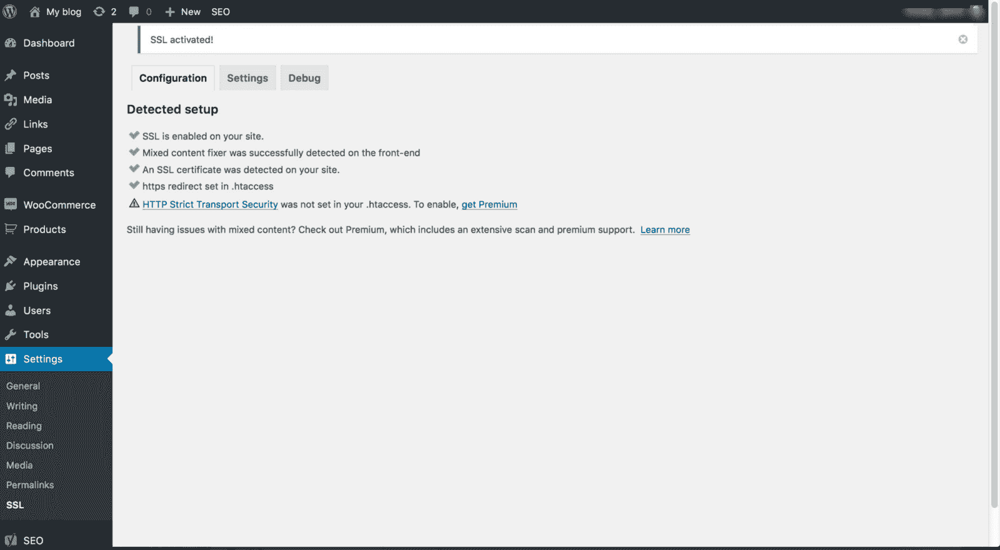
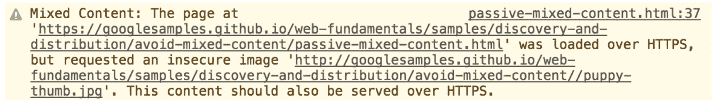
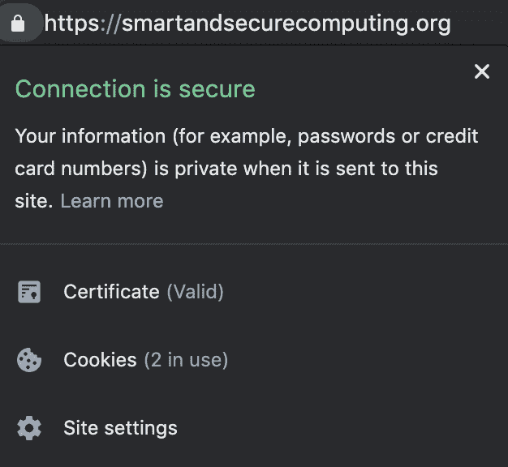
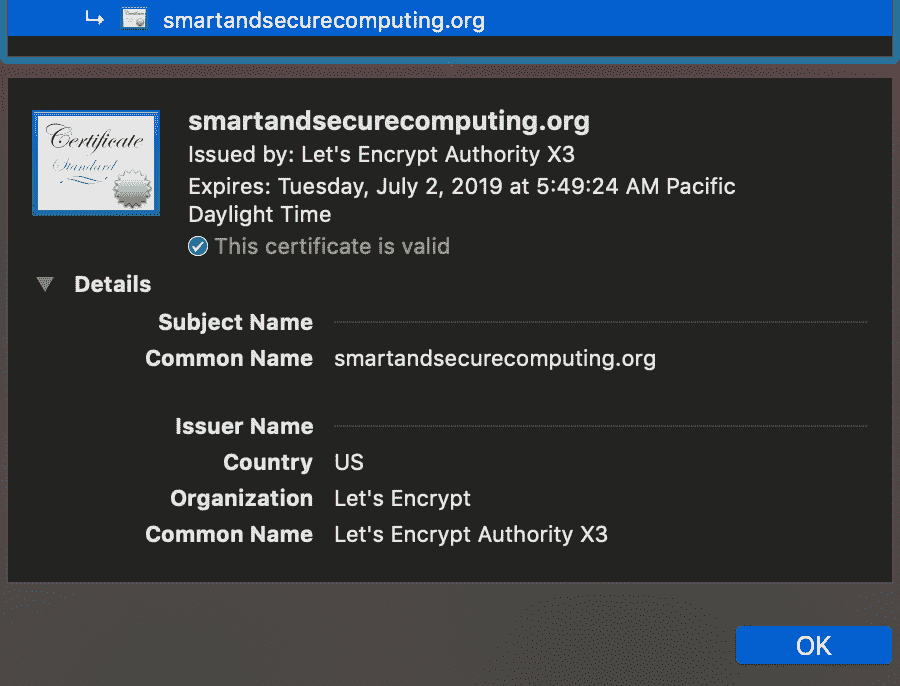
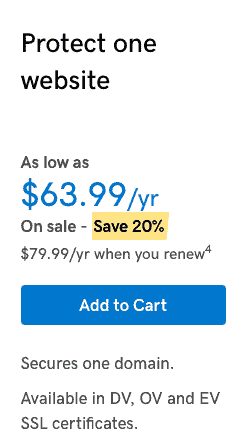
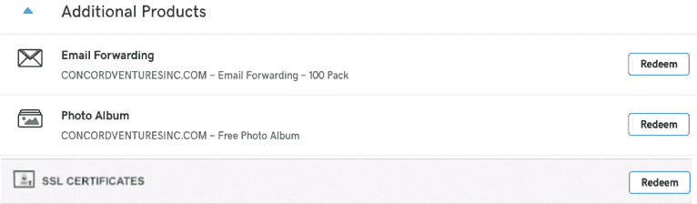
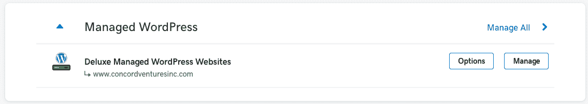
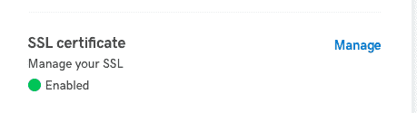

# 保护我们的 WordPress 网站

> 原文：<https://www.freecodecamp.org/news/cjn-securing-our-wordpress-website/>

# 寻找免费 SSL 的第一步

搜索“hostgator free ssl”:

[**HostGator 免费 SSL“HostGator.com 支持门户网站**](https://support.hostgator.com/articles/ssl-certificates/hostgator-free-ssl)
[*我们已经循序渐进地检查了 HostGator cPanel 服务器，以确保免费 SSL 证书……*support.hostgator.com](https://support.hostgator.com/articles/ssl-certificates/hostgator-free-ssl)

然后我得到了一个针对 SSL 的 WordPress 插件建议:

[**真正简单的 SSL**](https://wordpress.org/plugins/really-simple-ssl/)
[*无需设置！您只需要一个 SSL 证书，这个插件会完成剩下的工作。*wordpress.org](https://wordpress.org/plugins/really-simple-ssl/)

我以管理员身份登录了我们的 WordPress 网站。

安装并激活了非常简单的 SSL 插件。

经检查 ****锁定网址中的**** 图标。上面写着“内容不安全”。

我检查了 WordPress 网站，从我们现有的背景图片中看到一个关于 ****混合内容**** 的警告。

它看起来像这样:

我在谷歌上搜索“修复混合内容”:

[**防止混合内容| Web 基础|谷歌开发者**](https://developers.google.com/web/fundamentals/security/prevent-mixed-content/fixing-mixed-content)
[*查找和修复混合内容是一项重要的任务，但可能会非常耗时。本指南讨论了一些工具……*developers.google.com](https://developers.google.com/web/fundamentals/security/prevent-mixed-content/fixing-mixed-content)

我通过移除背景图像并重新上传相同的图像，找到了修复 ****混合内容**** 问题的方法。

一些图像没有通过立即重新上传图像来修复。

它抱怨一张图片上传得不安全(在 http 中)。

我遵循了本指南的选项 1:[https://managewp . com/blog/WordPress-SSL-settings-and-how-to-resolve-mixed-content-warnings](https://managewp.com/blog/wordpress-ssl-settings-and-how-to-resolve-mixed-content-warnings)

### 选项 1:强制所有页面 HTTPS

之后，我重新上传了照片。

感谢阅读！

## 更新。我最近更新了一个托管在 GoDaddy 的 WordPress 网站的 SSL 证书。

1)我谷歌了一下“购买 godaddy ssl”

2)我关注了这个链接[https://www.godaddy.com/web-security/ssl-certificate](https://www.godaddy.com/web-security/ssl-certificate)

3)它将我重定向到“我的账单”页面，我点击了“购买”

4)转到我的产品页面并兑换您的 SSL

5)点击托管 WordPress，选择你想要安装 SSL 的网站，然后点击管理

6)单击安装。一旦安装成功，它应该显示启用。

7)检查你的网站。它现在应该有一个锁图标，这意味着它是安全的。=)

[https://www.youtube.com/embed/QJ8CkBMIvro?feature=oembed](https://www.youtube.com/embed/QJ8CkBMIvro?feature=oembed)

[**Clark Jason Ngo -研究生助教-技术学院-西雅图城市大学|……**](https://www.linkedin.com/in/clarkngo/)
[*查看 Clark Jason Ngo 在全球最大的职业社区 LinkedIn 上的简介。克拉克·杰森列出了 9 份工作…*www.linkedin.com](https://www.linkedin.com/in/clarkngo/)