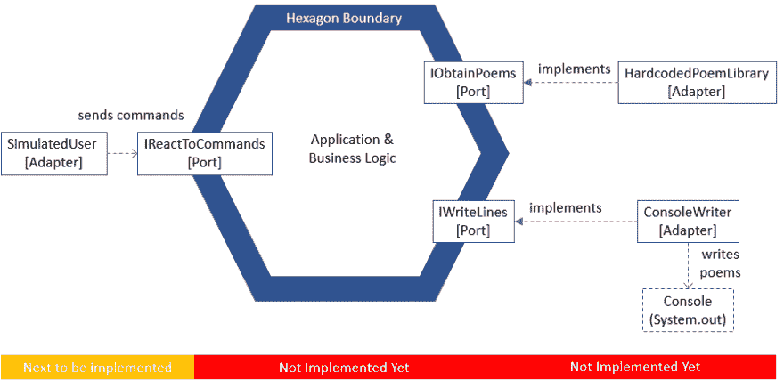
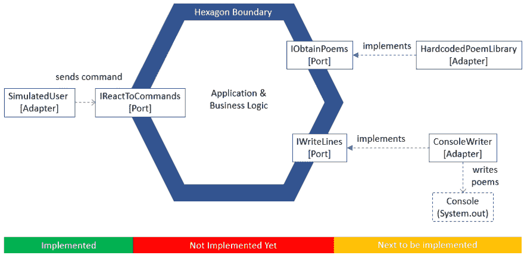
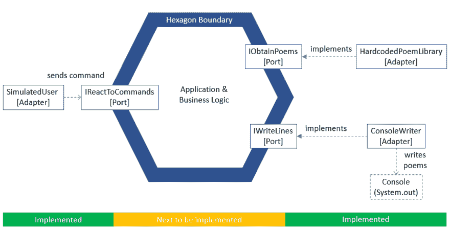
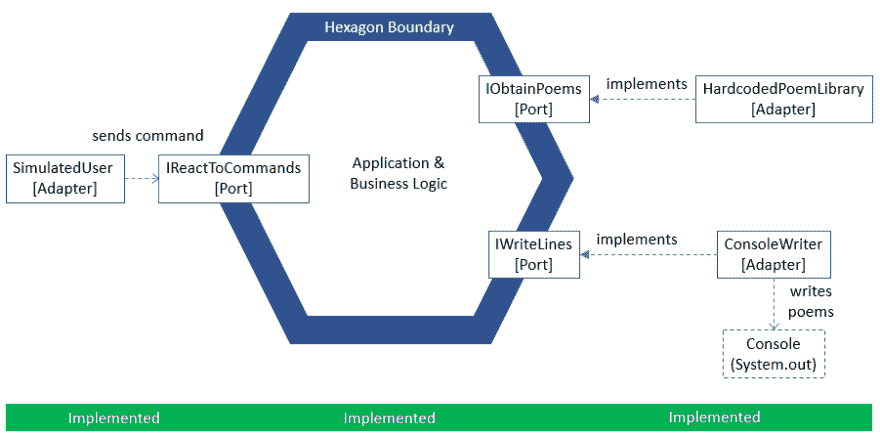
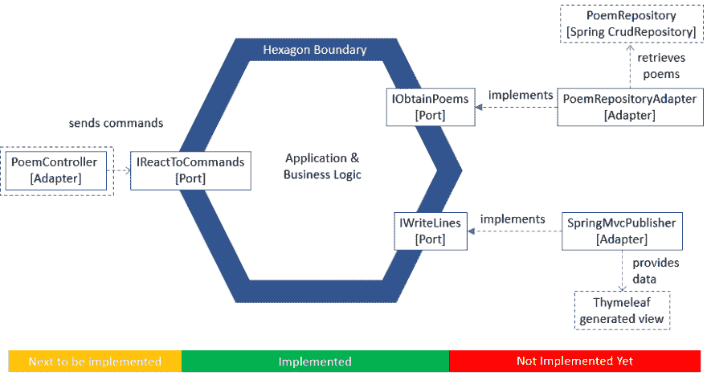

# 如何实现六边形架构

> 原文：<https://www.freecodecamp.org/news/implementing-a-hexagonal-architecture/>

六边形架构简化了推迟或更改技术决策。你想换一个不同的框架？编写一个新的适配器。你想使用数据库，而不是在文件中存储数据？同样，为它编写一个适配器。

围绕业务逻辑画一个边界。六边形。六边形内的任何东西都必须与技术无关。六边形的外部只能通过称为端口的接口与内部通信。反过来也一样。通过改变一个端口的实现，你改变了技术。

将业务逻辑隔离在六边形内部还有另一个好处。它支持为业务逻辑编写快速、稳定的测试。例如，他们不依赖网络技术来驱动他们。

这是一个示例图。它用虚线框表示 Spring MVC 技术，用实线框表示端口和适配器，用六边形表示内部结构:


适配器在特定技术和技术自由端口之间进行转换。左边的`PoemController`适配器接收请求并向`IReactToCommands`端口发送命令。`PoemController`是一个普通的 Spring MVC 控制器。因为它主动使用端口，所以它被称为驱动程序适配器。

`IReactToCommands`称为驱动程序端口。它的实现在六边形内部。图上没有显示出来。

在右侧，`SpringMvcPublisher`适配器实现了`IWriteLines`端口。这一次，*六角形*通过端口调用适配器。这就是为什么`SpringMvcPublisher`被称为从动适配器。而`IWriteLines`称为被驱动端口。

我将向您展示如何实现该应用程序。我们从一个用户故事一直到六边形内部的领域模型。我们从打印到控制台的应用程序的简单版本开始。然后我们切换到 Spring Boot 和春天 MVC。

## 从用户故事到端口和适配器

FooBars.io 公司决定开发一款诗歌应用。产品所有者和开发人员同意以下用户故事:

作为一个读者，我想每天至少读一首诗，这样我才能作为一个人茁壮成长

作为验收标准，团队同意:

*   当用户要求一首特定语言的诗时，系统会在控制台中随机显示一首该语言的诗
*   一开始“模拟”用户是可以的，即没有真正的用户交互。(这在以后的版本中会有所改变。)
*   支持的语言:英语、德语

开发人员会面并绘制了下图:



因此`SimulatedUser`向`IReactToCommands`端口发送命令。它要求用英语和德语写诗。这是代码，可以在 [Github](https://github.com/bertilmuth/poem-hexagon) 上找到。

*诗/简单/驱动 _ 适配器/[SimulatedUser.java](https://github.com/bertilmuth/poem-hexagon/blob/master/src/main/java/poem/simple/driver_adapter/SimulatedUser.java)*

```
public class SimulatedUser {
    private IReactToCommands driverPort;

    public SimulatedUser(IReactToCommands driverPort) {
        this.driverPort = driverPort;
    }

    public void run() {
        driverPort.reactTo(new AskForPoem("en"));
        driverPort.reactTo(new AskForPoem("de"));
    }
} 
```

端口只有一种方法来接收任何类型的命令。

*诗/边界/司机 _ 港口/[IReactToCommands.java](https://github.com/bertilmuth/poem-hexagon/blob/master/src/main/java/poem/boundary/driver_port/IReactToCommands.java)*

```
public interface IReactToCommands{
    void reactTo(Object command);
} 
```

`AskForPoem`是命令。实例是简单的、不可变的 POJOs。它们带有所要求的诗的语言。

*诗/命令/[AskForPoem.java](https://github.com/bertilmuth/poem-hexagon/blob/master/src/main/java/poem/command/AskForPoem.java)*

```
public class AskForPoem {
    private String language;

    public AskForPoem(String language) {
        this.language = language;
    }

    public String getLanguage() {
        return language;
    }
} 
```

这就是六边形左侧的驾驶员侧。在右侧，从动侧。



当`SimulatedUser`向`IReactToCommands`端口请求一首诗时，六边形:

1.  联系`IObtainPoems`港口征集诗集
2.  从诗集里随机挑选一首诗
3.  告诉`IWriteLines`端口将诗写到输出设备

你还看不到第二步。在领域模型中，它发生在六边形内部。这就是示例的业务逻辑。所以我们先关注第一步和第三步。

在步骤 1 中，诗集是一个依赖于语言的硬编码数组。它是由实现`IObtainPoems`端口的`HardcodedPoemLibrary`适配器提供的。

*诗/界/驱 _ 港/[IObtainPoems.java](https://github.com/bertilmuth/poem-hexagon/blob/master/src/main/java/poem/boundary/driven_port/IObtainPoems.java)*

```
public interface IObtainPoems {
    String[] getMePoems(String language);
} 
```

*诗/简单/驱动 _ 适配器/[HardcodedPoemLibrary.java](https://github.com/bertilmuth/poem-hexagon/blob/master/src/main/java/poem/simple/driven_adapter/HardcodedPoemLibrary.java)*

```
public class HardcodedPoemLibrary implements IObtainPoems {
    public String[] getMePoems(String language) {
        if ("de".equals(language)) {
            return new String[] { /* Omitted for brevity */ };
        } else { 
            return new String[] { /* Omitted for brevity */ };
        }
    }
} 
```

在步骤 3 中，`ConsoleWriter`适配器将诗歌的诗句写入输出设备，即控制台。

*诗/界/驱 _ 港/[IWriteLines.java](https://github.com/bertilmuth/poem-hexagon/blob/master/src/main/java/poem/boundary/driven_port/IWriteLines.java)*

```
public interface IWriteLines {
    void writeLines(String[] strings);
} 
```

*诗/简单/驱动 _ 适配器/[ConsoleWriter.java](https://github.com/bertilmuth/poem-hexagon/blob/master/src/main/java/poem/simple/driven_adapter/ConsoleWriter.java)*

```
public class ConsoleWriter implements IWriteLines {
    public void writeLines(String[] lines) {
        Objects.requireNonNull(lines);
        for (String line : lines) {
            System.out.println(line);
        }
        System.out.println("");
    }
} 
```

我们已经创建了所有的端口，以及所有适配器的简单实现。到目前为止，六角形的内部仍然是一个谜。接下来就是了。



# 命令处理程序(在六边形内部)

当用户要求一首诗时，系统会显示一首随机的诗。
代码类似:当`IReactToCommands`端口收到一个`AskForPoem`命令时，hexagon 调用一个`DisplayRandomPoem`命令处理程序。

`DisplayRandomPoem`命令处理程序获得一个诗歌列表，随机挑选一首并将其写入输出设备。这正是我们在上一个条款中谈到的步骤列表。

*诗/边界/内部/命令 _ 处理程序/[DisplayRandomPoem.java](https://github.com/bertilmuth/poem-hexagon/blob/master/src/main/java/poem/boundary/internal/command_handler/DisplayRandomPoem.java)*

```
public class DisplayRandomPoem implements Consumer<AskForPoem> {
        /* Omitted for brevity */

    @Override
    public void accept(AskForPoem askForPoem) {
        List<Poem> poems = obtainPoems(askForPoem);
        Optional<Poem> poem = pickRandomPoem(poems);
        writeLines(poem);   
    }

        /* Rest of class omitted for brevity */
} 
```

在域模型数据和端口接口中使用的数据之间进行转换也是命令处理程序的工作。

# 将命令绑定到命令处理程序

在我的六边形架构的实现中，只有一个驱动程序端口`IReactToCommands`。它对所有类型的命令都有反应。

```
public interface IReactToCommands{
    void reactTo(Object command);
} 
```

`Boundary`类是`IReactToCommands`端口的实现。它使用一个[库](https://github.com/bertilmuth/requirementsascode)创建一个行为模型。行为模型将每种命令类型映射到一个命令处理程序。然后，行为基于行为模型分派命令。

*诗/界/[Boundary.java](https://github.com/bertilmuth/poem-hexagon/blob/master/src/main/java/poem/boundary/Boundary.java)*

```
public class Boundary implements IReactToCommands, BehaviorModel {
  private final IObtainPoems poemObtainer;
  private final IWriteLines lineWriter;
  private final StatelessBehavior behavior;

  private static final Class<AskForPoem> asksForPoem = AskForPoem.class;

  public Boundary(IObtainPoems poemObtainer, IWriteLines lineWriter) {
    this.poemObtainer = poemObtainer;
    this.lineWriter = lineWriter;
    this.behavior = StatelessBehavior.of(this);
  }

  @Override
  public Model model() {
    return Model.builder()
        .user(asksForPoem).system(displaysRandomPoem())
        .build();
  }

  @Override
  public void reactTo(Object commandObject) {
    behavior.reactTo(commandObject);
  }

  private Consumer<AskForPoem> displaysRandomPoem() {
    return new DisplayRandomPoem(poemObtainer, lineWriter);
  }
}
```

# 领域模型

这个例子的领域模型没有非常有趣的功能。随机挑选者从列表中随机挑选一首诗。

一首[诗](https://github.com/bertilmuth/poem-hexagon/blob/master/src/main/java/poem/boundary/internal/domain/Poem.java)有一个构造函数，它接受一个包含行分隔符的字符串，并把它分成几节。

关于示例域模型真正有趣的一点是:它不涉及数据库或任何其他技术，甚至不涉及接口！

这意味着你可以用[简单的单元测试](https://github.com/bertilmuth/poem-hexagon/blob/master/src/test/java/poem/boundary/internal/domain/RandomPoemPickerTest.java)来测试领域模型。你不需要嘲笑任何东西。

这种纯域模型不是实现六边形架构的应用程序的必要属性。但是我喜欢它提供的解耦和可测试性。

# 将适配器插入端口，就这样

最后一步是让应用程序工作。应用程序需要一个主类来创建驱动适配器。它将它们注入边界。然后，它为边界创建驱动程序适配器，并运行它。

*诗/简单/[Main.java](https://github.com/bertilmuth/poem-hexagon/blob/master/src/main/java/poem/simple/Main.java)*

```
public class Main {
    public static void main(String[] args) {
        new Main().startApplication();
    }

    private void startApplication() {
        // Instantiate driven, right-side adapters
        HardcodedPoemLibrary poemLibrary = new HardcodedPoemLibrary();
        ConsoleWriter consoleWriter = new ConsoleWriter();

        // Inject driven adapters into boundary
        Boundary boundary = new Boundary(poemLibrary, consoleWriter);

        // Start the driver adapter for the application
        new SimulatedUser(boundary).run();
    }
} 
```

就是这样！团队向产品负责人展示结果。她对进展很满意。是时候小小庆祝一下了。



# 切换到 Spring

该团队决定将 poem 应用程序转变为 web 应用程序。并将诗歌储存在真实的数据库中。他们同意使用 Spring 框架来实现它。在开始编码之前，团队开会并绘制了下图:



现在有一个`PoemController`代替了`SimulatedUser`，它向六边形发送命令。

*诗/跳羚/驱动 _ 适配器/[PoemController.java](https://github.com/bertilmuth/poem-springboot/blob/master/src/main/java/poem/springboot/driver_adapter/PoemController.java)*

```
@Controller
public class PoemController {
    private SpringMvcBoundary springMvcBoundary;

    @Autowired
    public PoemController(SpringMvcBoundary springMvcBoundary) {
        this.springMvcBoundary = springMvcBoundary;
    }

    @GetMapping("/askForPoem")
    public String askForPoem(@RequestParam(name = "lang", required = false, defaultValue = "en") String language,
            Model webModel) {
        springMvcBoundary.basedOn(webModel).reactTo(new AskForPoem(language));

        return "poemView";
    }
}
```

当收到命令时，`PoemController`调用`springMvcBoundary.basedOn(webModel)`。这将基于请求的`webModel`创建一个新的`Boundary`实例:

*诗/羚羊/边界/[SpringMvcBoundary.java](https://github.com/bertilmuth/poem-springboot/blob/master/src/main/java/poem/springboot/boundary/SpringMvcBoundary.java)*

```
public class SpringMvcBoundary {
    private final IObtainPoems poemObtainer;

    public SpringMvcBoundary(IObtainPoems poemObtainer) {
        this.poemObtainer = poemObtainer;
    }

    public IReactToCommands basedOn(Model webModel) {
        SpringMvcPublisher webPublisher = new SpringMvcPublisher(webModel);
        IReactToCommands boundary = new Boundary(poemObtainer, webPublisher);
        return boundary;
    }
}
```

像以前一样，对`reactTo()`的调用将命令发送到边界。在六边形的右边，`SpringMvcPublisher`向 Spring MVC 模型添加了一个属性`lines`。这是百里香用来将行插入网页的值。

*诗/跳羚/从动 _ 适配器/[SpringMvcPublisher.java](https://github.com/bertilmuth/poem-springboot/blob/master/src/main/java/poem/springboot/driven_adapter/SpringMvcPublisher.java)*

```
public class SpringMvcPublisher implements IWriteLines {
    static final String LINES_ATTRIBUTE = "lines";

    private Model webModel;

    public SpringMvcPublisher(Model webModel) {
        this.webModel = webModel;
    }

    public void writeLines(String[] lines) {
        Objects.requireNonNull(lines);
        webModel.addAttribute(LINES_ATTRIBUTE, lines);
    }
} 
```

团队还实现了一个`PoemRepositoryAdapter`来访问`PoemRepository`。适配器从数据库中获取`Poem`对象。它以字符串数组的形式返回所有诗歌的文本。

*诗/跳羚/从动 _ 适配器/[PoemRepositoryAdapter.java](https://github.com/bertilmuth/poem-springboot/blob/master/src/main/java/poem/springboot/driven_adapter/PoemRepositoryAdapter.java)*

```
public class PoemRepositoryAdapter implements IObtainPoems {
    private PoemRepository poemRepository;

    public PoemRepositoryAdapter(PoemRepository poemRepository) {
        this.poemRepository = poemRepository;
    }

    @Override
    public String[] getMePoems(String language) {
        Collection<Poem> poems = poemRepository.findByLanguage(language);
        final String[] poemsArray = poems.stream()
            .map(p -> p.getText())
            .collect(Collectors.toList())
            .toArray(new String[0]);
        return poemsArray;
    }
} 
```

最后，团队实现了[应用程序](https://github.com/bertilmuth/poem-springboot/blob/master/src/main/java/poem/springboot/Application.java)类，该类建立了一个示例存储库并将适配器插入端口。

仅此而已。切换到 Spring 已完成。

# 结论

有许多方法可以实现六边形架构。我向您展示了一种简单的方法，它为 hexagon 提供了一个易于使用的命令驱动的 API。它减少了需要实现的接口数量。这导致了一个纯粹的领域模型。

如果你想获得更多关于这个话题的信息，请阅读阿利斯泰尔·考克伯恩关于这个话题的原创文章。

这篇文章中的例子是受阿利斯泰尔·考克伯恩关于这个主题的三部分系列讲座的启发。

最后更新于 2021 年 7 月 30 日。 *。如果你想了解我正在做的事情或给我留言，请关注我的* [*dev.to*](https://dev.to/bertilmuth) *，*[*LinkedIn*](https://www.linkedin.com/in/bertilmuth/)*或*[*Twitter*](https://twitter.com/BertilMuth)*。或者访问我的* [*GitHub 项目*](https://github.com/bertilmuth/requirementsascode) *。要了解敏捷软件开发，* [*访问我的在线课程*](https://skl.sh/2Cq497P) *。*