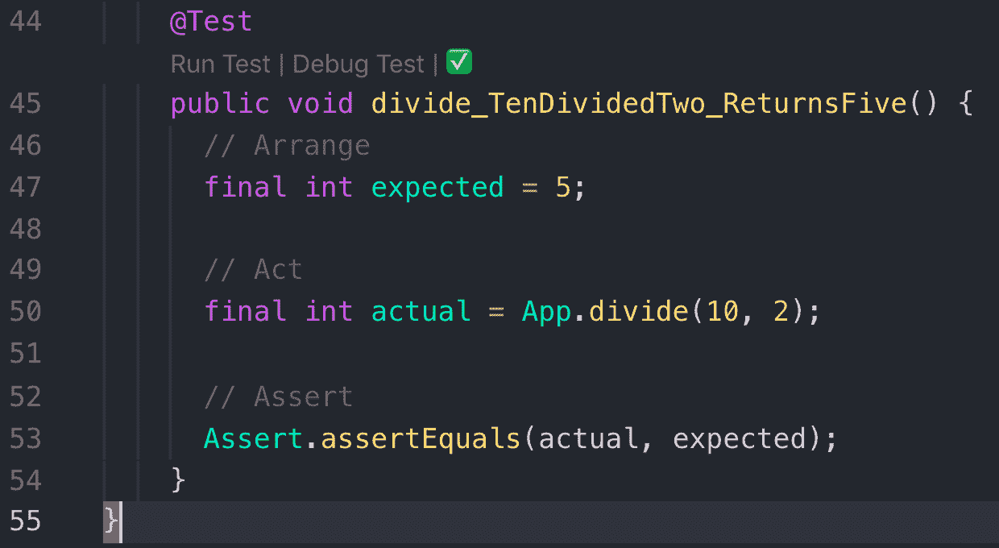
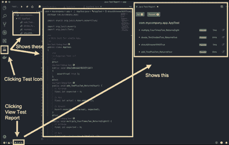
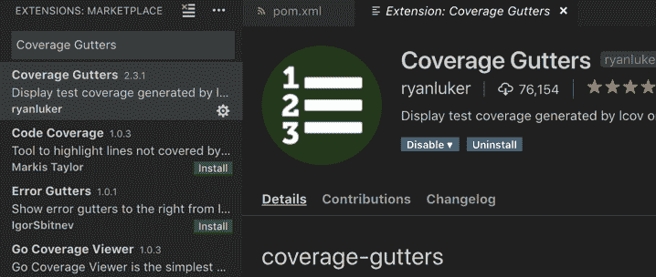
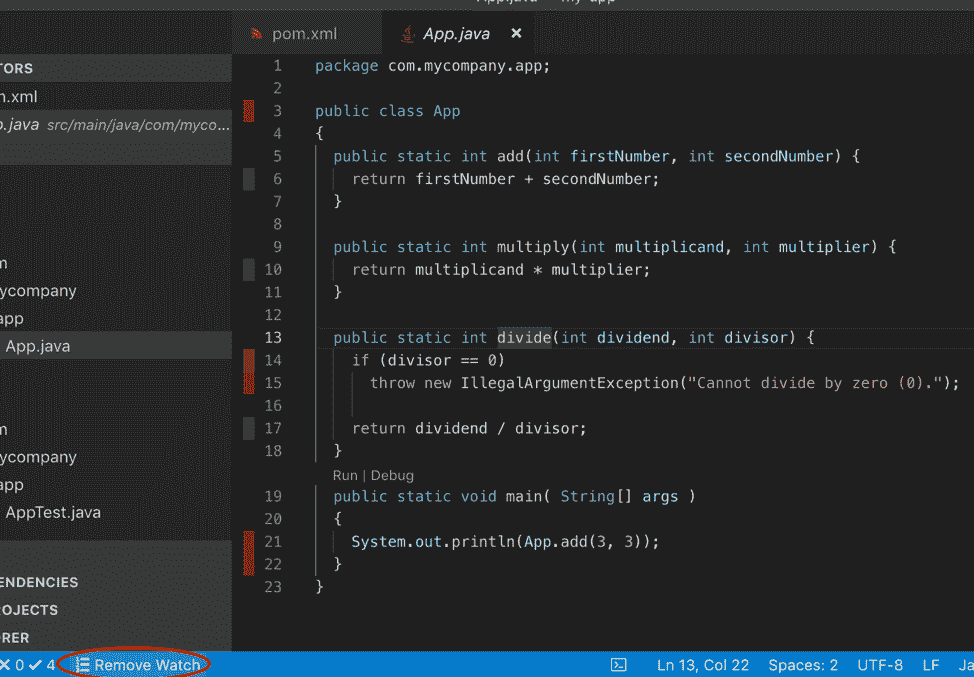
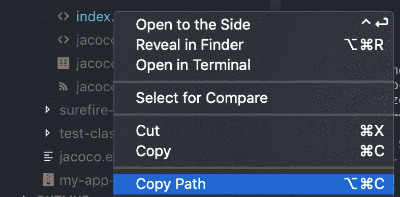
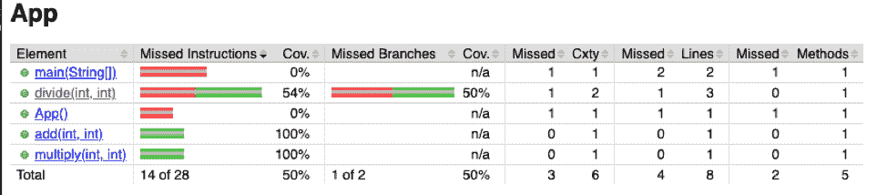

# 在 VSCode 中使用 Maven 进行 JUnit 测试

> 原文：<https://www.freecodecamp.org/news/cjn-junit-test-with-maven-in-vscode/>

### **安装 VSCode**

这里设置:[https://code.visualstudio.com/docs/setup/setup-overview](https://code.visualstudio.com/docs/setup/setup-overview)

### 安装并创建一个 Maven 项目

完整的安装指南在这里:[https://maven . Apache . org/guides/getting-started/maven-in-five-minutes . html](https://maven.apache.org/guides/getting-started/maven-in-five-minutes.html)

如果您安装了 Maven，请按照以下步骤操作:

****生成项目****

```
mvn archetype:generate -DgroupId=com.mycompany.app -DartifactId=my-app -DarchetypeArtifactId=maven-archetype-quickstart -DarchetypeVersion=1.4 -DinteractiveMode=false
```

****进入工程目录****

```
cd my-app
```

****建立项目****

```
mvn package
```

****测试并编译项目****

```
java -cp target/my-app-1.0-SNAPSHOT.jar com.mycompany.app.App
```

****你应该得到一个带有:**** Hello World 的输出！

### 修改我们的项目

让我们开始创建简单的数学函数

搜索`App.java`文件并用以下代码替换其内容:

```
package com.mycompany.app;

public class App 
{
  public static int add(int firstNumber, int secondNumber) {
    return firstNumber + secondNumber;
  }

  public static int multiply(int multiplicand, int multiplier) {
    return multiplicand * multiplier;
  }

  public static int divide(int dividend, int divisor) {
    if (divisor == 0)
      throw new IllegalArgumentException("Cannot divide by zero (0).");

    return dividend / divisor;
  }
  public static void main( String[] args )
  {
    System.out.println(App.add(3, 3)); 
  }
}
```

搜索`AppTest.java`并用以下代码替换内容:

```
package com.mycompany.app;

import static org.junit.Assert.assertTrue;

import org.junit.Assert;
import org.junit.Test;

/**
 * Unit test for simple App.
 */
public class AppTest 
{
    /**
     * Rigorous Test :-)
     */
    @Test
    public void shouldAnswerWithTrue()
    {
        assertTrue( true );
    }
    @Test
    public void add_TwoPlusTwo_ReturnsFour() {
      // Arrange
      final int expected = 4;

      // Act
      final int actual = App.add(2, 2);

      // Assert
      Assert.assertEquals(expected, actual);
    }    
    @Test
    public void multiply_FourTimesTwo_ReturnsEight() {
      // Arrange
      final int expected = 8;

      // Act
      final int actual = App.multiply(4, 2);

      // Assert
      Assert.assertEquals(expected, actual);
    }        

    @Test
    public void divide_TenDividedTwo_ReturnsFive() {
      // Arrange
      final int expected = 5;

      // Act
      final int actual = App.divide(10, 2);

      // Assert
      Assert.assertEquals(expected, actual);
    }           
}
```

您可以继续创建测试，例如:

```
@Test    
public void multiply_FiftyTimesTwo_ReturnsOneHundred() 
{      
  // Arrange      
  final int expected = 100;        
  // Act      
  final int actual = App.multiply(50, 2);        
  // Assert      
  Assert.assertEquals(actual, expected);    
}
```

****建立项目****

```
mvn package
```

输出:

```
[INFO] -------------------------------------------------------
[INFO]  T E S T S
[INFO] -------------------------------------------------------
[INFO] Running com.mycompany.app.AppTest
[INFO] Tests run: 3, Failures: 0, Errors: 0, Skipped: 0, Time elapsed: 0.026 s - in com.mycompany.app.AppTest
[INFO] 
[INFO] Results:
[INFO] 
[INFO] Tests run: 3, Failures: 0, Errors: 0, Skipped: 0
```

****测试并编译项目****

```
java -cp target/my-app-1.0-SNAPSHOT.jar com.mycompany.app.App
```

输出:

```
6
Hello World!
```

运行测试的另一种方法是点击`AppTest.java`内的*运行测试*

在下面的例子中，*运行测试*位于代码行 44 的正下方。



****查看检测项目和检测报告****



### 将 JUnit 4 迁移到 JUnit 5

将您的`pom.xml`依赖项更改为:

```
 <dependencies>
      <dependency>
          <groupId>org.junit.jupiter</groupId>
          <artifactId>junit-jupiter-api</artifactId>
          <version>5.4.2</version>
          <scope>test</scope>
      </dependency>
      <dependency>
          <groupId>org.junit.jupiter</groupId>
          <artifactId>junit-jupiter-engine</artifactId>
          <version>5.4.2</version>
          <scope>test</scope>
      </dependency>
  </dependencies>
```

将您的`AppTest.java`改为:

```
package com.mycompany.app;

import static org.junit.jupiter.api.Assertions.assertTrue;
import static org.junit.jupiter.api.Assertions.assertEquals;

import org.junit.jupiter.api.Test;

/**
 * Unit test for simple App.
 */
public class AppTest 
{
    /**
     * Rigorous Test :-)
     */
    @Test
    public void shouldAnswerWithTrue()
    {
        assertTrue( true );
    }
    @Test
    public void add_TwoPlusTwo_ReturnsFour() {
      // Arrange
      final int expected = 4;

      // Act
      final int actual = App.add(2, 2);

      // Assert
      assertEquals(expected, actual);
    }    
    @Test
    public void multiply_FourTimesTwo_ReturnsEight() {
      // Arrange
      final int expected = 8;

      // Act
      final int actual = App.multiply(4, 2);

      // Assert
      assertEquals(expected, actual);
    }        

    @Test
    public void divide_TenDividedTwo_ReturnsFive() {
      // Arrange
      final int expected = 5;

      // Act
      final int actual = App.divide(10, 2);

      // Assert
      assertEquals(expected, actual);
    }           
}
```

****添加测试覆盖****

****检查测试覆盖报告****

在 VSCode 中，打开扩展市场并搜索覆盖率



单击安装按钮

打开根文件夹下的 pom.xml 文件，用[http://bit.ly/2Df1Oj2](http://bit.ly/2Df1Oj2)替换内容，添加一个插件支持。

```
<?xml version="1.0" encoding="UTF-8"?>

<project  xmlns:xsi="http://www.w3.org/2001/XMLSchema-instance"
  xsi:schemaLocation="http://maven.apache.org/POM/4.0.0 http://maven.apache.org/xsd/maven-4.0.0.xsd">
  <modelVersion>4.0.0</modelVersion>

  <groupId>com.mycompany.app</groupId>
  <artifactId>my-app</artifactId>
  <version>1.0-SNAPSHOT</version>

  <name>my-app</name>
  <!-- FIXME change it to the project's website -->
  <url>http://www.example.com</url>

  <properties>
    <project.build.sourceEncoding>UTF-8</project.build.sourceEncoding>
    <maven.compiler.source>1.7</maven.compiler.source>
    <maven.compiler.target>1.7</maven.compiler.target>
  </properties>

  <dependencies>
    <dependency>
        <groupId>org.junit.jupiter</groupId>
        <artifactId>junit-jupiter-api</artifactId>
        <version>5.4.2</version>
        <scope>test</scope>
    </dependency>
    <dependency>
        <groupId>org.junit.jupiter</groupId>
        <artifactId>junit-jupiter-engine</artifactId>
        <version>5.4.2</version>
        <scope>test</scope>
    </dependency>
  </dependencies>

  <build>
    <pluginManagement><!-- lock down plugins versions to avoid using Maven defaults (may be moved to parent pom) -->
      <plugins>
        <plugin>
          <groupId>org.jacoco</groupId>
          <artifactId>jacoco-maven-plugin</artifactId>
          <version>0.8.2</version>
          <executions>
              <execution>
                  <goals>
                      <goal>prepare-agent</goal>
                  </goals>
              </execution>
              <execution>
                  <id>report</id>
                  <phase>prepare-package</phase>
                  <goals>
                      <goal>report</goal>
                  </goals>
              </execution>
          </executions>
        </plugin>
        <!-- clean lifecycle, see https://maven.apache.org/ref/current/maven-core/lifecycles.html#clean_Lifecycle -->
        <plugin>
          <artifactId>maven-clean-plugin</artifactId>
          <version>3.1.0</version>
        </plugin>
        <!-- default lifecycle, jar packaging: see https://maven.apache.org/ref/current/maven-core/default-bindings.html#Plugin_bindings_for_jar_packaging -->
        <plugin>
          <artifactId>maven-resources-plugin</artifactId>
          <version>3.0.2</version>
        </plugin>
        <plugin>
          <artifactId>maven-compiler-plugin</artifactId>
          <version>3.8.0</version>
        </plugin>
        <plugin>
          <artifactId>maven-surefire-plugin</artifactId>
          <version>2.22.1</version>
        </plugin>
        <plugin>
          <artifactId>maven-jar-plugin</artifactId>
          <version>3.0.2</version>
        </plugin>
        <plugin>
          <artifactId>maven-install-plugin</artifactId>
          <version>2.5.2</version>
        </plugin>
        <plugin>
          <artifactId>maven-deploy-plugin</artifactId>
          <version>2.8.2</version>
        </plugin>
        <!-- site lifecycle, see https://maven.apache.org/ref/current/maven-core/lifecycles.html#site_Lifecycle -->
        <plugin>
          <artifactId>maven-site-plugin</artifactId>
          <version>3.7.1</version>
        </plugin>
        <plugin>
          <artifactId>maven-project-info-reports-plugin</artifactId>
          <version>3.0.0</version>
        </plugin>
      </plugins>
    </pluginManagement>
  </build>
</project>
```

在 VSCode 中打开终端并运行

```
mvn install
mvn clean jacoco:prepare-agent install jacoco:report
```

打开`main/java/com/mycompany/app`文件夹下的`App.java`文件，点击观察按钮查看报告



红色条:测试代码没有被覆盖

黄色条:条件未覆盖

绿色条:代码被覆盖

打开根文件夹/target/site/jacoco 下的`index.html`文件。

要打开:

然后将路径粘贴到浏览器中(Windows 为 Ctrl，MacOS 为 Command)。



你可以看到一个非常详细的测试覆盖报告:



感谢阅读！=)

想学习不同类型的软件测试吗？[https://medium . com/@ clarkjasonngo/easy-examples-for-black-white-and-gray-box-testings-FD CEB 2 A8 b 664](https://medium.com/@clarkjasonngo/easy-examples-for-black-white-and-gray-box-testings-fdceb2a8b664)[**clarkjasonngo-研究生助教-技术学院-西雅图城市大学|……**](https://www.linkedin.com/in/clarkngo/)
[*查看 Clark Jason Ngo 在全球最大的职业社区 LinkedIn 上的简介。克拉克·杰森列出了 9 份工作……*www.linkedin.com](https://www.linkedin.com/in/clarkngo/)

测试覆盖段投稿人: [**王聪-全栈软件工程师-共振路径学院| LinkedIn**](https://www.linkedin.com/in/kevin-pwang/)
[*加入 LinkedIn 凯文是一名热爱技术和编程的计算机科学硕士研究生。他有一个伟大的……*www.linkedin.com](https://www.linkedin.com/in/kevin-pwang/)