# 如何建立一个令人惊叹的 LinkedIn 个人资料[15+行之有效的技巧]

> 原文：<https://www.freecodecamp.org/news/how-to-build-an-amazing-linkedin-profile-15-proven-tips/>

寻找一些 LinkedIn 个人资料提示来帮助你提升自己，击败竞争对手，获得更多工作机会？

你来对地方了！这本 8000 多字的指南深入探讨了 15 个行之有效的 LinkedIn 个人资料技巧，将向你展示如何优化你个人资料的各个方面，并获得你想要的结果:

更多的个人资料，更多的联系，更多的机会，和更多的工作机会。

# 为什么我有资格分享 LinkedIn 个人资料提示？

好问题！人们总是问我的第一条建议是什么，我告诉他们:

你应该只接受那些已经拥有你想要的东西的人的建议。

互联网上有很多职业“大师”在 LinkedIn 上发布个人资料，但完全没有资格或证据来支持他们。

如果我处在你的位置，我会想知道我正在实现的建议***实际上在过去** 有效。我的名字是[奥斯汀·贝尔卡](https://www.linkedin.com/in/abelcak/)，这是我在 LinkedIn 上的“简历”(也就是为什么我有资格谈论这件事):*

*   *我个人使用 LinkedIn 获得了微软、谷歌和 Twitter 的工作机会*
*   *我辅导过成千上万的求职者，并帮助他们在谷歌、微软、脸书、苹果、亚马逊、高盛、德勤、红杉资本、Space X 等公司找到工作——这些公司都使用 LinkedIn*
*   *在不到 5 个月的时间里，我的 LinkedIn 粉丝从 3000 人增加到了 20000 人*
*   *我平均每月有 5000 次 LinkedIn 个人资料浏览，每周有超过 1000 人通过 LinkedIn 搜索**找到我的个人资料***
*   ***我在 LinkedIn 上的帖子平均有 45，000 次浏览，累计总浏览量超过 5，000，000 次***

***例如，[这是我两周前发的一篇帖子](https://www.linkedin.com/feed/update/urn:li:activity:6527171211863035904)，点击量超过了 226，000 次:***

***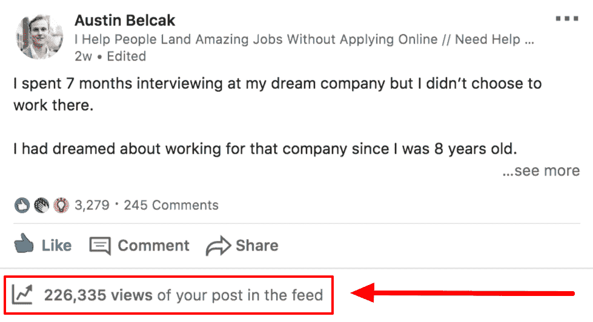***

***这里是我过去 90 天的领英个人资料视图的快速快照:***

***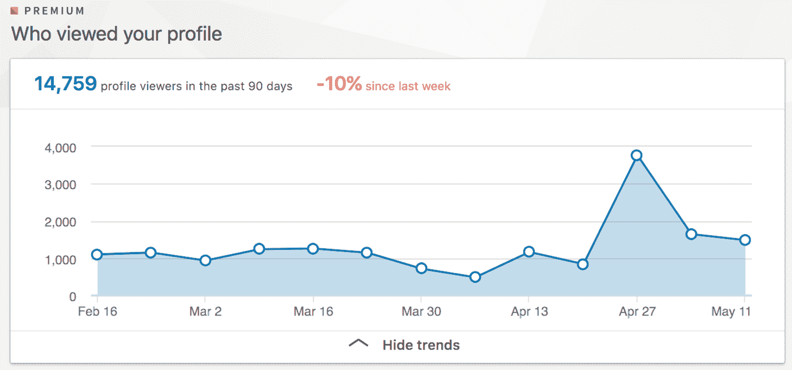***

***如果你想了解更多，[这里有一个链接，链接到我的简介](https://www.linkedin.com/in/abelcak/)。请随时查看我的背景，并与我联系！只要确保发送一个自定义说明与您的连接请求，并提到这篇文章？***

***我还想说明的是，我分享这些数字并不是为了吹牛。我把它们分享给你，让你相信你将要读到的建议会对你有用。***

***我的目标是向您详细介绍我用来获得这些结果的 LinkedIn 个人资料提示，以便您可以自己复制它们！***

***事不宜迟，让我们从一些基础开始:***

## ***提示 1:不要让别人知道你的 LinkedIn 个人资料更新***

***在你开始修改你的 LinkedIn 个人资料之前，有一个关键的框你需要确保你已经检查过了:个人资料隐私。***

***你不希望人力资源部的 Jane 因为看到你最近更新个人资料的 LinkedIn 通知而产生怀疑。***

***幸运的是，LinkedIn 允许你选择允许谁查看你对个人资料的更新。你只需要[点击这个链接](https://www.linkedin.com/psettings/activity-broadcast)，或者进入:设置&隐私【LinkedIn 如何使用你的数据>分享工作变动:***

***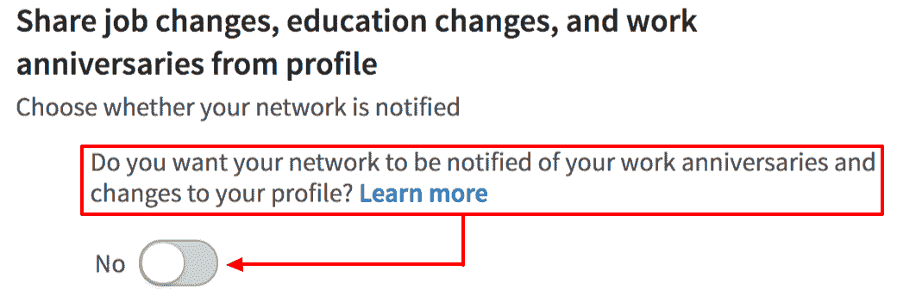***

***现在，你可以把你的 LinkedIn 个人资料变成一台创造就业机会的机器，而不用向你当前公司的任何人通风报信。***

## ***提示 2:让招聘人员知道你对工作持开放态度***

***作为一名求职者，最令人沮丧的事情之一就是在你的简历、求职信或 LinkedIn 个人资料上投入大量时间，却没有得到任何回应。***

***如果没人会看，那么投入这些工作又有什么意义呢？***

***几年前，LinkedIn 旨在通过推出开放候选人功能来解决这一问题。“开放候选人”可以让你告诉招聘人员你对新的机会持开放态度，还可以让你设置你想了解的角色类型的偏好。***

***这里有一些你可以利用的杠杆:***

*******给招聘人员留言:**** 当你打开公开招聘的候选人时，LinkedIn 允许你给招聘人员留言(最多 500 个字符)，这样你就可以提供一些关于你的情况和你下一步想找什么的背景信息。***

*******你的状态:**** 你是主动寻找，被动寻找，还是不寻找但对合适的报价持开放态度？LinkedIn 让你选择以上任何一项，这样招聘人员就能知道你在找工作。***

*******目标角色:**** LinkedIn 还可以让你添加你感兴趣/考虑的职位，这样招聘人员就可以给你发送更多相关的机会。***

*******地点偏好:**** 准备出手了吗？不想离开餐桌超过 10 英尺？“公开候选人”还能让你告诉雇主你希望你的下一个职位在哪里。你可以选择特定的城市，也可以让他们知道你对远程角色感兴趣。***

*******工作类型:**** 最后，公开候选人可以让你告诉招聘人员你想应聘什么类型的职位。你可以选择全职、兼职、合同工、实习生、志愿者或临时工。***

***一旦你设置好了所有的首选项，你需要做的最后一件事就是确保你已经打开了你的候选人开关:***

***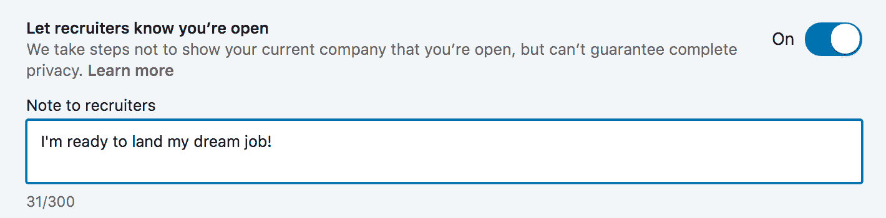***

***厉害！既然我们已经解决了简单的问题，这就是乐趣的开始。***

***仅仅因为你让招聘人员知道你在寻找机会，并不意味着你可以把你的 LinkedIn 个人资料放在 cruise control 上，看着工作机会滚滚而来。你仍在与 5 亿其他用户竞争这份工作，所以你需要尽一切可能脱颖而出。***

***好消息是你来对地方了。这篇文章的其余部分将向你介绍一些 LinkedIn 个人资料的技巧，这些技巧将使你在竞争中脱颖而出，帮助你获得更多的面试机会，与优秀的人联系，并迅速加快你的职业发展。***

# ***LinkedIn 简介提示:从上到下优化***

***现在我们已经了解了基本情况，我将向您展示如何完全优化您的 LinkedIn 个人资料，以帮助您快速获得您想要的结果。***

***当我彻底修改我的个人资料时，我发现最简单的方法是从最高层开始，一步步往下。我把这篇文章的格式设计成遵循同样的流程。***

***我们将从你的 LinkedIn 个人资料页面的最顶端——URL——开始，然后我们将从你的封面照片、个人资料图片、标题、摘要、工作经历、技能、推荐信等开始。直到我们了解了你的每一个侧面。***

## ***技巧 3:使用定制的 LinkedIn 个人资料 URL***

***当您创建帐户时，LinkedIn 会生成一个随机的数字字符串与您的个人资料相关联。你的档案号是 35467984，而不是“亚当·格兰特”。***

***除非你更改它，否则这个随机数就会出现在你的 LinkedIn 个人资料 URL 中，如下所示:***

***https://www.linkedin.com/in/176048168/***

***那不太性感，是吗？当你在找工作时，你的 LinkedIn 个人资料网址将会是你经常用到的。***

***你要把它写进你的简历里(因为最近的一项研究显示，带有 LinkedIn 个人资料链接的简历有 71%的机会得到雇主的回复(T2、T4 和 T5)。***

***你要把它给你联系的人，你也要让它在有人谷歌你的名字时显示出来(你的 URL 在你的个人资料的 SEO 中起作用，帮助它更频繁地出现)。***

***如果你的个人资料链接是一个随机的数字串而不是你的名字，它在你的简历/求职信上看起来会很糟糕，而且人们几乎不可能找到它。***

***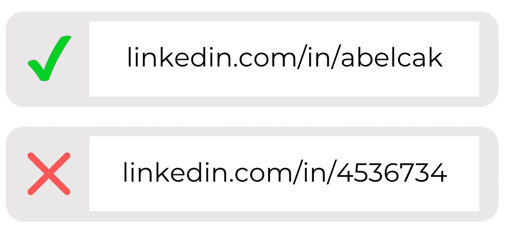***

### ***如何自定义您的 LinkedIn 个人资料 URL***

***好消息是 LinkedIn 允许你自定义你的个人资料网址。你可以进入你的个人资料，点击右边的 ****编辑公共个人资料&网址**** ，然后点击 ****编辑网址**** 。***

***理想情况下，您希望使用全名的某种组合。我的是奥斯汀·贝尔卡，所以这些组合都很棒:***

*   ***linkedin.com/in/austin-belcak***
*   ***linkedin.com/in/abelcak***
*   ***linkedin.com/in/austinbelcak***
*   ***linkedin.com/in/austin-e-belcak(使用中间名的首字母)***

***现在点击保存！***

## ***提示 4:使用高质量的 LinkedIn 个人资料图片，展示一些个性***

***当有人点击你的 LinkedIn 个人资料时，他们首先看到的是你的照片。***

***还不错，对吧？听好了。***

***约克大学的研究人员做了一项关于头像如何影响人们对一个人的看法的研究。他们的结果可能会让你大吃一惊:***

***首先，一个人只需要花 33 毫秒*看一眼你的照片，就能形成第一印象，其中包括对“可信度、地位和吸引力”的评价****

****根据这项研究的首席研究员,“面部印象是相关的……而且是重要的，例如，预测政府选举结果和影响浪漫偏好。”****

****但更可怕的是。一个人在你脸上 33 毫秒的一瞥所形成的第一印象是相当粘的。研究人员发现，更长的观看时间不会改变已经形成的最初印象。****

****这意味着任何查看你个人资料的人——招聘人员、招聘经理、潜在客户等。都是在你的照片出现的那一刻形成的第一印象。****

****你最好让第一印象有价值。****

****这意味着你需要一张出色的、高质量的 LinkedIn 个人资料照片，展示你的一些个性！****

### ****如何拍摄完美的 LinkedIn 个人资料图片(免费)****

****好消息是你可以完全免费得到一个。你所需要的只是一部具有某种肖像模式(或高质量相机)的手机和一个朋友:****

1.  ****等待一个晴朗的阴天，或者找一个阳光直射的地方(阳光直射很刺眼，会让你眯起眼睛)****
2.  ****找一个有很好背景的地方——我个人喜欢城市风景或者像树等自然的东西。****
3.  ****打开相机的肖像模式，拍摄至少 10 张照片(我保证，你会为自己的过火行为感到高兴)****
4.  ****使用编辑软件来增强图像的颜色，并调整它，直到它看起来真棒。****

****当你准备好上传你的新个人资料照片时，请记住 LinkedIn 有一些指导原则:****

### ****指南:LinkedIn 个人资料图片大小****

*   ****LinkedIn 的个人资料图片尺寸为 400 x 400 像素。****
*   ****您的个人资料图片可以大于 400×400，但需要保持方形比例才能被接受。****
*   ****LinkedIn 个人资料图片的最大分辨率为 7680 像素宽和 4320 像素高。****
*   ****LinkedIn 接受 PNG、JPG 和 GIF 文件类型。****
*   ****最大个人资料图片文件大小为 8mb(您可以使用类似于 [CompressPNG](https://compresspng.com/) 或 [CompressJPG](https://compressjpeg.com/) 这样的网站来减小您的图片大小)****

### ****LinkedIn 个人资料图片示例(来自真人)****

****我也提到了在你的 LinkedIn 个人资料图片中注入一些个性。这里有一些在这方面做得很好的人的例子:****

****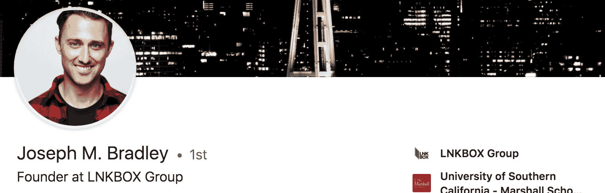****

****约瑟夫的照片非常清晰，很好地展示了他的个性。他不想做太多，他只是做他自己。照片的质量、他的微笑和他的穿着给人一种温暖的第一印象！****

****他还做了一件了不起的工作，把一些对比带到他的封面照片和他的个人资料的其余部分。他的脸和他衬衫上流行的红色抓住了你的注意力，因为它们从其他任何地方的黑白主题中脱颖而出。****

****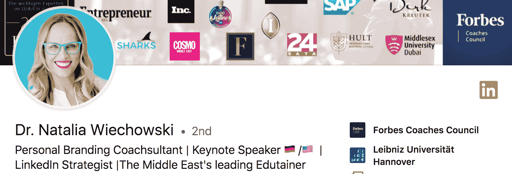****

****Natalia Wiechowski 因其在 LinkedIn 上的亮蓝色品牌而闻名。它出现在她的视频，她的网站，甚至她的脸上！这是一种直接的注意力吸引，让你觉得娜塔莉亚是你想与之交谈的人。****

****她也很擅长选择那些让人联想到幸福、信任和活力的颜色。****

****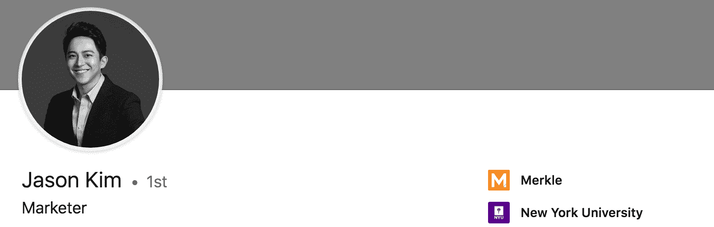****

****就像 Jason 在这里所做的那样，使用黑白滤镜是一个让你与众不同的好方法。请注意，他的图片仍然是高分辨率和高质量的——你需要在使用任何滤镜或附件之前获得正确的效果。****

****这可能看起来像很多信息，但它完全值得。概括一下，一张很棒的 LinkedIn 个人资料照片:****

1.  ****是高质量和高分辨率****
2.  ****符合 LinkedIn 的个人资料图片指南(400×400 像素，大小不超过 8mb)****
3.  ****强调你的脸(用纯色或模糊背景)****
4.  ****传达真实的自我——穿着你喜欢的衣服，穿着你喜欢的颜色，在一个让你快乐的地方****
5.  ****展示你迷人的微笑？****

## ****技巧 5:同样的道理也适用于你的 LinkedIn 封面照片****

****大多数人都知道一张很棒的 LinkedIn 个人资料照片是必须的，但是几乎 **没人** 利用他们的 [LinkedIn 封面照片](https://cultivatedculture.com/linkedin-cover-photo/)！****

***你的封面照片是展示你的个性和成就的绝佳场所。它也比你的个人资料照片大，所以它可能会吸引更多的眼球，帮助你讲述你的故事。***

***数据还显示，与使用默认设置的人相比，使用自定义个人资料图片和封面照片的个人资料查看量多 21 倍，连接请求多 9 倍，消息多 36 倍！***

### ***你应该在你的 LinkedIn 封面照片中使用什么？***

***你的封面照片创造了一个很好的机会来分享你作为一个人和一个专业人士的更多信息。***

***我的建议是分享一些你热爱的东西，或者把你的封面照片作为推销自己的不动产。***

***分享激情的一些例子包括你的照片:***

*   ***在行业活动中展示/发言***
*   ***做志愿者工作***
*   ***参加一项(专业的)爱好，如马拉松跑步、绘画、徒步旅行、教学等。***
*   ***与家人共度时光(每个人都喜欢为家庭奉献的人)***
*   ***旅行***

***如果你想利用这个空间推销你自己，你就要包含一些图形元素，这样你就能确保设计是中肯的。***

***我推荐使用 Canva，因为他们有很棒的预制模板，你可以免费编辑，就像这样:***

***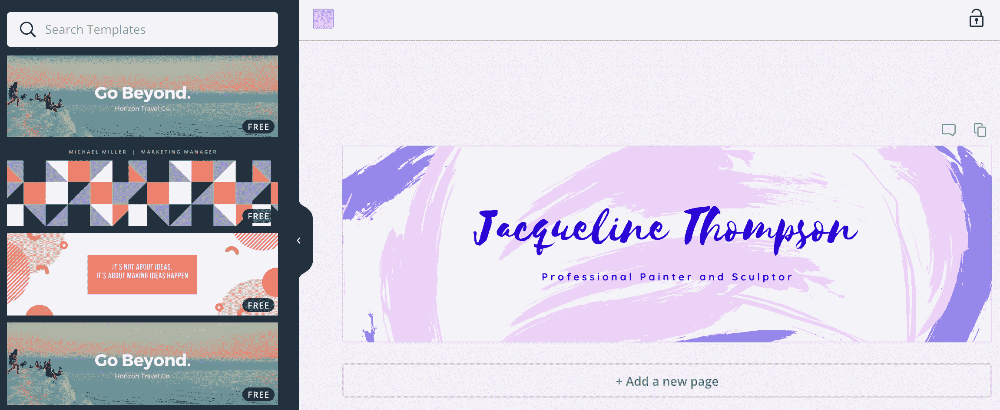***

***一旦你确定了你的模板，你需要决定你想在封面照片中加入什么。我推荐特色:***

*   ***你的电梯间推介和目标用两行或更少的话来表达***
*   ***如果你有个人网站，可以链接到你的个人网站***
*   ***链接到你的作品集，你参与过的项目，或者你的简历***

***如果你想让事情更上一层楼，想办法把 Canva 的牛逼设计和我上面提到的一个激情图像结合起来！***

### ***LinkedIn 封面照片大小和尺寸***

***当你上传你的封面照片时，你需要确保它符合 LinkedIn 的标准，这样它就不会被拒绝。以下是 LinkedIn 的封面照片指南:***

*   ***推荐的封面照片尺寸为 1584 x 396***
*   ***封面照片文件的最大大小为 8 mb***
*   ***LinkedIn 接受 PNG、JPG 和 GIF 文件类型的封面照片***

***除了官方的指导方针，在设计封面照片时，你还需要考虑另一个重要因素:设备类型。***

***当有人在桌面上查看您的 LinkedIn 个人资料时，您的个人资料图片会出现在左侧，并会覆盖在您的封面照片部分:***

******

***但是，当有人在移动设备上查看您的个人资料时，您的个人资料图片将移动到中间，并遮住封面照片的不同部分:***

******

***看看我的脸是如何根据人们使用什么设备查看我的 LinkedIn 个人资料来覆盖封面照片的不同区域的？***

***由于这个原因，我故意在我的封面照片中留出了出版商的标识，这样就可以一直显示其中的四个。我还选择避免将文字放在封面照片的左侧或中间，这样就不会被覆盖。***

### ***LinkedIn 封面照片示例(来自真人)***

***让我们来看看一些真实的人，他们出色地融合了上述所有建议:***

***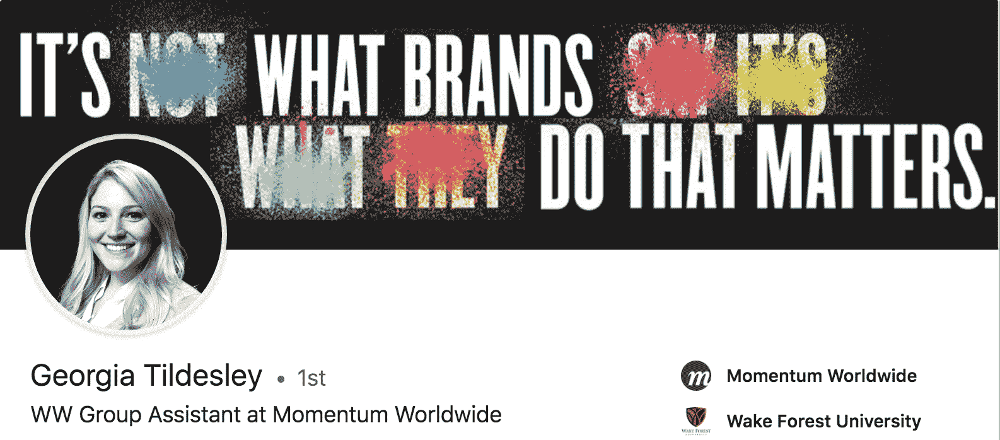***

***乔治亚的封面照片是 ****牛逼**** 。它是独一无二的，它设计得很好，它展示了她的信仰，并且它立即用那些颜色流行和大胆的字体抓住了注意力。***

***她还做了一项出色的工作，将个人资料图片和封面照片中的黑色背景排列起来，创造出一种无缝的美感，保证脱颖而出。这肯定高于你在 LinkedIn 上的平均水平，但努力创造类似的东西是绝对值得的。***

***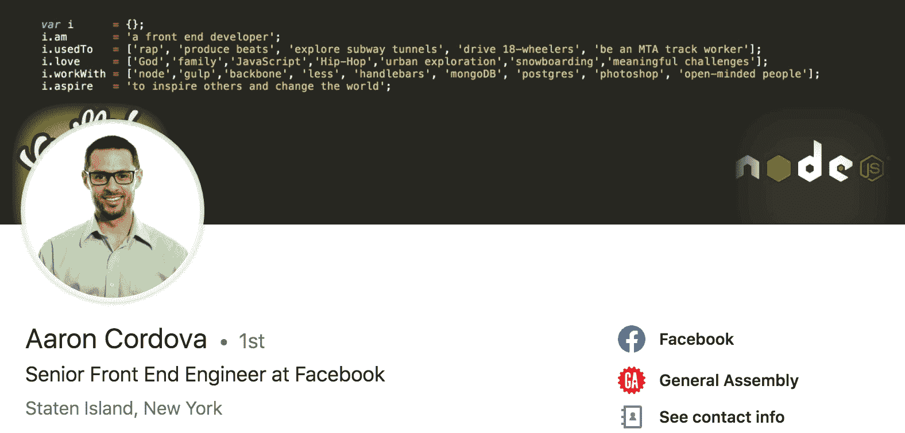***

***在这一部分的开始，我提到了利用封面照片为你的个人资料注入一些个性。亚伦的封面照片就是一个 10/10 的例子。***

***他是一个前端工程师，所以使用代码作为一种手段来传达他的兴趣和能力是超级有创意的。在我滚动之前，我就知道他去过哪里，他喜欢什么，他擅长什么，他的目标是什么。那就是厉害！***

***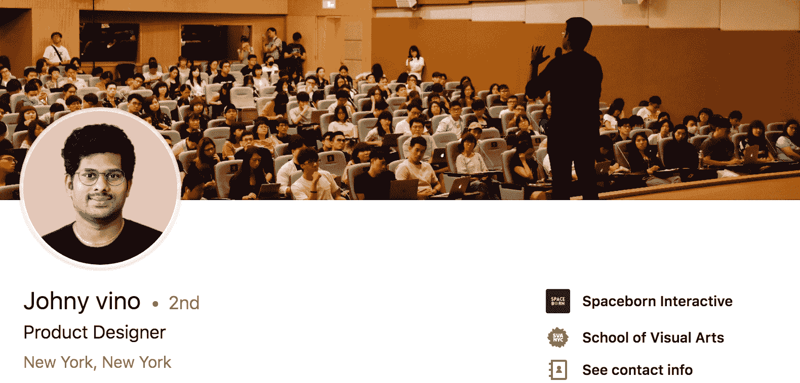***

***张诗钟的封面照片是分享你喜欢做的事情的好例子。演讲是一个很好的选择，但是做志愿者，参加小组讨论，跑马拉松，拍一张你和你家人的照片，或者任何其他符合职业规范的爱好/兴趣也是一个很好的选择。***

***行动中的你的照片是传达更多你喜欢做的事情的绝佳方式。***

***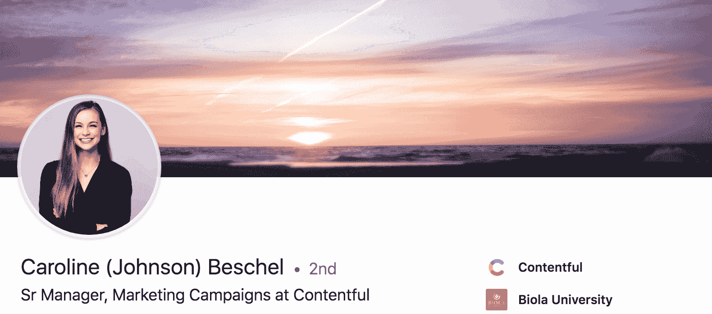***

***最后，不要低估分享给你带来快乐的东西的力量。并不是所有人都在会议上发言，或者有超级创意的方式来表达我们的兴趣，这完全没问题。***

***卡罗琳住在加利福尼亚，她的海滩日落封面照片显示了这对她有多重要。海滩感和她喜气洋洋的个人资料照片也是一个很好的组合——我敢打赌，在你第一眼看到她的个人资料后，你会感到一阵积极的能量！***

***无论是日落，城市的天际线，还是一件艺术品，如果你觉得一幅图像与你的个性对话，你应该分享它！***

## ***技巧 6:优化你的 LinkedIn 标题以获得更多的个人资料***

*****“平均而言，阅读标题的人数是阅读正文的五倍。当你写好标题时，你已经花掉了你一美元中的 80 美分。”——大卫·奥格威，广告之父*****

***这条建议对你的 LinkedIn 个人资料和撰写广告文案同样重要。***

***在今天的就业市场上，90%以上的招聘人员经常使用 LinkedIn 来寻找合格的候选人。***

***当招聘人员在寻找合适的人选时，他们会使用 LinkedIn 的搜索功能来寻找像你这样优秀的人。但是，是什么让你的 LinkedIn 个人资料显示在顶部，而不是类似领域的数百万人呢？这样想吧:***

***假设现在是周六下午 5 点，你不想做饭。你可能会去谷歌，输入“最好的泰国餐馆(你所在的城市)”***

***谷歌提供了一个餐馆列表，你开始浏览他们的产品——他们的菜单、其他人的评论、营业时间、距离等等。然后你根据你最喜欢的选择一个。***

***LinkedIn 搜索也是这样！***

***招聘人员不再搜索泰国菜，而是搜索与他们要招聘的职位相匹配的关键词。***

***例如，如果他们需要新的项目经理，他们可以搜索: ****项目经理、PMP、ACP**** 等。***

***如果他们需要前端开发人员，可以搜索: ****前端开发人员、网页设计师、网页开发人员**** 等。***

***当他们点击“搜索”时，LinkedIn 会扫描个人资料中的相关数据，并为个人资料中符合搜索条件的人提供服务。你的个人资料越符合搜索标准，你的排名就越高。***

***你的 LinkedIn 标题在这些搜索中有很大的权重，所以你需要确保它针对招聘人员使用的搜索词进行了充分优化。***

### ***如何确定你需要在 LinkedIn 标题中使用的关键词***

***这里有一个快速策略，你可以用它来增加你的机会，匹配招聘人员用来寻找你感兴趣的职位候选人的条件:***

1.  ***打开一个新的 Word/Google 文档***
2.  ***使用 [LinkedIn jobs](https://www.linkedin.com/jobs/) 搜索符合你的确切标准(行业、经验水平、地点等)的职位。)***
3.  ***对于符合您兴趣的每个角色，复制职位名称并粘贴到您的文档中***
4.  ***起身重复，直到你在文档中复制了至少 30 个职位***
5.  ***现在头转向[【WordClouds.com】](http://www.wordclouds.com/)，点击 ****字表**** ，然后 ****粘贴/键入文字*******
6.  ***粘贴你的 30 多个职位，点击***

*****Wordclouds 将生成一个云，显示哪些单词在这些标题中出现得最频繁。如果你想要一个更有经验的观点，你可以再次点击 ****单词列表**** 来查看每个单词的确切频率。*****

***前 3-5 个词是你想重点放在你的 LinkedIn 标题中的关键词。***

***下面是我在“纽约”搜索“销售”时找到的 30 个职位的例子:***

******

***如果你看看这个单词列表，下面是出现频率最高的 5 个单词:***

*******16**** 销售
****5**** 执行
****4**** 主管
****3**** 会计
****3**** 经理***

***现在，我可以回到职位名称，围绕词序获取上下文，并想出一个尽可能多地包含这些关键词的标题。在这种情况下，我可能会选择: ****销售总监/客户经理**** 。***

***不过这只是一个起点。LinkedIn 在你的标题中给了你很大的空间，你想尽可能地利用它。***

#### ***LinkedIn 标题字符限制***

***LinkedIn 将桌面上的专业标题限制在 120 个字符以内。如果切换到 LinkedIn 移动应用程序，字符限制增加到 200 个！***

***一旦你知道你要注入什么关键词，你就应该利用你标题的其余部分来推销你自己。这将因你的目标而异，但这里有一些想法:***

*   ***分享一个快速的基于结果的案例研究(分享成就、指标、重大胜利、奖项等。)***
*   ***在标题中分享你的个人网站或在线作品集的链接(如“在此了解更多我是如何做的> CultivatedCulture.com”)***
*   ***包括高优先级技能和熟练程度***
*   ***注入一些个性，谈论一些你在具体工作描述之外喜欢做的事情***
*   ***包括号召人们阅读更多内容([我的个人资料有这个](https://www.linkedin.com/in/abelcak/))。我用我的标题吸引人们，告诉他们在下面用一个向下的表情符号了解更多***

***你应该把你的高优先级关键词放在标题的开头，然后用其余的字符来吸引读者的注意力。***

### ***LinkedIn 标题示例(来自真人)***

***以下是 LinkedIn 标题的几个很棒的例子，可以帮助你获得一些灵感:***

***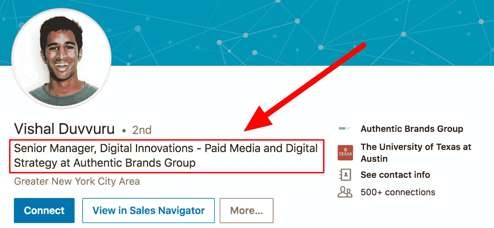***

***Vishal 的关键词标题将会让他在广泛的搜索中受到关注。他以他的头衔(高级经理)开始，并利用他的字符限制的其余部分，包括相关的关键词，如数字创新、付费媒体和数字战略。***

*******Vishal 的 LinkedIn Headline:****Authentic Brands Group 数字创新-付费媒体和数字战略高级经理***

***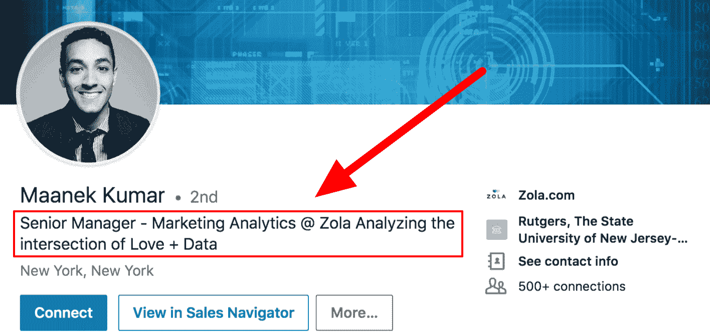***

***Maanek 的标题在关键词引导方面做得很好。他在“高级经理”中有一个可搜索的职位，在“营销分析”中有一个非常受欢迎的领域。他用其他角色为他的工作和他所热爱的事情增添了一点色彩。***

*******马内克领英头条:**** 高级经理——营销分析@佐拉分析爱情+数据的交集。***

******

***虽然凯尔不是求职者，但他有一个很棒的标题，涵盖了上面提到的许多基础。他把高优先级的关键词放在最前面，对他的服务很清楚，提到了社会证明的奖项，还谈到了他对咖啡的热爱。***

*******凯尔的领英头条:**** 事业&生活蔻驰|简历&领英作家|获奖演讲人|咖啡因上瘾者|福布斯教练委员会+CaffeinatedKyle.com***

***作为结束语，我总是注意到企业家和首席执行官往往拥有最好的 LinkedIn 标题。为什么？因为他们总是需要推销自己(最好的人能简洁地做到这一点)。***

***但事实是，不管你知不知道，你都是一名首席执行官。你自己事业和生活的首席执行官。你不仅仅是“公司的客户经理”或“公司的人力资源”***

***你为你的公司、你的顾客、你的同事、你的朋友、你的家庭和你的行业贡献良多。让这一点在你的 LinkedIn 标题中闪耀吧！***

## ***提示 7:识别招聘人员用来寻找候选人的关键词***

***还记得上一篇技巧文章中我的小餐馆类比吗？***

***当在搜索结果中被发现时，标题无疑具有很大的分量，但 LinkedIn 并没有就此止步。他们会扫描你个人资料的每一部分，你找到的匹配项越多，你出现和接到电话的频率就越高。***

***LinkedIn 很棘手，因为我们不能像你用简历那样为多个角色创建多个个人资料。你只有一个档案，你想让它产生尽可能多的机会。为了做到这一点，我们需要了解与我们想要的角色相关的关键字集。***

### ***如何为你的 LinkedIn 个人资料找到合适的关键词***

***为你的整个个人资料确定关键词比为你的标题确定关键词要复杂一点。***

***如果你预算紧张和/或不介意自己做点跑腿的工作，你绝对可以使用我上面提到的同样的 Wordclouds 技巧。***

***也就是说，有一些付费工具可以帮助我们提高效率。我最喜欢的两个工具是 [Jobscan](https://www.jobscan.co/) 和 [Skillsyncer](https://skillsyncer.com/) (我和这两个工具都没有关系，值得注意的是，它们都是有一些免费试用选项的付费工具)。***

***这两个平台都将消化你上传的任何职位描述，并给你一个你需要锁定的关键词的详细分类。您还可以复制并粘贴您的 LinkedIn 个人资料部分，以查看您的匹配程度:***

***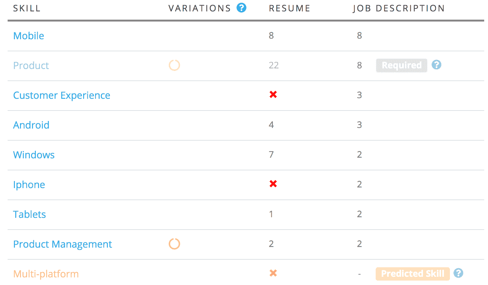***

***如果你浏览了一些你所瞄准的每一类角色的职位描述，这些平台会给你一个主意，你需要优先考虑哪些关键词。***

***你的工作是确保它们自然地融入到我们在这篇文章的其余部分讨论的 LinkedIn 个人资料的每一个部分。***

## ***提示 8:你的 LinkedIn 总结是用来销售的，不是总结的***

***在这一点上，你已经有了令人敬畏的，吸引眼球的图片和一个杀手级的标题，这将吸引任何人看你的 LinkedIn 个人资料。***

***如果他们喜欢他们所看到的，自然下一步就是向下滚动查看你的总结。这是我最喜欢的个人资料部分，因为它给了你大量的创意自由来推销自己！***

***这是你的机会，给一些背景，提供背景，处理异议，突出你的能力，并向这个人展示为什么你是最好的选择，无一例外。***

***很多人对在这里放什么有不同的看法和策略。我将分享一个简单的公式，这是我在求职时看到的结果，也是我和大多数客户使用的公式:***

### ***奥斯汀的求职者 LinkedIn 总结公式***

***我个人推荐一个由三部分组成的总结，包括:***

1.  ***开场白，总结您的经验和价值，同时包括您使用前面章节中的策略确定的相关关键词***
2.  ***几个“案例研究”项目，突出你最大的成就和完成的项目(包括[可衡量的指标/结果](https://cultivatedculture.com/resume-action-words))***
3.  ***最后一两点是关于课外活动或文化活动的(如果相关的话)***
4.  ***关于你对哪些机会感到兴奋以及如何与你联系的结束语(确保包括人们可以联系到你的电子邮件地址！)***

***最后一点是你可以这样说“如果这种机会神奇地出现，我会得到*(眨眼，轻推轻推)”这样招聘人员就能明白你的暗示，而不会对你目前的工作产生怀疑。****

****LinkedIn 给你的总结部分设置了 2000 个字符的限制，所以你要确保尽可能多地使用它(不牺牲质量)。****

### ****一个好的 LinkedIn 摘要示例****

****如果我为新的求职更新了我的个人资料，我会写一份总结来开始这一部分。我目前是微软的合作伙伴开发总监，假设我的目标是合作伙伴经理/合作伙伴总监:****

> ********奥斯丁的 LinkedIn 总结例子********

> ****合作伙伴开发/管理总监，拥有 7 年以上建立 C 级关系的经验，推动超过 2000 万美元的规模增长，并持续超额完成任务。****

> ****+引领 2000 多万美元的渠道合作伙伴增长，包括微软全球业务中两个最大的创收合作伙伴****

> ****+保持了 120%的平均配额完成率，并赢得了微软颁发给全公司前 300 名销售人员的白金俱乐部销售奖****

> ****+发掘、协商激励条款，并接纳 10 家净新渠道合作伙伴，年收入超过 1500 万美元****

> ****+发表在《福布斯》、《商业内幕》、《快速公司》以及更多关于招聘和职业发展的观点和想法****

> ****+职业网站 CultivatedCulture.com 的创始人，这里有 30，000 多名求职者，他们已经在微软、谷歌、亚马逊、苹果等公司找到了工作，而没有在线申请****

> ****“与奥斯汀共事绝对是一种享受。他提供了我们从其他合作伙伴那里得不到的服务水平，我们与他和微软的关系是我们成长和最终收购的主要因素。”–[客户名称，公司]****

> ****我很高兴有机会建立互利的伙伴关系，推动双方关系的发展，特别是在技术/数字领域。想要连接吗？随时给我发电子邮件到 austin@cultivatedculture.com。****

****这份总结包含了一系列关键词，招聘人员在寻找新的合作伙伴主管/经理时会搜索这些关键词。****

****它直接反映了我的经验水平和我所取得的成绩，注意几乎每一颗子弹都有一个与我的行动所取得的成绩相关的数字。****

****我还附上了我的一位客户的“证明”。如果有机会做到这一点，那就是 ****扎实的求职金。**** 越多越好，这些基本都是增加即时可信度的参考。****

****最后，它清楚地说明了我对什么样的机会感到兴奋(也就是说，对什么样的机会开放)，并给人们提供了一个通过电子邮件联系的简单方法！****

## ****技巧 9:利用包含出站链接和媒体的能力****

****LinkedIn 最大的优势之一就是能够在你的个人资料中添加链接和媒体！****

****我从很多求职者那里听到同样的话， **“我觉得没有人看到或理解我的价值。”** 如今就业市场的情绪是 **别跟我说，给我看。添加提及、成就、项目、文章和案例研究的链接正是你要做的。******

### ***如何在你的 LinkedIn 摘要中添加链接和媒体***

***如果你打开你自己的 LinkedIn 个人资料，你会看到一个小铅笔图标一直在右边，就在你的封面照片下面。点击该按钮将打开您的摘要设置，并允许您编辑内容和添加链接:***

******

***进入编辑屏幕后，向下滚动到底部，找到媒体部分(页面的最后一部分):***

***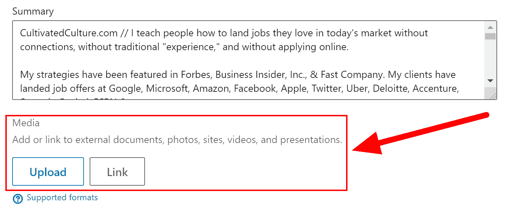***

***您可以在这里添加媒体，这些媒体将出现在您的 LinkedIn 个人资料顶部摘要的正下方(这意味着会有更多人看到它！).***

***你会注意到 LinkedIn 给了你两个添加媒体的选项: ****上传**** 和 ****链接**** 。***

***上传允许您添加保存在计算机上的文档或文件。例如，您是否整理了一套完整的入职流程检查？可以上传！有一个 5 页的竞争分析模板，你一直用它来完成业务？扔进去。***

***您无法链接到的任何内容都可以上传到此处，只要它符合以下文件类型之一:***

*******LinkedIn 媒体上传接受的文件类型*******

*   ***Adobe PDF (.pdf)***
*   ***Microsoft PowerPoint(。ppt/。pps/。pptx/。ppsx/。锅/。potx***
*   ***Microsoft Word(。doc/。docx/。rtf)***
*   ***OpenOffice 演示文稿文档(。odp)***
*   ***OpenOffice 文档(。odt)***
*   ***大多数。txt 文件***
*   ***。jpg/。联合图象专家组***
*   ***。png***
*   ***。位图文件的扩展名***
*   ***。gif–这不支持动画，但是第一帧将被提取***
*   ***。一口***

***添加媒体的另一个选项是链接。***

***对于个人网站、你写的文章、你参与的媒体(播客、文章、视频等)来说，这是一个极好的选择。)、行业特定概要文件(如 Github)等。***

***LinkedIn 将在你的总结中展示最多五个媒体，所以你要让它们有价值！添加更多内容将创建第六个缩略图，该缩略图带有一个计数器，显示还有多少内容可供查看。***

***下面是我的好友亚历克斯的个人资料:***

***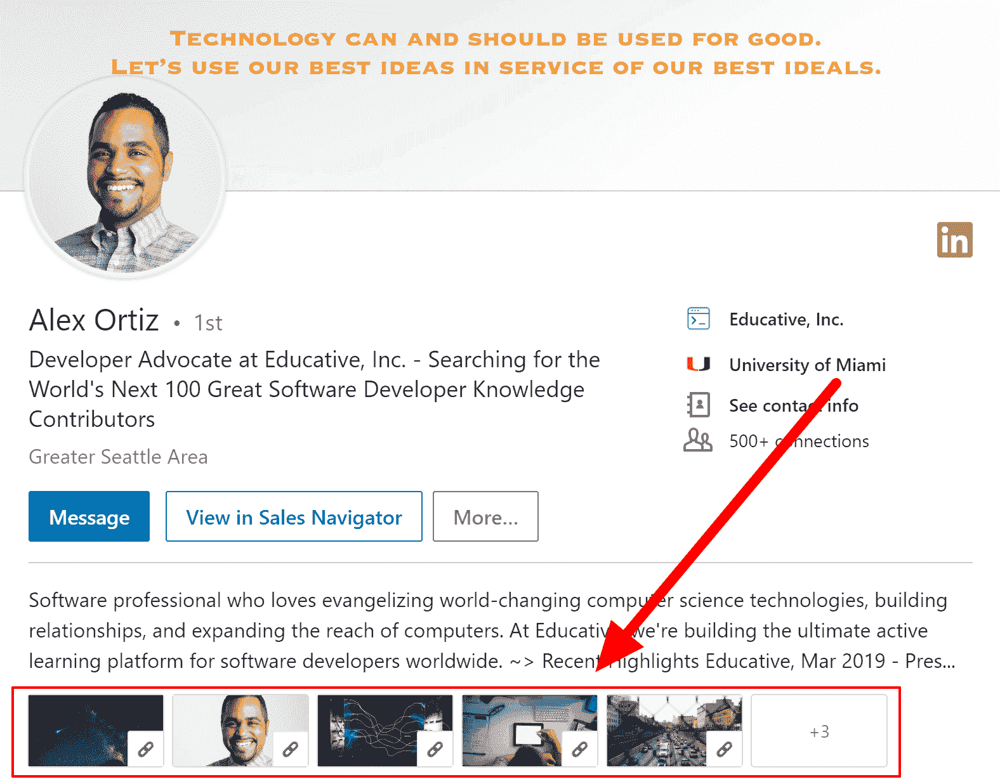***

***在这种情况下，你应该追求质量而不是数量。大多数人最多只看几篇高质量的内容，但不会超过五篇。***

### ***技巧#10:利用文案原则写一个疯狂有效的工作经历部分***

***大多数人认为他们 LinkedIn 个人资料的工作经历部分是他们工作经历的总结，那些人 **非常** 错了。你在 LinkedIn 个人资料里的子弹都是为了做一件事: ****卖**** ****自己！*******

***对我们来说，好消息是人们已经花了一个多世纪来研究文字是如何影响我们的行为和倾向的。这个研究领域被称为文案，如果你曾经在阅读了广告或博客后购买了一件产品或注册了一个电子邮件列表，你就有了第一手的体验。***

***随着我们变得越来越先进，人们保存了更多关于什么最有效的数据。像 [CoSchedule](https://coschedule.com/blog/how-to-write-the-best-headlines-that-will-increase-traffic/#word-balance) 、 [Neil Patel](https://neilpatel.com/blog/the-step-by-step-guide-to-writing-powerful-headlines/) 和 [Buzz Sumo](https://buzzsumo.com/blog/most-shared-headlines-study/) 这样的地方的营销人员已经梳理了数以亿计的数据点，以准确地发现什么样的语言、格式和策略会导致最吸引人的文案(导致更多的流量和更多的钱)。***

***对你来说，好消息是，吸引某人注意力背后的科学不仅仅适用于营销人员，它同样适用于 LinekdIn 子弹！***

***我把营销人员用来产生点击量的所有有研究支持的原则都拿来应用到 LinkedIn 的项目符号和简历中。我保存了这些产品与我们的原始产品相比表现如何的数据，然后我将所有内容浓缩到获得最佳结果的公式中:***

***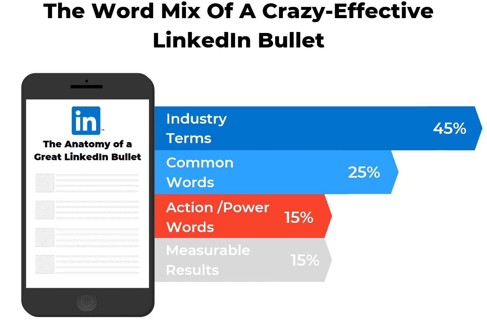***

***在你的工作经历部分，每个角色都应该有你的职责、成就和经验。它们都应该使用上图中的单词 mix 来编写！***

*******LinkedIn Pro 提示:**** 你还可以在你的工作经历部分为个人角色添加链接和媒体。使用我在技巧 9 中提到的相同步骤来添加相关的项目、奖励、案例研究和成就，它们将出现在每个角色下。这是展示你总结中包含的五个材料之外的材料的好方法。***

***最后，确保在你的 LinkedIn 个人资料中包含你所有的 。列出多个职位 ****的简介获得 29 倍的浏览量！*******

## ***提示#11:利用 LinkedIn 的技能部分来增加你的可信度，多露面***

***技能部分是你在 LinkedIn 个人资料中最划算的投资之一。***

***首先，你添加的技能会影响到你个人资料的可搜索性。这些技能就像关键词一样，会帮助你出现在搜索结果的顶部。 ****拥有 5+技能的人比拥有不到 5 技能的人多看到 17 倍的**** 个人资料:***

***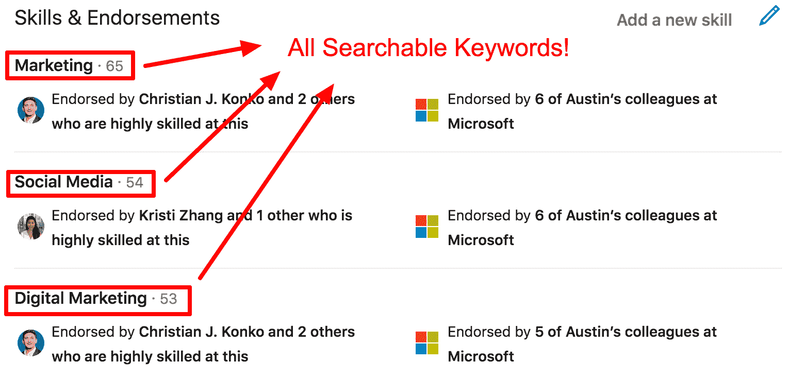***

***第二，技能是很好的社会证明，当雇主决定伸出援手时，这将有助于你获得优势。***

***如果一个雇主正在寻找一个在敏捷方面有丰富经验的项目经理，如果你有来自其他精通框架的人的 30 多条关于敏捷的建议，那么你的简介就是一个直接的合适人选。这增加了你听到回音的机会！***

### ***你可以在你的 LinkedIn 个人资料中添加多少技能？***

***LinkedIn 允许你在个人资料中添加多达 50 项技能。这是 50 个机会，包括关键字和技能，将帮助您显示在搜索结果和土地更多的工作机会！你应该尽可能多地使用它们。***

### ***你应该在个人资料中添加哪些技能？***

***这看起来很简单，但我们希望聪明地对待我们添加到 LinkedIn 个人资料中的技能。***

***当然，我们希望包括我们绝对擅长的技能，但我们也希望包括雇主用来寻找候选人的技能/关键词。***

***还记得我在技巧 7 中提到的 Jobscan 工具吗？我们将在这里再次使用它:***

1.  ***为你感兴趣的角色找到至少 10 个职位描述***
2.  ***去 Jobscan.co，扫描一下每个描述，看看哪些技能出现得最频繁***
3.  ***每次扫描后，将技能添加到 Excel 表格中——将技能放在一列，将它们出现的次数放在第二列***
4.  ***起身重复每一份工作描述，确保你更新了表格中的技能***
5.  ***完成后，按“从大到小”过滤你的 Excel 表格，看看哪些技能出现得最频繁——这些是你想在个人资料中优先考虑的技能！***

### ***如何让你的技能得到认可***

***太好了！现在你的个人资料中增加了一些技能，但如果没有任何支持，这并不意味着什么。***

***高度认可的技能在 LinkedIn 搜索中具有更大的权重，它们在查看你的个人资料的人中也具有更多的社会证明——拥有 5 项以上相关技能 ****的人会多收到 31 倍的消息。*******

*******第一步——朋友&家人*******

***第一个，也是最明显的获得支持的方法是询问你的朋友和家人。这实际上比看起来更有帮助，因为你可以挑选他们认可的技能！***

***没有人会愿意花一个小时来认可 50 项技能(除非你有很棒的朋友)，所以挑选出你希望他们认可的 5-10 项技能。我建议利用你整理的 Excel 表格，关注在工作描述中最常出现的 5-10 项技能。***

*******第二步——背书别人的技能*******

***互惠是一个强大的心理学原则。如果你走出去，认可别人的技能，你很可能会得到认可作为回报！***

***我建议从现在和以前的同事开始。因为你和他们一起工作过，所以很容易做出这些认可，而且这将有助于加强这些关系。***

***当你完成背书后，给他们发一张便条，内容如下:***

*******签后消息*******

> ***嘿[姓名]，***

> ***希望你一切都好！我只是想表扬你，因为我们一起做了一些很棒的工作，所以我在 LinkedIn 上认可了你的一些技能。如果还有什么我能帮忙的，请告诉我。***

> ***最好的，***

> ***[您的姓名]***

***请注意，我并没有要求他们在那张纸条上认可我的技能。这有点破坏了魔法。如果你做得足够多，很多人会明白你的暗示并回报你的帮助。***

## ***提示 12: LinkedIn 的推荐信是求职的黄金，花时间去写吧***

***你上一次大采购是什么时候？***

***你扣动扳机前做了什么？你大概做了一堆调查，看了一些视频，还有… **你看了评论。*****

***[研究显示](https://www.prdaily.com/report-83-percent-say-word-of-mouth-influences-their-purchases/)口碑推荐影响了我们 83%的购买决定。当涉及到你的 LinkedIn 个人资料时，事情并没有太大的不同！***

***推荐是你可以使用的最强大的销售工具之一。它们就像推荐信一样，雇主在与你交谈之前可以先阅读*。如果你的经历看起来不错，而且你的同事都极力推荐你，那么你很有可能会接到更多的电话。****

****好消息是大多数人不会去找他们。他们认为询问建议很奇怪，而且他们不确定当他们询问时应该提供什么样的指导。这意味着大多数人永远得不到它们，如果你愿意投入工作，这对你来说是一个巨大的**机会。******

### ******如何让人们在 LinkedIn 上给你推荐******

******遵循技能建议，最好从你认识的人开始。******

******朋友和工作伙伴(你亲近的同事或前同事)是最好的开始。他们没有相同的姓氏，所以你不会失去信誉，如果他们是以前的同事，他们会有分量，因为他们曾和你一起工作过。******

******你也可以通过给他们一个模板来增加你的机会。人们填写空白要比他们从零开始想出一些东西容易得多:******

**********LinkedIn 推荐模板**********

> ********【描述性短语】**** 是我想到 ****【你的名字】**** 时想到的。我有幸认识了 ****【你的名字】**** 为 ****【时间长短】**** ，期间 ****【工作关系描述】**** 。最重要的是，我对 ****【你的名字】********【让你脱颖而出的东西】**** 的能力印象深刻。当然还有他/她 ****【性格特质】**** 。 ****【你的名字】**** 对于任何需要 ****【职位所需的 1-2 项技能】**** 的职位来说都是真正的财富，我衷心推荐。****

********注意—****模板在个性化调整和适度使用时非常有用。如果你的每一条建议都遵循完全相同的公式，人们会注意到并认为这很奇怪。不要那样做。****

#### ****说到推荐，你给的越多，收到的也越多****

****当你耗尽了你的朋友圈，你应该开始为其他人写推荐信。列出你在以前的公司或项目中接触过的人，养成每天为一个新人写推荐信的习惯。****

****写完后，给他们发一封类似的短信，说你想通过一封推荐信来表彰他们出色的工作。****

#### ****如何在 LinkedIn 上请求推荐****

****还可以向平台上的人发送推荐请求。你需要做的就是:****

1.  ****转到此人的 LinkedIn 个人资料****
2.  ****点击“连接/关注”按钮旁边的“更多”****
3.  ****点击“请求推荐”****

****然后你会被问到你和那个人的关系，你可以留下一个简短的说明来提供一些背景:****

****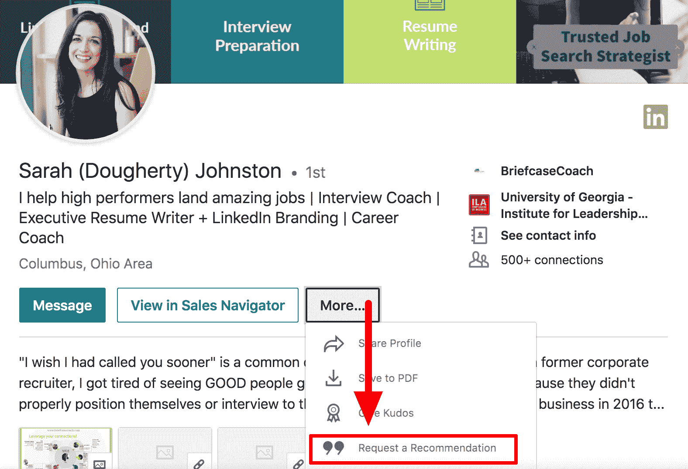****

****最后，要养成一个习惯，在机会还在的时候收集建议:****

*   ****离职？当面问人。****
*   ****完成了一个项目？把上面的模板发给他们。****
*   ****与询问他们如何提供帮助的人一起喝咖啡？你猜对了！****

****如果你将这一点融入你的职业常规，你很快就会获得推荐。****

## ****提示 13:确保你的 LinkedIn 个人资料强度表处于全明星状态****

****当你建立你的个人资料时，LinkedIn 会告诉你你在他们的个人资料强度表上表现如何:****

****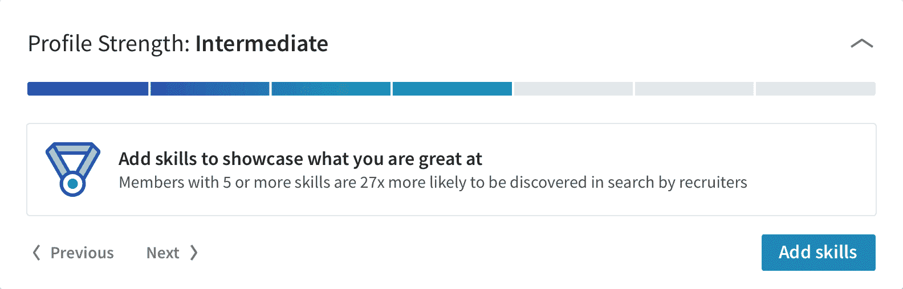****

****LinkedIn 档案有五个强度阶段:初级、中级、高级、专家和全明星。你只需要关心最后一个。****

****为什么？因为所有明星的简介都比其他任何级别的简介更有可能被联系到关于工作机会的****40 倍**** 并且他们在搜索结果中更有可能出现****18 倍。********

****对你来说，好消息是只有 51%的 LinkedIn 用户完整填写了个人资料，所以这是一个非常容易脱颖而出的方法。以下是你获得全明星资格需要做的一切:****

********如何获得 LinkedIn 全明星身份********

1.  ****添加高质量的 LinkedIn 个人资料图片****
2.  ****使用自定义 LinkedIn URL(名字和姓氏有些不同)****
3.  ****添加最新的行业和位置****
4.  ****用相关的经历和关键词定制你的标题****
5.  ****填写你的 LinkedIn 摘要****
6.  ****在你的工作经历部分添加至少三个职位(当前职位+两个先前职位)****
7.  ****将您的学历添加到您的个人资料中****
8.  ****在你的个人资料中添加至少 5 项技能****
9.  ****与 50 多人联系****

****如果你的个人资料符合这些标准，你将成为全明星，并显著提高你在平台上的知名度。****

## ****秘诀 14:成倍增加你在 LinkedIn 上的个人资料曝光率的最好方法是什么？做一个积极的贡献者。****

****在这篇文章的早些时候，我分享了一张我的 LinkedIn 个人资料的截图，在过去的 90 天里，大约有 14，500 次点击。****

****这些观点绝大多数不是来自搜索和个人资料优化，而是来自看到我的评论和帖子的人。****

****针对关键词和搜索优化你的 LinkedIn 个人资料是必须的，但是提高你在 LinkedIn 上的可见性的最简单的方法是参与社区。****

****如果你仅仅依靠搜索和关键词，你的存在将会受到限制，竞争也很激烈。在搜索结果的第一页上有有限的位置，你的个人资料相对于其他 2.5 亿活跃用户而言排名第一的可能性很低。****

****然而，在相同的用户群中，[只有 1.2%](https://www.omnicoreagency.com/linkedin-statistics/) 创建内容(帖子、评论等)。)周刊。招聘人员和雇主在 LinkedIn 上花了很多时间，你在他们的 feed 上发表评论或帖子比祈祷你出现在搜索结果中更有可能引起他们的注意。****

****创作内容也不一定很难。你可以在每天不到 10 分钟的时间内完成。****

### ****10 分钟 LinkedIn 内容策略会让你获得更多的浏览量****

****如果你从未想过在 LinkedIn 上创建内容，那么开始可能会觉得势不可挡，但实际上这比你想象的要容易得多。****

****这里有一个快速的流程，你可以用它来创建内容，每天不到 10 分钟就能获得更多的个人资料:****

********第一步:跟随观点********

****如果你想要更多的可见性，但没有大量的追随者，你需要去有风景的地方。****

****我敢打赌，你已经看过那些来自你所在行业的人的帖子，有几百个赞和评论。这些帖子已经有了成千上万的浏览量，这意味着在这些帖子上留下的任何评论也会出现在那些眼球面前。****

****点击这里查看 Devin 的帖子:****

****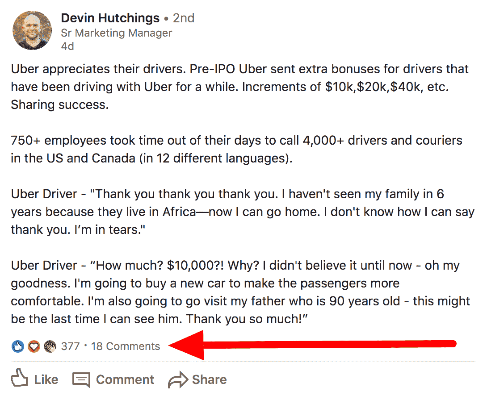****

****它有 377 个反应， ****却只有 18 条评论！**** 这是一个获得关注的巨大机会，因为这篇帖子可能至少有 15000 次浏览(可能是一个低估值)，但它没有太多的评论，这意味着你的帖子更有可能脱颖而出。****

********第二步:留下深思熟虑的评论********

****LinkedIn 上的评论区就像一个投票板——反应、回复和参与最多的评论通常会出现在顶部。****

****如果你是一个有 20，000 次浏览的帖子的最高评论，你可以打赌你的评论会获得相当数量的眼球！****

****对我们来说幸运的是，大多数人在帖子上留下相当低努力的评论。比如，“很棒的建议”，“喜欢这个建议”，“谢谢分享”，等等。虽然这些都很棒，但它们可能不会成功。****

****花几分钟时间起草一份深思熟虑的评论，提出一个问题，分享额外的建议，引发辩论，或加入讨论，更有可能获得喜欢和回复。****

********第三步:组合获得最佳效果********

****你所需要做的就是开始生成更多的剖面图，将以上两个要素结合起来，并使之成为日常习惯。****

****一天中打开几次 LinkedIn，滚动浏览你的订阅源，直到你找到一个吸引人的帖子。****

****一旦你找到一个，读几遍，头脑风暴出一个有思想的评论，加入到对话中，然后张贴出来。****

****这不会花费你超过 10 分钟的时间，如果你每天都冲洗和重复，你的个人资料浏览量将会飙升！****

********专业提示:**** 你越早评论一个最终获得牵引力的帖子越好。在 LinkedIn 上拥有大量追随者的有影响力的人，他们的帖子肯定会有大量的浏览量，所以你需要做的就是关注他们，了解他们的帖子时间，并尽早出现！****

## ****技巧 15:如何使用 LinkedIn 个人资料中的信息找到任何人的电子邮件地址****

****如果你必须把 LinkedIn 的精神归结为一个词，那就是“联系”****

****虽然在平台上与人联系很棒，但你会希望将一些对话带到线下。打电话或亲自见面是真正的奇迹发生和真正的关系建立的地方。****

****LinkedIn 正在增长，但电子邮件仍然是职业界最常见的沟通方式，我的数据显示，电子邮件仍然会带来更好的回复率。****

****但是为了给某人发邮件，你需要他们的地址。以下是找到它的方法:****

1.  ****记下这个人的全名(名和姓)****
2.  ****找到他们公司主页的链接(例如，微软可能是 www.microsoft.com)****
3.  ****转到 [Hunter.io](http://www.hunter.io/)****
4.  ****在产品选项卡下，转到电子邮件查找器****
5.  ****输入您的联系人的全名和他们公司的网址，然后点击搜索！****

****亨特应该给你他们的专业电子邮件地址，以及一个信心指数。这是埃隆的:****

****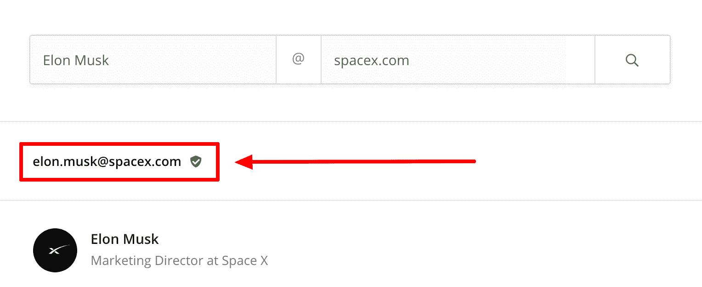****

****接下来，你会想要前往[Mailtester.com](http://www.mailtester.com/)以验证该电子邮件确实存在。****

****如果是的话，你就成功了！那个地址直接指向你想联系的人。只要记得就他们进行宣传，如果在 5 个工作日内没有收到回复，不要忘记跟进。****

## ****最终 LinkedIn 个人资料提示和要点****

****咻，我们刚刚在 15 条 LinkedIn 个人资料提示中涵盖了很多内容。你应该有一个非常坚实的想法，你需要做什么改变和更新你的个人资料！****

****为了有助于总结，以下是关键要点的快速分类:****

1.  ****你在个人资料中添加的信息越多，你的知名度就越高——成为全明星是一个很好的第一目标****
2.  ****理解适用于你的目标角色/行业的主要关键词是很重要的，你可能想从弄清楚这些关键词开始****
3.  ****你的 LinkedIn 个人资料是一个销售页面，而不是一个摘要，所以请确保你写下你的副本，并考虑到这一点****
4.  ****最大化你的可见性的最好方法是成为一个积极的贡献者——从关注你喜欢的人和定期发表评论开始****

****暂时如此，但不会永远如此。随着 LinkedIn 对他们的算法、个人资料布局和他们的总体平台进行修改，我将在这篇文章中添加更多 LinkedIn 个人资料提示。****

#### ****想要一份没有关系，没有“经验”，没有网上申请的梦想工作的内部信息吗？****

****点击此处获取我的学生在谷歌、微软、亚马逊等公司求职时使用的 5 个免费策略，无需在线申请。****