# WWDC 发生了什么

> 原文：<https://www.freecodecamp.org/news/what-went-down-at-wwdc/>

WWDC，如果你不熟悉的话，是苹果的全球开发者大会，他们每年举行一次。今年，苹果宣布了几个突破性的版本，虽然没有完全专注于消费者，但这些版本将帮助开发者和专业人士为他们的用户创造更多身临其境、直观和有趣的体验。尽管如此，这可能是苹果迄今为止最拥挤的活动。

这篇文章将向您简要介绍今年 WWDC 会议的主要发布内容，并帮助您了解发生了什么——即使您没有时间观看主题演讲。然而，如果你有兴趣自己看一遍，你可以在苹果的网站上观看完整的演示以及一周内的各种会议。

#### 目录

*按照链接跳转到各个部分。*

* * *

### tvOS

在蒂姆·库克做了一些开场白后，会议以 tvOS 开始。尽管用户界面有微小的变化，但最新版本的 tvOS 并没有太大的变化。相反，苹果专注于他们的服务，这是他们在今年早些时候的春季特别活动中推出的。

#### 苹果电视+

这项服务将提供网飞风格的流媒体服务，仅将苹果的原创内容作为服务的一部分。在主题演讲中，他们展示了他们原创的 Apple TV+节目之一，其中第一次登月的故事被修改为苏联是第一次，而不是美国。

Trailer Clip from “For All Mankind”

#### 新壁纸

苹果电视上的最新壁纸令人惊叹——它们让你沉浸其中，想知道每个视频是如何以及何时录制的。去年，苹果公司与国际空间站合作，从外太空捕捉高分辨率镜头，但今年，他们正在深入海洋，以潜艇的方式观察水下生物。

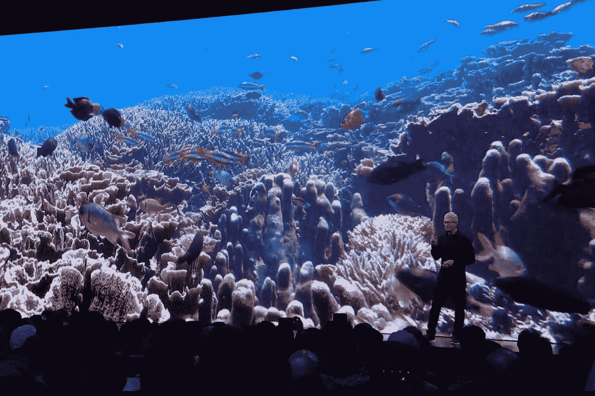

Announcing Submarine Wallpapers for tvOS

* * *

### ios

就像每一个 WWDC 一样，我们有我们最新版本的 iOS——他们没有跳过第十三个数字给那些有恐惧症的人。然而，这一版本不包括 iPad，只适用于 iPhone——稍后会有更多介绍。

#### 深色模式

到目前为止，最受欢迎的功能是黑暗模式。这个期待已久的设置允许大多数应用程序切换到一个漂亮的状态，在这个状态下，菜单、栏和字段变得不那么明显。这使得用户能够获得更加身临其境的内容体验，同时看起来浪费的屏幕空间更少。

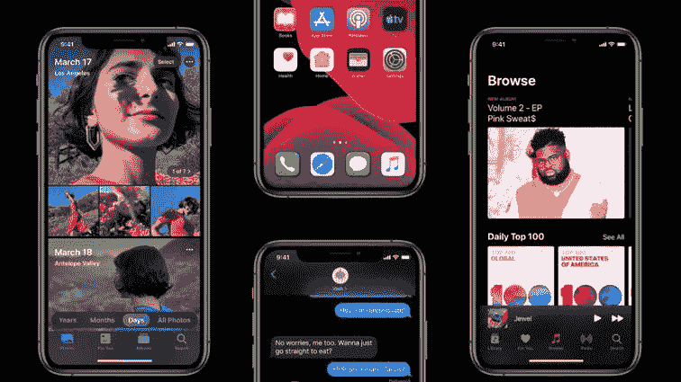

Dark Mode on iOS 13

#### 隐私和数据

虽然苹果一直在寻找新的方法来保护他们客户的数据，但今年，他们允许开发者使用苹果按钮的 [**登录来进一步保护数据。此外，他们要求用户提供几乎所有的*功能*以确保隐私，无论是定位服务、通知还是麦克风接入。**](https://9to5mac.com/2019/06/03/apple-launches-sign-in-with-apple-button-for-apps-no-tracking-login/)

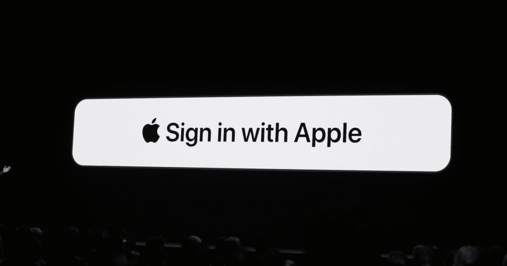

The “Sign in with Apple” Button

#### 梅莫吉

Memojis 一直是一种有趣的、异想天开的通过文本传达情感的方式，但苹果给这些方式带来了前所未有的活力。您现在可以为它们添加妆容，还可以将它们设置为个人资料图片，让您的所有 iMessage 联系人都能看到。

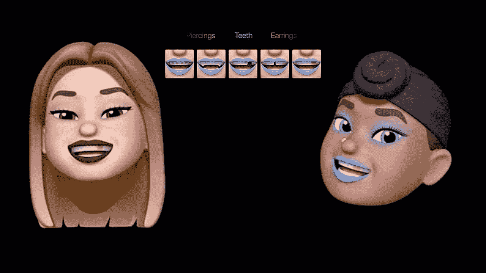

Patrick Starrr and Desi Perkins’ Memojis

#### 地图

在行驶了数百万英里后，苹果公司设法通过[环视](https://appleinsider.com/articles/19/06/07/hands-on-with-ios-13-look-around-in-apple-maps)获得了高分辨率视图，这一功能允许用户在地图上平移，就像他们骑自行车或开车穿过地图一样。虽然尚未完成，但苹果表示他们正在努力帮助其他州和国家获得这一功能。

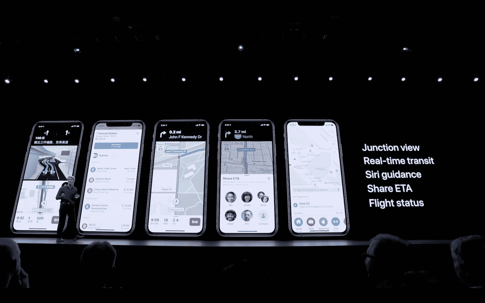

Craig Federighi Announcing Apple Maps Updates

* * *

### iPadOS

虽然仍然与 iOS 共享其底层 DNA，但 iPadOS 利用其一些更独特的硬件功能，为 iPad 提供了新的功能。这使得它更接近苹果的梦想，取代 PC，减少平板电脑。虽然还不是完全的笔记本电脑，但 iPad 现在比以往任何时候都更近了。

#### 桌面级浏览

在更大的变化中，苹果宣布用户现在可以在桌面版网站上使用 Safari。他们以 Google Docs 和 Wordpress 为例，展示了如何利用这一功能，而不受移动网站或应用程序的限制。

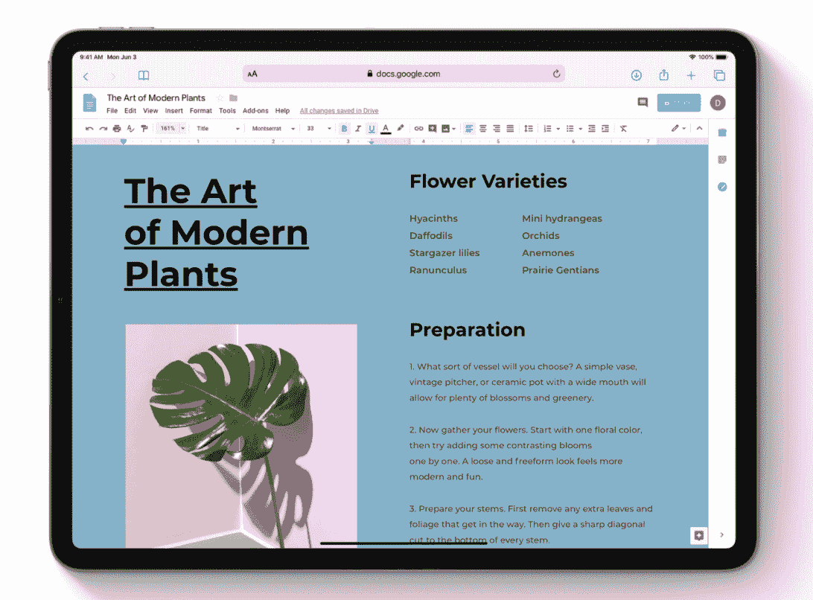

Google Docs Website on iPadOS

#### 铅笔工具包

Apple Pencil 的[有了很大的改进](https://appleinsider.com/articles/19/06/08/apple-pencil-gets-impressive-updates-with-ipados)，延迟从 20 毫秒减少到仅仅 9 毫秒。此外，由于 pencil 有大量的系统工具，开发人员现在可以选择添加他们自己的工具。

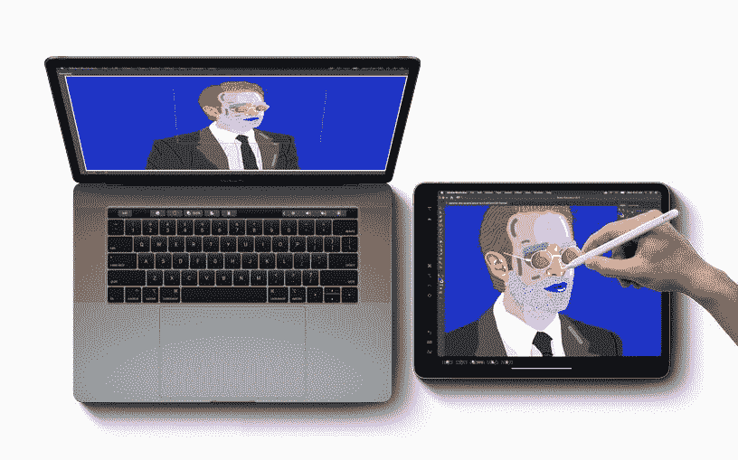

Apple Pencil on Photoshop

#### 边车

不需要任何额外的工具，你现在就可以将 iPad 作为 Mac 的辅助显示器。您也可以将它用作绘图板，在 Mac 上的专业应用程序(如 Photoshop、Illustrator 和 Final Cut Pro)上使用 Apple Pencil。

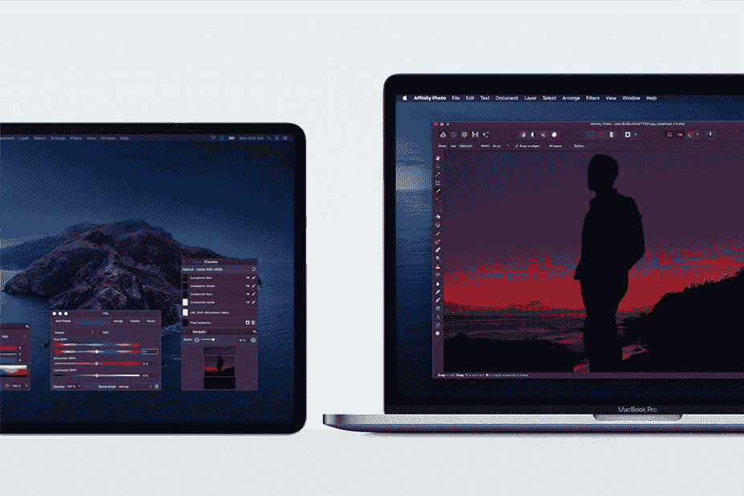

Sidecar with Affinity Photo on iPadOS

* * *

### watchOS

苹果手表已经成为许多人的主食，让他们在一天中更加活跃，并在多年的存在中挽救了许多人的生命。今年，watchOS 让它变得更加强大。

#### 独立应用

以前，Apple Watch 的应用程序需要绑定到 iPhone 的配套应用程序上，但现在，Apple Watch 拥有了自己的应用程序商店，这导致应用程序下载量减少，并赋予了它独立性，使 Apple Watch 可以用于许多应用程序。

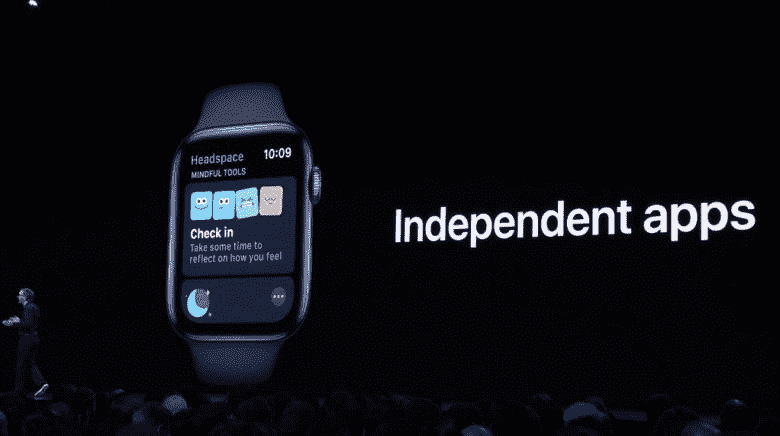

Independence for watchOS Apps

#### 新表盘

谁不想要新的表盘呢？苹果最近更新了列表，增加了一些新的内容，既改善了手表的外观，也改善了功能，这些内容可以用于任何运行最新版本 watchOS 的人。

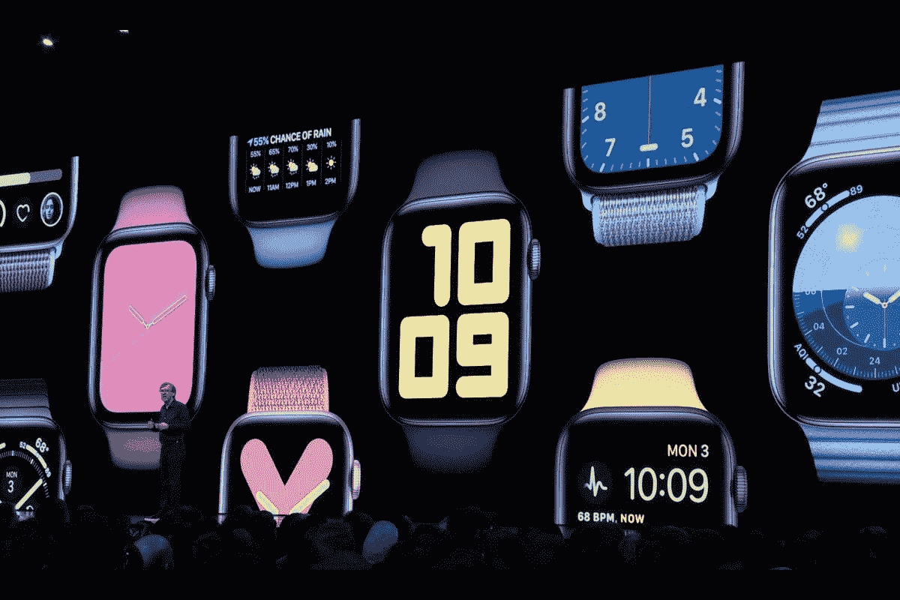

New Watch Faces on watchOS

* * *

### 马科斯·卡特琳娜

越来越接近 iPadOS，macOS Catalina 有几个新功能，其中大部分是以开发人员为中心的，再次帮助他们制作更好、功能更多的应用程序。

#### 项目催化剂

虽然在去年的 WWDC 上有所预示，但苹果今年正式宣布了[项目催化剂](https://www.digitaltrends.com/computing/what-is-project-catalyst/)。由于 macOS 和 iPadOS 之间的潜在相似性，该框架将允许开发者直接将其 iPad 应用作为原生 Mac 应用进行移植。它还允许开发者只需勾选一个框，就可以创建一个跨苹果所有平台的应用。

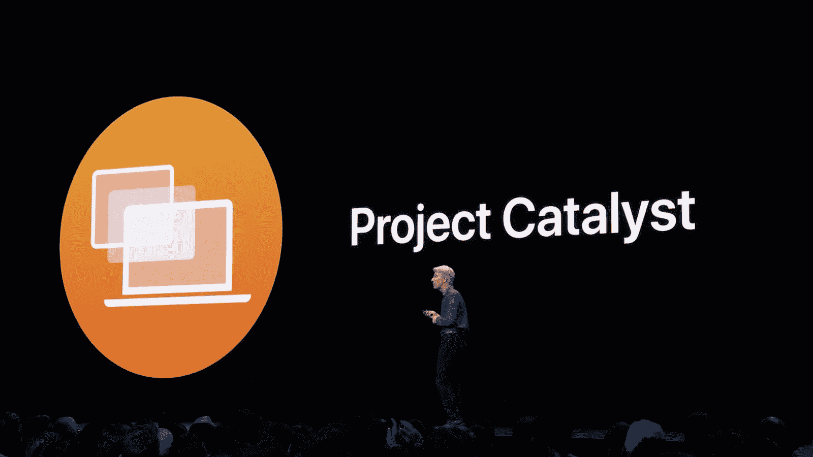

Project Catalyst on macOS

#### 不再有 iTunes

在推出 iTunes 18 年后，它现在被[停产](https://www.bloomberg.com/news/articles/2019-05-31/apple-s-future-ios-13-macos-10-15-watchos-6-tvos-13-mac-pro)——然而，它的核心功能仍然存在。在 Finder 中，你会*找到*(没有双关语的意思)你的 iOS 设备同步工具，在两个新的应用程序中，音乐和播客，你将能够访问你的音乐。

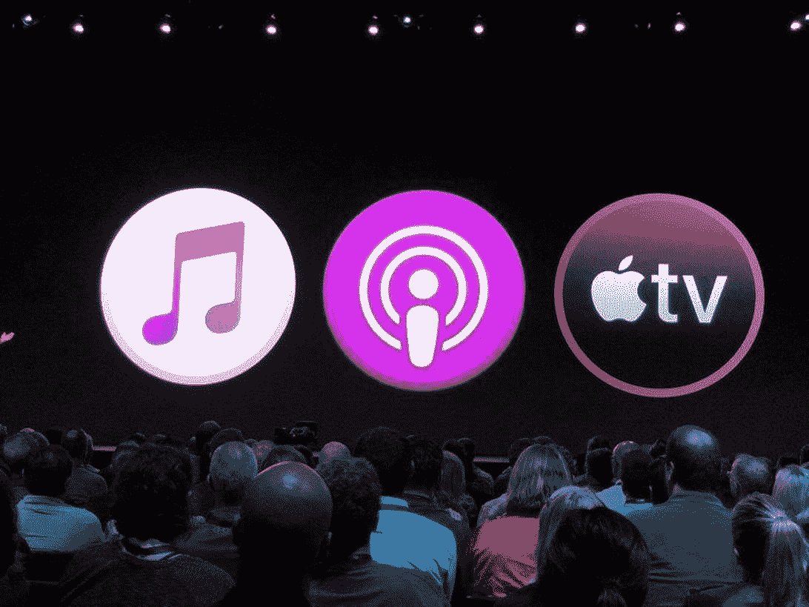

Music, Podcasts, and Apple TV

#### 看电视的时间

去年，屏幕时间是 iOS 的一个非常有用的附加功能，让用户可以随时了解他们使用设备的时间。但是——作为一名开发人员，我发现自己使用 Mac 的次数比使用 iOS 设备的次数多，因此，在 Mac 上拥有这一功能非常好，因为它允许计算机拥有同样的意识。此外，苹果还增加了一些新的家长控制功能，允许家长限制孩子在电脑上的时间。

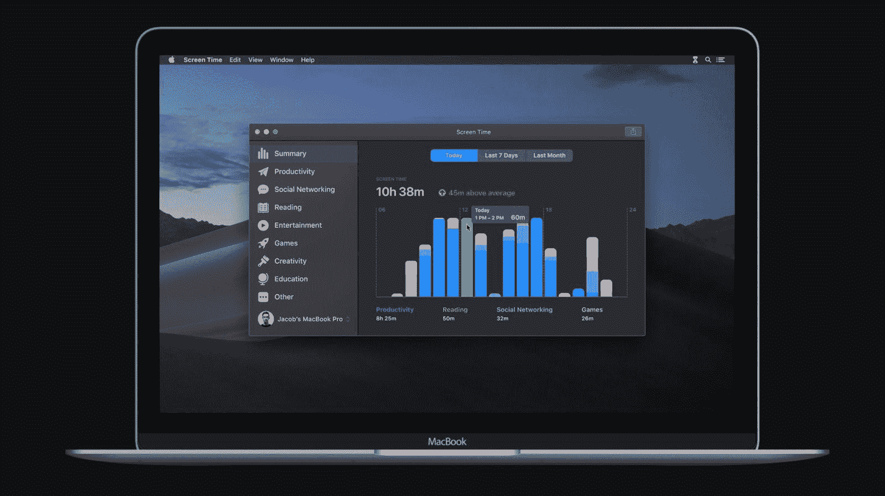

Screen Time on macOS Catalina

* * *

### Mac 给你的

为了与 macOS 保持一致，苹果公司取代了他们五年前的“垃圾桶”Mac Pro，并推出了一款功能强大的新型号，其大小相当于传统的台式机。它允许定制，面向企业级专业人员。

#### 设计

Mac Pro 不再小到可以放在你的桌子上，但反过来，它采用了华丽的铝制框架，具有醒目的通风图案。被互联网人称为“奶酪磨碎机”，这是你一定不能错过的东西。

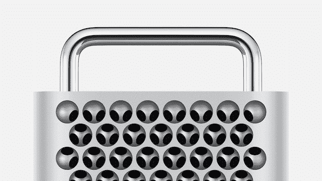

Lattice Ventilation on the New Mac Pro

#### 表演

计算机本身就是一个发电站。通过抬起铝制外壳，您可以从各个角度接触到 Mac 的内部结构，允许您利用 8 个 PCle 插槽，并将其规格配置为高达 28 个核心的处理能力，1.5 TB 的内存，并使用地球上最好的 GPU(而不是 Nvidia)。

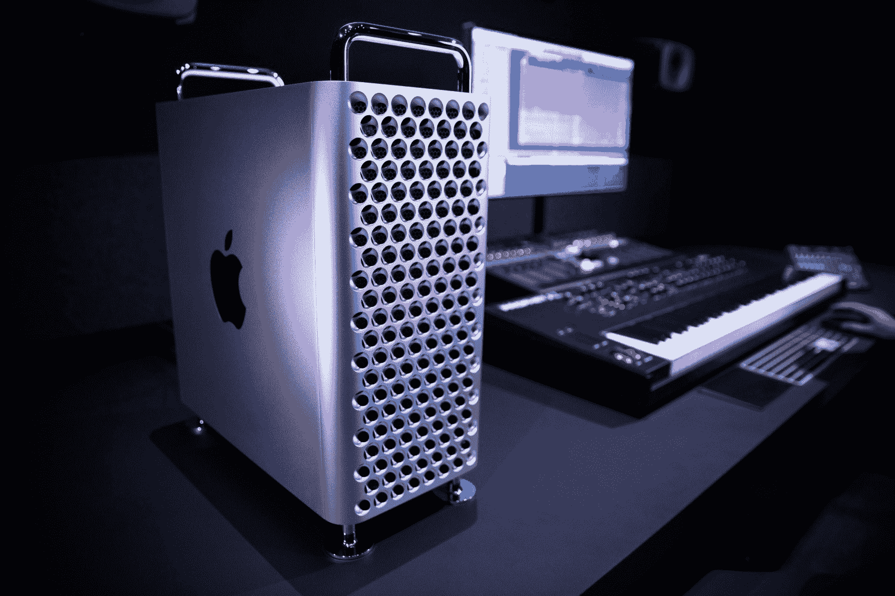

Mac Pro Connected to Professional Rig

* * *

### 专业显示器 XDR

作为 Mac Pro 的“伴侣”，你还可以购买 Pro Display XDR，它同样面向商业级用户。这种显示器在规格表上令人惊叹，当与 Mac Pro 一起使用时，它是一个不折不扣的伴侣。

#### 设计

与 Mac Pro 类似，这种显示器在背面共享类似格子的结构，以冷却令人惊叹的显示器。像往常一样，苹果已经成功地将一款价值 4 万美元的顶级显示器的功能塞进了一个纤薄的无边框外形中，该显示器的重量是 Pro Display XDR 的数倍。

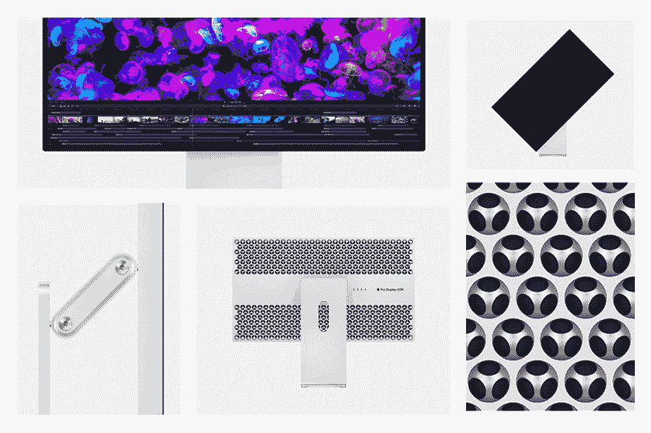

Pro Display XDR from Multiple Angles

#### 表演

这种显示器的亮度至关重要，它可以持续运行 1000 尼特的持续亮度，如果有内容支持，最高可达 1600 尼特。对于全动态范围的色彩，显示器还提供了创纪录的 1000000:1 对比度，并支持 P3 宽色域。

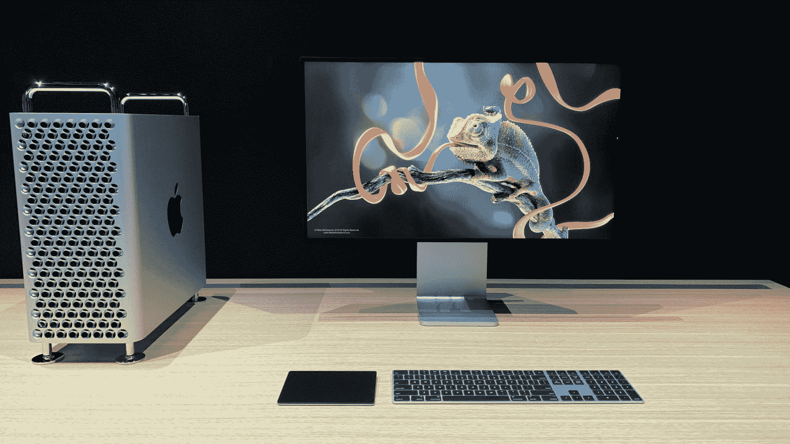

Pro Display XDR and its Wide Color Gamut

#### 增加

苹果不出售任何支架，但对于大多数专业人士来说，他们已经有了一个 VESA 支架。但如果没有，他们可以选择 Pro Stand，由于其过度设计的平衡机制，它允许看似失重的调整。

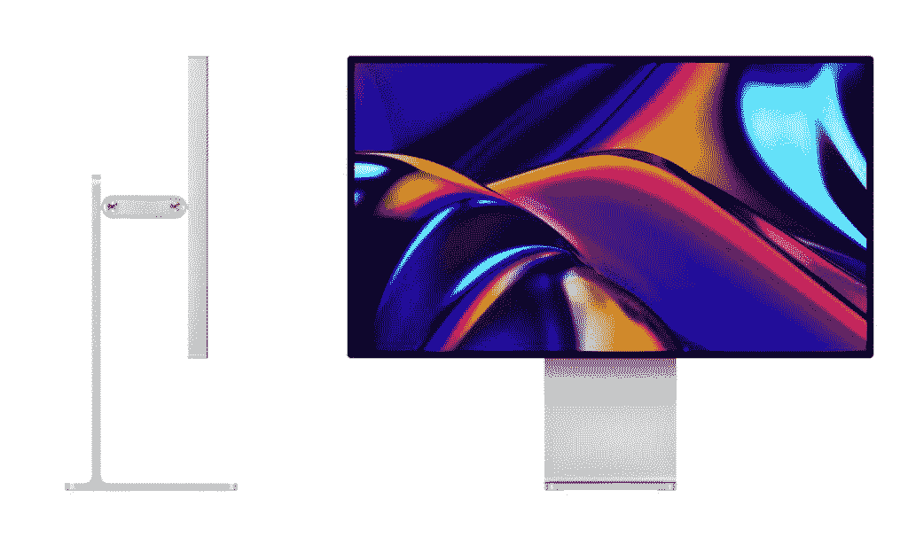

The Pro Mount for the Pro Display XDR

* * *

### 开发者工具

毕竟，WWDC 的目标是“开发者”，所以为了尊重这一点，他们对他们的开发工具、API 和 IDE 做了巨大的改变。其中包括 Core ML、ARKit 和 SwiftUI。

#### 核心 ML 3

几年来，苹果一直是他们的主要机器学习框架，并继续对其进行重要更新。今年，他们引入了对活动分类、图像分割和声音分类的支持，以及对 NLP 任务的扩展支持。现在，只要你运行的是 macOS Catalina，你也可以用一个专门的 Create ML 应用来训练这些模型。

其中一个较大的变化是在用户设备上拥有定制模型的能力，而不需要服务器端的数据库，这意味着模型将根据用户模式进行调整，并且对于每个人的设备都是唯一的。这允许向用户显示个性化的结果，同时仍然保持本地数据处理的私密性。

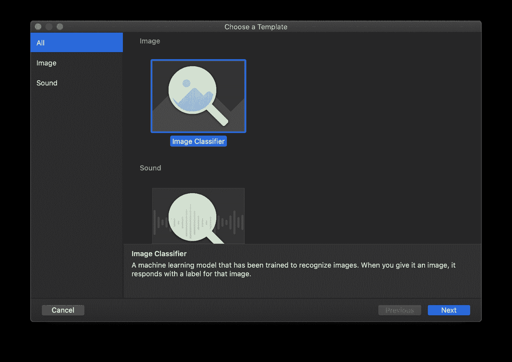

Create ML App for Developers on macOS

#### 图纸集

增强现实在苹果平台上运行良好。今年，效果更好。对于那些没有任何正式 3D 设计经验的人，苹果公司已经宣布了 [Reality Composer](https://developer.apple.com/augmented-reality/reality-composer/) 和 [RealityKit](https://developer.apple.com/documentation/realitykit) ，这两款工具携手合作，允许开发者轻松创建增强现实体验。在代码中，RealityKit 提供了——顾名思义——一种让开发人员应用效果来提高应用程序真实性的方法。

人一直是市场的中心，但现在，这一点比以往任何时候都更加明显。ARKit 今年发布的三大功能是人物遮挡、动作捕捉和同时跟踪多张人脸的能力。这使得开发人员可以创建非常身临其境的体验，因为增强现实内容现在可以看起来在人的身后移动，并且将人的动作映射到线框骨架的能力允许更大的灵活性。以前，人脸检测仅限于一张脸，但现在，开发人员可以同时使用前置和后置摄像头检测多张脸。

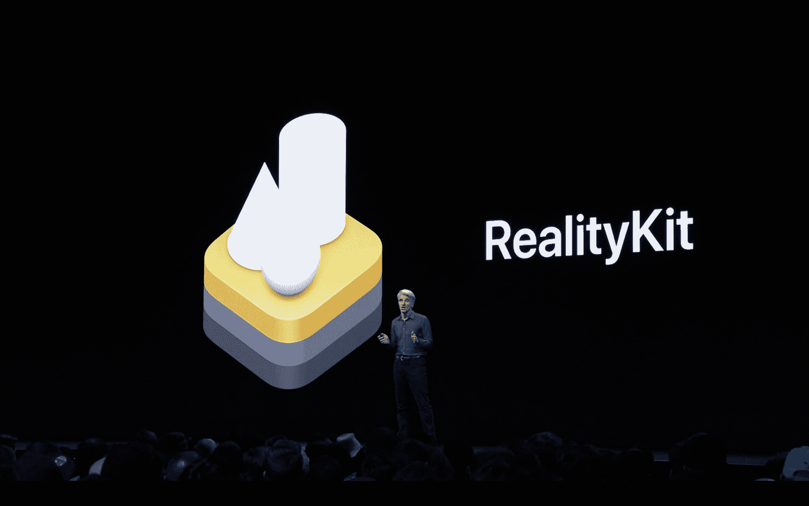

Reality Kit for Easy Augmented Reality Experiences

#### 斯威夫特伊

随着其他伟大产品的发布，苹果公司也推出了一个新的响应和数据驱动的用户界面设计框架。该框架允许开发人员使用新的基于 Swift 的语法来布局他们的应用程序，并让它们在多种设备大小、布局和类型上自然工作。除此之外，他们还增加了“实时预览”应用程序的功能，无需在每次更改时都运行它。

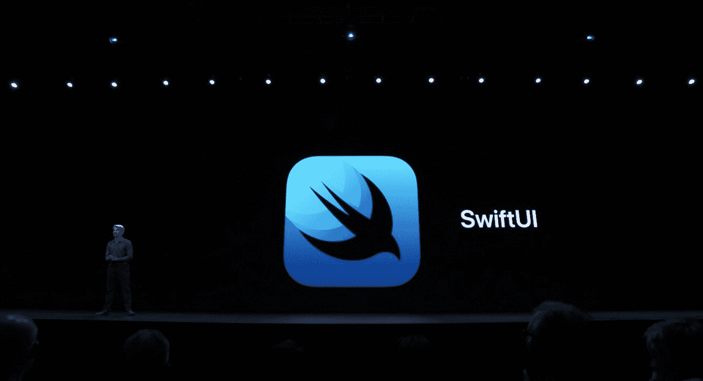

SwiftUI Announced on Stage

* * *

总之，今年的 WWDC 充满了新的特性、产品和开发工具，希望您能通过本文一窥端倪。在这里，请继续关注一些关于最新框架的新教程，并在它们于秋季发布之前抢先使用它们。

一定要在社交媒体上分享这个教程，T2 在推特上关注我。

[**瓦尔丹·阿格拉瓦尔(@vhanagwal) |推特**](https://twitter.com/vhanagwal)
[*瓦尔丹·阿格拉瓦尔的最新推文(@vhanagwal)。完全自学成才的#ios 开发者、#讲师和人类……*twitter.com](https://twitter.com/vhanagwal)