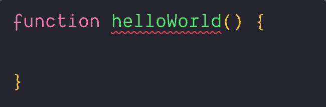

# 如何将标准与 VSCode 一起使用

> 原文：<https://www.freecodecamp.org/news/https-zellwk-com-blog-standard-with-vscode/>

我使用 [Visual Studio 代码](https://code.visualstudio.com/)作为我的文本编辑器。当我写 JavaScript 时，我遵循 [JavaScript 标准风格](https://standardjs.com)。

在 VS 代码中集成标准有一个简单的方法——使用 [vscode-standardjs](https://marketplace.visualstudio.com/items?itemName=chenxsan.vscode-standardjs) 插件。如果你有兴趣的话，我前段时间为此制作了一个视频。但是，如果你按照视频中的说明(或者在 vscode-standardjs 的自述文件中)，你会注意到有一个小细节需要解决。

试着写一个`function`老办法，反复保存。VS 代码将在函数左括号前有空格和没有空格之间切换。



当你用 ES6 方法简写方法时，你会遇到同样的问题:


有一种快速的方法可以解决这个问题。你需要做的是将`javascript.format.enable`设置为`false`。这将禁用 VS 代码的默认 Javascript 格式化程序(并让 vscode-standandjs 完成格式化工作)。

因此，让标准代码和 VS 代码协同工作所需的最低配置是:

```
{
  // Prevents VS Code from formatting JavaScript with the default linter
  "javascript.format.enable": false,

  // Prevents VS Code linting JavaScript with the default linter
  "javascript.validate.enable": false,

  // Lints with Standard JS
  "standard.enable": true,

  // Format files with Standard whenever you save the file
  "standard.autoFixOnSave": true,

  // Files to validate with Standard JS
  "standard.validate": [
    "javascript",
    "javascriptreact"
  ]
} 
```

* * *

*本文原载于[我的博客](https://zellwk.com/blog/standard-with-vscode)。*
*如果你想要更多的文章来帮助你成为一个更好的前端开发者，注册我的[时事通讯](https://zellwk.com/)。*