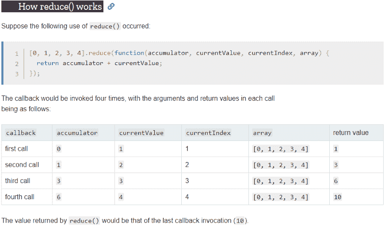

# 如何在 JavaScript 中操作数组

> 原文：<https://www.freecodecamp.org/news/manipulating-arrays-in-javascript/>

任何编程语言的重要部分。大多数时候我们需要在数组上做一些操作，因此有了这篇文章。

在本文中，我将向您展示在 JavaScript [^^]中操作数组的各种方法

### JavaScript 中的数组是什么？

在我们继续之前，您需要理解数组的真正含义。

> **在 JavaScript 中，数组是用来存储不同数据类型的变量。它基本上将不同的元素存储在一个盒子中，以后可以用变量进行访问。**

声明数组:

```
let myBox = [];   // Initial Array declaration in JS
```

数组可以包含多种数据类型

```
let myBox = ['hello', 1, 2, 3, true, 'hi'];
```

可以通过使用几个称为 ****方法的动作来操作数组。**** 这些方法中的一些允许我们添加、删除、修改数组以及做更多的事情。

我将在本文中向您展示一些，让我们开始吧:)

> **NB:我在本帖中使用了 ****箭头功能**** ，如果你不知道这是什么意思，你应该在这里阅读。箭头功能是一个 ****ES6 特征**** 。**

### toString()

JavaScript 方法`toString()`将数组转换成逗号分隔的字符串。

```
let colors = ['green', 'yellow', 'blue'];

console.log(colors.toString()); // green,yellow,blue
```

### 加入()

JavaScript `join()`方法将所有数组元素组合成一个字符串。

它类似于`toString()`方法，但是在这里您可以指定分隔符而不是默认的逗号。

```
let colors = ['green', 'yellow', 'blue'];

console.log(colors.join('-')); // green-yellow-blue
```

### 串联

此方法将两个数组组合在一起，或者向一个数组中添加更多项，然后返回一个新数组。

```
let firstNumbers = [1, 2, 3];
let secondNumbers = [4, 5, 6];
let merged = firstNumbers.concat(secondNumbers);
console.log(merged); // [1, 2, 3, 4, 5, 6]
```

### 推送()

这个方法将项目添加到一个数组的末尾， ****改变**** 原来的数组。

```
let browsers = ['chrome', 'firefox', 'edge'];
browsers.push('safari', 'opera mini');
console.log(browsers); 
// ["chrome", "firefox", "edge", "safari", "opera mini"]
```

### 流行()

这个方法移除数组的最后一项，然后 ****返回**** 它。

```
let browsers = ['chrome', 'firefox', 'edge'];
browsers.pop(); // "edge"
console.log(browsers); // ["chrome", "firefox"]
```

### shift()

该方法移除数组的第一项， ****返回它的**** 。

```
let browsers = ['chrome', 'firefox', 'edge'];
browsers.shift(); // "chrome"
console.log(browsers); // ["firefox", "edge"]
```

### 未移位()

该方法将一个(些)项添加到一个数组的开头， ****改变**** 原始数组。

```
let browsers = ['chrome', 'firefox', 'edge'];
browsers.unshift('safari');
console.log(browsers); //  ["safari", "chrome", "firefox", "edge"]
```

> **也可以一次添加多项**

### 拼接()

这个方法 ****改变**** 一个数组，通过添加、删除、插入元素。

语法是:

```
array.splice(index[, deleteCount, element1, ..., elementN])
```

*   `****Index****` 这里是删除数组中元素的起点
*   `****deleteCount****` 是要从该索引中删除的元素数
*   `****element1, …, elementN****` 是要添加的元素

*****移除物品*****

> **运行 ****splice()**** 后，返回删除了项目的数组，并将其从原数组中删除。**

```
let colors = ['green', 'yellow', 'blue', 'purple'];
colors.splice(0, 3);
console.log(colors); // ["purple"]
// deletes ["green", "yellow", "blue"]
```

> ******NB**** :删除计数不包括范围内的最后一个索引。**

如果未声明第二个参数，则从给定索引开始的每个元素都将从数组中移除:

```
let colors = ['green', 'yellow', 'blue', 'purple'];
colors.splice(3);
console.log(colors); // ["green", "yellow", "blue"]
// deletes ['purple']
```

在下一个示例中，我们将从数组中删除 3 个元素，并用更多的项目替换它们:

```
let schedule = ['I', 'have', 'a', 'meeting', 'tommorrow'];
// removes 4 first elements and replace them with another
schedule.splice(0, 4, 'we', 'are', 'going', 'to', 'swim');
console.log(schedule); 
// ["we", "are", "going", "to", "swim", "tommorrow"]
```

*****添加物品*****

要添加项目，我们需要将`deleteCount`设置为零

```
let schedule = ['I', 'have', 'a', 'meeting', 'with'];
// adds 3 new elements to the array
schedule.splice(5, 0, 'some', 'clients', 'tommorrow');
console.log(schedule); 
// ["I", "have", "a", "meeting", "with", "some", "clients", "tommorrow"]
```

### 切片()

> **这种方法和`splice()`类似但又很不一样。它返回子数组而不是子字符串。**

这个方法 ****复制**** 一个数组的给定部分，并将复制的部分作为一个新数组返回。 ****它不改变原来的阵列。****

语法是:

```
array.slice(start, end)
```

这里有一个基本的例子:

```
let numbers = [1, 2, 3, 4]
numbers.slice(0, 3)
// returns [1, 2, 3]
console.log(numbers) // returns the original array
```

使用 `slice()`的最好方法是将它赋给一个新变量。

```
let message = 'congratulations'
const abbrv = message.slice(0, 7) + 's!'; 
console.log(abbrv) // returns "congrats!"
```

### 拆分()

此方法用于 ****弦**** 。它将一个字符串分成子字符串，并将它们作为数组返回。

语法是这样的:string.split(分隔符，限制)；

*   这里的`****separator****`定义了如何用逗号分割字符串。
*   `****limit****`决定要执行的分割数量

```
let firstName = 'Bolaji';
// return the string as an array
firstName.split() // ["Bolaji"]
```

另一个例子:

```
let firstName = 'hello, my name is bolaji, I am a dev.';
firstName.split(',', 2); // ["hello", " my name is bolaji"]
```

> *******NB:******如果我们声明一个空数组，像这样** *`*firstName.split('');*` *那么字符串中的每一项都会被划分为子字符串** :*

```
let firstName = 'Bolaji';
firstName.split('') // ["B", "o", "l", "a", "j", "i"]
```

### indexOf()

这个方法在一个数组中寻找一个条目，并返回找到它的索引**，否则返回`-1`**

```
`let fruits = ['apple', 'orange', false, 3]
fruits.indexOf('orange'); // returns 1
fruits.indexOf(3); // returns 3
friuts.indexOf(null); // returns -1 (not found)`
```

### **lastIndexOf()**

**该方法的工作方式与 ****indexOf()**** 相同，只是它是从右向左工作的。它返回找到该项的最后一个索引**

```
`let fruits = ['apple', 'orange', false, 3, 'apple']
fruits.lastIndexOf('apple'); // returns 4`
```

### **过滤器()**

**如果数组中的项满足特定条件，此方法将创建一个新数组。**

**语法是:**

```
`let results = array.filter(function(item, index, array) {
  // returns true if the item passes the filter
});`
```

**示例:**

**检查来自尼日利亚的用户**

```
`const countryCode = ['+234', '+144', '+233', '+234'];
const nigerian = countryCode.filter( code => code === '+234');
console.log(nigerian); // ["+234", "+234"]`
```

### **地图()**

**此方法通过操作数组中的值来创建一个新数组。**

**示例:**

**在页面上显示用户名。(基本好友列表显示)**

```
`const userNames = ['tina', 'danny', 'mark', 'bolaji'];
const display = userNames.map(item => {
return '<li>' + item + '</li>';
})
const render = '<ul>' + display.join('') + '</ul>';
document.write(render);`
```

****

**另一个例子:**

```
`// adds dollar sign to numbers
const numbers = [10, 3, 4, 6];
const dollars = numbers.map( number => '$' + number);
console.log(dollars);
// ['$10', '$3', '$4', '$6'];`
```

### **减少()**

**这种方法适用于计算总数。**

******【reduce()】****用于计算基于数组的单个值。**

```
`let value = array.reduce(function(previousValue, item, index, array) {
  // ...
}, initial);`
```

**示例:**

> ****要循环遍历一个数组并将数组中的所有数字相加，我们可以使用 for of 循环。****

```
`const numbers = [100, 300, 500, 70];
let sum = 0;
for (let n of numbers) {
sum += n;
}
console.log(sum);`
```

**下面是如何用`reduce()`做同样的事情**

```
`const numbers = [100, 300, 500, 70];
const sum = numbers.reduce((accummulator, value) =>
accummulator + value
, 0);
console.log(sum); // 970`
```

> ****如果省略初始值，默认情况下*总计*将从数组的第一项开始。****

```
`const numbers = [100, 300, 500, 70];
const sum = numbers.reduce((accummulator, value) => accummulator + value);
console.log(sum); // still returns 970`
```

**下面的代码片段展示了 ****reduce()**** 方法如何处理所有四个参数。**

******来源:MDN Docs******

****

**更多关于 ****reduce()**** 方法及其各种使用方法的见解，可以在这里的[和这里](https://medium.freecodecamp.org/reduce-f47a7da511a9)的[中找到。](https://developer.mozilla.org/en-US/docs/Web/JavaScript/Reference/Global_Objects/Array/Reduce)**

### **forEach()**

**这个方法很适合迭代数组。**

**它对数组中的所有项应用一个函数**

```
`const colors = ['green', 'yellow', 'blue'];
colors.forEach((item, index) => console.log(index, item));
// returns the index and the every item in the array
// 0 "green"
// 1 "yellow"
// 2 "blue"`
```

**迭代可以在不传递索引参数的情况下完成**

```
`const colors = ['green', 'yellow', 'blue'];
colors.forEach((item) => console.log(item));
// returns every item in the array
// "green"
// "yellow"
// "blue"`
```

### **每隔()**

**该方法检查数组中的所有项是否都通过了指定的条件，如果通过则返回`true`，否则返回`false`。**

> ****检查所有数字是否都是正数****

```
`const numbers = [1, -1, 2, 3];
let allPositive = numbers.every((value) => {
return value >= 0;
})
console.log(allPositive); // would return false`
```

### **一些()**

**此方法检查数组中的一个(一个或多个)项是否通过指定的条件，如果通过则返回 true，否则返回 false。**

> ****c **检查是否至少有一个数字为正******

```
`const numbers = [1, -1, 2, 3];
let atLeastOnePositive = numbers.some((value) => {
return value >= 0;
})
console.log(atLeastOnePositive); // would return true`
```

### **包括()**

**此方法检查数组是否包含某一项。它类似于`.some()`，但是它不是寻找一个特定的条件来传递，而是检查数组是否包含一个特定的项。**

```
`let users = ['paddy', 'zaddy', 'faddy', 'baddy'];
users.includes('baddy'); // returns true`
```

**如果没有找到该项，则返回`false`**

* * *

**还有更多的数组方法，这只是其中的一部分。此外，还有大量其他可以在阵列上执行的操作，请尝试查看 MDN 文档[这里的](https://developer.mozilla.org/en-US/docs/Web/JavaScript/Reference/Global_Objects/Array/)以获得更深入的见解。**

### **摘要**

*   ******toString()**** 将数组转换为逗号分隔的字符串。**
*   ******【join()】****将所有数组元素组合成一个字符串。**
*   ******concat**** 将两个数组合并在一起或者向一个数组中添加更多的项然后返回一个新的数组。**
*   ******push()**** 将项目添加到数组末尾， ****改变**** 原数组。**
*   ******pop()**** 删除数组的最后一项， ****返回**** 它**
*   ******shift()**** 删除数组的第一项， ****返回**** 它**
*   ******【unshift()****向数组的开头添加一个项， ****改变原来的数组**** 。**
*   ******splice()****c****hanges****一个数组，通过添加、删除、插入元素。**
*   ******【slice()****复制数组的给定部分，并将复制的部分作为新数组返回。 ****它不改变原来的阵列。******
*   ******split()**** 将一个字符串分割成子字符串，并以数组的形式返回。**
*   ******indexOf()**** 在一个数组中寻找一个项并返回找到它的索引 否则返回`-1`**
*   ******lastIndexOf()**** 从右到左查找一个项目，并返回找到该项目的最后一个索引。**
*   ******【filter()****如果数组中的项满足一定条件，则创建一个新数组。**
*   ******【map()****通过操作数组中的值创建一个新数组。**
*   ******【reduce()****基于数组计算单个值。**
*   ******forEach()**** 遍历一个数组，它对数组中的所有项应用一个函数**
*   ******【every()****检查数组中的所有项是否通过指定的条件，如果通过则返回 true，否则返回 false。**
*   ******some()**** 检查数组中的一项(一个或多个)是否通过指定的条件，如果通过则返回 true，否则返回 false。**
*   ******includes()**** 检查数组中是否包含某项。**

* * *

**让我们把它包在这里；数组是强大的，使用方法来操作它们会创建现实世界应用程序使用的算法。**

**让我们创建一个小函数，将文章标题转换成 urlSlug。**

> ********URL slug**** 是你网站上某个特定页面或帖子的确切地址。****

**当你在 **Freecodecamp News** 或任何其他写作平台上写文章时，你的文章标题会自动转换为一个空字符，字符变成小写，标题中的每个单词由连字符分隔。**

**这是一个基本函数，它使用了我们刚才学过的一些方法。**

```
`const url = 'https://bolajiayodeji.com/'
const urlSlug = (postTitle) => {
let postUrl = postTitle.toLowerCase().split(' ');
let postSlug = `${url}` + postUrl.join('-');
return postSlug;
}
let postTitle = 'Introduction to Chrome Lighthouse'
console.log(urlSlug(postTitle));
// https://bolajiayodeji.com/introduction-to-chrome-lighthouse`
```

**在`postUrl`中，我们将字符串转换成小写，然后我们使用 ****split()**** 方法将字符串转换成子字符串，并在数组中返回它**

```
`["introduction", "to", "chrome", "lighthouse"]`
```

**在`post slug`中，我们用连字符连接返回的数组，然后将其连接到类别字符串和 main `url`。**

```
`let postSlug = `${url}` + postUrl.join('-');
postUrl.join('-') // introduction-to-chrome-lighthouse`
```

**就这样，很简单，对吧？:)**

* * *

**如果你刚刚开始使用 JavaScript，你应该查看这个库[这里](https://github.com/BolajiAyodeji/js-code-snippets)，我正在编译一个基本 JavaScript 片段的列表，范围从**

*   **数组**
*   **控制流**
*   **功能**
*   **目标**
*   **经营者**

**不要忘记明星和分享！:)**

**PS:本文最初发表在我的博客[这里](https://www.bolajiayodeji.com/manipulating-arrays-in-javascript/)**