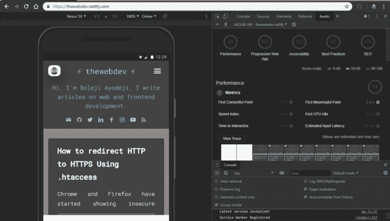
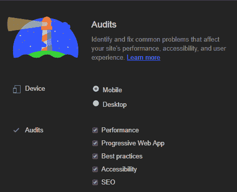
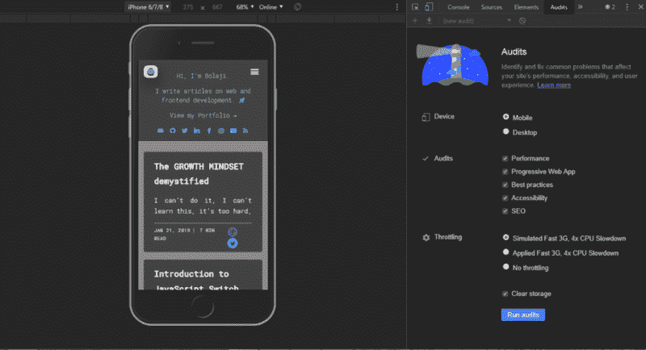

# Chrome 灯塔简介

> 原文：<https://www.freecodecamp.org/news/introduction-to-chrome-lighthouse/>

Chrome Lighthouse 已经有一段时间了，但是如果我请你解释它是做什么的，你能生动地解释吗？

我发现很多 web 开发人员，包括初学者，都没有听说过这个工具，而那些听说过的人，还没有尝试过，这很不酷。

在本文中，我将向您介绍 Chrome Lighthouse，它的功能以及如何开始使用它。

> PS:这篇文章最初发表在我的[博客](https://bolajiayodeji.com/introduction-to-chrome-lighthouse-cjx7x1kwe00367vs1qic3jfoi)上

我们开始吧:)

> **据维基百科介绍，******灯塔***** *是一座塔、建筑或其他类型的结构，旨在从一个由灯具和* [*透镜组成的系统中发出光线*](https://en.wikipedia.org/wiki/Lens_%28optics%29) *并充当* [*助航*](https://en.wikipedia.org/wiki/Navigational_aid) *为* [*海上领航员*](https://en.wikipedia.org/wiki/Maritime_pilot)***

*好吧，让我们把这变成一个技术术语；*

> ***灯塔*是一座塔、建筑或其他类型的结构，旨在从* Chrome 开发者工具*中的【审计】面板*下的系统*中发光，并作为开发者*** 的指南*

有意义吗？:)

嗯，Lighthouse 是谷歌开发的一个工具，它分析网络应用和网页，收集现代性能指标和对开发者最佳实践的见解。

可以把 Lighthouse 想象成汽车中的速度计，它检查和平衡汽车的速度限制。

基本上，Lighthouse 使用开发人员最佳实践和性能指标。它对 web 应用程序进行检查，并为您提供关于错误、低于标准的实践、提高性能的提示以及如何修复它们的反馈。

根据谷歌开发者文档

> **Lighthouse 是一款[开源](https://github.com/GoogleChrome/lighthouse)，提高网页质量的自动化工具。你可以在任何网页上运行它，无论是公开的还是需要认证的。它对性能、可访问性、渐进式网络应用等进行审计。**

> **你可以在 Chrome DevTools 中运行 Lighthouse，从命令行，或者作为节点模块。您给 Lighthouse 一个 URL 来审计，它对页面运行一系列审计，然后生成一个关于页面表现如何的报告。在此基础上，使用失败的审计作为如何改进页面的指标。每个审计都有一个参考文档，解释为什么审计很重要，以及如何修复它。**

这就是 Lighthouse 的全部功能，它审计一个 web 应用程序的 URL，并根据 web 标准和开发人员的最佳实践生成一份报告，告诉您您的 web 应用程序有多好。报告的每一部分还附有文档，解释为什么你的应用程序的这一部分被审计，为什么你应该改进你的应用程序的这一部分，以及如何修复它。

这里有一个灯塔审计报告的演示给这个博客[https://bolajiayodeji.com](https://bolajiayodehi.com/)



L: My blog :) R: Lighthouse audits report

很酷吧？:)

你应该注意的是，我在第一次审计中没有得到这样的高分。我不得不使用我的第一份报告来修复和提高我的应用程序的性能和质量。

这是 Lighthouse 背后的想法，它是为了识别和修复影响你的网站性能、可访问性和用户体验的常见问题。



* * *

现在，我们转到有趣的部分， ****如何入门！！****

LightHouse 有三种工作流程

*   Chrome 开发者工具
*   命令行(节点)
*   Chrome 扩展

我个人更喜欢在开发工具中使用 LightHouse。使用扩展没有意义，因为开发工具和扩展在同一个 chrome 浏览器中工作，我们的偏好不同，使用最适合你的。

Lighthouse 在被添加到 Chrome DevTools 之前，最初只在 Chrome 扩展中可用。

在命令行上使用 lighthouse 也很酷，(对于极客来说:)

*我们开始吧！！！*

* * *

****【1】在 Chrome DevTools** 中运行灯塔**

*   点击下载谷歌 Chrome 浏览器

> **注意，Lighthouse 只能在桌面上运行而不能移动**

*   在谷歌 Chrome 中转到你想审计的网址。

> **你可以审计网络上的任何网址。**

*   打开 Chrome DevTools

```
Command+Option+C (Mac)
Control+Shift+C (Windows, Linux, Chrome OS).
```

*   点击 ****审核**** 面板



左边是将被审计的页面的视窗，这里是我的博客:)。右边是 Chrome DevTools 的 ****审计面板**** ，现在由 Lighthouse 提供支持

*   点击 ****运行审计****

> **DevTools 向您显示审计类别列表。请确保所有选项都处于选中状态。如果你想个性化你的应用程序的审核部分，你可以通过检查你想要审核的类别来设置。**

*   60 到 90 秒后——取决于你的互联网强度，Lighthouse 会在页面上给你一个报告。

> 不是说你的网速和预装的扩展能影响灯塔审计。为了获得更好的体验，请在 [****Icognito 模式下运行审计****](https://support.google.com/chrome/answer/95464?co=GENIE.Platform%3DDesktop&hl=en) 以避免任何干扰

****【2】在命令行运行灯塔****

*   点击下载谷歌 Chrome 浏览器
*   在这里下载节点[，如果你已经安装了，跳过这一步！](https://nodejs.org/en/)
*   安装灯塔

```
npm install -g lighthouse
# or use yarn:
yarn global add lighthouse
```

> **`-g`标志将其作为全局模块安装。**

*   运行您的审计

```
lighthouse <url>
```

样本；

```
lighthouse https://bolajiayodeji.com/
```

默认情况下，Lighthouse 将报告写入一个 HTML 文件。您可以通过传递标志来控制输出格式。

报告可以以 ****HTML**** 或 ****JSON**** 格式显示

输出样本:

```
lighthouse
# saves `./<HOST>_<DATE>.report.html`

lighthouse --output json
# json output sent to stdout

lighthouse --output html --output-path ./report.html
# saves `./report.html`

# NOTE: specifying an output path with multiple formats ignores your specified extension for *ALL* formats
lighthouse --output json --output html --output-path ./myfile.json
# saves `./myfile.report.json` and `./myfile.report.html`

lighthouse --output json --output html
# saves `./<HOST>_<DATE>.report.json` and `./<HOST>_<DATE>.report.html`

lighthouse --output-path=~/mydir/foo.out --save-assets
# saves `~/mydir/foo.report.html`
# saves `~/mydir/foo-0.trace.json` and `~/mydir/foo-0.devtoolslog.json`

lighthouse --output-path=./report.json --output json
# saves `./report.json`
```

为 CLI 选项运行`$ lighthouse --help`

****【3】用 Chrome 扩展**运行灯塔**

正如我之前所说，DevTools 工作流是最好的，因为它提供了与扩展工作流相同的好处，并且不需要安装。

要使用这种方法，你需要安装扩展，但如果你有自己的理由，这里有指南；

*   点击下载谷歌 Chrome 浏览器
*   从 Chrome 网上商店安装 [Lighthouse Chrome 扩展](https://chrome.google.com/webstore/detail/lighthouse/blipmdconlkpinefehnmjammfjpmpbjk)。
*   导航到要审计的页面
*   点击 ****灯塔图标**** 。

> **应该在 Chrome 地址栏旁边。如果没有，打开 Chrome 的主菜单(右上方的三个点)并在菜单顶部访问它。点击后，灯塔菜单展开。**

*   点击 ****生成报告**** 。

> Lighthouse 对打开的页面进行审计，然后打开一个新的标签页，显示结果报告。

答对了。你做到了

* * *

差不多就是这样，Lighthouse 是一个很棒的工具，尤其是对新手来说。

在审计渐进式 web 应用程序时，这是一个非常有用的工具。

实际上，当我开始使用 Lighthouse 时，我学到了很多关于优化和性能标准的知识。您很快就会成为构建全面优化的 web 应用程序的专家，这些应用程序具有出色的性能、可访问性和用户体验。:)

> **灯塔不是魔法，它是人类创造的。它是开源的，欢迎[投稿](https://github.com/GoogleChrome/lighthouse/blob/master/CONTRIBUTING.md)。查看存储库的[问题跟踪器](https://github.com/GoogleChrome/lighthouse/issues)来找到你可以修复的错误，或者你可以创建或改进的审计。issues tracker 也是一个讨论审计指标、新审计想法或任何与 Lighthouse 相关的内容的好地方。**

感谢您阅读本文，安装并使用 Lighthouse 后，请在评论中分享您的成功故事！

> **此外，我刚刚开通了[我的博客](https://bolajiayodeji.com)，在这里我写关于 web 和前端开发的文章，不要忘记访问和分享！！！**