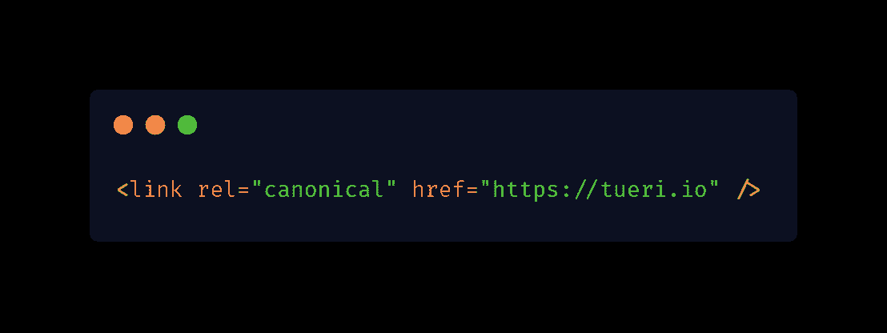
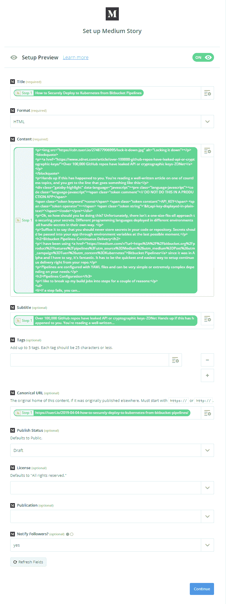

# 如何用 RSS 自动交叉发布你的 GatsbyJS 博客

> 原文：<https://www.freecodecamp.org/news/how-to-automatically-cross-post-from-your-gatsbyjs-blog-with-rss/>

随着最近许多开发者离开[媒体](https://medium.com)，他们现在正在创建自己的 GatsbyJS 博客，然后交叉发布到[媒体](https://medium.com)或者像【freecodecamp.org】和 [dev.to](https://dev.to) 这样的出版物。

交叉发布很费时间，但对增加你个人网站的流量是必要的。让我们看看如何通过向您的个人 GatsbyJS 博客添加 RSS 提要来实现自动化。

## 向您的博客添加规范的 URL

什么是规范的 url？



当发现重复的内容时，规范的 url 告诉搜索引擎哪个页面是主页面或作者页面(即交叉过账)。

让我们安装[Gatsby-plugin-canonical-URLs](https://www.gatsbyjs.org/packages/gatsby-plugin-canonical-urls/)

**快速提示:** `npm i`是`npm install --save`的别名

```
npm i gatsby-plugin-canonical-urls 
```

**注意:**如果你用的是`gatsby-plugin-react-helmet`安装这个插件改为:[盖茨比-插件-反应-头盔-规范-网址](https://www.gatsbyjs.org/packages/gatsby-plugin-react-helmet-canonical-urls/) *

```
npm i gatsby-plugin-react-helmet-canonical-urls 
```

将插件配置添加到`/gatsby-config.js`

```
// In your gatsby-config.js
plugins: [
  {
    resolve: `gatsby-plugin-canonical-urls`,
    // or
    // resolve: `gatsby-plugin-react-helmet-canonical-urls`
    options: {
      // Change `siteUrl` to your domain 
      siteUrl: `https://tueri.io`

      // Query string parameters are inclued by default.
      // Set `stripQueryString: true` if you don't want `/blog` 
      // and `/blog?tag=foobar` to be indexed separately
      stripQueryString: true
    }
  }
] 
```

通过这种配置，插件将在每个页面的头部添加一个`<link rel="canonical" ... />`,例如

```
<link rel="canonical" href="https://tueri.io/2019-04-04-how-to-securely-deploy-to-kubernetes-from-bitbucket-pipelines/" /> 
```

## 安装 RSS 源生成器

我们将使用 [gatsby-plugin-feed](https://www.gatsbyjs.org/packages/gatsby-plugin-feed/) 从我们的博客文章中生成一个 rss 提要。

```
npm i gatsby-plugin-feed 
```

将插件配置添加到`/gatsby-config.js`

```
// In your gatsby-config.js
plugins: [
  {
    resolve: `gatsby-plugin-feed`,
    options: {
      query: `
        {
          site {
            siteMetadata {
              title
              description
              siteUrl
              site_url: siteUrl
            }
          }
        }
      `,
      feeds: [
        {
          serialize: ({ query: { site, allMarkdownRemark } }) => {
            return allMarkdownRemark.edges.map(edge => {
              return Object.assign({}, edge.node.frontmatter, {
                description: edge.node.excerpt,
                date: edge.node.frontmatter.date,
                url: site.siteMetadata.siteUrl + edge.node.fields.slug,
                guid: site.siteMetadata.siteUrl + edge.node.fields.slug,
                custom_elements: [{ "content:encoded": edge.node.html }],
              })
            })
          },
          query: `
            {
              allMarkdownRemark(
                sort: { order: DESC, fields: [frontmatter___date] },
              ) {
                edges {
                  node {
                    excerpt
                    html
                    fields { slug }
                    frontmatter {
                      title
                      date
                    }
                  }
                }
              }
            }
          `,
          output: "/rss.xml",
          title: "Your Site's RSS Feed",
          // optional configuration to insert feed reference in pages:
          // if `string` is used, it will be used to create RegExp and then test if pathname
          // of current page satisfied this regular expression;
          // if not provided or `undefined`, all pages will have feed reference inserted
          match: "^/blog/",
        },
      ],
    }
  }
] 
```

**注意:**这个插件在`production`模式下运行时只会生成`xml`文件！要测试您的提要，运行:`gatsby build && gatsby serve`

我们的 feed 是这样的: [Tueri.io 的 RSS Feed](https://tueri.io/rss.xml)

关于配置 feed 的更多信息，请查看[插件文档](https://www.gatsbyjs.org/packages/gatsby-plugin-feed/)。

## 将 [dev.to](https://dev.to) 连接到您的 RSS 源

1.  登录您的[开发者至](https://dev.to)账户
2.  前往:设置>从 RSS 发布或[https://dev.to/settings/publishing-from-rss](https://dev.to/settings/publishing-from-rss)
3.  添加您的“RSS 源网址”，例如[https://tueri.io/rss.xml](https://tueri.io/rss.xml)
4.  选中“默认情况下将 RSS 源标记为规范 URL”
5.  点击“更新”


## 将 [Medium](https://medium.com) 连接到你的 RSS 源

对于[介质](https://medium.com)的连接并不那么直接，但是使用[扎皮尔](https://zapier.com)就足够简单了。

前往 [Zapier](https://zapier.com) 创建一个免费账户。

### “制造一个 Zap”

1.  选择“RSS”作为你的“触发应用”
2.  选择“提要中的新项目”
3.  粘贴您的“订阅源 URL”
4.  从您的订阅源中选择一个样本。
5.  选择“中”作为你的“行动应用”
6.  选择“创建故事”
7.  授权您的媒体帐户
8.  选择您的字段:确保您选择了规范的 URL
9.  向媒体发送测试
10.  完成并打开你的 Zap



## 结论

确保谷歌通过使用规范的 URL 来给你的内容加分。

我希望这能对你有所帮助，并为你节省大量交叉发布内容的时间！

* * *

*最初发布于[tueri . io](https://tueri.io/blog/2019-06-06-how-to-automatically-cross-post-from-your-gatsbyjs-blog-with-rss/?utm_source=Freecodecamp&utm_medium=Post&utm_campaign=)*