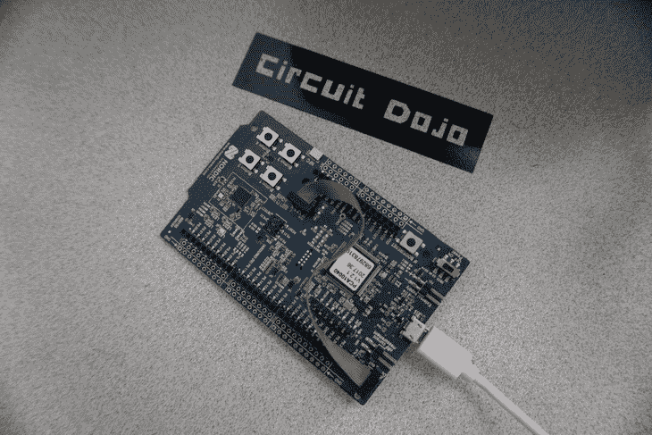

# 更新:用这个有价值的工具改进你的蓝牙项目

> 原文：<https://www.freecodecamp.org/news/improve-your-bluetooth-project-with-this-valueable-tool/>

**本帖最初来自[www.jaredwolff.com](https://www.jaredwolff.com/how-to-define-your-own-bluetooth-low-energy-configuration-service-using-protobuf/)**

关于蓝牙低能耗，最令人困惑的事情之一是数据是如何移动的。根据您的应用，您的设备状态可能相当复杂。这意味着每条数据都有一个单独的端点，这无异于蓝牙自杀。

那么，他的解决方案是什么？

[协议缓冲器。](https://developers.google.com/protocol-buffers/)

协议缓冲区是编码/解码优化的结构化数据的编程方式。它们可以在几乎任何平台上共享和操作。Nordic 实际上在他们的 DFU 服务中使用了它的一个变种。

开头几句话里有许多时髦的词语。希望在这篇文章结束时，你会明白我在说什么。

在本教程中，我将包括完全刷新的示例代码，您可以克隆并立即开始使用。你所需要的只是这些中的一个:



那么，如何使用这个神奇的软件呢？

请继续阅读！

附:这个帖子很长。如果你想下载一些东西，点击这里获得一份格式精美的 PDF 文件。(额外奖励，这个系列的三个部分 PDF 都有！)

## 安装

该过程的第一部分是确保您已经安装了所有正确的实用程序。取决于哪种编程语言将决定您安装和使用什么。在这种情况下，我将概述我在过去使用 C、Go 和 Javascript 的几个项目中使用的实用程序。

是你必须在这里安装的最重要的工具。是 Protobuf“编译器”将你的`.proto`和`.options`文件转换成静态代码。

1.  对于 Mac，请在此下载适当的版本[。](https://github.com/google/protobuf/releases)
2.  解压缩文件夹
3.  运行文件夹中的`./autogen.sh && ./configure && make`
4.  如果出现错误`autoreconf: failed to run aclocal: No such file or directory`，请使用自制软件安装`autoconf`:

`brew install autoconf && brew install automake`

然后，重新运行步骤 3。

1.  然后运行:

```
make check
sudo make install
which protoc 
```

考虑用于协议缓冲区的编译器。它可以直接输出原始文件或库。这是因为它内置了 Go 支持。

原始数据也可以用来为其他语言生成静态库。这通常需要一个(或多个)额外的实用程序。我在下面描述了 Dondi Lib 项目使用的两种方法。

2.  `nanopb`是一个 python 脚本，用于创建编码/解码结构化数据的 C 库。
    它可以通过导航到 [nanopb git repo](https://github.com/nanopb/nanopb) 并下载适当的文件来安装。最重要的部分包括:

3.  `pb_encode.c`、`pb_decode.c`和`pb_common.c`

4.  `/generator/nanopb_generator.py`

5.  和与`nanopb_generator.py`位于同一位置的`/generator/nanopb/`目录

    `nanopb`旨在部署在嵌入式平台上。它不同于`protoc-c`(常规的 C 变体)，因为它是为嵌入式处理器等资源受限的系统而优化的。缓冲区的大小有限。没有内存分配！根据是否有双向通信，您只能导入和使用编码功能或解码功能。

6.  `pbjs`使用`protoc`的输出生成一个静态 javascript 库。这非常强大，因为您可以在任何 javascript 应用程序中使用它。安装`pbjs`的最佳方式是运行:

    ```
    npm install -g protobufjs 
    ```

我在示例代码中稍微简化了这一步。[从克隆此处的 repos 开始。](https://www.jaredwolff.com/files/protobuf/)

## 设置协议缓冲区

创建一个名为`command.proto`的文件。您可以使该文件的内容如下所示:

```
syntax = "proto3";

message event {
  enum event_type {
    command = 0;
    response = 1;
  }
  event_type type = 1;
  string message = 2;
} 
```

乍一看，它可能很陌生，但是一旦你深入了解，它与标准的 C 结构或哈希表并没有太大的不同。

在这个例子中，我使用了两种类型的数据:a `string`和`enum`作为类型。实际上还有一些你可以在[文档](https://developers.google.com/protocol-buffers/docs/proto)中找到。编译时，等效的 c 结构如下所示:

```
/* Struct definitions */
typedef struct _event {
    event_event_type type;
    char message[64];
/* @@protoc_insertion_point(struct:event) */
} event; 
```

其中`event_event_type`是

```
/* Enum definitions */
typedef enum _event_event_type {
    event_event_type_command = 0,
    event_event_type_response = 1
} event_event_type; 
```

您可以随心所欲地在彼此内部嵌套任意多的消息。不过，通常情况下，消息越小越好，因此数据传输效率也越高。这对于资源受限的系统或 LTE 部署尤为重要，在这些系统或部署中，您需要为使用的每兆字节支付*费用。**注意:**当元素未被使用或定义时，它们通常*不*包括在编码协议缓冲区有效载荷中。*

通常，当您创建这样的通用消息时，对字符串`message`的大小没有限制。该选项可以在`.options`文件中设置:

```
event.message	max_size:64 
```

这样，内存可以在编译时在我的微处理器代码中静态分配。如果消息大小大于 64 字节，那么它将在代码中被截断(或者在解码过程中您将得到一个错误)。这取决于您，软件工程师，来计算您可能需要这种类型的数据的绝对最大字节(或字符)数量。

你可以在他们的文档中查看更多与`nanopb`相关的特性。

## 生成适当的静态库

为了使这尽可能简单，我将以下所有代码放入 Makefile 中。当您对协议缓冲区进行更改时，会生成所使用的每种语言的每个库。

如果我们想生成一个静态的 Go 文件，命令应该是这样的:

```
protoc -I<directory with .proto> --go_out=<output directory> command.proto 
```

如果您已经安装了 nanopb 插件，您可以做一些类似的事情来生成 C 代码:

```
protoc -I<directory with .proto> -ocommand.pb command.proto
<path>/<to>/protogen/nanopb_generator.py -I<directory with .proto> command 
```

第一个文件创建一个通用的“对象”文件。第二个实际上创建了静态 C 库。

对于 javascript:

```
pbjs -t static-module -p<directory with .proto> command.proto > command.pb.js 
```

您可以使用上面的`.proto`和`.options`文件示例来测试这些命令。我还将这个手动过程构建到示例存储库中的一个命令中。[在此获取访问权限。](https://www.jaredwolff.com/files/protobuf/)

## 编码和解码


在下面的例子中，我将向您展示如何使用新编译的静态代码！这就是乐趣的开始。

### 使用 Javascript 编码

这里有一个典型的流程，您可以在使用静态生成的 javascript 库时遵循。首先，初始化库。

```
// Import the config message
var protobuf  = require('./command.pb.js'); 
```

然后创建一个`event`的实例:

```
// setup command
var event = protobuf.event.create();
event.type = protobuf.event.event_type.command;
event.message = "This is"; 
```

然后，编译有效负载。即把人类可读的 JSON 转换成打包好的二进制文件。见下文。

```
// make sure it's valid
var err = protobuf.event.verify(event);
if( err != null ) {
   console.log("verify failed: " + err);
   return;
} 
```

如果你的对象格式不正确或者如果你缺少`required`元素，你会在这一步得到错误。我不推荐在定义你的`.proto`文件时使用`required`前缀。对所需元素的任何检查都可以在您的应用程序代码中轻松完成。

最后，最后一步是编码并将其转换为原始字节:

```
// encode into raw bytes
var payload = protobuf.event.encode(event).finish(); 
```

然后你可以使用有效载荷，通过 BLE、HTTP 或其他方式发送它。如果有通信协议，你可以通过它发送这个缓冲区！

### C 语言解码

一旦数据被接收，它就在嵌入式端被解码。`nanopb`令人迷惑。但幸运的是，我这里有一些对您有用的代码:

```
// Setitng up protocol buffer data
event evt;

// Read in buffer
pb_istream_t istream = pb_istream_from_buffer((pb_byte_t *)data, data_len);

if (!pb_decode(&istream, event_fields, &evt)) {
   NRF_LOG_ERROR("Unable to decode: %s", PB_GET_ERROR(&istream));
   return;
}

// Validate code & type
if( evt.type != event_event_type_command ) {
   return;
} 
```

首先，根据原始数据和数据大小创建一个输入流。

然后，使用`pb_decode`功能。您将第一个参数指向输入流。第二个是我们一直在使用的协议缓冲区的定义。它位于`command.pb.h`文件中。

```
/* Defines for backwards compatibility with code written before nanopb-0.4.0 */
#define event_fields &event_msg 
```

最后一个参数是指向要将解码后的数据放入的结构的指针。(在这种情况下，它是在上面的`pb_istream_from_buffer`之前定义的`evt`)。

### C 语言编码

现在让我们说，我们要回复上面刚刚解码的消息。所以现在我们必须创建数据，对其进行编码并将其发送回去。流程是这样的:

```
// Encode value
pb_byte_t output[event_size];

// Output buffer
pb_ostream_t ostream = pb_ostream_from_buffer(output,sizeof(output));

if (!pb_encode(&ostream, event_fields, &evt)) {
   NRF_LOG_ERROR("Unable to encode: %s", PB_GET_ERROR(&ostream));
   return;
} 
```

首先创建一个缓冲区，用来保存协议缓冲区占用的最大字节数。这在你的`command.pb.h`里也有定义。在这种情况下，`event_size`被设置为`67`。然后，类似于 decode 命令，创建一个流并将其连接到缓冲区。最后，通过将您的`evt`结构与流和`event_fields`一起指向，对数据进行编码。

只要`pb_encode`返回无误，编码后的数据已经写入`output`！该结构可以是可变长度的，所以发送时最好的处理方式是从`ostream`获取`bytes_written`:

```
NRF_LOG_INFO("bytes written %d",ostream.bytes_written); 
```

## 结论

很高兴你来了！我希望您开始掌握协议缓冲区的力量。别担心，我花了点时间才想明白。您也可以成为协议缓冲大师！？

如果您对协议缓冲区不太满意，还有其他选择。我在以前的产品上使用过 [MessagePack](https://msgpack.org) 并取得了一些成功。它很简单，并且对大多数编程语言都有大量的支持。

如果你对如何将它融入蓝牙低能耗项目感兴趣，请继续关注第二部分。在第二部分中，我将向您展示如何建立一个非常简单的蓝牙服务和特性，它将用于来回传输我们新编码的数据。

此外，如果您想查看所有运行中的代码，您可以在这里下载所有内容。