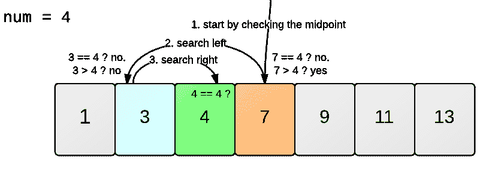
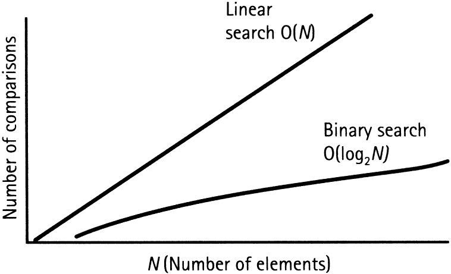

# 算法时间复杂性导论

> 原文：<https://www.freecodecamp.org/news/time-complexity-of-algorithms/>

在计算机科学中，算法分析是非常关键的一部分。找到解决问题的最有效的算法是很重要的。有可能有许多算法来解决一个问题，但这里的挑战是选择最有效的一个。

现在的问题是，如果我们有一套不同的算法，我们如何识别最有效的算法？在这里，算法的空间和时间复杂性的概念就产生了。空间和时间复杂度充当算法的度量尺度。我们根据算法的空间(内存量)和时间复杂度(运算次数)对算法进行比较。

一个算法在执行时使用的计算机内存总量就是该算法的空间复杂度。在本文中，我们将不讨论空间复杂性(为了使本文简短一点)。

## 时间复杂度

因此，时间复杂度是算法完成任务所执行的操作数量(考虑到每个操作花费的时间相同)。就时间复杂性而言，以最少数量的操作执行任务的算法被认为是最有效的算法。但是，空间和时间复杂性也会受到操作系统和硬件等因素的影响，但我们不在此讨论范围内。

现在，为了理解时间复杂度，我们将举一个例子，在这个例子中，我们将比较用于解决特定问题的两种不同的算法。

问题是寻找。我们必须在一个数组中搜索一个元素(在这个问题中，我们假设数组是按升序排序的)。为了解决这个问题，我们有两种算法:

1.[线性搜索。](https://www.hackerearth.com/practice/algorithms/searching/linear-search/tutorial/)

2.[二分搜索法。](https://www.hackerearth.com/practice/algorithms/searching/binary-search/tutorial/)

假设数组包含十个元素，我们必须找到数组中的数字十。

```
const array = [1, 2, 3, 4, 5, 6, 7, 8, 9, 10];
const search_digit = 10;
```

**线性搜索**算法会将数组中的每个元素与 ****search_digit** 进行比较。**当在数组中找到 ****search_digit**** 时，返回 ****true**** 。

现在让我们统计一下它执行的操作次数。这里，答案是 10(因为它比较数组的每个元素)。因此，线性搜索使用十次运算来寻找给定的元素(这是这个数组的最大运算次数；在线性搜索的情况下，这也被称为算法的[最坏情况](https://www.geeksforgeeks.org/analysis-of-algorithms-set-2-asymptotic-analysis/)。

一般来说，线性搜索在其最坏的情况下会采取 ****n**** 的运算次数(其中 ****n**** 是数组的大小)。

让我们检查一下这种情况下的**二分搜索法**算法。

通过这个例子可以很容易理解二分搜索法:



来源: [Learneroo](https://www.learneroo.com/modules/71/nodes/399)

如果我们尝试将这个逻辑应用于我们的问题，首先我们将比较****【search _ digit】****和数组的中间元素，即 5。现在既然 5 小于 10，那么我们就开始在数组中寻找 ****search_digit**** 中大于 5 的元素，以同样的方式直到我们得到想要的元素 10。

现在，试着数一数二分搜索法寻找所需元素的运算次数。大约花了四次手术。这是二分搜索法最糟糕的情况。这表明在执行的操作的数量和数组的总大小之间有一个[对数](https://www.khanacademy.org/math/algebra2/exponential-and-logarithmic-functions/introduction-to-logarithms/a/intro-to-logarithms)关系。

基数为 2 的运算次数= log(10) = 4(近似值)

 *我们可以将二分搜索法的这一结果概括为:

对于一个大小为 ****n**** 的数组，二分搜索法执行的运算次数为: ****log(n)****

## 大 O 符号

在上面的语句中，我们看到对于一个大小为 ****n**** 的数组，线性搜索会执行 ****n**** 操作来完成搜索。另一方面，二分搜索法执行了****【log(n)****次运算(两者均为最坏情况)。我们可以用一个图来表示这个( ****x 轴**** :元素个数， ****y 轴**** :运算个数)。



来源: [Techtud](https://www.techtud.com/computer-science-and-information-technology/algorithms/searching/binary-search)

从图中可以很清楚地看出，线性搜索的复杂度增加的速度比二分搜索法快得多。

当我们分析一个算法时，我们用一个符号来表示它的时间复杂度，这个符号是大 O 符号。

例如:线性搜索的时间复杂度对于二分搜索法可以表示为 ****O(n)**** 和 ****O(log n)**** (其中， ****n**** 和 ****log(n)**** 为运算次数)。

下面列出了一些流行算法的时间复杂度或大 O 符号:

1.  二分搜索法:O(登录号)
2.  线性搜索:O(n)
3.  快速排序:O(n * log n)
4.  选择排序:O(n * n)
5.  旅行售货员:O(n！)

## 结论

如果你还在读这篇文章，我真的很感谢你的努力。现在，你一定在想——为什么理解时间复杂性如此重要？

我们知道，对于少量的元素(比如说 10 个)，二分搜索法和线性搜索所执行的操作数之间的差异并不是很大。但是在现实世界中，大多数时候，我们处理的问题都有大量的数据。

例如，如果我们有 40 亿个元素要搜索，那么，在最坏的情况下，线性搜索将需要 40 亿次操作才能完成任务。二分搜索法将在仅仅 32 次手术中完成这项任务。这是一个很大的区别。现在让我们假设，如果一个操作需要 1 毫秒完成，那么二分搜索法将只需要 32 毫秒，而线性搜索将需要 40 亿毫秒(这是大约。46 天)。这是一个显著的差异。

这就是当涉及到如此大量的数据时，研究时间复杂性变得重要的原因。

## 资源

[搜索算法-Aditya Y Bhargava](https://www.manning.com/books/grokking-algorithms)

[大 O 符号和时间复杂度介绍——CS Dojo](https://youtu.be/D6xkbGLQesk)*