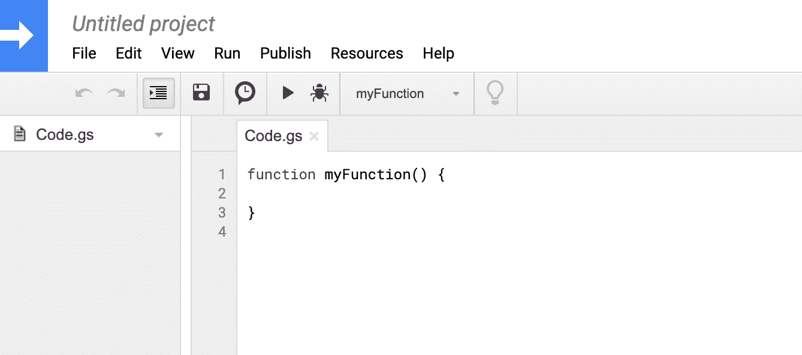
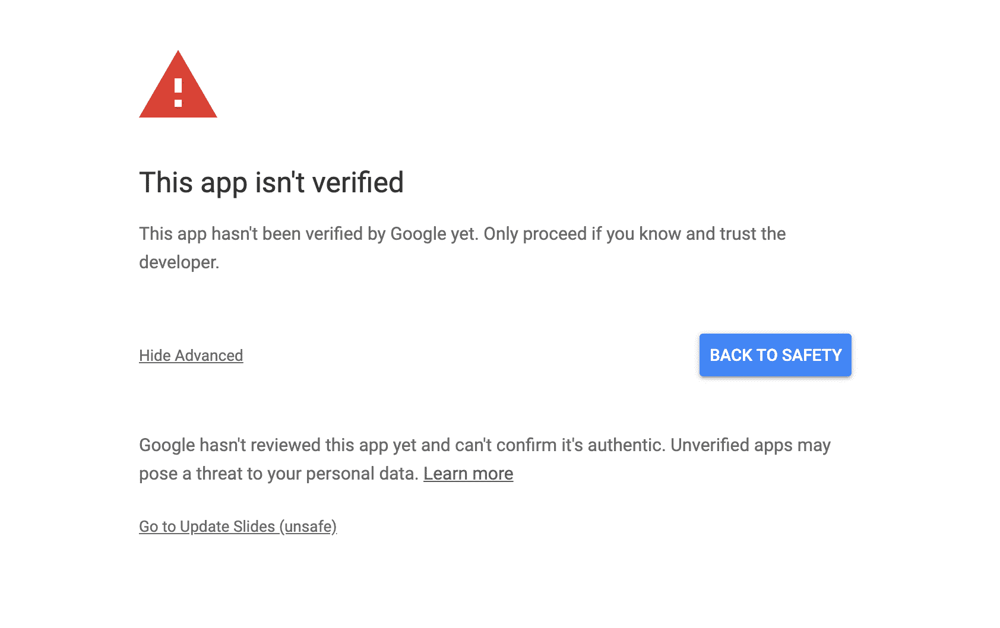
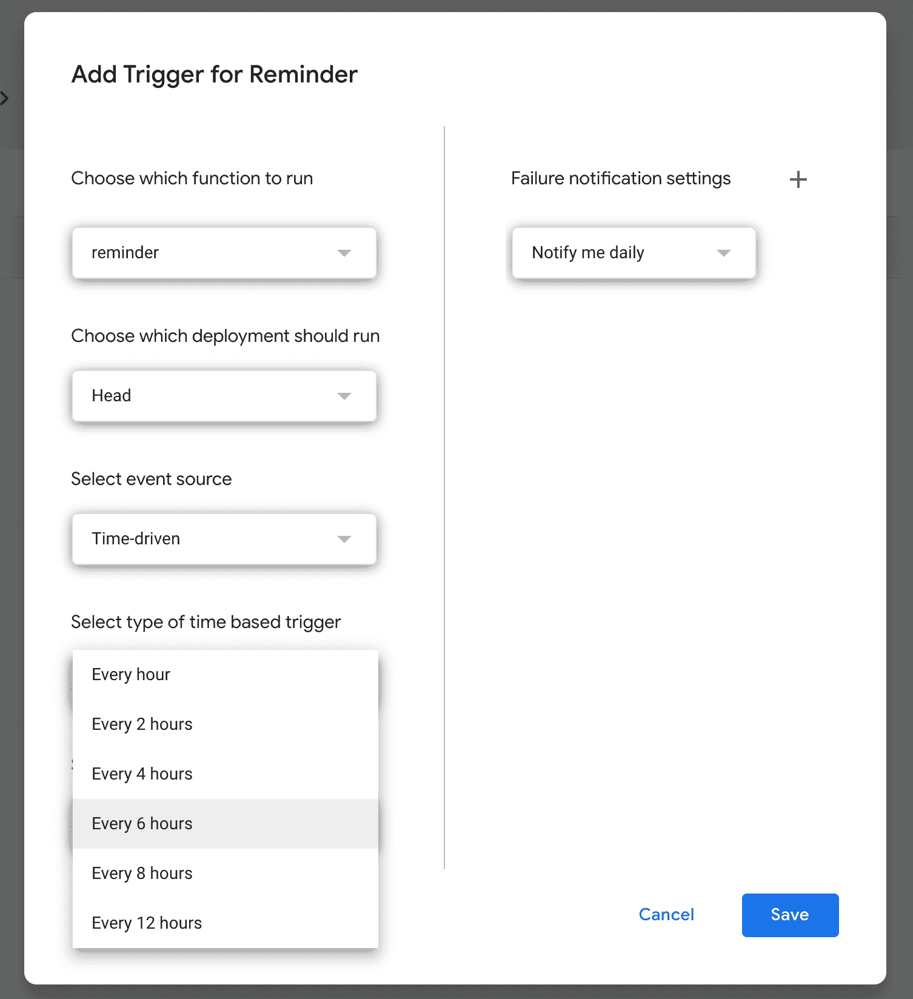
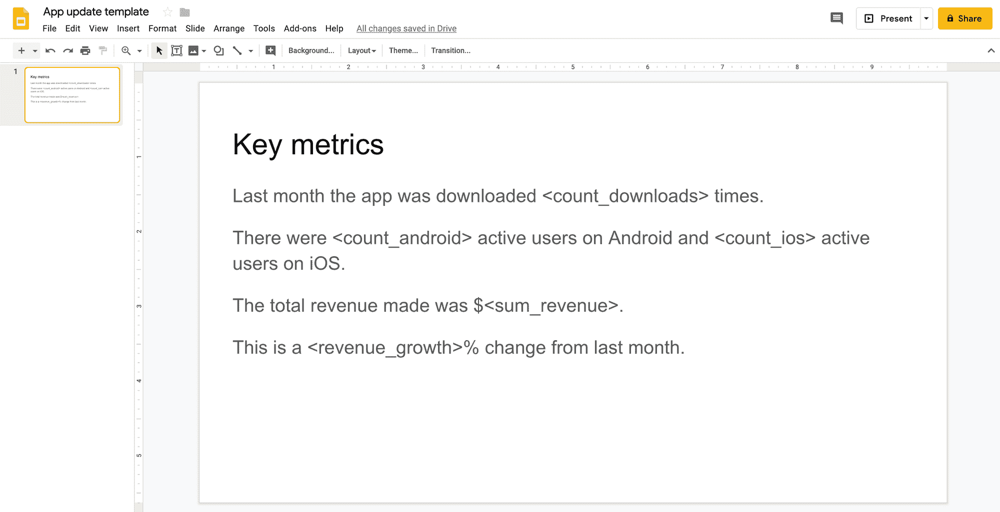
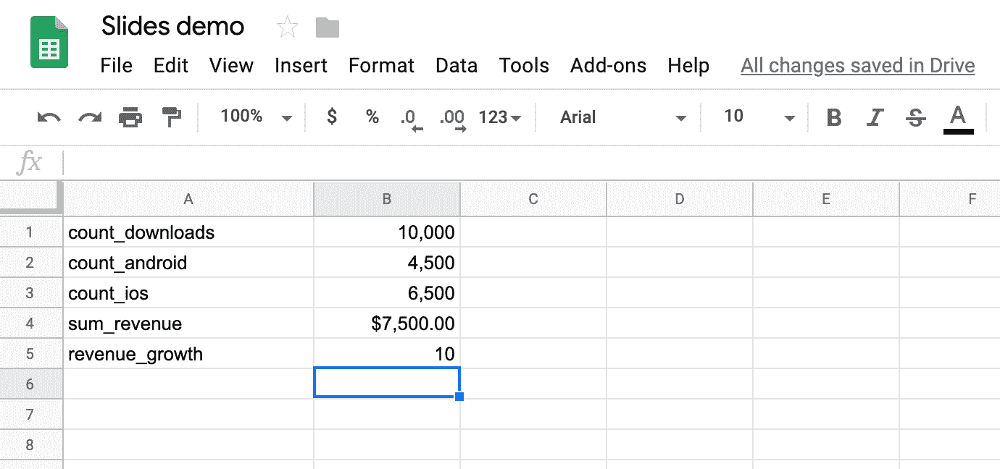
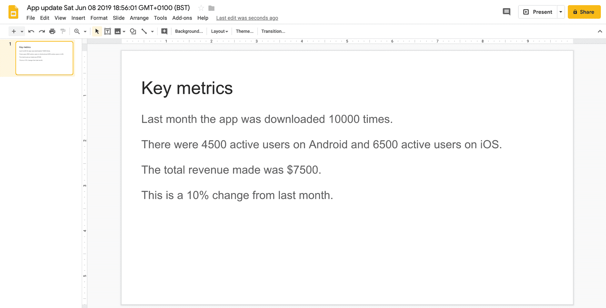

# 使用 Google Apps 脚本赋予您的工作日超能力

> 原文：<https://www.freecodecamp.org/news/automate-your-workday-with-google-app-script/>

最好的学习编码项目通常是那些解决现实世界问题的项目。

这些项目可以为完成任何项目提供额外的动力。他们鼓励你积极探索和发现新概念，而不是模仿你以前见过的例子。

解决你每天面临的问题也有一点额外的满足感。

一个简单的方法是从 [Google Apps 脚本](https://developers.google.com/apps-script/)开始。

它是一种用于一系列 Google 应用程序的脚本语言。语言本身实际上是 JavaScript。

Google Apps Script 提供的库和类允许您处理电子表格、电子邮件、日历、幻灯片等对象。

如果您想深入了解，可以在[这里](https://developers.google.com/apps-script/reference/)找到文档。

这里有三个例子来展示如何开始使用 Google Apps 脚本。希望它能给你自己的项目提供一些思路！

### 启动 Google 企业应用套件脚本

你需要一个谷歌帐户来开始开发应用程序脚本项目。要开始一个新项目，只需导航到[script.google.com/home](https://script.google.com/home)并点击“新脚本”。

您将被带到一个浏览器内 IDE，如下所示:



通过更改左上角的标题为项目命名。

请注意，每次您需要 Apps 脚本来访问不同的 Google 应用程序时，您都需要提供必要的权限。


这可能看起来有点令人生畏，但是如果你小心地运行你自己的项目，就不会有问题。单击“高级”并允许您的项目权限运行。



让我们来看一些例子。

### 计算你的所得税

这个简单的例子将向您展示如何通过添加您自己的定制公式来扩展 [Google Sheets](https://www.google.com/sheets/about/) 。在本例中，该公式将用于计算英国所得税。

在英国，[不同的所得税税率](https://www.gov.uk/income-tax-rates)适用于不同的收入类别。因此，所欠所得税的数额因收入而异。

首先，创建一个新的 [Google 工作表](https://docs.google.com/spreadsheets/u/0/)。然后，从菜单功能区中，选择工具>脚本编辑器。您将被带到应用程序脚本 IDE。

下面的代码块使用了一个 [switch 语句](https://learn.freecodecamp.org/javascript-algorithms-and-data-structures/basic-javascript/selecting-from-many-options-with-switch-statements/)来为一个数字参数`income`计算正确的税额。如果你熟悉 JavaScript，你会认出它的语法。

```
function TAX(income) {

  switch (true) {

    case income <= 12500:
      var tax = 0;
      break;
    case income <= 50000:
      var tax = 0.2 * (income - 12500);
      break;
    case income <= 150000:
      var tax = 7500 + (0.4 * (income - 50000));
      break;
    case income > 150000:
      var tax = 47500 + (0.45 * (income - 150000));
      break;
    default:
      var tax = "ERROR";
  }

  return tax;

}
```

如果您尚未保存项目，请保存它。

现在，回到工作表，在例如单元格 A1 中输入您选择的薪金。现在可以用`=TAX(A1)`调用新公式。

你可以写一个类似的函数来计算英国国民保险缴款。

你还能写什么样的工作表函数？

### 记得检查你的电子邮件

很难抽出时间回复重要的邮件。这个例子将把 Gmail 和 T2 的谷歌日历放在一个短的应用程序中。

这个想法很简单。您提供了重要电子邮件联系人和/或关键字的列表。该应用程序每六个小时检查一次你的收件箱。如果它发现来自这些联系人的任何新邮件(主题行中有任何关键词)，它会创建一个日历事件，提醒您在当天晚些时候回复。

您可以从[script.google.com/home](https://script.google.com/home)创建一个新项目。

查看下面的代码:

```
function reminder() {
  /* create list of senders and subject keywords */
  senders = ["freecodecamp", "codecademy", "meetup"];
  subjects = ["javascript", "python", "data science"];

  /* build the search query */
  var searchString = "is:unread newer_than:1d from: { " +
    senders.join(" ") + "} subject: { " + 
    subjects.join(" ") + " }"

  /* retrieve any matching messages */
  threads = GmailApp.search(searchString);

  /* if there are any results, create a calendar event */
  if (threads.length > 0) {
    var event = CalendarApp.getDefaultCalendar();
    event.createEventFromDescription('Review emails 6pm today');
  }

} 
```

要定期运行此功能，您可以设置一个触发器。从功能区菜单中，选择编辑>当前项目的触发器。

这将带您到一个新的选项卡，您可以在这里为当前项目添加一个新的触发器。单击“添加新触发器”并选择您希望使用的设置。



现在，您的脚本将每 6 小时运行一次，如果您有任何需要查看的电子邮件，将创建一个日历事件。

一个有用的扩展可能是创建一个电子表格或谷歌表单，让您可以轻松添加联系人和关键字。

你还能如何整合你的收件箱和日历？

### 幻灯片更新

使演示文稿和幻灯片保持最新可能是一项单调乏味的任务。幸运的是，您可以使用 Google Apps 脚本来自动化这个过程。

对于这个例子，我们将使用一个虚构的移动应用程序。我们的目标是制作一个幻灯片，展示最新的指标，如应用下载量、活跃用户和收入。

诀窍是用谷歌表单中包含的数据替换卡片中的一些`<tags>`。

在幻灯片中，创建新的演示文稿。给它起个名字，比如“应用更新模板”。

创建新幻灯片。给它一个标题，如“关键指标”。

在文本框中，添加如下内容:



注意每一行中包含的标签。每次运行脚本时，这些将被最新的数字替换。

接下来，创建一个新的工作表，并添加一些要在幻灯片中使用的数据。在一列中，参考幻灯片中的标签。另一方面，添加最新数据。

在真实的例子中，这将从电子表格中其他地方的原始数据中计算出来。原始数据可以来自 Google Analytics，或者从数据仓库导出，或者来自其他来源。



回到幻灯片，从功能区菜单中选择工具>脚本编辑器。这将打开一个新的应用程序脚本项目。

现在你可以开始写一些代码了。该函数将两个文件 id 作为参数——一个用于幻灯片模板，一个用于工作表。文件 id 是您可以在文件的 URL 中找到的字母和数字的字符串。

```
function updateSlides(templateId, sheetId) {

  /* Make a latest copy of the slide deck template */
  var template = DriveApp.getFileById(templateId);
  var today = Date();
  var copyName = "App update " + today;
  var templateCopy = template.makeCopy(copyName);

  /* Open spreadsheet and slides by their id*/
  var sheet = SpreadsheetApp.openById(sheetId);
  var slides = SlidesApp.openById(templateCopy.getId());

  /* Get the data from the sheet */
  var data = sheet.getRange("A1:B5").getValues();

  /* replace all the tags in the deck with their latest values */
  for(var i=0; i <data.length; i++){
    var tag = "<"+data[i][0]+">";
    var value = data[i][1].toString();

    slides.replaceAllText(tag, value);

  }
} 
```

如果运行这个脚本，将会创建一个新的演示文稿，用最新的数据代替每个标签。



您可以安排这个脚本定期运行，比如在每个月的月底。如果你想进一步发展这个想法，你可以使用 Apps 脚本自动将新的卡片发送给联系人列表。

### 轮到你了

Google Apps Script 是开始编写真正的 JavaScript 的一个很好的方式，它可以立即投入使用。希望这三个例子对你有所帮助。

也许这篇介绍给了你可以开发项目的想法？

记住，编码是一个强大的工具——不要对你不会手动做的应用程序脚本做任何事情。最好不要删除整个收件箱或用迷因覆盖重要文件。

感谢阅读！