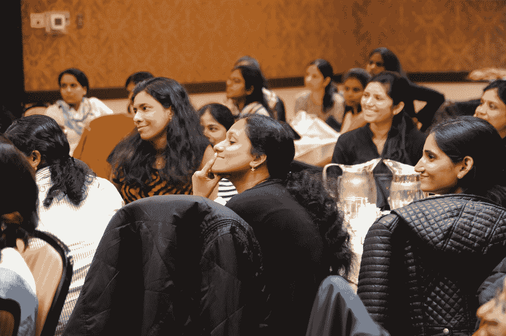

# 首次会议演讲完整指南

> 原文：<https://www.freecodecamp.org/news/complete-guide-to-giving-your-first-conference-talk/>

即使你不做报告，会议也会让人紧张。另一方面，演讲真的可以促进你的职业发展，帮助你建立人际关系网，让你(几乎)免费旅行，同时回报他人。

在过去的几年里，我已经做了十几次会议演讲，我想分享一些我从这里的经历中学到的东西。

### 适用于会议

在你的第一次会议上被接受可能会很棘手。你最好先在当地聚会、用户团体会议或附近的活动上发言。管理这些小组的人总是很高兴有志愿者发言，当你开始发言时，听众会宽容得多。

在我的第一次会议上演讲之前，我通过在当地活动中演讲认识了很多人。这真的帮助我增强了足够的自信，开始更好地表达我的声音和进行眼神交流。在几次本地会谈后，有人推荐我申请一个新的本地会议。我被录取了！然后一个接一个的谈话，我今天在这里。

以下是我推荐参加的一些会议:

1.  任何当地的会议——他们喜欢吸引当地的演讲者，因为，A:更便宜，B:更有利于当地的广告和促销。你通常也可以事先与负责人联系，让他们给你一个第一次发言的机会。
2.  NDC 会议 —这些在世界各地举办的会议运行良好。他们为你支付机票、酒店、一些活动、餐饮费用，当然，还会给你一张免费的会议门票。这不仅仅是关于免费的东西；他们吸引了顶尖的演讲者和一群优秀的人。我个人参加过在伦敦、悉尼和明尼苏达州举行的 NDC 会议。我计划在未来申请更多，所以也许我会很快见到你:)
3.  Python 会议——Python 社区以非常开放和欢迎新人而闻名。许多会议是低成本或免费的，如果你只是想尝试一下，你可以报名参加一个五分钟的闪电演讲。我参加过的所有 Python 会议的人都很友好，他们会尽力帮助你，并给你反馈，告诉你哪些地方可以做得更好。

### 提出建议

一旦你找到了一个你想申请参加的会议，你必须为这个演讲写一份提案，并想出一个标题。大多数情况下，需求是相似或相同的，所以你可以通过复制/粘贴来重用演讲提议。以下是一些制作好提案的一般步骤:

1.  **研究主题**:通常情况下，你可以在会议网站上看到往年的发言人和演讲名单(当然，除非是第一年)。记下人们谈论了什么，哪些话题没有被充分代表。大多数演讲人的简介还会链接到联系信息，这样你就可以联系到每个演讲人，询问他们对会议的看法，以及申请和被接受的建议。
2.  **制作一个吸引人的标题**:标题是与会者在浏览在线讲座列表或活动宣传册时看到的第一样东西，有时也是唯一一样。它必须抓住他们的注意力，所以会议组织者在回顾演讲时会寻找好的标题。当你翻阅前几年的演讲时，挑选出一些突然出现在你眼前的标题，并把它们列成清单，作为你提出建议时的灵感来源。
3.  制作一份提案:快速列出你要涵盖的内容，并列出顺序。写下一个关于演讲内容的概述，然后记下你希望听众从演讲中得到什么是很好的。有经验的演讲者总是告诉我在提案中与听众交谈，告诉他们他们将如何从参加中直接受益。回顾过去的许多谈话描述，我发现用一个问题来引发兴趣也是不错的。这里有一个例子:“如果我们能开发出不仅实用，而且使用起来很有趣的应用程序，会怎么样？如果做得好，游戏化可以极大地改善用户体验，也可以促进…”一些会议会要求你做一个摘要和描述，而一些会议只会要求一个描述，如果他们需要一个更短的版本，就会将其截断。无论哪种方式，写建议书的方法都差不多。
4.  **请人点评一下**:几个有经验的演讲者这些年给了我很大的帮助；从回顾我的演讲提议到给我建议到帮助我练习。向别人寻求帮助永远不会有坏处。我上一次会议演讲的题目是，“游戏开始！将您的应用游戏化，以获得乐趣和利润。”制作它的想法来自我几年前遇到的另一位演讲者，他在我几乎所有的演讲中都给了我鼓励和建议。人们可能看起来很可怕，但他们通常比你想象的要好。
5.  **保存你的提议**:许多会议都用 Sessionize.com 或 PaperCall.io 之类的东西来管理他们的提议，这样你就可以在将来重新登录并查看它们。但是，有些会议有自己的表单，您无法访问，因此最好将标题、摘要、描述、标签和您输入的任何其他信息保存在单独的位置，以防万一。

### 拒绝

每个人都会被拒绝。这种情况经常发生，即使对有经验的演讲者也是如此。你永远不知道这是因为你是一个新的演讲者，或者可能主题不适合其中一个轨道，或者他们可能有太多的人申请做类似的演讲。这与个人无关，你只需要不断申请，你就会在某个地方找到工作。

### 规划和准备

就像我之前说的，先在当地集会上练习演讲。如果你已经被录取了，那么无论如何你都要准备好演讲——你也可以不止一次地使用它。Meetup.com、脸书团体和本地编码训练营是询问他们是否愿意听你演讲的好地方。

当我被接受参加一个会议时，我喜欢画一张地图，标明我必须做什么以及我需要什么时候做。准备一次演讲并不容易。有研究要做，有代码要写，有幻灯片要做。如果你没有提前计划和开始工作，会议的时间将会到来，你会匆忙地完成所有的事情。这使得本已紧张的情况更加紧张。

每次演讲都会不同，但我发现自己通常会按照相似的步骤来准备。例如，我通常会列一个相关文章和书籍的清单，马上阅读，因为这需要最长的时间。一旦我做了一些研究，有了很多笔记，我会浏览它们，并写出我将在演讲中涉及的内容的详细大纲。然后我决定我的幻灯片要用什么框架；如果我可以重用别人模板中的样式，那就更好了。之后，我会为我演讲的每个部分制作一些占位符幻灯片，然后努力补充细节。注意:在准备演讲时，将演讲的描述放在你能看到的地方是个好主意。这将有助于确保你的内容不会偏离你对会议和观众的承诺。

一旦我准备好演讲和幻灯片，我就会开始练习。这有助于我找到在一次创建一个单独的幻灯片和章节时可能没有注意到的漏洞和不一致。如果演讲超过 30 分钟，就很难反复练习。在这种情况下，根据我对主题的了解程度，我至少会拍摄 3-6 次完整的排练。对于长时间的谈话，很容易开始练习，然后不得不停下来做其他事情:因此，重要的是要确保你不仅练习开头，而且练习中间和结尾。

除了准备您的演讲之外，以下是一些需要在会议上携带的物品:

1.  我喜欢为我的笔记本电脑和任何加密狗准备电缆，以防会议没有适合我的设置(大多数会，但你永远不知道)。
2.  我还在云中或 u 盘上存储了一份我演讲的副本，以防我的电脑出了什么问题。如果你使用的是 slides.com、谷歌幻灯片或类似的软件，它们可以导出为 html 或 pdf 文件。
3.  如果你正在做任何类型的现场编码，你应该有一个视频或幻灯片备份。当你在舞台上时，各种各样的事情似乎都会发生，做好额外的准备不会有什么坏处。视频备份救了我几次。
4.  我总是确保我有名片在演讲后分发，以防有我想联系的人。

### 到达会议现场

你到达一个新的地方，周围有许多陌生人。你是做什么的？你和谁说话？

最好的办法是至少提前一天到达，找到合适的位置。这真的有助于放松你的神经，让你更加自信。我喜欢提前查看会议地点，确保我知道如何到达那里。我有一次演讲迟到了，因为我在一个新城市迷路了，想去参加会议。在接下来的旅程中，我对此感到很糟糕。

当你到达会场时，首先看到的是一个咨询台，你可以在那里登记并领取演讲者姓名标签或徽章以及他们发放的任何官方礼品。如果你的名字标签上没有标明你要演讲的房间，一定要问他们，这样你就知道它在哪里，而不是在最后一刻手忙脚乱。

作为一名演讲者，你可能会进入一些其他与会者不能进入的房间。大多数会议都有一个技术检查室，你可以提前把笔记本电脑插上电源。如果你找不到它在哪里，确保你在服务台询问这个。还将有一个演讲室，供您进行演讲、放松或与其他演讲者聊天。当你刚到那里时，这可能是去见人的最好地方。这是一个轻松的环境，尽快开始与扬声器电路中的其他人建立联系是非常好的。

当我开始参加会议时，如果我不认识任何人，我会在吃饭时躲在酒店房间里。我不再那样做了。现在我让自己和其他人坐在一张桌子旁，开始一段对话。其他人通常和我一样尴尬和紧张，我见过很多像这样的酷人。

### 台上

如果你是一个比较内向的人，当你知道你将要上台开始演讲时，你会感到非常激动。过去，我甚至在演讲前恐慌过。如果你想成为一名优秀的演说家，这只是你必须完成的事情。记住，每个人都希望你成功，尤其是你的观众。我喜欢事先走进浴室，深呼吸几次。然后我至少提前 10-15 分钟到达，在我要演讲的房间里做好准备。这真的有助于平静我的神经。

我曾经听过罗伯特·c·马丁——《干净的代码》的作者的一次演讲，之后我向他征求演讲建议。他告诉我，我必须相信我是这个房间里的专家，不管发生什么，观众都在那里听我说话，所以我也可以从中得到乐趣。说起来很简单，但不知为什么，我一直记着这句话，从那以后，我的口语有所提高。

记住，不一定要完美。每个人都有说得好和说得不好的时候。以说这是你的第一次会议开始演讲是个好主意，你真的很感谢 XYZ 会议让你来演讲。以某种方式让你的观众与你产生共鸣来开始总是一件好事，这可能也会让你感觉更舒服。

如果我的演讲结束时还有几分钟时间，我会向大家提问，并尝试在大家面前回答这些问题。否则，我会总结并告诉与会者，我很乐意回答他们的问题或在会后与他们交谈。

注意:有时你可能只有几个甚至零个与会者。我亲眼看到这种情况发生在两个非常有经验的演讲者身上。有时候，这是一个人们不感兴趣的话题，或者有另一个著名的演讲者安排在与你相同的时间，或者这只是一天中的一个糟糕的时间(人们前一天晚上出去后的一大早，或者在人们筋疲力尽的一天结束时)。

### 然后

你完了！几乎…一定要留下来提问和讨论。如果你的演讲结束后在同一间屋子里还有其他的演讲，就说你会在走廊里。完成后，人们对你表示感谢和称赞，这种感觉很棒。

别忘了感谢会议组织者让你参加并发表演讲。如果你不想亲自去做，一封感谢邮件也很好。在像 freeCodeCamp 这样的博客上发推文或写下你的经历。

### 包裹

不要害怕在会议上发言。这是提高你的演讲技巧、结识新朋友、旅行以及其他好处的好方法。

我希望将来能在会议上见到你们中的许多人。如果你过去参加过好的会议，请在评论或推特上告诉我。我总是在寻找新的参与者:)

我的推特:[https://twitter.com/gwen_faraday](https://twitter.com/gwen_faraday)

我的 YouTube 频道:[https://www.youtube.com/channel/UCxA99Yr6P_tZF9_BgtMGAWA](https://www.youtube.com/channel/UCxA99Yr6P_tZF9_BgtMGAWA?view_as=subscriber)