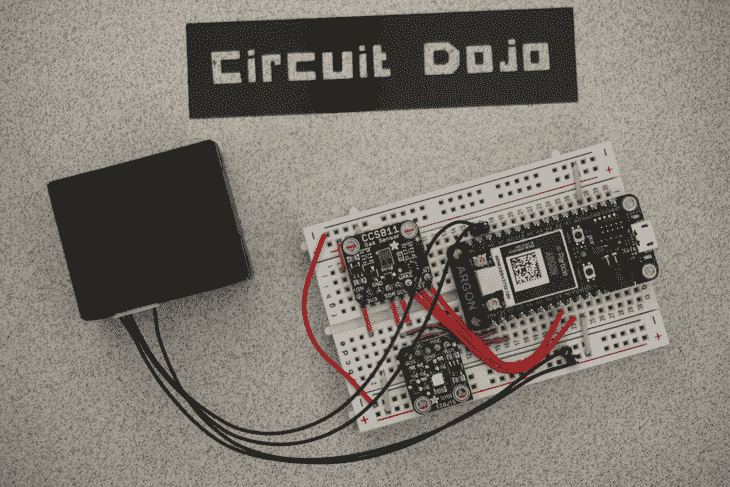
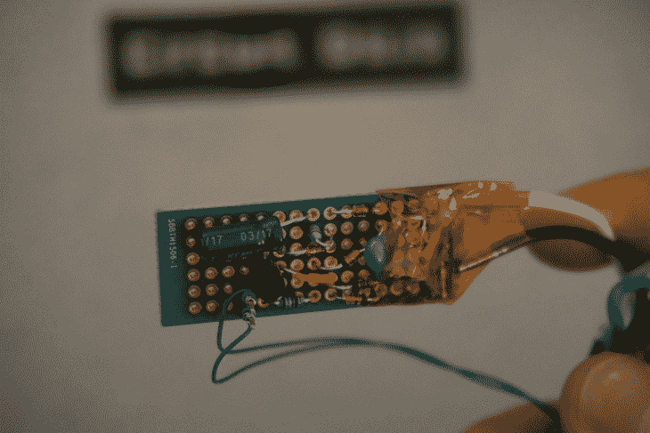
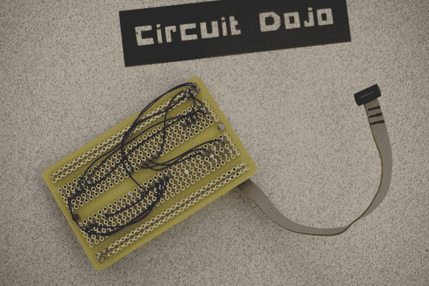
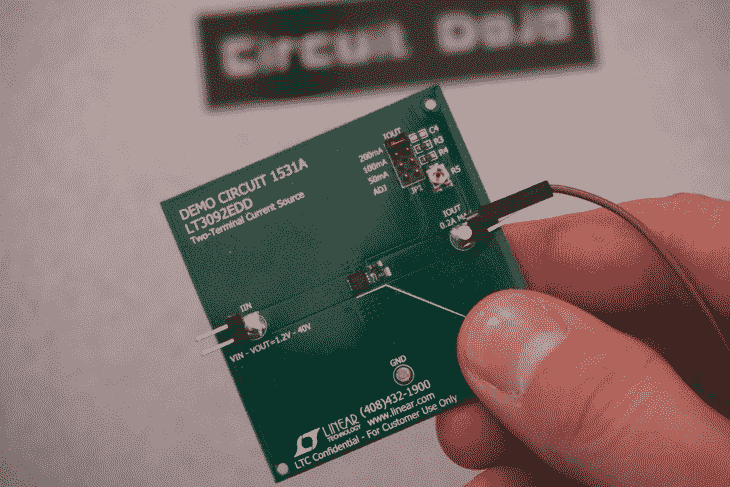
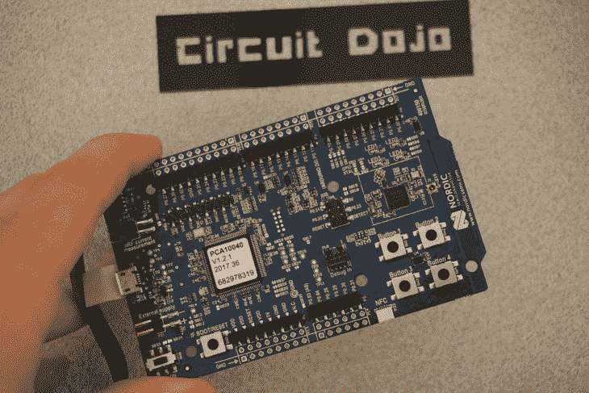
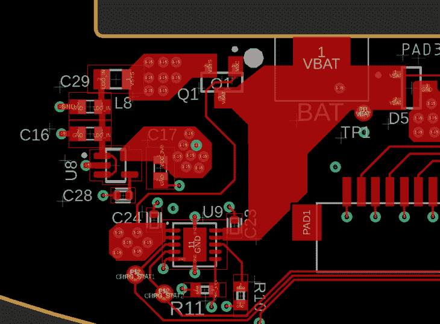
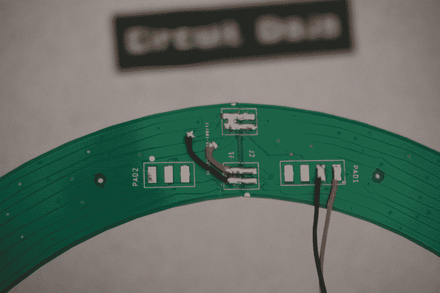

# 制作电路原型的最佳方法是什么？

> 原文：<https://www.freecodecamp.org/news/whats-the-best-way-to-prototype-circuits/>

**本帖最初来自[www.jaredwolff.com](https://www.jaredwolff.com/circuit-boards-versus-breadboarding/)**

第一次修订电路板设计时总会出错。无论你花多长时间想象一个电路是如何工作的，它都会以最意想不到的方式运行。

在我的[最新项目](https://www.jaredwolff.com/dimming-ac-lights-with-a-microcontroller/)中，我忽略了电路的一个关键问题。我的启示？事实证明，你无法可靠地将 375 兆瓦的功率分流到一个 100 兆瓦的电阻上。？不幸的是，正如您所猜测的，这将需要返工。

因此，在我寻找正确的原型解决方案的过程中，我想:“为什么不分享一下我现在的想法呢？”

因此，这篇博文诞生了。？

## (无焊料)试验板

当您时间有限时，无焊料试验板是您的首选。这种类型的电子原型是无痛的，但也有一些缺点。最值得注意的是，它不能很好地进行模拟优化。我将在这篇文章的稍后部分讨论这个问题。

我最近组装了一个室内空气质量 PM2.5 传感器，并将其与粒子氩接口。我用[绕线](https://www.jaredwolff.com/prototype-with-wire-wrap/)组装它。但这完全是一场灾难。相比之下，无焊料试验板保持了事物的有序性和良好的外观。

电气工程师在他们求学的早期就喜欢(或讨厌)面包板。对一些人来说，它可以成为获得创意和制作漂亮布局的一个出口。许多计算机工程专业的一年级学生为他们的试验板设计感到自豪。以至于他们的试验板看起来像是由机器人组装的。

然而现在，我不像在大学里那样把巨大的数字逻辑电路连接在一起。不过，我确实使用无焊料试验板来与开发模块建立稳固的连接。正如你在上面的图片中看到的，我使用了 3 块独立的板，它们都可以在网上找到。将它们连接在一起最多需要大约 10 分钟。我花了大约 15 分钟来组装绕线版。

## 实验板？

有时无焊料试验板很好，但并不意味着适用于所有情况。如果你需要可靠的东西呢？如果你在高压下工作呢？如果你正在寻找更多，但不想跳出来做自己的 PCB，这是你的下一站。

创建一个可焊接的试验板与无焊料版本没有太大的不同。我花了大约 20 分钟来组装下图中的电路。

上面的试验板是前面提到的替代过零电路。考虑到我是在线电压下工作，我对装配非常谨慎。

所以在反复检查我的工作后。我插上电源，你知道吗？

它非常有效。

试验板需要一些时间来规划，但如果你做对了，它们就和普通电路板一样好。

此外，您不必总是将每个连接焊接在一起。大约一年前，我制作了这个 JTAG 电平转换板。这样，我可以在 1.8V 到 5V 的范围内运行我的电路板，并让它与标准的 3.3V 编程器一起工作。

在这种情况下，我使用了焊料和[绕线](https://www.jaredwolff.com/prototype-with-wire-wrap/)。人脉。对于未来的项目，我计划使用我不久前设计的 JTAG 电平转换板。它只有上面那个的 1/5 大小，功能也一样。

## 超越试验板

我绝对不怕[自己组装电路板](https://www.jaredwolff.com/how-to-self-assemble-circuit-boards/)。那是有时间和地点的。在打开原理图捕获程序之前，您还可以做一些事情。

始终考虑使用已经存在的电路和开发平台！

聪明地对待你的设计过程会给你未来的自己带来好处。这有助于你专注于棘手的问题，而不是琐碎的干扰。如果你需要一个预先设计的电路板，Sparkfun 和 Adafruit 是很好的资源。他们已经为大多数制造商感兴趣的集成电路制造了分线板。

锦上添花的是，在大多数情况下，这些电路板非常便宜。

TI 这样的公司也做开发板。这些板价格合理，通常在 Digikey 及其网上商店有现货。我最喜欢的一些制造商开发板包括 NRF52DK 和 LT3092EDD。我经常使用它们，并且有一些很好的理由。

LT3092EDD 是我用来调节可变电压源电流的工具。无论输入电压是多少，它都会分流 0-200 毫安的电流。您可以并联几个 LT3092，增加电流能力。我将它用于需要恒定电流吸收的静电放电测试和验证。

至于 NRF52DK，我不仅可以在这个板上开发，还可以作为程序员使用。有了大量的扩展方式，它很少离开我的办公桌。

但是如果没有开发板呢？

有时两种类型的试验板都不太好。如果您的原型制作依赖于电路板上铜的形状和形式，这一点尤其正确。我认为，如果你对开关电源进行试验，你可能会得到一些意想不到的操作。

电源电路的布局往往比数字信号要复杂一些。是的，用一个微小的痕迹连接两个部分就可以了，效果好吗？不太可能。

下面是一个允许电流转移到内部电源层的设计。正如你所想象的，一个细的轨迹和一个通孔可能会起作用。实际上，在高电流情况下，它们更像是一个电阻。

虽然你可能会得到更好的连接，但你要冒更高成本的风险。此外，今后要改变你的电路要困难得多。当零件变得更小，信号被推入内部时，事情变得更加复杂。尽管这不是不可能的..

当需要改变时，我最常用的工具是绕线或线圈线和我可信赖的 X-acto 刀。您可以使用前者来建立连接，使用后者来断开连接。这确实需要稳定的手和耐心，但这是可能的。

在上图中，我切断了焊盘周围的热迹线，并重新连接到另一组迹线。考虑到很难从照片上看出来，你可能不得不相信我的话。为了避免错误，我在显微镜下做了所有的工作。

## 你杜灿吗？

组装电路有几种方法。你想怎么做完全取决于你。我已经看到了一些非常酷的电路艺术作品，它们实现了和面包板一样的功能。

如果你还没有注意到，我最终选择了试验板设计。组装和测试比订购全新的电路板更快。我可能会在未来旋转另一个董事会。与此同时，这个小试验板应该做得很好。

当涉及到与客户合作时，我会使用所有这些技巧。没有一种技术是不可行的，它通常对每个人都有好处。事实上，试验板总会演变成某种电路板。不过，在将电路**变成昂贵的原型之前，知道它还能工作**是件好事。

所以直到下一次，当你发现自己有同样的问题时，记住你的选择。

玩得开心！

贾里德