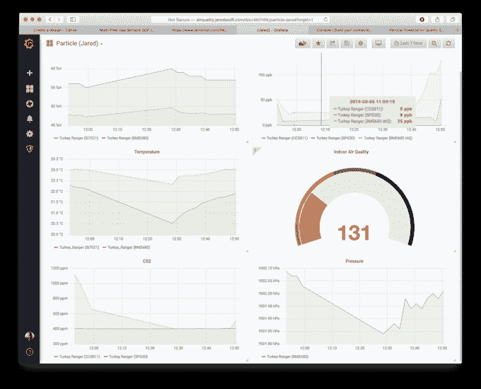
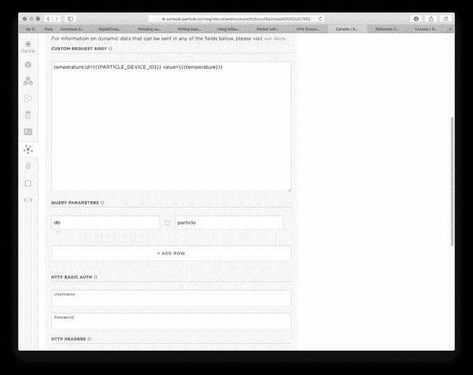
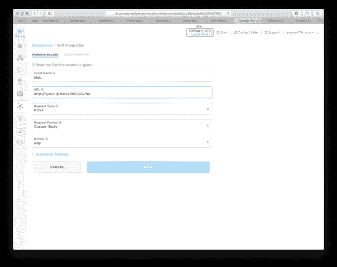
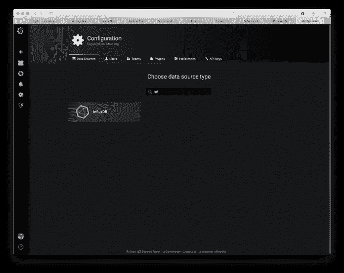
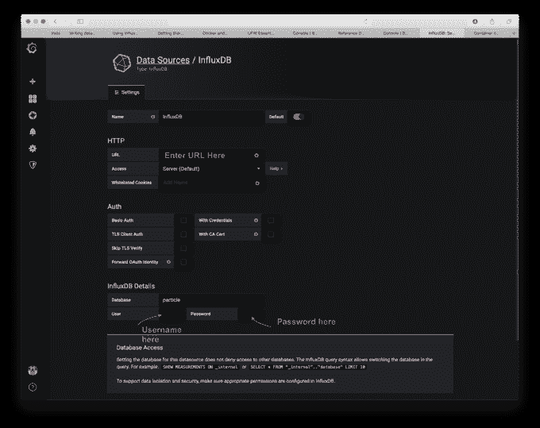
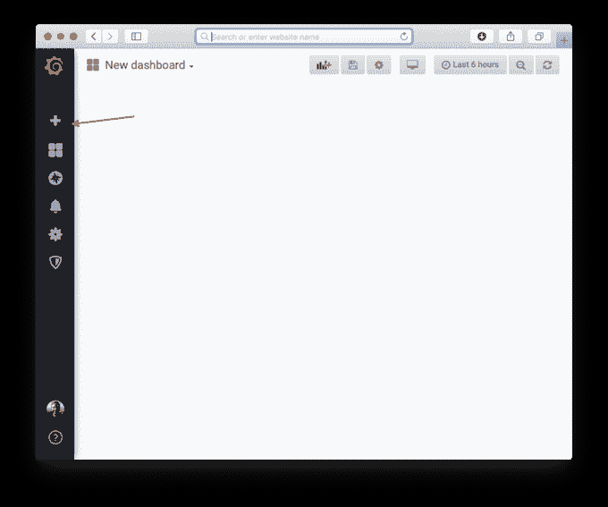
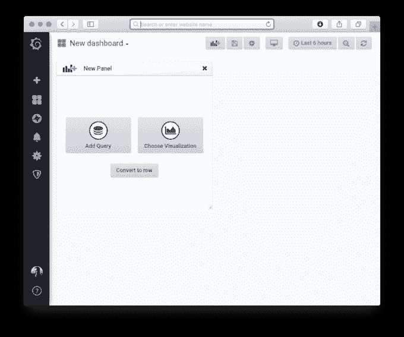
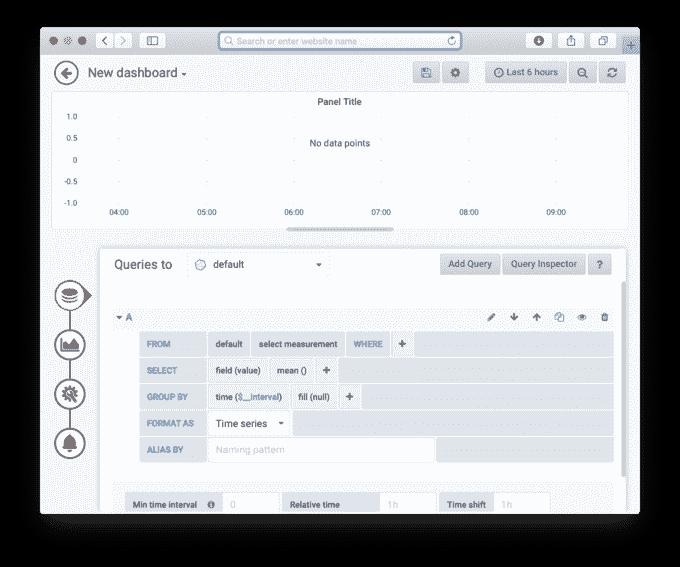
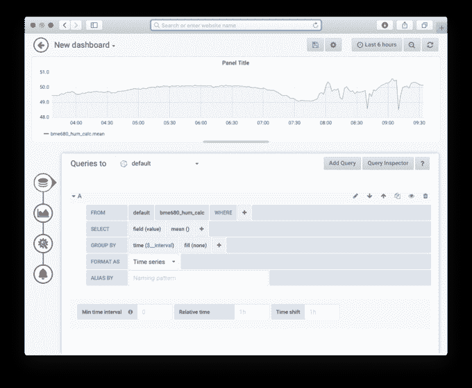

# 如何在短时间内制作出外观惊艳的物联网仪表盘

> 原文：<https://www.freecodecamp.org/news/how-to-make-an-amazing-looking-iot-dashboard-in-no-time/>

**本帖最初来自[www.jaredwolff.com](https://www.jaredwolff.com/how-to-make-an-amazing-looking-iot-dashboard-in-no-time/)**

在这篇文章中，我将向你展示如何开始使用 Grafana 和 InfluxDB。所有这些在数字海洋上运行的 docker 容器。

这样你就可以得到像这样漂亮的图表:



成本？

**每月 5 美元**

 **我们开始吧。

## 步伐

1.  登录数字海洋。如果你没有数字海洋，但想支持这个博客，请点击[此处](https://m.do.co/c/9574d3846a29)创建一个帐户。

2.  进入`Account Settings`->-`Security`并确保你有一个 SSH 密钥设置。
    

3.  使用他们的 [docker 图像](https://marketplace.digitalocean.com/apps/docker)创建一个新的水滴

4.  确保你选择了每月 5 美元的计划。对于简单的安装，这已经足够了！

5.  完成后宋承宪:`ssh root@<yourserverip>`

6.  设置 InfluxDB

    ```
    docker run --rm -e INFLUXDB_HTTP_AUTH_ENABLED=true -e INFLUXDB_DB=particle -e INFLUXDB_ADMIN_ENABLED=true -e INFLUXDB_ADMIN_USER=admin -e INFLUXDB_USER=grafana -v influxdb:/var/lib/influxdb influxdb /init-influxdb.sh 
    ```

    观察该命令的输出。它将为您的`admin`和`grafana`用户生成密码。将这些保存在安全的地方！

7.  开始涌入

    ```
    docker run -d -p 8086:8086 \
          -v influxdb:/var/lib/influxdb \
          -e INFLUXDB_HTTP_AUTH_ENABLED=true \
          influxdb 
    ```

8.  添加防火墙规则

    ```
    ufw allow 8086 
    ```

    这允许外部世界访问您的 InfluxDB 实例。

9.  从粒子设置卷曲

    等效呼叫示例:

    ```
    curl -i -XPOST 'http://<DOCKER IP HERE>:8086/write?db=particle' --data-binary 'temperature,id=<ID HERE> value=22.1' 
    ```

    放入**定制请求**的版本应该是:

    ```
    temperature,id={{{PARTICLE_DEVICE_ID}}} value={{{temperature}}} 
    ```

    

    **注:**见`QUERY PARAMETERS`下那个`db`正指向`particle`。这应该指向您在步骤 6 中设置的`INFLUXDB_DB`

    **第二个注意:**确保用户名和密码也是您在第 6 步中设置的。在本例中，用户名为`grafana`

    

    这里有一个更复杂的版本:

    ```
    temperature,id={{{PARTICLE_DEVICE_ID}}} value={{{temperature}}}
    humidity,id={{{PARTICLE_DEVICE_ID}}} value={{{humidity}}}
    tvoc,id={{{PARTICLE_DEVICE_ID}}} value={{{tvoc}}}
    c02,id={{{PARTICLE_DEVICE_ID}}} value={{{c02}}}
    {{#pm25}}pm25,id={{{PARTICLE_DEVICE_ID}}} value={{{pm25}}}{{/pm25}}
    {{#pm10}}pm10,id={{{PARTICLE_DEVICE_ID}}} value={{{pm10}}}{{/pm10}}
    {{#sgp30_tvoc}}sgp30_tvoc,id={{{PARTICLE_DEVICE_ID}}} value={{{sgp30_tvoc}}}{{/sgp30_tvoc}}
    {{#sgp30_c02}}sgp30_c02,id={{{PARTICLE_DEVICE_ID}}} value={{{sgp30_c02}}}{{/sgp30_c02}}
    {{#bme680_pres}}bme680_pres,id={{{PARTICLE_DEVICE_ID}}} value={{{bme680_pres}}}{{/bme680_pres}}
    {{#bme680_iaq}}bme680_iaq,id={{{PARTICLE_DEVICE_ID}}} value={{{bme680_iaq}}}{{/bme680_iaq}}
    {{#bme680_temp_calc}}bme680_temp_calc,id={{{PARTICLE_DEVICE_ID}}} value={{{bme680_temp_calc}}}{{/bme680_temp_calc}}
    {{#bme680_hum_calc}}bme680_hum_calc,id={{{PARTICLE_DEVICE_ID}}} value={{{bme680_hum_calc}}}{{/bme680_hum_calc}} 
    ```

    对于条件数据，您可以将整行放入变量中，该变量可能存在，也可能不存在:

    ```
    {{#bme680_pres}}<insert stuff related to bme680_pres>{{/bme680_pres}} 
    ```

10.  下一个！安装带有持久存储的 Grafana

    ```
    # create a persistent volume for your data in /var/lib/grafana (database and plugins)
    docker volume create grafana-storage

    # start grafana
    docker run \
      -d \
      -p 3000:3000 \
      --name=grafana \
      -v grafana-storage:/var/lib/grafana \
      grafana/grafana 
    ```

11.  为 graphana 添加防火墙规则

    ```
    ufw allow 3000
    ```

12.  登录。这应该是你的数字海洋水滴 ip + :3000 追加的。例如:`123.456.789.101:3000`(默认用户名和密码为**管理员**和**管理员**)

13.  将 Grafana 连接到流入管(这应该是 Grafana 全新安装的首选方案之一)

    

    

    **注意**在用户下，你必须输入用户名`grafana`和第 6 步生成的密码。在同一步骤中，数据库的名称也被设置为`particle`。

14.  点击`Save & Test`测试你的连接，它会很快显示连接是否成功。

15.  启动您的设备，如果还没有启动的话，将它发布到您的 InfluxDB 数据库。

    (需要数据？这个项目应该会让你有所收获！)

16.  创建图表！

    最后，你来到这个页面的原因:**漂亮的图表**

    点击左侧的 **+** 图标，创建一个**新仪表板**

    

17.  选择`Add Query`

    

18.  向下点击`select measurement`如果您的设备已经发布到您的数据库，您应该会看到一些值的选项。

    

19.  在`fill(null)`下，将其更改为`fill(none)`。这应该给你一个很好的数据点之间的界限。

20.  你应该看到图表出现了！
    

21.  单击返回箭头按钮，然后单击保存按钮。

22.  现在，您已经直接从您的设备上创建了一个简单的数据图表！我推荐你使用 Grafana 界面。它相当直观，只需要短短几分钟就可以习惯！

## HTTPS/SSL

安装 HTTPS/SSL 相当简单。请遵循以下步骤:

1.  如果还没有停止 Grafana 实例，请停止它

2.  用`nginx-proxy`开始一个新的容器

    ```
    docker run --detach \
        --name nginx-proxy \
        --publish 80:80 \
        --publish 443:443 \
        --volume /etc/nginx/certs \
        --volume /etc/nginx/vhost.d \
        —volume /usr/share/nginx/html \
        —volume /var/run/docker.sock:/tmp/docker.sock:ro \
        jwilder/nginx-proxy 
    ```

3.  运行`letsencrypt-nginx-proxy-companion`

    ```
    docker run —detach \
        —name nginx-proxy-letsencrypt \
        —volumes-from nginx-proxy \
        —volume /var/run/docker.sock:/var/run/docker.sock:ro \
        jrcs/letsencrypt-nginx-proxy-companion 
    ```

4.  重启 Grafana 容器

    ```
    docker run \
      -d \
    	--env "VIRTUAL_HOST=<YOUR SUBDOMAIN ADDRESS>" \
      --env "VIRTUAL_PORT=3000" \
      --env "LETSENCRYPT_HOST=<YOUR SUBDOMAIN ADDRESS>" \
      --env "LETSENCRYPT_EMAIL=<YOUR EMAIL ADDRESS>" \
      --name=grafana \
      -v grafana-storage:/var/lib/grafana \
      grafana/grafana 
    ```

    **注意:**确保用您自己的信息替换上面的`<YOUR SUBDOMAIN ADDRESS>`和`<YOUR EMAIL ADDRESS>`。

代理伙伴将为您提供给 Grafana 容器的虚拟主机生成一个 SSL 证书。该代理用于将所有 HTTP/HTTPS 流量转发到您的 Grafana 容器。它干净、简单、安全！

**注意** InfluxDB 稍微难一点。您需要创建一个单独的子域或配置 HTTPS 来共享 Grafana 和 Influx 之间的证书。如果你还没有安装好所有的东西，这个 [Docker 编写脚本](https://www.grzegorowski.com/grafana-with-lets-encrypt-ssl-on-docker/)就可以完成所有的工作。如果您想在一个单独的子域上运行它，您可以遵循上面相同的步骤。

## 便捷的链接

这里有一些我发现对 Grafana + InfluxDB 入门有用的便捷链接

*   [影响 xdb | dock documentation](https://docs.docker.com/samples/library/influxdb/)
*   [入门| Grafana 文档](https://grafana.com/docs/guides/getting_started/)
*   [使用 Docker | Grafana 文档安装](https://grafana.com/docs/installation/docker/)
*   [让我们加密 Nginx 代理伴侣](https://hub.docker.com/r/jrcs/letsencrypt-nginx-proxy-companion/)
*   [为 Grafana 和潮人设置 HTTPS 非常方便](https://www.grzegorowski.com/grafana-with-lets-encrypt-ssl-on-docker/)

## 结论

你做到了。享受您的新 Grafana + InfluxDB 安装！

如果你喜欢这个教程，请与你的朋友和你的敌人分享。此外，如果你渴望更多，看看如何只用几个零件来制作你自己的空气质量传感器。**