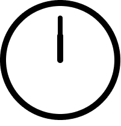
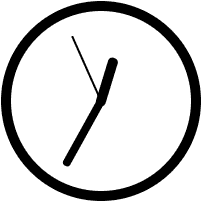
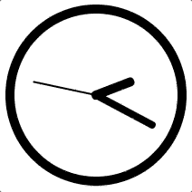

# 角/离子，反应，Vue？使用 Stencil.js 让您的应用面向未来！

> 原文：<https://www.freecodecamp.org/news/angular-ionic-react-vue-future-proof-your-app-with-stencil-js/>

## 简短介绍:

在本教程中，我将建立一个普通的模板应用程序，带有一个工作模拟时钟。为了方便起见，我还会加入一些离子，但这不是这里的重点。本教程将涵盖一些更重要的模板基础知识。

虽然这是对 Stencil 的低级介绍，但我将假设您至少已经浏览了 Stencil 文档，并且对 JSX 和 Stencil 有一个基本的概念。您可能应该熟悉 Typescript，或者至少也熟悉 ES6。

## 更长的介绍:

在以前的帖子中，我说过我会“迁移”到 React，因为它超过了 Ionic。在离子领域工作了三年之后，这是一个令人生畏的命题。如果 React 在另一年被接管呢？幸运的是，爱奥尼亚的人们完全意识到了这个现实。这就是他们创建 stencil.js 的原因。

Stencil 使用 Typescript 和 JSX 作为一个超级强大的，轻量级的，非框架。模板可以添加到任何其他框架中，也可以单独使用来完成人们使用 Angular 或 React 来完成的大部分工作。

与较大的框架相比，它学习起来又快又容易。所以这是习惯 JSX/Web 组件思维方式的好方法。而且如果你想从有角度的迁移到有反应的，反之亦然，Stencil 可以平滑你的路径。

今后，我将在我的个人项目中使用模板。和 Ionic 4 组件现在是在模板上构建的。因此，无论您是继续使用 Ionic/Angular 还是迁移到另一个框架，让您的应用面向未来都是一个合理的选择。

作为 JSX 初学者的旁注。我发现最简单的方法就是忘记把所有东西都做成完美的组件，只写 HTML。然后，当我看到一个我将不止一次使用的 HTML 或者我想做一些特殊的事情时，我会把它移到它自己的组件中。

## 开始使用:

首先:

```
npm init stencil
```

选择`component`并使用`analog-clock-components`作为您的项目名称，然后:

```
cd analog-clock-components
npm install --save @ionic/core
npm start
```

如果一切按计划进行，您应该会看到默认的“主页”弹出。

## 制作时钟:

我讨厌教程用一堆对核心概念不重要的信息把你压垮。所以这正是我要做的！我将和 SVG 一起制作时钟。但是，嘿，这比另一个他妈的待办事项清单的例子要好。我保证会保持简单。

**小心！**你的模板组件标签必须有 2 个或更多的单词，否则你的应用程序将会莫名其妙地失败，类似于`“clock” is not a valid custom element name`！

在`src/components`目录下添加一个钟面文件夹，如下:`clock-face/clock-face.tsx`并添加以下内容。

```
<script src="https://gist.github.com/leetheguy/8d3e5686ca097353d1fdf09ee1bbdc33.js"></script>

import { Component } from '@stencil/core';

@Component({
  tag: 'clock-face'
})
export class ClockFace {

  render() {
    return (
      <svg width="200" height="200" >
        <circle cx="100" cy="100" r="95" stroke-width="10px" stroke="black" fill="transparent"/>
        <line id="hour-hand" x1="100" y1="100" x2="100" y2="60" stroke="black" stroke-width="10" stroke-linecap="round"/>
        <line id="minute-hand" x1="100" y1="100" x2="100" y2="30" stroke="black" stroke-width="8" stroke-linecap="round"/>
        <line id="second-hand" x1="100" y1="100" x2="100" y2="30" stroke="black" stroke-width="2" stroke-linecap="round"/>
      </svg>
    );
  }
}
```

然后加上`analog-clock/analog-clock.tsx`。

```
import { Component } from '@stencil/core';

@Component({
  tag: 'analog-clock',
})
export class AnalogClock {
  render() {
    return [
      <div>
        <clock-face/>
      </div>
    ];
  }
}
```

现在用`<analog-clock\>`替换`index.html`中的`my-component`标签

您可能需要重新启动应用程序，但现在您应该会看到这是您的主页:



my stunning clock

SVG 的这一部分相当简单，只是一个圆和几行具有美学风格的线条。这种风格可以而且应该与 CSS 一起应用在一个重要的应用程序中。

注意，我使用了`<svg>`标签作为这个组件的根。整洁！到目前为止，这个时钟每天只对两次，所以让我们添加一些道具，使它可调。我还将添加将时间转换为度数的函数来旋转指针。我将更新 SVG，以便能够旋转这些手。

```
import { Component, Prop } from '@stencil/core';

@Component({
  tag: 'clock-face'
})
export class ClockFace {
  @Prop() hour: number;
  @Prop() minute: number;
  @Prop() second: number;

  hourToDegrees(): number {
    return Math.floor(this.minute / 2) + (this.hour * 30);
  }

  minuteToDegrees(): number {
    return Math.floor(this.second / 10) + (this.minute * 6);
  }

  secondToDegrees(): number {
    return this.second * 6;
  }

  render() {

    return (
      <svg width="200" height="200" >
        <circle cx="100" cy="100" r="95" stroke-width="10" stroke="black" fill="transparent"/>
        <line id="hour-hand" transform={`rotate(${this.hourToDegrees()}, 100, 100)`} x1="100" y1="100" x2="100" y2="60" stroke="black" stroke-width="10" stroke-linecap="round"/>
        <line id="minute-hand" transform={`rotate(${this.minuteToDegrees()}, 100, 100)`} x1="100" y1="100" x2="100" y2="30" stroke="black" stroke-width="8" stroke-linecap="round"/>
        <line id="second-hand" transform={`rotate(${this.secondToDegrees()}, 100, 100)`} x1="100" y1="100" x2="100" y2="30" stroke="black" stroke-width="2" stroke-linecap="round"/>
      </svg>
    );
  }
}
```

我们开始吧。我的组件现在可以通过@Prop()装饰器接受传入的变量，并根据这些变量改变它的显示方式。让我们通过将钟面标签更新为`<clock-face hour={12} minute={34} second={56}/>`来看看这一点，我已经将数字用花括号括起来，所以它们将作为数字而不是字符串传递。



my updated clock; still only right twice a day

## 让时钟滴答作响:

如果你注意到，时钟没有内部逻辑或时间管理能力。最好让你的组件尽可能简单。Web 组件有点像函数式编程，因为它们应该只做一件事。Stencil 通过使 props 不可变而建立在函数范式之上，这样组件就不能影响自身之外的任何东西。他们可以引发事件，但仅此而已。

现在我要给`analog-clock.ts`添加 getters，让它开始计时。

```
import { Component } from '@stencil/core';

@Component({
  tag: 'analog-clock',
})
export class AnalogClock {
  get hour(): number {
    let h: any = new Date().getHours();
    return h;
  }

  get minute(): number {
    let m: any = new Date().getMinutes();
    return m;
  }

  get second(): number {
    let s: any = new Date().getSeconds();
    return s;
  }

  render() {
    return (
      <div>
        <clock-face hour={this.hour} minute={this.minute} second={this.second}/>
      </div>
    );
  }
}
```

哇！看那钟走了…不知道去哪了。时间是对的，但它不走了。如果你们中的一些人对 Angular 一家很熟悉，你可能会在这一点上期待一个滴答作响的时钟。然而，模板只能在特定条件下重新渲染。这避免了开发人员熟知的失控列车效应。如果你的代码中有一个循环，或者只是在一个从 HTML 或 getter 调用的方法中有很多逻辑，你的应用程序可能会慢下来。使用 Stencil 仍然有可能发生这种情况，但这几乎是故意的。

为了让 Stencil 重新呈现，您必须使用像@Prop()或@State()这样的装饰器来告诉 Stencil 哪些数据足够重要，可以让视图重新呈现。状态装饰器用于管理内部变量，所以我将使用它。我还将进入组件生命周期，以便在组件加载之前计时器不会启动，并且在组件卸载时计时器会停止。

```
import { Component, State } from '@stencil/core';

@Component({
  tag: 'analog-clock',
})
export class AnalogClock {
  timer: number;

  @State() time: number = Date.now();

  componentDidLoad() {
    this.timer = window.setInterval(() => {
      this.time = Date.now();
    }, 250);
  }

  componentDidUnload() {
    clearInterval(this.timer);
  }

  get hour(): number {
    return new Date(this.time).getHours();
  }

  get minute(): number {
    return new Date(this.time).getMinutes();
  }

  get second(): number {
    return new Date(this.time).getSeconds();
  }

  render() {
    return (
      </div>
        <clock-face hour={this.hour} minute={this.minute} second={this.second}/>
      </div>
    );
  }
}
```



And now my clock is ticking away merrily.

## 改变时区(某种程度上):

接下来，我将添加一个滑块来选择时区。不过，我实际上不打算加入时区。这是一个复杂的特性，需要一个完整的库来正确管理。我会用 12 小时左右来抵消这一小时。这是一个蹩脚的修复，但是它将说明如何从一个组件中获取数据，这是需要知道的一件重要的事情。

现在，我将添加一个时区滑块组件，就像我对模拟时钟所做的那样，就像这样`time-zone-slider/time-zone-slider.tsx`。

```
import { Component, Prop, Event, EventEmitter } from '@stencil/core';
import '@ionic/core';

@Component({
  tag: 'time-zone-slider'
})
export class TimeZoneSlider {
  @Prop() offset: number;
  @Event() timeZoneChanged: EventEmitter;

  positionChanged(event: CustomEvent) {
    this.timeZoneChanged.emit(event.detail.value)
  }

  render() {
    return (
      <ion-range
        debounce={500}
        max={12}
        min={-12}
        pin={true}
        snaps={true}
        step={1}
        value={this.offset}
        onIonChange={event => this.positionChanged(event)}
      >
        <ion-label slot="start">-12</ion-label>
        <ion-label slot="end">12</ion-label>
      </ion-range>
    );
  }
}
```

注意，我在这里导入了`@ionic/core`库。这可能有些矫枉过正，尤其是在一个你无意使用离子组件的应用中。我刚刚发现这是实现滑块最简单的方法，所以我可以在年底前完成本教程。

这个组件也没有内部逻辑。它甚至不能管理自己的状态。它接收偏移量作为@Prop()。当滑块移动时，它向父级发出一个@Event()，让它知道新的值。然后，当偏移量改变时，管理状态和更新子对象是父对象的责任。或者父节点也可以传入一个由它的祖先之一的状态管理的值。

```
import { Component, State, Listen } from '@stencil/core';

@Component({
  tag: 'analog-clock',
})
export class AnalogClock {
  timer: number;

  @State() time: number = Date.now();
  @State() timeZone: number = 0;
  @Listen('timeZoneChanged')
  timeZoneChangedHandler(event: CustomEvent) {
    this.timeZone = event.detail;
  }

  componentDidLoad() {
    this.timer = window.setInterval(() => {
      this.time = Date.now();
    }, 250);
  }

  componentDidUnload() {
    clearInterval(this.timer);
  }

  get hour(): number {
    return new Date(this.time).getHours();
  }

  get minute(): number {
    return new Date(this.time).getMinutes();
  }

  get second(): number {
    return new Date(this.time).getSeconds();
  }

  render() {
    return (
      <div>
        <clock-face hour={this.hour + this.timeZone} minute={this.minute} second={this.second}/>
        <time-zone-slider offset={this.timeZone}/>
      </div>     
    );
  }
}
```

在模拟时钟中，我只是添加了一个时区状态管理器。我还在`timeZoneChangedHandler`函数中添加了@Listen()装饰器。该函数更新时区状态。我更改了`clock-face`元素来根据时区偏移小时。最后，我添加了 slider 元素并传入了当前时区，完成了循环。

#### 总结:

我刚刚提到了开始使用 Stencil 你需要知道的 80%的内容。我们已经讨论了创建和实现组件以及处理它们的生命周期。我们讨论了射击和监听事件。我们讨论了用 Props 将数据传递给子组件。我们还讨论了处理内部组件状态。这实际上是模板文档的组件部分列出的功能的一半。