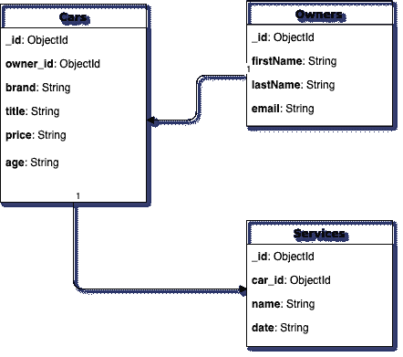
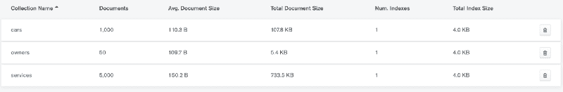
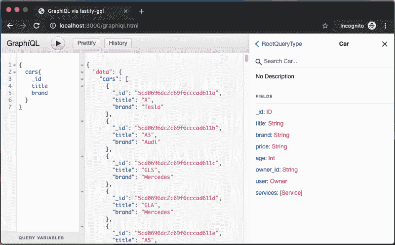
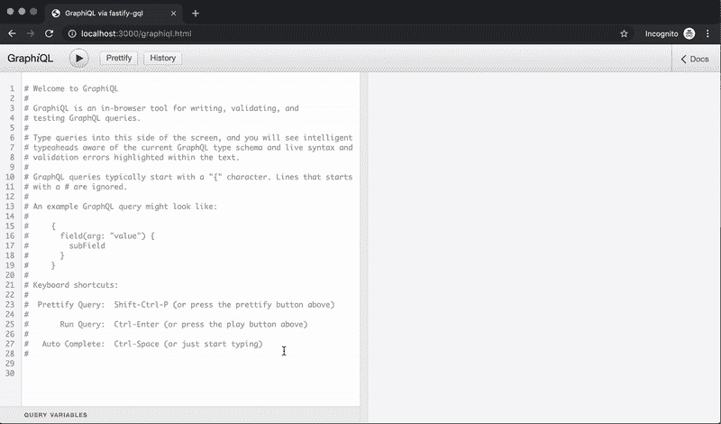
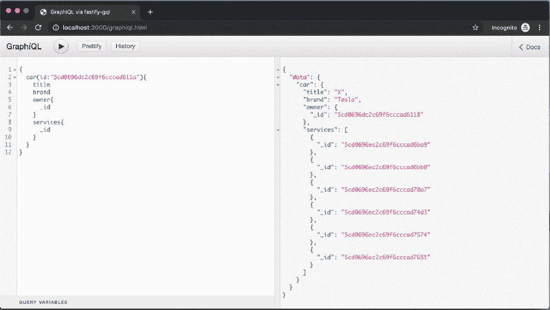
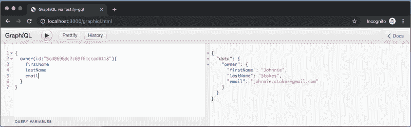
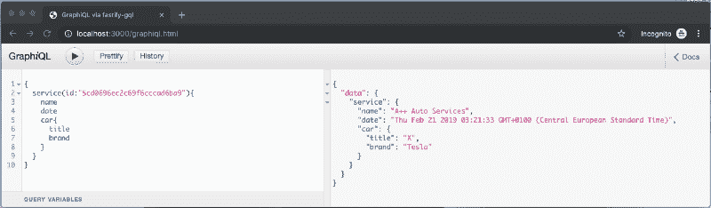
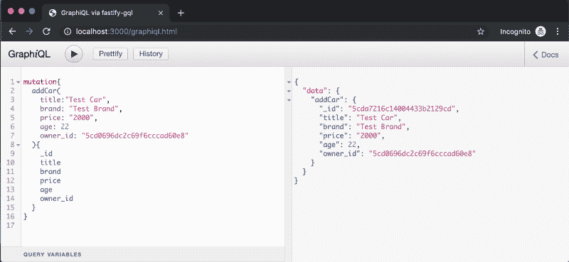
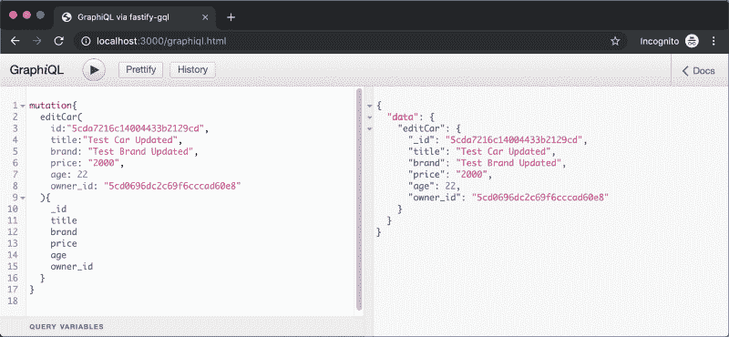
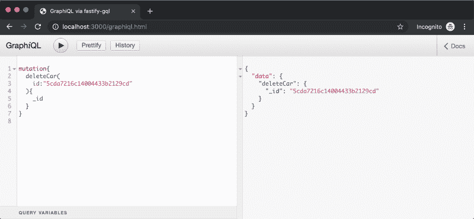

# 如何用 Node.js、MongoDB 和 Fastify 构建超快的 GraphQL API

> 原文：<https://www.freecodecamp.org/news/how-to-build-a-blazing-fast-graphql-api-with-node-js-mongodb-and-fastify-77fd5acd2998/>

本教程是一个四部分系列的第二部分，旨在带您从头开始部署一个功能全面的全栈应用程序。

*   第 1 部分:如何用 Node.js、MongoDB、Fastify 和 Swagger 构建超快的 REST APIs
*   **第 2 部分:如何用 Node.js、MongoDB、Fastify 和 GraphQL 构建超快的 GraphQL API！(你在这里。)**
*   第 3 部分:用一个 **GraphQL API** 耦合 **Vue.js** 。
*   第 4 部分:部署一个 **GraphQL API** 和 **Vue.js** 前端应用**。**

该系列的第一部分可在[这里](https://medium.freecodecamp.org/how-to-build-blazing-fast-rest-apis-with-node-js-mongodb-fastify-and-swagger-114e062db0c9)找到，应用程序的源代码可在[这里](https://github.com/siegfriedgrimbeek/fastify-graphql-api)找到。

在这一部分中，我们将重温第一部分中的**模型**、**控制器**和**路线**，然后将 [**GraphQL**](https://graphql.org/) 集成到应用程序中。作为奖励，我们还将使用[**faker . js**](https://github.com/marak/Faker.js/)**来创建一些假数据和种子**数据库**。**

### **简介:**

**GraphQL 是一种用于 API 的查询语言，也是一个用现有数据完成这些查询的运行时。**

**每个 **GraphQL** 查询都要经历三个阶段:查询被解析、验证和执行。**

**GraphQL 为您的 API 中的数据提供了一个完整的、可理解的描述，让客户能够准确地询问他们需要什么，让 API 随着时间的推移更容易发展，并支持强大的开发工具。[了解更多](https://graphql.org/)。**

 **[https://www.youtube.com/embed/T571423fC68?feature=oembed](https://www.youtube.com/embed/T571423fC68?feature=oembed)** 

### **先决条件…**

**如果你已经完成了本系列的第一部分，你应该已经掌握了初级/中级的 JavaScript 知识、 **Node.js、Fastify。JS** 和 **MongoDB(猫鼬)。****

**为了跟上进度，你需要完成这个系列的第一部分，或者从 T2 那里获得代码，尽管我强烈建议至少浏览一下 T4 的第一部分。**

### **我们开始吧！**

**通过打开您的**终端，**导航到您的项目目录，执行下面的每一行代码，克隆第一部分的 repo(如果您遵循第一部分，跳过这一步，继续您自己的代码):**

```
`git clone https://github.com/siegfriedgrimbeek/fastify-api.git
cd fastify-api`
```

**现在我们有了代码库的副本，我们将通过运行下面的代码来更新我们的包和`package.json`文件:**

```
`sudo npm i -g npm-check-updates
ncu -u
npm install`
```

**首先我们全局安装 [npm](https://docs.npmjs.com/about-npm/) 包“[**NPM-check-updates**](https://www.npmjs.com/package/npm-check-updates)”，然后我们使用这个包用最新的包版本自动更新我们的`package.json`文件，然后我们通过运行`npm install`安装/更新我们所有的 **npm 模块**。**

**这样做是为了确保每个完成教程的人都使用相同的包版本。**

### **重构我们的服务器并启动应用程序！**

****

**与所有软件解决方案一样，随着解决方案的增长，开发人员经常需要**重新访问**和 [**重构**](https://en.wikipedia.org/wiki/Code_refactoring) 代码。**

**在`src`目录中，我们将创建一个名为`server.js`的新文件:**

```
`cd src
touch server.js`
```

**将以下代码代码添加到`server.js`文件中:**

```
`// Require the fastify framework and instantiate it
const fastify = require('fastify')({
	logger: true
})

// Require external modules
const mongoose = require('mongoose')

// Connect to DB
mongoose
	.connect('mongodb://localhost/mycargarage')
	.then(() => console.log('MongoDB connected...'))
	.catch(err => console.log(err))

module.exports = fastify`
```

**server.js**

**我们现在已经将启动**服务器**的逻辑提取到了`server.js`文件中，允许我们在整个项目中重用这些代码。**

**接下来，我们需要更新`src`目录中的`index.js`文件:**

```
 `// Import Server
const fastify = require('./server.js')

// Import Routes
const routes = require('./routes')

// Import Swagger Options
const swagger = require('./config/swagger')

// Register Swagger
fastify.register(require('fastify-swagger'), swagger.options)

// Loop over each route
routes.forEach((route, index) => {
	fastify.route(route)
})

// Run the server!
const start = async () => {
	try {
		await fastify.listen(3000, '0.0.0.0')
		fastify.swagger()
		fastify.log.info(`server listening on ${fastify.server.address().port}`)
	} catch (err) {
		fastify.log.error(err)
		process.exit(1)
	}
}
start()`
```

**index.js**

**一旦我们设置和配置了 **GraphQL，我们将再次访问`index.js`文件。****

**在您的**终端**中运行以下代码，启动 **Fastify** 服务器:**

```
`npm start`
```

**注意，没有默认的路由设置，所以现在，导航到 [http://localhost:3000/](http://localhost:3000/) 将导致服务器返回 404 错误，这是正确的。**

### **启动 MongoDB 并更新模型**

****

**让我们扩展现有模型，将**服务**和**所有者也包括进来。**下图展示了各系列之间的关系:**

**

Data models** 

*   **一辆车可以有一个主人。**
*   **一个车主可以拥有多辆汽车。**
*   **一辆车可以有多种服务。**

**重新访问`models`目录中的`Car.js`文件，并更新如下:**

```
`// External Dependancies
const mongoose = require("mongoose")
const ObjectId = mongoose.Schema.Types.ObjectId

const carSchema = new mongoose.Schema({
  title: String,
  brand: String,
  price: String,
  age: Number,
  owner_id: ObjectId
})

module.exports = mongoose.model("Car", carSchema)`
```

**Car.js**

**在`models`目录下新建两个文件，`Owner.js` 和`Service.js`，分别添加以下代码:**

**`Owner.js`**

```
`// External Dependancies
const mongoose = require('mongoose')

const ownerSchema = new mongoose.Schema({
	firstName: String,
	lastName: String,
	email: String
})

module.exports = mongoose.model('Owner', ownerSchema)`
```

**Owner.js**

**`Service.js`**

```
`// External Dependancies
const mongoose = require("mongoose")
const ObjectId = mongoose.Schema.Types.ObjectId

const serviceSchema = new mongoose.Schema({
  car_id: ObjectId,
  name: String,
  date: String
})

module.exports = mongoose.model("Service", serviceSchema)
view rawService.js hosted with ❤ by GitHub`
```

**上述代码中没有使用新概念。我们刚刚创建了标准的[猫鼬模式](https://mongoosejs.com/docs/guide.html)，与`Car.js`模型一样。**

### **重新访问汽车控制器并创建附加控制器**

**`carController.js`有一些细微的变化，因此导航到`controllers`目录，并按如下所示更新您的文件:**

```
`// External Dependancies
const boom = require('boom')

// Get Data Models
const Car = require('../models/Car')

// Get all cars
exports.getCars = async () => {
	try {
		const cars = await Car.find()
		return cars
	} catch (err) {
		throw boom.boomify(err)
	}
}

// Get single car by ID
exports.getSingleCar = async req => {
	try {
		const id = req.params === undefined ? req.id : req.params.id
		const car = await Car.findById(id)
		return car
	} catch (err) {
		throw boom.boomify(err)
	}
}

// Add a new car
exports.addCar = async req => {
	try {
		const car = new Car(req)
		const newCar = await car.save()
		return newCar
	} catch (err) {
		throw boom.boomify(err)
	}
}

// Update an existing car
exports.updateCar = async req => {
	try {
		const id = req.params === undefined ? req.id : req.params.id
		const updateData = req.params === undefined ? req : req.params
		const update = await Car.findByIdAndUpdate(id, updateData, { new: true })
		return update
	} catch (err) {
		throw boom.boomify(err)
	}
}

// Delete a car
exports.deleteCar = async req => {
	try {
		const id = req.params === undefined ? req.id : req.params.id
		const car = await Car.findByIdAndRemove(id)
		return car
	} catch (err) {
		throw boom.boomify(err)
	}
}`
```

**carController.js**

**在`controllers`目录下新建两个文件，`serviceController.js`和`ownerController.js`，分别在文件中添加以下代码:**

**`serviceController.js`**

```
`// External Dependancies
const boom = require('boom')

// Get Data Models
const Service = require('../models/Service')

// Get single service ID
exports.getSingleService = async req => {
	try {
		const id = req.params === undefined ? req.id : req.params.id
		const service = await Service.findById(id)
		return service
	} catch (err) {
		throw boom.boomify(err)
	}
}

// Get single car's services
exports.getCarsServices = async req => {
	try {
		const id = req.params === undefined ? req.id : req.params.id
		const services = await Service.find({ car_id: id })
		return services
	} catch (err) {
		throw boom.boomify(err)
	}
}`
```

**serviceController.js**

**`ownerController.js`**

```
`// External Dependancies
const boom = require('boom')

// Get Data Models
const Owner = require('../models/Owner')
const Car = require('../models/Car')

// Get all owners
exports.getOwner = async () => {
	try {
		const owners = await Owner.find()
		return owners
	} catch (err) {
		throw boom.boomify(err)
	}
}

// Get single owner by ID
exports.getSingleOwner = async req => {
	try {
		const id = req.params === undefined ? req.id : req.params.id
		const owner = await Owner.findById(id)
		return owner
	} catch (err) {
		throw boom.boomify(err)
	}
}

// Get single owner's cars
exports.getOwnersCars = async req => {
	try {
		const id = req.params === undefined ? req.id : req.params.id
		const cars = await Car.find({ owner_id: id })
		return cars
	} catch (err) {
		throw boom.boomify(err)
	}
}`
```

**ownerController.js**

**控制器的最大变化是我们如何获得参数:**

```
`const id = req.params === undefined ? req.id : req.params.id
const updateData = req.params === undefined ? req : req.params`
```

**上面的代码称为“ [**”条件(三元)运算符**](https://developer.mozilla.org/en-US/docs/Web/JavaScript/Reference/Operators/Conditional_Operator)**”**，用作下面 if 语句的简写:**

```
`let id

if (req.params === undefined) {

id = req.id

} else {

id = req.params.id

}`
```

**我们使用**三元运算符**来适应来自 **REST API** 和 **GraphQL API** 的请求，因为它们的实现略有不同。**

### **是时候在数据库中植入一些虚假数据了！**

****

**在`src`目录中，让我们通过运行以下代码创建一个新的目录和文件:**

```
`mkdir helpers
touch seed.js`
```

**将以下代码添加到`seed.js`文件中:**

```
 `// Import external dependancies
const faker = require('faker')
const boom = require('boom')

// Import internal dependancies
const fastify = require('../server.js')

// Fake data
const cars = [
	{
		name: 'Tesla',
		models: ['S', 'E', 'X', 'Y']
	},
	{
		name: 'Mercedes',
		models: ['GLA', 'GLC', 'GLE', 'GLS']
	},
	{
		name: 'BMW',
		models: ['X4', 'Z3', 'M2', '7']
	},
	{
		name: 'Audi',
		models: ['A1', 'A3', 'A4', 'A5']
	},
	{
		name: 'Ford',
		models: ['Fiesta', 'Focus', 'Fusion', 'Mustang']
	}
]
const serviceGarages = ['A++ Auto Services', "Gary's Garage", 'Super Service', 'iGarage', 'Best Service']

// Get Data Models
const Car = require('../models/Car')
const Owner = require('../models/Owner')
const Service = require('../models/Service')

// Fake data generation functions
const generateOwnerData = () => {
	let ownerData = []
	let i = 0

	while (i < 50) {
		const firstName = faker.fake('{{name.firstName}}')
		const lastName = faker.fake('{{name.lastName}}')
		const email = faker.fake(`${firstName.toLowerCase()}.${lastName.toLowerCase()}@gmail.com`)

		const owner = {
			firstName,
			lastName,
			email
		}

		ownerData.push(owner)
		i++
	}

	return ownerData
}

const generateCarData = ownersIds => {
	let carData = []
	let i = 0

	while (i < 1000) {
		const owner_id = faker.random.arrayElement(ownersIds)
		const carObject = faker.random.arrayElement(cars)
		const title = faker.random.arrayElement(carObject.models)
		const price = faker.random.number({ min: 5000, max: 30000 })
		const age = faker.random.number({ min: 2, max: 10 })

		const car = {
			owner_id,
			brand: carObject.name,
			title,
			price,
			age
		}

		carData.push(car)
		i++
	}

	return carData
}

const generateServiceData = carsIds => {
	let serviceData = []
	let i = 0

	while (i < 5000) {
		const car_id = faker.random.arrayElement(carsIds)
		const name = faker.random.arrayElement(serviceGarages)
		const date = faker.fake('{{date.past}}')

		const service = {
			car_id,
			name,
			date
		}

		serviceData.push(service)
		i++
	}

	return serviceData
}

fastify.ready().then(
	async () => {
		try {
			const owners = await Owner.insertMany(generateOwnerData())
			const ownersIds = owners.map(x => x._id)

			const cars = await Car.insertMany(generateCarData(ownersIds))
			const carsIds = cars.map(x => x._id)

			const services = await Service.insertMany(generateServiceData(carsIds))

			console.log(`
      Data successfully added:
        - ${owners.length} owners added.
        - ${cars.length} cars added.
        - ${services.length} services added.
      `)
		} catch (err) {
			throw boom.boomify(err)
		}
		process.exit()
	},
	err => {
		console.log('An error occured: ', err)
		process.exit()
	}
)`
```

**seed.js**

**让我们来分解堆积如山的代码:**

**首先我们导入两个外部库， [**Faker.js**](https://github.com/marak/Faker.js/) 用于生成假数据， [**Boom**](https://github.com/hapijs/boom) ，用于抛出 http 友好错误对象。**

**然后我们导入`server.js`文件，这将启动我们服务器的一个实例，允许我们与**模型**进行交互。**

**然后我们用假数据声明两个数组，`cars`和`serviceGarages`。**

**然后我们导入`models`并声明三个函数(`generateOwnerData`、`generateCarData`、`generateServiceData`)，每个函数分别返回一个包含**所有者**、**汽车**和**服务**数据的对象数组。**

**一旦 **Fastify.js** 实例准备就绪，我们使用[**mongose**`insertMany()`函数](https://mongoosejs.com/docs/api.html#model_Model.insertMany)将生成的数组插入数据库。然后，该函数返回包含原始对象数据和每条记录的`ids`的对象数组。**

**我们使用 [**JavaScript Map**](https://developer.mozilla.org/en-US/docs/Web/JavaScript/Reference/Global_Objects/Array/map) 函数来创建一个由`ids` **车主**和**汽车**组成的数组。我们在生成汽车数据时使用`ownersIDs`数组，在生成服务数据时使用`carsIds`数组，它们被传递到各自的函数中，然后从中随机选择值。**

**最后，我们需要安装 **Faker.js** 包，并将种子任务添加到我们的`package.json`文件中。**

**我们可以通过导航到**根目录**并运行以下代码来添加 **Faker.js** 包:**

```
`npm i faker -D`
```

**然后，我们将以下内容添加到`package.json`文件中:**

```
`...

"scripts": {

...

"seed": "node ./src/helpers/seed.js"

},

...`
```

**就是这样！现在，我们可以使用以下代码从项目根目录运行我们的播种脚本:**

```
`npm run seed`
```

**如果您正在使用 [MongoDB Compass](https://www.mongodb.com/products/compass) (您应该这样做)，您将会看到数据库中的数据:**

**

“mycargarage” database viewed in MongoDB Compass** 

### **GraphQL 安装、设置和测试**

****

**让我们从导航到**根目录**并运行以下代码开始:**

```
`npm i fastify-gql graphql`
```

**以上安装了 **GraphQL** 和 **Fastify 准系统 GraphQL** 适配器。**

**导航到`src`目录并运行以下代码:**

```
`mkdir schema
cd shema
touch index.js`
```

**导航到`src`目录，用以下内容更新`index.js`文件:**

```
`// Import Server
const fastify = require('./server.js')

// Import external dependancies
const gql = require('fastify-gql')

// Import GraphQL Schema
const schema = require('./schema')

// Register Fastify GraphQL
fastify.register(gql, {
   schema,
   graphiql: true
})

... end here

// Import Routes
const routes = require('./routes')`
```

**使用上面的代码，我们需要 **Fastify GraphQL 适配器，**导入**模式**，并向 **Fastify 注册 **GraphQl 适配器**。****

**我们注册**模式**并启用 **GraphiQL，**一个浏览器内 [**IDE**](https://en.wikipedia.org/wiki/Integrated_development_environment) 用于探索**GraphiQL**。**

**导航到`schema`目录，打开`index.js`文件，添加以下样板代码:**

```
`// Import External Dependancies
const graphql = require('graphql')

// Destructure GraphQL functions
const {
	GraphQLSchema,
	GraphQLObjectType,
	GraphQLString,
	GraphQLInt,
	GraphQLID,
	GraphQLList,
	GraphQLNonNull
} = graphql

// Import Controllers
const carController = require('../controllers/carController')
const ownerController = require('../controllers/ownerController')
const serviceController = require('../controllers/serviceController')

// Define Object Types
const carType = new GraphQLObjectType({
	name: 'Car',
	fields: () => ({})
})

const ownerType = new GraphQLObjectType({
	name: 'Owner',
	fields: () => ({})
})

const serviceType = new GraphQLObjectType({
	name: 'Service',
	fields: () => ({})
})

// Define Root Query
const RootQuery = new GraphQLObjectType({
	name: 'RootQueryType',
	fields: {
		car: {},
		cars: {},
		owner: {},
		service: {}
	}
})

// Define Mutations
const Mutations = new GraphQLObjectType({
	name: 'Mutations',
	fields: {
		addCar: {
			type: carType,
			args: {},
			async resolve(args) {
				return ''
			}
		},
		editCar: {
			type: carType,
			args: {},
			async resolve(args) {
				return ''
			}
		},
		deleteCar: {
			type: carType,
			args: {},
			async resolve(args) {
				return ''
			}
		}
	}
})

// Export the schema
module.exports = new GraphQLSchema({
	query: RootQuery,
	mutation: Mutations
})`
```

**index.js**

**让我们浏览一下上面的代码:**

**我们需要主 **GraphQL** 包，并使用 [JavaScript 析构](https://developer.mozilla.org/en-US/docs/Web/JavaScript/Reference/Operators/Destructuring_assignment)来获得必要的 **GraphQL** 函数(`GraphQLSchema`、`GraphQLObjectType`、`GraphQLString`、`GraphQLInt`、`GraphQLID`、`GraphQLList`和`GraphQLNonNull`)。**

**我们导入我们的三个`controllers` ( `carController`、`ownerController`和`serviceController`)。**

**我们声明了`carType`、`ownerType`和`serviceType`、[、 **GraphQL 对象类型**、**、**，它们是接受一个对象作为参数的函数，带有一个`name`和一个`fields`键。](https://graphql.org/graphql-js/object-types/)**

**这些函数用于定义我们的 **GraphQL** 模式，类似于前面定义的**mongose**模型。**

**这些字段可以返回特定的**类型**，以及接受参数的**方法**。[了解更多关于对象类型的信息](https://graphql.org/graphql-js/object-types/)。**

**然后我们声明`RootQuery`，它也是一个 **GraphQL 对象类型**，并且位于每个 **GraphQL** 服务器的顶层。它代表了进入 **GraphQL API 的所有可能的入口点。** [了解更多关于根字段和解析器的信息](https://graphql.org/learn/execution/)。**

**然后我们声明我们的`Mutations`，它被用来**改变数据。**尽管可以实现任何查询来更改数据，但是导致更改的操作应该通过变异显式发送**。[了解更多关于突变的信息](https://graphql.org/learn/queries/#mutations)。****

**最后我们导出`GraphQLSchema.`**

**现在我们有了模板设置，我们可以开始填充**对象类型**、**根查询**和**突变**。**

**注意，有可用的[mongose 到 GraphQL](https://github.com/sarkistlt/mongoose-schema-to-graphql) 模式生成器，但是出于教程的目的，我们将手动创建模式。**

**让我们将`carType` **对象类型**更新如下:**

```
`const carType = new GraphQLObjectType({
	name: 'Car',
	fields: () => ({
		_id: { type: GraphQLID },
		title: { type: GraphQLString },
		brand: { type: GraphQLString },
		price: { type: GraphQLString },
		age: { type: GraphQLInt },
		owner_id: { type: GraphQLID },
		owner: {
			type: ownerType,
			async resolve(parent, args) {
				return await ownerController.getSingleOwner({ id: parent.owner_id })
			}
		},
		services: {
			type: new GraphQLList(serviceType),
			async resolve(parent, args) {
				return await serviceController.getCarsServices({ id: parent._id })
			}
		}
	})
})`
```

**carType Object Type**

**让我们更深入地研究一下 **GraphQL** 函数，从 **GraphQL** 中的[标量](https://softwareengineering.stackexchange.com/questions/238033/what-does-it-mean-when-data-is-scalar)类型开始:**

****GraphQL** 自带一组默认的标量类型:**

*   **`Int`:一个带符号的 32 位整数。`GraphQLInt`**
*   **`Float`:有符号双精度浮点值。`GraphQLFloat`**
*   **`String`:UTF‐8 字符序列。`GraphQLString`**
*   **`Boolean` : `true`或`false`。`GraphQLBoolean`**
*   **ID 标量类型代表一个唯一的标识符，通常用于重新提取一个对象或者作为一个缓存的键。ID 类型以与字符串相同的方式序列化；然而，将它定义为`ID`意味着它不是人类可读的。`GraphQLID`**

**`owner`和`service`字段是有趣的地方。这些字段没有像其他字段一样被定义为**标量类型**——相反，它们的`type`引用了我们已经创建并且还没有填充的`ownerType`和`serviceType`。**

**我们传递给`owner`和`service`字段的第二个参数是[解析器](https://graphql.org/learn/execution/)函数。**

**解析器函数或方法是**为模式中的类型或字段解析值**的函数**

**解析器也可以是异步的！它们可以解析来自另一个 **REST API、数据库、缓存、常量等的值。****

> **您可以将 GraphQL 查询中的每个字段视为返回下一个类型的前一个类型的函数或方法。事实上，这正是 GraphQL 的工作方式。每种类型上的每个字段都由 GraphQL 服务器开发人员提供的一个名为*解析器*的函数支持。当一个字段被执行时，相应的*解析器*被调用以产生下一个值。
> 
> 如果一个字段产生一个类似字符串或数字的标量值，那么执行完成。但是，如果一个字段产生一个对象值，那么查询将包含适用于该对象的另一个字段选择。这一直持续到达到标量值。GraphQL 查询总是以标量值结束。**

**为了创建不同类型之间的关系，我们将`_id`和`owner_id`值传递给各自的控制器函数。**

**因此，本质上，我们需要车主的详细信息以及汽车的详细信息:**

```
`return await userController.getSingleOwner({ id: parent.owner_id })`
```

**以及与汽车相关的所有服务的详细信息:**

```
`return await serviceController.getCarsServices({ id: parent._id })`
```

**为了用 **GraphQL，**返回一个列表或数组，我们使用`GraphQLList`。[这里的](https://graphqlmastery.com/blog/graphql-list-how-to-use-arrays-in-graphql-schema)是一个关于在 **GraphQL** 模式中使用数组的很有深度的教程，但是它真的很简单:只要我们需要一个数组，我们就会使用`GraphQLList`函数。**

**让我们用下面的代码更新`ownerType`和`serviceType`:**

**`ownerType`**

```
`const ownerType = new GraphQLObjectType({
	name: 'Owner',
	fields: () => ({
		_id: { type: GraphQLID },
		firstName: { type: GraphQLString },
		lastName: { type: GraphQLString },
		email: { type: GraphQLString },
		cars: {
			type: new GraphQLList(carType),
			async resolve(parent, args) {
				return await ownerController.getOwnersCars({ id: parent._id })
			}
		}
	})
})`
```

**ownerType Object Type**

**`serviceType`**

```
`const serviceType = new GraphQLObjectType({
	name: 'Service',
	fields: () => ({
		_id: { type: GraphQLID },
		car_id: { type: GraphQLID },
		name: { type: GraphQLString },
		date: { type: GraphQLString },
		car: {
			type: carType,
			async resolve(parent, args) {
				return await carController.getSingleCar({ id: parent.car_id })
			}
		}
	})
})`
```

**serviceType Object Type**

**以上两个**对象类型**与`carType`非常相似。您可以注意到不同的**对象类型**及其关系之间的模式。**

**我们现在可以用下面的代码填充`RootQuery`根:**

```
`const RootQuery = new GraphQLObjectType({
	name: 'RootQueryType',
	fields: {
		car: {
			type: carType,
			args: { id: { type: GraphQLID } },
			async resolve(parent, args) {
				return await carController.getSingleCar(args)
			}
		},
		cars: {
			type: new GraphQLList(carType),
			async resolve(parent, args) {
				return await carController.getCars()
			}
		},
		owner: {
			type: ownerType,
			args: { id: { type: GraphQLID } },
			async resolve(parent, args) {
				return await ownerController.getSingleOwner(args)
			}
		},
		service: {
			type: serviceType,
			args: { id: { type: GraphQLID } },
			async resolve(parent, args) {
				return await serviceController.getSingleService(args)
			}
		}
	}
})`
```

**rootQuery Object Type**

**在上面的代码中没有新的概念，但是请记住,`RootQuery`查询是 **GraphQL API 上所有查询的入口点。**从上面我们可以看到，我们可以直接运行下面的查询:**

*   **把所有的车都开来**
*   **买一辆车**
*   **获得单一所有者**
*   **获得单一服务**

**让我们打开 **GraphiQL** 用户界面，构建一些查询:[http://localhost:3000/GraphiQL . html](http://localhost:3000/graphiql.html)**

****

**查询在左边输入，结果在中间，文档浏览器在右边。**

**documentation explorer 可用于探索整个图形，直至标量级别。这在构建查询时非常有用。**

**用于构建查询的语言类似于 JSON。这张[备忘单](https://devhints.io/graphql)是很好的参考。**

**下面演示为什么 **GraphQL** 这么牛逼 **:****

**

GraphiQL IDE** 

**在上面的例子中，我们使用了`cars`根查询来显示所有汽车、车主及其服务的列表。**

**

Get a single car — car root query** **

Get a single owner — owner root query** **

Get a single service — service root query** 

**我们还有最后一个话题要谈，那就是`mutations`。让我们用下面的代码更新`mutations`:**

```
`const Mutations = new GraphQLObjectType({
	name: 'Mutations',
	fields: {
		addCar: {
			type: carType,
			args: {
				title: { type: new GraphQLNonNull(GraphQLString) },
				brand: { type: new GraphQLNonNull(GraphQLString) },
				price: { type: GraphQLString },
				age: { type: GraphQLInt },
				owner_id: { type: GraphQLID }
			},
			async resolve(parent, args) {
				const data = await carController.addCar(args)
				return data
			}
		},
		editCar: {
			type: carType,
			args: {
				id: { type: new GraphQLNonNull(GraphQLID) },
				title: { type: new GraphQLNonNull(GraphQLString) },
				brand: { type: new GraphQLNonNull(GraphQLString) },
				price: { type: new GraphQLNonNull(GraphQLString) },
				age: { type: new GraphQLNonNull(GraphQLInt) },
				owner_id: { type: GraphQLID }
			},
			async resolve(parent, args) {
				const data = await carController.updateCar(args)
				return data
			}
		},
		deleteCar: {
			type: carType,
			args: {
				id: { type: new GraphQLNonNull(GraphQLID) }
			},
			async resolve(parent, args) {
				const data = await carController.deleteCar(args)
				return data
			}
		}
	}
})`
```

**mutations**

**和以前一样，我们声明我们的**对象类型**，指定**名称**和**字段**。**

**一个变异由**类型**、**参数**和**异步解析**函数组成。 **resolve** 函数将参数传递给控制器，控制器返回变异的结果。**

**

addCar Mutation** **

editCar Mutation** **

deleteCar Mutation** 

**现在你已经编写了一个全功能的 **REST API** 和一个全功能的 **GraphQL API。****

**没有规则规定一个人应该只使用 **REST** 或者只使用 **GraphQL。**在一些项目中，最佳解决方案可能是两者的混合。这实际上是根据项目来决定的。**

**你可以从 Git [这里](https://github.com/siegfriedgrimbeek/fastify-graphql-api)下载源代码。**

#### **下一步是什么？**

**在下一个教程中，我们将使用我们的 **GraphQL** **API** 和一个 **Vue.js** 前端作为一个单页面应用程序！**