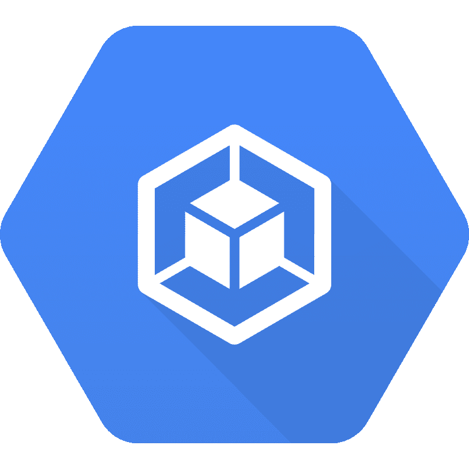
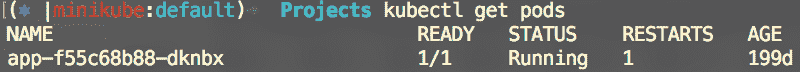
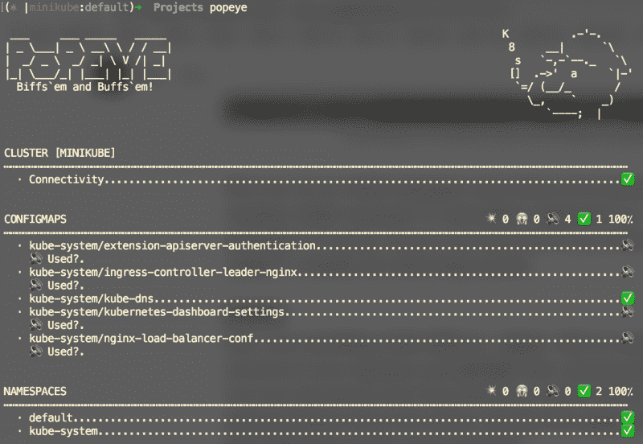

# 如何建立一个严肃的 Kubernetes 终端

> 原文：<https://www.freecodecamp.org/news/how-to-set-up-a-serious-kubernetes-terminal-dd07cab51cd4/>

克里斯·库尼

# 如何建立一个严肃的 Kubernetes 终端

#### 成长中的 k8s 书呆子需要的所有 CLI 工具



Kubernetes 预装了一个出色的 CLI。对于基本操作，它非常有效。唉，当一个人需要快速做某事时，复杂性就会增加。

Kubernetes 社区已经构建了各种基于 web 的工具来监控您的集群——[kube ops view](https://github.com/hjacobs/kube-ops-view)、 [grafana](https://medium.com/htc-research-engineering-blog/monitoring-kubernetes-clusters-with-grafana-e2a413febefd) 等。然而，拥有一个装备齐全的终端将会加快找到问题根源的速度。它是你的瑞士军刀的基本组成部分。

以下是我在 OSX 终端上使用的开源工具的简短列表。当一起使用时，它们允许我跳过我的 kubernetes 集群，快速解决问题，并监控行为。我去掉了许多小的实用工具，坚持使用我每天都在使用的工具。

#### 在任何工具之前…

在您使用这些工具之前，我强烈建议您安装 [zsh](https://ohmyz.sh/) 。它是一个优秀的、围绕标准 OSX 终端的开源包装器。它的功能更加丰富和直观，你可以安装的插件非常棒。列出的一些工具假设您已经安装了 ZSH。

#### [k9s](https://github.com/derailed/k9s)


oh yes

我开始变强了。K9s 是 kubernetes 集群 CLI 工具的妈妈熊。你可以一键 SSH 直接进入 pods，查看日志，删除资源等等。它为您将要执行的最常见操作提供了卓越的访问能力。这是任何一个使用 kubernetes 的工程师的主食。

#### [kubectx](https://github.com/ahmetb/kubectx)

但是 K9s 不支持在 kubernetes 配置中的各种上下文之间切换。我们只有一个集群的情况非常罕见。在这两者之间切换非常简单

```
kubectl config use-context my-context
```

但是有了这个，就有了一些先决条件:

*   在运行之前，您需要知道集群的名称。
*   还有另一个类似的`set-context`命令可能会使您出错。

`kubectx`提出了一个更简单的替代方案。如果您单独运行`kubectx`，它将列出您的`.kube/config`文件中的所有上下文。然后，您可以提供您感兴趣的上下文的名称:

```
kubectx my-context
```

不需要记住所有的上下文，不需要手动检查文件，也没有可能得到错误的命令。简单明了。与`k9s`相结合，这可以通过最少的按键从您的 CLI 提供大量的导航功能。

#### [库本斯](https://github.com/ahmetb/kubectx)

一旦您在上下文中穿梭，您可能想要深入到一个特定的名称空间。同样，集群中有多个名称空间是很常见的。嗯， [ahmetb](https://twitter.com/ahmetb) (带你来的那位先生`kubectx`)也拼了`kubens`。它和`kubectx`一样，只是名称空间不同。

```
kubens kube-system
```

默认情况下，现在您所有的命令都针对`kube-system`名称空间运行。您还可以运行`kubens`来查看您的名称空间列表，而不需要其他任何东西。

#### [kube-ps1](https://github.com/jonmosco/kube-ps1)

因此，您可以在上下文和名称空间之间切换。但是你怎么知道你现在瞄准的是哪一个呢？一直查下去很痛苦。此时，要找到答案，你需要跑步:

```
kubens
kubectx
kubectl <my-command>
```

为了消除这一点，`ps1`是一个 zsh 插件，它会自动显示您当前的上下文和名称空间:



I’m pointing at my minikube context and the default namespace

现在，无需运行任何命令，您就可以看到您指出了哪个名称空间和上下文。它也是高度可配置的——如果你只对其中一个感兴趣，你可以关闭名称空间或上下文，或者你可以使用`kubeoff`来完全禁用整个东西。

#### [大力水手](https://github.com/derailed/popeye)

现在，谈一点不同的东西。`popeye`将自动扫描存储库中的资源，并突出显示明显的问题。这是一个非常新的工具，我发现它非常有用。如果你在集群中寻找一些春季大扫除，从`popeye`开始会给你一些需要修复的明确指示。



This was the first few lines of a very long, detailed report.

#### 船尾

用过`kubectl logs`？注意到你一次只能跟踪一个舱的日志吗？好了，不用担心了！Stern 是一个工具，它允许你基于一个非常灵活的查询从多个 pod 中提取日志。

我经常在我的推特账户上谈论 kubernetes、DevOps 和更多的东西。