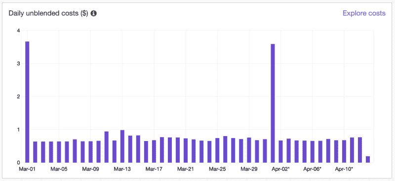

# 在 AWS Elastic Beanstalk 上运行生产节点应用程序的现实

> 原文：<https://www.freecodecamp.org/news/the-reality-of-running-a-production-node-app-on-aws-elastic-beanstalk-55c78b5dad0b/>

作者杰瑞德·纳特

# 在 AWS Elastic Beanstalk 上运行生产节点应用程序的现实

#### 在 AWS 的 ELB 平台上运行生产节点应用 2 年的经验教训

Photo by [Shane Rounce](https://unsplash.com/photos/1ZZ96uESRJQ?utm_source=unsplash&utm_medium=referral&utm_content=creditCopyText) on [Unsplash](https://unsplash.com/search/photos/technology?utm_source=unsplash&utm_medium=referral&utm_content=creditCopyText)

### 前沿问题

老实说， [AWS 定价计算器](https://calculator.s3.amazonaws.com/index.html)令人困惑。部分原因是因为 AWS 提供的*点菜*支付方式。这使得给客户一个好的报价变得困难。希望这篇文章能提供一些运行一个应用程序的成本，以及一些降低成本的方法。

### 运行一个应用程序的真实成本

我在 ELB 管理 node 网络应用已经有两年了。第一年很棒，他们免费给你一切(大部分)！在那之后，你必须开始为一些东西付费，比如 EC2 实例。

本文将关注我的特定应用程序需求，这是一个基于节点的 express 应用程序，托管在 Elastic Beanstalk 上。

关于构建的完整细节，请参见我之前的文章[这里](https://medium.freecodecamp.org/how-to-deploy-a-node-js-app-to-the-aws-elastic-beanstalk-f150899ed977)。

#### 故障

这是我目前在 AWS 上运行的内容:

单一 EBS 环境(美国西部地区):

*   1 个传统负载平衡器
*   1 个 t2.micro EC2 实例
*   保存图像的 S3 存储桶(编写本文时为 7 GB)
*   1 53 号公路托管区

**$18** (负载均衡器)+ **$5** (EC2 带 an RI)+**$ 0.50**(53 路)+**$ 0.17**(S3)+**$ 0.21**(数据传输)=大致一个月**25 美元。**

**此外，我在其他地方托管了一个 MongoDB，所以如果您计划在 AWS 上托管一个 DB，这将会产生额外的成本。我们来分解一下各种费用。**

#### **负载平衡**

**这是堆栈中最昂贵的部分。它的成本:**

*   **每个传统负载平衡器小时(或不足一小时)0.025 美元**
*   **传统负载平衡器处理每 GB 数据的成本为 0.008 美元**

**这意味着，如果你一天 24 小时运行你的应用程序，每月大约需要 18 美元以上的数据费用。**

#### **EC2 实例**

**按需 EC2 实例比它们应有的更昂贵。为了节省一些钱，请参考下面关于保留 EC2 实例的部分。如果您想知道，按需运行上面提到的相同类型的 EC2 实例将花费 8.40 美元。**

#### **S3**

**我有几个 S3 桶。一个用于我的静态主页，一个用于保存图像，一个用于保存应用程序版本。据我所知，ELB 自动创建一个用于管理应用程序版本。**

**S3 相当便宜，所以我不太担心试图一毛不拔，但有办法通过他们的[冰川](https://aws.amazon.com/glacier/)系统省钱。**

#### **数据库ˌ资料库**

**我在 mLab 托管我的 MongoDB 数据库，它很快就要离开了。所以当我弄清楚一旦我被迫转移到 Mongo 的地图上实际要花多少钱时，我会更新这个。**

### **保留的 EC2 实例**

**我们来谈谈保留实例(RI)。亚马逊复杂的计费系统是在 AWS 上管理任何东西最令人困惑的部分。保留实例可以减少一些开销，但是太混乱了。**

**在大量阅读并与 AWS 客户服务人员交谈后，这是我大概弄明白的。**

**首先，有两种不同的方法可以预订国际扶轮的位置:区域和可利用区域。区域意味着，它是特定于一个主要地区，如美国西部 2(俄勒冈州)。可用性区域(AZ)特定于该区域内的一个区域，例如 us-west-2 **a** (俄勒冈州)。**

**我在 us-west-2 中购买了一个 RI，它自动应用于我在该区域运行的实例。如果您在 AZ 内购买一个，它将只适用于特定的 AZ，例如 us-west-2a，因此如果 ELB 在 us-west2b 中创建了 EC2 实例，您就不走运了。**

**此外，还有“标准”和“可转换”类型的立管。我不是 100%明白这是什么意思，但据我所知，敞篷车在你可以换成什么方面更灵活，但更贵。**

**最后，有三种付款类型:无预付、部分预付和全部预付。这非常简单，当您保留实例时，您可以不用支付任何费用、部分费用或全部费用。在我看来，没有成本效益。然而，作为一个新客户，你最有可能不做任何前期工作。**

**根据 AWS 支持:**

> **没有预先保留的实例(RI)会对新账户造成重大的计费风险，因为它们是在 RI 的整个期限内按月支付的合同义务。因此，在我们建立成功的账单历史之前，新账户和不常使用的账户不能注册无预付风险投资。**

**如果你试图预先购买一个不，你可能会遇到这个错误。**

> **错误:您当前的配额不允许您购买所需数量的保留实例(服务:AmazonEC2 状态码:400；错误代码:ReservedInstancesLimitExceeded)**

**警告:不管出于什么原因，保留的实例需要一点时间“启动”,这意味着每月的第一天总是花费更多。我不确定这是为什么，但如果我弄明白了，我会更新这个。参见下图:**

****

### **棘手问题**

**这些只是对整个 EBS 的一些小抱怨，如果你好奇的话，我想我会把它们作为我的原始文章的附录。**

#### **自动更新并没有那么自动**

**不同版本的节点版本不一致。**

**参考下面的步骤，当 Node 不工作时，我如何管理 Linux 版本的变化。**

#### **运行多个环境**

**同时运行开发环境和生产环境很容易，但是成本很高。事实上，它会加倍。因此，我通常一结束就销毁开发环境。**

#### **文档是可怕的**

**AWS 太大了，对自己没好处。这也是我写这篇文章的部分原因。很难找到满足我特定需求的答案。**

### **我如何管理更新**

**我在笔记本电脑上安装了两个独立的 Git repo 实例。我有一个用于开发，一个用于生产。**

**我使用开发环境来开发！很简单。我使用生产文件夹的唯一目的是从 Git 主分支获取更新，运行我的 webpack 配置并部署到生产服务器。**

**它们分开的原因是因为我可以维护单独的弹性豆茎配置，而不必担心部署到错误的位置。**

#### **不需要改变 Linux 环境的更新**

**对于不需要对 linux 环境进行任何更改的更新，只需在终端中运行`eb deploy`即可。这是惊人的，大约需要 10 分钟的传播。**

#### **需要更改 Linux 环境的更新**

**偶尔，你会想更新 Linux 环境，但也不能，因为 AWS 是愚蠢的(我相信这是有原因的),只允许在每个 Linux 版本上安装特定版本的 Node。对于这一点，它有点复杂，但易于管理。**

1.  **推到新环境下的生产配置。上次我这样做的时候，我只是通过`eb create prod-1`创建了一个新实例。它会做它需要做的事情，并将您的应用程序部署到新环境中。**
2.  **确保您的所有更新都有效。似乎很明显，但这是一个很好的时间来确保没有任何新的构建打嗝。**
3.  **确保您的环境变量设置正确。这是前一个版本的一部分，但是要确保你是从正确的数据库中提取的。**
4.  **确保您的负载平衡器具有相同的 SSL 证书(如果适用)。有趣的是，如果你试图在没有证书的情况下访问 https 中的 ELB 实例，它将会失败！**
5.  **交换实例。最后，在一切就绪后，控制台中有一个按钮来交换实例 URL。很简单。你不需要在 53 号公路上做任何改变，它会为你做好一切。**

**所以，你有它。如何管理您的更新。很简单。**

### **最后的想法**

**如果你有任何让它更便宜/更容易的建议，我很乐意听听。我和下一个开发者一样喜欢关于工具和选项的讨论！**

**就这样，我将带着这个离开:快乐的编码！**