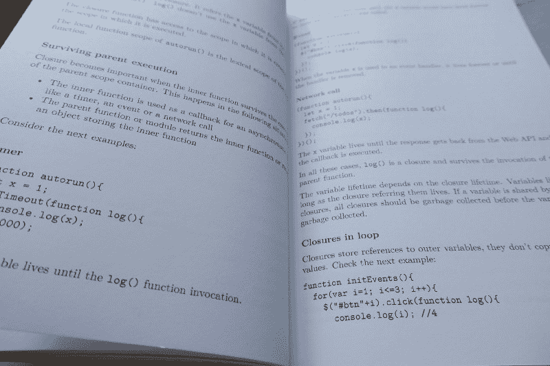
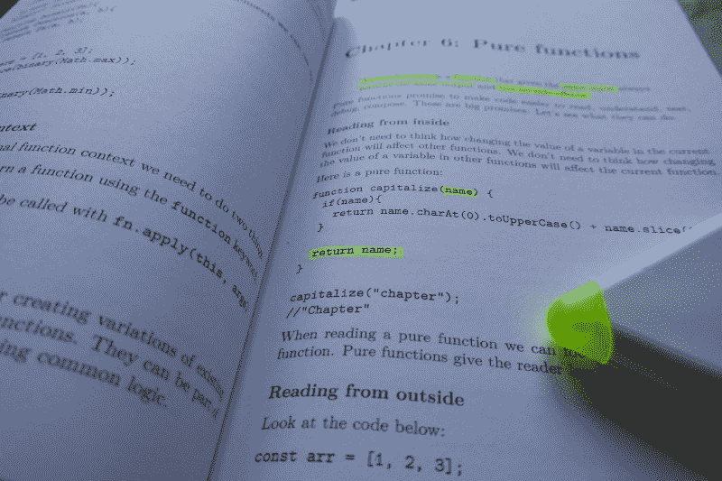

# 函数式 JavaScript 简介

> 原文：<https://www.freecodecamp.org/news/an-introduction-to-functional-javascript-e8dab63bb51d/>

嘿大家好！我写了一本名为[发现功能 JavaScript](https://www.amazon.com/dp/B07PBQJYYG) 的书，现在有平装本和 Kindle 两种版本。

在发表了几篇关于 JavaScript 函数式编程的文章后，我意识到我有足够的材料来思考一本书。因此，我从我以前的作品开始，填补了缺失的部分，并创作了一本关于 JavaScript 函数式编程的书。

我在本书中试图给出核心功能概念的实际例子。我认为，如果我们掌握了基本原则，那么处理更复杂的情况就会更容易。这就是这本书的目的。

我对纯函数有了更深的理解，除了它们很棒。如果它们这么好，为什么我们不仅仅使用纯函数来编写整个应用程序呢？

这本书背后的另一个原因是强调在 JavaScript 中不用类和原型构建封装对象的新方法。我甚至看到了将类作为给对象带来封装的一种方式。封装意味着隐藏信息。用 JavaScript 中的类构建的对象是在原型系统上构建的。它们的所有属性都是公开的，没有封装。

我尝试并希望我已经成功地以一种简单易学且实用的方式展示了基本的函数式编程概念。读完这本书后，你会理解更好的概念，比如一级函数、闭包、currying 和局部应用。你会明白什么是纯函数，如何创建纯函数。您将更好地理解不变性以及如何在 JavaScript 中实现它。

另一件没有考虑太多的事情是命名。随着 arrow 函数的兴起，越来越多的匿名函数被创建出来。所有这些背后的借口是箭头函数没有`this`并且语法更短。我不质疑这一点，我只是质疑这样一个事实，即有意义的名字是我们最了解的。去掉这一点会使代码更难理解。

这本书很浓缩，所以你甚至可以多看几遍。关于核心 JavaScript 概念，本文旨在对其进行概述，而不是深入细节。这方面有很多资源。

对我来说，这是一次很棒的经历，尝试组织我的思想，用一种简单、实用的方式来表达这些想法。我试着把重点放在主要的实用概念上，去掉所有对读者没有价值的广告。

对 JavaScript 基本概念的深入理解使我们能够更好地解决复杂的问题。我希望你会喜欢它。

以下是你能在里面找到的东西:

#### 第 1 章:JavaScript 概述

JavaScript 有原语、对象和函数。都是价值观。所有都被视为对象，甚至是原语。

数字、布尔、字符串、`undefined`和`null`是原语。

可以使用`var`、`let`和`const`定义变量。`let`声明有一个块范围。

除了`null`和`undefined`之外，原语被视为对象，因为它们有方法，但不是对象。

数组是值的索引集合。每个值都是一个元素。元素按其索引号排序和访问。

JavaScript 有动态类型。值有类型，变量没有。类型可以在运行时改变。

主 JavaScript 运行时是单线程的。两个功能不能同时运行。

#### 第 2 章:ES6+中的新特性

ES6 为 JavaScript 语言带来了更多特性。一些新的语法允许您以更具表现力的方式编写代码，一些功能完善了函数式编程工具箱，而一些功能是有问题的。

`let`声明具有块范围。

```
function doTask(){   
  let x = 1;   
  {       
    let x = 2;   
  }

  console.log(x); 
}  
doTask(); //1
```

`var`声明有函数作用域。它没有块范围。

```
function doTask(){   
  var x = 1;   
  {       
    var x = 2;   
  }

  console.log(x); 
}  
doTask(); //2
```

#### 第 3 章:一级函数

函数是一级对象。函数可以存储在变量、对象或数组中，作为参数传递给其他函数或从函数返回。

高阶函数是将另一个函数作为输入、返回一个函数或两者都做的函数。

`map()`使用映射函数将一个值列表转换为另一个值列表。

```
let numbers = [1,2,3,4,5];

function doubleNo(x){
  const result = x*2;
  console.log(`${x} -> ${result}`)
  return result;
}

const doubleNumbers = numbers.map(doubleNo);
//1 -> 2
//2 -> 4
//3 -> 6
//4 -> 8
//5 -> 10
//[2, 4, 6, 8, 10]
```

#### 第 4 章:闭包



闭包是一个可以访问外部作用域的内部函数，即使在外部作用域容器已经执行之后。

下一个例子中的`count()`函数是一个闭包:

```
const count = (function(){
  let state = 0;
  return function(){
    state = state + 1;
    return state;
  }
})();

count(); //1
count(); //2
count(); //3
```

#### 第 5 章:函数装饰器

> 函数装饰器是一种高阶函数，它将一个函数作为参数并返回另一个函数，而返回的函数是参数函数的变体——雷金纳德·布莱斯维特， [Javascript Allongé](https://leanpub.com/javascript-allonge/read#decorators) 的作者

`unary()` decorator 返回一个只接受一个参数的函数的新版本。当调用函数时使用的参数比我们需要的多时，可以用它来解决问题。

```
function unary(fn){
 return function(first){
   return fn(first);
 }
}

const numbers = ['1','2','3','4','5','6'];
numbers.map(parseInt); 
//[1, NaN, NaN, NaN, NaN, NaN]

numbers.map(unary(parseInt)); 
//[1, 2, 3, 4, 5, 6]
```

#### 第六章:纯函数



纯函数是这样的函数，给定相同的输入，总是返回相同的输出，并且没有副作用。

你可能已经看过类似下面的纯函数的例子，并且想看看一些纯函数的实际例子。

```
function double(x){
  return x * 2;
}

function add(a, b){
  return a + b;
}

function multiply(a, b) {
  return a * b;
}
```

像其他编程范例一样，纯函数式编程承诺使代码更容易阅读、理解、测试、调试和编写。它能兑现承诺吗？如果可以，我们能不能只用纯函数来构建一个应用？这些是本章试图回答的问题。

#### 第 7 章:不变性

不可变值是指一旦创建就不能更改的值。

不变性与不能改变的变量或不能改变的值有关吗？我们怎样才能做到这一点？我们为什么要关心这个？本章试图回答这些问题。


#### 第 8 章:局部应用和修补

部分应用是指通过创建一个参数比原来少的新函数来固定多个参数的过程。

Currying 是将一个有许多参数的函数转换成一系列只有一个参数的函数的过程。

通常我们会发现使用 currying 将一些数字相加或相乘的例子，如下面的代码所示:

```
function add(a) {
  return function(b){
    return function(c){
      return a + b + c;
    }
  }
}

add(1)(2)(3);
//6
```

currying 有实际应用吗？本章展示了一些使用局部应用和 currying 的实例。

#### 第 9 章:函数组合

函数组合是将一个函数应用于另一个函数的结果。

```
function compose(...functions){
  return function(x){
    return functions.reduceRight((value, f) => f(value), x);
  }
}

f(g(x)) === compose(f,g)(x);
```

#### 第 10 章:意图泄露姓名

函数的创建可以有名字，也可以没有名字。arrow 语法通常创建匿名函数。

```
(() => {
    /*code*/
    (() => {
        /*code*/
    })();
})();
```

匿名函数在调用堆栈中显示为“(匿名)”。

公开名字的意图提高了代码的可读性。

#### 第 11 章:让代码更易读

本章展示了用函数式编程技术重构命令式代码的例子，并着眼于最终代码的可读性。

#### 第 12 章:异步编程

在应用程序中，有两种功能:同步和异步。我们来看看 JavaScript 中的异步编程模型。

#### 第 13 章:具有原型的对象

对象是属性的动态集合，对于对象的原型具有“隐藏”属性。

对象从其他对象继承。

`class`是一个用自定义原型创建对象的 sugar 语法。

```
class Counter {
  constructor(){
    this.state = 0;
  }

  increment(){
    this.state = this.state + 1;
    return this.state;
  }

  decrement(){
    this.state = this.state - 1;
    return this.state;
  }
}

const counter = new Counter();
counter.increment(); //1
counter.increment(); //2
counter.increment(); //3
counter.decrement(); //2
```

#### 第 14 章:带闭包的对象

使用闭包，我们可以创建封装的、灵活的对象。考虑用闭包创建的同一个计数器对象:

```
function Counter() {
  let state = 0;

  function increment(){
    state = state + 1;
    return state;
  }

  function decrement(){
    state = state - 1;
    return state;
  }

  return Object.freeze({
    increment, 
    decrement
  })
}

const counter = Counter();
counter.increment(); //1
counter.increment(); //2
counter.increment(); //3
counter.decrement(); //2
```

本章介绍了更多的封装对象，并讨论了用闭包和原型构建的对象之间的区别。

#### 第 15 章:方法装饰者

方法装饰器是重用公共逻辑的工具。

#### 第十六章:等待新的编程范例

最后一章包含了 JavaScript 中函数式和面向对象编程的思想。

[**赏书**](https://read.amazon.com/kp/embed?asin=B07PBQJYYG&preview=newtab&linkCode=kpe&ref_=cm_sw_r_kb_dp_j0hTCbF0B1230) **！**

你可以在推特上找到我。