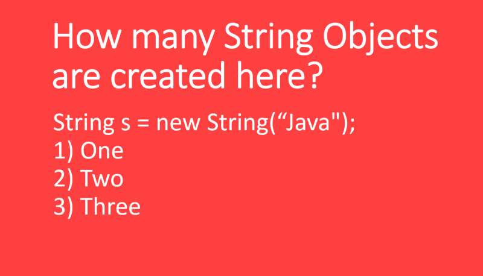
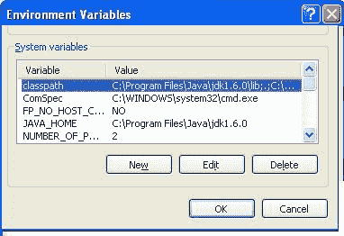
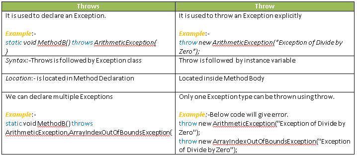
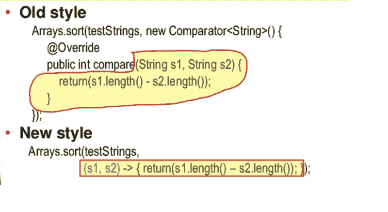

# 回顾这 50 个问题，以破解您的 Java 编程面试

> 原文：<https://www.freecodecamp.org/news/review-these-50-questions-to-crack-your-java-programming-interview-69d03d746b7f/>

作者:javinpaul

# 回顾这 50 个问题，以破解您的 Java 编程面试

#### 编程工作面试中常见的 Java 问题列表。

大家好！这几年一直在分享很多 [Java 面试问题](http://javarevisited.blogspot.sg/2015/10/133-java-interview-questions-answers-from-last-5-years.html)和个别讨论。我的许多读者要求我把他们聚集在一起，这样他们就可以在同一个地方阅读。这篇文章就是这样的结果。

本文包含超过 **50 个 Java 面试问题**，涵盖了所有重要主题，如核心 Java 基础、 [Java 集合框架](https://javarevisited.blogspot.com/2011/11/collection-interview-questions-answers.html)、 [Java 多线程和并发](https://javarevisited.blogspot.com/2014/07/top-50-java-multithreading-interview-questions-answers.html#axzz5ghebTpxm)、 [Java IO](https://javarevisited.blogspot.com/2014/08/socket-programming-networking-interview-questions-answers-Java.html) 、 [JDBC](https://javarevisited.blogspot.com/2012/12/top-10-jdbc-interview-questions-answers.html) 、 [JVM 内部问题](http://www.java67.com/2016/08/10-jvm-options-for-java-production-application.html)、[编码问题](http://www.java67.com/2018/06/data-structure-and-algorithm-interview-questions-programmers.html)、[面向对象编程](http://www.java67.com/2015/12/top-30-oops-concept-interview-questions-answers-java.html)等。

这些问题也是从各种面试中挑选出来的，它们一点也不困难。你可能已经在你的电话或面对面的面试中见过他们了。

这些问题对于回顾多线程和集合等重要主题也非常有用。我还分享了一些*有用的资源，用于进一步学习和提高*，如 [**完整的 Java 大师班**](https://click.linksynergy.com/fs-bin/click?id=JVFxdTr9V80&subid=0&offerid=323058.1&type=10&tmpid=14538&RD_PARM1=https%3A%2F%2Fwww.udemy.com%2Fjava-the-complete-java-developer-course%2F) 来复习和填补您的 Java 技能空白。

那么我们还在等什么呢？以下是初学者和有经验的 Java 开发人员在面试中最常被问到的一些问题。

### 50 多个面向 2 到 3 年经验丰富的程序员的 Java 面试问题

所以，为了不浪费你更多的时间，这里是我为初学者列出的一些常见的核心 Java 面试问题。这个列表主要针对初学者和缺乏经验的开发人员，比如有 2 到 3 年 Java 经验的人。

1)**Java 如何实现平台无关性？** ( [答](http://www.java67.com/2012/08/how-java-achieves-platform-independence.html) )
提示:字节码和 Java 虚拟机

2)**Java 里的`ClassLoader`是什么？** ( [答](http://javarevisited.blogspot.sg/2012/12/how-classloader-works-in-java.html#axzz59AWpr6cb) )
提示:JVM 的一部分，为类加载字节码。你可以自己写。

3) **写一个 Java 程序，检查一个数是偶数还是奇数？** ( [回答](http://javarevisited.blogspot.sg/2013/04/how-to-check-if-number-is-even-or-odd.html#axzz59AWpr6cb) )
提示:可以使用按位运算符，像按位 AND 一样，记住，二进制格式中偶数末尾有 0，奇数末尾有 1。

4)**Java 中`ArrayList`和`HashSet`的区别？** ( [回答](http://www.java67.com/2012/07/difference-between-arraylist-hashset-in-java.html) )
提示:`List`和`Set`的所有区别在这里都适用，比如排序、重复、随机搜索等。参见 Richard Warburton 的[**Java Fundamentals:Collections**](https://pluralsight.pxf.io/c/1193463/424552/7490?u=https%3A%2F%2Fwww.pluralsight.com%2Fcourses%2Fjava-fundamentals-collections)，了解更多关于 Java 中 ArrayList、HashSet 和其他重要集合的知识。

5) **什么是 Singleton 中的双重检查锁定？** ( [答](http://www.java67.com/2016/04/why-double-checked-locking-was-broken-before-java5.html) )
提示:分两次检查实例是否初始化，第一次不加锁，第二次加锁。

如何在 Java 中创建线程安全的 Singleton？([回答](http://javarevisited.blogspot.sg/2012/12/how-to-create-thread-safe-singleton-in-java-example.html) )
提示:很多方法，比如使用 Enum 或者通过使用双重检查锁定模式或者使用嵌套的静态类。

**7)在 Java 中什么时候使用 volatile 变量？([回答](http://www.java67.com/2012/08/what-is-volatile-variable-in-java-when.html) )**
提示:当你需要指示 JVM 一个变量可以被多线程修改，并给不缓存其值的 JVM 提示时。

**8)Java 中什么时候使用瞬态变量？([回答](http://www.java67.com/2012/08/what-is-transient-variable-in-java.html) )**
提示:当你想在一个类中使一个变量不可序列化时，这个类实现了可序列化的接口。换句话说，您可以将它用于您不想保存其值的变量。参见 [**完整的 Java MasterClass**](https://click.linksynergy.com/fs-bin/click?id=JVFxdTr9V80&subid=0&offerid=323058.1&type=10&tmpid=14538&RD_PARM1=https%3A%2F%2Fwww.udemy.com%2Fjava-the-complete-java-developer-course%2F) 了解 Java 中的瞬态变量。

**9)Java 中的 transient 和 volatile 变量的区别？([回答](http://www.java67.com/2012/11/difference-between-transient-vs-volatile-modifier-variable-java.html) )**
提示:完全不同，一个用在序列化的上下文中，一个用在并发中。

**10)Java 中可序列化和可外部化的区别？([回答](http://www.java67.com/2012/10/difference-between-serializable-vs-externalizable-interface.html) )**
提示:可外部化让你对序列化过程有更多的控制。

我们能覆盖 Java 中的私有方法吗？([回答](http://www.java67.com/2013/08/can-we-override-private-method-in-java-inner-class.html) )
提示:不，因为它在子类中不可见，这是 Java 中重写方法的一个主要要求。

**12)Java 中`Hashtable`和`HashMap`的区别？([回答](http://javarevisited.blogspot.sg/2010/10/difference-between-hashmap-and.html#axzz53B6SD769) )**
提示:几个但最重要的是`Hashtable`，是同步的，而`HashMap`不是。与`HashMap`相比，它也是遗留下来的，速度很慢。

**13)Java 中`List`和`Set` 的区别？([回答](http://javarevisited.blogspot.sg/2012/04/difference-between-list-and-set-in-java.html#axzz53n9YK0Mb) )**
提示:`List`是有序的，允许重复。`Set`无序，不允许重复元素。

**14)Java 中`ArrayList`和`Vector`的区别([答](http://www.java67.com/2012/09/arraylist-vs-vector-in-java-interview.html) )**
提示:很多，但最重要的是`ArrayList`是非同步的，速度快而`Vector`是同步的，速度慢。也是像`Hashtable`这样的遗留阶级。

**15)Java 中`Hashtable`和`ConcurrentHashMap`的区别？([回答](http://javarevisited.blogspot.sg/2011/04/difference-between-concurrenthashmap.html#axzz4qw7RoNvw) )**
提示:扩展性更强。参见 Richard Warburton 的 [**Java 基础:集合**](https://pluralsight.pxf.io/c/1193463/424552/7490?u=https%3A%2F%2Fwww.pluralsight.com%2Fcourses%2Fjava-fundamentals-collections) 了解更多信息。

**16)`ConcurrentHashMap`如何实现可扩展性？([回答](http://javarevisited.blogspot.sg/2017/08/top-10-java-concurrenthashmap-interview.html#axzz50U9xyqbo) )**
提示:通过将 map 分成段，只在写操作时加锁。

**17)在`HashMap`中将`Object`用作`Key`时，您将覆盖哪两种方法？([回答](http://www.java67.com/2013/06/how-get-method-of-hashmap-or-hashtable-works-internally.html) )**
提示:equals 和 hashcode

**18)Java 中等待和睡眠的区别？([回答](http://www.java67.com/2012/08/what-are-difference-between-wait-and.html) )**
提示:`wait()`方法释放锁或监视器，而睡眠不释放。

**19)Java 中`notify`和`notifyAll`的区别？([回答](http://www.java67.com/2013/03/difference-between-wait-vs-notify-vs-notifyAll-java-thread.html) )**
提示:`notify`通知一个随机线程正在等待那个锁，而`notifyAll`通知所有线程正在等待一个监视器。如果你确定只有一个线程在等待，那么使用`notify`，否则`notifyAll`会更好。参见 Java 冠军 Heinz Kabutz 的 [**线程基础迷你课程**](https://javaspecialists.teachable.com/p/threading-essentials/?product_id=539197&coupon_code=SLACK100?affcode=92815_johrd7r8) ，了解更多关于线程基础的知识。

为什么你在 Java 中重写 hashcode 和`equals()`？([答](http://javarevisited.blogspot.sg/2015/01/why-override-equals-hashcode-or-tostring-java.html#axzz55oDxm8vv) )
提示:为了符合 equals 和 hashcode 契约，如果你打算将你的对象存储到集合类中，例如`HashMap`或`ArrayList`，这是必须的。

**21)`HashMap`的负载系数是什么意思？([回答](http://www.java67.com/2017/08/top-10-java-hashmap-interview-questions.html) )**
提示:触发`HashMap`重新调整大小的阈值一般是 0.75，这意味着`HashMap`在 75%满的情况下会自行调整大小。

**22)Java 中`ArrayList`和`LinkedList`的区别？([回答](http://www.java67.com/2012/12/difference-between-arraylist-vs-LinkedList-java.html) )**
提示:和数组链表一样，一个允许随机搜索，一个不允许。在链表上插入和删除很容易，但是在数组上搜索很容易。参见 [**Java 基础:集合**](https://pluralsight.pxf.io/c/1193463/424552/7490?u=https%3A%2F%2Fwww.pluralsight.com%2Fcourses%2Fjava-fundamentals-collections) **，** Richard Warburton 关于 Pluralsight 的课程，了解更多关于 Java 中基本集合数据结构的知识。

**23)Java 中`CountDownLatch`和`CyclicBarrier`的区别？([回答](http://www.java67.com/2012/08/difference-between-countdownlatch-and-cyclicbarrier-java.html) )**
提示:闯关后可以重用`CyclicBarrier`，但是计数到零后不能重用`CountDownLatch`。

**24)Java 里什么时候用`Runnable` vs `Thread`？([回答](http://www.java67.com/2016/01/7-differences-between-extends-thread-vs-implements-Runnable-java.html) )**
提示:永远

**25)枚举在 Java 中是类型安全的是什么意思？([回答](http://www.java67.com/2014/04/what-java-developer-should-know-about-Enumeration-type-in-Java.html) )**
提示:意思是不能将不同枚举类型的实例赋给一个枚举变量。例如，如果您有一个像`DayOfWeek` day 这样的变量，那么您不能从`DayOfMonth` enum 中为它赋值。

**26)Java 中整数的自动装箱是如何工作的？([回答](http://javarevisited.blogspot.sg/2012/07/auto-boxing-and-unboxing-in-java-be.html#axzz59AWpr6cb) )**
提示:通过使用 Java 中的`valueOf()`方法。

**27)Java 中`PATH`和`Classpath`的区别？([回答](http://www.java67.com/2012/08/what-is-path-and-classpath-in-java-difference.html) )**
提示:`PATH`由操作系统使用，`Classpath`由 JVM 用来定位 Java 二进制文件，如 JAR 文件或类文件。参见 **[Java 基础:核心平台](https://pluralsight.pxf.io/c/1193463/424552/7490?u=https%3A%2F%2Fwww.pluralsight.com%2Fcourses%2Fjava-fundamentals-core-platform)** 了解更多关于`PATH`、`Classpath`和其他 Java 环境变量的信息。

**28)Java 中方法重载和覆盖的区别？([回答](http://www.java67.com/2015/08/top-10-method-overloading-overriding-interview-questions-answers-java.html) )**
提示:重载发生在子类，重载发生在同一个类。此外，重写是一个运行时活动，而重载是在编译时解决的。

在 Java 中，你如何防止一个类被子类化？([回答](http://www.java67.com/2017/06/10-points-about-final-modifier-in-java.html) )
提示:只需将其构造函数设为私有即可

你如何限制你的类被你的客户使用？([回答](http://javarevisited.blogspot.sg/2016/01/why-jpa-entity-or-hibernate-persistence-should-not-be-final-in-java.html) )
提示:将构造函数设为私有或者从构造函数抛出异常

**31)Java 中`StringBuilder`和`StringBuffer`的区别？([回答](http://www.java67.com/2016/10/5-difference-between-stringbuffer.html) )**
提示:`StringBuilder`不同步而`StringBuffer`同步。

**32)Java 中多态和继承的区别？([回答](http://www.java67.com/2014/04/difference-between-polymorphism-and-Inheritance-java-oops.html) )**
提示:继承允许代码重用，建立类之间的关系，这是多态所要求的，多态提供了动态行为。参见 [**Java 基础:面向对象设计**](https://pluralsight.pxf.io/c/1193463/424552/7490?u=https%3A%2F%2Fwww.pluralsight.com%2Fcourses%2Fjava-fundamentals-object-oriented-design) 了解更多关于 OOP 的特性。

我们能在 Java 中覆盖静态方法吗？([回答](http://www.java67.com/2012/08/can-we-override-static-method-in-java.html) )
提示:不会，因为重写是在运行时解析的，而静态方法调用是在编译时解析的。

我们能访问 Java 中的私有方法吗？([回答](http://www.java67.com/2012/08/can-we-override-private-method-in-java.html) )
提示:可以，在同班但不在课外

**35)Java 中接口和抽象类的区别？([回答](http://www.java67.com/2017/08/difference-between-abstract-class-and-interface-in-java8.html) )**
提示:来自 [Java 8](https://dzone.com/articles/5-courses-to-crack-java-certification-ocajp-1z0-80) ，区别模糊。然而，一个 Java 类仍然可以实现多个接口，但只能扩展一个类。

**36)Java 中 DOM 和 SAX 解析器的区别？([回答](http://www.java67.com/2012/09/dom-vs-sax-parser-in-java-xml-parsing.html) )**
提示:DOM 会在内存中加载整个 XML 文件，而 SAX 不会。它是一个基于事件的解析器，可以用来解析一个大文件，但是 DOM 速度很快，应该优先用于小文件。

Java 中 throw 和 throws 关键字的区别？([回答](http://www.java67.com/2012/10/difference-between-throw-vs-throws-in.html) )
提示:throws 声明一个方法在出错的情况下可以抛出什么异常但是 throw 关键字实际上抛出了一个异常。参见 [**Java 基础:异常处理**](https://pluralsight.pxf.io/c/1193463/424552/7490?u=https%3A%2F%2Fwww.pluralsight.com%2Fcourses%2Fjava-fundamentals-exception-handling) 了解更多 Java 中的异常处理。

**38)Java 中故障安全和故障快速迭代器的区别？([回答](http://www.java67.com/2015/06/what-is-fail-safe-and-fail-fast-iterator-in-java.html) )**
提示:失效保护不会抛出`ConcurrentModificationException`，而`fail-fast`会在迭代底层集合时检测到外部变化时抛出。

**39)Java 中迭代器和枚举的区别？([回答](http://javarevisited.blogspot.sg/2010/10/what-is-difference-between-enumeration.html#axzz59AWpr6cb) )**
提示:迭代器还能让你在迭代时移除一个元素，而枚举不允许这样做。

**40)Java 里的`IdentityHashMap`是什么？([回答](http://www.java67.com/2016/09/difference-between-identityhashmap-weakhashmap-enummap-in-java.html) )**
提示:A `Map`，它使用`==`等式运算符来检查等式，而不是`equals()`方法。

**41)爪哇的`String`池是什么？([回答](http://javarevisited.blogspot.sg/2016/07/difference-in-string-pool-between-java6-java7.html#axzz4pGGwsyna) )**
提示:一池`String`字面值。记得它是从 JDK 7 的 perm gen 空间移到 heap 的。

**42)Java 中的`Serializable`类可以包含不可序列化的字段吗？([回答](http://javarevisited.blogspot.sg/2016/09/how-to-serialize-object-in-java-serialization-example.html) )**
提示:可以，但是你需要让它要么静态，要么瞬态。

**43)这和 Java 里的 super 有什么区别？([回答](http://www.java67.com/2013/06/difference-between-this-and-super-keyword-java.html) )**
提示:这里指的是当前实例，而 super 指的是超类的一个实例。

**44)Java 中`Comparator`和`Comparable`的区别？([回答](http://www.java67.com/2013/08/difference-between-comparator-and-comparable-in-java-interface-sorting.html) )**
提示:`Comparator`定义自定义排序，`Comparable`定义对象的自然顺序，如`String`的字母顺序。参见 **[完整的 Java MasterClass](https://click.linksynergy.com/fs-bin/click?id=JVFxdTr9V80&subid=0&offerid=323058.1&type=10&tmpid=14538&RD_PARM1=https%3A%2F%2Fwww.udemy.com%2Fjava-the-complete-java-developer-course%2F)** 了解更多关于 Java 排序的知识。

**45)Java 中`java.util.Date`和`java.sql.Date`的区别？([回答](http://javarevisited.blogspot.sg/2012/04/difference-between-javautildate-and.html) )**
提示:前者包含日期和时间，后者只包含日期部分。

**46)为什么 wait 和 notify 方法是在 Java 的`Object`类中声明的？([回答](http://javarevisited.blogspot.sg/2012/02/why-wait-notify-and-notifyall-is.html) )**
提示:因为他们要求锁定，而锁定只对一个对象有效。

**47)为什么 Java 不支持多重继承？([回答](http://javarevisited.blogspot.sg/2011/07/why-multiple-inheritances-are-not.html) )**
提示:用 C++不支持是因为体验不好，但用 Java 8，某种意义上是支持的——只是现在 Java 不支持`Type`的多重继承。

**48)Java 中检查异常和未检查异常的区别？([回答](http://javarevisited.blogspot.sg/2011/12/checked-vs-unchecked-exception-in-java.html) )**
提示:如果选中，则必须使用 catch 块处理异常，如果未选中，则由您决定；编译不会打扰你。

**49)Java 中错误和异常的区别？([回答](http://www.java67.com/2012/12/difference-between-error-vs-exception.html) )**
提示:打字累了请查收答案

**50)Java 中竞争条件和死锁的区别？([回答](http://javarevisited.blogspot.sg/2012/02/what-is-race-condition-in.html#axzz59AbkWuk9) )**
提示:两者都是并发应用中发生的错误，一个是因为线程调度而发生，另一个是因为糟糕的编码而发生。参见[Java 中的多线程和并行计算](https://click.linksynergy.com/fs-bin/click?id=JVFxdTr9V80&subid=0&offerid=323058.1&type=10&tmpid=14538&RD_PARM1=https%3A%2F%2Fwww.udemy.com%2Fmultithreading-and-parallel-computing-in-java%2F)了解更多关于死锁、竞争条件和其他多线程问题的信息。

### 结束语

谢谢，你坚持到了文章的结尾…祝你编程面试好运！这当然不容易，但是通过遵循这个路线图和指南，你离成为一名 [DevOps 工程师](https://hackernoon.com/10-free-courses-to-learn-docker-for-programmers-and-devops-engineers-7ff2781fd6e0)更近了一步。

如果你喜欢这篇文章，那么请分享给你的朋友和同事，别忘了在 Twitter 上关注 [javinpaul](https://twitter.com/javinpaul) ！

#### 额外资源

*   [Java 面试指南:200+面试问答](https://click.linksynergy.com/fs-bin/click?id=JVFxdTr9V80&subid=0&offerid=323058.1&type=10&tmpid=14538&RD_PARM1=https%3A%2F%2Fwww.udemy.com%2Fjava-interview-questions-and-answers%2F)
*   [春季框架面试指南— 200+问题&回答](https://click.linksynergy.com/fs-bin/click?id=JVFxdTr9V80&subid=0&offerid=323058.1&type=10&tmpid=14538&RD_PARM1=https%3A%2F%2Fwww.udemy.com%2Fspring-interview-questions-and-answers%2F)
*   约翰·桑梅兹准备工作面试
*   [马卡姆曝光的 Java 编程访谈](http://www.amazon.com/Java-Programming-Interviews-Exposed-Markham/dp/1118722868?tag=javamysqlanta-20)
*   [破解编码面试— 189 个问答](http://www.amazon.com/Cracking-Coding-Interview-6th-Edition/dp/0984782850/?tag=javamysqlanta-20)
*   [工作面试的数据结构和算法分析](https://click.linksynergy.com/fs-bin/click?id=JVFxdTr9V80&subid=0&offerid=323058.1&type=10&tmpid=14538&RD_PARM1=https%3A%2F%2Fwww.udemy.com%2Fdata-structure-and-algorithms-analysis%2F)
*   [近 5 年 130+ Java 面试题](http://javarevisited.blogspot.sg/2015/10/133-java-interview-questions-answers-from-last-5-years.html)

> **P.S. —** 如果你需要一些免费的资源来学习 Java，可以看看这份 [**免费 Java 课程**](http://www.java67.com/2018/08/top-10-free-java-courses-for-beginners-experienced-developers.html) 的列表，开始准备吧。
> 
> **P. S. S. —** 对于图片分享的面试问题“代码中创建了多少个 String 对象？”你能猜出并解释一下吗？