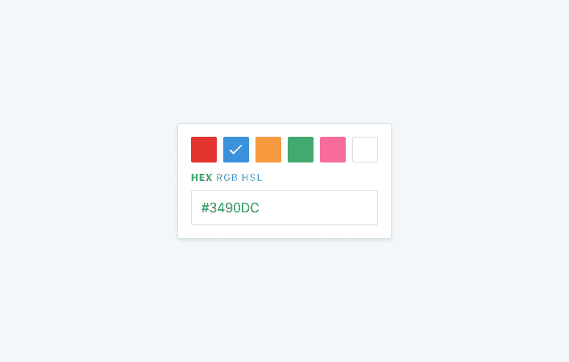
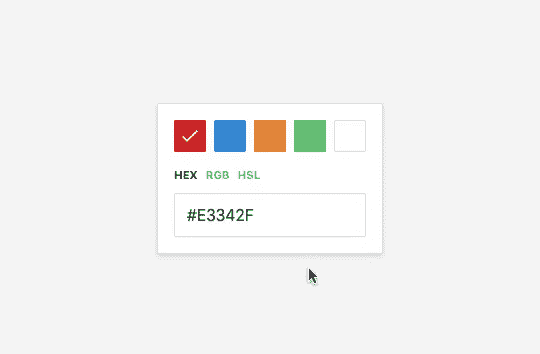

# Vue.js 测试驱动开发简介

> 原文：<https://www.freecodecamp.org/news/an-introduction-to-tdd-with-vue-js-66544710b50c/>

莎拉·达扬

# Vue.js 测试驱动开发简介


Photo by [Louis Reed](https://unsplash.com/@_louisreed?utm_source=medium&utm_medium=referral) on [Unsplash](https://unsplash.com?utm_source=medium&utm_medium=referral)

测试驱动开发(TDD)是一个过程，在这个过程中**你在编写相关代码**之前编写测试。您首先编写一个描述预期行为的测试，然后运行它，确保它失败。然后，您编写最愚蠢、最简单的代码来通过测试。最后，您重构代码以使其正确。你重复每个测试的所有步骤，直到你完成。

这种方法有很多优点。首先，**它迫使你在编码之前思考**。在确定代码应该做什么之前匆忙编写代码是很常见的。这种做法导致浪费时间和编写复杂的代码。使用 TDD，任何一段新代码都需要先进行测试，所以在编写代码之前，您别无选择，只能花时间定义这段代码应该做什么。

其次，**它确保你编写单元测试**。从代码开始通常会导致编写不完整的测试，甚至根本没有测试。这种实践通常是由于没有精确和详尽的规范而发生的，这导致花费了比你应该花费的更多的时间来编码。编写测试变成了一项昂贵的工作，一旦产品代码准备好了，就很容易被破坏。

单元测试对于构建健壮的代码至关重要。忽略或催促它们会增加您的代码在生产中某个时候出错的机会。

### 为什么要对组件进行 TDD？

**测试一个组件可能会违背直觉**。正如我们在[单元测试你的第一个 Vue.js 组件](https://frontstuff.io/unit-test-your-first-vuejs-component)中所看到的，这需要一个思维转变，让你的头脑围绕测试组件和测试普通脚本，知道测试什么，并理解单元测试和端到端之间的界限。

TDD 让这一切变得更容易。不是通过检查已完成项目的所有细节来编写测试，并试图猜测应该覆盖哪些内容，而是相反。你从实际的规格开始，一个组件应该*做*的事情的列表，而不关心它是如何做的。通过这种方式，您可以确保您测试的只是公共 API，但是也可以保证您不会忘记任何东西。

在本教程中，我们将构建一个颜色选择器。对于每个样本，用户可以访问匹配的颜色代码，无论是十六进制，RGB 或 HSL。



Design inspired from [Custom Color Picker Exploration](https://dribbble.com/shots/2908891-Custom-Color-Picker-Exploration) by [Chris Castillo](https://dribbble.com/_ChrisCastillo)

尽管看起来很简单，但还是有一些小的逻辑需要测试。在开始编写代码之前，他们需要一些思考。

在本文中，我们将深入探讨 TDD。在我们写一行代码之前，我们将把一些规格放在一起。然后，我们将[以测试驱动的方式测试每个公共特性](https://frontstuff.io/an-introduction-to-tdd-with-vuejs#write-test-driven-code)。最后，我们将反思我们所做的事情，并[看看我们能从中学到什么](https://frontstuff.io/an-introduction-to-tdd-with-vuejs#afterthoughts)。

### 开始之前

本教程假设你之前已经用 Vue.js 构建了一些东西，并使用 [Vue 测试工具](https://vue-test-utils.vuejs.org/)和 [Jest](https://jestjs.io/) (或类似的测试运行器)为它编写了单元测试。它不会深入到基本面，所以确保你先跟上速度。如果你还没有，我推荐你去[构建你的第一个 Vue.js 组件](https://frontstuff.io/build-your-first-vue-js-component)和[单元测试你的第一个 Vue.js 组件](https://frontstuff.io/unit-test-your-first-vuejs-component)。

***TL；博士:*** *这篇文章深入探讨了如何和为什么。它旨在帮助您理解使用 TDD 测试真实世界 Vue.js 组件背后的每个决策，并教您如何为您未来的项目做出设计决策。如果你想理解整个思维过程，请继续阅读。否则可以直接到最后的[after thinks](https://frontstuff.io/an-introduction-to-tdd-with-vuejs#afterthoughts)，或者在 [GitHub](https://github.com/sarahdayan/colorpicker-tdd-tutorial) 上看最终代码。*

### 写下你的规格

在你写第一个测试之前，**你应该写下组件应该做什么的概述**。有了规范，测试就简单多了，因为你主要是以测试的形式重写每个规范。

让我们考虑一下组成组件的不同部分，以及它们应该做什么。

首先，我们有一个**色板**的集合。我们希望能够传递自定义颜色的列表，并在组件中显示为样本。默认情况下应该选择第一个，最终用户可以通过单击它来选择一个新的。

其次，我们有**颜色模式转换器**。最终用户应该能够在三种模式之间切换:十六进制(默认)、RGB 和 HSL。

最后，我们有**颜色代码输出**，终端用户可以从中获得当前所选颜色样本的代码。此代码是所选样本和颜色模式的组合。因此，默认情况下，它应该将第一个样本显示为十六进制值。当更改其中任何一项时，代码都应该相应地更新。

如你所见，我们不深入细节；我们没有指定颜色模式标签应该是什么，或者颜色样本的活动状态是什么样子。即使在进行 TDD 的时候，我们也可以即时做出大部分的小决定。然而，我们已经从组件应该是什么的简单定义**发展到从**开始的一套全面的规范。

### 编写测试驱动的代码

首先，您需要用 [Vue CLI](https://cli.vuejs.org/) 创建一个新的 Vue 项目。如果你需要一步一步的指导，你可以查看[构建你的第一个 Vue.js 组件](https://frontstuff.io/build-your-first-vue-js-component)。

在搭建过程中，手动选择特性，并确保检查**单元测试**。选择 Jest 作为您的测试解决方案，直到创建了项目，安装了依赖项，您就可以开始了。

我们需要使用 SVG 文件作为组件，所以您还需要为它们安装正确的加载程序。安装 [vue-svg-loader](https://www.npmjs.com/package/vue-svg-loader) 作为一个开发依赖项，并在你的`vue.config.js`文件中为它添加一个规则。

```
// vue.config.js

module.exports = {
  chainWebpack: config => {
    const svgRule = config.module.rule('svg')
    svgRule.uses.clear()
    svgRule.use('vue-svg-loader').loader('vue-svg-loader')
  }
}
```

默认情况下，这个加载器不能很好地处理 Jest，这会导致测试抛出。要修复它，创建一个`svgTransform.js`文件[，如网站](https://vue-svg-loader.js.org/faq.html#how-to-use-this-loader-with-jest)上所记录的，并如下编辑您的`jest.config.js`:

```
// svgTransform.js

const vueJest = require('vue-jest/lib/template-compiler')

module.exports = {
  process(content) {
    const { render } = vueJest({
      content,
      attrs: {
        functional: false
      }
    })

    return `module.exports = { render: ${render} }`
  }
}

// jest.config.js

module.exports = {
  // ...
  transform: {
    // ...
    '.+\\.(css|styl|less|sass|scss|png|jpg|ttf|woff|woff2)$': 'jest-transform-stub',
    '^.+\\.svg$': '<rootDir>/svgTransform.js'
  },
  // ...
}
```

注意，我们已经从第一个正则表达式(用`jest-transform-stub`转换的那个)中删除了“svg”。这样，我们确保 SVG 被`svgTransform.js`选中。

此外，您需要安装[颜色转换](https://www.npmjs.com/package/color-convert)作为依赖项。在我们的代码和以后的测试中，我们都需要它。

**还不上项目**。我们将编写测试，并依赖于它们是否通过测试。我们不想通过在浏览器中进行可视化测试来控制我们构建的东西是否有效，也不想被它的外观分散注意力。

相反，打开您的项目并在`src/components/`目录中创建一个新的`ColorPicker.vue`单文件组件。在`tests/unit/`中，创建其相关的规格文件。

```
<!-- ColorPicker.vue -->

<template>
  <div></div>
</template>

<script>
export default {}
</script>

<style>
</style>

// ColorPicker.spec.js

import { shallowMount } from '@vue/test-utils'
import ColorPicker from '@/components/ColorPicker'

describe('ColorPicker', () => {
  // let's do this!
})
```

在您的终端中，执行以下命令来运行测试:

```
npm run test:unit --watchAll
```

现在，您应该会得到一个错误，因为您还没有测试。不过不要担心；我们会尽快解决这个问题？请注意命令中- `-watchAll` 标志的用法:Jest 现在正在监视您的文件。这样，您就不必手动重新运行测试。

TDD 分为 3 个阶段:

1.  红色:你编写一个描述预期行为的测试，然后运行它，确保它失败。
2.  绿色的:你写了最愚蠢、最简单的代码来通过测试。
3.  **重构**:你重构代码使其正确。

### 红色

是时候编写我们的第一个测试了！我们从颜色样本开始。为了清楚起见，我们将使用`describe`块将每个不同元素的所有测试包装在它们自己的套件中。

首先，我们要确保组件显示我们作为单个样本提供的每种颜色。我们会以十六进制字符串数组的形式将它们作为道具传递。在组件中，我们将列表显示为一个无序列表，并通过一个`style`属性分配背景颜色。

```
import { shallowMount } from '@vue/test-utils'
import ColorPicker from '@/components/ColorPicker'
import convert from 'color-convert'

let wrapper = null

const propsData = {
  swatches: ['e3342f', '3490dc', 'f6993f', '38c172', 'fff']
}

beforeEach(() => (wrapper = shallowMount(ColorPicker, { propsData })))
afterEach(() => wrapper.destroy())

describe('ColorPicker', () => {
  describe('Swatches', () => {
    test('displays each color as an individual swatch', () => {
      const swatches = wrapper.findAll('.swatch')
      propsData.swatches.forEach((swatch, index) => {
        expect(swatches.at(index).attributes().style).toBe(
          `background: rgb(${convert.hex.rgb(swatch).join(', ')})`
        )
      })
    })
  })
})
```

我们安装了我们的`ColorPicker`组件，并编写了一个测试，期望找到背景颜色与作为道具传递的颜色相匹配的项目。**这次测试肯定会失败**:我们目前在`ColorPicker.vue`什么都没有。如果您查看您的终端，您应该看到一个错误，说明在 0 处不存在任何项目。这太棒了！**我们刚刚成功地通过了 TDD 的第一步。**

### 绿色

我们的测试失败了；我们在正确的轨道上。现在，是时候让它过去了。在这一点上，我们对编写工作代码或智能代码不太感兴趣，我们想要的只是让 Jest 开心。现在，Vue Test Utils 抱怨我们在索引 0 处没有条目。

```
[vue-test-utils]: no item exists at 0
```

要消除这个错误，我们可以做的最简单的事情就是在列表项上添加一个带有`swatch`类的无序列表。

```
<template>
  <div class="color-picker">
    <ul class="swatches">
      <li class="swatch"></li>
    </ul>
  </div>
</template>
```

Jest 仍然抱怨，但错误已经改变:

```
Expected value to equal:
  "background: rgb(227, 52, 47);"
Received:
  undefined
```

这有道理；列表项没有`style`属性。对此我们能做的最简单的事情就是硬编码`style`属性。这不是我们最终想要的，但是，我们还不关心它。我们想要的是**让我们的测试变绿**。

因此，我们可以用预期的样式属性硬编码五个列表项:

```
<ul class="swatches">
  <li class="swatch" style="background: rgb(227, 52, 47);"></li>
  <li class="swatch" style="background: rgb(52, 144, 220);"></li>
  <li class="swatch" style="background: rgb(246, 153, 63);"></li>
  <li class="swatch" style="background: rgb(56, 193, 114);"></li>
  <li class="swatch" style="background: rgb(255, 255, 255);"></li>
</ul>
```

测试现在应该通过了。

### 步骤 3:重构

在这个阶段，我们希望在不破坏测试的情况下，重新安排代码以使其正确。在我们的例子中，我们不想硬编码列表项和它们的`style`属性。相反，最好是接收样本作为道具，迭代它们以生成列表项，并将颜色指定为它们的背景。

```
<template>
  <div class="color-picker">
    <ul class="swatches">
      <li
        :key="index"
        v-for="(swatch, index) in swatches"
        :style="{ background: `#${swatch}` }"
        class="swatch"
      ></li>
    </ul>
  </div>
</template>

<script>
export default {
  props: {
    swatches: {
      type: Array,
      default() {
        return []
      }
    }
  }
}
</script>
```

当测试重新运行时，它们仍然应该通过。这意味着我们在不影响输出的情况下成功地重构了代码。祝贺你，你刚刚完成了你的第一个 TDD 周期！

现在，在我们进行下一个测试之前，让我们反思一下。你可能想知道:

> “这是不是有点傻？我知道测试会失败。我运行它，然后硬编码正确的值，看测试通过，然后使代码正确，难道不是浪费时间吗？我不能直接到重构步骤吗？”

你对这个过程感到困惑是可以理解的。然而，试着从不同的角度看问题:这里的重点不是*证明*测试没有通过。我们知道不会的。我们希望看到的是我们的测试*所期望的*，用尽可能简单的方式让他们开心，最终在不破坏任何东西的情况下写出更聪明的代码。

这就是测试驱动开发的全部思想:我们不写代码让事情工作，**我们写代码让测试通过**。通过逆转这种关系，我们确保了以结果为焦点的强大测试。

### 我们在测试什么？

可能想到的另一个问题是**我们如何决定测试什么**。在[单元测试你的第一个 Vue.js 组件](https://frontstuff.io/unit-test-your-first-vuejs-component)中，我们看到我们应该只测试我们组件的公共 API，而不是内部实现。严格来说，这意味着我们应该涵盖**用户交互**和**道具变化**。

但仅此而已吗？比如输出的 HTML 断了可以吗？还是为了 CSS 类名改？我们确定没人依赖他们吗？你不是你自己？

测试应该给你信心，你没有运送坏的软件。人们可以用你的程序做的事情不应该以他们期望的方式停止工作。根据项目和用例的不同，它可能有不同的含义。

例如，如果将此颜色面板构建为开源组件，则用户是在自己的项目中使用它的其他开发人员。他们可能依赖于你提供的类名来按照他们的喜好为组件设置样式。**类名成为公共 API 的一部分，因为用户依赖它们。**

在我们的例子中，我们不一定要做一个开源组件，但是我们有依赖于特定类名的视图逻辑。例如，活动样本有一个`active`类名是很重要的，因为我们将依靠它在 CSS 中显示一个勾号。如果有人不小心改变了这个，我们想知道。

UI 组件的测试场景在很大程度上取决于用例及期望。无论是哪种情况，你需要问自己的是**如果它改变了**，我会在意吗？

### 接下来的测试

#### 测试样本

让我们进入下一个测试。我们希望列表的第一个样本是默认选中的样本。从外部来看，**这是我们希望确保以同样的方式继续工作的事情**。例如，用户可以依靠活动类名来设计组件的样式。

```
test('sets the first swatch as the selected one by default', () => {
  const firstSwatch = wrapper.find('.swatch')
  expect(firstSwatch.classes()).toContain('active')
})
```

这个测试也应该失败，因为列表项目前没有任何类。我们可以通过在第一个列表项上添加类来轻松完成这一步。

```
<li
  :key="index"
  v-for="(swatch, index) in swatches"
  :style="{ background: `#${swatch}` }"
  class="swatch"
  :class="{ 'active': index === 0 }"
></li>
```

测试现在通过了；然而，我们已经将逻辑硬编码到模板中。我们可以通过外部化类所应用的索引来重构它。这样，我们可以在以后更改它。

```
<template>
  <!-- ... -->
  <li
    :key="index"
    v-for="(swatch, index) in swatches"
    :style="{ background: `#${swatch}` }"
    class="swatch"
    :class="{ active: index === activeSwatch }"
  ></li>
  <!-- ... -->
</template>

export default {
  // ...
  data() {
    return {
      activeSwatch: 0
    }
  }
}
```

这自然导致了我们的第三个测试。我们希望在最终用户单击时更改活动样本。

```
test('makes the swatch active when clicked', () => {
  const targetSwatch = wrapper.findAll('.swatch').at(2)
  targetSwatch.trigger('click')
  expect(targetSwatch.classes()).toContain('active')
})
```

现在，当我们单击一个样本时，什么都不会发生。然而，由于我们之前的重构，我们可以让这个测试变绿，甚至跳过重构步骤。

```
<li
  :key="index"
  v-for="(swatch, index) in swatches"
  :style="{ background: `#${swatch}` }"
  class="swatch"
  :class="{ active: index === activeSwatch }"
  @click="activeSwatch = index"
></li>
```

这段代码通过了测试，甚至不需要重构。这是进行 TDD 的一个幸运的副作用:有时，这个过程会导致要么编写不需要重构的新测试，要么直接通过。

活动样本应显示复选标记。我们现在将添加它**而不编写测试**:相反，我们稍后将通过 CSS 控制它们的可见性。这没问题，因为我们已经测试了`active`类是如何应用的。

首先，在`src/assets/`中创建一个`checkmark.svg`文件。

```
<svg viewBox="0 0 448.8 448.8">
  <polygon points="142.8 323.9 35.7 216.8 0 252.5 142.8 395.3 448.8 89.3 413.1 53.6"/>
</svg>
```

然后，在组件中导入它。

```
import CheckIcon from '@/assets/check.svg'

export default {
  // ...
  components: { CheckIcon }
}
```

最后，将它添加到列表项中。

```
<li ... >
  <check-icon />
</li>
```

很好！我们现在可以继续我们组件的下一个元素:**颜色模式**。

#### 测试颜色模式

现在让我们实现颜色模式 toggler。最终用户应该能够在十六进制、RGB 和 HSL 之间切换。我们在内部定义这些模式，但我们希望确保它们正确呈现。

代替测试按钮标签，**我们将依赖类名**。这使得我们的测试更加健壮，因为我们可以轻松地将类名定义为组件契约的一部分。然而，按钮标签应该能够改变。

现在，您可能想检查这三种特定的模式，但是这将使测试变得脆弱。如果我们改变他们呢？如果我们添加一个，或者删除一个呢？这仍然是相同的逻辑，但是测试会失败，迫使我们去编辑它。

一种解决方案是访问组件的数据，动态迭代模式。Vue Test Utils 让我们通过 [vm](https://vue-test-utils.vuejs.org/api/wrapper/#properties) 属性来完成这项工作，但是这又一次将我们的测试与模式的内部实现紧密耦合在一起。如果明天，我们决定改变我们定义模式的方式，测试将会失败。

另一个解决方案是继续黑盒测试，只期望类名匹配给定的*模式*。我们不在乎它是`color-mode-hex`、`color-mode-hsl`还是`color-mode-xyz`，只要它看起来像我们从外面期待的那样。Jest 让我们用正则表达式匹配器来做这件事。

```
// ...
describe('Color model', () => {
  test('displays each mode as an individual button', () => {
    const buttons = wrapper.findAll('.color-mode')
    buttons.wrappers.forEach(button => {
      expect(button.classes()).toEqual(
        expect.arrayContaining([expect.stringMatching(/color-mode-\w{1,}/)])
      )
    })
  })
})
```

这里，我们期望元素的类遵循模式“color-mode-”+any word character(在 ECMAScript 中，是`[a-zA-Z_0-9]`中的任何字符)。我们可以添加或删除任何我们想要的模式，测试仍然有效。

很自然，现在测试应该会失败，因为还没有类为`color-mode`的按钮。我们可以通过在组件中硬编码它们来使它通过。

```
<div class="color-modes">
  <button class="color-mode color-mode-hex"></button>
  <button class="color-mode color-mode-rgb"></button>
  <button class="color-mode color-mode-hsl"></button>
</div>
```

我们现在可以通过将模式作为私有数据添加到组件中来重构这段代码，并对它们进行迭代。

```
<template>
  <!-- ... -->
  <div class="color-modes">
    <button
      :key="index"
      v-for="(mode, index) in colorModes"
      class="color-mode"
      :class="`color-mode-${mode}`"
    >{{ mode }}</button>
  </div>
  <!-- ... -->
</template>

export default {
  // ...
  data() {
    return {
      activeSwatch: 0,
      colorModes: ['hex', 'rgb', 'hsl']
    }
  }
}
```

很好！我们继续吧。

与样本一样，我们希望将第一个模式设置为活动模式。我们可以复制我们编写的测试，并使其适应这个新的用例。

```
test('sets the first mode as the selected one by default', () => {
  const firstButton = wrapper.find('.color-mode')
  expect(firstButton.classes()).toContain('active')
})
```

我们可以通过在第一个列表项中手动添加类来通过这个测试。

```
<button
  :key="index"
  v-for="(mode, index) in colorModes"
  class="color-mode"
  :class="[{ active: index === 0 }, `color-mode-${mode}`]"
>{{ mode }}</button>
```

最后，我们可以通过外部化应用该类的索引来进行重构。

```
<template>
  <!-- ... -->
  <button
    :key="index"
    v-for="(mode, index) in colorModes"
    class="color-mode"
    :class="[{ active: index === activeMode }, `color-mode-${mode}`]"
  >{{ mode }}</button>
  <!-- ... -->
</template>

export default {
  // ...
  data() {
    return {
      activeSwatch: 0,
      activeMode: 0,
      colorModes: ['hex', 'rgb', 'hsl']
    }
  }
}
```

每当最终用户单击相关按钮时，我们都需要更改活动模式，就像样例一样。

```
test('sets the color mode button as active when clicked', () => {
  const targetButton = wrapper.findAll('.color-mode').at(2)
  targetButton.trigger('click')
  expect(targetButton.classes()).toContain('active')
})
```

我们现在可以添加一个`@click`指令，就像我们对样本所做的那样，让测试变得绿色，而不必重构。

```
<button
  :key="index"
  v-for="(mode, index) in colorModes"
  class="color-mode"
  :class="[{ active: index === activeMode }, `color-mode-${mode}`]"
  @click="activeMode = index"
>{{ mode }}</button>
```

#### 测试颜色代码

现在我们已经完成了样本和颜色代码的测试，我们可以继续我们颜色选择器的第三个也是最后一个元素:**颜色代码**。我们在那里显示的是另外两个的组合:选定的样本定义了我们应该显示的颜色，而选定的模式决定了如何显示它。

首先，我们要确保最初在默认模式下显示默认样本。因为我们已经实现了色板和颜色模式，所以我们有了构建它的信息。

让我们从一个(失败的)测试开始。

```
describe('Color code', () => {
  test('displays the default swatch in the default mode', () => {
    expect(wrapper.find('.color-code').text()).toEqual('#e3342f')
  })
})
```

现在，让我们通过在组件中硬编码预期结果来完成这一步。

```
<div class="color-code">#e3342f</div>
```

很好！是时候重构了。我们有一个十六进制模式的原始颜色，我们愿意以十六进制格式输出它。我们的输入和输出值之间唯一的区别是，我们希望在后者前面加上一个散列字符。使用 Vue 最简单的方法是通过一个`computed`属性。

```
<template>
  <!-- ... -->
  <div class="color-code">{{ activeCode }}</div>
  <!-- ... -->
</template>

export default {
  // ...
  computed: {
    activeCode() {
      return `#${this.swatches[this.activeSwatch]}`
    }
  }
}
```

这将使测试保持绿色。然而，这个计算属性有一个问题:它只适用于十六进制值。当我们改变颜色时，它应该继续工作，但当我们改变模式时，它就不工作了。我们可以用另一个测试来验证这一点。

```
test('displays the code in the right mode when changing mode', () => {
  wrapper.find('.color-mode-hsl').trigger('click')
  expect(wrapper.find('.color-code').text()).toEqual('2°, 76%, 54%')
})
```

这里，我们已经切换到 HSL 模式，但是我们仍然得到十六进制输出。我们需要重构我们的代码，这样我们的`activeCode` computed 属性不仅知道当前的颜色，还知道当前的颜色模式。实现这一点的一种方法是为每个模式创建计算属性，并基于所选的模式通过`activeCode`代理它们。

首先，我们应该简化对当前颜色和模式的访问。现在，我们需要做一个数组查找，这是重复的，使得代码难以阅读。我们可以使用计算属性来包装该逻辑。

```
export default {
  // ...
  computed: {
    // ...
    activeColorValue() {
      return this.swatches[this.activeSwatch]
    },
    activeModeValue() {
      return this.colorModes[this.activeMode]
    }
  }
}
```

如您所见，我们没有为这些计算属性编写测试，因为它们不是我们公共 API 的一部分。我们稍后将在我们专用的颜色模式计算属性中使用它们，这些属性本身将在`activeCode`中被代理，我们正在我们的“颜色代码”套件中测试。**我们所关心的是颜色代码按照预期呈现**，这样用户就可以依赖它们。如果需要的话，我们需要能够改变实现细节。

我们现在可以为每种模式编写专用的计算属性。我们将把它们的名字映射到`colorModes`中的名字上，这样我们可以稍后在`activeCode`中进行数组查找来返回正确的名字。

对于十六进制输出，我们可以将当前在`activeCode`中的内容具体化，并使用`activeColorValue`对其进行重构。

```
export default {
  // ...
  computed: {
    // ...
    hex() {
      return `#${this.activeColorValue}`
    }
  }
}
```

现在，让我们修改`activeCode`,使它根据活动模式代理正确的计算属性。

```
export default {
  // ...
  computed: {
    // ...
    activeCode() {
      return this[this.activeModeValue]
    }
  }
}
```

这仍然不应该使我们的最新测试通过，因为我们还没有为它编写一个计算属性。然而，我们检查默认模式是否正确渲染的测试仍然通过，这是一个好迹象，表明我们在正确的轨道上。

我们现在想写一个计算属性，返回 HSL 模式下的颜色输出。为此，我们将使用`color-convert`，一个 npm 包，它让我们可以在许多不同的模式下转换颜色。我们已经在测试中使用了它，所以我们不需要重新安装它。

```
import convert from 'color-convert'

export default {
  // ...
  computed: {
    // ...
    hsl() {
      const hslColor = convert.hex.hsl(this.activeColorValue)
      return `${hslColor[0]}°, ${hslColor[1]}%, ${hslColor[2]}%`
    }
  }
}
```

太好了，我们的测试通过了！我们现在可以完成添加缺失的 RGB 模式。

然而，正如您所看到的，我们目前并没有孤立地测试颜色计算属性的输出，而是通过其他测试。为了更简洁，我们可以将逻辑从组件中分离出来，将其作为依赖项导入，并单独测试。这有几个好处:

*   每当我们想要添加一个颜色模式时，
*   它保持域的分离:组件专注于自己的视图逻辑，颜色模式实用程序负责彻底测试每个模式。

首先，在`src/utils/`目录中创建一个新的`color.js`文件，并在`tests/unit/`中创建一个匹配的 spec 文件。

```
// color.spec.js

import { rgb, hex, hsl } from '@/utils/color'

// color.js

import convert from 'color-convert'

export const rgb = () => {}

export const hex = () => {}

export const hsl = () => {}
```

我们可以使用 TDD 来测试这三个函数，确保它们总是返回预期的值。我们可以提取 Vue 组件中的逻辑，然后从头开始编写 RGB 函数。

为了简洁起见，我们将一次涵盖所有三个测试，但是过程保持不变。

```
import { rgb, hex, hsl } from '@/utils/color'

const color = 'e3342f'

describe('color', () => {
  test('returns the color into RGB notation', () => {
    expect(rgb(color)).toBe('227, 52, 47')
  })
  test('returns the color into hexadecimal notation', () => {
    expect(hex(color)).toBe('#e3342f')
  })
  test('returns the color into HSL notation', () => {
    expect(hsl(color)).toBe('2°, 76%, 54%')
  })
})
```

我们现在有三个失败的测试。我们能做的第一件事是返回硬编码的值以变绿。

```
export const rgb = () => '227, 52, 47'

export const hex = () => '#e3342f'

export const hsl = () => '2°, 76%, 54%'
```

现在，我们可以通过从我们的 Vue 组件中迁移代码来开始重构。

```
export const hex = () => `#${color}`

export const hsl = color => {
  const hslColor = convert.hex.hsl(color)
  return `${hslColor[0]}°, ${hslColor[1]}%, ${hslColor[2]}%`
}
```

最后，我们可以实现我们的`rgb`函数。

```
export const rgb = color => convert.hex.rgb(color).join(', ')
```

所有测试都应该保持绿色！

我们现在可以在我们的 Vue 组件中使用`color`工具，并对其进行一点重构。我们不再需要在组件中导入`color-convert`,也不需要为每个模式专门计算属性，甚至不需要获取活动颜色和模式值。我们只需要保留`activeCode`，在那里我们可以存储所有必要的逻辑。

这是做黑盒测试帮助我们的一个很好的例子:我们一直专注于测试公共 API 因此**我们可以在不破坏测试的情况下重构组件的内部。删除像`activeColorValue`或`hex`这样的属性并不重要，因为我们从来没有直接测试过它们。**

```
// ...
import { rgb, hex, hsl } from '@/utils/color'

const modes = { rgb, hex, hsl }

export default {
  // ...
  computed: {
    activeCode() {
      const activeColor = this.swatches[this.activeSwatch]
      const activeMode = this.colorModes[this.activeMode]
      return modes[activeMode](activeColor)
    }
  }
}
```

我们现在在组件中有了更简洁的代码，更好的域分离，同时仍然尊重组件的契约。

最后，我们可以实现一个缺失测试:确保每当我们单击一个新样本时颜色代码都会改变。这应该已经变成绿色了，但是我们仍然有必要编写它，这样如果它坏了，我们就可以知道它。

```
test('displays the code in the right color when changing color', () => {
  wrapper
    .findAll('.swatch')
    .at(2)
    .trigger('click')
  expect(wrapper.find('.color-code').text()).toEqual('#f6993f')
})
```

我们完事了。我们刚刚使用 TDD 构建了一个全功能的 Vue 组件，不依赖于浏览器输出，**并且我们的测试已经准备好了**。

### 视觉控制

现在我们的组件已经准备好了，我们可以看到它的样子，并在浏览器中使用它。这允许我们添加 CSS，并确保我们没有错过任何东西。

首先，将组件安装到主`App.vue`文件中。

```
<!-- App.vue -->

<template>
  <div id="app">
    <color-picker :swatches="['e3342f', '3490dc', 'f6993f', '38c172', 'fff']"/>
  </div>
</template>

<script>
import ColorPicker from '@/components/ColorPicker'

export default {
  name: 'app',
  components: {
    ColorPicker
  }
}
</script>
```

然后，通过执行以下脚本运行应用程序，并在`[http://localhost:8080/](http://localhost:8080/)`在浏览器中打开它。

```
npm run serve
```

你应该看看你的颜色选择器！现在看起来不怎么样，但是很管用。请尝试单击“颜色”并更改颜色模式；您应该会看到颜色代码发生了变化。

要查看具有正确样式的组件，请在`style`标记之间添加以下 CSS:

```
.color-picker {
  background-color: #fff;
  border: 1px solid #dae4e9;
  border-radius: 0.125rem;
  box-shadow: 0 2px 4px 0 rgba(0, 0, 0, 0.1);
  color: #596a73;
  font-family: BlinkMacSystemFont, Helvetica Neue, sans-serif;
  padding: 1rem;
}

.swatches {
  color: #fff;
  display: flex;
  flex-wrap: wrap;
  list-style: none;
  margin: -0.25rem -0.25rem 0.75rem;
  padding: 0;
}

.swatch {
  border-radius: 0.125rem;
  cursor: pointer;
  height: 2rem;
  margin: 0.25rem;
  position: relative;
  width: 2rem;
}

.swatch::after {
  border-radius: 0.125rem;
  bottom: 0;
  box-shadow: inset 0 0 0 1px #dae4e9;
  content: '';
  display: block;
  left: 0;
  mix-blend-mode: multiply;
  position: absolute;
  right: 0;
  top: 0;
}

.swatch svg {
  display: none;
  color: #fff;
  fill: currentColor;
  margin: 0.5rem;
}

.swatch.active svg {
  display: block;
}

.color-modes {
  display: flex;
  font-size: 1rem;
  letter-spacing: 0.05rem;
  margin: 0 -0.25rem 0.75rem;
}

.color-mode {
  background: none;
  border: none;
  color: #9babb4;
  cursor: pointer;
  display: block;
  font-weight: 700;
  margin: 0 0.25rem;
  padding: 0;
  text-transform: uppercase;
}

.color-mode.active {
  color: #364349;
}

.color-code {
  border: 1px solid #dae4e9;
  border-radius: 0.125rem;
  color: #364349;
  text-transform: uppercase;
  padding: 0.75rem;
}
```

您应该会看到类似这样的内容:



我们完事了。

### 事后思考

#### 我们如何改善这一点？

目前，我们有一个健壮的测试套件。即使我们没有 100%的覆盖率，我们也可以对我们的组件有信心，并随着时间的推移不断发展。尽管如此，根据使用情况，我们仍有一些地方需要改进。

首先，您可能会注意到，当单击白色样本时，复选标记不会显示。这不是一个错误，而是一个视觉问题:复选标记在那里，但我们看不到它，因为它是白底白字。您可以添加一点逻辑来解决这个问题:当颜色比某个阈值(比如 90%)更亮时，您可以在样本上添加一个`light`类。这将让您应用一些特定的 CSS，并使复选标记变暗。

幸运的是，您已经拥有了您所需要的一切:`color-converter`包可以帮助您确定一种颜色是否是浅色的(使用 HSL 实用程序)，并且您已经有了一个`color`实用程序模块来存储该逻辑并隔离测试它。要查看完成后的代码会是什么样子，请在 [GitHub](https://github.com/sarahdayan/colorpicker-tdd-tutorial) 上查看该项目的资源库。

我们还可以通过添加一些测试来加强套件，以确保一些预期的类在那里。这并不测试实际的逻辑，但是如果有人依赖这些类名从外部设计组件的样式，这仍然非常有用。同样，一切都取决于你的用例:测试你不知道的不应该改变的东西，不要仅仅为了测试而增加测试。

#### 我们学到了什么？

从这个 TDD 实验中可以学到几个教训。它带来了很多东西，但也凸显了我们应该意识到的一些挑战。

首先，TDD 是编写健壮测试的一种极好的方式，不多也不少。你是否曾经完成一个组件，继续进行测试，然后想*“我该从哪里开始？”*？查看已完成的代码并确定要测试什么是困难的。很容易快速完成，忽略一些关键部分，最终得到一个不完整的测试套件。或者你可以采取防御的方法，测试所有的东西，冒着关注实现细节和编写脆弱的测试的风险。

采用 TDD 来开发 UI 组件有助于我们通过在编写任何代码行之前定义这是否是契约的一部分来准确地关注测试什么。

其次， **TDD 鼓励重构，导致更好的软件设计**。当你在编码后编写测试时，你通常不再处于重构的动态中。如果您在测试时发现问题，您可以修复您的代码，但是在这个阶段，您很可能已经完成了实现。**编写代码和编写测试之间的这种分离正是问题所在。**

使用 TDD，**你在代码和测试之间建立了更深层次的联系，重点是使公共 API 可靠**。在你保证了结果之后，实施就来了。这就是为什么*绿色*步骤是至关重要的:你首先需要你的测试通过，然后确保它永远不会中断。您没有实现您的工作解决方案，而是颠倒了关系，首先关注合同，并允许实现保持可支配状态。因为重构是最后一步，而且你已经建立了契约，所以你现在有精神空间去做正确的事情，清理一些代码，采用更好的设计，或者关注性能。

值得注意的是 **TDD 更容易遵循规格**。当您已经对组件应该做的事情有了一个清晰的概述时，您就可以将那些规范转化为测试了。一些团队使用像 [ATDD](https://en.wikipedia.org/wiki/Acceptance_test%E2%80%93driven_development) (验收测试驱动的开发)这样的框架，其中相关方从商业角度开发规范。最终的规格，或者说验收测试，是在 TDD 之后编写测试的完美基础。

另一方面，使用 TDD 测试 UI 组件在开始时可能会很困难，并且在深入研究之前需要一些先验知识。首先，**你需要对你的测试库**有很好的了解，这样你才能写出可靠的断言。看看我们用正则表达式编写的测试:语法不是最简单的。如果您不太了解这个库，很容易编写一个由于错误原因而失败的测试，这最终会阻碍整个 TDD 过程。

类似地，你需要知道一些关于你期望的值的细节；否则，您可能会最终与您的测试斗争，并做一些令人讨厌的来回。就此而言，UI 组件比无渲染库更具挑战性，因为 DOM 规范有多种实现方式。

以我们套件的第一个测试为例:我们正在测试背景颜色。然而，即使我们传递的是十六进制颜色，我们也期待 RGB 返回值。这是因为 Jest 使用了 [jsdom](https://github.com/jsdom/jsdom) ，这是 dom 和 HTML 标准的 Node.js 实现。如果我们在特定的浏览器中运行我们的测试，我们可能会有不同的返回值。当你测试不同的引擎时，这可能会很棘手。您可能需要寻找一些更高级的转换工具或使用环境变量来处理各种实现。

#### 值得吗？

如果你做到了这一步，你可能已经意识到 **TDD 需要时间**。这篇文章本身就有 6000 多字！如果您习惯于更快的开发周期，这可能有点可怕，如果您经常在压力下工作，这可能看起来不可能。然而，打破 TDD 会以某种方式加倍开发时间而投资回报很少的神话是很重要的，因为这是完全错误的。

TDD 需要一些练习，随着时间的推移，你会变得更快。如果你经常做的话，今天觉得笨拙的事情明天就会变成你的第二天性。我鼓励你不要因为某样东西是新的或者感觉不舒服就丢弃它:给它一些时间来公平地评估它，然后做出决定。

其次，**花在编写测试驱动代码上的时间是你不会花在修复 bug 上的时间**。

修复漏洞的成本远远高于预防。如果你曾经不得不修复关键的产品缺陷，你会知道这感觉就像用一只手按住外科病人的开放性伤口，同时用另一只手进行手术。在沙漠里。晚上。用一把瑞士军刀。这是一件麻烦、有压力、不理想的事情，并且很有可能在这个过程中搞砸其他事情。如果你想保持理智和最终用户对你的软件的信任，**你想不惜一切代价避免这些情况。**


测试帮助您在 bug 进入生产之前捕捉它们，TDD 帮助您编写更好的测试。如果你认为你应该测试你的软件，那么你应该首先考虑让这些测试有用。否则，整件事只是浪费时间。

与任何事情一样，我鼓励您在放弃这个想法之前尝试 TDD。如果您一直遇到生产问题，或者您认为您可以改进您的开发过程，那么值得一试。在有限的时间内尝试，测量影响，比较结果。您可能会发现一种帮助您发布更好软件的方法，并且对点击“部署”按钮更有信心。