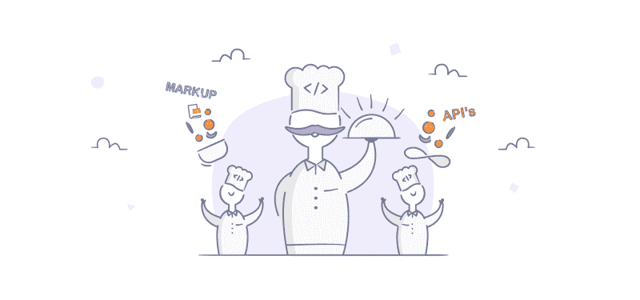
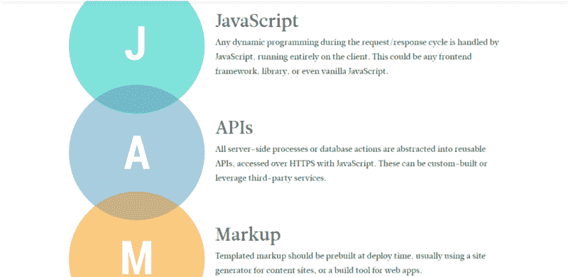
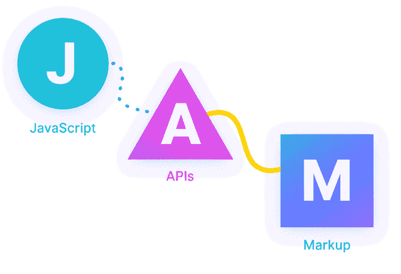
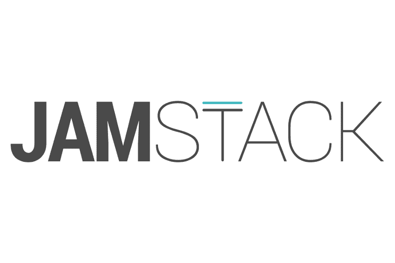

# JAMstack 简介:现代网络的架构

> 原文：<https://www.freecodecamp.org/news/an-introduction-to-the-jamstack-the-architecture-of-the-modern-web-c4a0d128d9ca/>

我肯定你以前遇到过 JAMstack 这个词，但你可能不明白它的真正含义。我以前也见过这个词，但没有在意去核实，直到 Egwuenu Gift 组织的 T2 JAMstack Lagos 组织的 T3。然后我意识到我已经在构建 JAMstack 应用程序了。

JAMstack 是一种现代的 web 开发架构。它不是一种编程语言或任何形式的工具。这更像是一种 web 开发实践，旨在实现更好的性能、更高的安全性、更低的扩展成本和更好的开发人员体验。

在本文中，我将向您介绍 JAMstack 的含义、您为什么应该关注它、最佳实践以及如何开始。？

### 介绍

根据官方 [JAMstack 文档](https://jamstack.org/)，

> JAMstack 是一个基于客户端 JavaScript、可重用 API 和预建标记的现代 web 开发架构。

> 当我们谈论“堆栈”时，我们不再谈论操作系统、特定的 web 服务器、后端编程语言或数据库。

> JAMstack 不是关于特定的技术。这是一种构建网站和应用的新方式，能够提供更好的性能、更高的安全性、更低的扩展成本和更好的开发人员体验。

JAMstack 是网络发展的一个主要趋势，由 Netlify 的首席执行官和联合创始人 T2·马蒂亚斯·比尔曼创造。

### 好吧，冷静点！什么是 JAMstack？

您可能遇到过特定的术语，如**表示堆栈**和 **MERN 堆栈。**这些只是术语，用于对某些技术进行分类或分组，以实现特定目标。

JAMstack 代表

**J** avaScript

**一个**π

**M** arkup

> 栈通常只是用于创建 web 或移动应用程序的几种技术的组合。所以 JAMstack 是 JavaScript、API 和标记的结合。很有趣吧？

JAMstack 项目不依赖于服务器端代码——它们可以是分布式的，而不依赖于服务器。JAMstack 应用直接从 CDN 提供服务，可提升速度、性能和用户体验。

### 有用的术语

我将在本文中频繁使用这些术语，我想你应该知道它们的含义(如果你还不知道的话):

*   **API** 是 Application Programming Interface(应用编程接口)的首字母缩写，它是一个软件中介，允许两个应用程序相互对话。
*   **CDN** (内容交付网络)是一个分布式服务器(网络)系统，根据用户的地理位置、网页的来源和内容交付服务器，向用户交付页面和其他 Web 内容。
*   **服务器**是一台计算机，用于处理请求，并通过互联网或本地网络将数据传送到另一台计算机。
*   **数据库**是经过组织的信息集合，以便于访问、管理和更新

### 为什么是 JAMstack？

传统网站或 CMS 网站(如 WordPress、Drupal 等。)严重依赖服务器、插件和数据库。但是 JAMstack 可以加载一些从 API 接收数据的 JavaScript，提供来自 CDN 的文件和在部署时使用静态站点生成器生成的标记。

听起来很酷，对吧？！

#### JAMstack 很快

当谈到最小化加载时间时，没有什么比通过 CDN 提供预建文件更好的了。JAMstack 站点非常快，因为 HTML 已经在部署时生成，并通过 [CDN](https://flaviocopes.com/cdn/) 提供，没有任何干扰或后端延迟。

#### JAMstack 非常安全

一切都通过 API 工作，因此没有数据库或安全漏洞。通过将服务器端流程抽象为微服务 API，攻击的表面区域减少了，因此您的站点变得高度安全。

#### JAMstack 更便宜，也更容易扩展

JAMstack 站点只包含少量文件，文件大小极小，可以在任何地方提供。扩展就是在其他地方或通过 cdn 提供这些文件。

### JAMstack 最佳实践

*   使用 CDN 而不是服务器来分发您的文件
*   安装和参与您的项目应该很容易，不太复杂。使用 npm 和 Git 等工具来确保标准和更快的设置。
*   使用构建工具，让你的项目兼容所有的浏览器(例如 Babel，Browserify，Webpack 等)。)
*   确保您的项目符合 web 标准并且高度可访问
*   确保您的构建过程是自动化的，以减少压力。
*   让你的部署过程自动化，你可以使用像 [Netlify](https://netlify.com) 这样的平台来完成

### 我如何开始？

您可以使用一些已经构建的技术在几分钟内构建 JAMstack 应用程序。以下是一些例子:

*   [**盖茨比**](https://www.gatsbyjs.org/) **:** 盖茨比是一个基于 React 的免费开源框架，帮助开发者构建超快的**网站和** **应用**
*   [**NuxtJS**](https://nuxtjs.org/)**:**NuxtJS 是通用应用、静态生成应用、单页应用、渐进式 web 应用和桌面应用的 Vue.js 框架
*   [**Hugo**](http://gohugo.io)**:**Hugo 是世界上最快的网站建设框架。它是最流行的开源静态站点生成器之一。凭借其惊人的速度和灵活性，Hugo 让网站建设再次充满乐趣。
*   [**Netlify CMS**](https://www.netlifycms.org/)**:**Netlify CMS 是一款针对 Git 工作流的开源内容管理软件，可与任何静态站点生成器一起使用，以实现更快、更灵活的 web 项目
*   [**Contentful**](https://www.contentful.com)**:**Contentful 是一个更智能、无缝的内容管理系统，它为编辑和开发人员提供统一的内容，从而增强协作，确保数字产品更快上市。
*   [**Svelte**](https://svelte.dev/)**:**Svelte 是一种全新的构建用户界面的方法。尽管 React 和 Vue 等传统框架在*浏览器*中完成了大部分工作，但 Svelte 将这些工作转变为*编译步骤*，这发生在你构建应用的时候。

[***还有很多。。。***](https://www.staticgen.com/)

### 有用的资源

*   [**JAMstack WTF**](https://jamstack.wtf/)
*   [**如何建立一个 JAMstack 网站**](https://cosmicjs.com/blog/how-to-build-a-jamstack-website)
*   [**什么是 JAMstack，为什么要尝试一下**](https://www.giftegwuenu.com/what-is-ja-mstack-and-why-you-should-try-it)
*   [**一个 JAMstack 就绪的 CMS**](https://www.contentful.com/r/knowledgebase/jamstack-cms/)
*   [**jam stack for Clients:On Benefits&静态站点 CMS**](https://snipcart.com/blog/jamstack-clients-static-site-cms)
*   [**去静态化:在你的下一个项目中尝试 JAMstack 的 5 个理由**](https://builtvisible.com/go-static-try-jamstack/)
*   [**静态网站+ JAMstack = ❤**](https://julian.is/article/static-websites-and-jamstack/)

点击查看更多资源

[https://www.youtube.com/embed/uWTMEDEPw8c?feature=oembed](https://www.youtube.com/embed/uWTMEDEPw8c?feature=oembed)

### 结论

JAMstack 的发明是为了给构建网站和应用的新方式命名，提供更好的性能、更高的安全性、更低的扩展成本和更好的开发人员体验。

JAMstack 不是关于特定的技术，它是一个基于客户端 JavaScript、可重用 API 和预建标记的现代 web 开发架构。

加入 [JAMstack 社区](https://jamstack.org/community/)了解更多信息并获得更多更新。

> PS:本文最初发表在我的博客[这里](https://bolajiayodeji.com/an-introduction-to-the-jamstack-the-architecture-of-the-modern-web-c4a0d128d9ca)