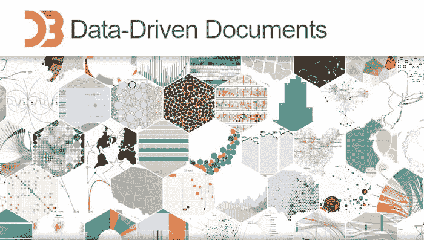
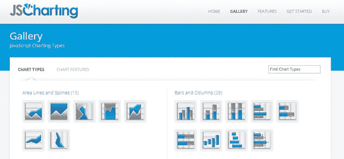
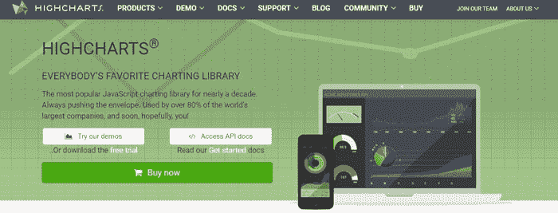
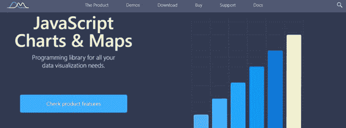
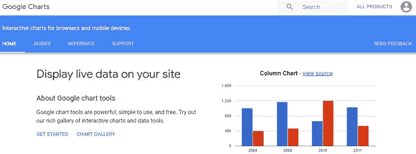
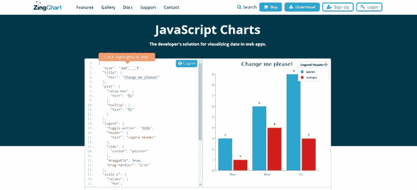
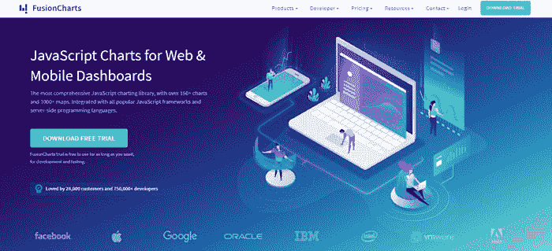
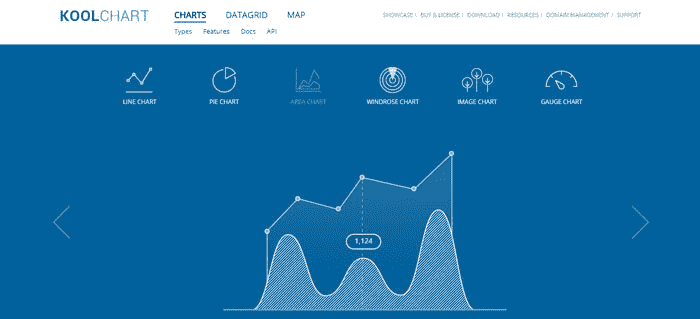
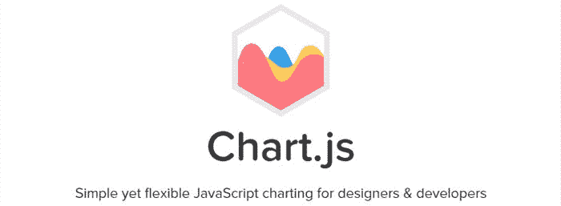

# 这些是 2019 年最好的 JavaScript 图表库

> 原文：<https://www.freecodecamp.org/news/these-are-the-best-javascript-chart-libraries-for-2019-29782f5e1dc2/>

首先，简要介绍一下历史:

随着数据收集和使用继续呈指数级增长，可视化这些数据的需求变得越来越重要。开发人员试图将数百万条数据库记录整合到漂亮的图表和仪表板中，以便人们能够快速直观地解读。

数据可视化技术在过去十年中不断改进，许多高级图表库现在可供消费者使用。在 21 世纪早期，图表生成由服务器端图像位图图表主导。Flash 和 Silverlight 等插件提供了更具交互性的制图体验，但对下载速度、电池寿命和系统资源有很大影响。

随着移动和平板电脑使用的爆炸式增长，主流平台不再支持插件，开发人员不得不转向可以在任何地方运行的开放客户端技术。与此同时，超高分辨率屏幕和更常见的触摸手势缩放的出现，将分辨率无关的矢量图推向了前沿。

进入当前以 JavaScript 和 SVG(可伸缩矢量图形)为主导的数据可视化时代。图表现在可以在所有浏览器上运行，无需特殊插件，支持交互性和动画，即使在最高分辨率的设备上也看起来很清晰。回顾 50 多个可视化库，这 9 个产品脱颖而出:

#### [**D3.js**](https://d3js.org/)

D3.js 是一个非常广泛和强大的图形 JavaScript 库。它允许您将任意数据绑定到文档对象模型(DOM ),然后将数据驱动的转换应用到文档。

D3 远远超出了典型的图表库，包括许多其他更小的技术模块，如轴、颜色、层次、轮廓、缓和、多边形等等。所有这些造就了陡峭的学习曲线。

试图创建一个简单的图表可能会很复杂。包括轴和其他图表项目在内的所有元素都需要明确定义。许多示例展示了如何使用 CSS 来设计图表元素的样式。没有基于图表的功能会自动应用。如果你想进入杂草中，用创意完全掌控每一个元素，是最好的选择。争分夺秒地工作以满足数据可视化项目需求，从零开始可能不是最佳选择。

D3.js 可以成为图表库的构建块。开发人员已经使用 D3 使得使用消耗它的图表解决方案更容易，比如 NVD3。

D3.js 开源，免费使用。

#### [**js 制图**](https://jscharting.com/)

JSCharting 图表库支持大量的图表类型，包括地图、甘特图、股票和其他经常需要单独的库才能使用的图表。它包括所有国家的内置地图，以及一个 SVG 图标库。一套独立的微型图表可以呈现在页面上的任何图表标签或任何 div 元素中。UI 控件(UiItems)也包括在内，允许更丰富的交互式图表。实时控制数据或可视化变量非常容易，图表可以导出为 SVG、PNG、PDF 和 JPG 格式。

图库分为图表类型和功能示例。图表样式经过了改进，产生了一些外观整洁的图表。整体视觉效果提供了清晰专业的制图体验。

包含的示例使用配置对象来自定义图表。创建和控制图表类型的设置使用起来非常简单。指定更复杂的图表类型只需要很少的属性设置，JSCharting 具有强大的动态默认值，这意味着它会尝试自动为场景选择最佳设置。

该文档包括许多教程和全面的 API 属性描述。许多属性包括示例用法和示例链接。

JSCharting 对于非商业和个人使用是免费的，并且还提供商业许可选项，包括所有图表类型和产品，只收取一笔费用。

#### 

****

**Highcharts 是一个流行的 JavaScript 图表库，被许多世界上最大的公司使用。图表是使用 SVG 生成的，并回退到 VML 以向后兼容 IE6/IE8。演示图表展示了相当丰富的特性集，但在视觉上并不令人惊叹。通用文档包括许多相关主题的教程，API 文档非常全面。**

**图表使用配置选项来创建图表，并且 API 易于使用。**

**Highcharts 免费用于非商业和个人用途。其他用途需要商业许可，股票、地图和甘特图单独许可。**

#### **[**amCharts**](https://www.amcharts.com/)**

****

**amCharts 最近发布了第 4 版，增加了一个强大的 SVG 动画引擎，允许创建类似电影的场景。**

**演示图表看起来非常好。大多数演示都提供了一些调色板和一个滑块 UI 来实时调整图表变量。文档包括许多教程和完整的 API 属性描述。**

**创建图表与基于配置的方法略有不同，而是使用更具声明性的 API。它需要稍微多一点的代码来配置图表，但是提供了更好的代码完成体验。**

**amCharts 提供带有品牌图表的免费许可和用于其他用途的付费许可。**

#### **[**谷歌排行榜**](https://developers.google.com/chart/)**

****

**谷歌图表功能强大且易于使用。**

**样本图表看起来很干净，很好看。图库和扩展图库显示了许多图表类型，但按下汉堡菜单会显示这些图库列表中未显示的更多类型(如日历)。**

**每种图表类型都有一个专门的教程，并附有实例。教程包括相关特性的代码和 API 列表。这是一次开始使用新图表库的愉快经历。**

**图表是使用配置选项对象自定义的。数据集是使用 DataTable 类填充的，所有图表都可以使用该类。每种图表类型都有特定于类型的教程中列出的唯一选项。属性命名是标准化的，许多选项适用于所有类型。**

**谷歌图表是免费的，但有一个警告。它是一个 web 服务，不能在本地托管。在过去，谷歌已经淘汰了 API，所以如果你的使用是关键任务，你可能要选择另一个选项。**

#### **[**辛查特**](https://www.zingchart.com/)**

****

**ZingChart 提供了许多图表类型，并与 angular、react 和其他框架相集成。它有一个强大的功能集，有许多定制选项。**

**演示图表显示了一系列的样式主题，其中一些看起来比其他的更好，但是可以根据需要选择样式。演示并没有展示所有可用的图表类型。**

**文档包括所有可用类型的教程、大量特性和完整的 API 列表。**

**ZingChart 使用配置选项来自定义图表。示例包括许多属性设置，如字体样式。这些会妨碍理解给定图表需要什么设置。**

**ZingChart 可以和 branding 一起免费使用。非品牌使用可获得付费许可。**

#### ****

********

****FusionCharts 已经存在很多年了，最初是一个基于 Flash 的图表插件。这是一个强大的图表可视化库。它支持许多数据格式，包括 XML、JSON 和 JavaScript，在现代浏览器中工作，并向后兼容 IE6。还支持许多 JavaScript 框架和服务器端编程语言。****

****图表库包括大量的例子，它们有一个干净的视觉外观。****

****文档包括良好的 API 描述，以及每种图表类型的示例。配置属性按任务和图表功能分组。****

****图表是使用基于配置的选项创建的，相对容易使用。当深入研究 API 时，属性列表可能会很长。所有配置属性都是浅层的，如{chartLeftMargin，showAlternateHGridColor }。这似乎是一种改进代码完成的尝试。****

****FusionCharts 对个人使用图表品牌是免费的。付费许可可用于无品牌和商业用途。****

#### ********

************

******KoolChart 是一个基于 HTML 5 画布的 JavaScript 图表库。还提供地图和网格产品。******

******他们的新版本 v5 包括了一个更具交互性的特性集和更新的样式。视觉效果干净现代。使用 canvas 提供了更好的性能，但代价是基于栅格。******

******示例使用基于 XML 的字符串来应用图表选项，这似乎比其他方法不太实用。这些选项看起来像 HTML5，但是是通过 JavaScript 字符串设置的。******

******API 有很好的文档记录，每个属性都有示例图表。还提供了 173 页的 PDF 手册。******

******两个月的试用期可供评估。试用期过后，需要获得许可。******

#### ******[**chart . js**](https://www.chartjs.org/)******

********

****Chart.js 是一个支持 8 种图表类型的开源 JavaScript 库。这是一个只有 60kb 的小型 js 库。类型包括折线图、条形图、面积图、雷达图、饼图、气泡图、散点图和混合图。也支持时间序列。它使用 canvas 元素进行渲染，并响应窗口大小调整以保持缩放粒度。它向后兼容 IE9。聚合填充也可用于 IE7。****

****样本视觉效果看起来相当现代，包括第一次绘图时的初始动画。当实时添加系列或数据点时，它会平滑地显示动画。调用 update()函数重新绘制图表后，可以修改图表选项。****

****示例源代码没有显示在网站图库中，但可以在 GitHub repo 中找到。配置选项用于创建和修改图表。选项 API 简洁直观。****

****文档非常全面，包括带有属性 API 和代码片段的教程。****

****Chart.js 是一个开源库，可以免费用于个人和商业用途。对于更高级的仪表板需求，有限的类型数量可能是一个问题。****

#### ******结论******

****JavaScript 图表库的生态系统在过去的十年中有了很大的发展。今天，有大量的图表产品可以满足各种各样的需求，通过数百种图表类型服务于各种各样的项目。大多数库提供免费试用或品牌版本，使您能够使用自己的数据、加载和项目复杂性来评估图表的有效性。****

****大多数图表库很容易处理简单的精选数据集和静态可视化。然而，当真实世界的动态数据被可视化时，图表可能并不总是平稳地处理事情。可能需要更多的工作来调整和排列元素，以便图表显示正确，并且这种手动调整可以随着新的动态数据的可视化而中断。****

****为了选择满足您独特需求的最佳 JS 图表解决方案，我建议您根据上面列出的几个库来测试您自己的数据，以确保它们非常适合您当前和未来的项目。****