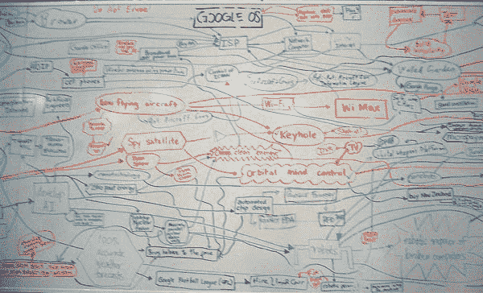

# 结对编程心理学

> 原文：<https://www.freecodecamp.org/news/the-psychology-of-pair-programming-86cb31f9abca/>

克里斯·库尼

# 结对编程心理学

#### 最佳结对程序员展示的行为和技能。

I know this is serious business but this pair are off the chart cute.

Sallyann Freudenberg 博士是一名软件工程师和心理学家，他花了大量时间观察高性能软件团队的行为。[她的博客](https://salfreudenberg.wordpress.com/2013/06/08/pair-programming-and-expertise/)包含了丰富的信息，可供任何希望提高技能的软件专业人士参考。

作为一名没有任何心理学背景的工程师，我不禁认为——这是一些非常非常好的东西。通俗易懂，一目了然。我想…也许我选择了错误的职业？*也许我是心理学家！*所以我读了一点弗洛伊德和**哦，我的上帝，恐怖**，所以我肯定还是个工程师，对心理学不再感兴趣。我也不敢看我妈妈的眼睛。

无论如何，经过几个小时的重复性劳损劳动，这就是我的成果。基于科德宝博士工作的技巧集。我的希望是，在深入研究科德宝博士的工作并获得更全面的理解之前，你可以把它作为入门读物，或者开胃品。让我们开始吧。

### 定期休息

很容易打开。我知道我听起来像你年轻时的妈妈。她警告你不要有方眼睛。她说的方眼是错的，但她说的偶尔休息一下是对的。

在心理学中，规律的休息是众所周知的。在结对编程的环境中，他们:

*   防止上下文建立得太多。分手让事情变得支离破碎。
*   降低认知负荷，实现更长的结对编程会话。
*   让你更快乐！

在我看到的所有基本罪恶中，这是最常见的。五个小时的会议，没有休息时间。“穿越”并不总是答案。有时，去喝杯咖啡或啤酒(取决于你有多困)也能提供答案。如果你感兴趣，有一本关于闲暇时间的精彩书籍，对这个话题给出了更全面的答案。

### 按键盘，不要拿

在科德宝博士的研究中，键盘是控制的物理组成部分。在加拿大，工程师们可以自由地传递鼠标，但键盘却被视为神圣。在高性能的双人组中，驾驶员会主动控制键盘。它永远不会被拿走。由此，我们可以为驾驶员和导航员收集一个简单的规则。

#### 司机——学会何时靠边停车。

科德宝博士的研究例子说明了这一点。

> 示例 1(安娜在导航，本在开车):

> 安娜:“如果你……..请转到…。”

> 本:(把键盘滑给她)”(你)开车…这样更容易”。

司机知道最有效的沟通方式，并乐意在需要时放弃控制。不要让你的自负紧紧抓住钥匙。必要的时候交出来。

#### 领航员——不要丧失能力。

当你在看的时候，看。给点提示，友好点，但不要强行把控制权从司机手中夺走。它会产生怨恨。小心对待键盘。

司机通常被视为两个人中的权力位置，但当事情变得棘手时，导航员有能力通过劫持键盘来破坏整个练习。权力越大，责任越大。

### 有地方画画。

白板是这里的黄金标准。一个漂亮的，大的，干净的空间来画画。文字是伟大的，但什么也比不上一堆摇摇晃晃的盒子和不那么直的线条。

在科德宝博士的研究中，一个关键的发现是在高性能的配对中使用潦草的图表。写图表这一创造性的行为激发了思维，唤起了记忆。它们比预先存在的图表更强大，在寻求多个团队和系统的整体视图时，这些图表似乎更有用。

有时候没有匆忙画出的画，东西很难传达。如果你没有白板，使用记事本。在一个例子中，科德宝博士观察到有人用手指描绘图表。画画能激发人们的快乐！

### 邀请自发的外部帮助

这就是你在解决一个问题。需要使用并保存到数据库中的 API。你们辩论，讨论，开始写作。什么都不管用，你也不知道为什么，但是如果你能集中注意力…只要再坚持一会儿。几个小时不被打扰。

然后……付款团队的 Bill 俯身询问您刚才说过的一些事情。

Oh my **GOD** Bill

#### 但是比尔说得有道理。

“嘿，那个端点实际上使用了与其他 API 不同的模型”，比尔嘀咕着，敏锐地察觉到你眼中雷鸣般的目光。你可以生比尔的气，但事实是，他阻止你是对的。你正准备写些破代码。比尔是敌人吗？不。你的工作方式是。

中断是会发生的，尤其是当你在构建错误的东西的时候。事实是，比尔救了你的命。在科德宝博士的研究中，这种开放的交流受到高水平情侣的欢迎。它增加了知识转移，有助于更有效的配对。

所以去跟比尔道歉。他为你节省了大量的时间和新鲜的白发。

### 保留上下文

前一个场景的问题在于上下文。也许比尔可以接受一些个人界限训练，但如果不是比尔，你知道应该是运营部的桑德拉。血腥桑德拉…

你头脑中复杂的时钟环境只有在你的客厅里才有。在工作场所，你需要交谈，而且不总是按照你自己的方式。Freudenberg 博士解释说，软件工程师需要同时在多个抽象层次上工作，不断进出细节层次。当你在脑海中构建庞大复杂的图像时，这就产生了问题。高水平的搭档是如何处理这个问题的？

#### 名单，你这个笨鹅

关键是专注于你正在做的事情。当你发现新事物时，把它写下来。列表中的项目形成了小旗，提醒你发现的问题和事实。这意味着你可以专注于手头的问题，并且不会忘记你在这个过程中的发现。

下次人力资源部的詹姆斯进来告诉你不要在大厅和陌生人击掌时，你的背景不会被抹去。你可能会慢下来一会儿，但是看看那些甜蜜的清单。你回到母体了。

#### 关于列表还有一件事

在你对你的清单大呼小叫之前，科德宝博士还有一个发现。通常情况下，列表不会被重新访问。它们被写下来并被丢弃。它本质上只是你大脑的一点短暂的存储空间。不用担心整洁。担心让你的想法变成比你头脑中的果冻更持久的东西，保护你当前关注的对象。

### 与 tag 团队结对分担负担。

> 七号咖啡。不管你怎么努力，这该死的测试都不会通过。当它发生时你决定交换，所以你已经开了一个多小时了。你累了，你的伴侣厌倦了，进步几乎停止了。很快，你就会像任何 90 年代的美国动作英雄一样回家喝威士忌。

我们已经见过一千次了。个人在这个问题上投入太多，并且拒绝回顾他们的目标。通常是骄傲，有时是十足的好战。为了克服这一点，科德宝博士发现，除了指定的目标点，高水平的搭档还会给彼此贴上标签。

Avoid steroids… but other than that, these guys provide some good pairing role models.

这很直观，对吧？在拳击场上，如果冷酷的史蒂夫·奥斯汀越来越累，你知道他会把摇滚的 T2 加入(我的摔跤知识已经过时了)。如果你快没电了，这应该是换司机的正当理由。不要绊倒，跌入死亡行军。

在 Twitter 上关注科德宝博士！我知道，你也应该知道。另外，这篇文章的原始资料(包括所有相关的学术资料)可以在 [Sal 的精彩博客](https://salfreudenberg.wordpress.com/2013/06/08/pair-programming-and-expertise/)上找到。

当你这么做的时候，[在 twitter 上关注我](https://twitter.com/chris_cooney)。我定期写博客，介绍其他更聪明的人的工作。