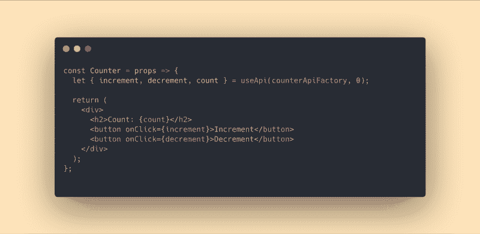

# 为什么应该选择 useState 而不是 useReducer

> 原文：<https://www.freecodecamp.org/news/why-you-should-choose-usestate-instead-of-usereducer-ffc80057f815/>

by Austin Malerba

# 为什么应该选择 useState 而不是 useReducer

#### 通过使用状态进行本地和全局状态管理的指南



自从引入 React Hooks API 以来，我已经看到了很多关于`useState`、`useReducer`以及何时使用其中一个的讨论。从这些对话中，人们可以得出这样的结论:`useState`最适合具有简单更新逻辑的简单状态，而`useReducer`最适合具有复杂更新逻辑的复杂状态。

我在这里想让你相信，当用一个 4 行的定制钩子包装时，在管理复杂状态时，useState 即使不比 useReducer 更强大，也可以和它一样强大。

我不喜欢减速器。我尝试过使用它们，但我总是以迁移而告终。当我可以通过调用一个带参数的函数来触发业务逻辑时，调度操作感觉有些不对。

还有一个事实是，我没有将我的业务逻辑封装到函数中，而是应该将它们全部聚集到一个由一堆开关盒划分的巨大函数中？我已经尝试了像 [redux-actions](https://www.npmjs.com/package/redux-actions) 这样的库来减轻这种担心，但是我仍然不能处理它。我对减速器的厌恶促使我寻找更好的解决方案。

让我们回顾一下人们选择`useReducer`而不是`useState`的一些常见原因:

1.  因此，业务逻辑可以集中在 reducer 中，而不是分散在组件中
2.  还原剂是纯粹的功能，很容易在隔离反应的情况下测试
3.  Reducers 允许相互依赖的状态片段被可预测地更新(而多个`useState`可能不会)

如果这些要点令人困惑，我建议看一看这篇文章。在本指南中，我将把这些项目称为减压器的三个好处。

### 第一步:构建一个例子

首先，我将向您展示一个例子，展示我上面提到的减速器的好处，然后我将向您展示如何通过`useState`实现相同的功能，而不牺牲`useReducer`解决方案的任何好处。

#### 可冻结的计数器

为了说明`useState`与`useReducer`的利弊，我将实现一个简单的计数器。计数器可以递增，但也可以冻结。如果处于冻结状态，递增计数器不会有任何作用。

如你所见，我已经用`useState`和`useReducer`分别实现了上面的计数器。然而，`StateCounterV1`有一些问题。事实上，它甚至不像预期的那样工作。

我们期望`StateCounterV1`应该呈现`<div>1` < /div >，因为我们增加了一次计数器，然后我们冻结了计数器，然后我们再次增加。但是在现实中 `it renders` T9【div】2>2</div>因为 t `he second`调用的 increment 没有 acc `ess to`冻结的新值。这个 il `lustrates` 比 useState 更有利于`t #3 of` useReducer。

同样明显的是，在`StateCounterV1`中，我们递增计数器的逻辑驻留在组件本身中，但是在`ReducerCounter`中，该逻辑属于`countReducer`(好处#1)。

最后，我们看到，为了测试`StateCounterV1`中的计数逻辑，我们必须渲染它，而为了测试`countReducer`中的逻辑，我们可以不渲染组件。我们可以简单地通过用一个状态和一个动作调用它来测试它，并确保它输出正确的下一个状态(好处#2)。

### 第二步:折叠状态

在我们的例子中，我们有一个状态转换`increment`，它更新`count`，但是依赖于*另一个*状态，`frozen`。在这种情况下，我发现最好是巩固国家。理论上，我们每个组件最多可以有一个`useState`钩子，并且仍然可以实现我们想要的任何功能。但是，只要在更新时各个状态不相互依赖，多次`useState`完全没问题。也就是说，让我们看看巩固状态如何能给我们带来 reducers 的好处#3。

现在，在我们的`increment`函数中传递给`setState`的更新程序是自给自足的。它不再需要通过闭包来达到`frozen`来决定如何产生下一个状态。相反，`prevState`包含执行其更新逻辑所需的所有状态。

因为它是自给自足的，我们不再需要在渲染时声明它，我们可以把它从组件中取出来。

当我们将状态更新声明提升到组件之外时，我们不仅提高了性能，还防止了我们像在`StateCounterV1`中那样通过闭包意外地依赖变量。这种模式有点离题，但我想我还是要提到它。

### 第三步:提取业务逻辑

此时`StateCounterV2`仍然充斥着计数器逻辑。但是不用担心，我们需要做的就是将所有的计数器业务逻辑提取到一个自定义钩子中。姑且称之为`useCounterApi`。

现在`StateCounterV3`看起来不错。我认为它看起来甚至比`ReducerCounter`更好。更不用说这种重构非常简单，因为它实际上只需要将我们的计数器逻辑复制/粘贴到一个自定义钩子中。但是事情变得棘手了。

作为开发人员，有时很难确定逻辑的归属。我们的大脑是不稳定的，有时我不会想到将这个逻辑从组件中提取出来，放入一个定制的计数器钩子中。这就是为什么我们开发人员需要固执己见的界面来引导我们走向正确的方向。

### 第四步:创建指南

如果我们必须口头描述`useCounterApi`，我们可能会说，

> "这是一个创建并返回计数器 API 的自定义钩子."

这是我们的第一条线索。它*创建并返回一个 API* 。因此，它是一个 API 工厂。更确切地说，是一家*专柜*的 API 工厂。

但是我们喜欢抽象事物，所以下一个问题是，我们如何才能创建一个*通用* API 工厂？好了，我们把`useCounterApi`中的“计数器”部分去掉吧。现在只剩下`useApi`了。太棒了，现在我们有了通用 API 工厂。但是，我们的商业逻辑将走向何方？

让我们多想想`useReducer`是如何工作的。

```
const [state, dispatch] = useReducer(reducer, initialArg, init);
```

`useReducer`的第一个自变量是一个缩减器，第二个自变量是初始状态。记住，reducer 包含业务逻辑。让我们试着模仿这个界面。

```
const api = useApi(someApiFactoryFunction, initialArg);
```

好吧，感觉我们快找到解决办法了。但是现在我们必须弄清楚到底应该做什么。

嗯，我们知道它应该包含业务逻辑，我们知道它应该不知道 React，这样我们就可以测试它，而不必呈现组件。我们还知道的是`someApiFactoryFunction`不能包含`useState`调用，因为这样的话*就会*知道对事情做出反应。但是它确实需要`state`和`setState`。所以我们必须以其他方式注入`state`和`setState`。那么我们如何再次将东西注入函数呢？哦对了，参数。将这个思考练习结合在一起，我们得出了以下结论。

这就是了。`useApi`是我们神奇的 4 线定制挂钩，揭示了`useState`的真正力量。API 工厂函数为我们提供了当前的`state`和一个`setState`回调，让我们从它们那里公开一个 API。让我们想一想，我们刚刚通过这一简单的合同变更引入了什么样的好处。

`counterApiFactory`不知道 React，这意味着我们现在可以简单地通过传递一个`state`对象和一个`setState`回调来测试它(实现了缩减器的第二个好处)。

`useApi`期望一个 API 工厂，这意味着我们告诉开发者他们*需要*用签名`({state, setState}) =>` api 编写 API 工厂函数。这意味着，即使在我休息的日子里，当我的大脑努力认识到一个逻辑集群可以重构为一个有状态的 API 时，我也有这个漂亮的 litt `le use` Api 函数提示我将我所有的有状态业务逻辑放到一个集中的位置。

### 第五步:优化

就目前的情况来看，`useApi`并没有达到应有的效率。任何消耗`useApi`的组件都会在每次渲染时调用`useApi`，这意味着`apiFactory`也会在每次渲染时被调用。没有必要在每次渲染时调用`apiFactory`，而是只在`state`改变时调用。我们可以通过记忆`apiFactory`的执行来优化`useApi`。

### 测试 API 工厂

现在我们已经实现了我们的`useApi`钩子，让我们看看如何测试一个 API 工厂。

在我们的`counterApiFactory`周围创建一个模仿`state` / `setState`行为的包装器非常简单。有了这个助手函数，我们可以用一种非常自然的方式测试我们的`counterApiFactory`。

### useApi vs useReducer

现在让我们比较一下这两种解决方案。

#### 逻辑封装

在这两种解决方案中，更新状态的逻辑是集中的，这使得推理、调试和测试变得容易。然而，减速器只提供了一种机制来更新 T2 状态，而没有提供一种机制来恢复 T4 状态。取而代之的是编写选择器，并在缩减器的下游应用它们。我们的`useApi`解决方案的好处在于，它不仅封装了更新状态的逻辑，还封装了*检索*状态的逻辑。。

#### 更新状态

为了用`useReducer`更新状态，我们需要分派动作。为了用`useApi`更新状态，我们需要调用 updater 方法。在这种情况下，reducer 的一个潜在优势是多个 reducer 可以监听同一个动作。然而，这也带来了一个缺点:一旦分派了一个动作，执行流程就不直观了。如果我需要一次更新多个不同的状态片段，我宁愿通过多个背靠背的 API 方法调用来显式地完成，而不是通过广播给所有 reducers 的单个调度动作。

#### 表演

reducer 的一个好处是，通过 reducer 组合，多个 reducer 可以监听一个分派的动作，这意味着您可以在一个渲染中改变状态的许多部分。我还没有想出 API 工厂组合的解决方案(尽管这肯定是可能的)。目前，我的解决方案是在必要时连续调用状态更新程序，这可能会比 reducer 方法导致更多的渲染。

#### 样板文件

基于 Reducer 的解决方案是众所周知的样板文件(尤其是在使用 redux 时)。动作类型声明占用了一些额外的空间，并且分派动作比仅仅调用带有参数的函数要冗长一些。出于这些原因，我认为`useApi`在样板代码方面比`useReducer`略胜一筹。

#### 易测性

减速器和 API 工厂都很容易测试。

### 进一步探索 useApi

让我们来看看我们可以用`useApi`做的其他一些很酷的事情。

我已经花时间通过`useApi`实现了经典的 [Redux Todo 列表示例](https://redux.js.org/basics/example)。下面是`todosApiFactory`在 useApi 实现中的样子。

在上面的代码中，您可能已经注意到了一件很严重的事情，那就是重复了下面的样板文件。

```
setState(prevState => ({  ...prevState,  /* … */});
```

假设我们的`state`是一个对象，因为`setState`不支持[浅层合并](https://reactjs.org/docs/hooks-reference.html#usestate)，我们需要这样做来确保我们保留任何我们当前没有处理的状态。

我们可以减少一些样板文件，并从名为 [immer](https://github.com/immerjs/immer) 的库中获得一些其他的好处。immer 是一个不变性库，它允许你以可变的方式编写不可变的代码。

如您所见，immer 帮助我们删除了编写不可变更新时所需的一些烦人的样板代码。但是要注意，immer 的便利性也是它的致命弱点。通过 immer 了解不变性概念的开发人员可能不会完全理解突变的后果。

但是等一下，`useApi`只在本地提供状态*，但是[待办事项示例](https://redux.js.org/basics/example)使用 redux 提供一个*全局*状态解决方案。*

#### 全球商店有`API Factories`

让我们看看如何从 API 工厂创建全局存储。

一点也不差，对吧？上下文使得全局状态非常容易反应。因此，我们现在有了一个全局状态管理解决方案来用于 API 工厂。

下面是工作 API 工厂待办事项列表示例。

### 结论

总结一下，本文包含三个可能对您有用的函数。

这些函数为由`useState`支持的本地和全局状态管理提供了有用的抽象。

不要误解我，reducers 有很多额外的好处，但是我不能对他们提供的界面放心。`useApi`和`useReducer`都为复杂的状态管理提供了可行的解决方案。真的是喜好问题。

一个有用的经验是，库不一定要执行复杂的逻辑才能有用。库和框架提供的许多价值与它们执行的逻辑无关，而是它们给予开发者的指导。好的库/框架迫使开发人员通过明确的和固执己见的接口遵循已知的模式。做很少的计算，但是鼓励开发者把他们的有状态业务逻辑放在一个集中的位置，同时避免组件污染。