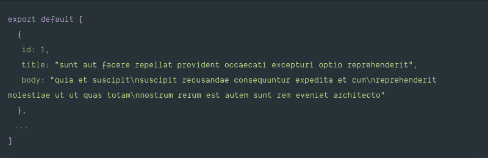
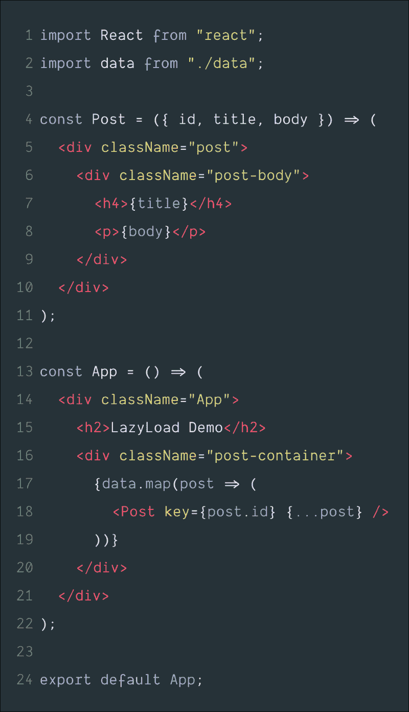
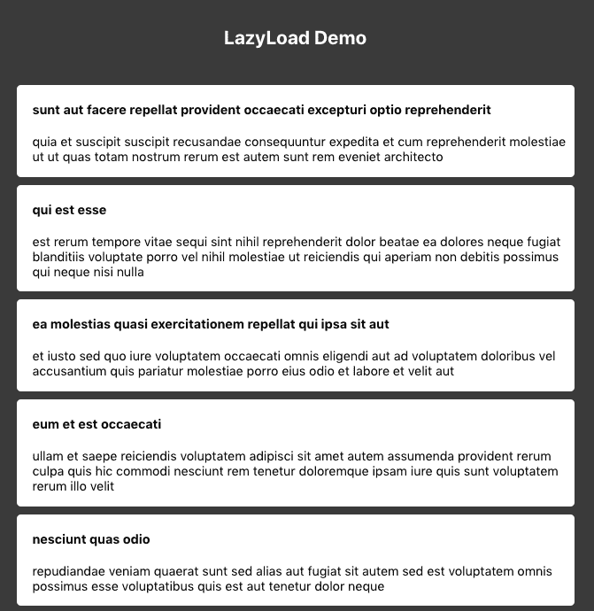
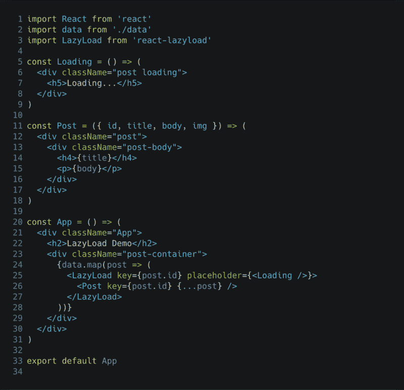
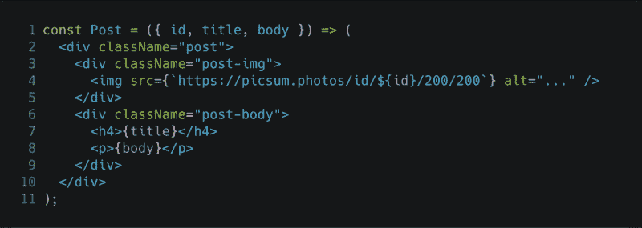
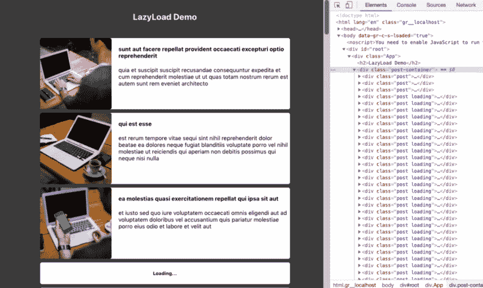
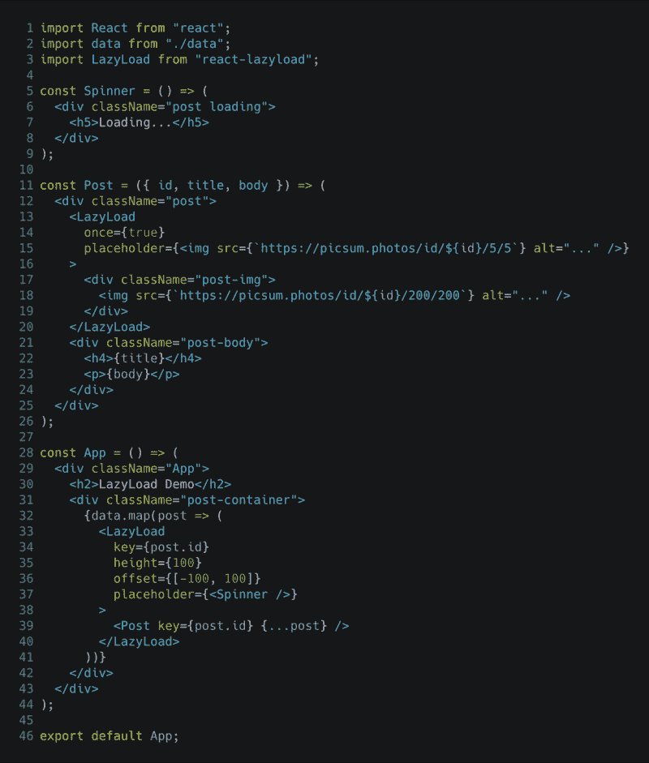
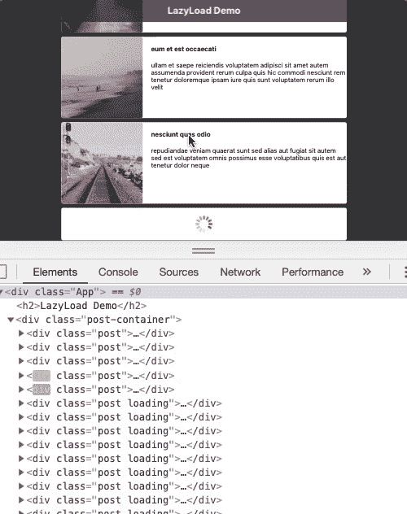

# 如何用延迟加载优化 React 应用？

> 原文：<https://www.freecodecamp.org/news/how-to-optimize-react-applications-with-lazy-loading-232183e02768/>

阿明·诺沙德

# 如何用延迟加载优化 React 应用？

#### 你的组件，图像，等等


惰性加载是一种优化 web 应用程序和移动应用程序的老技术。事情很简单——如果当时没有查看或需要，就不要渲染。因此，举例来说，如果我们有一个帖子列表要显示，我们最初应该只渲染视口中的内容。这意味着其余的元素将在以后按需呈现(当它们在视口中或即将在视口中时)。

### 为什么偷懒装？

大多数时候，我们的用户看不到整个网页，至少在开始的时候。无论我们的应用程序 UI 是如何构建的，总有一些组件用户可能最初或永远都不需要！

在这些情况下，呈现这些组件不仅会损害应用程序的性能，还会浪费大量资源(尤其是当它们包含图像或类似的数据饥渴内容时)。

因此，按需加载或呈现这些组件似乎是一个更有效的决策。它可以提高应用程序的性能，同时可以节省我们大量的资源。

### 怎么会？

我们将制作一个可以应用延迟加载的示例应用程序。首先，我们需要使用下面的命令来初始化 React 应用程序:

```
create-react-app lazydemocd lazydemonpm run start
```

默认情况下，这可能需要几分钟来初始化并在浏览器的`3000`端口中打开 react 应用程序。

> 如果您的电脑上没有安装`create-react-app`，您可以使用命令:`npm install -g create-react-app`进行安装

现在，我们将列出一些随机发布的帖子。所以，先来点哑数据。在我们项目的`src`文件夹中创建一个名为`data.js`的文件。我刚刚复制粘贴了来自这个`JSON`占位符端点【https://jsonplaceholder.typicode.com/posts】的[的`json`响应。您也可以创建自己的虚拟数据。遵循以下格式对于本教程来说应该足够了:](https://jsonplaceholder.typicode.com/posts)



data.js format

让我们用下面的代码替换`App.js`文件的内容:



在这里，我们简单地列出了`posts`和它们的`title`和`body`。通过一些简单的`CSS`修改，我们得到了右边的视图。这里的完整列表呈现一次。现在，如果我们不想一开始就渲染所有东西，我们应该应用`lazy loading`。让我们将它安装在我们的项目中:

来源:[two bin](https://github.com/twobin)/[react-lazy load](https://github.com/twobin/react-lazyload)

```
npm install —-save react-lazyload
```

现在，让我们通过导入和应用`lazyload`来更新`App.js`文件。



使用`react-lazyload`非常简单，只需用`<LazyLoad …> … </` LazyLoad >包装组件。这里我们使用了一个占位符`r component` < Loading / `> tha` t 将显示 Loading…直到组件加载完毕。我们也可以`set th` e eff `ective`高度`and offs` et 的 LazyLoad 组件。你可以在文档中找到更多细节:https://github.com/twobin/rea CT-lazy load # height

现在，所有的帖子最初都没有被渲染。根据视口的不同，最初只会渲染几个。但是，由于内容到目前为止是文本的，除非我们检查并看到 DOM 从`loading`移动到`loaded`时的变化，否则很难实现这种效果。

为了让我们的延迟加载更有效，让我们把图片放在帖子里。我们将使用 [Lorem Picsum](https://picsum.photos/) 为我们的照片。我们更新后的`Post`组件应该如下所示:



> Lorem Picsum url 格式
> https://picsum . photos/id/[image _ id]/[width]/[height]



The result after inserting images with posts

现在，正如我之前所说的，图片是网页中需要大量数据的组成部分，我们在这里为每个帖子加载图片。尽管整个组件是延迟加载的，并且 image 也是随组件一起加载的，但是 image 加载得有点晚，而且不太流畅。因此，我们可以为用户使用 LazyLoad 加载单个图像提供更好的图像加载体验。

该技术是加载一个非常低质量的图像作为占位符，然后加载原始图像。所以，最后的`App.js`看起来像是—



现在我们可以用我们的`inspect element open`来`scroll`这个列表，看看这些组件在靠近视窗时是如何变化的，然后被渲染，占位符被实际内容替换。

我们完成了，现在，我们的懒人正在全力以赴地工作。那很简单！！！



> 这里的映像 LazyLoad 不是最佳用例，因为它已经由组件 LazyLoad 处理了。但是，该技术在我们必须显示大量图像的其他用例中非常有用。尝试禁用 LazyLoad on Post 组件，但保留图像 LazyLoad，您可以看到它的效果。

github:[https://github.com/nowshad-sust/lazydemo](https://github.com/nowshad-sust/lazydemo)

react lazy load:[two bin](https://github.com/twobin)/[react-lazy load](https://github.com/twobin/react-lazyload)