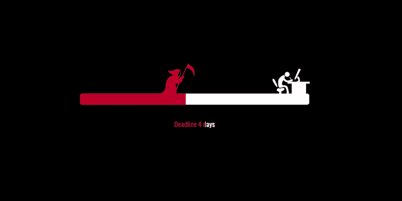
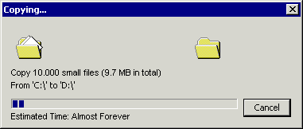

# 如何在软件开发中与最后期限和平共处

> 原文：<https://www.freecodecamp.org/news/how-to-make-peace-with-deadlines-in-software-development-6cfe3e993f51/>

**D E A D L I N E…**

作为开发人员，这是您最大的噩梦之一，或者我应该说是您的敌人？随便你怎么命名。

承认吧。这让你很害怕。即使是现在，当你在读这些句子的时候，它也会让你毛骨悚然。

想知道我怎么知道的吗？

我知道，因为我也有同样的感觉。但是现在恐惧已经过去了。我已经接受了最后期限。我已经接受了他们。

所以我建议你也这么做。拥抱他们，与他们和平相处。这是你打败他们的唯一方法。

好吧，但是，你怎么能这样做呢？

在设定最后期限时，有些事实是我们都容易忽略的。我在这里的目的是向你展示它们，这样你就可以看到，当你在做你的项目而不用担心日期的时候，埋葬恐惧并开始享受生活是多么的简单。

### 在平静的环境中工作

[https://imgur.com/gallery/cBSSh4h](https://imgur.com/gallery/cBSSh4h)

不要着急。不要强求任何东西。

首先你应该知道的第一件事是，你不能通过设定不切实际的日期和强迫你的团队匆忙工作来找到你的平静。有公司抛出大话，展示不切实际的东西来激励自己的团队前进。但是，尽管有些事实对团队中的每个人来说都是显而易见的，但如果你所说的与现实相去甚远，你又怎么能指望他们相信你呢？

没有一个固定的——最重要的是可信的——截止日期，你无法平静地工作。是的，保持冷静是这里的关键。当你不相信日期，或者当有人告诉你在有限的时间内做所有的事情，或者有人在不给你更多时间的情况下给项目增加了更多的任务，你就开始疯狂地工作。这不再是工作了。这是地狱。

> 当你处于紧张和压力之下时，你不可能有效率。当你平静的时候，你也是有意识的，这意味着你可以做出更好的决定。

### 我们的估计很糟糕

[https://simonschreibt.de/gat/renderhell-book3/](https://simonschreibt.de/gat/renderhell-book3/)

Windows 用户将记住那个窗口对话框。对话中的估计和我们的估计完全一样，不是吗？

我们承认吧。我们的估计很糟糕。我们认为我们可以猜测某件事需要多长时间。我们倾向于相信无论我们猜测什么都会成真。

然而，一般来说，当我们在猜测时，我们会忽略一些会影响我们假设的重要因素。为什么？因为我们太乐观了。

对我来说，接受最后期限并更好地设定最后期限的第一步是承认我们是糟糕的评估者。当你接受这个事实时，下次你会有意识，这将防止你低估需求。这里有一个解决方案可以让你更好地估计:

> **把大事情分成小事情**。**越小越容易估计**。这将增加你获得更准确评估的机会。

### 足够好就可以了

> “完美是好的敌人。”—伏尔泰

人们喜欢大挑战。我们最擅长为简单的问题找到复杂的解决方案。但这里有一个事实:

> 每个问题都有自己简单的解决方法，而你可能会忽略这些方法。

不要追求完美的解决方案。你的第一个版本不一定要完美。建立一个可以工作的半成品。如果你等待太久，你会浪费你有限的资源和宝贵的时间，或者你会错过最后期限，甚至更糟的是因为你在追求完美而什么都不做。解决方案是:

> 找到能给你带来巨大价值且不费吹灰之力的解决方案。别忘了，好可以在以后变成伟大。

### 不要太乐观。现实一点。

我看到有些经理过于乐观，这使得他们设定乐观的截止日期来激励团队。这太不对了。我不是说你应该对未来感到悲观。相反，我是在告诉你，你应该能够看到每一个可能造成瓶颈的可能性。一旦你能看到他们，你就可以考虑他们，并有一个更准确的估计。

公司里有不同的团队。工程、业务开发、市场营销等。当业务开发团队强迫你在不久的将来给他们一个期限时，你不应该受他们的影响。他们希望他们的工作尽快完成。

> 请记住，每个团队都考虑自己的一方。

### 区分“你必须做”、“你能做”和“你想做”

理解是这里的关键。发布你的产品的核心需求是什么？通常，产品团队很难区分它们。

当你开会的时候，一个团队成员会说，“我们可以实现它，它会给我们带来很多价值”，或者另一个会说“我们应该发布它。”他们从自己的角度来看。好吧，我们可以实现它，它可以给我们带来一些价值，但重要的问题是“我们现在需要它吗？在第一版？”

大多数情况下，答案是否定的。

> 你必须做的事情才是你应该关注的事情。排除你能做和你想做的事情。在大多数情况下，它们甚至是不可协商的。

### 默认说不

当我们对某事说“是”时，我们通常会忘记一个重要的事实。我们对已经需要完成的事情说不。

当你对新事物说“是”的时候，你并没有考虑它会对你现有的待办事项产生什么影响。

设定期限后，让我们在项目中加入更多的任务。(随着时间的推移，你的项目应该变小，而不是变大。) **没有**。

“我们专注于重要的事情，好吧。但是细节呢？让我们考虑一下我们有什么样的细节可以在未来产生问题。” **没有**。忽略第一个版本的每个细节。不要试图预测未来。

找到更多的时间做事情不是这里的问题。问题是要做的事情太多。区分“**必须拥有的**”和“**最好拥有的**”。

> 完成更多工作的唯一方法是减少要做的事情。

### 永远不要改变截止日期

我看到开发团队有一个会严重影响他们产品开发的坏习惯:重新安排截止日期。

当他们错过最后期限时，他们会设定一个新的。如果他们不能满足这一个，他们设置另一个。当他们重复这样做时，这就成了一种习惯。然后这个坏习惯就变成了他们的文化。公司的其他团队失去信任，并质疑开发人员的工作。更糟糕的是，开发团队本身也会失去对彼此的信任。也是如此。

> 改变最后期限实质上是承认失败。它做出这样的声明，“我们未能计划需求，我们没有说足够的不，我们没有关注什么是重要的，我们推动我们的团队在不合理的时间做不合理的事情。”

### 要知道总会有一些问题

过于乐观导致你忽略了可能存在一些问题的事实。要注意。很可能会出问题。这将导致你在修理东西上损失一些时间。所以最好为糟糕的情况做好准备。我不是说你应该悲观，你应该试着预测未来，让你自己和你的团队为未知做好准备。在乐观和悲观之间找到平衡点就好。现实一点。

我的经验告诉我，在软件开发中，有些事情总是出错。我给你的建议是:

> 考虑到可能会出错，在设定截止日期前给它增加一些时间。

### 不要向项目中添加更多的人

很多人认为，如果他们在项目中增加更多的人，就可以加快进度。然而，他们忽略了非常重要的一点。让我们记住布鲁克斯定律:

> 将[人力资源](https://en.wikipedia.org/wiki/Human_resources)添加到一个后期的软件项目中会使它变得更晚。—解放了布鲁克斯

根据 Brooks 在维基百科上的说法，当一个人加入到一个项目中时，他会花费更多的时间，而不是更少的时间。那么为什么会这样呢？

*   加入项目的人需要一段时间才能变得有效率。你必须先教育他们。您的人力资源已经有限，您必须将这些资源用于培训新成员。此外，由于它们是新的，它们会引入新的错误，使项目离完成更远。
*   [通信开销](https://en.wikipedia.org/w/index.php?title=Communication_overhead&action=edit&redlink=1)随着人数的增加而增加。
*   在一项高度可分的任务中增加更多的人，比如在酒店打扫房间，可以减少总的任务持续时间。然而，软件项目中包括许多专业的其他任务是不太可分的。布鲁克斯的另一个很好的例子是:一个女人需要九个月才能生下一个孩子，而“九个女人不可能在一个月内生下一个孩子”。

理查德·道尔顿提出的另一个证据可以解释为什么增加人口是错误的:

> “团队是不可改变的。每次有人离开或加入，你都有一个新的团队，而不是一个改变的团队。”—理查德·道尔顿

### 不要拖延

让我帮助你理解我的意思。上周，我们开了一个会议，讨论为我们产品的新功能确定最后期限。我们讨论了哪些任务是我们的优先任务，以及我们应该如何有效地执行这些任务。

我们在一项任务上浪费了大量时间。有三种方法来完成这项任务，但不知何故我们被卡住了。我们无法选择，因为开发者试图预测未来。他们用“如果”开始每个句子。

> 你无法预测未来会带给你什么。不要为未知做过多的准备。

我不是在这里谈论重大的技术决策。当然，如果你必须决定你的核心技术，你应该考虑一下找到正确的解决方案。但是不要把时间花在小事上。不确定的事情会增加会议并阻碍你的进程，因为你的后台进程会持续地处理它们。

> 不要拖拖拉拉，下定决心，勇往直前。

把你的心态从“让我们考虑一下”变成“现在就决定吧”。决定会加速你的进步。当一件事决定下来，团队里的每个人都会清楚。每个人都知道该怎么做。

### 沟通:看瓶颈在哪里？

你计划了一切。你定义了关注什么和做什么。你确切地知道需要多少时间(很可能你会错)。所以，最后期限已经定了。够不够？

**号**

正如我上面提到的，总有出错的可能。当您的团队成员正在处理他们的任务时，可能会有一些事情阻碍他们。有些事情会阻止他们按时完成任务。你要看到瓶颈在哪里，是什么。

沟通是这里的关键。你必须保持团队同步。有时候团队成员可以进入一个盒子，他们很难看到里面发生了什么。这是你应该进入场景的地方。一旦你确定了瓶颈，消除它，这样你的团队成员就可以从他们停滞的地方继续前进。

祝你好运，按时完成所有任务:)

感谢阅读。

*最初发表于[https://huseyinpolatyuruk.com](http://blog.huseyinpolatyuruk.com/how-to-make-peace-with-deadlines-in-software-development)。*