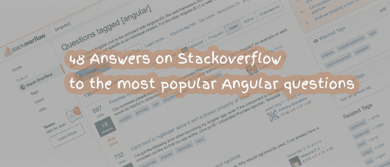
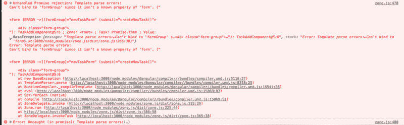
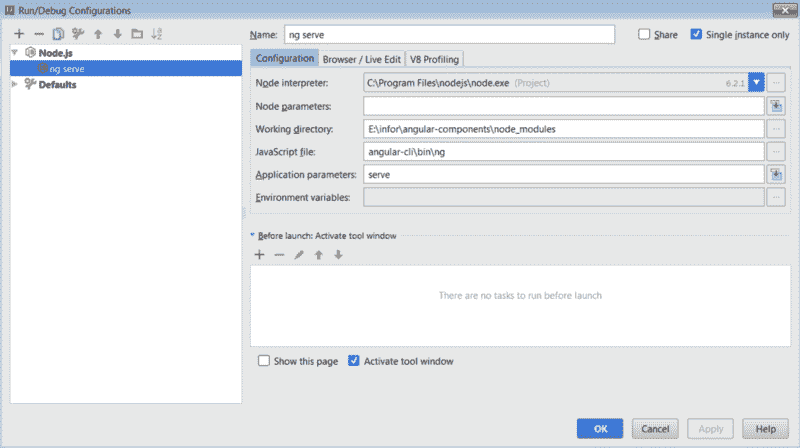

# StackOverflow 上最受欢迎的角度问题的 48 个答案

> 原文：<https://www.freecodecamp.org/news/48-answers-on-stack-overflow-to-the-most-popular-angular-questions-52f9eb430ab0/>

作者:什洛米·李维

# StackOverflow 上最受欢迎的角度问题的 48 个答案



我从 Stackoverflow 收集了最常见的问题和答案。这些问题是根据收到的最高分选出的。无论你是专家还是初学者，都可以借鉴别人的经验。

### 目录

*   [角度—承诺与可观察](#b4d0)
*   [构造器和 ngOnInit 的区别](#d37e)
*   [无法绑定到“ngModel ”,因为它不是“input”](#008f)的已知属性
*   [有角度的 HTML 绑定](#7e4b)
*   [Angular/RxJs 我应该何时取消订阅](#22fe)
*   如何在组件模板中选择元素？
*   [Angular 中 ngShow 和 ngHide 的等价是什么？](#b510)
*   [如何捆绑 Angular app 进行制作](#76f3)
*   行为主体 vs 可观察主体？
*   [@方向 v/s @角度分量](#883d)
*   [Angular HTTP GET with type script error HTTP . GET(…)。映射不是[null]](#4653) 中的函数
*   [jQuery 如何配合 Angular 使用？](#9c12)
*   [角度异常:没有 Http 的提供者](#2739)
*   [无法绑定到“formGroup ”,因为它不是“form”的已知属性](#b612)
*   [角度 DI 错误—异常:无法解析所有参数](#ce7e)
*   [Angular —为每个请求设置标题](#1761)
*   [Angular 中如何使用*ngIf else？](#cace)
*   [Angular 没有名称服务提供商](#92c6)
*   [将选择元素绑定到有角度的对象上](#bc7c)
*   [ng module 中的声明、提供者和导入之间有什么区别](#e423)
*   [在角形中，你如何确定主动路线？](#d774)
*   [角度 CLI SASS 选项](#17bd)
*   [手动触发角度变化检测](#83b6)
*   [棱角分明，打字稿:找不到名字](#eb6d)
*   [Angular —组件中 module.id 的含义是什么？](#c874)
*   如何在 Angular 2 的“选择”中获得新的选择？
*   [角度异常:无法绑定到“ngForIn ”,因为它不是已知的本机属性](#aad5)
*   [*ngIf 和*ngFor 在同一元素上导致错误](#1556)
*   [Angular js $腕表的角度当量是多少？](#a331)
*   [将 lodash 导入 angular2 + typescript 应用程序](#7a78)
*   [如何检测路线角度变化？](#5b1c)
*   [全局事件中的角度](#869e)
*   [system js 和 Webpack 有什么区别？](#e7f2)
*   [Angular:找不到 Promise，Map，Set 和 Iterator](#176d)
*   [角 RC4——带打字稿 2.0.0 的角^2.0.0](#2459)
*   [如何检测一个@Input()值何时发生角度变化？](#6188)
*   [如何将 url 参数(查询字符串)传递给 Angular 上的 HTTP 请求](#d2d3)
*   [如何部署 Angular apps？](#57cd)
*   [对于属性](#fb28)中以索引为值的
*   [在角度 2](#c709) 中定义全局常数
*   [有角度——在服务和组件中使用管道](#7910)
*   [Angular2 异常:无法绑定到“routerLink ”,因为它不是已知的本机属性](#1cef)
*   [带用户点击选择组件的角度 2 动态标签](#4d6c)
*   [委托:事件发射体或可观测角度](#4f96)
*   [如何向 angular-cli 项目添加引导程序](#bcef)
*   [使用*ngFor](#d3fa) 访问对象的键和值
*   [角度异常:无法绑定到“ngFor ”,因为它不是已知的本机属性](#3f0e)
*   [如何在 Angular 2 + CLI 项目中添加 font-awesome](#7f27)
*   [angular 4 中 HTTP 和 HTTPClient 的区别？](#54eb)

**尽情享受吧！**

### 角度——承诺与可观察

> 551+积分*？1*50497+查看
> ***[Rohit](https://stackoverflow.com/users/6364715/rohit) 问，***

有人能解释一下`Promise`和`Observable`在角度上的区别吗？

每一个例子都有助于理解这两种情况。我们可以在什么场景中使用每个案例？

> [***君特***](https://stackoverflow.com/users/217408) ***回答，(686+分)***

**承诺**

当异步操作完成或失败时，`Promise`处理**单事件**。

注意:有一些`Promise`库支持取消，但是 ES6 `Promise`目前还不支持。

**可观察的**

一个`Observable`类似于一个`**Stream**`(在许多语言中)，允许传递零个或多个事件，其中每个事件都调用回调。

通常`Observable`比`Promise`更受欢迎，因为它提供了`Promise`和更多的特性。有了`Observable`,你想处理 0、1 或多个事件都没关系。您可以在每种情况下使用相同的 API。

`Observable`也比`Promise`有优势**可取消**。如果对服务器的 HTTP 请求或其他一些昂贵的异步操作的结果不再需要，`Observable`的`Subscription`允许取消订阅，而`Promise`最终将调用成功或失败的回调，即使你不再需要通知或它提供的结果。

可观察提供**个操作符**，如`map`、`forEach`、`reduce`、...类似于数组

也有像`retry()`，或者`replay()`这样强大的运算符，...通常都很方便。

[**来源**](https://stackoverflow.com/questions/37364973)
**[顶级](#599b)**

### 构造函数和 ngOnInit 的区别

> 444+分*？1* 90，166+查看
> ***Haseena P A 问，***

Angular 默认提供生命周期钩子`ngOnInit`。

如果我们已经有了一个`constructor`，为什么还要使用`ngOnInit`？

> [](https://stackoverflow.com/users/5043867)****回答，(512+积分)****

*`Constructor`是类的默认方法，在类被实例化时执行，并确保类及其子类中字段的正确初始化。Angular 或 better Dependency Injector (DI)分析构造函数参数，当它通过调用`new MyClass()`创建一个新实例时，它试图找到与构造函数参数类型相匹配的提供者，解析它们并将它们传递给构造函数，如*

```
*`new MyClass(someArg);`*
```

*`ngOnInit`是 Angular2 调用的一个生命周期挂钩，表示 Angular 已经完成创建组件。*

*为了像这样使用，我们必须导入`OnInit`(实际上实现`OnInit`不是强制性的，但被认为是好的实践):*

```
*`import {Component, OnInit} from '@angular/core';`*
```

*然后要使用`OnInit`的方法，我们必须在类中这样实现。*

```
*`export class App implements OnInit{
  constructor(){
     //called first time before the ngOnInit()
  }

  ngOnInit(){
     //called after the constructor and called  after the first ngOnChanges() 
  }
}`*
```

*`Implement this interface to execute custom initialization logic after your directive's data-bound properties have been initialized. ngOnInit is called right after the directive's data-bound properties have been checked for the first time, and before any of its children have been checked. It is invoked only once when the directive is instantiated.`*

*大多数情况下，我们使用`ngOnInit`进行所有的初始化/声明，避免在构造函数中工作。构造函数应该只用于初始化类成员，而不应该做实际的“工作”。*

*所以您应该使用`constructor()`来设置依赖注入，而不是其他。ngOnInit()是更好的“起点”——它是解析组件绑定的地方/时间。*

*欲了解更多信息，请参考:*

*   *[https://angular.io/api/core/OnInit](https://angular.io/api/core/OnInit)*
*   *[Angular 2 组件构造器 Vs OnInit](https://stackoverflow.com/a/35846307/5043867)*

*[**来源**](https://stackoverflow.com/questions/35763730)
**[顶级](#599b)***

### *无法绑定到“ngModel ”,因为它不是“input”的已知属性*

> *442+分*？2*46901+查看了
> ***[abreneliere](https://stackoverflow.com/users/3433751/anthony-breneli%C3%A8re) 问，****

*我在启动我的 Angular 应用程序时出现以下错误，即使组件没有显示。*

*我必须注释掉，这样我的应用程序才能工作。*

```
*`zone.js:461 Unhandled Promise rejection: Template parse errors:
Can't bind to 'ngModel' since it isn't a known property of 'input'. ("
    <div>
        <label>Created:</label>
        <input  type="text" [ERROR ->][(ngModel)]="test" placeholder="foo" />
    </div>
</div>"): InterventionDetails@4:28 ; Zone: <root> ; Task: Promise.then ; Value:`*
```

*我在看英雄拔毛机，但我看不出有什么不同。*

*以下是组件文件:*

```
*`import { Component, EventEmitter, Input, OnInit, Output } from '@angular/core';
import { Intervention } from '../../model/intervention';

@Component({
    selector: 'intervention-details',
    templateUrl: 'app/intervention/details/intervention.details.html',
    styleUrls: ['app/intervention/details/intervention.details.css']
})

export class InterventionDetails
{
    @Input() intervention: Intervention;
    public test : string = "toto";
}`*
```

> *[](https://stackoverflow.com/users/3433751)****回答，(674+分)*****

**是的就是它，在 app.module.ts 中，我刚刚添加了:**

```
**`import { FormsModule } from '@angular/forms';

[...]

@NgModule({
  imports: [
    [...]
    FormsModule
  ],
  [...]
})`**
```

**[**来源**](https://stackoverflow.com/questions/38892771)
**[顶级](#599b)****

### **有角度的 HTML 绑定**

> **385+分*？2* 27，115+查看
> ***[Aviad P.](https://stackoverflow.com/users/3433751/anthony-breneli%C3%A8re) 问，*****

**我正在编写一个 Angular 应用程序，我有一个 HTML 响应想要显示。我该怎么做？如果我简单地使用绑定语法`{{myVal}}`，它会对所有 HTML 字符进行编码(当然)。**

**我需要以某种方式将 div 的内部 html 绑定到变量值。**

> **[***prolink 007***](https://stackoverflow.com/users/427763)***回答，(691+积分)*****

**正确的语法如下:**

```
**`<div [innerHTML]="theHtmlString"></div>`**
```

**在`5.2.6`工作**

**[文件参考](https://angular.io/docs/ts/latest/guide/template-syntax.html#!#property-binding-or-interpolation-)**

**[**来源**](https://stackoverflow.com/questions/31548311)
**[顶级](#599b)****

### **Angular/RxJs 我应该何时取消订阅**

> **320+分*？6*9606+查看
> ***[谢尔盖吉洪](https://stackoverflow.com/users/1429493/sergey-tihon)问，*****

**在 NgOnDestroy 的生命周期中，什么时候应该存储`Subscription`实例并调用`unsubscribe()`,什么时候可以忽略它们？**

**保存所有订阅会给组件代码带来很多混乱。**

**[HTTP 客户端指南](https://angular.io/docs/ts/latest/guide/server-communication.html)像这样忽略订阅:**

```
**`getHeroes() {
  this.heroService.getHeroes()
                   .subscribe(
                     heroes => this.heroes = heroes,
                     error =>  this.errorMessage = <any>error);
}`**
```

**同一时间[路线&导航指南](https://angular.io/docs/ts/latest/guide/router.html)说:**

**`Eventually, we'll navigate somewhere else. The router will remove this component from the DOM and destroy it. We need to clean up after ourselves before that happens. Specifically, we must unsubscribe before Angular destroys the component. Failure to do so could create a memory leak.`**

**`We unsubscribe from our Observable in the ngOnDestroy method.`**

```
**`private sub: any;

ngOnInit() {
  this.sub = this.route.params.subscribe(params => {
     let id = +params['id']; // (+) converts string 'id' to a number
     this.service.getHero(id).then(hero => this.hero = hero);
   });
}

ngOnDestroy() {
  this.sub.unsubscribe();
}`**
```

> **[](https://stackoverflow.com/users/939634)****回答，(508+积分)******

#### **— —编辑 3 —“官方”解决方案(2017/04/09)**

**我在 NGConf 与 Ward Bell 讨论了这个问题(我甚至给他看了这个答案，他说这个答案是正确的)，但他告诉我 Angular 的文档团队有一个未公布的解决方案(尽管他们正在努力获得批准)。他还告诉我，我可以用即将发布的官方推荐来更新我的 so 回答。**

**我们今后都应该使用的解决方案是给所有在类代码中有对`Observable`的`.subscribe()`调用的组件添加一个`private ngUnsubscribe: Subject = new Subject();`字段。**

**然后我们在我们的`ngOnDestroy()`方法中调用`this.ngUnsubscribe.next(); this.ngUnsubscribe.complete();`。**

**秘方(正如 [@metamaker](https://stackoverflow.com/a/42695571/939634) 已经提到的)是在我们每次`.subscribe()`调用之前调用`.takeUntil(this.ngUnsubscribe)`，这将保证当组件被销毁时，所有订阅都将被清理。**

**示例:**

```
**`import { Component, OnDestroy, OnInit } from '@angular/core';
import 'rxjs/add/operator/takeUntil';
// import { takeUntil } from 'rxjs/operators'; // for rxjs ^5.5.0 lettable operators
import { Subject } from 'rxjs/Subject';

import { MyThingService } from '../my-thing.service';

@Component({
    selector: 'my-thing',
    templateUrl: './my-thing.component.html'
})
export class MyThingComponent implements OnDestroy, OnInit {
    private ngUnsubscribe: Subject = new Subject();

    constructor(
        private myThingService: MyThingService,
    ) { }

    ngOnInit() {
        this.myThingService.getThings()
            .takeUntil(this.ngUnsubscribe)
            .subscribe(things => console.log(things));

        /* if using lettable operators in rxjs ^5.5.0
        this.myThingService.getThings()
            .pipe(takeUntil(this.ngUnsubscribe))
            .subscribe(things => console.log(things));
        */

        this.myThingService.getOtherThings()
            .takeUntil(this.ngUnsubscribe)
            .subscribe(things => console.log(things));

    }

    ngOnDestroy() {
        this.ngUnsubscribe.next();
        this.ngUnsubscribe.complete();
    }
}`**
```

#### **— —编辑 2 (2016/12/28)**

****信号源 5****

**角度教程,“路由”一章现在陈述如下:“路由器管理它提供的可观测量并本地化订阅。当组件被销毁时，订阅会被清除，从而防止内存泄漏，因此我们不需要取消订阅可观察的路由参数。”— [马克·拉杰科](https://stackoverflow.com/questions/38008334/angular2-rxjs-when-should-i-unsubscribe-from-subscription/41177163?noredirect=1#comment69909721_41177163)**

**这里有一个关于 Github 问题的[讨论](https://github.com/angular/angular.io/issues/3003#issuecomment-268429065)关于路由器可观察性的 Angular docs，其中 Ward Bell 提到对所有这些的澄清正在进行中。**

#### **— —编辑 1**

****信号源 4****

**在这个来自 NgEurope 的[视频中，Rob Wormald 还说你不需要退订路由器观察。他还提到了 2016 年 11 月](https://youtu.be/WWR9nxVx1ec?t=20m32s)的[视频中的`http`服务和`ActivatedRoute.params`。](https://youtu.be/VLGCCpOWFFw?t=33m37s)**

#### **— —原答案**

****TLDR:****

**这个问题有(2)种`Observables` - **有限**值和**无限**值。**

**`http` `Observables`产生**有限** (1)值，类似于 DOM `event listener` `Observables`产生**无限**值。**

**如果手动调用`subscribe`(不使用异步管道)，那么`unsubscribe`来自**无限** `Observables`。**

**不要担心**有限的**人，`RxJs`会照顾他们。**

****信号源 1****

**我在 Angular 的 Gitter [这里](https://gitter.im/angular/angular?at=5681e8fa3c68940269251fa5)找到了 Rob Wormald 的答案。**

**他说(为了清楚起见，我重新组织了一下，重点是我自己)**

**`if it's **a single-value-sequence** (like an http request) the **manual cleanup is unnecessary** (assuming you subscribe in the controller manually)`**

**`i should say "if it's a **sequence that completes**" (of which single value sequences, a la http, are one)`**

**`**if it's an infinite sequence**, **you should unsubscribe** which the async pipe does for you`**

**他还在这个 [youtube 视频](https://youtu.be/UHI0AzD_WfY?t=26m42s)中提到`they clean up after themselves`...在`complete`的可观察的上下文中(比如承诺，承诺总是完成的，因为它们总是产生 1 值并结束——我们从不担心取消订阅承诺以确保它们清理`xhr`事件监听器，对吗？).**

****信号源 2****

**此外，在[角度 2 的角度导轨](https://angular-2-training-book.rangle.io/handout/observables/disposing_subscriptions_and_releasing_resources.html)中，它写道**

**`In most cases we will not need to explicitly call the unsubscribe method unless we want to cancel early or our Observable has a longer lifespan than our subscription. The default behavior of Observable operators is to dispose of the subscription as soon as .complete() or .error() messages are published. Keep in mind that RxJS was designed to be used in a "fire and forget" fashion most of the time.`**

**短语`our Observable has a longer lifespan than our subscription`什么时候适用？**

**它适用于在组件内部创建订阅，而该组件在`Observable`完成之前(或“不久”之前)被销毁。**

**我把这理解为如果我们订阅了一个发出 10 个值的`http`请求或者一个可观察对象，而我们的组件在那个`http`请求返回或者 10 个值发出之前就被破坏了，我们仍然是好的！**

**当请求返回或第 10 个值最终发出时,`Observable`将完成，所有资源将被清理。**

****信号源 3****

**如果我们从同一个 Rangle guide 查看[这个例子](https://angular-2-training-book.rangle.io/handout/routing/routeparams.html)，我们可以看到`Subscription`到`route.params`确实需要一个`unsubscribe()`，因为我们不知道那些`params`什么时候会停止变化(发出新的值)。**

**该组件可能会因导航离开而被破坏，在这种情况下，路线参数可能仍会发生变化(在应用程序结束之前，它们在技术上可能会发生变化)，并且在订阅中分配的资源仍会被分配，因为还没有`completion`。**

**[**来源**](https://stackoverflow.com/questions/38008334)
**[顶级](#599b)****

### **如何在组件模板中选择元素？**

> **263+分*？2*65966+查看
> ***[阿曼古普塔](https://stackoverflow.com/users/2748475/aman-gupta)问，*****

**有人知道如何获取组件模板中定义的元素吗？聚合物使`$`和`$$`变得非常简单。**

**我只是在想如何从角度出发。**

**以教程中的例子为例:**

```
**`import {Component} from '@angular/core'

@Component({
    selector:'display'
    template:`
     <input #myname(input)="updateName(myname.value)"/>
     <p>My name : {{myName}}</p>
    `

})
export class DisplayComponent {
    myName: string = "Aman";
    updateName(input: String) {
        this.myName = input;
    }
}`**
```

**如何从类定义中获取对`p`或`input`元素的引用？**

> **[***【布罗科】***](https://stackoverflow.com/users/1413538)***回答，(149+分)*****

**通过将 DOM 元素注入到组件的构造函数中，您可以通过`ElementRef`获得 DOM 元素的句柄:**

```
**`constructor(myElement: ElementRef) { ... }`**
```

**docs:[https://angular . io/docs/ts/latest/API/core/index/ElementRef-class . html](https://angular.io/docs/ts/latest/api/core/index/ElementRef-class.html)**

**[**来源**](https://stackoverflow.com/questions/32693061)
**[顶级](#599b)****

### **Angular 中的 ngShow 和 ngHide 等价于什么？**

> **261+分*？2*06651+查看过
> **[米海勒杜卡努](https://stackoverflow.com/users/2870735/mihai-r%C4%83ducanu)** ***问，*****

**我有一些元素，我希望它们在某些情况下是可见的。**

**在 AngularJS 我会写**

```
**`<div ng-show="myVar">stuff</div>`**
```

**我该如何在 Angular 中做到这一点？**

> **[***君特***](https://stackoverflow.com/users/217408) ***回答，(445+分)*****

**只需绑定到`hidden`属性**

```
**`[hidden]="!myVar"`**
```

**请参见**

*   **[https://developer . Mozilla . org/en-US/docs/Web/HTML/Global _ attributes/hidden](https://developer.mozilla.org/en-US/docs/Web/HTML/Global_attributes/hidden)**

****问题****

**`hidden`有一些问题，因为它可能与 CSS 的`display`属性冲突。**

**看看 [**中的`some`是如何因**](https://plnkr.co/edit/SO3c3UUT3LBvhNAeriCz?p=preview) 有风格而不被隐藏的**

```
**`:host {display: block;}`**
```

**设置。(这在其他浏览器中可能会有所不同——我用 Chrome 50 进行了测试)**

****解决方法****

**您可以通过添加以下内容来修复它**

```
**`[hidden] { display: none !important;}`**
```

**到`index.html`中的全局样式。**

****另一个陷阱****

```
**`hidden="false"
hidden="{{false}}"
hidden="{{isHidden}}" // isHidden = false;`**
```

**与...相同**

```
**`hidden="true"`**
```

**并且不会显示该元素。**

**`hidden="false"`将指定被认为是真的字符串`"false"`。
只有值`false`或删除属性才会真正使元素可见。**

**使用`{{}}`也会将表达式转换为字符串，并且不会像预期的那样工作。**

**只有与`[]`绑定才能正常工作，因为这个`false`被指定为`false`而不是`"false"`。**

**`***ngIf**` **vs `[hidden]`****

**`*ngIf`有效地从 DOM 中删除了它的内容，而`[hidden]`修改了`display`属性，只指示浏览器不要显示内容，但是 DOM 仍然包含它。**

**[**来源**](https://stackoverflow.com/questions/35578083)
**[顶级](#599b)****

### **如何捆绑 Angular app 进行制作**

> **258+分*？1*11603+查看过
> ***[拍 M](https://stackoverflow.com/users/4155124/pat-m) 问，*****

**我想在这个帖子中跟踪和更新最新的最好的(希望是最简单的)方法来捆绑 Angular(版本 2，4，…)以便在一个活动的 web 服务器上生产。**

**请在答案中包括 Angular 版本，以便我们可以更好地跟踪它何时转移到以后的版本。**

> **[***尼古拉斯***](https://stackoverflow.com/users/1630604) ***回答，(267+积分)*****

#### **`2.x, 4.x, 5.x`(打字稿)带角度 CLI**

#### **一次性设置**

*   **`npm install -g @angular/cli`**
*   **`ng new projectFolder`创建新的应用程序**

#### **捆绑步骤**

*   **`ng build --prod`(目录为`projectFolder`时在命令行运行)**
*   ***标记`prod`束用于生产(见[角度文件](https://github.com/angular/angular-cli/wiki/build#--dev-vs---prod-builds)中生产标记包含的选项列表)。***
*   **使用以下命令`for i in dist/*; do brotli $i; done`压缩资源**

***bundle 默认生成到 **projectFolder/dist/*****

#### **输出**

***尺寸带角`5.2.8`带 CLI`1.7.2`***

*   **`dist/main.[hash].bundle.js`您的应用程序捆绑[大小:151 KB 用于新的 Angular CLI 应用程序空， **36 KB** 压缩]。**
*   **`dist/polyfill.[hash].bundle.js`poly fill 依赖项(@angular，RxJS...)捆绑[大小:58 KB 用于新的 Angular CLI 应用程序空， **17 KB** 压缩]。**
*   **`dist/index.html`您的应用程序的入口点。**
*   **`dist/inline.[hash].bundle.js`网页包加载器**
*   **`dist/style.[hash].bundle.css`风格定义**
*   **从 Angular CLI 资产配置中复制的资源**

#### **部署**

**您可以使用启动本地 HTTP 服务器的`ng serve --prod`命令预览您的应用程序，这样就可以使用 [http://localhost:4200](http://localhost:4200) 访问带有生产文件的应用程序。**

**对于生产应用，您必须从您选择的 HTTP 服务器中的`dist`文件夹部署所有文件。**

**[**来源**](https://stackoverflow.com/questions/37631098)
**[顶级](#599b)****

### **行为主体 vs 可观察？**

> **250+分*？1*22248+查看
> ***[凯文马克](https://stackoverflow.com/users/6620551/kevin-mark)问，*****

**我正在研究有角度的 RxJs 模式，我不明白行为主体和可观察主体之间的区别。**

**按照我的理解，BehaviorSubject 是一个可以随时间变化的值(可以订阅，订阅者可以收到更新的结果)。这似乎是一个可观察的完全相同的目的。**

**什么时候你会使用观察对象还是行为对象？使用行为主体比观察主体有好处吗，反之亦然？**

> **[***山塔努***](https://stackoverflow.com/users/3070452) ***回答，(425+积分)*****

**行为主体是一种主体，主体是一种特殊类型的可观察对象，所以你可以像其他可观察对象一样订阅消息。BehaviorSubject 的独特之处在于:**

*   **它需要一个初始值，因为它必须总是返回一个订阅值，即使它没有收到一个`next()`**
*   **订阅时，它返回主题的最后一个值。常规可观察对象只有在收到`onnext`时才会触发**
*   **在任何时候，您都可以使用`getValue()`方法在不可观察的代码中检索主题的最后一个值。**

**与可观察对象相比，受试者的独特特征是:**

*   **除了是一个可观察对象之外，它还是一个观察者，所以除了订阅它之外，您还可以向主题发送值。**

**此外，您可以使用 BehaviorSubject 上的`asobservable()`方法从 behavior subject 获得一个可观察值。**

**可观察对象是一个类属，而行为主体在技术上是可观察对象的一个子类，因为行为主体是具有特定品质的可观察对象。**

**行为主题示例:**

```
**`// Behavior Subject

// a is an initial value. if there is a subscription 
// after this, it would get "a" value immediately
let bSubject = new BehaviorSubject("a"); 

bSubject.next("b");

bSubject.subscribe((value) => {
  console.log("Subscription got", value); // Subscription got b, 
                                          // ^ This would not happen 
                                          // for a generic observable 
                                          // or generic subject by default
});

bSubject.next("c"); // Subscription got c
bSubject.next("d"); // Subscription got d`**
```

**常规主题的示例 2:**

```
**`// Regular Subject

let subject = new Subject(); 

subject.next("b");

subject.subscribe((value) => {
  console.log("Subscription got", value); // Subscription wont get 
                                          // anything at this point
});

subject.next("c"); // Subscription got c
subject.next("d"); // Subscription got d`**
```

**可以使用`subject.asobservable()`从主体和行为主体创建可观察对象。唯一的区别是你不能使用`next()`方法向一个可观察对象发送值。**

**在角度服务中，我会将 BehaviorSubject 用于数据服务，因为角度服务通常会在组件和行为主体初始化之前确保使用该服务的组件收到最后更新的数据，即使在组件订阅该数据后没有新的更新。**

**[**来源**](https://stackoverflow.com/questions/39494058)
**[顶级](#599b)****

### **@方向 v/s @角度分量**

> **239+分*？6*1582+查看
> *[**Prasanjit Dey**](https://stackoverflow.com/users/4917853/prasanjit-dey)**问，*****

**`@Component`和`@Directive`在角度上有什么区别？他们两个似乎做同样的任务，有同样的属性。**

**有哪些用例，什么时候更喜欢哪一个？**

> **[***贾克尔***T5***接了，(327+分)***](https://stackoverflow.com/users/1771017)**

**@组件需要视图，而@指令不需要。**

### **指令**

**我把@指令比作带有选项`restrict: 'A'`的 Angular 1.0 指令(指令不限于属性用法。)指令向现有 DOM 元素或现有组件实例添加行为。指令的一个用例是记录对一个元素的点击。**

```
**`import {Directive} from '@angular/core';

@Directive({
    selector: "[logOnClick]",
    hostListeners: {
        'click': 'onClick()',
    },
})

class LogOnClick {
    constructor() {}
    onClick() { console.log('Element clicked!'); }
}`**
```

**其用法如下:**

```
**`<button logOnClick>I log when clicked!<;/button>`**
```

### **成分**

**一个组件，而不是添加/修改行为，实际上用附加的行为创建了它自己的视图(DOM 元素的层次结构)。这方面的一个用例可能是联系人卡片组件:**

```
**`import {Component, View} from '@angular/core';

@Component({
  selector: 'contact-card',
  template: `
    <div>
      <h1>{{name}}</h1>
      <p>{{city}}</p>
    </div>
  `
})
class ContactCard {
  @Input() name: string
  @Input() city: string
  constructor() {}
}`**
```

**其用法如下:**

```
**`<contact-card [name]="'foo'" [city]="'bar'"></contact-card>`**
```

**是一个可重用的 UI 组件，我们可以在应用程序的任何地方使用，甚至在其他组件中。这些基本上构成了我们应用程序的 UI 构建块。**

### **概括起来**

**当您想要创建一组可重用的具有自定义行为的 UI DOM 元素时，请编写一个组件。当您想要编写可重用的行为来补充现有的 DOM 元素时，请编写一个指令。**

**来源:**

*   **[@指令文件](https://angular.io/api/core/Directive)**
*   **[@组件文档](https://angular.io/api/core/Component)**
*   **[有用的博客文章](http://blog.codeleak.pl/2015/06/angular2hello-world.html)**

**[**来源**](https://stackoverflow.com/questions/32680244)
**[顶级](#599b)****

### **angular HTTP GET with TypeScript error HTTP . GET(…)。映射不是[null]中的函数**

> **233+分*？1*41917+查看过
> *[**克劳迪**](https://stackoverflow.com/users/4834129/claudiu) **问，*****

**我对 Angular 中的 HTTP 有问题。**

**我只想在视图中显示一个列表。**

#### **服务级别**

```
**`import {Injectable} from "angular2/core";
import {Hall} from "./hall";
import {Http} from "angular2/http";
@Injectable()
export class HallService {
    public http:Http;
    public static PATH:string = 'app/backend/' 

    constructor(http:Http) {
        this.http=http;
    }

    getHalls() {
           return this.http.get(HallService.PATH + 'hall.json').map((res:Response) => res.json());
    }
}`**
```

**在`HallListComponent`中，我从服务中调用了`getHalls`方法:**

```
**`export class HallListComponent implements OnInit {
    public halls:Hall[];
    public _selectedId:number;

    constructor(private _router:Router,
                private _routeParams:RouteParams,
                private _service:HallService) {
        this._selectedId = +_routeParams.get('id');
    }

    ngOnInit() {
        this._service.getHalls().subscribe((halls:Hall[])=>{ 
            this.halls=halls;
        });
    }
}`**
```

**然而，我得到了一个例外:**

**`TypeError: this.http.get(...).map is not a function in [null]`**

#### **大厅中心组件**

```
**`import {Component} from "angular2/core";
import {RouterOutlet} from "angular2/router";
import {HallService} from "./hall.service";
import {RouteConfig} from "angular2/router";
import {HallListComponent} from "./hall-list.component";
import {HallDetailComponent} from "./hall-detail.component";
@Component({
    template:`
        <h2>my app</h2>
        <router-outlet></router-outlet>
    `,
    directives: [RouterOutlet],
    providers: [HallService]
})

@RouteConfig([
    {path: '/',         name: 'HallCenter', component:HallListComponent, useAsDefault:true},
    {path: '/hall-list', name: 'HallList', component:HallListComponent}
])

export class HallCenterComponent{}`**
```

#### **应用组件**

```
**`import {Component} from 'angular2/core';
import {ROUTER_DIRECTIVES} from "angular2/router";
import {RouteConfig} from "angular2/router";
import {HallCenterComponent} from "./hall/hall-center.component";
@Component({
    selector: 'my-app',
    template: `
        <h1>Examenopdracht Factory</h1>
        <a [routerLink]="['HallCenter']">Hall overview</a>
        <router-outlet></router-outlet>
    `,
    directives: [ROUTER_DIRECTIVES]
})

@RouteConfig([
    {path: '/hall-center/...', name:'HallCenter',component:HallCenterComponent,useAsDefault:true}
])
export class AppComponent { }`**
```

#### **tsconfig.json**

```
**`{
  "compilerOptions": {
    "target": "ES5",
    "module": "system",
    "moduleResolution": "node",
    "sourceMap": true,
    "emitDecoratorMetadata": true,
    "experimentalDecorators": true,
    "removeComments": false,
    "noImplicitAny": false
  },
  "exclude": [
    "node_modules"
  ]
}`**
```

> **[***蒂埃里***](https://stackoverflow.com/users/1873365) ***回答，(416+积分)*****

**我认为你需要导入这个:**

```
**`import 'rxjs/add/operator/map'`**
```

**或者更一般地说，如果你想有更多的方法来观察。警告:这将导入所有 50+操作符，并将它们添加到您的应用程序中，从而影响您的包大小和加载时间。**

```
**`import 'rxjs/Rx';`**
```

**详见[本期](https://github.com/angular/angular/issues/5632#issuecomment-167026172)。**

**[**来源**](https://stackoverflow.com/questions/34515173)
**[顶级](#599b)****

### **jQuery 如何配合 Angular 使用？**

> **233+分*？2*46869+查看
> ***[Waog](https://stackoverflow.com/users/2398523/waog) 问，*****

**有没有人能告诉我，如何用 **jQuery** 搭配 **Angular** ？**

```
**`class MyComponent {
    constructor() {
        // how to query the DOM element from here?
    }
}`**
```

**我知道有一些变通办法，比如预先操纵 DOM 元素的*类*或 *id* ，但是我希望有一种更干净的方式来做这件事。**

> **[](https://stackoverflow.com/users/2881743)****回答，(258+分)******

**与 ng1 相比，在 Angular2 中使用 jQuery 简直易如反掌。如果使用 TypeScript，可以首先引用 jQuery typescript 定义。**

```
**`tsd install jquery --save
or
typings install dt~jquery --global --save`**
```

**不需要 TypescriptDefinitions，因为您可以使用`any`作为`$`或`jQuery`的类型**

**在 angular 组件中，应该使用`@ViewChild()`从模板中引用一个 DOM 元素。在视图初始化之后，可以使用该对象的`nativeElement`属性并传递给 jQuery。**

**将`$`(或`jQuery`)声明为 JQueryStatic 会给你一个对 jQuery 的类型化引用。**

```
**`import {bootstrap}    from '@angular/platform-browser-dynamic';
import {Component, ViewChild, ElementRef, AfterViewInit} from '@angular/core';
declare var $:JQueryStatic;

@Component({
    selector: 'ng-chosen',
    template: `<select #selectElem>
        <option *ngFor="#item of items" [value]="item" [selected]="item === selectedValue">{{item}} option</option>
        </select>
        <h4> {{selectedValue}}</h4>`
})
export class NgChosenComponent implements AfterViewInit {
    @ViewChild('selectElem') el:ElementRef;
    items = ['First', 'Second', 'Third'];
    selectedValue = 'Second';

    ngAfterViewInit() {
        $(this.el.nativeElement)
            .chosen()
            .on('change', (e, args) => {
                this.selectedValue = args.selected;
            });
    }
}

bootstrap(NgChosenComponent);`**
```

**这个例子可以在 plunker 上找到:[http://plnkr.co/edit/Nq9LnK?p=preview](http://plnkr.co/edit/Nq9LnK?p=preview)**

**tslint 会抱怨`chosen`不是$的属性，要解决这个问题，您可以在自定义的*.d.ts 文件中添加一个 JQuery 接口的定义**

```
**`interface JQuery {
    chosen(options?:any):JQuery;
}`**
```

**[**来源**](https://stackoverflow.com/questions/30623825)
**[顶级](#599b)****

### **角度异常:没有 Http 的提供者**

> **230+分*？1*42976+查看
> ***T5【大牛】问，*****

**我正在我的 Angular 应用程序中获取`EXCEPTION: No provider for Http!`。我做错了什么？**

```
**`import {Http, Headers} from 'angular2/http';
import {Injectable} from 'angular2/core'

@Component({
    selector: 'greetings-ac-app2',
    providers: [],
    templateUrl: 'app/greetings-ac2.html',
    directives: [NgFor, NgModel, NgIf, FORM_DIRECTIVES],
    pipes: []
})
export class GreetingsAcApp2 {
    private str:any;

    constructor(http: Http) {

        this.str = {str:'test'};
        http.post('http://localhost:18937/account/registeruiduser/',
            JSON.stringify(this.str),
            {
                headers: new Headers({
                    'Content-Type': 'application/json'
                })
            });`**
```

> **[***菲利普·米林茨***](https://stackoverflow.com/users/2083492) ***回答，(381+积分)*****

**导入 HttpModule**

```
**`import { HttpModule } from '@angular/http';

@NgModule({
    imports: [ BrowserModule, HttpModule ],
    providers: [],
    declarations: [ AppComponent ],
    bootstrap: [ AppComponent ]
})
export default class AppModule { }

platformBrowserDynamic().bootstrapModule(AppModule);`**
```

**理想情况下，您将这些代码分成两个独立的文件。欲了解更多信息，请阅读:**

*   **[https://angular.io/docs/ts/latest/cookbook/rc4-to-rc5.html](https://angular.io/docs/ts/latest/cookbook/rc4-to-rc5.html)**
*   **[https://angular.io/docs/ts/latest/guide/ngmodule.html](https://angular.io/docs/ts/latest/guide/ngmodule.html)**

**[**来源**](https://stackoverflow.com/questions/33721276)
**[顶级](#599b)****

### **无法绑定到“formGroup ”,因为它不是“form”的已知属性**

> **227+分*？1*27130+查看过
> ***T5【johnnyfittizio】问，*****

****情况:****

**请帮帮忙！我正试图在我的 Angular2 应用程序中创建一个非常简单的表单，但无论如何都行不通。**

****角版:****

**角度 2.0.0 Rc5**

****错误:****

```
**`Can't bind to 'formGroup' since it isn't a known property of 'form'`**
```

****

****代码:****

**观点:**

```
**`<form [formGroup]="newTaskForm" (submit)="createNewTask()">
    <div class="form-group">
        <label for="name">Name</label>
        <input type="text" name="name" required>
    </div>
     <button type="submit" class="btn btn-default">Submit</button>
</form>`**
```

**控制器:**

```
**`import { Component } from '@angular/core';
import { FormGroup, FormControl, Validators, FormBuilder }  from '@angular/forms';
import {FormsModule,ReactiveFormsModule} from '@angular/forms';
import { Task } from './task';

@Component({
    selector: 'task-add',
    templateUrl: 'app/task-add.component.html'

})

export class TaskAddComponent {

    newTaskForm: FormGroup;

    constructor(fb: FormBuilder) 
    {
        this.newTaskForm = fb.group({
            name: ["", Validators.required]
        });
    }

    createNewTask()
    {
        console.log(this.newTaskForm.value)
    }

}`**
```

**ngModule:**

```
**`import { NgModule }      from '@angular/core';
import { BrowserModule } from '@angular/platform-browser';
import { FormsModule }   from '@angular/forms';

import { routing }        from './app.routing';
import { AppComponent }  from './app.component';
import { TaskService } from './task.service'

@NgModule({
    imports: [ 
        BrowserModule,
        routing,
        FormsModule
    ],
    declarations: [ AppComponent ],
    providers: [
        TaskService
    ],
    bootstrap: [ AppComponent ]
})

export class AppModule { }`**
```

****问题:****

**为什么我会得到这个错误？**

**我错过了什么吗？**

> **[***斯特凡***](https://stackoverflow.com/users/6677986) ***回答，(465+分)*****

****RC5 修复****

**你需要将控制器中的`import { REACTIVE_FORM_DIRECTIVES } from '@angular/forms'`添加到`@Component`中的`directives`中。这将解决问题。**

**修复之后，您可能会得到另一个错误，因为您没有将`formControlName="name"`添加到表单中的输入中。**

****RC6/RC7/最终发布补丁****

**要修复这个错误，您只需要在您的模块中从`@angular/forms`导入`ReactiveFormsModule`。下面是一个带有`ReactiveFormsModule`导入的基本模块的例子:**

```
**`import { NgModule } from '@angular/core';
import { BrowserModule } from '@angular/platform-browser';
import { FormsModule, ReactiveFormsModule } from '@angular/forms';
import { AppComponent }  from './app.component';

@NgModule({
    imports: [
        BrowserModule,
        FormsModule,
        ReactiveFormsModule
    ],
    declarations: [
        AppComponent
    ],
    bootstrap: [AppComponent]
})

export class AppModule { }`**
```

**为了进一步解释，`formGroup`是名为`FormGroupDirective`的指令的选择器，它是`ReactiveFormsModule`的一部分，因此需要导入它。它用于将现有的`FormGroup`绑定到 DOM 元素。你可以在 [Angular 的官方文档页面](https://angular.io/docs/ts/latest/api/forms/index/FormGroupDirective-directive.html)上了解更多信息。**

**[**来源**](https://stackoverflow.com/questions/39152071)
**[顶级](#599b)****

### **角度 DI 错误-异常:无法解析所有参数**

> **221+分*？1*42497+查看
> ***[凯斯奥托](https://stackoverflow.com/users/4321757/keith-otto)问，*****

**我已经在 Angular 中构建了一个基本的应用程序，但是我遇到了一个奇怪的问题，我无法将服务注入到我的一个组件中。然而，它将 fine 注入到我创建的其他三个组件中。**

**首先，这是服务:**

```
**`import { Injectable } from '@angular/core';

@Injectable()
export class MobileService {
  screenWidth: number;
  screenHeight: number;

  constructor() {
    this.screenWidth = window.outerWidth;
    this.screenHeight = window.outerHeight;

    window.addEventListener("resize", this.onWindowResize.bind(this) )
  }

  onWindowResize(ev: Event) {
    var win = (ev.currentTarget as Window);
    this.screenWidth = win.outerWidth;
    this.screenHeight = win.outerHeight;
  }

}`**
```

**以及它拒绝使用的组件:**

```
**`import { Component, } from '@angular/core';
import { NgClass } from '@angular/common';
import { ROUTER_DIRECTIVES } from '@angular/router';

import {MobileService} from '../';

@Component({
  moduleId: module.id,
  selector: 'pm-header',
  templateUrl: 'header.component.html',
  styleUrls: ['header.component.css'],
  directives: [ROUTER_DIRECTIVES, NgClass],
})
export class HeaderComponent {
  mobileNav: boolean = false;

  constructor(public ms: MobileService) {
    console.log(ms);
  }

}`**
```

**我在浏览器控制台中得到的错误是这样的:**

**`EXCEPTION: Can't resolve all parameters for HeaderComponent: (?).`**

**我在 bootstrap 函数中有这个服务，所以它有一个提供者。我似乎可以毫无问题地将它注入到任何其他组件的构造函数中。**

> **[***君特***](https://stackoverflow.com/users/217408) ***回答，(272+分)*****

**从直接声明它的文件中导入它，而不是从桶中导入。**

**我不知道到底是什么导致了这个问题，但我看到它被提到过几次(可能是某种循环依赖)。**

**它也应该可以通过改变桶中的出口顺序来修复(不知道细节，但也提到了)**

**[**来源**](https://stackoverflow.com/questions/37997824)
**[顶级](#599b)****

### **Angular 为每个请求设置标题**

> **209+分*？2*05557+查看了
> ***[阿维吉特古普塔](https://stackoverflow.com/users/4135178/avijit-gupta)问，*****

**我需要在用户登录后为每个后续请求设置一些授权头。**

**要为特定请求设置标头，**

```
**`import {Headers} from 'angular2/http';
var headers = new Headers();
headers.append(headerName, value);

// HTTP POST using these headers
this.http.post(url, data, {
  headers: headers
})
// do something with the response`**
```

**[参考](https://auth0.com/blog/2015/10/15/angular-2-series-part-3-using-http/)**

**但是以这种方式为每个请求手动设置请求头是不可行的。**

**如何在用户登录后设置标题集，并在注销时删除这些标题？**

> **[***蒂埃里***](https://stackoverflow.com/users/1873365) ***回答，(283+积分)*****

**要回答这个问题，你可以提供一个服务，从 Angular 封装原始的`Http`对象。如下所述。**

```
**`import {Injectable} from '@angular/core';
import {Http, Headers} from '@angular/http';

@Injectable()
export class HttpClient {

  constructor(private http: Http) {}

  createAuthorizationHeader(headers: Headers) {
    headers.append('Authorization', 'Basic ' +
      btoa('username:password')); 
  }

  get(url) {
    let headers = new Headers();
    this.createAuthorizationHeader(headers);
    return this.http.get(url, {
      headers: headers
    });
  }

  post(url, data) {
    let headers = new Headers();
    this.createAuthorizationHeader(headers);
    return this.http.post(url, data, {
      headers: headers
    });
  }
}`**
```

**你可以注入这个对象(`HttpClient`)，而不是注入`Http`对象。**

```
**`import { HttpClient } from './http-client';

export class MyComponent {
  // Notice we inject "our" HttpClient here, naming it Http so it's easier
  constructor(http: HttpClient) {
    this.http = httpClient;
  }

  handleSomething() {
    this.http.post(url, data).subscribe(result => {
        // console.log( result );
    });
  }
}`**
```

**我还认为，通过提供自己的类来扩展`Http`类，可以为`Http`类使用多个提供者...见此链接:[http://blog . thoughtram . io/angular 2/2015/11/23/multi-providers-in-angular-2 . html](http://blog.thoughtram.io/angular2/2015/11/23/multi-providers-in-angular-2.html)。**

**[**来源**](https://stackoverflow.com/questions/34464108)
**[顶级](#599b)****

### **Angular 中如何使用*ngIf else？**

> **205+分*？2*03768+查看过
> *[**考利诺曼**](https://stackoverflow.com/users/5486494/kawli-norman) **问，*****

**我正在使用 Angular，我想在这个例子中使用`*ngIf else`(从版本 4 开始提供):**

```
**`<div *ngIf="isValid">
  content here ...
</div>

<div *ngIf="!isValid">
 other content here...
</div>`**
```

**我如何才能获得与`ngIf else`相同的行为？**

> **[***Bougarfaoui El houcine***](https://stackoverflow.com/users/7273246)***回答，(384+分)*****

****角度 4 和 5** :**

**使用`else`:**

```
**`<div *ngIf="isValid;else other_content">
    content here ...
</div>

<ng-template #other_content>other content here...</ng-template>`**
```

**也可以使用`then else`:**

```
**`<div *ngIf="isValid;then content else other_content">here is ignored</div>

<ng-template #content>content here...</ng-template>
<ng-template #other_content>other content here...</ng-template>`**
```

**或者单独`then`:**

```
**`<div *ngIf="isValid;then content"></div>

<ng-template #content>content here...</ng-template>`**
```

****演示:****

**[**扑通一声**](https://plnkr.co/edit/XD5vLvmwTApcaHJ66Is1)**

****详情:****

**`<ng-template>`:Angular 自己实现的`<template>`标签，根据 MDN 是[:](https://developer.mozilla.org/en-US/docs/Web/HTML/Element/template)**

**`The HTML <template> element is a mechanism for holding client-side content that is not to be rendered when a page is loaded but may subsequently be instantiated during runtime using JavaS`剧本。**

**[**来源**](https://stackoverflow.com/questions/43006550)
**[顶级](#599b)****

### **名称服务没有提供者**

> **196+分*？1*86526+查看
> ***M . SVR cek 问，*****

**我在将类加载到 Angular 组件时遇到了问题。我试图解决很长一段时间，甚至试图把它添加到单个文件。我有的是:**

****申请. ts****

```
**`/// <reference path="../typings/angular2/angular2.d.ts" />

import {Component,View,bootstrap,NgFor} from "angular2/angular2";
import {NameService} from "./services/NameService";

@Component({
    selector:'my-app',
    injectables: [NameService]
})
@View({
    template:'<h1>Hi {{name}}</h1>' +
    '<p>Friends</p>' +
    '<ul>' +
    '   <li *ng-for="#name of names">{{name}}</li>' +
    '</ul>',
    directives:[NgFor]
})

class MyAppComponent
{
    name:string;
    names:Array<string>;

    constructor(nameService:NameService)
    {
        this.name = 'Michal';
        this.names = nameService.getNames();
    }
}
bootstrap(MyAppComponent);`**
```

****服务/名称服务. ts****

```
**`export class NameService {
    names: Array<string>;
    constructor() {
        this.names = ["Alice", "Aarav", "Martín", "Shannon", "Ariana", "Kai"];
    }
    getNames()
    {
        return this.names;
    }
}`**
```

**我总是收到错误信息说“没有名称服务提供商”…**

**有人能帮我找出代码中的小问题吗？**

> **[***Klas Mellbourn***](https://stackoverflow.com/users/46194)***回答，(309+分)*****

**你得用`providers`而不是`injectables`**

```
**`@Component({
    selector: 'my-app',
    providers: [NameService]
})`**
```

**[在这里完成代码示例](https://github.com/Mellbourn/angular2-step-by-step-guide)。**

**[**来源**](https://stackoverflow.com/questions/30580083)
**[顶级](#599b)****

### **将选择元素绑定到对象**

> **194+分*？1*97048+查看了
> *[**雷里斯**](https://stackoverflow.com/users/372296/rharris) **问，*****

**我是 Angular 的新手，正在努力跟上新的做事方式。**

**我想将一个选择元素绑定到一个对象列表，这很简单:**

```
**`@Component({
   selector: 'myApp',
   template: `<h1>My Application</h1>
              <select [(ngModel)]="selectedValue">
                 <option *ngFor="#c of countries" value="c.id">{{c.name}}</option>
              </select>`
})
export class AppComponent{
    countries = [
       {id: 1, name: "United States"},
       {id: 2, name: "Australia"}
       {id: 3, name: "Canada"}
       {id: 4, name: "Brazil"}
       {id: 5, name: "England"}
     ];
    selectedValue = null;
}`**
```

**在这种情况下，selectedValue 似乎是一个数字，即所选项的 id。**

**然而，我实际上想绑定到国家对象本身，以便 selectedValue 是对象而不仅仅是 id。我试着像这样改变选项的值:**

```
**`<option *ngFor="#c of countries" value="c">{{c.name}}<;/option>`**
```

**但这似乎行不通。它似乎在我的 selectedValue 中放置了一个对象，但不是我所期望的对象。你可以在我的例子中看到这一点。**

**我还尝试绑定到 change 事件，这样我就可以根据选择的 id 自己设置对象；但是，change 事件似乎是在绑定的 ngModel 更新之前触发的——这意味着此时我不能访问新选择的值。**

**有没有一种干净的方法可以将选择的元素绑定到 Angular 2 的对象上？**

> **[***君特***](https://stackoverflow.com/users/217408) ***回答，(361+分)*****

```
**`<h1>My Application</h1>
<select [(ngModel)]="selectedValue">
  <option *ngFor="let c of countries" [ngValue]="c">{{c.name}}</option>
</select>`**
```

**[**扑通例子**](https://plnkr.co/edit/njGlIV?p=preview)**

**注意:可以用`[ngValue]="c"`代替`[ngValue]="c.id"`，这里 c 是完整的国家对象。**

**`[value]="..."`只支持字符串值
`[ngValue]="..."`支持任意类型**

****更新****

**如果`value`是一个对象，预选实例需要与其中一个值相同。**

**另请参见最近添加的自定义比较[https://github.com/angular/angular/issues/13268](https://github.com/angular/angular/issues/13268)T2【从 4 . 0 . 0-beta 7 开始可用**

```
**`<select [compareWith]="compareFn" ...`**
```

**如果您想在`compareFn`内访问`this`，请注意。**

```
**`compareFn = this._compareFn.bind(this);

// or 
// compareFn = (a, b) => this._compareFn(a, b);

_comareFn((a, b) {
   if(this.x ...) {
     ...
}`**
```

**[**来源**](https://stackoverflow.com/questions/35945001)
**[顶级](#599b)****

### **NgModule 中的声明、提供者和导入之间有什么区别**

> **188+分*？5*5432+查看过
> *[**拉梅什**](https://stackoverflow.com/users/2822252/ramesh-papaganti) **问，*****

**我试图理解 Angular(有时称为 Angular2+)，然后我遇到了@Module**

1.  **进口**
2.  **声明**
3.  **提供者**

**跟随 [Angularjs-2 快速启动](https://angular.io/guide/quickstart)**

> **[***君特***](https://stackoverflow.com/users/217408) ***回答，(277+分)*****

****角度概念****

*   **使其他模块的导出声明在当前模块中可用**
*   **`declarations`使当前模块中的指令(包括组件和管道)可用于当前模块中的其他指令。指令、组件或管道的选择器只有在声明或导入时才与 HTML 匹配。**
*   **使 DI 了解服务和价值。它们被添加到根范围，并被注入到依赖它们的其他服务或指令中。**

**`providers`的一个特例是懒惰加载的模块，它们拥有自己的子注入器。默认情况下，一个懒惰加载的模块的`providers`只提供给这个懒惰加载的模块(而不是像其他模块一样提供给整个应用程序)。**

**关于模块的更多细节，请参见[https://angular.io/docs/ts/latest/guide/ngmodule.html](https://angular.io/docs/ts/latest/guide/ngmodule.html)**

*   **`exports`使组件、指令和管道在将该模块添加到`imports`的模块中可用。`exports`还可以用来重新导出 CommonModule 和 FormsModule 等模块，这通常是在共享模块中完成的。**
*   **`entryComponents`为离线编译注册组件，以便它们可以与`ViewContainerRef.createComponent()`一起使用。路由器配置中使用的组件是隐式添加的。**

****TypeScript (ES2015)导入****

**`import ... from 'foo/bar'`([可能解析为`index.ts`](https://stackoverflow.com/a/38158884/1175496) )用于打字稿导入。每当在一个 typescript 文件中使用一个在另一个 typescript 文件中声明的标识符时，都需要这些。**

**Angular 的`@NgModule()` `imports`和 TypeScript 的`import`是*完全不同的概念*。**

**另请参见 [jDriven — TypeScript 和 ES6 导入语法](https://blog.jdriven.com/2017/06/typescript-and-es6-import-syntax/)**

**`Most of them are actually plain ECMAScript 2015 (ES6) module syntax that TypeScript uses as well.`**

**[**来源**](https://stackoverflow.com/questions/39062930)
**[顶级](#599b)****

### **在 Angular 中，如何确定主动路线？**

> **187+分*？1* 00，870+查看过
> *[**迈克尔奥瑞尔**](https://stackoverflow.com/users/1480995/michael-oryl) **问，*****

****注:** *这里有许多不同的答案，大多数都曾经有效。事实是，随着 Angular 团队更换路由器，有效的方法已经改变了很多次。路由器 3.0 版本最终将成为**Angular 中的**路由器，打破了许多这样的解决方案，但提供了一个非常简单的解决方案。截至 RC.3，首选方案是使用`[routerLinkActive]`如[本答案](https://stackoverflow.com/a/37947435/1480995)所示。***

**在一个角度应用程序中(在我写这篇文章的时候是 2.0.0-beta.0 版本)，如何确定当前活动的路径是什么？**

**我正在开发一个使用 Bootstrap 4 的应用程序，我需要一种方法来将导航链接/按钮标记为活动，当它们的相关组件显示在`<router-outp` ut >标签中时。**

**我意识到，当其中一个按钮被单击时，我可以自己维护状态，但这并不包括有多条路径进入同一路径的情况(比如主导航菜单以及主组件中的本地菜单)。**

**任何建议或链接将不胜感激。谢了。**

> **[***jessepinho***](https://stackoverflow.com/users/974981)***回答，(229+分)*****

**有了新的[角路由器](https://github.com/angular/vladivostok)，你可以给所有链接添加一个`[routerLinkActive]="['your-class-name']"`属性:**

```
**`<a [routerLink]="['/home']" [routerLinkActive]="['is-active']">Home</a>`**
```

**如果只需要一个类，则为简化的非数组格式:**

```
**`<a [routerLink]="['/home']" [routerLinkActive]="'is-active'">Home</a>`**
```

**更多信息请参见[记录不良的`routerLinkActive`指令](https://github.com/angular/angular/blob/ae75e3640a2d9eb1e897a0771d92b976c5a42c75/modules/%40angular/router/src/directives/router_link_active.ts)。(我主要是通过反复试验才明白这一点的。)**

**更新:更好的指令文档现在可以在[这里](https://angular.io/docs/ts/latest/api/router/index/RouterLinkActive-directive.html)找到。(在下面的评论中感谢@维克多·雨果·阿兰戈 a。)**

**[**来源**](https://stackoverflow.com/questions/34323480)
**[顶级](#599b)****

### **角度 CLI SASS 选项**

> **187+分*？1*06289+查看
> *[jdillon 522](https://stackoverflow.com/users/2109585/jdillon522)**问，*****

**我是 Angular 的新成员，我来自 Ember 社区。尝试使用基于 Ember-CLI 的新 Angular-CLI。**

**我需要知道在一个新的 Angular 项目中处理 SASS 的最佳方式。由于 Angular-CLI 的许多核心组件都是在 Ember-CLI 模块之外运行的，所以我尝试使用`[ember-cli-sass](https://github.com/aexmachina/ember-cli-sass)` repo 来看看它是否能继续运行。**

**它不工作，但然后再次不确定，如果我只是配置错误的东西。**

**另外，在一个新的 Angular 项目中，组织样式的最佳方式是什么？最好将 sass 文件与组件放在同一个文件夹中。**

> **[***默特坎迪肯***](https://stackoverflow.com/users/6265549) ***回答，(323+积分)*****

**当您使用 angular cli 创建项目时，请尝试以下方法:**

```
**`ng new My_New_Project --style=sass`**
```

**这将生成所有带有预定义 sass 文件的组件。**

**如果需要 scss 语法，请使用以下内容创建您的项目:**

```
**`ng new My_New_Project --style=scss`**
```

**如果您要更改项目中的现有样式**

```
**`ng set defaults.styleExt scss`**
```

**Cli 处理其余部分。**

**[**来源**](https://stackoverflow.com/questions/36220256)
**[顶级](#599b)****

### **手动触发角度变化检测**

> **186+分*？1*02556+查看
> *[**jz87**](https://stackoverflow.com/users/515279/jz87) **问，*****

**我正在编写一个具有属性`Mode(): string`的角度组件。我希望能够以编程方式设置此属性，而不是响应任何事件。问题是在没有浏览器事件的情况下，模板绑定`{{Mode}}`不会更新。有没有办法手动触发这种变化检测？**

> **[***马克拉吉科***](https://stackoverflow.com/users/215945) ***回答，(345+分)*****

**尝试以下方法之一:**

*   **`[ApplicationRef.tick()](https://angular.io/docs/ts/latest/api/core/index/ApplicationRef-class.html#!#tick-anchor)` -类似于 AngularJS 的`$rootScope.$digest()` -即检查完整的组件树**
*   **`[NgZone.run(callback)](https://angular.io/docs/ts/latest/api/core/index/NgZone-class.html#!#run-anchor)` -类似于`$rootScope.$apply(callback)` -即评估角度区域内的回调函数。我认为，但我不确定，这最终会在执行回调函数后检查完整的组件树。**
*   **`[ChangeDetectorRef.detectChanges()](https://angular.io/docs/ts/latest/api/core/index/ChangeDetectorRef-class.html#!#detectChanges-anchor)` -类似于`$scope.$digest()` -即只检查该组件及其子组件**

**您可以将`ApplicationRef`、`NgZone`或`ChangeDetectorRef`注入到组件中。**

**[**来源**](https://stackoverflow.com/questions/34827334)
**[顶级](#599b)****

### **Angular 和 Typescript:找不到名称**

> **184+分*？1*81472+已浏览
> *[**user 233232**](https://stackoverflow.com/users/4997649/user233232)**问，*****

**我将 Angular(版本 2)与 TypeScript(版本 1.6)一起使用，当我编译代码时，我得到以下错误:**

```
**`Error TS2304: Cannot find name 'Map'.
    node_modules/angular2/src/core/change_detection/parser/locals.d.ts(4,42): Error TS2304: Cannot find name 'Map'.
    node_modules/angular2/src/core/facade/collection.d.ts(1,25): Error TS2304: Cannot find name 'MapConstructor'.
    node_modules/angular2/src/core/facade/collection.d.ts(2,25): Error TS2304: Cannot find name 'SetConstructor'.
    node_modules/angular2/src/core/facade/collection.d.ts(4,27): Error TS2304: Cannot find name 'Map'.
    node_modules/angular2/src/core/facade/collection.d.ts(4,39): Error TS2304: Cannot find name 'Map'.
    node_modules/angular2/src/core/facade/collection.d.ts(7,9): Error TS2304: Cannot find name 'Map'.
    node_modules/angular2/src/core/facade/collection.d.ts(8,30): Error TS2304: Cannot find name 'Map'.
    node_modules/angular2/src/core/facade/collection.d.ts(11,43): Error TS2304: Cannot find name 'Map'.
    node_modules/angular2/src/core/facade/collection.d.ts(12,27): Error TS2304: Cannot find name 'Map'.
    node_modules/angular2/src/core/facade/collection.d.ts(14,23): Error TS2304: Cannot find name 'Map'.
    node_modules/angular2/src/core/facade/collection.d.ts(15,25): Error TS2304: Cannot find name 'Map'.
    node_modules/angular2/src/core/facade/collection.d.ts(94,41): Error TS2304: Cannot find name 'Set'.
    node_modules/angular2/src/core/facade/collection.d.ts(95,22): Error TS2304: Cannot find name 'Set'.
    node_modules/angular2/src/core/facade/collection.d.ts(96,25): Error TS2304: Cannot find name 'Set'.
    node_modules/angular2/src/core/facade/lang.d.ts(1,22): Error TS2304: Cannot find name 'BrowserNodeGlobal'.
    node_modules/angular2/src/core/facade/lang.d.ts(33,59): Error TS2304: Cannot find name 'Map'.
    node_modules/angular2/src/core/facade/promise.d.ts(1,10): Error TS2304: Cannot find name 'Promise'.
    node_modules/angular2/src/core/facade/promise.d.ts(3,14): Error TS2304: Cannot find name 'Promise'.
    node_modules/angular2/src/core/facade/promise.d.ts(8,32): Error TS2304: Cannot find name 'Promise'.
    node_modules/angular2/src/core/facade/promise.d.ts(9,38): Error TS2304: Cannot find name 'Promise'.
    node_modules/angular2/src/core/facade/promise.d.ts(10,35): Error TS2304: Cannot find name 'Promise'.
    node_modules/angular2/src/core/facade/promise.d.ts(10,93): Error TS2304: Cannot find name 'Promise'.
    node_modules/angular2/src/core/facade/promise.d.ts(11,34): Error TS2304: Cannot find name 'Promise'.
    node_modules/angular2/src/core/facade/promise.d.ts(12,32): Error TS2304: Cannot find name 'Promise'.
    node_modules/angular2/src/core/facade/promise.d.ts(12,149): Error TS2304: Cannot find name 'Promise'.
    node_modules/angular2/src/core/facade/promise.d.ts(13,43): Error TS2304: Cannot find name 'Promise'.
    node_modules/angular2/src/core/linker/element_injector.d.ts(72,32): Error TS2304: Cannot find name 'Map'.
    node_modules/angular2/src/core/linker/element_injector.d.ts(74,17): Error TS2304: Cannot find name 'Map'.
    node_modules/angular2/src/core/linker/element_injector.d.ts(78,184): Error TS2304: Cannot find name 'Map'.
    node_modules/angular2/src/core/linker/element_injector.d.ts(83,182): Error TS2304: Cannot find name 'Map'.
    node_modules/angular2/src/core/linker/element_injector.d.ts(107,37): Error TS2304: Cannot find name 'Map'.
    node_modules/angular2/src/core/linker/proto_view_factory.d.ts(27,146): Error TS2304: Cannot find name 'Map'.
    node_modules/angular2/src/core/linker/view.d.ts(52,144): Error TS2304: Cannot find name 'Map'.
    node_modules/angular2/src/core/linker/view.d.ts(76,79): Error TS2304: Cannot find name 'Map'.
    node_modules/angular2/src/core/linker/view.d.ts(77,73): Error TS2304: Cannot find name 'Map'.
    node_modules/angular2/src/core/linker/view.d.ts(94,31): Error TS2304: Cannot find name 'Map'.
    node_modules/angular2/src/core/linker/view.d.ts(97,18): Error TS2304: Cannot find name 'Map'.
    node_modules/angular2/src/core/linker/view.d.ts(100,24): Error TS2304: Cannot find name 'Map'.
    node_modules/angular2/src/core/linker/view.d.ts(103,142): Error TS2304: Cannot find name 'Map'.
    node_modules/angular2/src/core/linker/view.d.ts(104,160): Error TS2304: Cannot find name 'Map'.
    node_modules/angular2/src/core/render/api.d.ts(281,74): Error TS2304: Cannot find name 'Map'.
    node_modules/angular2/src/core/zone/ng_zone.d.ts(1,37): Error TS2304: Cannot find name 'Zone'.`**
```

**这是代码:**

```
**`import 'reflect-metadata';
import {bootstrap, Component, CORE_DIRECTIVES, FORM_DIRECTIVES} from 'angular2/core';
@Component({
  selector: 'my-app',
  template: '<input type="text" [(ng-model)]="title" /><h1>{{title}}</h1>',
  directives: [ CORE_DIRECTIVES ]
})
class AppComponent {
  title :string;

  constructor() {
    this.title = 'hello angular 2';
  }
}
bootstrap(AppComponent);`**
```

> **[***巴萨拉特***](https://stackoverflow.com/users/390330) ***回答，(50+分)*****

**一个已知问题:[https://github.com/angular/angular/issues/4902](https://github.com/angular/angular/issues/4902)**

**核心原因:TypeScript 隐式包含的`.d.ts`文件随着编译目标的不同而不同，因此当以`es5`为目标时需要更多的环境声明，即使运行时中实际存在一些东西(例如 chrome)。更多关于`[lib.d.ts](https://basarat.gitbooks.io/typescript/content/docs/types/lib.d.ts.html)`**

**[**来源**](https://stackoverflow.com/questions/33332394)
**[顶级](#599b)****

### **Angular —组件中 module.id 的含义是什么？**

> **181+分*？5*4337+查看过
> *[**尼什奇特**](https://stackoverflow.com/users/2837412/nishchit-dhanani) **问，*****

**在一个 Angular app 里，我看到过`@Component`有属性`moduleId`。这是什么意思？**

**而当`module.id`在任何地方都没有定义的时候，app 依然工作。怎么还能用？**

```
**`@Component({
  moduleId: module.id,
  selector: 'ng-app',
  templateUrl: 'app.component.html',
  styleUrls: ['app.component.css'],
  directives: [AppComponent]
});`**
```

> **[***尼什奇特***](https://stackoverflow.com/users/2837412) ***回答，(145+分)*****

**Angular 的 beta 版(从第 2 版到第 51 版)支持组件的相关资产，比如`@Component`装饰器中的**模板 Url** 和**样式 URL**。**

**`module.id`使用 CommonJS 时有效。你不需要担心它是如何工作的。**

**`**Remember**: setting moduleId: module.id in the @Component decorator is the key here. If you don't have that then Angular 2 will be looking for your files at the root level.`**

**来源于[贾斯汀·施瓦岑伯格的帖子](http://schwarty.com/2015/12/22/angular2-relative-paths-for-templateurl-and-styleurls/)，感谢[@帕拉德普·贾恩](https://stackoverflow.com/users/5043867/pardeep-jain)**

**【2016 年 9 月 16 日更新:**

**`If you are using **webpack** for bundling then you don't need module.id in decorator. Webpack plugins auto handle (add it) module.id in final bundle`**

**[**来源**](https://stackoverflow.com/questions/37178192)
**[顶级](#599b)****

### **如何在 Angular 2 的“选择”中获得新的选择？**

> **175+分*？2*03064+查看
> *[**苗洪波**](https://stackoverflow.com/users/2000548/hongbo-miao) **问，*****

**我用的是 Angular 2(打字稿)。**

**我想为新的选择做些什么，但我在 onChange()中得到的总是最后一个选择。我如何获得新的选择？**

```
**`<select [(ngModel)]="selectedDevice" (change)="onChange($event)">
    <option *ngFor="#i of devices">{{i}}</option>
</select>

onChange($event) {
    console.log(this.selectedDevice);
    // I want to do something here for new selectedDevice, but what I
    // got here is always last selection, not the one I just select.
}`**
```

> **[***马克拉吉科***](https://stackoverflow.com/users/215945) ***回答，(370+分)*****

**如果不需要双向数据绑定:**

```
**`<select (change)="onChange($event.target.value)">
    <option *ngFor="let i of devices">{{i}}</option>
</select>

onChange(deviceValue) {
    console.log(deviceValue);
}`**
```

**对于双向数据绑定，请分离事件和属性绑定:**

```
**`<select [ngModel]="selectedDevice" (ngModelChange)="onChange($event)" name="sel2">
    <option [value]="i" *ngFor="let i of devices">{{i}}</option>
</select>

export class AppComponent {
  devices = 'one two three'.split(' ');
  selectedDevice = 'two';
  onChange(newValue) {
    console.log(newValue);
    this.selectedDevice = newValue;
    // ... do other stuff here ...
}`**
```

**如果`devices`是对象数组，绑定到`ngValue`而不是`value`:**

```
**`<select [ngModel]="selectedDeviceObj" (ngModelChange)="onChangeObj($event)" name="sel3">
  <option [ngValue]="i" *ngFor="let i of deviceObjects">{{i.name}}</option>
</select>
{{selectedDeviceObj | json}}

export class AppComponent {
  deviceObjects = [{name: 1}, {name: 2}, {name: 3}];
  selectedDeviceObj = this.deviceObjects[1];
  onChangeObj(newObj) {
    console.log(newObj);
    this.selectedDeviceObj = newObj;
    // ... do other stuff here ...
  }
}`**
```

**[扑通](http://plnkr.co/edit/VbJUBkqAlS8UPVgh4bqV?p=preview) —不使用`<form>`
扑通—使用`<form>`并使用新的表单 API**

**[**来源**](https://stackoverflow.com/questions/33700266)
**[顶级](#599b)****

### **角度异常:无法绑定到“ngForIn ”,因为它不是已知的本机属性**

> **172+分*？4*8252+查看过
> *[**马克拉吉科**](https://stackoverflow.com/users/215945/mark-rajcok) **问，*****

**我做错了什么？**

```
**`import {bootstrap, Component} from 'angular2/angular2'

@Component({
  selector: 'conf-talks',
  template: `<div *ngFor="let talk in talks">
     {{talk.title}} by {{talk.speaker}}
     <p>{{talk.description}}
   </div>`
})
class ConfTalks {
  talks = [ {title: 't1', speaker: 'Brian', description: 'talk 1'},
            {title: 't2', speaker: 'Julie', description: 'talk 2'}];
}
@Component({
  selector: 'my-app',
  directives: [ConfTalks],
  template: '<conf-talks></conf-talks>'
})
class App {}
bootstrap(App, [])`**
```

**错误是**

```
**`EXCEPTION: Template parse errors:
Can't bind to 'ngForIn' since it isn't a known native property
("<div [ERROR ->]*ngFor="let talk in talks">`**
```

> **[***马克拉吉科***](https://stackoverflow.com/users/215945) ***回答，(403+分)*****

**因为这至少是我第三次在这个问题上浪费了超过 5 分钟的时间，我想我应该发布这个问答。我希望它能帮助其他人…可能是我！**

**我在 ngFor 表达式中输入了`in`而不是`of`。**

****在 2-β17**之前，应该是:**

```
**`<div *ngFor="#talk of talks">`**
```

***从 beta.17 开始，使用`let`语法代替`#`。更多信息请看下面的更新。***

**请注意，ngFor 语法“反糖”为以下内容:**

```
**`<template ngFor #talk [ngForOf]="talks">
  <div>...</div>
</template>`**
```

**如果我们用`in`代替，它就变成了**

```
**`<template ngFor #talk [ngForIn]="talks">
  <div>...</div>
</template>`**
```

**由于`ngForIn`不是一个具有相同名称的输入属性的属性指令(像`ngIf`)，Angular 然后试图查看它是否是`template`元素的一个(已知的本地)属性，如果不是，那么就会出现错误。**

****更新** —从 2-beta.17 开始，使用`let`语法代替`#`。这将更新以下内容:**

```
**`<div *ngFor="let talk of talks">`**
```

**请注意，ngFor 语法“反糖”为以下内容:**

```
**`<template ngFor let-talk [ngForOf]="talks">
  <div>...</div>
</template>`**
```

**如果我们用`in`代替，它就变成了**

```
**`<template ngFor let-talk [ngForIn]="talks">
  <div>...</div>
</template>`**
```

**[**来源**](https://stackoverflow.com/questions/34561168)
**[顶级](#599b)****

### **同一元素上的*ngIf 和*ngFor 导致错误**

> **171+分*？8*5728+查看过
> ***[garethdn](https://stackoverflow.com/users/1128290/garethdn) 问，*****

**我在试图在同一个元素上使用 Angular 的`*ngFor`和`*ngIf`时遇到了问题。**

**当试图遍历`*ngFor`中的集合时，该集合被视为`null`，因此当试图访问模板中的属性时会失败。**

```
**`@Component({
  selector: 'shell',
  template: `
    <h3>Shell</h3><button (click)="toggle()">Toggle!</button>

    <div *ngIf="show" *ngFor="let thing of stuff">
      {{log(thing)}}
      <span>{{thing.name}}</span>
    </div>
  `
})

export class ShellComponent implements OnInit {

  public stuff:any[] = [];
  public show:boolean = false;

  constructor() {}

  ngOnInit() {
    this.stuff = [
      { name: 'abc', id: 1 },
      { name: 'huo', id: 2 },
      { name: 'bar', id: 3 },
      { name: 'foo', id: 4 },
      { name: 'thing', id: 5 },
      { name: 'other', id: 6 },
    ]
  }

  toggle() {
    this.show = !this.show;
  }

  log(thing) {
    console.log(thing);
  }

}`**
```

**我知道简单的解决方案是将`*ngIf`上移一级，但是对于像循环遍历`ul`中的列表项这样的场景，如果集合是空的，我会以一个空的`li`结束，或者我的`li`被包装在冗余的容器元素中。**

**在这个 [plnkr](http://plnkr.co/edit/C5tZ8mD3iWczVvWkWycH?p=preview) 的例子。**

**请注意控制台错误:**

**`EXCEPTION: TypeError: Cannot read property 'name' of null in [{{thing.name}} in ShellComponent@5:12]`**

**是我做错了什么还是这是个错误？**

> **[***君特***](https://stackoverflow.com/users/217408) ***回答，(284+分)*****

**Angular2 在同一个元素上不支持多个结构指令。
作为一种变通方法，使用`**<ng-container>**`元素，它允许你为每个结构指令使用单独的元素，但是**它没有被标记到 DOM** 。**

```
**`<ng-container *ngIf="show">
  <div *ngFor="let thing of stuff">
    {{log(thing)}}
    <span>{{thing.name}}</span>
  </div>
</ng-container>`**
```

**`<ng-template>` ( `<template>` before Angular4)允许做同样的事情，但是使用不同的语法，这很容易混淆，不再推荐使用**

```
**`<ng-template [ngIf]="show">
  <div *ngFor="let thing of stuff">
    {{log(thing)}}
    <span>{{thing.name}}</span>
  </div>
</ng-template>`**
```

**[**来源**](https://stackoverflow.com/questions/34657821)
**[顶级](#599b)****

### **AngularJS $腕表的角度当量是多少？**

> **169+分*？9*5029+查看过
> *[**欧文**](https://stackoverflow.com/users/1716567/erwin) **问，*****

**在 AngularJS 中，您可以使用`$scope`的`$watch`函数指定观察器来观察范围变量的变化。观察 Angular 中的变量变化(例如，组件变量)相当于什么？**

> **[***马克拉吉科***](https://stackoverflow.com/users/215945) ***回答，(226+分)*****

**在角度 2 中，变化检测是自动的… `$scope.$watch()`和`$scope.$digest()` R.I.P**

**不幸的是，开发指南的变更检测部分还没有写出来(在“其他内容”部分的[架构概述](https://angular.io/docs/ts/latest/guide/architecture.html)页面的底部有一个占位符)。**

**以下是我对变化检测工作原理的理解:**

*   **zone . js“monkey 修补世界”——它拦截浏览器中的所有异步 API(当 Angular 运行时)。这就是为什么我们可以在组件内部使用`setTimeout()`而不是像`$timeout`这样的东西...因为`setTimeout()`是猴子打补丁的。**
*   **Angular 构建并维护一个“变化检测器”树。每个组件/指令都有一个这样的变化检测器(类)。(你可以通过注入`[ChangeDetectorRef](https://angular.io/docs/ts/latest/api/core/index/ChangeDetectorRef-class.html)`来访问这个对象。)这些变化检测器是在 Angular 创建组件时创建的。它们跟踪所有绑定的状态，以便进行脏检查。在某种意义上，这些类似于 Angular 1 为`{{}}`模板绑定设置的自动`$watches()`。
    与 Angular 1 不同，变化检测图是一个有向树，不能有循环(这使得 Angular 2 更具性能，正如我们将在下面看到的)。**
*   **当事件触发时(在角度区域内)，我们编写的代码(事件处理程序回调)运行。它可以更新任何想要更新的数据——共享的应用程序模型/状态和/或组件的视图状态。**
*   **之后，由于添加了钩子 Zone.js，它运行 Angular 的变化检测算法。默认情况下(即，如果您没有在任何组件上使用`onPush`变更检测策略)，树中的每个组件都会被检查一次(TTL=1)...从顶部开始，按深度优先的顺序。(嗯，如果您处于开发模式，更改检测运行两次(TTL=2)。更多相关信息，请参见 [ApplicationRef.tick()](https://angular.io/docs/ts/latest/api/core/index/ApplicationRef-class.html#!#tick-anchor) 。)它使用这些更改检测器对象对所有绑定执行脏检查。**
*   **生命周期挂钩作为变更检测的一部分被调用。
    如果您想要观察的组件数据是一个原始输入属性(字符串、布尔值、数字)，您可以实现`ngOnChanges()`来获得更改通知。
    如果输入属性是引用类型(对象、数组等。)，但是引用没有改变(例如，你添加了一个项目到一个已存在的数组)，你需要实现`ngDoCheck()`(参见[所以回答](https://stackoverflow.com/a/34298708/215945)以获得更多关于这个的信息)。
    您应该只更改组件的属性和/或后代组件的属性(因为单个树遍历实现-即单向数据流)。这是一个违背这一原则的例子。在这里，有状态管道也可能[绊倒你](https://stackoverflow.com/questions/34456430/ngfor-doesnt-update-data-with-pipe-in-angular2/34497504#34497504)。**
*   **对于发现的任何绑定更改，组件都会更新，然后 DOM 也会更新。变更检测现已完成。**
*   **浏览器注意到 DOM 的变化并更新屏幕。**

**了解更多信息的其他参考资料:**

*   **Angular 的$digest 在 Angular 的新版本中重生——解释 AngularJS 的想法如何映射到 Angular**
*   **[关于 Angular 中的变化检测，您需要知道的一切](https://blog.angularindepth.com/everything-you-need-to-know-about-change-detection-in-angular-8006c51d206f) —详细解释了变化检测的工作原理**
*   **[变化检测解释](http://blog.thoughtram.io/angular/2016/02/22/angular-2-change-detection-explained.html)——Thoughtram 博客，2016 年 2 月 22 日——可能是最好的参考**
*   **萨维金的[变化检测重塑了](https://www.youtube.com/watch?v=jvKGQSFQf10)视频——一定要看这个**
*   **【Angular 2 变化检测到底是怎么工作的？ -贾德的博客 2016 年 2 月 24 日**
*   **[Brian 的视频](https://www.youtube.com/watch?v=3IqtmUscE_U)和[miko 的视频](https://www.youtube.com/watch?v=V9Bbp6Hh2YE)关于 Zone.js. Brian 的是关于 Zone.js . miko 的是关于 Angular 2 如何使用 zone . js 实现变化检测。他还谈到了一般的变更检测，以及一点点关于`onPush`的内容。**
*   **Victor Savkins 博客文章:[Angular 2 中的变化检测](http://victorsavkin.com/post/110170125256/change-detection-in-angular-2)，[Angular 2 应用的两个阶段](http://victorsavkin.com/post/114168430846/two-phases-of-angular-2-applications)， [Angular，不变性和封装](http://victorsavkin.com/post/110170125256/change-detection-in-angular-2)。他很快涵盖了很多领域，但他有时会很简洁，让你挠头，想知道缺少的部分。**
*   **[超快速变化检测](https://docs.google.com/document/d/1QKTbyVNPyRW-otJJVauON4TFMHpl0zNBPkJcTcfPJWg/edit)(Google doc)——非常技术性，非常简洁，但它描述/勾画了作为树的一部分构建的变化检测类**

**[**来源**](https://stackoverflow.com/questions/34569094)
**[顶级](#599b)****

### **将 lodash 导入 angular2 + typescript 应用程序**

> **167+分*？1*04431+查看
> *[**戴维**](https://stackoverflow.com/users/1854793/davy) **问，*****

**我很难尝试导入 lodash 模块。我已经用 npm+gulp 设置了我的项目，并且一直碰壁。我试过普通的 lodash，也试过 lodash-es。**

**lodash npm 包:(在包根文件夹中有一个 index.js 文件)**

```
**`import * as _ from 'lodash';`**
```

**结果是:**

```
**`error TS2307: Cannot find module 'lodash'.`**
```

**lodash-es npm 包:(在包根文件夹中的 lodash.js 中有一个默认导出)**

```
**`import * as _ from 'lodash-es/lodash';`**
```

**结果是:**

```
**`error TS2307: Cannot find module 'lodash-es'.`**
```

**gulp 任务和 webstorm 都报告了同样的问题。**

**有趣的是，这不会返回任何错误:**

```
**`import 'lodash-es/lodash';`**
```

**…但是当然没有“_”…**

**我的 tsconfig.json 文件:**

```
**`{
  "compilerOptions": {
    "target": "es5",
    "module": "system",
    "moduleResolution": "node",
    "sourceMap": true,
    "emitDecoratorMetadata": true,
    "experimentalDecorators": true,
    "removeComments": false,
    "noImplicitAny": false
  },
  "exclude": [
    "node_modules"
  ]
}`**
```

**My gulpfile.js:**

```
**`var gulp = require('gulp'),
    ts = require('gulp-typescript'),
    uglify = require('gulp-uglify'),
    sourcemaps = require('gulp-sourcemaps'),
    tsPath = 'app/**/*.ts';

gulp.task('ts', function () {
    var tscConfig = require('./tsconfig.json');

    gulp.src([tsPath])
        .pipe(sourcemaps.init())
        .pipe(ts(tscConfig.compilerOptions))
        .pipe(sourcemaps.write('./../js'));
});

gulp.task('watch', function() {
    gulp.watch([tsPath], ['ts']);
});

gulp.task('default', ['ts', 'watch']);`**
```

**如果我理解正确的话，我的 tsconfig 中的 moduleResolution:'node '应该将导入语句指向 node_modules 文件夹，在那里安装了 lodash 和 lodash-es。我也尝试了很多不同的导入方式:绝对路径，相对路径，但是似乎都没用。有什么想法吗？**

**如果有必要，我可以提供一个小的 zip 文件来说明这个问题。**

> **[](https://stackoverflow.com/users/544130)****回答，(293+分)******

**下面是从 Typescript 2.0 开始如何做到这一点:(tsd 和 typings 已被弃用，取而代之的是以下内容):**

```
**`$ npm install --save lodash

# This is the new bit here: 
$ npm install --save @types/lodash`**
```

**然后在你的。ts 文件:**

**要么:**

```
**`import * as _ from "lodash";`**
```

**或者(如@Naitik 所建议的):**

```
**`import _ from "lodash";`**
```

**我不确定有什么不同。我们使用并倾向于第一种语法。然而，有些人报告说第一种语法不适合他们，还有人评论说后一种语法与惰性加载的 webpack 模块不兼容。YMMV。**

**2017 年 2 月 27 日编辑:**

**根据下面的@ Koert】是 Typescript 2.2.1、lodash 4.17.4 和@types/lodash 4.14.53 中唯一可用的语法。他说另一个建议的导入语法给出了错误“没有默认导出”。**

**[**来源**](https://stackoverflow.com/questions/34660265)
**[顶级](#599b)****

### **如何检测路线角度的变化？**

> **160+分*？1*08593+查看过
> *[**成角**](https://stackoverflow.com/users/1590389/angularm) **问，*****

**我希望检测我的`AppComponent`中的路线变化。**

**此后，我将检查全局用户令牌，看他是否登录。如果用户没有登录，我可以重定向他。**

> **[](https://stackoverflow.com/users/1048274)****回答，(223+分)******

**在 Angular 2 中你可以`subscribe` (Rx 事件)到一个路由器实例。所以你可以这样做**

```
**`class MyClass {
  constructor(private router: Router) {
    router.subscribe((val) => /*whatever*/)
  }
}`**
```

****编辑**(从 rc.1 开始)**

```
**`class MyClass {
  constructor(private router: Router) {
    router.changes.subscribe((val) => /*whatever*/)
  }
}`**
```

****编辑 2** (从 2.0.0 开始)**

**另见:[路由器.事件文档](https://angular.io/api/router/RouterEvent)**

```
**`class MyClass {
  constructor(private router: Router) {
    router.events.subscribe((val) => {
        // see also 
        console.log(val instanceof NavigationEnd) 
    });
  }
}`**
```

**[**来源**](https://stackoverflow.com/questions/33520043)
**[顶级](#599b)****

### **角度中的全局事件**

> **157+分*？8*3980+查看过
> *[**skovmand**](https://stackoverflow.com/users/3368477/skovmand)**问，*****

**在 Angular 中没有与`$scope.emit()`或`$scope.broadcast()`等价的吗？**

**我知道`EventEmitter`的功能，但是据我所知，它只会向父 HTML 元素发出一个事件。**

**如果我需要在 fx 之间通信怎么办？是兄弟还是 DOM 根中的组件和嵌套了几层的元素？**

> **[***像素点***](https://stackoverflow.com/users/3661630) ***回答，(304+分)*****

**AngularJS 中没有相当于`$scope.emit()`或`$scope.broadcast()`的。组件内部的 EventEmitter 很接近，但是正如您提到的，它只会向直接的父组件发出事件。**

**在 Angular 中，还有其他的选择，我将在下面解释。**

**@Input() bindings 允许应用程序模型以有向对象图(根到叶)的形式连接。组件的更改检测器策略的默认行为是将来自任何连接组件的所有绑定的所有更改传播到应用程序模型。**

**旁白:有两种类型的模型:视图模型和应用程序模型。应用程序模型通过@Input()绑定连接。视图模型只是一个组件属性(没有用@Input()修饰)，它被绑定在组件的模板中。**

**回答你的问题:**

**如果我需要在兄弟组件之间通信怎么办？**

1.  ****共享应用模型**:兄弟姐妹可以通过一个共享应用模型进行交流(就像 angular 1 一样)。例如，当一个同级对模型进行更改时，绑定到同一模型的另一个同级会自动更新。**
2.  ****组件事件**:子组件可以使用@Output()绑定向父组件发出一个事件。父组件可以处理事件，并操纵应用程序模型或它自己的视图模型。对应用程序模型的更改会自动传播到直接或间接绑定到同一模型的所有组件。**
3.  ****服务事件**:组件可以订阅服务事件。例如，两个兄弟组件可以订阅同一个服务事件，并通过修改它们各自的模型进行响应。以下是更多相关信息。**

**如何在根组件和嵌套了几层的组件之间进行通信？**

1.  ****共享应用程序模型**:应用程序模型可以通过@Input()绑定从根组件向下传递到深层嵌套的子组件。任何组件对模型的更改都会自动传播到共享同一个模型的所有组件。**
2.  ****服务事件**:您还可以将 EventEmitter 移动到一个共享服务中，这允许任何组件注入服务并订阅事件。这样，一个根组件可以调用一个服务方法(通常是改变模型)，这反过来会发出一个事件。再往下几层，一个已经注入了服务并订阅了同一事件的孙子组件可以处理它。任何更改共享应用程序模型的事件处理程序，都会自动传播到依赖它的所有组件。这可能是 Angular 1 中最接近的等价于`$scope.broadcast()`。下一节将更详细地描述这个想法。**

****使用服务事件传播变更的可观察服务示例****

**这是一个使用服务事件传播变更的可观察服务的例子。当添加 TodoItem 时，服务发出一个事件通知其组件订阅者。**

```
**`export class TodoItem {
    constructor(public name: string, public done: boolean) {
    }
}
export class TodoService {
    public itemAdded$: EventEmitter<TodoItem>;
    private todoList: TodoItem[] = [];

    constructor() {
        this.itemAdded$ = new EventEmitter();
    }

    public list(): TodoItem[] {
        return this.todoList;
    }

    public add(item: TodoItem): void {
        this.todoList.push(item);
        this.itemAdded$.emit(item);
    }
}`**
```

**下面是根组件订阅事件的方式:**

```
**`export class RootComponent {
    private addedItem: TodoItem;
    constructor(todoService: TodoService) {
        todoService.itemAdded$.subscribe(item => this.onItemAdded(item));
    }

    private onItemAdded(item: TodoItem): void {
        // do something with added item
        this.addedItem = item;
    }
}`**
```

**嵌套了几层的子组件将以同样的方式订阅事件:**

```
**`export class GrandChildComponent {
    private addedItem: TodoItem;
    constructor(todoService: TodoService) {
        todoService.itemAdded$.subscribe(item => this.onItemAdded(item));
    }

    private onItemAdded(item: TodoItem): void {
        // do something with added item
        this.addedItem = item;
    }
}`**
```

**下面是调用服务来触发事件的组件(它可以位于组件树中的任何位置):**

```
**`@Component({
    selector: 'todo-list',
    template: `
         <ul>
            <li *ngFor="#item of model"> {{ item.name }}
            </li>
         </ul>
        <br />
        Add Item <input type="text" #txt /> <button (click)="add(txt.value); txt.value='';">Add</button>
    `
})
export class TriggeringComponent{
    private model: TodoItem[];

    constructor(private todoService: TodoService) {
        this.model = todoService.list();
    }

    add(value: string) {
        this.todoService.add(new TodoItem(value, false));
    }
}`**
```

**参考:[角度变化检测](http://victorsavkin.com/post/110170125256/change-detection-in-angular-2)**

**[**来源**](https://stackoverflow.com/questions/34700438)
**[顶级](#599b)****

### **SystemJS 和 Webpack 有什么区别？**

> **155+分*？6* 0，183+查看过
> *[**smart mouse**](https://stackoverflow.com/users/2516399/smartmouse)**问，*****

**我正在创建我的第一个 Angular 应用程序，我会弄清楚模块加载器的作用是什么。我们为什么需要它们？我试着在谷歌上搜索了又搜索，我不明白为什么我们需要安装其中一个来运行我们的应用程序？**

**仅仅使用`import`从节点模块加载内容难道还不够吗？**

**我跟随[这个教程](https://angular.io/docs/ts/latest/quickstart.html#!#systemjs)(使用 SystemJS)，它让我使用`systemjs.config.js`文件:**

```
**`/**
 * System configuration for Angular samples
 * Adjust as necessary for your application needs.
 */
(function(global) {
  // map tells the System loader where to look for things
  var map = {
    'app':                        'transpiled', // 'dist',
    '@angular':                   'node_modules/@angular',
    'angular2-in-memory-web-api': 'node_modules/angular2-in-memory-web-api',
    'rxjs':                       'node_modules/rxjs'
  };
  // packages tells the System loader how to load when no filename and/or no extension
  var packages = {
    'app':                        { main: 'main.js',  defaultExtension: 'js' },
    'rxjs':                       { defaultExtension: 'js' },
    'angular2-in-memory-web-api': { main: 'index.js', defaultExtension: 'js' },
  };
  var ngPackageNames = [
    'common',
    'compiler',
    'core',
    'forms',
    'http',
    'platform-browser',
    'platform-browser-dynamic',
    'router',
    'router-deprecated',
    'upgrade',
  ];
  // Individual files (~300 requests):
  function packIndex(pkgName) {
    packages['@angular/'+pkgName] = { main: 'index.js', defaultExtension: 'js' };
  }
  // Bundled (~40 requests):
  function packUmd(pkgName) {
    packages['@angular/'+pkgName] = { main: '/bundles/' + pkgName + '.umd.js', defaultExtension: 'js' };
  }
  // Most environments should use UMD; some (Karma) need the individual index files
  var setPackageConfig = System.packageWithIndex ? packIndex : packUmd;
  // Add package entries for angular packages
  ngPackageNames.forEach(setPackageConfig);
  var config = {
    map: map,
    packages: packages
  };
  System.config(config);
})(this);`**
```

**为什么我们需要这个配置文件？为什么我们需要 SystemJS(或 WebPack 或其他)？
最后，在你看来什么更好？**

> **[***蒂埃里***](https://stackoverflow.com/users/1873365) ***回答，(97+分)*****

**如果你去 SystemJS Github 页面，你会看到对这个工具的描述:**

**`Universal dynamic module loader - loads ES6 modules, AMD, CommonJS and global scripts in the browser and NodeJS.`**

**因为在 TypeScript 或 ES6 中使用模块，所以需要一个模块加载器。在 SystemJS 的情况下，`systemjs.config.js`允许我们配置模块名与其对应文件匹配的方式。**

**如果您显式地使用这个配置文件(和 SystemJS)来导入应用程序的主模块，那么它是必需的:**

```
**`<script>
  System.import('app').catch(function(err){ console.error(err); });
</script>`**
```

**当使用 TypeScript 并将编译器配置到`commonjs`模块时，编译器会创建不再基于 SystemJS 的代码。在此示例中，typescript 编译器配置文件如下所示:**

```
**`{
  "compilerOptions": {
    "target": "es5",
    "module": "commonjs", // <------
    "moduleResolution": "node",
    "sourceMap": true,
    "emitDecoratorMetadata": true,
    "experimentalDecorators": true,
    "removeComments": false,
    "noImplicitAny": false
  }
}`**
```

**Webpack 是一个灵活的模块捆绑器。这意味着它走得更远，不仅处理模块，还提供了一种打包应用程序的方法(concat 文件、丑陋的文件等等)。它还为开发服务器提供了用于开发的加载重载**

**SystemJS 和 Webpack 是不同的，但是有了 SystemJS，你仍然有工作要做(例如用 [Gulp](http://gulpjs.com/) 或 [SystemJS builder](https://github.com/systemjs/builder) )来打包你的 Angular2 应用程序用于生产。**

**[**来源**](https://stackoverflow.com/questions/38263406)
**[顶级](#599b)****

### **Angular:找不到 Promise、Map、Set 和 Iterator**

> **154+分*？9* 0，201+查看
> *[**斯塔夫阿尔菲**](https://stackoverflow.com/users/806963/stav-alfi) **问，*****

**安装 Angular 后，Typescript 编译器不断出现找不到`Promise`、`Map`、`Set`和`Iterator`的错误。**

**直到现在我都忽略了它们，但是现在我需要`Promise`这样我的代码才能工作。**

```
**`import {Component} from 'angular2/core';
@Component({
    selector: 'greeting-cmp',
    template: `<div>{{ asyncGreeting | async}}</div>`
})
export class GreetingCmp {
    asyncGreeting: Promise<string> = new Promise(resolve => {
// after 1 second, the promise will resolve
        window.setTimeout(() => resolve('hello'), 1000);
    });
}

Additional information:
npm -v is 2.14.12
node -v is v4.3.1
typescript v is 1.6`**
```

****错误:****

```
**`................ERROS OF MY CODE.................
    C:\Users\armyTik\Desktop\angular2\greeting_cmp.ts
    Error:(7, 20) TS2304: Cannot find name 'Promise'.
    Error:(7, 42) TS2304: Cannot find name 'Promise'.
    .........................................
    C:\Users\armyTik\Desktop\angular2\node_modules\angular2\platform\browser.d.ts
    Error:(77, 90) TS2304: Cannot find name 'Promise'.
    C:\Users\armyTik\Desktop\angular2\node_modules\angular2\src\core\application_ref.d.ts
    Error:(83, 60) TS2304: Cannot find name 'Promise'.
    Error:(83, 146) TS2304: Cannot find name 'Promise'.
    Error:(96, 51) TS2304: Cannot find name 'Promise'.
    Error:(96, 147) TS2304: Cannot find name 'Promise'.
    Error:(133, 90) TS2304: Cannot find name 'Promise'.
    Error:(171, 81) TS2304: Cannot find name 'Promise'.
    C:\Users\armyTik\Desktop\angular2\node_modules\angular2\src\core\change_detection\parser\locals.d.ts
    Error:(3, 14) TS2304: Cannot find name 'Map'.
    Error:(4, 42) TS2304: Cannot find name 'Map'.
    C:\Users\armyTik\Desktop\angular2\node_modules\angular2\src\core\debug\debug_node.d.ts
    Error:(14, 13) TS2304: Cannot find name 'Map'.
    Error:(24, 17) TS2304: Cannot find name 'Map'.
    Error:(25, 17) TS2304: Cannot find name 'Map'.
    C:\Users\armyTik\Desktop\angular2\node_modules\angular2\src\core\di\provider.d.ts
    Error:(436, 103) TS2304: Cannot find name 'Map'.
    Error:(436, 135) TS2304: Cannot find name 'Map'.
    C:\Users\armyTik\Desktop\angular2\node_modules\angular2\src\core\linker\compiler.d.ts
    Error:(12, 50) TS2304: Cannot find name 'Promise'.
    Error:(16, 41) TS2304: Cannot find name 'Promise'.
    C:\Users\armyTik\Desktop\angular2\node_modules\angular2\src\core\linker\dynamic_component_loader.d.ts
    Error:(108, 136) TS2304: Cannot find name 'Promise'.
    Error:(156, 150) TS2304: Cannot find name 'Promise'.
    Error:(197, 128) TS2304: Cannot find name 'Promise'.
    Error:(203, 127) TS2304: Cannot find name 'Promise'.
    Error:(204, 141) TS2304: Cannot find name 'Promise'.
    Error:(205, 119) TS2304: Cannot find name 'Promise'.
    C:\Users\armyTik\Desktop\angular2\node_modules\angular2\src\core\render\api.d.ts
    Error:(13, 13) TS2304: Cannot find name 'Map'.
    Error:(14, 84) TS2304: Cannot find name 'Map'.
    C:\Users\armyTik\Desktop\angular2\node_modules\angular2\src\facade\async.d.ts
    Error:(27, 33) TS2304: Cannot find name 'Promise'.
    Error:(28, 45) TS2304: Cannot find name 'Promise'.
    C:\Users\armyTik\Desktop\angular2\node_modules\angular2\src\facade\collection.d.ts
    Error:(1, 25) TS2304: Cannot find name 'MapConstructor'.
    Error:(2, 25) TS2304: Cannot find name 'SetConstructor'.
    Error:(4, 27) TS2304: Cannot find name 'Map'.
    Error:(4, 39) TS2304: Cannot find name 'Map'.
    Error:(7, 9) TS2304: Cannot find name 'Map'.
    Error:(8, 30) TS2304: Cannot find name 'Map'.
    Error:(11, 43) TS2304: Cannot find name 'Map'.
    Error:(12, 27) TS2304: Cannot find name 'Map'.
    Error:(14, 23) TS2304: Cannot find name 'Map'.
    Error:(15, 25) TS2304: Cannot find name 'Map'.
    Error:(95, 41) TS2304: Cannot find name 'Set'.
    Error:(96, 22) TS2304: Cannot find name 'Set'.
    Error:(97, 25) TS2304: Cannot find name 'Set'.
    C:\Users\armyTik\Desktop\angular2\node_modules\angular2\src\facade\lang.d.ts
    Error:(13, 17) TS2304: Cannot find name 'Map'.
    Error:(14, 17) TS2304: Cannot find name 'Set'.
    Error:(78, 59) TS2304: Cannot find name 'Map'.
    C:\Users\armyTik\Desktop\angular2\node_modules\angular2\src\facade\promise.d.ts
    Error:(2, 14) TS2304: Cannot find name 'Promise'.
    Error:(7, 32) TS2304: Cannot find name 'Promise'.
    Error:(8, 38) TS2304: Cannot find name 'Promise'.
    Error:(9, 35) TS2304: Cannot find name 'Promise'.
    Error:(9, 93) TS2304: Cannot find name 'Promise'.
    Error:(10, 34) TS2304: Cannot find name 'Promise'.
    Error:(11, 32) TS2304: Cannot find name 'Promise'.
    Error:(11, 149) TS2304: Cannot find name 'Promise'.
    Error:(12, 43) TS2304: Cannot find name 'Promise'.
    C:\Users\armyTik\Desktop\angular2\node_modules\angular2\src\http\headers.d.ts
    Error:(43, 59) TS2304: Cannot find name 'Map'.
    C:\Users\armyTik\Desktop\angular2\node_modules\angular2\src\http\url_search_params.d.ts
    Error:(11, 16) TS2304: Cannot find name 'Map'.
    C:\Users\armyTik\Desktop\angular2\node_modules\angular2\src\platform\browser\browser_adapter.d.ts
    Error:(75, 33) TS2304: Cannot find name 'Map'.
    C:\Users\armyTik\Desktop\angular2\node_modules\angular2\src\platform\dom\dom_adapter.d.ts
    Error:(85, 42) TS2304: Cannot find name 'Map'.
    C:\Users\armyTik\Desktop\angular2\node_modules\rxjs\CoreOperators.d.ts
    Error:(35, 67) TS2304: Cannot find name 'Promise'.
    Error:(50, 66) TS2304: Cannot find name 'Promise'.
    Error:(89, 67) TS2304: Cannot find name 'Promise'.
    Error:(94, 38) TS2304: Cannot find name 'Promise'.
    Error:(94, 50) TS2304: Cannot find name 'Promise'.
    C:\Users\armyTik\Desktop\angular2\node_modules\rxjs\Observable.d.ts
    Error:(46, 62) TS2304: Cannot find name 'Promise'.
    Error:(47, 42) TS2304: Cannot find name 'Iterator'.
    Error:(103, 74) TS2304: Cannot find name 'Promise'.
    Error:(103, 84) TS2304: Cannot find name 'Promise'.
    Error:(143, 66) TS2304: Cannot find name 'Promise'.
    Error:(158, 65) TS2304: Cannot find name 'Promise'.
    Error:(201, 66) TS2304: Cannot find name 'Promise'.
    Error:(206, 38) TS2304: Cannot find name 'Promise'.
    Error:(206, 50) TS2304: Cannot find name 'Promise'.
    C:\Users\armyTik\Desktop\angular2\node_modules\rxjs\observable\ForkJoinObservable.d.ts
    Error:(6, 50) TS2304: Cannot find name 'Promise'.
    Error:(7, 58) TS2304: Cannot find name 'Promise'.
    C:\Users\armyTik\Desktop\angular2\node_modules\rxjs\observable\FromObservable.d.ts
    Error:(7, 38) TS2304: Cannot find name 'Promise'.
    Error:(7, 51) TS2304: Cannot find name 'Iterator'.
    C:\Users\armyTik\Desktop\angular2\node_modules\rxjs\observable\PromiseObservable.d.ts
    Error:(9, 31) TS2304: Cannot find name 'Promise'.
    Error:(10, 26) TS2304: Cannot find name 'Promise'.`**
```

> **[***克里斯***](https://stackoverflow.com/users/1949099) ***回答，(162+分)*****

#### **角度 RC4——带打字稿 2.0.0 的角度^2.0.0**

***2016 年 9 月 19 日更新***

**为了让它与 typescript 2.0.0 一起工作，我做了以下工作。**

**`npm install --save-dev @types/core-js`**

****tsconfig.json****

```
**`"compilerOptions": {
    "declaration": false,
    "emitDecoratorMetadata": true,
    "experimentalDecorators": true,
    "mapRoot": "./",
    "module": "es6",
    "moduleResolution": "node",
    "noEmitOnError": true,
    "noImplicitAny": false,
    "outDir": "../dist/out-tsc",
    "sourceMap": true,
    "target": "es5",
    "typeRoots": [
      "../node_modules/@types"
    ],
    "types": [
      "core-js"
    ]
  }`**
```

**关于 typescript 2.0.0 中@types 的更多信息。**

1.  **[https://blogs . msdn . Microsoft . com/typescript/2016/06/15/the-future-of-declaration-files/](https://blogs.msdn.microsoft.com/typescript/2016/06/15/the-future-of-declaration-files/)**
2.  **[https://www.npmjs.com/~types](https://www.npmjs.com/~types)**

**安装示例:**

```
**`npm install --save-dev @types/core-js`**
```

****重复标识符错误****

**这很可能是因为重复的 ecmascript 6 类型已经从其他地方导入了，很可能是旧的 es6-shim。**

**仔细检查`typings.d.ts`确保没有引用`es6`。如果你有打字目录的话，从里面删除任何关于`es6`的引用。**

****例如:****

**这样会和 typings.json 中的`types:['core-js']`冲突。**

```
**`{
  "globalDependencies": {
    "core-js": "registry:dt/core-js#0.0.0+20160602141332" 
    // es6-shim will also conflict
  }
}`**
```

**在`tsconfig.json`的类型数组中包含`core-js`应该是它被导入的唯一位置。**

****角度 CLI 1 . 0 . 0-β30****

**如果使用 Angular-CLI，删除`typings.json`中的 lib 数组。这似乎与在类型中声明 core-js 相冲突。**

```
**`"compilerOptions" : {
  ...
  // removed "lib": ["es6", dom"],
  ...
},
"types" : ["core-js"]`**
```

****使用 Angular CLI 的 Webstorm/Intellij 用户****

**确保内置的 typescript 编译器被禁用。这将与 CLI 冲突。要使用 CLI 编译您的类型脚本，您可以设置一个`ng serve`配置。**

****

****Tsconfig 编译器选项库 vs 类型****

**如果您不想安装核心 js 类型定义，那么 typescript 附带了一些 es6 库。这些是通过 tsconfig 中的`lib: []`属性使用的。**

**请看这里举例:[https://www . typescriptlang . org/docs/handbook/compiler-options . html](https://www.typescriptlang.org/docs/handbook/compiler-options.html)**

**`Note: If --lib is not specified a default library is injected. The default library injected is: ? For --target ES5: DOM,ES5,ScriptHost ? For --target ES6: DOM,ES6,DOM.Iterable,ScriptHost`**

****TL；博士****

**简答`"lib": [ "es6", "dom" ]`或者`"types": ["core-js"]`都可以用来解析`can't find Promise,Map, Set and Iterator`。但是，同时使用这两种方法会导致重复的标识符错误。**

**[**来源**](https://stackoverflow.com/questions/35660498)
**[顶级](#599b)****

### **如何检测一个@Input()值何时发生角度变化？**

> **154+分*？8*9893+查看过
> *[**乔恩·卡特穆尔**](https://stackoverflow.com/users/3604283/jon-catmull) **问，*****

**我有一个父组件( **CategoryComponent** )，一个子组件( **videoListComponent** )和一个 ApiService。**

**我很好地完成了大部分工作，即每个组件都可以访问 json api，并通过 observables 获得相关数据。**

**目前，视频列表组件只获取所有视频，我想将其过滤为特定类别的视频，我通过将 categoryId 通过`@Input()`传递给孩子来实现这一点。**

**CategoryComponent.html**

```
**`<video-list *ngIf="category" [categoryId]="category.id"></video-list>`**
```

**这是可行的，当父 CategoryComponent 类别改变时，categoryId 值通过`@Input()`传递，但我需要在 VideoListComponent 中检测到这一点，并通过 APIService 重新请求视频数组(使用新的 categoryId)。**

**在 AngularJS 中，我会对变量做一个`$watch`。处理这件事的最好方法是什么？**

> **[](https://stackoverflow.com/users/2107767)****回答，(181+分)******

****实际上，当 angular2+的子组件中的输入发生变化时，有两种方法可以检测并采取行动:****

1.  **你可以使用 **ngOnChanges()生命周期方法**，在之前的回答中也提到过:
    `@Input() categoryId: string; ngOnChanges(changes: SimpleChanges) { this.doSomething(changes.categoryId.currentValue); // You can also use categoryId.previousValue and // categoryId.firstChange for comparing old and new values }`**
2.  **文档链接: [ngOnChanges、](https://angular.io/api/core/OnChanges) [SimpleChanges、](https://angular.io/api/core/SimpleChanges) [SimpleChange](https://angular.io/api/core/SimpleChange)
    演示示例:看[这个 plunker](https://plnkr.co/edit/LUr2bMQRhhAeuLN3R5B6?p=preview)**
3.  **或者，您也可以使用一个**输入属性设置器**，如下所示:
    `private _categoryId: string; @Input() set categoryId(value: string) { this._categoryId = value; this.doSomething(this._categoryId); } get categoryId(): string { return this._categoryId; }`**
4.  **文档链接:看[这里](https://angular.io/guide/component-interaction#intercept-input-property-changes-with-a-setter)。**
5.  **演示示例:看看[这个扑通](https://plnkr.co/edit/EsolgwJVuvOUx6rKk8d4?p=preview)。**

**您应该使用哪种方法？**

**如果您的组件有几个输入，那么，如果您使用 ngOnChanges()，您将在 ngOnChanges()内一次获得所有输入的所有更改。使用这种方法，您还可以比较已更改的输入的当前值和先前值，并采取相应的措施。**

**但是，如果您想在只有一个特定的输入发生变化时做一些事情(并且您不关心其他输入)，那么使用输入属性 setter 可能更简单。但是，这种方法没有提供一种内置的方式来比较已更改输入的以前值和当前值(使用 ngOnChanges 生命周期方法可以很容易地做到这一点)。**

****编辑 2017–07–25:在某些情况下，角度变化检测可能仍然无法启动****

**通常，只要父组件更改了它传递给子组件的数据，**，setter 和 ngOnChanges 的更改检测就会触发，前提是数据是 JS 原语数据类型(字符串、数字、布尔)**。但是，在下面的场景中，它不会触发，您必须采取额外的操作才能使它工作。**

1.  **如果您使用嵌套对象或数组(而不是 JS 原始数据类型)将数据从父级传递到子级，更改检测(使用 setter 或 ngchanges)可能不会触发，正如用户 muetzerich 在回答中提到的那样。如需解决方案，请查看[此处](https://stackoverflow.com/questions/34796901/angular2-change-detection-ngonchanges-not-firing-for-nested-object)。**
2.  **如果您在 angular 上下文之外(即外部)改变数据，那么 angular 将不会知道这些变化。您可能需要在组件中使用 ChangeDetectorRef 或 NgZone 来使 angular 意识到外部变化，从而触发变化检测。参考[这个](https://stackoverflow.com/questions/42971865/angular2-zone-run-vs-changedetectorref-detectchanges)。**

**[**来源**](https://stackoverflow.com/questions/38571812)
**[顶级](#599b)****

### **如何在 Angular 上将 URL 参数(查询字符串)传递给 HTTP 请求**

> **154+分*？1*57619+查看过
> *[**米盖尔**](https://stackoverflow.com/users/3276721/miguel-lattuada) **问，*****

**嗨，伙计们，我正在 Angular 上创建一个 HTTP 请求，但我不知道如何添加 URL 参数(查询字符串)。**

```
**`this.http.get(StaticSettings.BASE_URL).subscribe(
  (response) => this.onGetForecastResult(response.json()),
  (error) => this.onGetForecastError(error.json()),
  () => this.onGetForecastComplete()
);`**
```

**现在我的静态设置。BASE_URL 类似于没有查询字符串的 URL，比如:[http://atsomeplace.com/](http://atsomeplace.com/)但是我希望它是[http://atsomeplace.com/?var1=val1&var 2 = val 2](http://atsomeplace.com/?var1=val1&var2=val2)**

**其中 var1 和 var2 适合我的 Http 请求对象？我想像添加一个对象一样添加它们。**

```
**`{
  query: {
    var1: val1,
    var2: val2
  }
}`**
```

**然后，Http 模块会将它解析成 URL 查询字符串。**

> **[***toskv***](https://stackoverflow.com/users/5152732)***回答，(216+分)*****

**[**HttpClient**](https://angular.io/api/common/http/HttpClient) 方法允许您在它的选项中设置**参数**。**

**可以从@angular/common/http 包中导入 [**HttpClientModule**](https://angular.io/api/common/http) 进行配置。**

```
**`import {HttpClientModule} from '@angular/common/http';

@NgModule({
  imports: [ BrowserModule, HttpClientModule ],
  declarations: [ App ],
  bootstrap: [ App ]
})
export class AppModule {}`**
```

**之后，您可以注入 **HttpClient** 并使用它来执行请求。**

```
**`import {HttpClient} from '@angular/common/http'`**
```

```
**`import {HttpClient} from '@angular/common/http'

@Component({
  selector: 'my-app',
  template: `
    <div>
      <h2>Hello {{name}}</h2>
    </div>
  `,
})
export class App {
  name:string;
  constructor(private httpClient: HttpClient) {
    this.httpClient.get('/url', {
      params: {
        appid: 'id1234',
        cnt: '5'
      },
      observe: 'response'
    })
    .toPromise()
    .then(response => {
      console.log(response);
    })
    .catch(console.log);
  }
}`**
```

**这里可以找到一个工作实例[。](https://plnkr.co/edit/G4mczOLOHfVYKpuaWee3?p=preview)**

**对于版本 4 之前的 angular 版本，您可以使用 **Http** 服务进行同样的操作。**

****Http.get** 方法将实现 [RequestOptionsArgs](https://angular.io/docs/ts/latest/api/http/index/RequestOptionsArgs-interface.html) 的对象作为第二个参数。**

**该对象的**搜索**字段可用于设置一个字符串或一个 [URLSearchParams](https://angular.io/docs/ts/latest/api/http/index/URLSearchParams-class.html) 对象。**

**一个例子:**

```
**`// Parameters obj-
 let params: URLSearchParams = new URLSearchParams();
 params.set('appid', StaticSettings.API_KEY);
 params.set('cnt', days.toString());

 //Http request-
 return this.http.get(StaticSettings.BASE_URL, {
   search: params
 }).subscribe(
   (response) => this.onGetForecastResult(response.json()), 
   (error) => this.onGetForecastError(error.json()), 
   () => this.onGetForecastComplete()
 );`**
```

**Http 类的文档有更多的细节。这里可以找到[，这里](https://angular.io/docs/ts/latest/api/http/index/Http-class.html)可以找到一个工作实例[。](https://plnkr.co/edit/pKdztZBHr0wr1YLmmI8P?p=preview)**

**[**来源**](https://stackoverflow.com/questions/34475523)
**[顶级](#599b)****

### **如何部署 Angular apps？**

> **153+分*？8*9991+查看过
> *[**约瑟夫 Assem Sobhy**](https://stackoverflow.com/users/1362355/joseph-girgis) **问，*****

**一旦 Angular 应用程序进入生产阶段，你如何部署它们？**

**到目前为止，我看到的所有指南(甚至在 [angular.io](https://angular.io/) 上)都指望 lite-server 来提供服务，browserSync 来反映变化——但当你完成开发后，你如何发布应用程序呢？**

**我是导入`index.html`页面上所有编译过的`.js`文件，还是用 gulp 缩小它们？它们有用吗？在生产版本中我需要 SystemJS 吗？**

> **[***兴奋中***](https://stackoverflow.com/users/1035889) ***回答，(74+分)*****

**你实际上是在这里同时触及两个问题。首先是如何托管您的应用程序。正如@toskv 提到的，这个问题实在太宽泛，无法回答，而且取决于许多不同的因素。第二个问题更具体—如何准备应用程序的部署版本。这里有几个选项:**

1.  **按原样部署。就这样——没有缩小，连接，名称混乱等。将你所有的 ts 项目，所有的 js/css/… sources + dependencies 复制到托管服务器，你就可以开始了。**
2.  **使用特殊的捆绑工具进行部署。比如 webpack 或者 systemjs builder。它们带来了第一条所没有的所有可能性。你可以将所有的应用程序代码打包到几个 js/css/…文件中，并在 html 中引用。Systemjs buider 甚至允许您不必将 Systemjs 作为部署包的一部分。**

**是的，你很可能需要部署 systemjs 和其他外部库作为你的包的一部分。是的，你可以把它们打包成几个从你的 html 页面引用的 js 文件。不过，您不必从页面中引用所有已编译的 js 文件——system js 作为一个模块加载器会处理这些。**

**我知道这听起来有些混乱——这里有两个非常好的示例应用程序，可以帮助您开始第二步:**

**SystemJS 构建器: [angular2 种子](https://github.com/mgechev/angular2-seed)**

**web pack:角度 2 webpack starter**

**看看他们是怎么做的——希望这能帮助你找到捆绑应用程序的方法。**

**[**来源**](https://stackoverflow.com/questions/35539622)
**[顶级](#599b)****

### **对于属性中值为索引的**

> **149+分*？1*95294+查看
> *[**威望迪**](https://stackoverflow.com/users/1175327/vivendi) **问，*****

**我有一个简单的`ngFor`循环，它也跟踪当前的`index`。我想把那个`index`值存储在一个属性中，这样我就可以打印它了。但我不知道这是怎么回事。**

**我基本上有这个:**

```
**`<ul *ngFor="#item of items; #i = index" data-index="#i">
    <li>{{item}}</li>
</ul>`**
```

**我想在属性`data-index`中存储`#i`的值。我试了几种方法，但都不起作用。**

**我这里有一个演示:[http://plnkr.co/edit/EXpOKAEIFlI9QwuRcZqp?p=preview](http://plnkr.co/edit/EXpOKAEIFlI9QwuRcZqp?p=preview)**

**如何在`data-index`属性中存储`index`值？**

> **[***蒂埃里***](https://stackoverflow.com/users/1873365) ***回答，(284+积分)*****

**我将使用以下语法将索引值设置到 HTML 元素的属性中:**

```
**`<ul>
    <li *ngFor="#item of items; #i = index" [attr.data-index]="i">
        {{item}}
    </li>
</ul>`**
```

**下面是更新后的 plunkr:[http://plnkr.co/edit/LiCeyKGUapS5JKkRWnUJ?p=preview](http://plnkr.co/edit/LiCeyKGUapS5JKkRWnUJ?p=preview)。**

****最近 angular 2 版本的更新**你必须使用`let`而不是`#`来声明值。**

```
**`<ul>
    <li *ngFor="let item of items; let i = index" [attr.data-index]="i">
        {{item}}
    </li>
</ul>`**
```

**[**来源**](https://stackoverflow.com/questions/35405618)
**[顶级](#599b)****

### **在角度 2 中定义全局常数**

> **149+分*？1* 28，101+查看
> *[**AndreFeijo**](https://stackoverflow.com/users/2946773/andrefeijo)**问，*****

**在 Angular 1.x 中，您可以像这样定义常数:**

```
**`angular.module('mainApp.config', [])
.constant('API_ENDPOINT', 'http://127.0.0.1:6666/api/')`**
```

**Angular2 中的等价内容是什么(使用 Typescript)？我只是不想在我的所有服务中一遍又一遍地重复 API 基础 url。**

> **[](https://stackoverflow.com/users/2946773)****回答，(159+分)******

****以下改动为我在 Angular 2 最终版本上的作品:****

```
**`export class AppSettings {
   public static API_ENDPOINT='http://127.0.0.1:6666/api/';
}`**
```

****然后在服务:****

```
**`import {Http} from 'angular2/http';
import {Message} from '../models/message';
import {Injectable} from 'angular2/core';
import {Observable} from 'rxjs/Observable';
import {AppSettings} from '../appSettings';
import 'rxjs/add/operator/map';

@Injectable()
export class MessageService {

    constructor(private http: Http) { }

    getMessages(): Observable<Message[]> {
        return this.http.get(AppSettings.API_ENDPOINT+'/messages')
            .map(response => response.json())
            .map((messages: Object[]) => {
                return messages.map(message => this.parseData(message));
            });
    }

    private parseData(data): Message {
        return new Message(data);
    }
}`**
```

**[**来源**](https://stackoverflow.com/questions/34986922)
**[顶级](#599b)****

### **角度-在服务和组件中使用管道**

> **148+分*？7*5716+查看了
> *[**POSIX-compliant**](https://stackoverflow.com/users/4602586/posix-compliant)**问，*****

**在 AngularJS 中，我能够使用类似下面的语法在服务和控制器中使用过滤器(管道):**

```
**`$filter('date')(myDate, 'yyyy-MM-dd');`**
```

**在 Angular 中，有可能像这样在服务/组件中使用管道吗？**

> **[***cexbrayat***](https://stackoverflow.com/users/971121)***回答，(271+分)*****

**和 Angular 中一样，您可以依赖依赖注入:**

```
**`import { DatePipe } from '@angular/common';
class MyService {

  constructor(private datePipe: DatePipe) {}

  transformDate(date) {
    this.datePipe.transform(myDate, 'yyyy-MM-dd');
  }
}`**
```

**将`DatePipe`添加到您模块中的提供商列表；如果你忘记这样做，你会得到一个错误`no provider for DatePipe`:**

```
**`providers: [DatePipe,...]`**
```

**不过要注意的是，在版本 5 之前，`DatePipe`依赖于 Intl API，并不是所有的浏览器都支持它(查看[兼容性表](http://kangax.github.io/compat-table/esintl/))。**

**如果你使用的是旧的 Angular 版本，你应该在你的项目中添加`Intl` polyfill 以避免任何问题。更详细的回答见此[相关问题](https://stackoverflow.com/questions/35017800/ionic-2-using-angular-2-pipe-breaks-on-ios-cant-find-variable-intl/35018352#35018352)。**

**[**来源**](https://stackoverflow.com/questions/35144821)
**[顶级](#599b)****

### **Angular2 异常:无法绑定到“routerLink ”,因为它不是已知的本机属性**

> **144+分*？8*3326+查看过
> *[**莱斯特伯纳姆**](https://stackoverflow.com/users/1798547/lester-burnham) **问，*****

**显然，Angular2 的测试版比新版本更新，所以没有太多的信息，但我正在尝试做一些我认为相当基本的路由。**

**从 [https://angular.io](https://angular.io) 网站获取快速入门代码和其他代码片段，得到了以下文件结构:**

```
**`angular-testapp/
    app/
        app.component.ts
        boot.ts
        routing-test.component.ts
    index.html`**
```

**文件填充如下:**

****index.html****

```
**`<html>

  <head>
    <base href="/">
    <title>Angular 2 QuickStart</title>
    <link href="../css/bootstrap.css" rel="stylesheet">

    <!-- 1\. Load libraries -->
    <script src="node_modules/angular2/bundles/angular2-polyfills.js"></script>
    <script src="node_modules/systemjs/dist/system.src.js"></script>
    <script src="node_modules/rxjs/bundles/Rx.js"></script>
    <script src="node_modules/angular2/bundles/angular2.dev.js"></script>
    <script src="node_modules/angular2/bundles/router.dev.js"></script>

    <!-- 2\. Configure SystemJS -->
    <script>
      System.config({
        packages: {        
          app: {
            format: 'register',
            defaultExtension: 'js'
          }
        }
      });
      System.import('app/boot')
            .then(null, console.error.bind(console));
    </script>

  </head>

  <!-- 3\. Display the application -->
  <body>
    <my-app>Loading...</my-app>
  </body>

</html>`**
```

****boot.ts****

```
**`import {bootstrap}    from 'angular2/platform/browser'
import {ROUTER_PROVIDERS} from 'angular2/router';

import {AppComponent} from './app.component'

bootstrap(AppComponent, [
    ROUTER_PROVIDERS
]);`**
```

****app.component.ts****

```
**`import {Component} from 'angular2/core';
import {RouteConfig, ROUTER_DIRECTIVES, ROUTER_PROVIDERS, LocationStrategy, HashLocationStrategy} from 'angular2/router';

import {RoutingTestComponent} from './routing-test.component';

@Component({
    selector: 'my-app',
    template: `
        <h1>Component Router</h1>
        <a [routerLink]="['RoutingTest']">Routing Test</a>
        <router-outlet></router-outlet>
        `
})

@RouteConfig([
    {path:'/routing-test', name: 'RoutingTest', component: RoutingTestComponent, useAsDefault: true},
])

export class AppComponent { }`**
```

****路由-测试.组件. ts****

```
**`import {Component} from 'angular2/core';
import {Router} from 'angular2/router';

@Component({
    template: `
        <h2>Routing Test</h2>
        <p>Interesting stuff goes here!</p>
        `
})
export class RoutingTestComponent { }`**
```

**尝试运行此代码会产生错误:**

```
**`EXCEPTION: Template parse errors:
Can't bind to 'routerLink' since it isn't a known native property ("
        <h1>Component Router</h1>
        <a [ERROR ->][routerLink]="['RoutingTest']">Routing Test</a>
        <router-outlet></router-outlet>
        "): AppComponent@2:11`**
```

**我在这里发现了一个模糊相关的问题；[升级到 angular2.0.0-beta.0](https://stackoverflow.com/questions/34304115/router-link-directives-broken-after-upgrading-to-angular2-0-0-beta-0) 后路由器链接指令中断。然而，其中一个答案中的“工作示例”是基于测试前的代码——这可能仍然有效，但我想知道为什么我创建的代码不起作用。**

**任何指示将不胜感激！**

> **[***君特***](https://stackoverflow.com/users/217408) ***回答，(220+分)*****

****> =R** C.5**

**进口`RouterModule`参见[https://angular.io/docs/ts/latest/guide/router.html](https://angular.io/docs/ts/latest/guide/router.html)**

```
**`@NgModule({ 
  imports: [RouterModule],
  ...
})`**
```

****> =R** C.2**

****app.routes.ts****

```
**`import { provideRouter, RouterConfig } from '@angular/router';

export const routes: RouterConfig = [
  ...
];

export const APP_ROUTER_PROVIDERS = [provideRouter(routes)];`**
```

****main.ts****

```
**`import { bootstrap } from '@angular/platform-browser-dynamic';
import { APP_ROUTER_PROVIDERS } from './app.routes';

bootstrap(AppComponent, [APP_ROUTER_PROVIDERS]);`**
```

****< =RC.1****

**您的代码丢失**

```
**`@Component({
    ...
    directives: [ROUTER_DIRECTIVES],
    ...)}`**
```

**你不能使用像`routerLink`或`router-outlet`这样的指令而不让你的组件知道它们。**

**虽然 Angular2 中的指令名已改为区分大小写，但元素名称中仍使用`-`，如`<router-outl` et >，以与 web 组件规范兼容，该规范要求`i`在自定义元素的名称中使用。**

****全球注册****

**要使`ROUTER_DIRECTIVES`全球可用，请将此提供者添加到`bootstrap(...)`:**

```
**`provide(PLATFORM_DIRECTIVES, {useValue: [ROUTER_DIRECTIVES], multi: true})`**
```

**那么就不再需要给每个组件加上`ROUTER_DIRECTIVES`了。**

**[**来源**](https://stackoverflow.com/questions/34317044)
**[顶级](#599b)****

### **角度 2 动态选项卡，带有用户单击选择的组件**

> **143+分*？8* 0，735+查看
> *[**Cuel**](https://stackoverflow.com/users/2951897/cuel) **问，*****

**我试图建立一个标签系统，允许组件注册自己(用一个标题)。第一个选项卡就像一个收件箱，有大量的操作/链接项供用户选择，每次点击都应该能够实例化一个新的组件。动作/链接来自 JSON。**

**然后，实例化的组件会将自己注册为一个新的选项卡。**

**我不确定这是否是“最佳”方法？到目前为止，我看到的唯一的指南是静态标签，这没有帮助。**

**到目前为止，我只有 tabs 服务，它在 main 中引导，在整个应用程序中持续存在，看起来像这样。**

```
**`export interface ITab { title: string; }

@Injectable()
export class TabsService {
    private tabs = new Set<ITab>();

    addTab(title: string): ITab {
        let tab: ITab = { title };
        this.tabs.add(tab);
        return tab;
    }

    removeTab(tab: ITab) {
        this.tabs.delete(tab);
    }
}`**
```

**问题:**

**1)如何在收件箱中创建一个动态列表来创建新的(不同的)选项卡？我猜测会使用 DynamicComponentBuilder？**

**2)从收件箱(点击)创建的组件如何将自己注册为选项卡并显示出来？我猜是 ng-content，但是我找不到太多关于如何使用它的信息**

**编辑:尽量澄清**

**可以把收件箱想象成一个邮件收件箱，项目以 JSON 的形式获取并显示几个项目。单击其中一个项目后，将创建一个新的选项卡，该选项卡包含项目操作“type”。该类型就是一个组件**

**编辑 2:图像**

**[http://i.imgur.com/yzfMOXJ.png](http://i.imgur.com/yzfMOXJ.png)**

> **[***君特***](https://stackoverflow.com/users/217408) ***回答，(190+分)*****

****更新****

**[**有角 5° stack blitz 例**](https://stackblitz.com/edit/angular-ygz3jg)**

****更新****

**`ngComponentOutlet`被添加到 4 . 0 . 0-β3**

****更新****

**有一项`NgComponentOutlet`正在进行的工作做着类似的事情[https://github.com/angular/angular/pull/11235](https://github.com/angular/angular/pull/11235)**

****RC.7****

**[**扑通例子 RC . 7**](http://plnkr.co/edit/UGzoPTCHlXKWrn4p8gd1?p=preview)**

```
**`// Helper component to add dynamic components
@Component({
  selector: 'dcl-wrapper',
  template: `<div #target></div>`
})
export class DclWrapper {
  @ViewChild('target', {read: ViewContainerRef}) target: ViewContainerRef;
  @Input() type: Type<Component>;
  cmpRef: ComponentRef<Component>;
  private isViewInitialized:boolean = false;

  constructor(private componentFactoryResolver: ComponentFactoryResolver, private compiler: Compiler) {}

  updateComponent() {
    if(!this.isViewInitialized) {
      return;
    }
    if(this.cmpRef) {
      // when the `type` input changes we destroy a previously 
      // created component before creating the new one
      this.cmpRef.destroy();
    }

    let factory = this.componentFactoryResolver.resolveComponentFactory(this.type);
    this.cmpRef = this.target.createComponent(factory)
    // to access the created instance use
    // this.compRef.instance.someProperty = 'someValue';
    // this.compRef.instance.someOutput.subscribe(val => doSomething());
  }

  ngOnChanges() {
    this.updateComponent();
  }

  ngAfterViewInit() {
    this.isViewInitialized = true;
    this.updateComponent();  
  }

  ngOnDestroy() {
    if(this.cmpRef) {
      this.cmpRef.destroy();
    }    
  }
}`**
```

**用法示例**

```
**`// Use dcl-wrapper component
@Component({
  selector: 'my-tabs',
  template: `
  <h2>Tabs</h2>
  <div *ngFor="let tab of tabs">
    <dcl-wrapper [type]="tab"></dcl-wrapper>
  </div>
`
})
export class Tabs {
  @Input() tabs;
}

@Component({
  selector: 'my-app',
  template: `
  <h2>Hello {{name}}</h2>
  <my-tabs [tabs]="types"></my-tabs>
`
})
export class App {
  // The list of components to create tabs from
  types = [C3, C1, C2, C3, C3, C1, C1];
}

@NgModule({
  imports: [ BrowserModule ],
  declarations: [ App, DclWrapper, Tabs, C1, C2, C3],
  entryComponents: [C1, C2, C3],
  bootstrap: [ App ]
})
export class AppModule {}`**
```

**另见 [angular.io 动态组件加载器](https://angular.io/docs/ts/latest/cookbook/dynamic-component-loader.html)**

****老版本****xxxxxxxxxxxxxxxxxxxxxxxxxxxxxxxxxxxxxxxxxxxxxxxxx****

**这在 Angular2 RC.5 中再次发生了变化**

**我会更新下面的例子，但这是假期前的最后一天。**

**这个 [Plunker 示例](http://plnkr.co/edit/3dzkMVXe4AGSRhk11TXG?p=preview)演示了如何在 RC.5 中动态创建组件**

****更新——使用[视图容器参考](https://angular.io/docs/ts/latest/api/core/index/ViewContainerRef-class.html)。createComponent()****

**因为`DynamicComponentLoader`被弃用，该方法需要再次更新。**

```
**`@Component({
  selector: 'dcl-wrapper',
  template: `<div #target></div>`
})
export class DclWrapper {
  @ViewChild('target', {read: ViewContainerRef}) target;
  @Input() type;
  cmpRef:ComponentRef;
  private isViewInitialized:boolean = false;

  constructor(private resolver: ComponentResolver) {}

  updateComponent() {
    if(!this.isViewInitialized) {
      return;
    }
    if(this.cmpRef) {
      this.cmpRef.destroy();
    }
   this.resolver.resolveComponent(this.type).then((factory:ComponentFactory<any>) => {
      this.cmpRef = this.target.createComponent(factory)
      // to access the created instance use
      // this.compRef.instance.someProperty = 'someValue';
      // this.compRef.instance.someOutput.subscribe(val => doSomething());
    });
  }

  ngOnChanges() {
    this.updateComponent();
  }

  ngAfterViewInit() {
    this.isViewInitialized = true;
    this.updateComponent();  
  }
  ngOnDestroy() {
    if(this.cmpRef) {
      this.cmpRef.destroy();
    }    
  }
}`**
```

**[**扑通例 RC.4**](http://plnkr.co/edit/GJTLrnQdRDBvZenX59PZ?p=preview)
[**扑通例β. 17**](https://plnkr.co/edit/PpgMvS?p=preview)**

****更新—使用 loadNextToLocation****

```
**`export class DclWrapper {
  @ViewChild('target', {read: ViewContainerRef}) target;
  @Input() type;
  cmpRef:ComponentRef;
  private isViewInitialized:boolean = false;

  constructor(private dcl:DynamicComponentLoader) {}

  updateComponent() {
    // should be executed every time `type` changes but not before `ngAfterViewInit()` was called 
    // to have `target` initialized
    if(!this.isViewInitialized) {
      return;
    }
    if(this.cmpRef) {
      this.cmpRef.destroy();
    }
    this.dcl.loadNextToLocation(this.type, this.target).then((cmpRef) => {
      this.cmpRef = cmpRef;
    });
  }

  ngOnChanges() {
    this.updateComponent();
  }

  ngAfterViewInit() {
    this.isViewInitialized = true;
    this.updateComponent();  
  }

  ngOnDestroy() {
    if(this.cmpRef) {
      this.cmpRef.destroy();
    }    
  }
}`**
```

**[**扑通例子β17**](https://plnkr.co/edit/kc2Bgg?p=preview)**

****原件****

**不完全确定你的问题，你的要求是什么，但我认为这应该做你想要的。**

**`Tabs`组件获取一个传递的类型数组，并为数组中的每一项创建“标签”。**

```
**`@Component({
  selector: 'dcl-wrapper',
  template: `<div #target></div>`
})
export class DclWrapper {
  constructor(private elRef:ElementRef, private dcl:DynamicComponentLoader) {}
  @Input() type;

  ngOnChanges() {
    if(this.cmpRef) {
      this.cmpRef.dispose();
    }
    this.dcl.loadIntoLocation(this.type, this.elRef, 'target').then((cmpRef) => {
      this.cmpRef = cmpRef;
    });
  }
}

@Component({
  selector: 'c1',
  template: `<h2>c1</h2>`

})
export class C1 {
}

@Component({
  selector: 'c2',
  template: `<h2>c2</h2>`
})
export class C2 {
}
@Component({
  selector: 'c3',
  template: `<h2>c3</h2>`

})
export class C3 {
}

@Component({
  selector: 'my-tabs',
  directives: [DclWrapper],
  template: `
  <h2>Tabs</h2>
  <div *ngFor="let tab of tabs">
    <dcl-wrapper [type]="tab"></dcl-wrapper>
  </div>
`
})
export class Tabs {
  @Input() tabs;
}

@Component({
  selector: 'my-app',
  directives: [Tabs]
  template: `
  <h2>Hello {{name}}</h2>
  <my-tabs [tabs]="types"></my-tabs>
`
})
export class App {
  types = [C3, C1, C2, C3, C3, C1, C1];
}`**
```

**[**扑通例子β15**](https://plnkr.co/edit/kc2Bgg?p=preview)(不是基于你的扑通)**

**还有一种传递数据的方法，可以传递给动态创建的组件，比如(`someData`需要像`type`一样传递)**

```
**`this.dcl.loadIntoLocation(this.type, this.elRef, 'target').then((cmpRef) => {
  cmpRef.instance.someProperty = someData;
  this.cmpRef = cmpRef;
});`**
```

**对共享服务使用依赖注入也有一些支持。**

**有关更多详细信息，请参见[https://angular . io/docs/ts/latest/cookbook/dynamic-component-loader . html](https://angular.io/docs/ts/latest/cookbook/dynamic-component-loader.html)**

**[**来源**](https://stackoverflow.com/questions/36325212)
**[顶级](#599b)****

### **委托:事件发射器或可观察的角度**

> **141+分*？7*8505+查看过
> *[**的 _ 评论家**](https://stackoverflow.com/users/1066899/the-critic) **问，*****

**我试图在 Angular 中实现类似委托模式的东西。当用户点击一个`nav-item`时，我想调用一个函数，然后该函数发出一个事件，该事件应该由监听该事件的其他组件来处理。**

**场景是这样的:我有一个`Navigation`组件:**

```
**`import {Component, Output, EventEmitter} from 'angular2/core';

@Component({
    // other properties left out for brevity
    events : ['navchange'], 
    template:`
      <div class="nav-item" (click)="selectedNavItem(1)"></div>
    `
})

export class Navigation {

    @Output() navchange: EventEmitter<number> = new EventEmitter();

    selectedNavItem(item: number) {
        console.log('selected nav item ' + item);
        this.navchange.emit(item)
    }

}`**
```

**这是观察部分:**

```
**`export class ObservingComponent {

  // How do I observe the event ? 
  // <----------Observe/Register Event ?-------->

  public selectedNavItem(item: number) {
    console.log('item index changed!');
  }

}`**
```

**关键问题是，我如何让观察组件观察正在讨论的事件？**

> **[***马克拉吉科***](https://stackoverflow.com/users/215945) ***回答，(306+分)*****

****更新 2016–06–27:**不使用 Observables，而是使用**

*   **一个行为主体，就像@Abdulrahman 在评论中推荐的那样，或者**
*   **一个 replay 主题，正如@Jason Goemaat 在评论中推荐的**

**一个[主体](http://reactivex.io/rxjs/manual/overview.html#subject)既是一个可观察对象(所以我们可以`subscribe()`到它)又是一个观察者(所以我们可以调用它的`next()`来发出一个新值)。我们利用了这一特性。主题允许将值多播给许多观察者。我们没有利用这个特性(我们只有一个观察者)。**

**[行为主语](http://reactivex.io/rxjs/manual/overview.html#behaviorsubject)是主语的变体。它有“当前值”的概念。我们利用了这一点:每当我们创建一个 ObservingComponent 时，它会自动从 BehaviorSubject 获取当前导航项的值。**

**下面的代码和 [plunker](http://plnkr.co/edit/XqwwUM44NQEpxQVFFxNW?p=preview) 使用了 BehaviorSubject。**

**[ReplaySubject](http://reactivex.io/rxjs/manual/overview.html#replaysubject) 是 Subject 的另一个变体。如果想等到实际产生一个值，使用`ReplaySubject(1)`。尽管 BehaviorSubject 需要初始值(将立即提供)，ReplaySubject 不需要。ReplaySubject 将总是提供最近的值，但是由于它没有必需的初始值，所以服务可以在返回它的第一个值之前进行一些异步操作。它仍然会在随后调用最新值时立即触发。如果您只想要一个值，在订阅上使用`first()`。如果您使用`first()`，就不必退订。**

```
**`import {Injectable}      from '@angular/core'
import {BehaviorSubject} from 'rxjs/BehaviorSubject';

@Injectable()
export class NavService {
  // Observable navItem source
  private _navItemSource = new BehaviorSubject<number>(0);
  // Observable navItem stream
  navItem$ = this._navItemSource.asObservable();
  // service command
  changeNav(number) {
    this._navItemSource.next(number);
  }
}

import {Component}    from '@angular/core';
import {NavService}   from './nav.service';
import {Subscription} from 'rxjs/Subscription';

@Component({
  selector: 'obs-comp',
  template: `obs component, item: {{item}}`
})
export class ObservingComponent {
  item: number;
  subscription:Subscription;
  constructor(private _navService:NavService) {}
  ngOnInit() {
    this.subscription = this._navService.navItem$
       .subscribe(item => this.item = item)
  }
  ngOnDestroy() {
    // prevent memory leak when component is destroyed
    this.subscription.unsubscribe();
  }
}

@Component({
  selector: 'my-nav',
  template:`
    <div class="nav-item" (click)="selectedNavItem(1)">nav 1 (click me)</div>
    <div class="nav-item" (click)="selectedNavItem(2)">nav 2 (click me)</div>`
})
export class Navigation {
  item = 1;
  constructor(private _navService:NavService) {}
  selectedNavItem(item: number) {
    console.log('selected nav item ' + item);
    this._navService.changeNav(item);
  }
}`**
```

**扑通一声**

****使用可观察对象的原答案:**(它比使用 BehaviorSubject 需要更多的代码和逻辑，所以我不推荐，但可能有指导意义)**

**因此，这里有一个使用可观察的[而不是事件发射器](https://stackoverflow.com/a/34402436/215945)的实现。与我的 EventEmitter 实现不同，这个实现还将当前选择的`navItem`存储在服务中，这样当创建一个观察组件时，它可以通过 API 调用`navItem()`检索当前值，然后通过`navChange$` Observable 得到变化通知。**

```
**`import {Observable} from 'rxjs/Observable';
import 'rxjs/add/operator/share';
import {Observer} from 'rxjs/Observer';

export class NavService {
  private _navItem = 0;
  navChange$: Observable<number>;
  private _observer: Observer;
  constructor() {
    this.navChange$ = new Observable(observer =>
      this._observer = observer).share();
    // share() allows multiple subscribers
  }
  changeNav(number) {
    this._navItem = number;
    this._observer.next(number);
  }
  navItem() {
    return this._navItem;
  }
}

@Component({
  selector: 'obs-comp',
  template: `obs component, item: {{item}}`
})
export class ObservingComponent {
  item: number;
  subscription: any;
  constructor(private _navService:NavService) {}
  ngOnInit() {
    this.item = this._navService.navItem();
    this.subscription = this._navService.navChange$.subscribe(
      item => this.selectedNavItem(item));
  }
  selectedNavItem(item: number) {
    this.item = item;
  }
  ngOnDestroy() {
    this.subscription.unsubscribe();
  }
}

@Component({
  selector: 'my-nav',
  template:`
    <div class="nav-item" (click)="selectedNavItem(1)">nav 1 (click me)</div>
    <div class="nav-item" (click)="selectedNavItem(2)">nav 2 (click me)</div>
  `,
})
export class Navigation {
  item:number;
  constructor(private _navService:NavService) {}
  selectedNavItem(item: number) {
    console.log('selected nav item ' + item);
    this._navService.changeNav(item);
  }
}`**
```

**扑通一声**

**另请参见[组件交互食谱示例](https://angular.io/docs/ts/latest/cookbook/component-communication.html#!#bidirectional-service)，它除了使用 observables 之外，还使用了一个`Subject`。虽然这个例子是“父母和孩子的交流”，但是同样的技术也适用于不相关的组件。**

**[**来源**](https://stackoverflow.com/questions/34376854)
**[顶级](#599b)****

### **如何将引导程序添加到 angular-cli 项目**

> **140+分*？1*66741+查看
> *[**杰罗姆**](https://stackoverflow.com/users/811865/jerome) **问，*****

**我们希望在用 angular-CLI 1 . 0 . 0-beta 5(w/node v 6 . 1 . 0)生成的应用程序中使用 bootstrap 4(4 . 0 . 0-alpha 2)。**

**在获得 bootstrap 及其与 npm 的依赖关系后，我们的第一个方法是在`angular-cli-build.js`中添加它们:**

```
**`'bootstrap/dist/**/*.min.+(js|css)',  
  'jquery/dist/jquery.min.+(js|map)',  
  'tether/dist/**/*.min.+(js|css)',`**
```

**并将它们导入我们的`index.html`**

```
**`<script src="vendor/jquery/dist/jquery.min.js"></script>
  <script src="vendor/tether/dist/js/tether.min.js"></script>
  <link rel="stylesheet" type="text/css" href="vendor/bootstrap/dist/css/bootstrap.min.css">
  <script src="vendor/bootstrap/dist/js/bootstrap.min.js"></script>`**
```

**这在`ng serve`中工作得很好，但是当我们产生一个带有`-prod`标志的构建时，所有这些依赖都从`dist/vendor`中消失了(惊喜！).**

**在使用 angular-cli 生成的项目中，我们打算如何处理这种情况(即加载引导脚本)？**

**我们有以下想法，但我们真的不知道该走哪条路…**

*   **用 CDN？但是我们宁愿提供这些文件来保证它们是可用的**
*   **将依赖关系复制到我们的`ng build -prod`之后的`dist/vendor`？但这似乎是 angular-cli 应该提供的东西，因为它“负责”构建部分？**
*   **在 src/system-config.ts 中添加 jquery、bootstrap 和 tether，并以某种方式将它们拉入我们在 main.ts 中的 bundle？但是考虑到我们不会在应用程序的代码中显式地使用它们，这似乎是错误的(例如，不像 moment.js 或 lodash 之类的东西)**

> **[***pd 法哈德***](https://stackoverflow.com/users/1417742) ***回答，(202+积分)*****

****重要更新:ng2-bootstrap 现在由 [ngx-bootstrap](https://github.com/valor-software/ngx-bootstrap) 取代* * ***

**ngx-bootstrap 支持角度 3 和 4。**

****更新:** `**1.0.0-beta.11-webpack**` **或以上版本****

**首先，在终端中使用以下命令检查您的 angular-cli 版本:`ng -v`**

**如果您的 angular-cli 版本高于`1.0.0-beta.11-webpack`，那么您应该遵循以下步骤:**

1.  **安装**ngx-自举**和**自举:**
    `npm install ngx-bootstrap bootstrap --save`**

**该行现在安装引导程序 3，但将来可以安装引导程序 4。请记住，ngx-bootstrap 支持这两个版本。**

1.  **打开 **src/app/app.module.ts** ，添加
    `import { AlertModule } from 'ngx-bootstrap'; ... @NgModule({ ... imports: [AlertModule.forRoot(), ... ], ... })`**
2.  **打开 **angular-cli.json** ，在样式数组
    `"styles": [ "styles.css", "../node_modules/bootstrap/dist/css/bootstrap.min.css" ],`中插入一个新条目**
3.  **打开**src/app/app . component . html**，添加
    `<alert type="success">hello&l`t；/alert >**

****1 . 0 . 0-beta 10 或以下版本:****

**此外，如果您的 angular-cli 版本是 1 . 0 . 0-beta 10 或更低版本，那么您可以使用以下步骤。**

**首先转到项目目录并键入**

```
**`npm install ngx-bootstrap --save`**
```

**然后打开您的 **angular-cli-build.js** 并添加这一行**

```
**`vendorNpmFiles: [
   ..................
   'ngx-bootstrap/**/*.js',
    ....................
  ]`**
```

**现在打开你的 **src/system-config.ts** ，写**

```
**`const map:any = {
     ..................
   'ngx-bootstrap': 'vendor/ngx-bootstrap',
    ....................
}`**
```

**和**

```
**`const packages: any = {
  'ngx-bootstrap': {
    format: 'cjs',
    defaultExtension: 'js',
    main: 'ngx-bootstrap.js'
  }
};`**
```

**[**来源**](https://stackoverflow.com/questions/37649164)
**[顶级](#599b)****

### **使用*ngFor 访问对象的键和值**

> **136+分*？1*39816+查看
> *[**帕迪普贾恩**](https://stackoverflow.com/users/5043867/pardeep-jain) **问，*****

**有点困惑如何在 angular2 中获取对象的`Key and Value`,同时使用*ngFor 对对象进行迭代。我知道在 angular 1.x 中有这样的语法**

```
**`ng-repeat="(key, value) in demo"`**
```

**但是在 angular2 中，我不知道我也一样累，但是没有成功。我已经尝试了下面的代码，但没有运行，请告诉我哪里做错了。**

```
**`<ul>
  <li *ngFor='#key of demo'>{{key}}</li>
</ul>

demo = {
    'key1': [{'key11':'value11'}, {'key12':'value12'}],
    'key2': [{'key21':'value21'}, {'key22':'value22'}],
  }`**
```

**这里是我尝试过的 plnkr:[http://plnkr.co/edit/mIj619FncOpfdwrR0KeG?p=preview](http://plnkr.co/edit/mIj619FncOpfdwrR0KeG?p=preview)**

**我想用*ngFor 动态获取`key1`和`key2`。如何获得？我找了很多关于使用管道的想法，但是我不知道如何使用。在 angular2 中是否有内置管道可以做同样的工作？**

> **[***蒂埃里***](https://stackoverflow.com/users/1873365) ***回答，(134+积分)*****

**您可以创建一个自定义管道来返回每个元素的键列表。大概是这样的:**

```
**`import { PipeTransform, Pipe } from '@angular/core';

@Pipe({name: 'keys'})
export class KeysPipe implements PipeTransform {
  transform(value, args:string[]) : any {
    let keys = [];
    for (let key in value) {
      keys.push(key);
    }
    return keys;
  }
}`**
```

**像这样使用它:**

```
**`<tr *ngFor="let c of content">           
  <td *ngFor="let key of c | keys">{{key}}: {{c[key]}}</td>
</tr>`**
```

****编辑****

**您也可以返回包含键和值的条目:**

```
**`@Pipe({name: 'keys'})
export class KeysPipe implements PipeTransform {
  transform(value, args:string[]) : any {
    let keys = [];
    for (let key in value) {
      keys.push({key: key, value: value[key]});
    }
    return keys;
  }
}`**
```

**像这样使用它:**

```
**`<span *ngFor="let entry of content | keys">           
  Key: {{entry.key}}, value: {{entry.value}}
</span>`**
```

**[**来源**](https://stackoverflow.com/questions/35534959)
**[顶级](#599b)****

### **角度异常:无法绑定到“ngFor ”,因为它不是已知的本机属性**

> **134+分*？6*3054+查看了
> *[**马克拉吉科**](https://stackoverflow.com/users/215945/mark-rajcok) **问，*****

**我做错了什么？**

```
**`import {bootstrap, Component} from 'angular2/angular2'

@Component({
  selector: 'conf-talks',
  template: `<div *ngFor="talk of talks">
     {{talk.title}} by {{talk.speaker}}
     <p>{{talk.description}}
   </div>`
})
class ConfTalks {
  talks = [ {title: 't1', speaker: 'Brian', description: 'talk 1'},
            {title: 't2', speaker: 'Julie', description: 'talk 2'}];
}
@Component({
  selector: 'my-app',
  directives: [ConfTalks],
  template: '<conf-talks></conf-talks>'
})
class App {}
bootstrap(App, [])`**
```

**错误是**

```
**`EXCEPTION: Template parse errors:
Can't bind to 'ngFor' since it isn't a known native property
("<div [ERROR ->]*ngFor="talk of talks">`**
```

> **[***马克拉吉科***](https://stackoverflow.com/users/215945) ***回答，(325+分)*****

**我在`talk`前面错过了`let`:**

```
**`<div *ngFor="let talk of talks">`**
```

**请注意[从 beta.17](https://github.com/angular/angular/blob/master/CHANGELOG.md#200-beta17-2016-04-28) 开始，在 NgFor 这样的结构化指令中使用`#...`来声明局部变量已经被否决了。用`let`代替。
`<div *ngFor="#talk of talk` s" >现在成为`comes <div *ngFor="let talk o` f 会谈">**

**原答案:**

**我在`talk`前面错过了`#`:**

```
**`<div *ngFor="#talk of talks">`**
```

**人们很容易忘记。我希望角度异常错误信息会改为:
`you forgot that # again`。**

**[**来源**](https://stackoverflow.com/questions/34012291)
**[顶级](#599b)****

### **如何在 Angular 2 + CLI 项目中添加 font-awesome**

> **132+分*？7*1934+查看过
> *[**Nik**](https://stackoverflow.com/users/1394625/nik) **问，*****

**我用的是 Angular 2+和 Angular CLI。**

**如何将字体添加到我的项目中？**

> **[***永恒之塔***](https://stackoverflow.com/users/5904566) ***回答，(285+分)*****

**在 Angular 2.0 最终发布后，**Angular 2 CLI 项目的结构发生了变化**——不需要任何厂商文件，不需要 system . js——只需要 webpack。所以你有:**

1.  **`npm install font-awesome --save`**
2.  **在 angular-cli.json 文件中找到`styles[]`数组，在这里添加 font-awesome 引用目录，如下:
    `“apps”: [ { “root”: “src”, “outDir”: “dist”, …. “styles”: [ “styles.css”, “../node_modules/bootstrap/dist/css/bootstrap.css”, “../node_modules/font-awesome/css/font-awesome.css” // -here webpack will automatically build a link css element out of this!? ], … } ] ]`**
3.  **在你想要的任何 html 文件中放置一些字体很棒的图标:
    `<i class=”fa fa-american-sign-language-interpreting fa-5x” aria-hidden=”true”> </i>`**
4.  **再次运行`ng build`和`ng serve`——因为观察器只针对 src 文件夹和 angular——CLI . JSON 没有观察到变化。**
5.  **享受你令人敬畏的图标！**

**[**来源**](https://stackoverflow.com/questions/38796541)
**[顶级](#599b)****

### **angular 4 中 HTTP 和 HTTPClient 的区别？**

> **130+分*？4*7082+查看过
> *[**Aioub Amini**](https://stackoverflow.com/users/3551590/aiyoub-amini)**问，*****

**我想知道用哪个来构建一个模拟 web 服务来测试 Angular 程序？**

> **[](https://stackoverflow.com/users/2545680)****回答，(208+分)******

**如果您使用 Angular 4.3.x 和更高版本，请使用来自`HttpClientModule`的`HttpClient`类:**

```
**`import { HttpClientModule } from '@angular/common/http';

@NgModule({
 imports: [
   BrowserModule,
   HttpClientModule
 ],
 ...

 class MyService() {
    constructor(http: HttpClient) {...}`**
```

**它是从`@angular/http`模块升级而来的`http`版本，具有以下改进:**

*   **拦截器允许将中间件逻辑插入到管道中**
*   **不可变的请求/响应对象**
*   **请求上载和响应下载的进度事件**

**你可以在[内部人员的拦截器指南和 Angular](https://blog.angularindepth.com/insiders-guide-into-interceptors-and-httpclient-mechanics-in-angular-103fbdb397bf) 中的 HttpClient 机制中了解它是如何工作的。**

*   **类型化的同步响应主体访问，包括对 JSON 主体类型的支持**
*   **JSON 是一个假定的默认值，不再需要显式解析**
*   **基于请求后验证和刷新的测试框架**

**展望未来，旧的 http 客户端将被弃用。这里是到[提交消息](https://github.com/angular/angular/commit/37797e2)和[官方文档](https://angular.io/guide/http)的链接。**

**还要注意，旧的 http 是使用`Http`类标记而不是新的`HttpClient`注入的:**

```
**`import { HttpModule } from '@angular/http';

@NgModule({
 imports: [
   BrowserModule,
   HttpModule
 ],
 ...

 class MyService() {
    constructor(http: Http) {...}`**
```

**此外，新的`HttpClient`在运行时似乎需要`tslib`，所以你必须安装它`npm i tslib`并更新`system.config.js`，如果你使用的是`SystemJS`:**

```
**`map: {
     ...
    'tslib': 'npm:tslib/tslib.js',`**
```

**如果使用 SystemJS，您需要添加另一个映射:**

```
**`'@angular/common/http': 'npm:@angular/common/bundles/common-http.umd.js',`**
```

**[**来源**](https://stackoverflow.com/questions/45129790)
**[顶级](#599b)****

**今天就到这里。如果你觉得这篇文章有帮助，请帮我分享一下。？？？**

****在 [Medium](http://medium.com/wizardnet972) 或 [Twitter](https://twitter.com/wizardnet972) 上关注我，阅读更多关于 angular、webpack、typescript、nodejs 和 javascript 的内容！？？？****