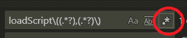
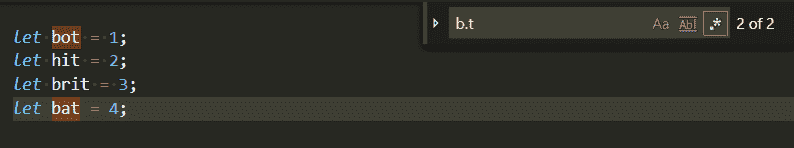
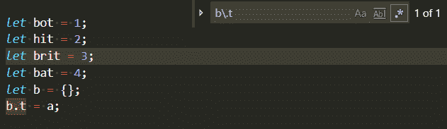
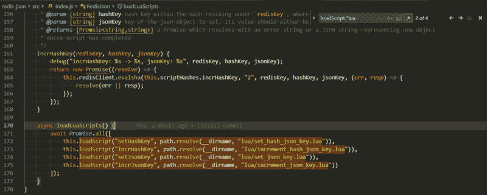
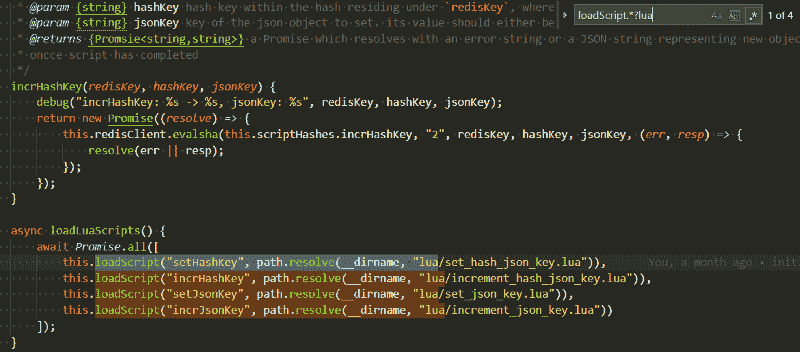
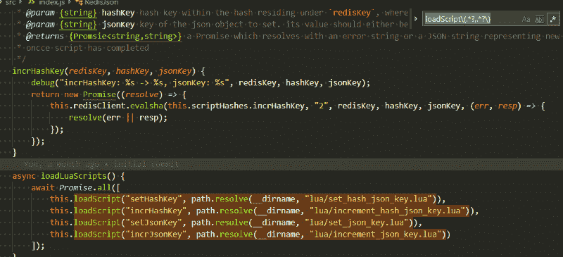
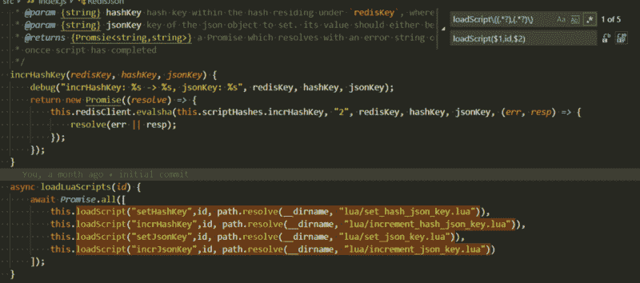
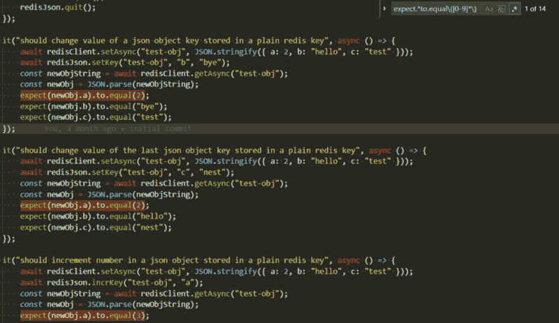

# 给初学者的简单正则表达式技巧

> 原文：<https://www.freecodecamp.org/news/simple-regex-tricks-for-beginners-3acb3fa257cb/>

一直想学习正则表达式，但被它们的复杂性所困扰？在本文中，我将向您展示五个简单易学的正则表达式技巧，您可以立即在您最喜欢的文本编辑器中使用它们。

### 文本编辑器设置

虽然现在几乎所有的文本编辑器都支持正则表达式，但是我将在本教程中使用 Visual Studio 代码，但是您可以使用任何您喜欢的编辑器。另外，请注意，您通常需要在搜索输入附近打开 RegEx。下面是如何在 VS 代码中实现这一点:



You need to enable RegEx by checking this option

### 1) `.` —匹配任何字符

让我们从简单的开始。点符号`.`匹配任何字符:

```
b.t
```



上面的正则表达式匹配`"bot”`、`"bat”`和任何其他以`b`开始并以`t`结束的三个字符的单词。但是如果您想搜索点符号，您需要用`\`对它进行转义，所以这个正则表达式将只匹配精确的文本`"b.t"`:

```
b\.t
```



### 2) .* —匹配任何内容

这里`.`的意思是*【任何字符】*`*`的意思是*“在这个符号重复任意次之前的任何东西。”*合在一起(`.*`)，它们的意思是*“任何次数的任何符号。”*例如，您可以使用它来查找以某些文本开头或结尾的匹配项。假设我们有一个带有以下签名的 javascript 方法:

```
loadScript(scriptName: string, pathToFile: string)
```

我们希望找到这个方法的所有调用，其中`pathToFile`指向文件夹`“lua”`中的任何文件。为此，您可以使用以下正则表达式:

```
loadScript.*lua
```

也就是说，*匹配从`“loadScript”`开始的所有文本，后面是最后一次出现的`“lua”`*



`loadScript.*lua: matches everything starting with "loadScript" and ending in "lua"`

### 3) ?—非贪婪匹配

`.*`后面的`?`符号和其他一些正则表达式序列意味着“尽可能少地匹配”如果你看前面的图片，你会看到文本`“lua”`在每个匹配中出现两次，直到第二个`“lua”`的所有内容都被匹配。如果您想匹配第一次出现的`"lua"`的所有内容，您可以使用下面的正则表达式:

```
loadScript.*?lua
```

这意味着，*“匹配从`"loadScript"`开始的所有内容，后面是第一次出现的`"lua"`*



`loadScript.*?lua: matches` everything starting with loadScript and up to the first occurrence of “lua”

### 4) ( ) $ —捕获组和反向引用

好了，现在我们可以匹配一些文本。但是如果我们想改变找到的部分文本呢？为此，我们经常需要使用捕获组。

假设我们改变了我们的`loadScript`方法，现在它突然需要在两个参数之间插入另一个参数。让我们将这个新参数命名为`id`，这样新的函数签名应该是这样的:`loadScript(scriptName, id, pathToFile)`。这里我们不能使用文本编辑器的普通替换特性，但是正则表达式正是我们所需要的。



loadScript\(.*?,.*?\)

上面您可以看到运行以下正则表达式的结果:

```
loadScript\(.*?,.*?\)
```

这意味着:*“匹配从`"loadScript("`开始的所有内容，然后是第一个`,`之前的所有内容，然后是第一个`)`*之前的所有内容”

对你来说，这里唯一看起来奇怪的是`\`符号。它们用于转义括号。

我们需要对符号`(`和`)`进行转义，因为它们是 RegEx 用来捕获部分匹配文本的特殊字符。但是我们需要匹配实际的括号字符。

在前面的正则表达式中，我们用符号`.*?`定义了方法调用的两个参数。让我们通过在每个参数周围添加`(`和`)`符号，使每个参数成为一个单独的**捕获组**:

```
loadScript\((.*?),(.*?)\)
```

如果您运行这个正则表达式，您会发现什么都没有改变。这是因为它匹配相同的文本。但是现在我们可以将第一个参数称为`$1`，将第二个参数称为`$2`。这被称为反向引用，它将帮助我们做我们想要做的事情:在调用中间添加另一个参数:

搜索输入:

```
loadScript\((.*?),(.*?)\)
```

这意味着与前面的正则表达式相同，但是将参数分别映射到捕获组 1 和 2。

替换输入:

```
loadScript($1,id,$2)
```

这意味着*“用文本`“loadScript(“`替换每个匹配的文本，后跟捕获组 1、`“id”`、捕获组 2 和`)`”。*注意，在替换输入中不需要转义括号。



Replacement Result

### 5) [ ] —字符类

通过在这些字符周围放置`[`和`]`符号，您可以在特定位置列出您想要匹配的字符。例如，类别`[0-9]`匹配从 0 到 9 的所有数字。也可以明确列出所有数字:`[0123456789]` —意义相同。你也可以在字母中使用破折号，`[a-z]`将匹配任何小写拉丁字符，`[A-Z]`将匹配任何大写拉丁字符，`[a-zA-Z]`将匹配两者。

您也可以在字符类后使用`*`，就像在`.`后一样，在这种情况下，它的意思是:*“匹配该类中出现的任意数量的字符”*



expect.*to.equal\([0–9]*\): Match only those lines where we expect tested variable to equal a number

### 最后一句话

你应该知道有几种正则表达式。我在这里讨论的是 javascript RegEx 引擎。大多数现代发动机是相似的，但可能有一些不同之处。通常，这些差异包括转义字符和反向引用标记。

我强烈建议你现在就打开文本编辑器，开始使用这些技巧。您将会看到，您现在可以比以前更快地完成许多重构任务。一旦你熟悉了这些技巧，[你就可以开始深入研究正则表达式了](https://www.regular-expressions.info/)。

**谢谢你把我的文章看完。如果你觉得有用，请添加掌声，并订阅更多更新。我将发表更多关于正则表达式、javascript 和一般编程的文章。**