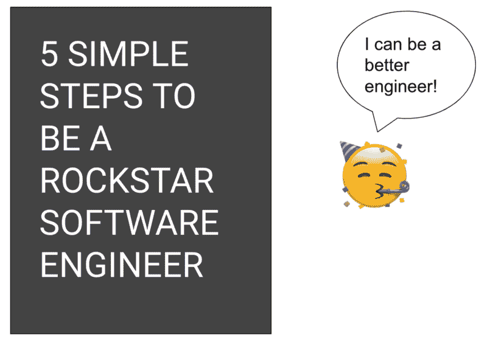

# 如何成为一名摇滚明星工程师

> 原文：<https://www.freecodecamp.org/news/how-to-become-a-rockstar-engineer-e785b09cc104/>

作者:阿智·华创

# 如何成为一名摇滚明星工程师

做一名软件工程师不是在公园里散步，但是做一名摇滚明星软件工程师，或者难以捉摸的" [10x 工程师](https://www.quora.com/topic/10X-Engineers)"更难。根据我的经验，和我一起工作过的最好的工程师都有一些共同的特点，我将在本文中提出来。

如果你想了解更多关于通过技术面试的知识，你可以在这里查看我的[课程](https://docs.google.com/document/u/1/d/1PeK69h4H82rwKjhactiE_sAIorCcZgXgXTY7k-nXpnE/edit)，我在这里指导软件工程师如何准备和应对编码面试。

(如果你想看，这里有视频版本)

### 1:建立持久的关系

摇滚明星工程师是后天培养的，不是天生的。与其他人的想法相反，仅仅有智力还不足以成为一名摇滚明星工程师。一个摇滚明星工程师能够超越他们周围的所有人，并帮助提高团队的整体生产力。

对于一个摇滚明星工程师来说，最重要的技能之一就是建立持久的关系。

建立持久的关系需要软技能——软件工程师通常不具备这种技能。我认识的大多数工程师都关心事实、细节和精确性。因此，有时他们会给人以对抗性和不愉快的印象。

然而，孤狼无法独自生存。

试着尽可能多地与你的顾客——客户、项目经理、销售代表——交谈。建立个人联系。知道他们的痛点是什么。理解他们为什么做这些事情。一旦你对你的终端用户真正关心的事情有了深刻的理解，你将能够解决表面之外的问题，并最终为团队带来 10 倍的价值。

### 2:理解“为什么”

**了解你的工作范围及其重要性**。我遇到过许多工程师，他们很难告诉我*他们为什么从事他们正在从事的工作，以及他们的工作如何融入大局。*

一个摇滚明星工程师明白他们的工作为什么重要。这将指导你学会如何区分工作的优先次序，因为你对自己的工作如何融入大局有着深刻的理解。因此，你将能够相应地对工作进行优先排序，并找出高杠杆项目。

随着你成为一名更高级的工程师，你应该理解你的工作的影响、范围以及它如何适应更大的图景。从某种意义上来说，你将成为推动和倡导这些改变的人，你需要团结其他人支持你的事业。

### 3:扩大你的范围

团队的新成员通常都有明确的工作范围。然而，你应该早点知道的是，你总是想扩大你的范围。

当你在做项目时，你应该主动思考如何改进，比如如何改进招聘流程、文档或代码风格。

我喜欢把这看作是洋葱的类比(我的一位导师教我的)。你的能力范围是洋葱的核心层，在这一层之外还有一层，由可能影响你的外部因素组成。

现在，你的核心能力和外在能力之间的*差距——*这就是不确定性和焦虑所在。随着你作为一名工程师的成长，你想要学习如何扩展你的核心能力，这样你就可以最小化这个差距。

当你积极思考如何改进事情，让事情变得更好时，那就是你成长技能的地方，不仅是作为一名工程师，也是作为一名领导者。

你今天可以尝试的一个做法是参加更多的会议。了解你的同事所关心的事情，提出你的见解和解决方案——试一试也无妨。

如果你想提高你的编码或系统设计技能，看看这里的课程[吧](http://bit.ly/interviewcourses)毕业生在这里获得了有价值的技能，帮助他们在脸书、谷歌等公司找到工作。课程有限，所以如果你有兴趣，[填写这张表格](https://forms.gle/EfqUeKAXJPz8ABnX8)，我会联系你提供更多细节！

### 4:主动提供帮助

在大多数公司里，公司里总有坏掉的东西。由于不断变化的优先级、有限的时间和资源，大多数东西仍然是坏的。

这就是你可以帮忙的地方。

首先，主动提供帮助会让你对代码库有更深的了解和接触，而这些是你可能不会学到的。

其次，主动帮助他人解决他们的问题可以让你建立人际关系(见第一条建议),从长远来看，还可以增长你的专业知识。如果你还能证明你有能力投入其中并做出持久的改进，那就更好了。

我把这些人称为热情的执行者——他们有很强的执行能力，也有强烈的热情去帮助周围的人。热情的执行者就像你邻居的蜘蛛侠——他们有超人的能力，不怕陷入最棘手的情况，也不期待任何回报。

### 5:大量阅读

阅读是任何新人能做的最有效的活动之一。许多初级工程师整天埋头写代码；他们没有真正花时间去阅读和理解他们正在做的事情。

我的建议是，如果你要加入一个新团队，花点时间去寻找和阅读**文档**、设计文档、会议记录，以及你能找到的任何你公司周围的东西。

阅读文档可以让你了解事情变成今天这个样子的背景和历史。您可以了解为什么某些组件以某种方式设计，工程师必须遵守什么要求，设计中进行了哪些权衡等等。

如果你花时间阅读，我保证你很快就会成为主题专家。

### 供进一步阅读的书籍

*   [高级软件工程师](https://amzn.to/2XUfR5F)
*   [有效的工程师](https://amzn.to/2VAWYXL)
*   [高效人士的 7 个习惯](https://amzn.to/2J7VSfJ)
*   [如何赢得朋友&影响力](https://amzn.to/2VFTx20)

检查工具？我在这里为我网站上的每一位有抱负的软件工程师推荐:z[hiachong.com/resources](http://zhiachong.com/resources)

前往[http://bit.ly/interviewcourses](https://www.youtube.com/redirect?redir_token=VyUWnpQkfsA5uouuEjr-IGN2Fvx8MTU0MDQyMTc1NkAxNTQwMzM1MzU2&v=K5z0d1DJuP4&q=http%3A%2F%2Fbit.ly%2Finterviewcourses&event=video_description)了解更多关于技术编码、系统设计等课程的信息。