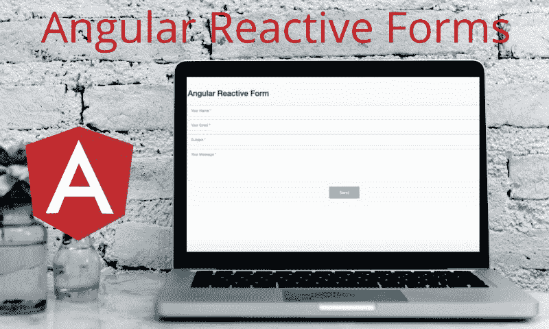

# 角反应形式导论

> 原文：<https://www.freecodecamp.org/news/angular-reactive-forms-an-introduction-f9d988ae9251/>

古尔法姆·安萨里

# 角反应形式导论



Angular 使用两种不同的方法来处理表单。第一种是模板驱动方法，另一种是反应式方法。这两种方法使用不同的技术来处理表单数据。在模板驱动的方法中，我们在 HTML 代码中定义表单结构。另一方面，在反应式方法中，表单的结构是在组件类中定义的。

与模板驱动方法相比，反应式方法更复杂，因为它可以提供许多其他功能。在本文中，我们将使用角反应方法创建一个接触形式。那么我们还在等什么呢？让我们深入研究一下。

### **如何在 Angular 中使用反应式？**

要在 Angular 中实现反应式表单，我们遵循以下步骤。

1.  在`app.module.ts`文件中导入反应式表单模块。
2.  在组件文件中创建一个`FormGroup`类的实例，并初始化所有`FormControls`的默认值。
3.  在 HTML 代码中绑定`FormGroup`和`FormConrtol`。

### 1.导入反应式模块

要在应用程序中使用反应式表单，您需要将`ReactiveFormsModule`导入到父`module.ts`文件中。这就像我们如何在`app.module.ts`文件中导入`FormsModule`来使用模板驱动表单。

```
import { AppComponent } from './app.component';
```

```
import { BrowserModule } from '@angular/platform-browser';
```

```
import { NgModule } from '@angular/core';
```

```
import { BrowserAnimationsModule } from '@angular/platform-browser/animations';
```

```
import { ReactiveFormsModule } from '@angular/forms';
```

```
@NgModule({
```

```
declarations: [AppComponent],
```

```
imports: [
```

```
 BrowserModule,
```

```
 BrowserAnimationsModule,
```

```
 ReactiveFormsModule
```

```
],
```

```
providers: [],
```

```
bootstrap: [AppComponent]
```

```
})
```

```
export class AppModule { }
```

### 2.在组件中定义表单组

我们知道，在反应式表单方法中，表单的结构是在组件文件中定义的，这个结构使用`formGroup`指令与 HTML 代码同步。因此，要创建我们的联系表单，我们首先需要在组件类中定义表单模型。

**表单控件**是反应式表单的最小构建块，它跟踪所有 HTML 输入值及其验证。

表单组是一个表单控件的集合，它将所有的 HTML 输入值组合成一个对象。

现在是时候创建我们的联系表单组件文件了。

```
import { Component, OnInit } from '@angular/core';
```

```
import { FormGroup, FormControl } from '@angular/forms';
```

```
@Component({
```

```
 selector: 'app-contact',
```

```
 templateUrl: './contact.component.html',
```

```
 styleUrls: ['./contact.component.scss']
```

```
})
```

```
export class ContactFormComponent implements OnInit {
```

```
 public contactForm: FormGroup;
```

```
 constructor() { } 
```

```
 ngOnInit() {
```

```
 this.contactForm = new FormGroup({
```

```
 'name': new FormControl(null),
```

```
 'email': new FormControl(null),
```

```
 'subject': new FormControl(null),
```

```
 'message': new FormControl(null)
```

```
 });
```

```
 }
```

```
}
```

在上面的代码中，我们从`@angular/forms`导入 FormGroup 类，并将`FormGroup`属性声明为`contactform`。

定义所有的`FormControl`并用`FormGroup`将它们分组，并将其分配给`contactForm`。

### 3.在 HTML 文件中绑定 FormControls

使用`formGroup`指令在模板中绑定我们的 FormGroup 属性。

使用`formControlName`指令连接模板中的所有 FormControls 来映射 HTML 的每个 input 元素。

我们还使用`ngSubmit`指令通过点击提交按钮来提交表单数据。

```
<form [formGroup]="contactForm" (ngSubmit)="onSubmit()">
```

```
<input type="text" name="name" placeholder="Your name"    formControlName="name">
```

```
<input type="text" name="email" placeholder="Your email" formControlName="email">
```

```
<input type="text" name="subject" placeholder="Subject" formControlName="subject">
```

```
<textarea name="message" placeholder="Your Message" formControlName="message"></textarea>
```

```
<button type="submit" class="btn btn-large">Send Message</button>
```

```
</form>
```

### 确认

您已经实现了反应式表单的基本版本。现在向上一步，在将输入值发送到数据库之前验证它们。

事实上，在将数据发送到数据库之前，我们会在后端层进行大量的验证，但是为了让我们的应用程序更快，我们也会在客户端引入一些验证。角反应式模块非常有效地完成了这一验证工作。因此，让我们在将输入发送到数据库之前验证它们。

要在表单中添加验证器，我们需要从`@angular/form.`导入`Validators`类，并在创建新的 FormControl 对象时添加验证器。

FormControl 类构造函数接受 3 个参数。

1.  输入的默认值
2.  验证器或验证器数组
3.  异步验证器

对于表单验证，我们使用 FormControl 类构造函数的第二个参数。

```
this.contactForm = new FormGroup({
```

```
 'name': new FormControl(Enter Name, Validators.required),
```

```
 'email': new FormControl(null, [Validators.email,           Validators.pattern('[a-z0-9.@]*')]),
```

```
 'subject': new FormControl(null, Validators.minLength(10)),
```

```
 'message': new FormControl(null, Validators.required)
```

```
});
```

您可以通过将验证器添加到验证器数组中来添加更多的验证器。

### 自定义验证程序

FormControl 类为您提供了许多内置的验证器函数，涵盖了您的许多用例。但是如果您想为您的输入值添加一些自定义检查，那么您可以使用您自己的验证器函数轻松地做到这一点。

创建 FormControl 对象时，可以传递自定义验证器函数和内置验证器。

```
export class ContactFormComponent implements OnInit {
```

```
 public contactForm: FormGroup;  public forbiddenUserNames = ['Mack', 'John'];
```

```
 constructor() { }
```

```
 ngOnInit() {
```

```
 this.contactForm = new FormGroup({
```

```
 'name': new FormControl(Enter Name, [Validators.required, this.forbiddenNames.bind(this)]),
```

```
 'email': new FormControl(null, [Validators.email,           Validators.pattern('[a-z0-9.@]*')]),
```

```
 'subject': new FormControl(null, Validators.minLength(10)),
```

```
 'message': new FormControl(null, Validators.required)
```

```
 });
```

```
 }
```

```
public forbiddenNames(formControl: FormControl): any {   if ( this.forbiddenUserNames.indexOf(formControl.value)){     return { 'nameForbidden': true };    }   }}
```

在上面的代码中，我们创建了自定义的验证器函数，它检查用户名是否有效。`forbiddenNames`函数接受 FormControl 类型的参数，并检查输入名称是否出现在`forbiddenUserNames`数组中。

### 异步验证器

顾名思义，验证是以异步方式完成的。当输入验证器的结果需要一些时间来验证输入值时，我们使用异步验证器。

让我们创建一个验证器函数，它在 1 秒钟后做出响应，并返回输入的状态，无论输入是否有效。对于异步验证器，我们必须返回一个承诺或一个可观察对象来代替返回一个对象。

```
export class ContactFormComponent implements OnInit {
```

```
 public contactForm: FormGroup;  public forbiddenUserNames = ['Mack', 'John'];
```

```
 constructor() { }
```

```
 ngOnInit() {
```

```
 this.contactForm = new FormGroup({
```

```
 'name': new FormControl(Enter Name, [Validators.required, this.forbiddenNames.bind(this)]),
```

```
 'email': new FormControl(null, [Validators.email,           Validators.pattern('[a-z0-9.@]*')], this.forbiddenEmail),
```

```
 'subject': new FormControl(null, Validators.minLength(10)),
```

```
 'message': new FormControl(null, Validators.required)
```

```
 });
```

```
}
```

```
public forbiddenNames(formControl: FormControl): any {   if ( this.forbiddenUserNames.indexOf(formControl.value)){       return { 'nameForbidden': true };    } else {      retunr null;    }
```

```
 }
```

```
public forbiddenEmail(formControl: FormControl): Promise<any> {   return new Promise((resolve, reject)=>{     setTimeout(()=>{       if (formControl.value === 'abc@gmail.com'){         resolve({ 'emailForbidden': true });       } else {        resolve(null);       }
```

```
 }, 1000);
```

```
 });  }}
```

我们必须将新创建的异步验证器函数传递给`FormControl`对象的第三个参数。我们可以像传递普通验证器一样传递单个异步验证器或异步验证器数组。

### 形式阵列

所以到目前为止，我们已经为每个输入创建了`FormControl`。但是如果用户有权添加他们的表单控件呢？`FormArray`是从`@angular/core`导入的一个类，用于创建动态表单控件。

让我们用一个额外的输入爱好来更新我们的联系表单，这个输入将由用户创建。

```
ngOnInit() {  this.contactForm = new FormGroup({
```

```
 'name': new FormControl(Enter Name, [Validators.required, this.forbiddenNames.bind(this)]),
```

```
 'email': new FormControl(null, [Validators.email,           Validators.pattern('[a-z0-9.@]*')], this.forbiddenEmail),
```

```
 'subject': new FormControl(null, Validators.minLength(10)),
```

```
 'message': new FormControl(null, Validators.required),    'hobbies': new FormArray([])
```

```
 });}
```

```
public addHobby() {  (<FormArray>this.contactForm.get('hobbies')).push(new FormControl(null));}
```

在上面的代码中，每当用户点击`Add Hobby`按钮时，就会执行`addHobby`功能。该函数将把新的 FormControl 推入到 FormArray 中。现在将兴趣爱好与我们的模板绑定。

```
<div formArrayName="hobbies">  <button type="button">Add Hobby</button>  <div *ngFor="let hobbyControl of this.contactForm.get('hobbies');  let i=index">    <input type="text" [formControlName"]="i">  </div></div>
```

在上面的代码中，我们使用`formArrayName`指令来绑定 FormArray，就像使用`formControlName`来绑定 FormControls 一样。

我希望这篇文章回答了你关于角反应形式的大部分问题。如果你有任何疑问，欢迎在评论框中联系我。