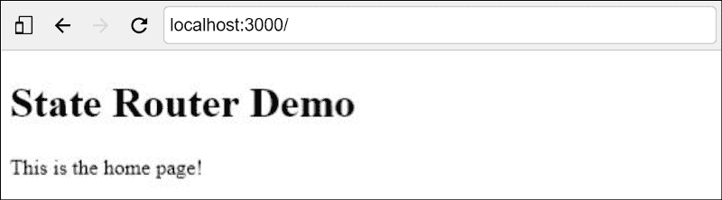
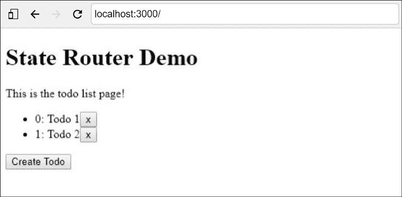
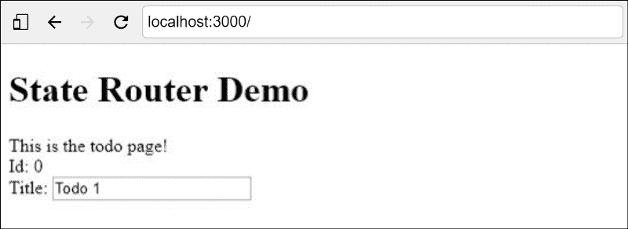
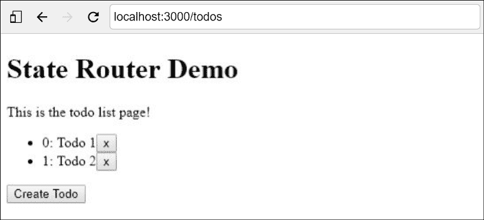
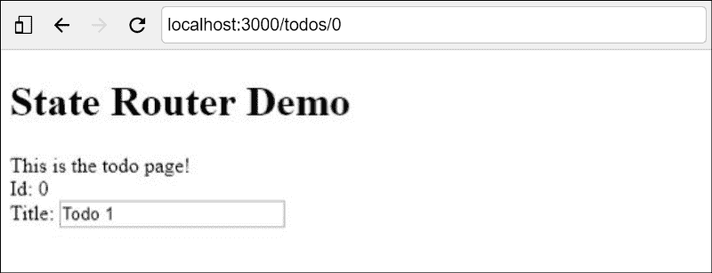
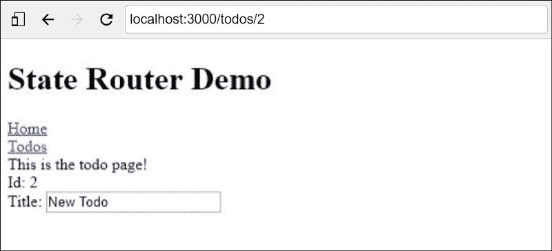

# 如何使用 React 和 MobX 状态树构建基于状态的路由器

> 原文：<https://www.freecodecamp.org/news/how-to-build-a-state-based-router-using-react-and-mobx-state-tree-e91b2b8e8d79/>

由英里到

# **如何使用 React 和 MobX 状态树构建基于状态的路由器**

**介绍 [mobx 状态树路由器](https://github.com/miles-till/mobx-state-tree-router)**


Image by [medithIT](https://www.flickr.com/photos/medithit/) on [Flickr](https://www.flickr.com/photos/medithit/10363854753/)

如果你想跳到完成的例子，你可以在[mobx-state-tree-router-demo](https://github.com/miles-till/mobx-state-tree-router-demo)查看。

我写了一个库，使得在 MobX 状态树驱动的 React 应用程序中配置基于状态的路由变得很容易，我想与你分享它。为此，我将演示如何构建一个非常简单的 To do 应用程序。

[MobX 的创始人 Michel Weststrate](https://www.freecodecamp.org/news/how-to-build-a-state-based-router-using-react-and-mobx-state-tree-e91b2b8e8d79/undefined) 写了一篇很棒的文章，题目是[如何解耦状态和 UI(又名你不需要 componentWillMount)](https://hackernoon.com/how-to-decouple-state-and-ui-a-k-a-you-dont-need-componentwillmount-cc90b787aa37) 。我推荐阅读它来理解启发我写 mobx-state-tree-router 的哲学。关键思想是应用程序 UI 应该是状态的函数。

> 这种方法可以更好地分离状态和用户界面。这有几个优点:

> 1.无需实例化组件就可以测试完整的应用程序流。

> 2.更多的组件可以是哑的；他们不必获取数据或处理路由。

> 3.我们的存储变得更像一个状态机，使得跟踪应用程序的转换变得容易。"

> 米歇尔·韦斯特斯特雷特

### 先决条件

按照本教程，需要安装这些组件:

*   [Node.js](https://nodejs.org/en/) —用于运行开发服务器
*   [纱线](https://yarnpkg.com/en/) —用于包装管理

*注意:NPM 可以用来代替纱线，但有些命令可能不同。*

### 创建一个基本的 React 应用程序

#### 使用 create-react-app 快速入门

如果你以前没有使用过 React 应用程序，最简单的入门方法是使用 React 开发人员开发的一个名为 [Create React App](https://github.com/facebook/create-react-app) 的脚手架工具。该工具为您配置 [Webpack](https://webpack.js.org/) 和 [Babel](https://babeljs.io/) ，满足最常见的需求。

在您的终端中运行以下命令:

```
npx create-react-app state-router-democd state-router-demoyarn start
```

现在，您将拥有一个全功能的基本 React 应用程序。

#### 删除本例中不需要的 create-react-app 内容

出于本教程的目的，我们不需要 create-react-app 生成的很多东西，所以继续删除:

```
src/App.csssrc/App.test.jssrc/index.csssrc/logo.svgsrc/serviceWorker.js
```

注意:请随意保留 css 文件并添加您自己的样式。

为了保持有序，在我们的`src`中创建一个`components`目录，并将`src/App.js`移动到`src/components/App.js`。

现在更新以下文件以删除对我们删除的文件的引用:

**src/components/App.js**

**src/index.js**

如果您仍在运行该应用程序，您会注意到您的浏览器已更新为显示以下内容:


#### 创建主页组件

在`components`目录中，为我们的主页组件创建一个文件:

**src/components/Home.js**

更新应用程序组件以呈现我们的新主页组件:

**src/components/App.js**



### 添加 MobX 状态树模型

#### 安装 MobX 和 MobX 状态树

MobX 是一个用于状态管理的库，作为我们的渲染器，它与 React 配合得非常好。 [MobX 状态树](https://github.com/mobxjs/mobx-state-tree)是构建在 MobX 之上的树形状态容器。

在您的终端运行中:

```
yarn add mobx mobx-react mobx-state-tree
```

就像我们对组件所做的一样，创建一个`models`目录来组织我们的 MobX 状态树模型。

#### 创建 RootStore 模型

在我们的状态树中，我们将有一个`RootStore`来保存我们的数据存储(在本例中是一个`TodoStore`)和我们的`RouterStore`，但是我们将稍后再讨论。

**src/models/RootStore.js**

#### 创建 TodoStore 和 Todo 模型

我们的`TodoStore`包含能够被创建、删除和更新的`Todo`对象。我们还需要能够通过`id`找到一个`Todo`对象。

**src/models/TodoStore.js**

#### 初始化根存储

当我们的应用程序加载时，我们希望用一个已知的状态初始化`RootStore`。对于这个简单的例子，我们不会关心以任何方式将数据保存到存储中。然后我们想确保`RootStore`可以被注入到我们的组件中，所以我们使用 MobX React 组件`Provider`来做这件事。

**src/index.js**

#### 创建一个 TodoList 页面组件

现在我们的状态树有了一个`RootStore`，我们需要一些组件来查看和更改数据。

**src/components/todolist . js**

更新`App`组件以显示我们新的`TodoList`组件。

**src/components/App.js**

此时，应用程序应该有一个可以添加和删除的`Todo`对象列表。



#### 创建待办事项页面组件

现在我们想创建一个新组件来显示和编辑一个`Todo`对象。注意，我们使用`inject`来使`RootStore`在组件的道具中可用。

**src/components/Todo.js**

更新`App`组件以显示我们新的`Todo`组件。

现在，我们更新的应用程序允许我们编辑`Todo`的数据，我们将其 id 传递给`<Todo todoId={0}` / >中的 Todo 页面组件。



### 添加基于状态的路由

此时，我们应该有一个 React 应用程序，其数据存储在一个 MobX 状态树容器中。然后，数据容器被注入到需要访问数据的组件中。现在，我们希望将应用程序中的页面组件连接在一起。常见的方法是使用基于组件的路由器，如 [React 路由器](https://github.com/ReactTraining/react-router)。组件通常会因为路由定义和挂载事件处理程序而变得混乱。这不符合我们国家第一的理念。

我现在将向您展示如何将 mobx-state-tree-router 添加到您的应用程序中。

#### 安装 mobx 状态树路由器

在您的终端运行中:

```
yarn add mobx-state-tree-router
```

#### 将路由器添加到根存储

**src/models/RootStore.js**

#### 创建视图

路由器需要配置一个视图模型图，它定义了要匹配的路由路径和要显示的页面组件。可以在视图上定义页面更改周期的挂钩，以执行数据提取、路由更改取消、重定向和其他任务。这些挂钩可以是同步的，也可以是异步的。

这些挂钩是:

*   `beforeExit(self, params)`
*   `beforeEnter(self, params)`
*   `onExit(self, params)`
*   `onEnter(self, params)`

如果任何一个前挂钩返回`false`,路线变更将被取消。

创建一个`views`文件:

**src/views.js**

#### 当我们的应用程序启动时初始化路由器

可以通过调用`startRouter(router)`来启动路由器。此功能将路由器连接到浏览器的历史记录，并根据路由器的视图配置路由。

**src/index.js**

#### 渲染状态路由器

更新`App`组件以包含`StateRouter`组件，这将为路由器的当前视图呈现适当的组件。

**src/components/App.js**

现在我们的应用程序将响应 url 路径的变化，例如`/todos`将显示我们的`TodoList`组件，而`/todos/0`将显示我们在`views.js`配置的`Todo`组件。



#### 添加导航链接

目前，我们的应用程序除了直接更改 url 之外，没有其他导航方式。在这个简单的例子中，这不是特别好，因为每次页面加载时，`RootStore`中的数据将被重置为`index.js`中定义的初始状态。

使用 mobx-state-tree-router 还有两种方法可以改变路由:

*   `Link`组件
*   直接调用`router.setView(view, params)`

我建议尽可能使用`Link`组件，但是在某些情况下(比如重定向),直接设置视图可能是不可避免的。让我们更新我们的`App`和`TodoList`组件，使用这两种方法添加一些导航链接:

**src/components/App.js**

**src/components/todolist . js**

您现在可以在`todos`视图中添加一个`Todo`项目，然后点击打开按钮进入新项目的`todo`视图:



### 结论

我创建了 mobx-state-tree-router，因为我发现在基于状态的路由库和 mobx 状态树的使用方面存在差距。我发现它对我很有用，所以我希望它也能对更广泛的社区有用。

如果您还没有，请阅读 Michel Weststrate 的文章以了解基于状态的路由的一些背景知识。

如果您有任何问题或贡献，请前往 Github 上的 [mobx-state-tree-router。](https://github.com/miles-till/mobx-state-tree-router)