# 重新引入 React:自 v16 以来的每一次 React 更新都不再神秘。

> 原文：<https://www.freecodecamp.org/news/reintroducing-react-every-react-update-since-v16-demystified-60686ee292cc/>

在这篇文章(和配套的书)中，与你以前可能遇到的任何文章不同，我将提供关于自 v16+以来的每一次 React 更新的有趣、真实和严肃的连环漫画。不管是有意的还是无意的，这将是非常有趣的，对初学者和专业人士来说都很容易，并且从整体上来说非常有启发性。

#### 为什么是连环漫画？

我写软件已经超过 5 年了。但我也做过其他事情。我是一名图形设计师，一名出版作家，一名教师，很久很久以前，我还是一名业余插画师。

我喜欢技术社区，但有时作为一个群体，我们往往有点狭隘。

当人们试图教授新的技术概念时，他们忘记了自己在成为开发人员之前是谁，只是粗制滥造出许多技术术语——就像他们见过的其他开发人员一样。

当你开始了解人们时，你会发现我们很多人都有不同的背景！“如果你是喜剧演员，为什么不用一些喜剧来解释技术概念呢？

那不是很酷吗？

我想展示作为工程师，作为团队，作为社区，我们如何变得更好，通过公开地做我们完整的，怪异的自我，并以所有这些个性教导他人。但我不想只是说说，而是想让它值得注意，并以身作则。所以，欢迎你来看我的漫画灵感之作，它讲述了自 16 版以来 React 的每一次更新。

随着最近发布的 v16.8 特性，将会有大量信息丰富的连环漫画推出！

灵感来自[Jani evkallio](https://twitter.com/jevakallio?lang=en)。

> 这是一本非常有趣但很长的读物。请下载电子书 (PDF，Epub & Mobi) **绝对免费**——不必与我分享你的电子邮件。如果你想支持我的工作，你也可以为这本书付任何你想要的钱。

#### 如何阅读这篇文章

首先，[获取电子书](https://leanpub.com/reintroducing-react)。除了可以离线阅读之外，电子书的语法高亮代码也使它们更容易阅读。[去拿](https://leanpub.com/reintroducing-react)。

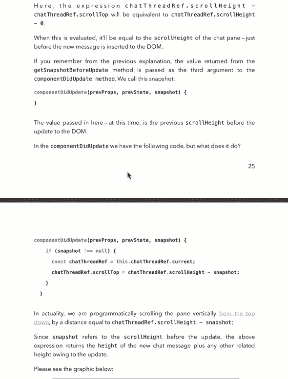

[https://leanpub.com/reintroducing-react](https://leanpub.com/reintroducing-react)

其次，请在 Github 上找到该书的关联[代码库](https://github.com/ohansemmanuel/Reintroducing-react)。这将有助于您跟随示例进行更多的实践。

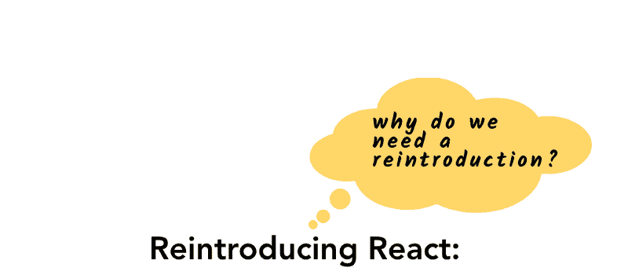

#### 为什么重新引入 React？

我在 3 到 4 年前编写了第一个 React 应用程序。从那时到现在，React 的基本原则保持不变。React 现在和过去一样是声明性的和基于组件的。

这是个好消息，然而，我们今天编写 React 应用程序的方式已经改变了！

有很多新的补充(以及删除)。

如果你不久前学过 React，你不可能没有跟上每一个新特性/版本。也有可能迷失在所有的新功能中。你到底从哪里开始？它们对您的日常使用有多重要？

即使作为一名经验丰富的工程师，我有时也会发现放弃旧的概念并重新学习新的概念就像从头开始学习一个新概念一样令人生畏。

如果你是这种情况，我希望我能通过这个指南为你提供正确的帮助。

如果你刚刚开始学习反应，这同样适用。

那里有很多国家信息。如果您使用一些旧资源学习 React，是的，您将学习 React 的基础知识，但是现代 React 有一些有趣的新特性值得您关注。最好现在就知道这些，而不必抛弃和重新学习更新的概念。

无论你已经编写 React 有一段时间了，还是开发 React 应用程序的新手，我都会讨论从版本 16 开始 React 的每一次更新。

这将使你与最近的变化保持同步反应，并帮助你写出更好的软件。

记住，重新介绍 React 不仅对初学者很重要，对专业人士也一样。这完全取决于你有多贴近现实，并真正研究了过去 12 个月中发布的许多变化。

好的一面是，我将为您带来所有变更的一站式参考。

在这本书里，我将带你踏上一段旅程——伴随着一些幽默和独特的内容。

准备好了吗？

#### 16 版以来有什么变化？

如果你认为变化不大，那就再想一想。

以下是我们将在本指南中讨论的相关变更列表:

*   新的生命周期方法。
*   使用上下文 API 简化状态管理。
*   ContextType —在没有消费者的情况下使用上下文。
*   使用图表和交互。
*   用 React 进行惰性加载。慵懒又悬疑。
*   带有 React.memo 的功能性 PureComponent
*   用钩子简化 React 应用！
*   **带钩子的高级 React 组件模式**。

不言而喻，从版本 16 开始已经引入了很多。为方便起见，这些主题都被分成了单独的部分。

在下一节中，我将通过查看版本 16 中可用的新生命周期方法来开始讨论这些变化。

### 第 1 章:新的生命周期方法。

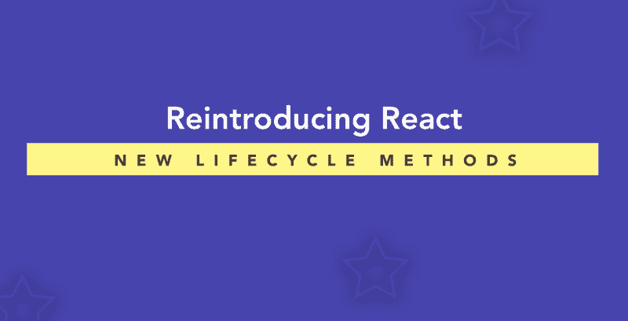

他写软件已经有一段时间了，但对 React 生态系统来说还是新手。

见见约翰。

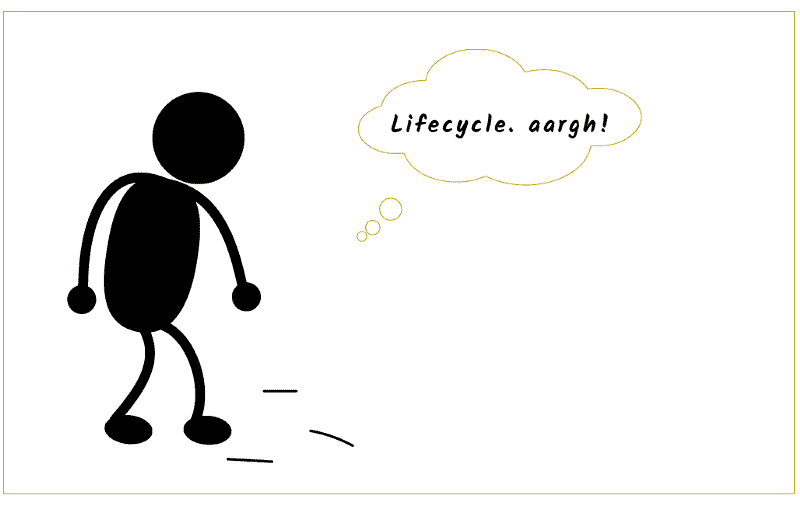

很长一段时间，他都没有完全理解生命周期在 React 应用程序中的真正含义。

当您想到生命周期时，会想到什么？

#### 生命周期到底是什么？

好吧，想想人类。

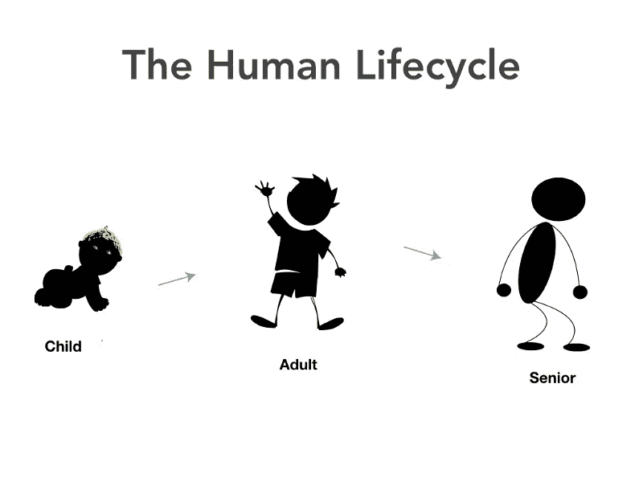

人类典型的生命周期是这样的，“儿童”到“成人”再到“老年人”。

在生物学意义上，生命周期是指一个有机体经历的一系列“形态变化”。

这同样适用于 React 组件。它们经历了一系列的“形态变化”。

下面是 React 组件的简单图形表示。

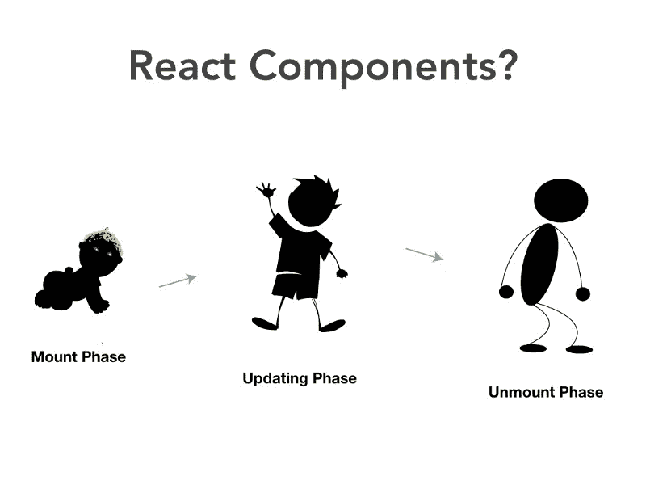

React 组件的四个基本阶段或生命周期包括:

*   **Mounting** —就像一个孩子的出生，在这个阶段组件被创建(你的代码，和 react 的内部)，然后被插入到 DOM 中
*   **更新** —与人类“成长”一样，在此阶段，React 组件通过道具或状态的变化进行更新，从而经历成长。
*   **卸载** —就像人的死亡一样，这是组件从 DOM 中移除的阶段。
*   **错误处理** —把这想象成人类生病去看医生。有时你的代码不能运行，或者某处有错误。发生这种情况时，组件处于错误处理阶段。在前面的插图中，我有意跳过了这个阶段。

#### 生命周期方法。

现在你明白了什么是生命周期，什么是“生命周期方法”？

了解 React 组件经历的阶段/生命周期是等式的一部分。另一部分是理解 React 在每个阶段提供(或调用)的方法。

在组件的不同阶段/生命周期中调用的方法就是通常所说的组件生命周期方法，例如在安装和更新阶段，总是调用`render`生命周期方法。

组件的所有 4 个阶段都有可用的生命周期方法—安装、更新、卸载和错误处理。

知道生命周期方法何时被调用(即相关的生命周期/阶段)意味着您可以继续在方法中编写相关的逻辑，并知道它将在正确的时间被调用。

基础知识说完了，让我们来看看 16 版中实际可用的新生命周期方法。

#### 静态 getDerivedStateFromProps。

在解释这个生命周期方法如何工作之前，让我向您展示如何使用这个方法。

基本结构是这样的:

```
const MyComponent extends React.Component {  ... 
```

```
 static getDerivedStateFromProps() {     //do stuff here  }  }
```

该方法接受`props`和`state`:

```
... 
```

```
 static getDerivedStateFromProps(props, state) {	//do stuff here  } 
```

```
...
```

您可以返回一个对象来更新组件的状态:

```
... 
```

```
 static getDerivedStateFromProps(props, state) {      return {     	points: 200 // update state with this     }  } 
```

```
 ...
```

或者返回 null 不进行更新:

```
... 
```

```
 static getDerivedStateFromProps(props, state) {    return null  } 
```

```
...
```

我知道你在想什么。这种生命周期方法到底为什么重要？

嗯，这是很少使用的生命周期方法之一，但在某些情况下它会派上用场。

首先，这个方法在组件在初始挂载时呈现到 DOM 之前被调用(或调用)**。**

下面是一个简单的例子。

考虑一个呈现足球队得分的简单组件。

如您所料，点数存储在组件状态对象中:

```
class App extends Component {  state = {    points: 10  }  render() {    return (      <div className="App">        <header className="App-header">                    <p>            You've scored {this.state.points} points.          </p>        </header>      </div>    );  }}
```


请注意，文本显示，*您已经获得了 10 分* —其中 10 是状态对象中的点数。

只是举个例子，如果你放入如下所示的静态 getDerivedStateFromProps 方法，会渲染多少个点？

```
class App extends Component {  state = {    points: 10  }	  // *******  //  NB: Not the recommended way to use this method. Just an example. Unconditionally overriding state here is generally considered a bad idea  // ********  static getDerivedStateFromProps(props, state) {    return {      points: 1000    }  }  render() {    return (      <div className="App">        <header className="App-header">                    <p>            You've scored {this.state.points} points.          </p>        </header>      </div>    );  }}
```

现在，我们有静态的 getDerivedStateFromProps 组件生命周期方法。如果您还记得前面的解释，这个方法是在组件挂载到 DOM 之前调用的。通过返回一个对象，我们甚至在组件呈现之前就更新了它的状态。

这是我们得到的结果:


1000 来自于在`static getDerivedStateFromProps`方法中更新状态。

这个例子是人为设计的，并不是你使用`static getDerivedStateFromProps`方法的方式。我只是想确保你先了解基本知识。

使用这种生命周期方法，仅仅因为您可以更新状态并不意味着您应该继续这样做。`static getDerivedStateFromProps`方法有特定的用例，否则你会用错误的工具解决问题。

那么什么时候应该使用`static getDerivedStateFromProps`生命周期方法呢？

方法名`getDerivedStateFromProps`由五个不同的单词组成，“从 Props 获得派生状态”。


此外，这种方式的组件状态被称为派生状态。

根据经验，派生状态应该谨慎使用，因为如果你不确定自己在做什么，你可能会将[微妙的错误](https://reactjs.org/blog/2018/06/07/you-probably-dont-need-derived-state.html#common-bugs-when-using-derived-state)引入到你的应用程序中。

#### getSnapshotBeforeUpdate。

在更新组件阶段，在调用 render 方法之后，接下来调用`getSnapshotBeforeUpdate`生命周期方法。

这个有点复杂，但我会慢慢解释它是如何工作的。

您可能不会总是使用这种生命周期方法，但在某些特殊情况下，它可能会派上用场。特别是当您需要在更新完成后从 DOM 获取一些信息(并可能更改它)时。

重要的是。从`getSnapshotBeforeUpdate`中的 DOM 查询的值将引用 DOM 更新前的值。即使之前调用了 render 方法。

一个可能有帮助的类比是关于你如何使用版本控制系统，比如 git。

一个基本的例子是，您编写代码，并在提交给回购之前准备好您的更改。

在这种情况下，假设在实际推送到 DOM 之前调用了 render 函数来暂存您的更改。因此，在实际的 DOM 更新之前，从 getSnapshotBeforeUpdate 检索的信息指的是实际的可视 DOM 更新之前的信息。

对 DOM 的实际更新可能是异步的，但是在 DOM 更新之前总是会调用`getSnapshotBeforeUpdate`生命周期方法。

如果你还没有得到它，不要担心。我给你举个例子。


聊天窗格的实现和您想象的一样简单。在`App`组件中是一个无序列表，带有一个`Chats`组件:

```
<ul className="chat-thread">    <Chats chatList={this.state.chatList} /> </ul>
```

组件呈现聊天列表，为此，它需要一个聊天列表属性。这基本上是一个数组。在本例中，一个由 3 个字符串值组成的数组，“嘿”、“你好”、“嗨”。

组件有一个简单的实现，如下所示:

```
class Chats extends Component {  render() {    return (      <React.Fragment>        {this.props.chatList.map((chat, i) => (          <li key={i} className="chat-bubble">            {chat}          </li>        ))}      </React.Fragment>    );  }}
```

它只是通过`chatList` prop 映射并呈现一个列表项，该列表项又被设计成看起来像一个聊天气泡:)。

不过，还有一件事。聊天窗格标题中有一个“添加聊天”按钮。


点击此按钮将在显示的消息列表中添加新的聊天文本“Hello”。

这就是实际情况:


Adding new chat messages

与大多数聊天应用程序一样，这里的问题是每当聊天消息的数量超过聊天窗口的可用高度时，预期的行为是自动向下滚动聊天窗格，以便可以看到最新的聊天消息。现在不是这样的。


I have to scroll manually to find the most recent message

让我们看看如何使用 getSnapshotBeforeUpdate 生命周期方法来解决这个问题。

`getSnapshotBeforeUpdate`生命周期方法的工作方式是，当它被调用时，它将前面的属性和状态作为参数传递给它。

所以我们可以使用如下所示的`prevProps`和`prevState`参数:

```
getSnapshotBeforeUpdate(prevProps, prevState) {   }
```

在这个方法中，您应该返回一个值或 null:

```
getSnapshotBeforeUpdate(prevProps, prevState) {   return value || null // where 'value' is a  valid JavaScript value    }
```

这里返回的任何值都会被传递给另一个生命周期方法。你很快就会明白我的意思。

生命周期方法本身并不起作用。它旨在与`componentDidUpdate`生命周期方法结合使用。

无论从`getSnapshotBeforeUpdate`生命周期方法返回什么值，都作为第三个参数传递给`componentDidUpdate`方法。

让我们调用`getSnapshotBeforeUpdate`、*快照*的返回值，下面是我们之后得到的结果:

```
componentDidUpdate(prevProps, prevState, snapshot) { }
```

在调用`getSnapshotBeforeUpdate`之后，调用`componentDidUpdate`生命周期方法。与 getSnapshotBeforeUpdate 方法一样，它接收前面的属性和状态作为参数。它还接收来自`getSnapshotBeforeUpdate`的返回值作为最终参数。

下面是在聊天窗格中保持滚动位置所需的所有代码:

```
getSnapshotBeforeUpdate(prevProps, prevState) {    if (this.state.chatList > prevState.chatList) {      const chatThreadRef = this.chatThreadRef.current;      return chatThreadRef.scrollHeight - chatThreadRef.scrollTop;    }    return null;  }  componentDidUpdate(prevProps, prevState, snapshot) {    if (snapshot !== null) {      const chatThreadRef = this.chatThreadRef.current;      chatThreadRef.scrollTop = chatThreadRef.scrollHeight - snapshot;    }  }
```

让我解释一下那里发生了什么。

下面是聊天窗口:


The full chat window

但是，下图突出显示了保存聊天消息的实际区域(无序列表，`ul`包含消息)。

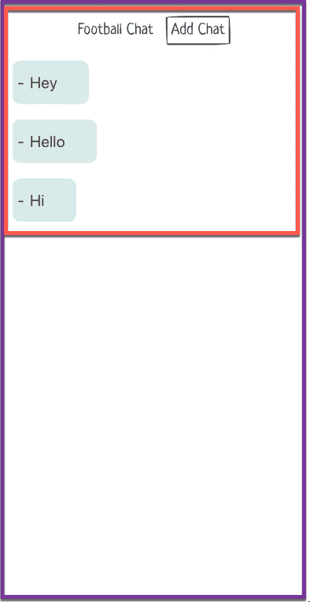

The actual region holding the chat messages

正是这个`ul`我们引用了 React Ref:

```
<ul className="chat-thread" ref={this.chatThreadRef}>   ...</ul>
```

首先，因为`getSnapshotBeforeUpdate`可能通过任意数量的 props 或者甚至是状态更新而被触发，所以我们在一个条件中包装代码来检查是否确实有新的聊天消息:

```
getSnapshotBeforeUpdate(prevProps, prevState) {    if (this.state.chatList > prevState.chatList) {      // write logic here    }  }
```

上面的`getSnapshotBeforeUpdate`方法必须返回一个值。如果没有添加聊天消息，我们将只返回`null`:

```
getSnapshotBeforeUpdate(prevProps, prevState) {    if (this.state.chatList > prevState.chatList) {      // write logic here    }      return null }
```

现在考虑一下`getSnapshotBeforeUpdate`方法的完整代码:

```
getSnapshotBeforeUpdate(prevProps, prevState) {    if (this.state.chatList > prevState.chatList) {      const chatThreadRef = this.chatThreadRef.current;      return chatThreadRef.scrollHeight - chatThreadRef.scrollTop;    }    return null;  }
```

这对你有意义吗？

我想还没有。

首先，考虑所有聊天消息的整体高度不超过聊天窗格高度的情况。

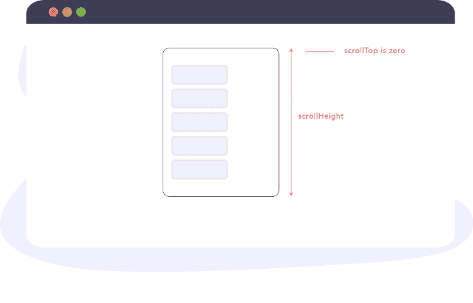

这里，表达式`chatThreadRef.scrollHeight - chatThreadRef.scrollTop`将等同于`chatThreadRef.scrollHeight - 0`。

当对其进行评估时，它将等于聊天窗格的`scrollHeight`——就在新消息被插入 DOM 之前。

如果您还记得前面的解释，从`getSnapshotBeforeUpdate`方法返回的值作为第三个参数传递给`componentDidUpdate method`。我们称这个快照为:

```
componentDidUpdate(prevProps, prevState, snapshot) {}
```

这里传入的值是 DOM 更新之前的前一个`scrollHeight`。

在`componentDidUpdate`中我们有下面的代码，但是它做什么呢？

```
componentDidUpdate(prevProps, prevState, snapshot) {    if (snapshot !== null) {      const chatThreadRef = this.chatThreadRef.current;      chatThreadRef.scrollTop = chatThreadRef.scrollHeight - snapshot;    }  }
```

实际上，我们是通过编程从上往下垂直滚动窗格，距离等于`chatThreadRef.scrollHeight - snapshot`；

由于`snapshot`指的是更新前的`scrollHeight`，所以上面的表达式返回新聊天消息的`height`加上由于更新而导致的任何其他相关高度。

请参见下图:

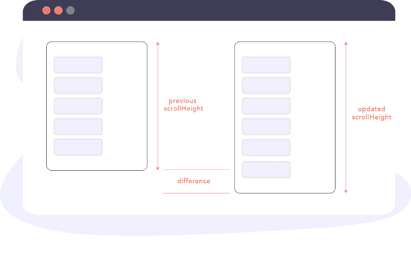

当整个聊天窗格的高度被消息占据时(并且已经向上滚动了一点)，由`getSnapshotBeforeUpdate`方法返回的`snapshot`值将等于聊天窗格的实际高度。

从`componentDidUpdate`开始的计算将把`scrollTop`值设置为额外消息高度的总和——这正是我们想要的。

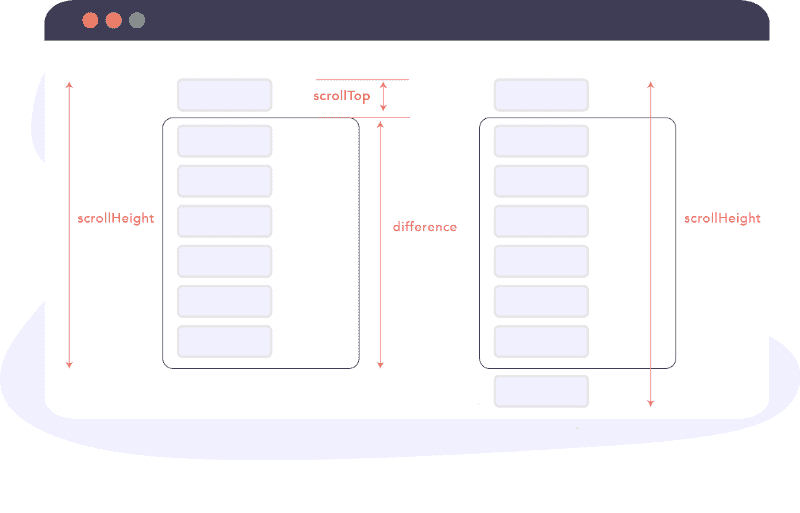

对，就是这样。

如果您遇到了困难，我确信仔细阅读解释(再一次)或检查源代码将有助于澄清您的问题。

#### 错误处理生命周期方法。

有时事情变糟，会抛出错误。当一个错误被一个后代组件抛出时，错误生命周期方法被调用。

让我们实现一个简单的组件来捕捉演示应用程序中的错误。为此，我们将创建一个名为`ErrorBoundary`的新组件。

下面是最基本的实现:

```
import React, { Component } from 'react';class ErrorBoundary extends Component {  state = {};  render() {    return null;  }}export default ErrorBoundary;
```

现在，让我们合并错误生命周期方法。

#### static getDerivedStateFromError.

每当在子代组件中引发错误时，首先调用此方法，引发的错误作为参数传递。

从该方法返回的任何值都用于更新组件的状态。

让我们更新`ErrorBoundary`组件来使用这个生命周期方法。

```
import React, { Component } from "react";
```

```
class ErrorBoundary extends Component {  state = {};
```

```
 static getDerivedStateFromError(error) {    console.log(`Error log from getDerivedStateFromError: ${error}`);    return { hasError: true };  }
```

```
 render() {    return null;  }}
```

```
export default ErrorBoundary;
```

现在，每当在一个后代组件中抛出一个错误，这个错误就会被记录到控制台，`console.error(error`，并且从`getDerivedStateFromError`方法返回一个对象。这将用于更新错误边界组件的状态，即使用`hasError: true`。

#### componentDidCatch。

在抛出后代组件中的错误后，也会调用`componentDidCatch`方法。除了抛出的错误之外，还向它传递了一个参数，该参数表示有关错误的更多信息:

```
componentDidCatch(error, info) {}
```

在这个方法中，您可以将收到的`error`或`info`发送到外部日志服务。与`getDerivedStateFromError`不同，`componentDidCatch`考虑到了副作用:

```
componentDidCatch(error, info) {	logToExternalService(error, info) // this is allowed.         //Where logToExternalService may make an API call.}
```

让我们更新`ErrorBoundary`组件来使用这个生命周期方法:

```
import React, { Component } from "react";
```

```
class ErrorBoundary extends Component {  state = { hasError: false };  static getDerivedStateFromError(error) {    console.log(`Error log from getDerivedStateFromError: ${error}`);    return { hasError: true };  }  componentDidCatch(error, info) {    console.log(`Error log from componentDidCatch: ${error}`);    console.log(info);  }  render() {    return null  }}export default ErrorBoundary;
```

此外，由于`ErrorBoundary`只能捕捉来自后代组件的错误，我们将让组件呈现作为`Children`传递的任何内容，或者在出错时呈现默认的错误 UI:

```
... render() {    if (this.state.hasError) {      return <h1>Something went wrong.</h1>;    }
```

```
 return this.props.children; }
```

我模拟了一个 javascript 错误，每当你添加第五条聊天消息时。

看看工作中的误差边界:


#### 结论。

值得一提的是，虽然组件生命周期方法中增加了新的内容，但是其他一些方法，如`componentWillMount`、`componentWillUpdate`、`componentWillReceiveProps`都被弃用了。

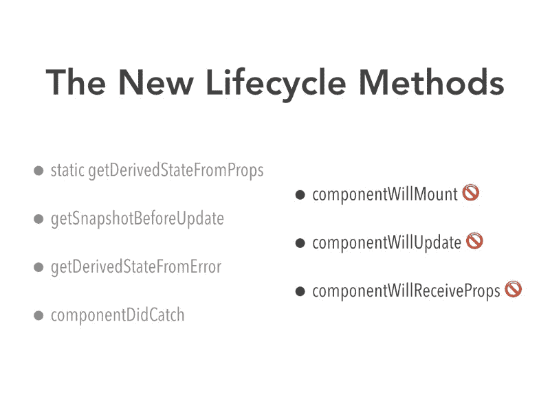

Deprecated lifecycle methods

现在，您已经了解了自 React 版本 16 以来对组件生命周期方法所做的更改！

### 第 2 章:用上下文 API 进行更简单的状态管理。

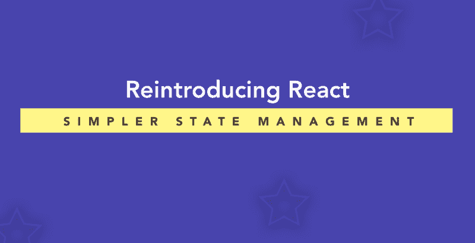

John 是一名出色的开发人员，他热爱自己的工作。然而，他在编写 React 应用程序时经常面临同样的问题。


Props drilling

Props drilling ，这个术语用来描述通过一个嵌套很深的组件树不必要的向下传递 Props，已经困扰 John 一段时间了！

幸运的是，约翰有一个总是知道所有答案的朋友。希望她能提出一条出路。

约翰向米娅伸出手，米娅上前提供了一些建议。


Mia says, ‘try Redux or MobX’.

Mia 也是一名出色的工程师，她建议使用一些状态管理库，比如`Redux`或`MobX`。

这些都是很好的选择，但是，对于 John 的大多数用例来说，他发现它们对于他的需求来说有点太臃肿了。

约翰说:“难道我不能用一些更简单、更自然的东西来反应自己吗？

Mia 不顾一切地去帮助一个需要帮助的朋友，她找到了上下文 API。


Mia 建议使用 React 的上下文 API 来解决问题。John 现在很高兴，很兴奋地看到上下文 API 可以提供什么，并且他卓有成效地开始了他的工作。

这标志着 John 开始体验上下文 API。

#### 背景介绍。

上下文 API 的存在使得在组件树中共享被认为是“全局的”数据变得容易。

在我们深入研究编写任何代码之前，让我们先看一个有插图的例子。

John 已经开始使用上下文 API，到目前为止，他对它印象深刻。今天他有一个新项目要做，他打算使用上下文 API。

让我们看看这个新项目是关于什么的。


The new project: Benny Home Run

约翰被期望为他的一个新客户制作一个游戏。这个游戏叫做**本尼本垒打**，看起来是个使用上下文 API 的好地方。

游戏的唯一目的是将本尼从他的起始位置移到他的新家。


The aim of the game

为了构建这个游戏，约翰必须跟踪本尼的位置。

由于 Benny 的位置是整个应用程序不可或缺的一部分，因此也可以通过一些全局应用程序状态来跟踪它。


Tracking position values x and y in state

我刚才说的是“*全局应用状态*”吗？

耶！

这听起来很适合上下文 API。

那么，约翰会怎么做呢？

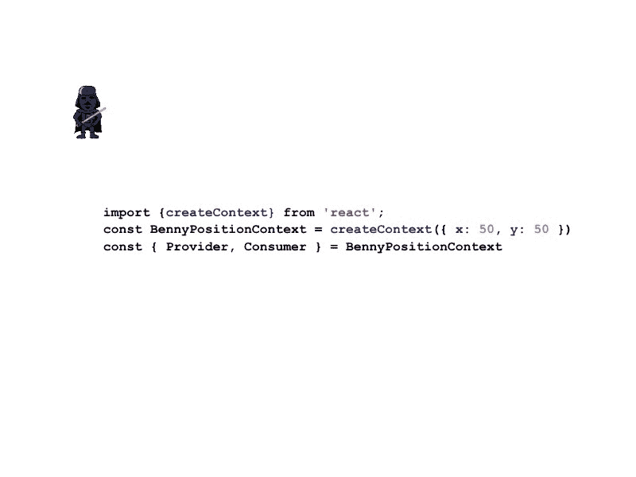

首先，需要从`React`导入`createContext`方法

```
import {createContext} from 'react';
```

`createContext`方法允许你创建一个上下文对象。请将此视为支持检索和保存状态值的数据结构。

要创建一个上下文对象，可以调用`createContext`方法，带有(或不带有)一个要保存在上下文对象中的初始状态值。

```
createContext(initialStateValue)
```

这是本尼应用程序中的样子:

```
const BennyPositionContext = createContext({ 	x: 50, 	y: 50 })
```

使用对应于 Benny 的初始位置值(x 和 y)的初始状态值调用`createContext`方法。

看起来不错！

但是，在创建了一个上下文对象之后，如何才能访问应用程序中的状态值呢？

每个上下文对象都有一个`Provider`和`Consumer`组件。

`Provider`组件将保存在上下文对象中的值“提供”给其子组件，而`Consumer`组件则从任何子组件中“消费”这些值。

我知道那是满满一嘴，所以让我们慢慢地把它分开。

在 Benny 的例子中，我们可以继续并析构`BennyPositionContext`来检索提供者和消费者组件。

```
const BennyPositionContext = createContext({ 	x: 50, 	y: 50 })// get provider and consumerconst { Provider, Consumer } = BennyPositionContext
```

由于`Provider`将保存在上下文对象中的值提供给它的**子对象**，我们可以用`Provider`组件包装一个组件树，如下所示:

```
&lt;Provider>   <Root /> // the root component for the Benny app. </Provider>
```

现在，`Root`组件中的任何子组件都可以访问存储在上下文对象中的默认值。

考虑以下 Benny 应用程序的组件树。

```
<Provider>   <Scene>     <Benny />   &lt;/Scene></Provider>
```

其中`Scene`和`Benny`是`Root`组件的子组件，分别代表游戏场景和本尼角色。

在这个例子中，`Scene`或者更嵌套的`Benny`组件将访问由`Provider`组件提供的值。

值得一提的是，一个`Provider`还带了一个`value`道具。

如果您想提供一个不同于在上下文对象创建时通过`createContext(initialStateValue)`传入的初始值的值，这个`value`属性很有用

这里有一个例子，一组新的值被传递给`Provider`组件。

```
<Provider value={x: 100, y: 150}>   <Scene>     <Benny />   &lt;/Scene></Provider>
```

既然我们有了由`Provider`组件提供的值，那么像`Benny`这样的嵌套组件如何消费这个值呢？

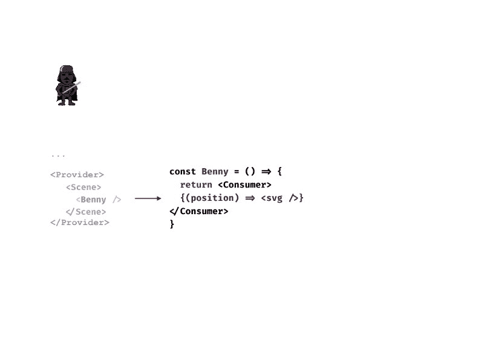

简单的答案是使用`Consumer`组件。

假设`Benny`组件是一个简单的组件，它呈现一些 SVG。

```
const Benny = () => {  return <svg />}
```

现在，在`Benny`中，我们可以像这样使用`Consumer`组件:

```
const Benny = () => {  return <Consumer>  {(position) => <svg /&gt;}</Consumer>}
```

好吧，那是怎么回事？

组件`Consumer`公开了一个渲染属性 API，即`children`是一个函数。然后，向该函数传递与保存在上下文对象中的值相对应的参数。在本例中，`position`对象带有`x`和`y`坐标值。

值得注意的是，每当来自`Provider`组件的值改变时，相关联的`Consumer`组件和子组件将被重新呈现，以保持消耗的值同步。

另外，`Consumer`将从树中它上面最近的`Provider`接收值。

考虑下面的情况:

```
// create context object const BennyPositionContext = createContext({ 	x: 50, 	y: 50 })
```

```
// get provider and consumerconst { Provider, Consumer } = BennyPositionContext
```

```
// wrap Root component in a Provider&lt;Provider>  <Root />;</Provider>
```

```
// in Benny, within Root. const Benny = () => (  <Provider value={x: 100, y: 100}>    // do whatever  </Provider>)
```

现在，`Benny`中引入了一个新的提供者组件，`Benny`中的任何`Consumer`都将获得值`{x: 100, y: 100}`，而不是`{x: 50, y: 50}`的初始值。

这是一个虚构的示例，但是它有助于巩固使用上下文 API 的基础。

理解了使用上下文 API 的必要构件后，让我们利用到目前为止所学的知识构建一个应用程序，并讨论额外的用例。

#### 示例:迷你银行应用程序。

约翰是个全面专注的人。当他不在工作场所做项目时，他会涉足一些业余项目。

他的众多副业项目之一是一项银行应用，他认为这可能会塑造银行业的未来。怎么会这样。

我设法得到了这个应用程序的源代码。您也可以在这本书的代码库中找到它。

要开始，请按照下面的命令安装依赖项并运行应用程序:

```
cd 02-Context-API/bank-appyarn installyarn start
```

完成后，应用程序将启动一个登录屏幕，如下所示:


您可以输入您选择的任何用户名和密码组合。

登录后，您将看到应用程序的主屏幕，如下所示:


在主屏幕中，您可以执行查看银行账户余额和取款等操作。


cliking yes from the previous screen displays the account balance

我们的目标是通过引入 React 的上下文来更好地管理应用程序中的状态。

#### 识别正在演练的道具。

应用程序的根组件称为`Root`，其实现如下:

```
... import { USER } from './api'class Root extends Component {  state = {    loggedInUser: null  }  handleLogin = evt => {    evt.preventDefault()    this.setState({      loggedInUser: USER    })  }  render () {    const { loggedInUser } = this.state    return loggedInUser ? (      &lt;App loggedInUser={loggedInUser} />    ) : (      <Login handleLogin={this.handleLogin} /&gt;    )  }}
```

如果用户已登录，则呈现主组件`App`，否则我们显示`Login`组件。

```
... loggedInUser ? (      &lt;App loggedInUser={loggedInUser} />    ) : (   <Login handleLogin={this.handleLogin} />)...
```

一旦成功登录(不需要任何特定的用户名和密码组合)，`Root`应用程序的`state`将被更新为`loggedInUser`。

```
...handleLogin = evt => {    ...    this.setState({      loggedInUser: USER    })  }...
```

在现实世界中，这可能来自一个`api`呼叫。

对于这个应用程序，我在`api`目录中创建了一个假用户，它导出了下面的用户对象。

```
export const USER = {  name: 'June',  totalAmount: 2500701}
```

基本上，当您登录时，会检索用户银行帐户的`name`和`totalAmount`并将其设置为 state。

如何在应用程序中使用用户对象？

好吧，考虑主要成分，`App`。这是负责渲染应用程序中除了`Login`屏幕以外的所有内容的组件。

下面是它的实现:

```
class App extends Component {  state = {    showBalance: false  }  displayBalance = () => {    this.setState({ showBalance: true })  }  render () {    const { loggedInUser } = this.props    const { showBalance } = this.state    return (      <div className='App'>            <User loggedInUser={loggedInUser} profilePic={photographer} />	<ViewAccountBalance          showBalance={showBalance}          loggedInUser={loggedInUser}          displayBalance={this.displayBalance}        />        <section>;          <WithdrawButton amount={10000} />          <WithdrawButton amount={5000} /&gt;        </section>        <Charity />      </div>    )  }}
```

看起来简单多了。再看一眼！

`loggedInUser`作为道具从`Root`传递给`App`，同时也传递给`User`和`ViewAccountBalance`组件。

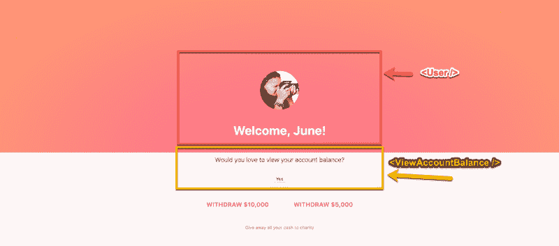

`User`组件接收`loggedInUser`道具，并将其传递给另一个子组件`Greeting`，后者呈现文本“ *Welcome，June* ”。

```
//User.js const User = ({ loggedInUser, profilePic }) => {  return (    <div>            <Greeting loggedInUser={loggedInUser} />    </div>  )}
```

另外，`ViewAccountBalance`接受一个布尔属性`showBalance`,它决定是否显示账户余额。当您点击“是”按钮时，这将切换到`true`。


```
//ViewAccountBalance.jsconst ViewAccountBalance = ({ showBalance, loggedInUser, displayBalance }) => {  return (    <Fragment>      {!showBalance ? (        <div>          <p>            Would you love to view your account balance?          </p>          <button onClick={displayBalance}>            Yes          </button>        </div>      ) : (        <TotalAmount totalAmount={loggedInUser.totalAmount} />      )}    </Fragment>  )}
```

从上面的代码块中，你是否也看到了`ViewAccountBalance`接收`loggedInUser`道具只是为了将它传递给`TotalAmount`？


`TotalAmount`接收这个道具，从用户对象中检索`totalAmount`并呈现总金额。

我很确定你可以在上面的代码片段中找到其他的东西。

到目前为止解释了代码，你看到这里明显的道具演练了吗？

被传递给甚至不需要知道它的组件太多次了。

让我们用`Context` API 来解决这个问题。

#### 避免背景下的道具训练。

一个简单的解决方案是查看`Root`组件，在那里我们开始向下传递 props，并找到一种方法在那里引入一个上下文对象。

按照这个解决方案，我们可以创建一个上下文对象，在`Root`类声明上面没有初始默认值:

```
const { Provider, Consumer } = createContext()class Root extends Component {  state = {    loggedInUser: null  }  ... }
```

然后我们可以用一个价值道具将主要的`App`组件包装在`Provider`上。

```
class Root extends Component {  state = {    loggedInUser: null  }  ...   render () {    ...    return loggedInUser ? (      <Provider value={this.state.loggedInUser}>        <App loggedInUser={loggedInUser} />      </Provider>    ) ...
```

最初，`Provider` `value`道具会是`null`，但是一旦用户登录并且`state`在`Root`中被更新，`Provider`也会收到当前的`loggedInUser`。

完成这些后，我们可以将`Consumer`导入到任何我们想要的地方，并且不再不必要地沿着组件树向下传递属性。

例如，`Greeting`组件中使用的`Consumer`:

```
import { Consumer } from '../Root'const Greeting = () => {  return (    <Consumer>      {user => <p>Welcome, {user.name}! </p>;}    </Consumer>  )}
```

我们可以继续做同样的事情，在其他任何我们已经不必要地通过了`loggedInUser`提案的地方。

这个应用程序和以前一样工作，只是我们摆脱了一遍又一遍地传递`loggedInUser`。

#### 隔离实现细节。

上面强调的解决方案是可行的，但也有一些警告。

更好的解决方案是将用户状态和提供者的逻辑集中在一个地方。

这是很常见的做法。让我告诉你我的意思。

我们将创建一个名为`UserContext.js`的新文件，而不是让`Root`组件管理`loggedInUser`的状态。

该文件将具有更新`loggedInUser`的相关逻辑，并公开一个上下文`Provider`和`Consumer`，以确保`loggedInUser`和任何更新函数可以从组件树中的任何地方访问。

当您有许多不同的上下文对象时，这种模块化变得很重要。例如，您可以在同一个应用程序中拥有一个`ThemeContext`和`LanguageContext`对象。

随着时间的推移，将它们提取到单独的文件和组件中被证明是更易于管理和有效的。

请考虑以下情况:

```
// UserContext.jsimport React, { createContext, Component } from 'react'import { USER } from '../api'const { Provider, Consumer } = createContext()class UserProvider extends Component {  state = {    loggedInUser: null  }  handleLogin = evt => {    evt.preventDefault()    this.setState({      loggedInUser: USER    })  }  render () {    const { loggedInUser } = this.state    return (      <Provider        value={{          user: loggedInUser,          handleLogin: this.handleLogin        }}      >        {this.props.children}      </Provider>    )  }}export { UserProvider as default, Consumer as UserConsumer }
```

这代表新的`context/UserContext.js`文件的内容。先前由`Root`组件处理的逻辑被移到这里。

注意它如何处理关于`loggedInUser`状态值的每个逻辑，并通过`Provider`将所需的值传递给`children`。

```
...<Provider     value={{       user: loggedInUser,       handleLogin: this.handleLogin      }}     >      {this.props.children}</Provider>...
```

在这种情况下，`value`道具是一个具有`user`值的对象，并且函数更新它，`handleLogin`。

还要注意，提供者和使用者都是导出的。这使得使用应用程序中任何组件的值变得很容易。

```
export { UserProvider as default, Consumer as UserConsumer }
```

通过这种分离的设置，您可以在组件树中的任何地方使用`loggedInUser`状态值，并从组件树中的任何地方更新它。

下面是在`Greeting`组件中使用它的一个例子:

```
import React from 'react'import { UserConsumer } from '../context/UserContext'const Greeting = () => {  return (    <UserConsumer>      {({ user }) => <p>Welcome, {user.name}! </p>}    </UserConsumer>  )}export default Greeting
```

多简单。

现在，我已经尽力删除了所有与`loggedInUser`相关的内容，在那里道具被不必要地传递了下去。谢谢上下文！

例如:

```
// before const User = ({ loggedInUser, profilePic }) => {  return (    <div>            <Greeting loggedInUser={loggedInUser} />    </div>  )}// after: Greeting consumes UserContext const User = ({profilePic }) => {  return (    <div>            <Greeting />     </div>  )}export default User
```

确保在附带的代码文件夹中查找最终的实现，即在去掉不必要传递的`loggedInUser`之后。

#### 更新上下文值。

*不能取款还叫什么银行 app，嗯？*

这个应用程序有一些按钮。你点击它们，瞧，取款成功了。


The withdrawal buttons

由于`totalAmount`值驻留在`loggedInUser`对象中，我们也可以从`UserContext.js`文件中提取数据。

请记住，我们试图将所有与用户对象相关的逻辑集中在一个地方。

为此，我们将扩展`UserContext.js`中的`UserProvider`来包含一个`handleWithdrawal`方法。

```
// UserContext.js... handleWithdrawal = evt => {    const { name, totalAmount } = this.state.loggedInUser    const withdrawalAmount = evt.target.dataset.amount
```

当您单击任何按钮时，我们将调用这个`handleWithdrawal`方法。

从作为参数传递给`handleWithdrawal`方法的`evt` click 对象，我们然后从`dataset`对象中取出要提取的金额。

```
const withdrawalAmount = evt.target.dataset.amount
```

这是可能的，因为两个按钮上都设置了一个`data-amount`属性。例如:

```
<button data-amount=1000 />
```

现在我们已经写出了`handleWithdrawal`方法，我们可以通过传递给`Provider`的`values`属性来公开它，如下所示:

```
<Provider    value={{       user: loggedInUser,       handleLogin: this.handleLogin       handleWithdrawal: this.handleWithdrawal     }}   >  {this.props.children}</Provider>
```

现在，我们已经准备好从组件树的任何地方使用`handleWithdrawal`方法。

在这种情况下，我们的重点是`WithdrawButton`组件。继续将它包装在一个`UserConsumer`中，解构`handleWithdrawal`方法并使其成为按钮的点击处理程序，如下所示:

```
const WithdrawButton = ({ amount }) => {  return (    <UserConsumer>      {({ handleWithdrawal }) => (        <button          data-amount={amount}          onClick={handleWithdrawal}        >          WITHDRAW {amount}        </button>      )}    </UserConsumer>  )}
```

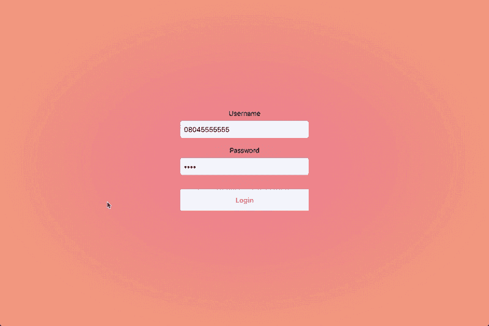

On logging in, the withdrawal now works as expected.

这很有效！

#### 结论

这说明您不仅可以传递状态值，还可以在上下文提供程序中传递它们对应的更新函数。这些可以在组件树中的任何地方使用。

在使银行应用程序与上下文 API 配合良好之后，我非常肯定 John 会为我们取得的进步感到骄傲！

### 第 3 章:Context type——在没有消费者的情况下使用上下文。

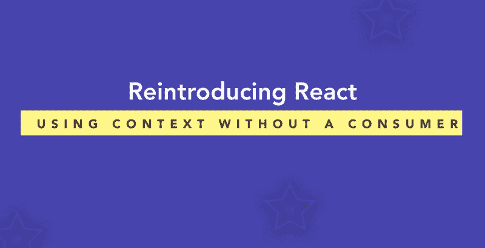

到目前为止，约翰已经有了很好的体验。感谢 Mia 推荐了这么棒的工具。

然而，有一个小问题。

随着 John 更频繁地使用上下文 API，他开始意识到一个问题。

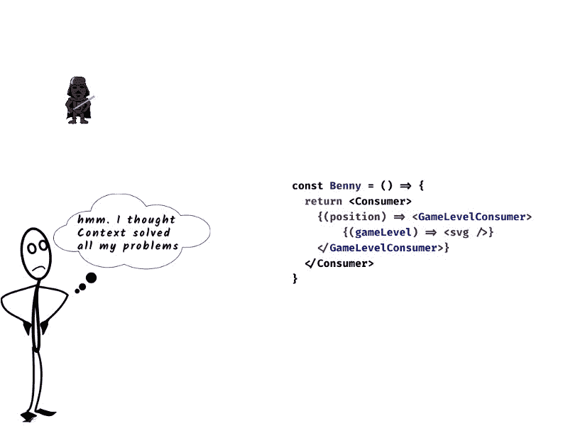

当一个组件中有多个`Consumers`时，会导致大量嵌套的、不太令人愉快的代码。

这里有一个例子。

在处理 *Benny Home Run* 应用程序时，John 必须创建一个新的上下文对象来保存当前用户的游戏级别状态。

```
// initial context objectconst BennyPositionContext = createContext({ 	x: 50, 	y: 50 })
```

```
// another context object for game level i.e Level 0 - 5 const GameLevelContext = createContext(0)
```

请记住，为了可重用性和性能，将相关数据分成不同的上下文对象是常见的做法(因为当`Provider`中的值发生变化时，每个消费者都会被重新呈现)

有了这些上下文对象，John 继续在`Benny`组件中使用两个`Consumer`组件，如下所示。

```
//grab consumer for PositionContextconst { Consumer: PositionConsumer } = BennyPositionContext
```

```
// grab consumer for GameLevelContextconst { Consumer: GameLevelConsumer } = GameLevelContext
```

```
// use both Consumers here.const Benny = () => {  return <PositionConsumer>    {position => <GameLevelConsumer>        {gameLevel => <svg /&gt;}    </GameLevelConsumer>}  </PositionConsumer>}
```

您是否注意到使用两个上下文对象的值会导致非常嵌套的代码？

这是使用`Consumer`组件消费数据的一个常见问题。有了多个消费者组件，就开始有很多嵌套。

那么，我们能做些什么呢？

首先，当我们在下一章学习钩子时，你会看到一个几乎完美的解决方案。同时，让我们考虑一下通过称为`contextType`的东西对`Class`组件可用的解决方案。

#### 使用带有 contextType 的类组件。

为了利用`contextType`,你需要使用一个类组件。

考虑将`Benny`组件重写为一个类组件。

```
// create context objectconst { Provider, Consumer } = createContext({ x: 50, y: 50 })// Class componentclass Benny extends Component {  render () {    return <Consumer>    {position => <svg />}  &lt;/Consumer>  }}
```

在这个例子中，`Benny`消耗来自上下文对象的初始上下文值`{ x: 50, y: 50 }`。

然而，使用`Consumer`会迫使您使用可能导致嵌套代码的 render prop API。

让我们通过使用`contextType`类属性去掉`Consumer`组件。

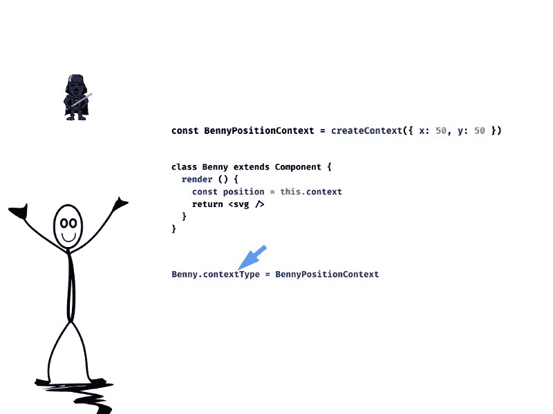

让它工作起来相当容易。

首先，将类组件上的`contextType`属性设置为一个上下文对象。

```
const BennyPositionContext = createContext({ x: 50, y: 50 })// Class Benny extends Component ... // look here ?Benny.contextType = BennyPositionContext 
```

在设置了`contextType`属性之后，您可以通过使用`this.context`继续使用上下文对象中的值。

例如，检索位置值`{ x: 50, y: 50 }`:

```
class Benny extends Component {  render () {    // look here. No nesting!    const position = this.context    return <svg />  }}
```

#### 完美的解决方案？

使用`contextType`类属性很好，但并不是世界上最好的解决方案。在一个类组件中只能使用一个`contextType`。这意味着如果你需要引入多个`Consumers`，你仍然会有一些嵌套的代码。

#### 结论

属性确实在一定程度上解决了嵌套问题。

然而，当我们在下一章讨论钩子时，你会看到钩子提供的解决方案有多好。

### 第四章:react . memo = = = Functional pure component。

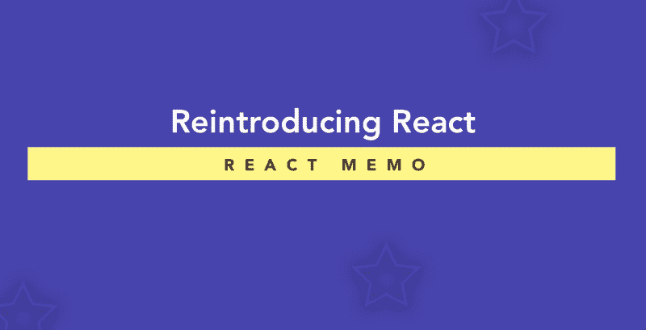

几周前，John 将`Benny`组件重构为`PureComponent`。

以下是他的变化:

嗯，看起来不错。

然而，他将`Benny`组件重构为类组件的唯一原因是因为需要 be 来扩展`React.PureComponent`。


这个解决方案是可行的，但是如果我们不需要从功能组件重构到类组件就能达到同样的效果，那会怎么样呢？

仅仅因为需要特定的 React 特性而重构大型组件并不是最愉快的经历。

#### React.memo 如何工作。

`React.memo`是类'`PureComponent`'的完美替代。你所要做的就是在`React.memo`函数调用中包装你的功能组件，然后你就会得到`PureComponent`给出的确切行为。

这里有一个简单的例子:

```
// before import React from 'react'function MyComponent ({name}) {     return ( <div>        Hello {name}.            </div>    )}export default MyComponent
```

```
// after import React, { memo } from 'react'export default  memo(function MyComponent ({name}) {    return ( <div>        Hello {name}.            </div&gt;    )})
```

如此简单，再简单不过了。

从技术上讲，`React.memo`是一个高阶函数，它接受一个功能组件并返回一个新的记忆组件。

因此，如果 props 没有改变，`react`将跳过组件的渲染，只使用之前记忆的值。

有了这些新发现的信息，John 重构了功能组件`Benny`以使用`React.memo`。

#### 处理深度嵌套的道具。

`React.memo`做个道具[浅薄的比较](https://stackoverflow.com/questions/36084515/how-does-shallow-compare-work-in-react)。这意味着，如果您有嵌套的 props 对象，比较将会失败。

为了处理这种情况，`React.memo`引入了第二个参数，一个等式检查函数。

这里有一个基本的例子:

```
import React, { memo } from 'react'export default  memo (function MyComponent (props) {      return ( <div>        Hello World from {props.name.surname.short}            </div&gt;    )}, equalityCheck)
```

```
function equalityCheck(prevProps, nextProps) {  // return perform equality check & return true || false}
```

如果`equalityCheck`函数返回`true`，则不会发生重新渲染。这将意味着当前的道具和先前的道具是相同的。如果你返回`false`，那么将会重新渲染。

如果您担心进行深度比较会导致额外的性能损失，您可以使用 lodash [isEqual](https://lodash.com/docs/4.17.11#isEqual) 实用程序方法。

```
import { isEqual } from 'lodash'function equalityCheck(prevProps, nextProps) {	return isEqual(prevProps, nextProps) }
```

#### 结论。

`React.memo`将类`PureComponent`行为引入功能组件。我们还看了一下如何使用`equalityCheck`功能。如果您使用`equalityCheck`功能，请确保在适用的地方包含对功能属性的检查。不这样做是许多 React 应用程序中常见的错误来源。

### 第 5 章:分析器——识别性能瓶颈。

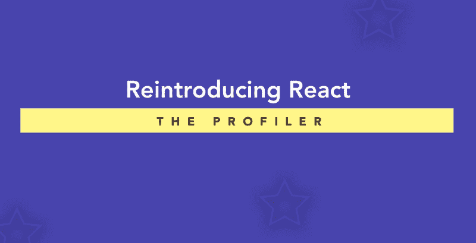

今天是星期五，米娅要回家了。在回家的路上，她忍不住想。


我今天取得了什么成就？米娅自言自语道。

经过长时间的仔细思考，她得出结论，她一整天只完成了一件事。


米娅一整天怎么可能只完成了一件事？

“一件事”最好是一个有价值的壮举！

那么，米娅今天的成就是什么？


事实证明，Mia 今天所做的只是无助地坐着，她的浏览器试图加载一个页面长达 7 个小时！


什么？？？

#### 在 React 应用中测量性能。

Web 性能非常重要。世界上没有人有那么多时间坐着等你的网页加载。

为了测量性能和识别应用程序中的性能瓶颈，关键是要有某种方法来检查应用程序的组件渲染需要多长时间，以及为什么要渲染它们。

这正是剖析器存在的原因。

如果你写 react 已经有一段时间了，你可能还记得`react-addons-perf`模块。

好吧，这一点已经被侧写员否决了。

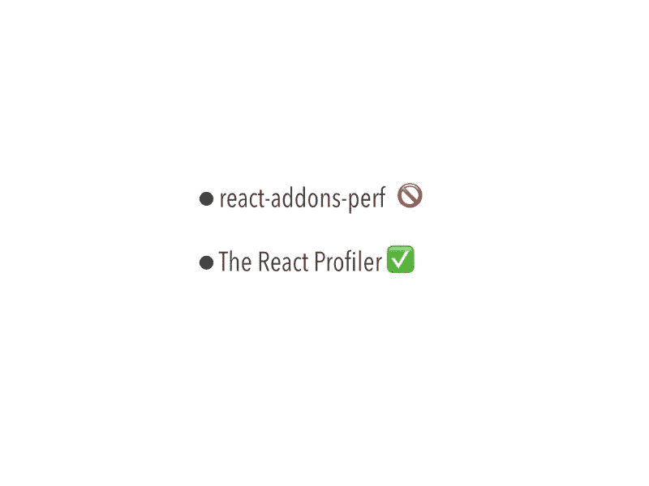

使用探查器，您可以:

*   收集每个组件的计时信息
*   轻松识别性能瓶颈
*   确保有一个与并发渲染兼容的工具

#### 开始使用。

为了尽可能的实用，我设置了一个小的[应用程序](https://github.com/ohansemmanuel/fake-medium)，我们将一起分析它。即衡量绩效。我们将在侧写员的帮助下完成这项工作。

我将应用程序*称为假媒体*，它看起来像这样:


The Fake-medium app

您将在本书的代码库中找到该应用程序的源代码。

要安装依赖项并运行应用程序，请从`04-The-Profiler`目录运行以下命令:

```
cd fake-mediumyarn install yarn start
```

如果您运行了这些命令，您应该让应用程序在您的默认浏览器中运行，在端口`3000`或类似的地方。


Application running on some local port.

最后，通过按 Command+Option+J (Mac)或 Control+Shift+J (Windows、Linux 和 Chrome OS)打开 chrome devtools。

然后找到 React [chrome devtools](https://chrome.google.com/webstore/detail/react-developer-tools/fmkadmapgofadopljbjfkapdkoienihi?hl=en) 扩展标签并点击它。


您将看到两个选项卡，元素和概要分析器。

你猜对了，我们的焦点在 profiler 选项卡上，所以请点击它。


这样做会将您带到以下页面:


#### 分析器是如何工作的？

分析器通过记录应用程序的实际使用情况来工作。在这个记录会话中，它收集关于应用程序中组件的信息，并显示一些有趣的信息，您可以利用这些信息来发现性能瓶颈。

若要开始，请点按“录制”按钮。


点击“记录”后，你就可以像你期望的用户那样使用你的应用程序了。

在这种情况下，我已经点击了三次中拍手按钮！


完成与应用程序的交互后，点击 stop 查看分析器提供的信息。

#### 理解分析器的结果。

在 profiler 屏幕的最右侧，您会看到在与应用程序交互过程中提交数量的可视化表示。


从概念上讲，react 分两个阶段工作。渲染阶段，其中组件被渲染并且虚拟 DOM *被区分*，以及提交阶段，其中虚拟 DOM 中的实际改变被提交到 DOM。

您在分析器最右边看到的图形表示代表了在您与应用程序交互期间对 DOM 的提交次数。

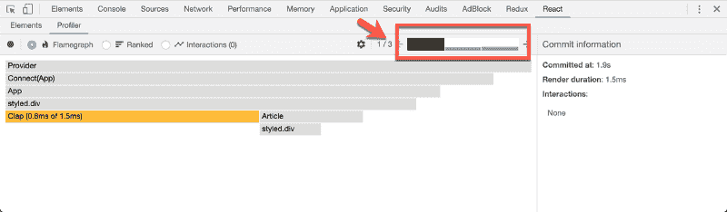

条形越高，在这个提交中呈现组件花费的时间就越长。

在上面的例子中，分析器记录了三次提交。这是有道理的，因为我只点击了 3 次按钮。因此，应该只有 3 次对 DOM 的提交。

此外，第一次提交比随后的两次提交花费的时间长得多。

这三个条形表示对 DOM 的不同提交，您可以单击任何一个来研究特定提交的性能指标。

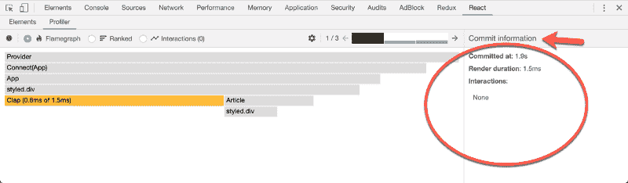

#### 火焰图表。

在一次成功的录音后，你会看到一些关于你的组件的不同信息。

首先，您有 3 个选项卡，代表不同的信息组——每个选项卡都与右侧所选的提交相关。

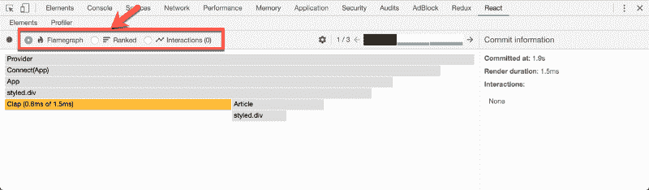

第一个选项卡代表火焰图。

火焰图显示组件树渲染所用时间的信息。

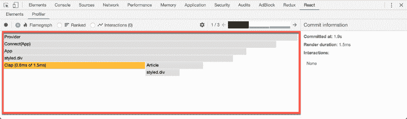

您会注意到，应用程序树中的每个组件都由不同长度和颜色的条形表示。

条形的长度定义了组件(及其子组件)渲染所需的时间。

从条的长度来看，似乎`Provider`组件花费了最长的时间来渲染。这是有意义的，因为`Provider`是应用程序的主要根组件，所以这里表示的时间是`Provider`及其所有子组件渲染的时间。

这是故事的一半。

请注意，条形的颜色是不同的。

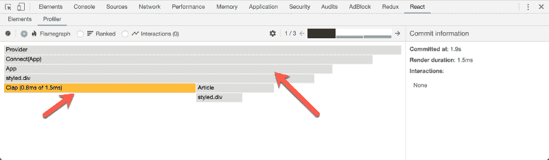

例如，`Provider`和其他几个组件的颜色是*灰色*。

那是什么意思？

首先，我们在与应用程序交互的过程中对 DOM 进行第一次提交。

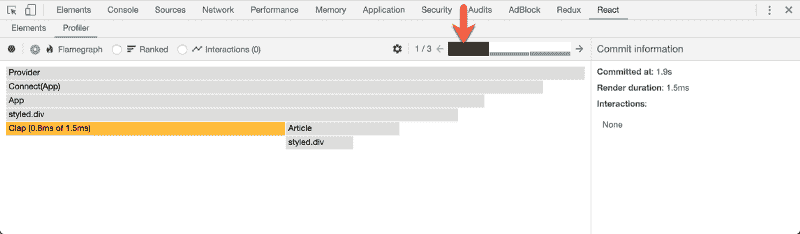

带有灰色的组件意味着它们没有在这次提交中被渲染。如果组件是灰色的，它没有在这个提交中被渲染。因此，条的长度仅表示在该提交之前，即在与应用程序交互之前，组件花费了多长时间来呈现之前的*。*

*你想想，那是有道理的。*

*仔细检查后，您会发现这里唯一具有不同火焰图颜色的组件是`Clap`组件。*

**

*该组件表示被点击的“中拍手”按钮。*

*黄色条表示组件在这次提交中花费了最多的时间进行渲染。*

*嗯，没有其他组件被着色，这意味着`Clap`按钮是这次提交中唯一被重新渲染的组件。*

*太完美了！*

*你不想点击`Clap`按钮，让不同的组件被重新渲染。这将是一个性能的打击。*

*在更复杂的应用程序中，你会发现火焰图不仅仅是黄色和灰色条。你会发现一些有蓝色条纹的。*

*值得注意的是，黄色较长的条花费了更多的时间来渲染，其次是蓝色的条，最后是灰色的条在被查看的特定提交中没有被重新渲染。*

*也可以点击一个特定的条来查看更多关于它为什么渲染或者不渲染的信息，例如传递给组件的属性和状态。*

*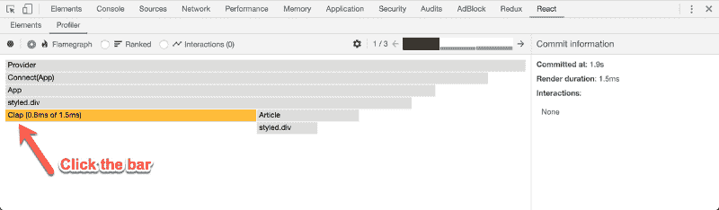**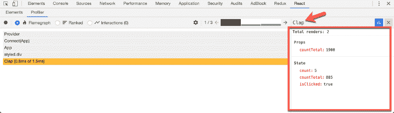*

*放大时，您还可以单击顶部的提交栏来查看每次提交渲染的`props`或`state`差异。*

#### *排名图。*

*一旦你理解了火焰图的工作原理，排名图就变得简单了。*

*第二个选项卡选项指的是排名图表。*

*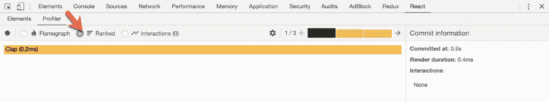*

*分级图表显示正在查看的提交中呈现的每个组件。它显示从上到下排列的组件，花费更多时间渲染的组件在顶部。*

*在这个例子中，我们在分级图表视图中只显示了`Clap`组件。这没关系，因为我们只期望点击时重新呈现`Clap`组件。*

*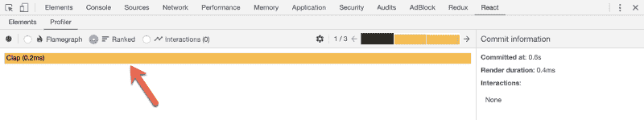*

*更复杂的排名图表可能如下所示:*

*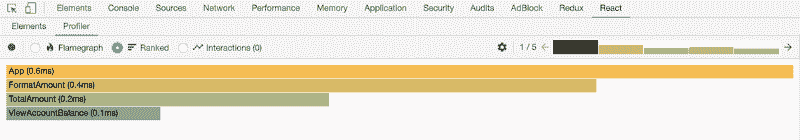

Ranked chart from an application we’ll profile next* 

*你可以看到较长的黄色条在顶部，较短的蓝色条在底部。如果你仔细观察，你会注意到从上到下颜色会变淡。从较多的黄色条到淡黄色条，再到淡蓝色条，最后是蓝色条。*

#### *组件图。*

*每当您在 Profiler 中放大一个组件时，即通过单击其关联栏，右侧会弹出一个新选项。*

*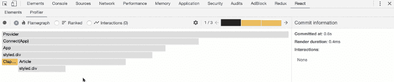*

*点击此按钮将进入所谓的组件图。*

*组件图表显示在记录的交互过程中特定组件被重新呈现的次数。*

*在这个例子中，我可以点击按钮来查看`Clap`组件的图表。*

*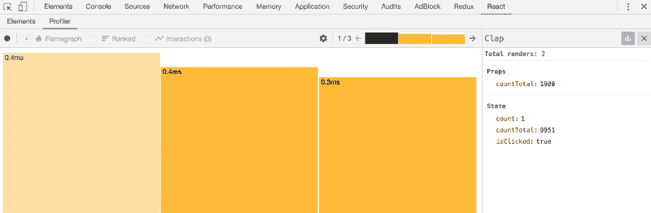*

*这显示了三个条形，代表了`Clap`组件被重新渲染的三次。如果我在这里看到第四个条，我会开始担心，因为我只点击了三次，预计只有三次重新呈现。*

*如果选定的组件根本没有重新渲染，您将看到下面的空屏幕:*

*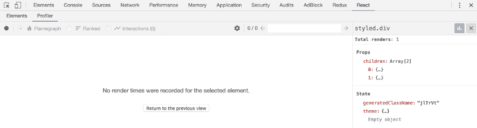*

***NB** :您可以通过点击最右边的按钮来查看组件图，也可以通过双击火焰图或分级图中的组件栏来查看。*

#### *互动。*

*profiler 中还有最后一个选项卡，默认情况下，它会显示一个空屏幕:*

*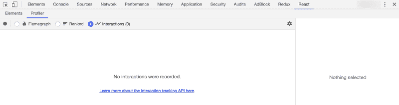*

***交互**允许您用字符串标识符标记在记录会话期间执行的操作，以便可以在分析结果中监视和跟踪它们。*

*这种 API 是不稳定的，但下面是如何在您的分析结果中启用交互。*

*首先安装`scheduler`模块。从您的终端，在应用程序目录中运行`yarn add scheduler`。*

*安装完成后，您需要使用模块导出的`unstable_trace`函数，如下所示:*

```
*`import { unstable_trace as trace } from 'scheduler/tracing'`*
```

*这个函数被导出为`unstable_trace`，但是你可以在 import 语句中重命名它，就像我上面做的那样。*

*`trace`函数有一个类似如下的签名:*

```
*`trace("string identifier", timestamp, () = {})`*
```

*它接受一个字符串标识符、时间戳和一个回调函数。理想情况下，您可以通过将交互传递给回调来跟踪您想要的任何交互。*

*例如，我已经在`fake-medium`应用程序中这样做了:*

```
*`// before _handleClick () {   // do something}`*
```

```
*`// after _handleClick () {   trace("Clap was clicked!", window.performace.now(), () => {  	  // do something   })}`*
```

*点击时的介质 clap 调用`_handleClick`方法。现在，我已经将功能包装在了`trace`方法中。*

*下面是现在查看分析结果时发生的情况:*

*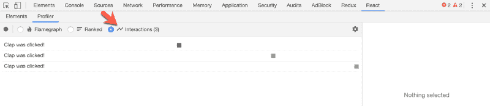*

*现在，点击三次会记录 3 次互动，您可以点击任何互动来查看更多详细信息。*

*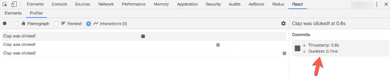*

*互动也将显示在火焰和排名图表。*

*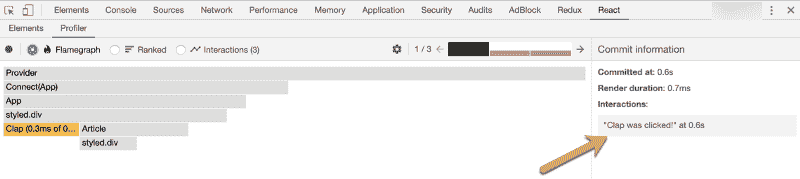*

#### *示例:识别银行应用程序中的性能瓶颈。*

*嘿，约翰，你做了什么？！！！“米娅一边说，一边艰难地走进约翰的办公室。*

*“*我只是在分析银行申请，这太不符合性能了”，*她补充道。*

*约翰并不惊讶。他没有花很多时间考虑性能，但是当 Mia 出现在他面前时，他开始重新思考。*

*好的，我会检查一下，并修复我发现的任何瓶颈。我们能一起做吗？约翰边说边想，既然米娅发现了这个问题，她会帮上多大的忙。*

*“哦，当然可以，”她反驳道。*

*花了几个小时后，他们发现并修复了应用程序中的几个性能瓶颈。*

*他们做了什么？采取了什么措施？*

*在本例中，我们将启动银行应用程序，并从上一章停止的地方继续。这次我们将修复应用程序中的性能瓶颈。*

*这是银行应用程序的外观:*

**

#### *注意预期的行为。*

*当我需要分析一个应用程序时，特别是在与应用程序的特定交互过程中，我喜欢为我在性能方面的预期设置基线。这种期望有助于您在深入解释分析器的结果时保持注意力。*

*让我们考虑一下我们想要分析的银行应用程序。银行 app 中的交互很简单。你点击一组按钮，取款金额就会更新。*

*

The basic interaction of the app* 

*现在，关于重新渲染和更新，你认为这个应用程序的预期行为是什么？*

*对我来说，这很简单。*

*该应用程序视觉上唯一变化的部分是取款金额。在进入概要分析会话之前，我对高性能应用程序的期望是，不需要重新呈现任何不必要的组件，只需要负责更新总量的组件。*

*

Where I expect re-renders to happen. Nowhere else.* 

*差不多吧，我希望只重新呈现`TotalAmount`组件，或者任何其他与更新直接相关的组件。*

*有了这个预期，让我们继续分析应用程序。*

*步骤与前面讨论的相同。你打开你的`devtools`，记录一个交互会话，并开始解释结果。*

*现在，我已经记录了一个会话。在这个阶段，我所做的就是点击“提取 10，000 美元”按钮 3 次。*

**

*下面是分析会议的火焰图:*

*

Flame chart results* 

*我的天啊。从上面的图表中，许多组件被重新渲染。你看到火焰图中的许多条形颜色了吗？*

*这与理想相差甚远，所以让我们开始解决这个问题。*

#### *解读火焰图。*

*首先让我们考虑一下问题的根源可能是什么。默认情况下，只要一个`Provider`的`value`发生改变，每个子组件都会被强制重新渲染。这就是`Consumer`从`context`对象获取最新值并保持同步的方式。*

*这里的问题是除了`Root`之外的每一个组件都是`Provider`的子组件——它们都被不必要地重新渲染了！*

*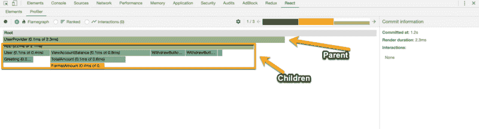

All children components re-rendered with a change in the Provider’s value.* 

*那么，我们能做些什么呢？*

*一些子组件不需要重新渲染，因为它们与更改没有直接关系。*

*首先，让我们考虑第一个子组件`App`。*

*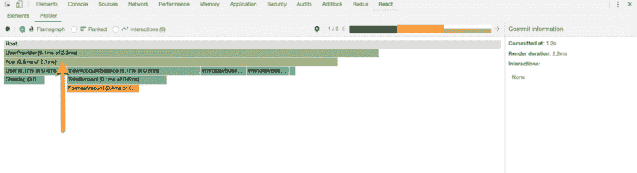*

*组件`App`不接收任何`prop`，它只管理状态值`showBalance`。*

```
*`class App extends Component {  state = {    showBalance: false  }  displayBalance = () => {    this.setState({ showBalance: true })  }  render () {    const { showBalance } = this.state    ...  }}`*
```

*它与更改没有直接关系，重新呈现该组件没有意义。*

*让我们通过将它设为`PureComponent`来解决这个问题。*

```
*`// before class App extends Component {  state = {    showBalance: false  } ... }// after class App extends PureComponent {  state = {    showBalance: false  } ... }`*
```

*取得了`App` a `PureComponent`之后，我们有没有取得任何像样的进展？*

*好吧，看看这个简单的(一行代码)修改后生成的新的火焰图。*

**

*你能看到吗？*

*许多应用程序的孩子没有必要重新渲染，我们现在有一个更理智的火焰图。*

*太好了！*

#### *描绘不同的互动。*

*很容易假设，因为我们在“提取金额”交互中减少了重新渲染，所以我们现在有了一个高性能的应用程序。*

*这是不正确的。*

*App 现在是一个`PureComponent`，但是当`App`由于`state`的改变而被渲染时会发生什么呢？*

*好吧，让我们来分析一下不同的互动。这一次，加载应用程序并分析交互以查看帐户余额。*

**

*如果你继续分析交互，我们会得到完全不同的结果。*

*

Screencast showing the interaction being profiled.* 

*现在，发生了什么变化？*

**

*从上面的火焰图来看，`App`的每个子组件都被重新渲染了。他们都与这个视觉更新无关，所以这些都是浪费渲染。*

*注意:如果您需要更清楚地检查组件的层次结构，请记住您可以随时单击元素选项卡:*

**

*因为这些子组件是功能组件，所以让我们用`React.memo`来记忆渲染结果，这样它们就不会改变，除非道具发生了变化。*

```
*`// User.jsimport { memo } from 'react'const User = memo(({ profilePic }) => {  ...})`*
```

```
*`// ViewAccountBalance.jsimport { memo } from 'react'const ViewAccountBalance = memo(({ showBalance, displayBalance }) => {      ...})`*
```

```
*`// WithdrawButton.jsimport { memo } from 'react'const WithdrawButton = memo(({ amount }) => {    ...  )})`*
```

*现在，当你这样做并重新描绘相互作用时，我们会得到一个更好的火焰图:*

*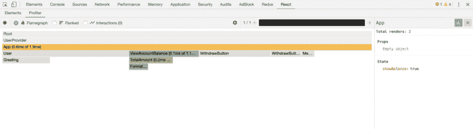*

*现在，只有`ViewAccountBalance`和其他子组件被重新渲染。没关系。*

*当你查看你的火焰图时，也就是说，如果你一直跟着走，你可能会看到一些稍微不同的东西。*

*组件的名称可能不会显示。您获得了通用名称`Memo`，并且很难跟踪哪个组件是什么。*

*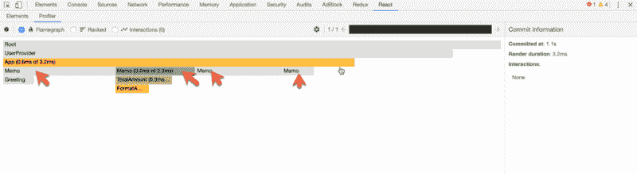*

*要改变这一点，为记忆组件设置`displayName`属性。*

*下面是一个例子。*

```
*`// ViewAccountBalance.jsconst ViewAccountBalance = memo(({ showBalance, displayBalance }) => {  ...})`*
```

```
*`// set the displayName hereViewAccountBalance.displayName = 'ViewAccountBalance'`*
```

*你继续为所有记忆的功能组件做这件事。*

#### *提供者值。*

*我们已经基本解决了应用程序中的性能漏洞，但是，还有一件事要做。*

*这种效果在这个应用程序中并不明显，但是当你在现实世界中遇到更多的情况时，比如在一个`Provider`嵌套在其他组件中的情况下，这种效果会很方便。*

*银行应用程序中`Provider`的实现如下:*

```
*`...<Provider    value={{       user: loggedInUser,       handleLogin: this.handleLogin       handleWithdrawal: this.handleWithdrawal     }}   >  {this.props.children}</Provider>...`*
```

*这里的问题是我们每次都要传递一个新的对象给`value` prop。更好的解决方案是通过状态来保存对这些值的引用。例如*

```
*`<Provider value={this.state}>	{this.props.children}</Provider>`*
```

*这样做需要一点重构，如下所示:*

```
*`// context/UserContext.jsclass UserProvider extends Component {  constructor () {    super()    this.state = {      user: null,      handleLogin: this.handleLogin,      handleWithdrawal: this.handleWithdrawal    }  }  ...  render () {    return <Provider value={this.state}>  		{this.props.children}	</Provider>  }}`*
```

*如果你需要更多的信息，请务必查看相关的代码文件夹。*

#### *结论。*

*剖析应用程序和识别性能漏洞是有趣且有益的。我希望你已经掌握了这一部分的相关知识。*

### *第 6 章:用 React 进行惰性加载。慵懒又悬疑。*

**

*John 的经理 Tunde 说:“嗨，John，我们需要研究一下 Benny 应用程序中一些模块的延迟加载问题。*

*在过去的几个月里，约翰从他的经理那里得到了很好的反馈。唐德不时带着新的项目想法冲进办公室。今天用`React.Lazy`和`Suspense`懒加载。*

*约翰从不偷懒用 React 加载一个模块。现在之前的懒散和悬疑。这对他来说是全新的，所以他大胆地进行了快速学习，以满足经理的要求。*

#### *什么是懒装？*

*当您捆绑您的应用程序时，您很可能将整个应用程序捆绑在一个大块中。*

*随着应用的增长，捆绑包也会增长。*

*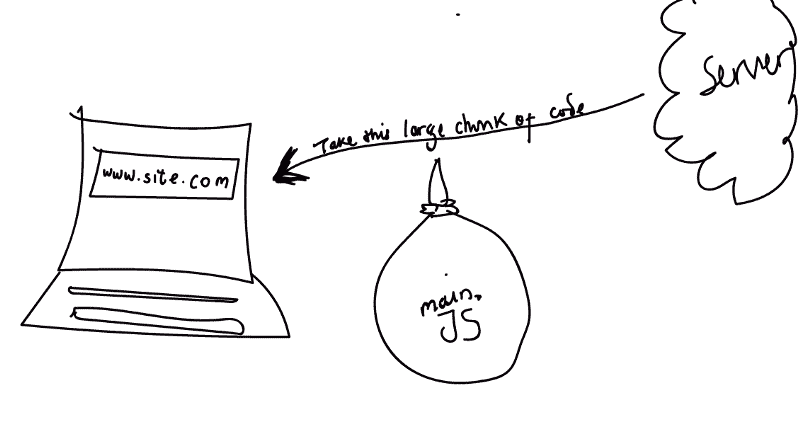*

*为了理解延迟加载，下面是 Tunde 在与 John 讨论时想到的具体用例。*

*嘿，约翰，你还记得本尼的应用程序有一个初始主屏幕吗？”吞德说道。*

*通过最初的主页屏幕，Tunde 指的是这个:*

**

*这是用户访问本尼游戏时遇到的第一个屏幕。要开始玩游戏，您必须单击“开始游戏”按钮，以重定向到实际的游戏场景。*

**John，这里的问题是我们已经将所有的 React 组件捆绑在一起，并在这个页面上提供给用户*。*

*约翰说:“哦，我明白你的意思了。*

*"*不加载`GameScene`组件及其相关资产，我们可以推迟加载，直到用户真正点击“开始游戏”，嗯？*”约翰说。*

*而 Tunde 也附和了一句响亮的“*对，我就是这个意思*”。*

*层加载是指将特定资源的加载推迟到很久以后，通常是当用户进行交互时，要求实际加载资源。在某些情况下，这也意味着预加载资源。*

*从本质上讲，用户最初并没有得到提供给他们的惰性加载包，而是在运行时很久以后才得到。*

*这对于性能优化、初始加载速度等非常有用。*

*React 通过使用动态导入语法使延迟加载成为可能。*

*动态导入指的是 javascript 的`tc39`语法[提案，然而，有了 Babel 这样的 transpilers，我们今天可以使用这个语法。](https://github.com/tc39/proposal-dynamic-import)*

*导入模块的典型静态方式如下所示:*

```
*`import { myModule } from 'awesome-module'`*
```

*虽然这在许多情况下是可取的，但是语法不允许在运行时动态加载模块。*

*能够在运行时动态加载 Javascript 应用程序的一部分为有趣的用例铺平了道路，例如基于用户的语言加载资源(这是一个只能在运行时确定的因素)，或者仅在用户可能使用代码时加载一些代码(性能提升)。*

*出于这些原因(以及更多原因),有一个将动态导入语法引入 Javascript 的提案。*

*下面是语法的样子:*

```
*`import('path-to-awesome-module')`*
```

*它的语法类似于函数，但实际上不是函数。它不是从`Funtion.proptotype`继承的，你不能调用像`call`和`apply`这样的方法。*

*动态导入调用返回的结果是一个承诺，用导入的模块解决。*

```
*`import('path-to-awesome-module')	.then(module => {     // do something with the module here e.g. module.default() to invoke the default export of the module. })`*
```

#### *利用 React.lazy 和悬念。*

*`React.lazy`和`Suspense`让在 React 应用程序中使用动态导入变得如此简单。*

*例如，考虑下面 Benny 应用程序的演示代码:*

```
*`import React from 'react'import Benny from './Benny'import Scene from './Scene'import GameInstructions from './GameInstructions'`*
```

```
*`class Game extends Component {  state = {    startGame: false  }  render () {    return !this.state.startGame ?         <GameInstructions /> : 		<Scene />  }}export default Game;`*
```

*基于状态属性`startGame`，当用户点击“开始游戏”按钮时，或者`GameInstructions`或者`Scene`组件被呈现。*

*`GameInstructions`代表游戏的主页，`Scene`代表游戏本身的整个场景。*

*在这个实现中，`GameInstructions`和`Scene`将被捆绑在同一个 Javascript 资源中。*

*因此，即使用户没有表现出开始玩游戏的意图，我们也会加载复杂的`Scene`组件并发送给用户，它包含游戏场景的所有逻辑。*

*那么，我们该怎么办？*

*让我们推迟`Scene`组件的加载。*

*下面是`React.lazy`让这变得多么容易。*

```
*`// before import Scene from './Scene'`*
```

```
*`// now const Scene = React.lazy(() => import('./Scene'))`*
```

*`React.lazy`采用一个必须调用动态导入的函数。在这种情况下，动态导入调用是`import('./Scene')`。*

*注意，`React.lazy`期望动态加载的模块有一个包含 React 组件的`default`导出。*

*现在动态加载了`Scene`组件，当应用程序被捆绑用于生产时，将为`Scene`动态导入创建一个单独的模块(或 javascript 文件)。*

*当应用程序加载时，这个 javascript 文件不会发送给用户。然而，如果他们点击“开始游戏”按钮并显示加载`Scene`组件的意图，将会发出网络请求从远程服务器获取资源。*

*现在，从服务器获取会引入一些延迟。为了处理这个问题，将`Scene`组件包装在一个`Suspense`组件中，以显示获取资源时的回退。*

*我的意思是:*

```
*`import { Suspense } from 'react'const Scene = React.lazy(() => import('./Scene'))`*
```

```
*`class Game extends Component {  state = {    startGame: false  }  render () {    return !this.state.startGame ?         <GameInstructions /> : 		// look here		<;Suspense fallback="<div>loading ...</div>">		  <Scene />		</Suspense>  }}export default Game;`*
```

*现在，当发起获取`Scene`资源的网络请求时，我们将向`Suspense`组件展示一个“加载…”回退。*

*`Suspense`接受一个`fallback`道具，可以是这里显示的标记，也可以是一个完整的 React 组件，例如一个自定义加载器。*

*使用`React.lazy`和`Suspense`,您可以暂停获取组件，直到很久以后，并在获取资源时显示回退。*

*多方便啊。*

*此外，您可以将`Suspense`组件放在惰性加载组件之上的任何位置。在这种情况下是`Scene`组件。*

*如果您还有多个延迟加载的组件，那么您可以将它们包装在一个或多个组件中，这取决于您的具体用例。*

#### *处理错误。*

*在现实世界中，东西经常坏掉，对吗？*

*在获取惰性加载资源的过程中，可能会出现网络错误。*

*为了处理这种情况，请确保将您的惰性加载组件包装在一个*错误边界*中。*

*还记得生命周期方法一章中的错误边界吗？*

*这里有一个例子:*

```
*`import { Suspense } from 'react'import MyErrorBoundary from './MyErrorBoundary'const Scene = React.lazy(() => import('./Scene'))class Game extends Component {  state = {    startGame: false  }`*
```

```
 *`render () {    return &lt;MyErrorBoundary>         {!this.state.startGame ?            <GameInstructions /> : 		   <Suspense fallback="loading ...">		     <Scene />;		   </Suspense>}		</MyErrorBoundary>  }}export default Game;`*
```

*现在，如果在获取延迟加载的资源时发生错误，它将被错误边界优雅地处理。*

#### *没有指定的导出。*

*如果您还记得上一节，我确实提到过`React.lazy`期望动态导入语句包含一个模块，该模块的**默认导出**是 React 组件。*

*目前，`React.lazy`不支持命名出口。这并不完全是一件坏事，因为它保持了树抖动的工作，所以你不会导入实际未使用的模块。*

*考虑以下模块:*

```
*`// MyAwesomeComponents.js export const AwesomeA = () => <div> I am awesome </div> export const AwesomeB = () => <div> I am awesome </div> export const AwesomeC = () => <div> I am awesome </div>`*
```

*现在，如果您试图将`React.lazy`用于上述模块的动态导入，您将会得到一个错误。*

```
*`// SomeWhereElse.js const Awesome = React.lazy(() => import('./MyAwesomeComponents'))`*
```

*这是行不通的，因为在`MyAwesomeComponents.js`模块中没有默认的导出。*

*一种解决方法是创建一些其他模块，将其中一个组件作为默认组件导出。*

*例如，如果我对从`MyAwesomeComponents.js`模块中延迟加载`AwesomeA`组件感兴趣，我可以像这样创建一个新模块:*

```
*`// AwesomeA.js export { AwesomeA as default } from './MyAwesomeComponents'`*
```

*然后我可以继续有效地使用`React.lazy`如下:*

```
*`// SomeWhereElse.jsconst AwesomeA = React.lazy(() => import('AwesomeA'))`*
```

*问题解决了！*

#### *代码分割路线。*

*代码拆分提倡不要一次将这一大块代码发送给用户，而是可以在用户需要时动态地将代码块发送给用户。*

*在前面的例子中，我们已经看到了基于组件的代码拆分，但是另一种常见的方法是基于路由的代码拆分。*

*在这种方法中，基于应用程序中的路由将代码分割成块。*

*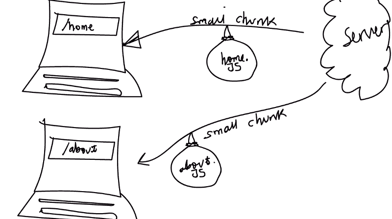*

*我们还可以通过代码分割路线将我们对延迟加载的了解更进一步。*

*考虑一个使用`react-router`进行路线匹配的典型 React 应用。*

```
*`const App = () => (  <Router>      <Switch>        <Route exact path="/" component={Home}/>        <Route path="/about" component={About}/>      </Switch>  </Router>);`*
```

*我们可以延迟加载`Home`和`About`组件，这样它们只在用户点击相关的路线时才被获取。*

*下面介绍如何使用`React.Lazy`和`Suspense`。*

```
*`// lazy load the route componentsconst Home = React.lazy(() => import('./Home'))const About = React.lazy(() => import('./About'))`*
```

```
*`// Provide a fallback with Suspenseconst App = () => (  <Router&gt;    <Suspense fallback={<div>Loading...</div>}>      <Switch>        <Route exact path="/" component={Home}/>        <Route path="/about" component={About}/>      </Switch>    </Suspense>  </Router>);`*
```

*简单吧。*

*我们已经讨论了`React.Lazy`和`Suspense`是如何工作的，但是实际的代码分割，也就是为不同的模块生成单独的包，是由一个捆绑器完成的，例如 [Webpack](https://webpack.js.org) 。*

*如果你使用`create-react-app`、`Gatsby`或`Next.js`，那么你已经为自己设置好了。*

*自己设置也很容易，你只需要稍微调整一下你的`Webpack`配置。*

*官方`Webpack`文档有一个[完整的指南](https://webpack.js.org/guides/code-splitting/)在这上面。如果您正在自己处理应用程序中的萌芽配置，该指南可能值得一读。*

#### *示例:在银行应用程序中添加延迟加载。*

*我们可以给我们在第 2 章看到的银行应用程序添加一些延迟加载。*

*考虑应用程序的`Root`组件:*

```
*`const Root = () => (  <UserProvider>    <UserConsumer>      {({ user, handleLogin }) =>        user ? <App /> : <Login handleLogin={handleLogin} />      }    </UserConsumer>  </UserProvider>)`*
```

*当用户没有登录时，我们显示登录页面，只有当用户登录时才显示`App`组件。*

*我们可以延迟加载`App`组件，对吗？*

*这很容易。您将动态导入语法与`React.lazy`一起使用，并将`App`组件包装在一个`Suspense`组件中。*

*方法如下:*

```
*`...const App = React.lazy(() => import('./containers/App'))const Root = () => (  ...  <Suspense fallback='loading...'>     <App /&gt;  </Suspense>)`*
```

*现在，如果你节流你的网络连接来模拟缓慢的 3G，你会在登录后看到中间的*“正在加载…”*文本。*

*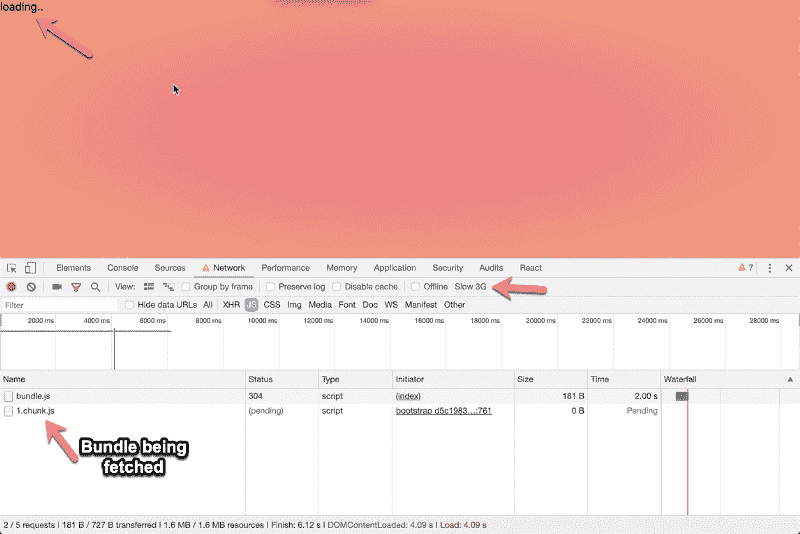*

#### *结论。*

*`React.lazy`和`Suspense`很棒，使用起来很直观，但是它们还不支持服务器端渲染。*

*这很可能在未来会改变，但同时，如果你关心 SSR，使用[react-loaded](https://github.com/jamiebuilds/react-loadable)是你惰性加载`React`组件的最佳选择。*

### *第 7 章:钩子——构建更简单的 React 应用。*

*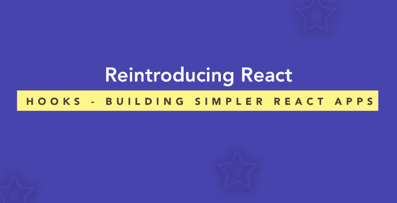*

*在过去的 3 年里，约翰一直在编写 React 应用程序，功能组件大多是哑的。*

*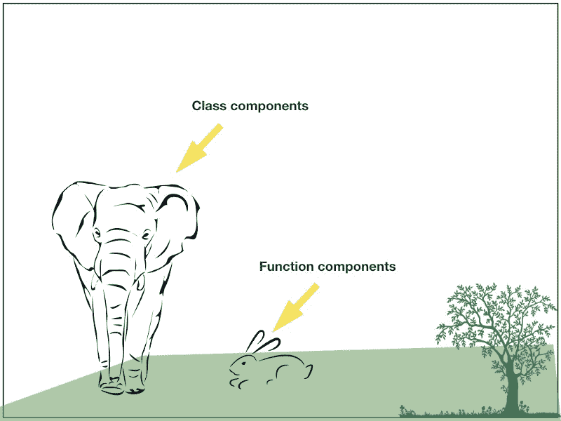*

*如果您想要局部状态或一些其他复杂的副作用，您必须使用类组件。要么痛苦地将功能组件重构为类组件，要么什么都不做。*

*这是一个阳光明媚的周四下午，在吃午饭时，米娅把约翰介绍给了胡克斯。*

**

*她热情洋溢地讲话，激起了约翰的兴趣。*

*在米娅说的所有事情中，有一件事打动了约翰。有了钩子，功能组件变得和典型的类组件一样强大(如果不是更强大的话)。*

*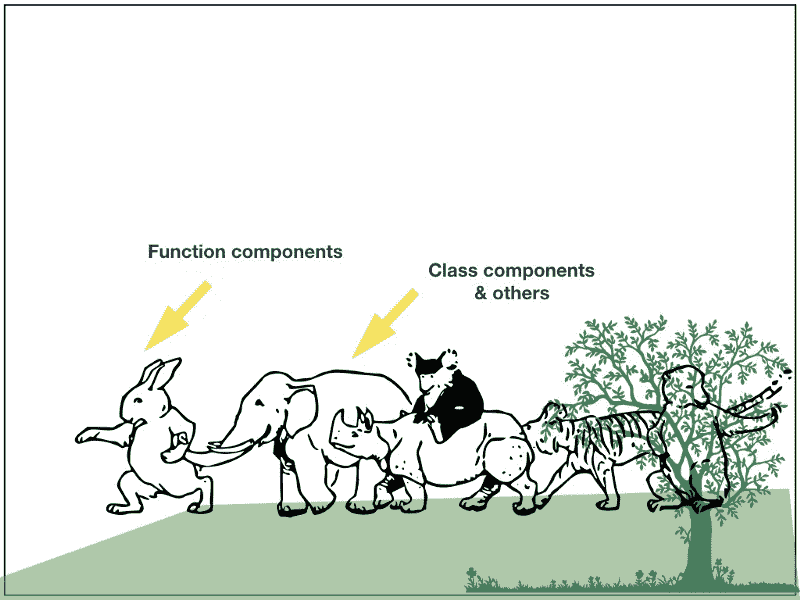*

*这是 Mia 的大胆声明。*

*所以，我们来考虑一下什么是钩子。*

#### *介绍钩子。*

*今年早些时候，2019 年，React 团队在版本`16.8.0.`中发布了新的附加功能 hooks*

*如果 React 是一大碗糖果，那么挂钩是最新的补充，非常耐嚼的糖果，味道很好！*

*那么，钩子到底是什么意思呢？为什么它们值得你花时间？*

*React 中添加钩子的主要原因之一是提供一种更强大、更有表现力的方式来编写(和共享)组件之间的功能。*

> *从长远来看，我们希望钩子成为人们编写 React 组件的主要方式*

*如果钩子真的那么重要，为什么不用一种有趣的方式来了解它们呢！*

#### *糖果碗。*

*把 React 想象成一碗漂亮的糖果。*

**

*这碗糖果对世界各地的人们有着不可思议的帮助。*

**

*制作这碗糖果的人意识到，碗里的一些糖果对人们没有多大好处。*

*一些糖果尝起来很棒，是的！但是当人们吃它们时，它们带来了一些复杂性——想想渲染道具和高阶组件？*

*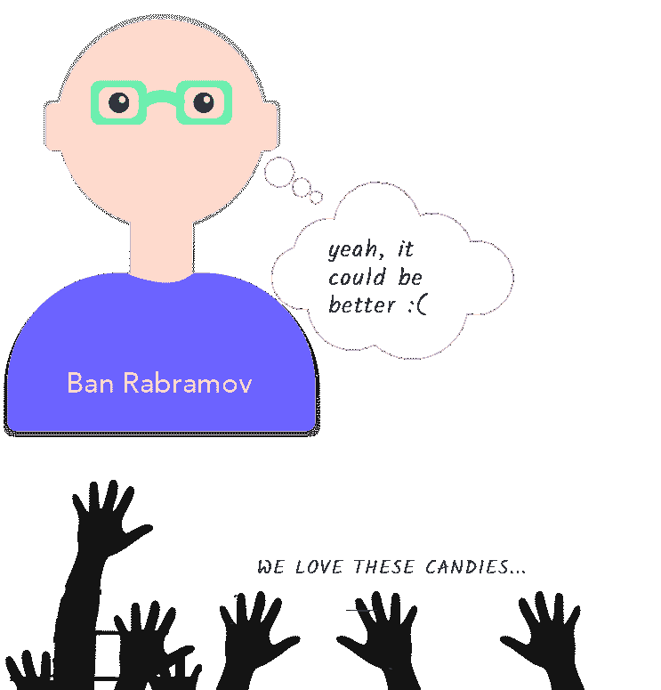*

*那么，他们做了什么？*

**

*他们做了正确的事情——没有扔掉所有以前的糖果，而是制作了新的糖果。*

*这些糖果被称为挂钩。*

**

*这些糖果的存在只有一个目的:**让你更容易做你已经在做的事情**。*

**

*这些糖果并不特别。事实上，当你开始吃它们时，你会意识到它们尝起来很熟悉——它们只是 **Javascript 函数**！*

**

*和所有好的糖果一样，这 10 种新糖果都有它们独特的名字。虽然它们统称为**钩子**。*

*他们的名字总是以三个字母的单词开头，使用…例如`useState`、`useEffect`等。*

*就像巧克力一样，这 10 种糖果都有一些相同的成分。了解一种食物的味道，有助于你与另一种食物产生共鸣。*

*听起来很有趣？现在让我们吃这些糖果吧。*

#### *州钩。*

*如前所述，钩子是函数。官方说法是，他们有 10 个人。10 个新功能，使组件中的编写和共享功能更具表现力。*

*我们要看的第一个钩子叫做，`useState`。*

*很长一段时间，你不能在一个功能组件中使用本地状态。直到胡克丝。*

*使用`useState`，您的功能组件可以拥有(并更新)本地状态。*

*多有趣啊。*

*考虑以下计数器应用:*

**

*计数器组件如下所示:*

*很简单，是吧？*

*让我问你一个简单的问题。我们为什么要将这个组件作为`Class`组件？*

*答案很简单，因为我们需要跟踪组件中的一些本地状态。*

*现在，同样的组件被重构为一个功能组件，可以通过`useState`钩子访问状态。*

*有什么不同？*

*我会一步一步地教你。*

*一个功能组件没有所有的`Class extend ...`语法。*

```
*`function CounterHooks() {}`*
```

*它也不需要 render 方法。*

```
*`function CounterHooks() {    return (      <div>        <h3 className="center">Welcome to the Counter of Life </h3>        <button           className="center-block"           onClick={this.handleClick}> {count} </button>      </div>    ); }`*
```

*上面的代码有两个问题。*

*   *你不应该在函数组件中使用`this`关键字。*
*   *`count`状态变量尚未定义。*

*将`handleClick`提取到功能组件中的一个独立功能:*

```
*`function CounterHooks() {  const handleClick = () => {   }  return (      <div>        <h3 className="center">Welcome to the Counter of Life </h3>        <button           className="center-block"           onClick={handleClick}> {count} </button>      </div>    ); }`*
```

*在重构之前，count 变量来自类组件的 state 对象。*

*在功能组件中，通过钩子，这来自于调用`useState`函数或钩子。*

*用一个参数调用`useState`，初始状态值，例如`useState(0)`，其中 0 表示要跟踪的初始状态值。*

*调用这个函数会返回一个包含两个值的数组。*

```
*`//? returns an array with 2 values. useState(0)`* 
```

*第一个值是当前被跟踪的`state`值，第二个是更新`state`值的函数。*

*把这想象成一些`state`和`setState`的复制品——然而，它们并不完全相同。*

*有了这些新知识，下面是`useState`的行动。*

```
*`function CounterHooks() {  // ?   const [count, setCount] = useState(0);  const handleClick = () => {    setCount(count + 1)  }  return (      <div>        <h3 className="center">Welcome to the Counter of Life </h3>        <button           className="center-block"           onClick={handleClick}> {count} </button>      </div>    ); }`* 
```

*除了代码的简单性之外，还有一些事情需要注意。*

*第一，由于调用`useState`会返回一个值数组，这些值很容易被析构为单独的值，如下所示:*

```
*`const [count, setCount] = useState(0);`*
```

*另外，请注意重构代码中的`handleClick`函数不需要任何对`prevState`或类似内容的引用。*

*它只是用新值`count + 1`调用`setCount`。*

*听起来很简单，你已经用钩子构建了你的第一个组件。我知道这是一个人为的例子，但这是一个好的开始！*

***注意**:也可以将一个函数传递给状态更新函数。当状态更新依赖于先前的状态值(如`setCount(prevCount => prevCount +` 1)时，通常推荐使用`setState`*

#### *多个 useState 调用。*

*对于类组件，我们都习惯于在一个对象中设置状态值，不管它们包含单个属性还是多个属性。*

```
*`// single property state = {  count: 0}// multiple properties state = { count: 0, time: '07:00'}`*
```

*你可能已经注意到了细微的差别。*

*在上面的例子中，我们只用实际的初始值调用了`useState`。不是保存值的对象。*

```
*`useState(0)`*
```

*那么，如果我们想跟踪另一个状态值呢？*

*可以使用多个`useState`调用吗？*

*考虑下面的组件。这是同一个反向应用程序，只是有所不同。这一次，计数器记录点击的时间。*

*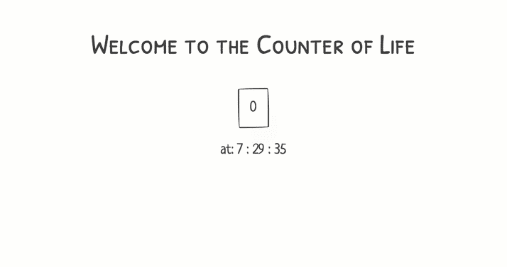*

*如您所见，钩子的用法完全相同，除了有一个新的`useState`调用。*

```
*`const [time, setTime] = useState(new Date())`*
```

*现在，在呈现的标记中使用了`time`状态变量来显示点击的小时、分钟和秒。*

```
*`<p>     at: {`${time.getHours()} : ${time.getMinutes()} :${time.getSeconds()}`}  </p>`*
```

*太好了！*

#### *对象作为初始值*

*有没有可能使用一个带有`useState`的对象，而不是多个`useState`调用？*

*绝对的！*

*如果您选择这样做，您应该注意到，与`setState`调用不同，传递给`useState`的值替换了状态值。*

*`setState`合并对象属性，但`useState`替换整个值。*

#### *效果挂钩。*

*对于类组件，您可能会产生一些副作用，如日志记录、获取数据或管理订阅。*

*这些副作用可以简称为“效果”，效果钩子，`useEffect`就是为此而产生的。*

*怎么用的？*

*嗯，`useEffect`钩子是通过传递给它一个函数来调用的，在这个函数中你可以执行你的副作用。*

*下面是一个简单的例子:*

```
*`useEffect(() => {  // ? you can perform side effects here  console.log("useEffect first timer here.")})`* 
```

*为了`useEffect`,我传递了一个匿名函数，其中调用了一些副作用。*

*下一个逻辑问题是，什么时候调用`useEffect`函数？*

*好吧，记住在类组件中你有生命周期方法，比如`componentDidMount`和`componentDidUpdate`。*

*由于功能组件没有这些生命周期方法，`useEffect` *有点像*取代了它们的位置。*

*因此，在上面的例子中，`useEffect`中的函数，也称为效果函数，将在功能组件安装(`componentDidMount`)和组件更新`componentDidUpdate`时被调用。*

*这就是实际情况。*

*通过将上面的`useEffect`调用添加到计数器应用程序中，我们确实从`useEffect`函数中获得了日志。*

**

*默认情况下，每次渲染后都会调用`useEffect`函数。*

***NB** :这个`useEffect`钩子和`componentDidMount` + `componentDidUpdate`不完全一样。可以这么看，但是实现有一些细微的不同。*

#### *传递数组依赖关系。*

*有趣的是，每次有更新时都会调用效果函数。这很好，但并不总是理想的功能。*

*如果你只想在组件挂载的时候运行效果函数呢？*

*这是一个常见的用例，`useEffect`接受第二个参数，一个依赖数组来处理这个问题。*

*如果传入一个空数组，效果函数只在挂载时运行，后续的重新渲染不会触发效果函数。*

```
*`useEffect(() => {    console.log("useEffect first timer here.")}, [])`*
```

*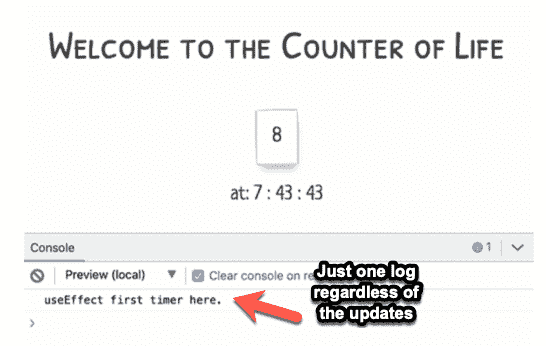*

*如果您将任何值传递到这个数组中，那么 effect 函数将在 mount 上运行，并且随时更新传递的值。也就是说，如果任何值发生变化，受影响的调用将重新运行。*

```
*`useEffect(() => {    console.log("useEffect first timer here.")}, [count])`*
```

*效果函数将在装载时运行，并且每当计数函数改变时运行。*

*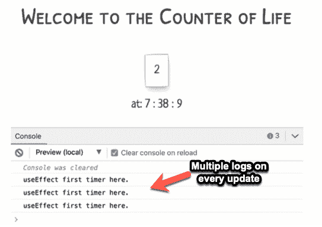*

*订阅呢？*

*在某些应用中订阅和退订某些效果是很常见的。*

*请考虑以下情况:*

```
*`useEffect(() => {  const clicked = () => console.log('window clicked');  window.addEventListener('click', clicked);}, [])`*
```

*在上面的效果中，在安装时，一个点击事件监听器被附加到窗口。*

*当组件被卸载时，我们如何取消订阅这个监听器？*

*嗯，`useEffect`考虑到这一点。*

*如果你在你的效果函数中返回一个函数，它将在组件卸载时被调用。这是取消订阅的最佳位置，如下所示:*

```
*`useEffect(() => {    const clicked = () => console.log('window clicked');    window.addEventListener('click', clicked);`*
```

```
 *`return () =>; {      window.removeEventListener('click', clicked)    } }, [])`*
```

*使用 useEffect 钩子可以做更多的事情，比如进行 API 调用。*

#### *打造你自己的钩子*

*从钩子部分开始，我们从 React 提供的糖果盒中取出(并使用)糖果。*

*然而，React 也为你提供了一种制作自己独特糖果的方法——称为定制挂钩。*

*那么，这是怎么做到的呢？*

*自定义钩子只是一个常规函数。但是，它的名字必须以单词开头， **use** ，如果需要，它可以调用自己内部的任何一个 React 钩子。*

*下面是一个例子:*

#### *钩子的规则*

*使用钩子时有两条规则要遵守。*

*   *仅调用顶层的钩子，即不在条件、循环或嵌套函数中。*
*   *仅从 React 函数调用挂钩，即功能组件和自定义挂钩。*

*这个 ESLint [插件](https://www.npmjs.com/package/eslint-plugin-react-hooks)非常棒，可以确保你在项目中遵守这些规则。*

### *高级挂钩*

*我们只考虑了 React 提供的 10 个挂钩中的 2 个！*

*有趣的是，`useState`和`useEffect`如何工作的知识可以帮助你快速学习其他的钩子。*

*出于对这些的好奇，我创建了一个包含可编辑实例的 [hooks cheatsheet](https://github.com/ohansemmanuel/react-hooks-cheatsheet) 。*

*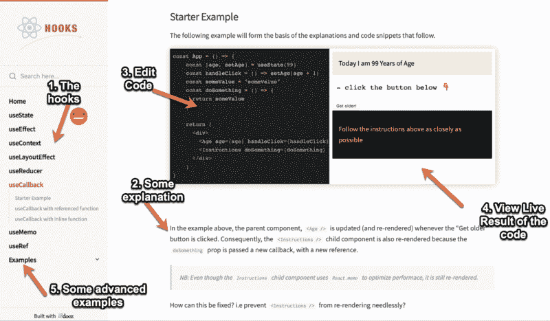*

*为什么这很重要是因为你可以立即开始修补真实的例子，这将加强你对钩子如何工作的知识。所有人！*

*记住，当你真正解决问题和构建东西时，学习会得到加强。*

*更有趣的是，在您了解了每个钩子的实例之后，还有一个额外的部分，用于介绍不完全适合一个钩子或者需要单独案例研究的其他通用示例。*

*在示例部分，您会发现[示例](https://react-hooks-cheatsheet.com/examples/fetching-data)，比如使用钩子从远程服务器获取数据等等。*

*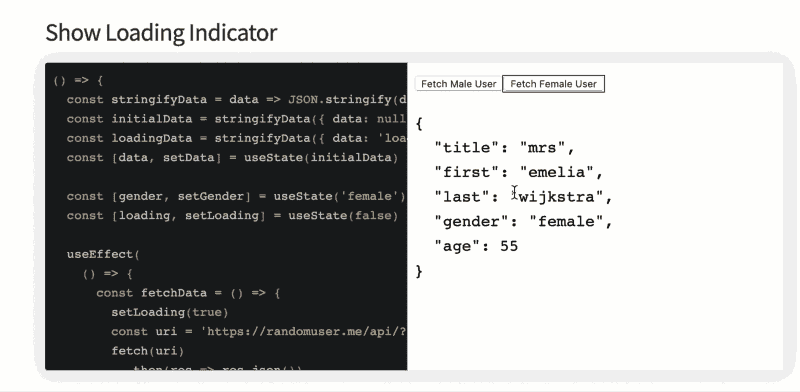

Live example from the cheatsheet.* 

*去，[去看看](https://github.com/ohansemmanuel/react-hooks-cheatsheet)。*

### *第 8 章:带钩子的高级反应模式*

**

*随着钩子的释放，某些反应模式已经失宠。它们仍然可以使用，但是对于大多数用例来说，使用钩子可能更好。例如，选择钩子而不是渲染道具或高阶组件。*

*可能有一些特定的用例仍然可以使用它们，但是大多数情况下，选择钩子。*

*也就是说，我们现在将考虑一些用钩子实现的更高级的 React 模式。*

*准备好了吗？*

#### *介绍*

*这一章可能是书中最长的一章，这是有充分理由的。钩子很可能是我们在未来几年内编写 React 组件的方式，因此它们非常重要。*

*在本章中，我们将考虑以下高级反应模式:*

*   *复合组件*
*   *道具收藏*
*   *道具吸气剂*
*   *状态初始化器*
*   *状态缩减器*
*   *控制道具*

*如果您对这些高级模式完全陌生，不要担心，我会详细解释它们。如果您从以前的类组件经验中熟悉这些模式是如何工作的，我将向您展示如何将这些模式与钩子一起使用。*

*现在，让我们开始吧。*

#### *为什么是高级模式？*

*约翰的事业相当不错。今天，他是 ReactCorp 的高级前端工程师。一个改变世界的伟大的创业公司。*

*ReactCorp 开始扩大员工规模。许多工程师被雇佣，John 开始为整个工程师团队构建可重用的组件。*

*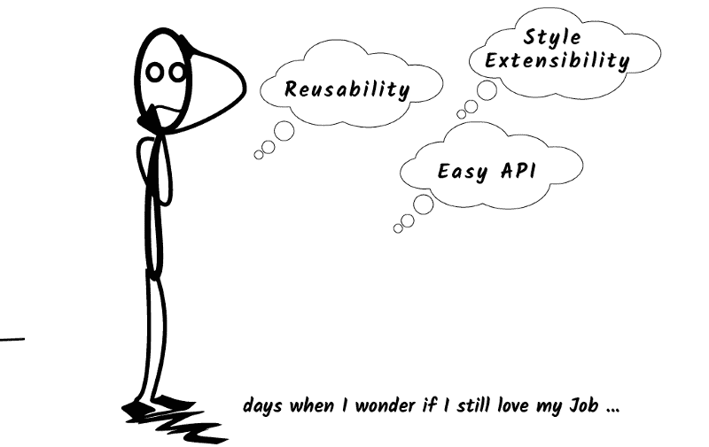*

*是的，John 可以用他目前的 React 技能构建组件，但是，构建高度可重用的组件会带来一些特定的问题。*

*组件有一百万种不同的使用方式，你需要给组件的消费者尽可能多的灵活性。*

*他们必须能够扩展他们认为合适的组件的功能和样式。*

*我们将在这里考虑的高级模式是经过测试和尝试的方法，用于构建非常可重用的组件，而不会削弱灵活性。*

*我没有创造这些先进的模式。说实话，大多数高级的 React 模式都是由一个人 [Kent Dodds](https://kentcdodds.com) 流行起来的，他是一个了不起的 Javascript 工程师。*

*社区已经很好地接受了这些模式，我在这里帮助您了解它们是如何工作的！*

#### *复合组件模式*

*我们将考虑的第一个模式称为复合组件模式。我知道这听起来很奇怪，所以我会解释它的真正含义。*

*模式名中的关键词是单词*复合词*。*

*从字面上看， *compound* 这个词指的是由两个或更多独立元素组成的东西。*

*对于反应组分，这可能意味着由两种或多种单独组分组成的组分。*

*这还没有结束。*

*任何反应组分都可以由两种或多种单独的组分组成。所以，这真的不是描述复合组分的好方法。*

*对于复合组件，还有更多。没有父组件，组成主组件的独立组件实际上无法使用。*

*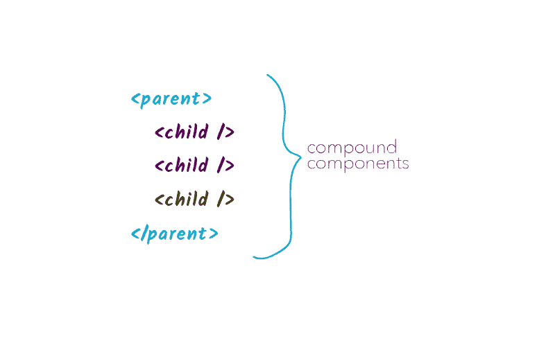

compound components* 

*主组件通常称为父组件，而独立的组合组件称为子组件。*

*经典的例子是考虑`html`选择元素。*

```
*`<select>  <option value="value0">key0</option>  <option value="value1">key1</option>  <option value="value2">key2</option></select>`*
```

*其中`select`是父元素，而许多`option`元素是子元素。*

*这就像一个复合组件。首先，使用`<option>key0<`确实没有意义；/option >删除一个选择的父标签。select 元素的整体`aviour`也依赖于具有`se com`设定的 option 元素。*

*他们是如此紧密地联系在一起。*

*此外，整个组件的状态由`select`管理，所有子元素都依赖于该状态。*

*你现在知道什么是复合成分了吗？*

*同样值得一提的是，复合组件只是表达组件 API 的众多方式之一。*

*例如，虽然看起来不太好，但是`select`元素可以被设计成这样工作:*

```
*`<select options="key:value;anotherKey:anotherValue"><;/select>`*
```

*这绝对不是这个 API 最好的表达方式。这使得向子组件传递属性几乎是不可能的。*

*记住这一点，让我们看一个例子，它将帮助您理解和构建您自己的复合组件。*

#### *示例:构建可扩展组件。*

*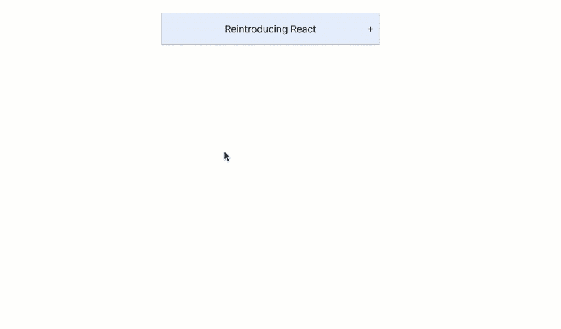

The final component being used* 

*我们将构建一个`Expandable`组件。你问过那是什么意思吗？*

*嗯，考虑一个`Expandable`组件是一个微型手风琴元素。它有一个可点击的标题，用于切换相关内容的显示。*

*在未展开状态下，组件将如下所示:*

**

*这个，展开后:*

**

*你明白了，对吧？*

#### *设计 API*

*在构建组件之前，写出组件的公开 API 是什么样子通常是个好主意。*

*在这种情况下，我们的目标是:*

```
*`<Expandable>	<Expandable.Header> Header </Expandable.Header> 	<Expandable.Icon/>    <Expandable.Body> This is the content &lt;/Expandable.Body></Expandable>`*
```

***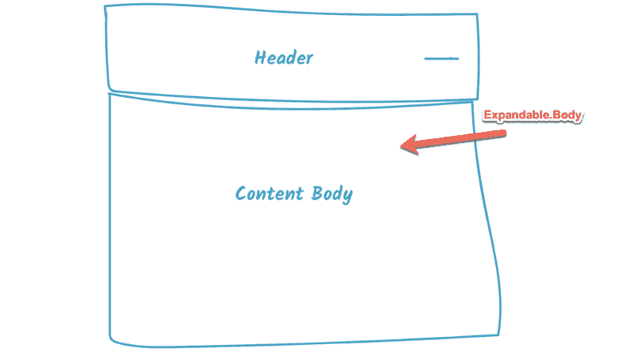

A break down of the child components* 

*在上面的代码块中，你会注意到我有这样的表达式:`Expandable.Header`*

*你也可以这样做:*

```
*`<Expandable>	<Header> Header </Expandable.Header> 	<Icon/>    <Body> This is the content </Body></Expandable>`*
```

*没关系。出于个人喜好，我选择了`Expandable.Header`而不是`Header`。我发现它很好地传达了对父组件的依赖，但这只是我的偏好。很多人没有相同的偏好，这很好。*

*这是你的组件，用你喜欢的 API:)*

#### *构建可扩展组件*

*作为父组件的`Expandable`组件将跟踪状态，它将通过一个名为`expanded`的布尔变量来完成。*

```
*`// state {  expanded: true || false}`*
```

*`Expandable`组件需要将状态传达给每个子组件，而不管它们在嵌套组件树中的位置。*

*请记住，子组件依赖于父复合组件的状态。*

*我们怎样做最好？*

*如果你说的是`context`，那你就对了！*

*我们需要创建一个`context`对象来保存组件状态，并通过`Provider`组件公开`expanded`属性。除了`expanded`属性，我们还将公开一个函数回调来切换这个`expanded`状态属性的值。*

*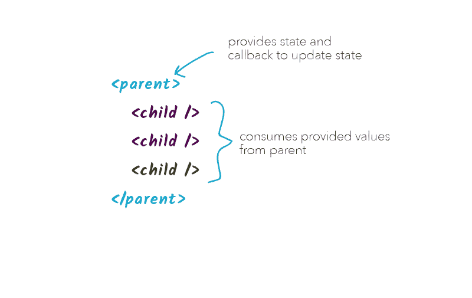

the state relationship for the expandable component* 

*如果你觉得这听起来不错，这里是`Expandable`组件的起点。*

```
*`// Expandable.js import React, { createContext } from 'react'`*
```

```
*`const ExpandableContext = createContext()const { Provider } = ExpandableContext`*
```

```
*`const Expandable = ({children}) => {  return <Provider>{children}</Provider>}export default Expandable`*
```

*在上面的代码块中没有发生什么惊人的事情。*

*创建一个上下文对象并解构`Provider`组件。然后我们继续创建呈现`Provider`和任何`children`的`Expandable`组件。*

*明白了吗？*

*基本设置完成后，让我们再做一点。*

*创建的上下文对象没有初始值。然而，我们需要`Provider`来公开状态值`expanded`和一个切换函数来更新状态。*

*让我们使用`useState`创建`expanded`状态值。*

```
*`// Expandable.js`* 
```

```
*`import React, { createContext, useState } from 'react'...const Expandable = ({children}) => {  // look here ?  const [expanded, setExpanded] = useState(false)`* 
```

```
 *`return <Provider>{children}</Provider>}`*
```

*随着`expanded`状态变量的创建，让我们创建`toggle`更新器函数来切换`expanded`的值——无论是`true`还是`false`。*

```
*`// Expandable.js ...const Expandable = ({children}) => {  const [expanded, setExpanded] = useState(false)  // look here ?  const toggle = setExpanded(prevExpanded => !prevExpanded)`* 
```

```
 *`return <Provider>{children}</Provider>}`*
```

*`toggle`函数调用`setExpanded`，从`useState`调用返回的实际更新函数。*

*来自`useState`调用的每个更新函数都可以接收一个函数参数。这类似于你如何传递一个函数给`setState`，例如`setState(prevState => !prevState.val` ue。*

*这和我上面做的是一样的。传递给`setExpanded`的函数接收`expanded`的前一个值，并返回与之相反的值`!expanded`*

*`toggle`作为一个回调函数，它最终会被`Expandable.Header`调用。让我们通过记住回调来防止将来出现任何性能问题。*

```
*`... import { useCallback } from 'react';`*
```

```
*`const Expandable = ({children}) => {  const [expanded, setExpanded] = useState(false)  // look here ?  const toggle = useCallback(    () => setExpanded(prevExpanded => !prevExpanded),    []  ))return <Provider>{children}</Provider>`* 
```

*不确定`useCallback`如何工作？您可能跳过了前面指向备忘单的高级钩子部分。[看一看](https://react-hooks-cheatsheet.com/usecallback)。*

*一旦我们创建了`expanded`和`toggle`，我们就可以通过`Provider`的价值主张来公开它们。*

```
*`...const Expandable = ({children}) => {  const [expanded, setExpanded] = useState(false)  const toggle = useCallback(    () => setExpanded(prevExpanded => !prevExpanded),    []  )   // look here ?  const value = { expanded, toggle }   // and here ?  return <;Provider value={value}>{children}</Provider>}`* 
```

*这是可行的，但是`value`引用在每次重新渲染时都会不同，导致`Provider`重新渲染其子对象。*

*让我们记住这个`value`。*

```
*`...const Expandable = ({children}) => {  ... // look here ?  const value = useMemo(	() => ({ expanded, toggle }), 	[expanded, toggle]  )  return <Provider value={value}>{children}&lt;/Provider>}`* 
```

*`useMemo`接受一个返回对象值`{ expanded, toggle }`的回调，我们传递一个数组依赖关系`[expanded, toggle]`，这样被记忆的值就保持不变，除非这些值发生变化。*

*到目前为止，我们已经做得很好了！*

*现在，在`Expandable`父组件上还有一件事要做。*

*如果您还记得以前使用类组件的经验，可以这样做:*

```
*`this.setState({  name: "value"}, () => {  this.props.onStateChange(this.state.name)})`*
```

*这就是在类组件状态改变后触发回调的方式。*

*通常，回调如`this.props.onStateChange`总是使用更新状态的当前值来调用，如下所示:*

```
*`this.props.onStateChange(this.state.name)`*
```

*为什么这很重要？*

*在创建可重用组件时，这是一个很好的实践，因为通过这种方式，组件的使用者可以附加任何自定义逻辑，以便在状态更新后运行。*

*例如:*

```
*`const doSomethingPersonal = ({expanded}) => {  // do something really important after being expanded}`*
```

```
*`<Expandable onExpanded={doSomethingPersonal}> ... </Expandable>`*
```

*我们将把这个功能添加到`Expanded`组件中。*

*对于类组件，这非常简单。对于功能组件，我们需要多做一点工作——没有那么多:)*

*在大多数情况下，每当您想要在功能组件中执行副作用时，总是要使用`useEffect`。*

*因此，最简单的解决方案可能是这样的:*

```
*`useEffect(() => {  props.onExpanded(expanded)}, [expanded])`*
```

*然而，这样做的问题是,`useEffect`效果函数至少被调用一次——当组件最初被安装时。*

*因此，即使有一个依赖数组`[expanded]`，回调也将在组件挂载时被调用！*

```
*`useEffect(() => {  // this function will always be invoked on mount})`*
```

*我们寻求的功能要求用户传递的回调在挂载时不被调用。*

*我们如何执行这一点？*

*首先，考虑下面这个简单的解决方案:*

```
*`//faulty solution... let componentJustMounted = trueuseEffect(    () => {        if(!componentJustMounted) {        props.onExpand(expanded)        componentJustMounted = false      }    },    [expanded]  )...`*
```

*上面的代码有什么问题？*

*粗略地说，代码背后的思想是正确的。你跟踪某个变量`componentJustMounted`并将其设置为`true`，只有当`componentJustMounted`为假时才调用用户回调`onExpand`。*

*只有在用户回调至少被调用一次后，`componentJustMounted`值才会被设置为`false`。*

*看起来不错。*

*然而，这样做的问题是，每当函数组件由于状态或属性改变而重新呈现时，`componentJustMounted`值将总是被重置为`true`。因此，用户回调`onExpand`永远不会被调用，因为它只在`componentJustMounted`为假时被调用。*

```
*`...if (!componentJustMounted) {    	onExpand(expanded)}...`*
```

*解决这个问题的方法很简单。我们可以使用`useRef`钩子来确保一个值在组件的整个生命周期中保持不变。*

*它是这样工作的:*

```
*`//correct implementation  const componentJustMounted = useRef(true)  useEffect(    () => {      if (!componentJustMounted.current) {        onExpand(expanded)      }      componentJustMounted.current = false    },    [expanded]  )`*
```

*`useRef`返回一个`ref`对象，存储在该对象中的值可以从`ref.current`中检索*

*`useRef`的签名是这样的:`useRef(initialValue)`。*

*因此，最初存储在`componentJustMounted.current`中的是一个 ref 对象，其`current`属性设置为`true`。*

```
*`const componentJustMounted = useRef(true)`*
```

*在调用用户回调之后，我们将这个值更新为`false`。*

```
*`componentJustMounted.current = false`*
```

*现在，无论何时状态或属性发生变化，ref 对象中的值都不会被篡改。它保持不变。*

*在当前的实现中，无论何时切换`expanded`状态值，用户回调函数`onExpanded`都将被当前值`expanded`调用。*

*下面是`Expandable`组件的最终实现:*

```
*`// Expandable.js const Expandable = ({ children, onExpand }) => {  const [expanded, setExpanded] = useState(false)  const toggle = useCallback(    () => setExpanded(prevExpanded => !prevExpanded),    []  )  const componentJustMounted = useRef(true)  useEffect(    () => {      if (!componentJustMounted) {        onExpand(expanded)      }       componentJustMounted.current = false    },    [expanded]  )  const value = useMemo(   () => ({ expanded, toggle }),    [expanded, toggle]  )  return (    <Provider value={value}>        {children}    </Provider>  )}`*
```

*如果你已经跟上了，那很好。我们已经找出了这一堆中最复杂的部分。现在，让我们构建子组件。*

#### *构建复合子组件*

*`Expandable`组件有三个子组件。*

*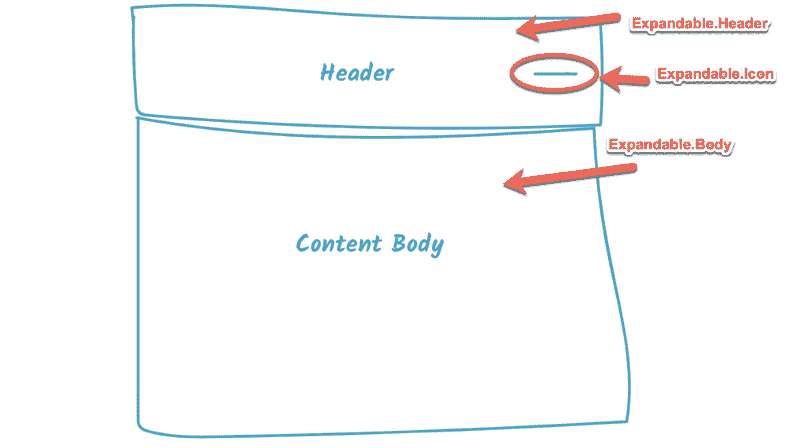*

*这些子组件需要使用在`Expandable.js`中创建的上下文对象的值。*

*为了实现这一点，我们将进行如下所示的重构:*

```
*`export const ExpandableContext = createContext()`*
```

*我们从`Expandable.js`中导出上下文对象`ExpandableContext`。*

*现在，我们可以使用`useContext`钩子来消耗来自`Provider`的值。*

*下面是完全实现的`Header`子组件。*

```
*`//Header.jsimport React, { useContext } from 'react'import { ExpandableContext } from './Expandable'`*
```

```
*`const Header = ({children}) => {  const { toggle } = useContext(ExpandableContext)  return <div onClick={toggle}>{children}</div>}export default Header`*
```

*很简单，是吧？*

*它呈现一个`div`，其`onClick`回调是用于在`Expandable`父组件中切换`expanded`状态的`toggle`函数。*

*下面是`Body`子组件的实现:*

```
*`// Body.jsimport { useContext } from 'react'import { ExpandableContext } from './Expandable'`*
```

```
*`const Body = ({ children }) => {  const { expanded } = useContext(ExpandableContext)  return expanded ? children : null}export default Body`*
```

*也很简单。*

*从上下文对象中检索出`expanded`值，并在呈现的标记中使用。它是这样读的:如果展开，render `children`否则不渲染任何东西。*

*组件也一样简单。*

```
*`// Icon.jsimport { useContext } from 'react'import { ExpandableContext } from './Expandable'`*
```

```
*`const Icon = () => {  const { expanded } = useContext(ExpandableContext)  return expanded ? '-' : '+'}export default Icon`*
```

*它根据从上下文对象中检索到的`expanded`的值来呈现`+`或`-`。*

*构建完所有子组件后，我们可以将子组件设置为`Expandable`属性。见下文:*

```
*`import Header from './Header'import Icon from './Icon'import Body from './Body'`*
```

```
*`const Expandable = ({ children, onExpand }) => {	...}`*
```

```
*`// Remember this is just a personal reference. It's not mandatoryExpandable.Header = HeaderExpandable.Body = BodyExpandable.Icon = Icon`*
```

*现在我们可以按照设计继续使用`Expandable`组件:*

```
*`<Expandable>    <Expandable.Header>React hooks</Expandable.Header>           <Expandable.Icon />    <Expandable.Body>Hooks are awesome&lt;/Expandable.Body></Expandable>`*
```

*有用吗？*

*你打赌！*

*以下是未展开时渲染的内容:*

**

*展开后:*

**

*这个可以工作，但它必须是我见过的最丑的组件。我们可以做得更好。*

#### *可重用组件的可管理样式*

*不管你喜不喜欢，样式(或者 CSS)是网络工作方式不可或缺的一部分。*

*虽然有很多方式来设计一个`React`组件的样式，我相信你有一个最喜欢的，当你构建可重用的组件时，公开一个无摩擦的 API 来覆盖默认样式总是一个好主意。*

*通常，我建议通过`style`和`className`道具让你的组件具有样式。*

*例如:*

```
*`// this should work.<MyComponent style={{name: "value"}} />// and this.<MyComponent className="my-class-name-with-dope-styles" />`*
```

*现在，我们的目标不仅仅是设计组件的样式，而是让它尽可能地可重用。这意味着让任何使用组件样式的人使用他们想要的组件，也就是说，通过`style`属性或者通过传递一些`className`属性来使用内联样式。*

*让我们从`Header`子组件开始:*

```
*`// before const Header = ({children}) => {  const { toggle } = useContext(ExpandableContext)  return <div onClick={toggle}>{children}</div>}`*
```

*首先，让我们将呈现的标记更改为一个`button`。与之前使用的`div`相比，这是一个更容易理解的语义替代方案。*

```
*`const Header = ({children}) => {  const { toggle } = useContext(ExpandableContext)  // look here ?  return <button onClick={toggle}>{children}<;/button>}`* 
```

*我们现在将在一个`Header.css`文件中为`Header`组件编写一些默认样式。*

```
*`// Header.css.Expandable-trigger {    background: none;    color: hsl(0, 0%, 13%);    display: block;    font-size: 1rem;    font-weight: normal;    margin: 0;    padding: 1em 1.5em;    position: relative;    text-align: left;    width: 100%;    outline: none;    text-align: center;  }    .Expandable-trigger:focus,  .Expandable-trigger:hover {    background: hsl(216, 94%, 94%);  }`*
```

*上面简单的 CSS 你肯定能搞清楚。如果没有，就不要强调。重要的是要注意这里使用的缺省值`className`，`.Expandable-trigger`*

*要应用这些样式，我们需要导入`CSS`文件，并将适当的`className`道具应用到渲染的`button`。*

```
*`... import './Header.css'const Header = () => {  const { toggle } = useContext(ExpandableContext)  return <button onClick={toggle} 	 className="Expandable-trigger">	{children}&lt;/button>}`*
```

*这很有效，但是`className`被设置为默认字符串`Expandable-trigger`。*

*这将应用我们在`CSS`文件中编写的样式，但是它不考虑用户传入的任何`className`属性。*

*适应传递这个`className`属性是很重要的，因为用户可能想改变你在`CSS`中设置的默认样式。*

*有一种方法可以做到这一点:*

```
*`// Header.jsimport './Header.css'const Header = ({ children, className}) => {  // look here ?  const combinedClassName = `Expandable-trigger ${className}`  return (    <button onClick={toggle} className={combinedClassName}>      {children}    </button>  )}`* 
```

*现在，无论什么`className`被传递给`Header`组件，都将在被传递给呈现的`button`元素之前与`default` `Expandable-trigger`组合。*

*让我们考虑一下当前的解决方案有多好。*

*首先，如果`className`道具是`null`或`undefined`，`combinedClassName`变量将保存值`"Expandable-trigger null"`或`"Expandable-trigger undefined".`*

*为了防止这种情况，请确保使用 ES6 默认参数语法传递一个`className`,如下所示:*

```
*`// note how className defaults to an empty stringconst Header = ({ children, className = '' }) => {  ...}`*
```

*提供默认值后，如果用户仍然没有输入`className`，`combinedClassName`值将等于`"Expandable-trigger "`。*

*注意追加到`Expandable-trigger`的空字符串。这是由于模板文字的工作方式。*

*我的首选解决方案是这样做:*

```
*`const combinedClassName = ['Expandable-trigger', className].join('')`*
```

*这个解决方案处理前面讨论的边缘情况。如果您还想明确删除`null`、`undefined`或任何其他假值，您可以执行以下操作:*

```
*`const combinedClassName = ['Expandable-trigger', className].filter(Boolean).join('')`*
```

*我将坚持使用更简单的方法，通过默认参数为`className`提供默认值。*

*话虽如此，下面是`Header`的最终实现:*

```
*`// after ...import './Header.css'const Header = ({ children, className = ''}) => {  const { toggle } = useContext(ExpandableContext)  const combinedClassName = ['Expandable-trigger', className].join('')`*
```

```
*`return (    <button onClick={toggle} className={combinedClassName}>      {children}    </button>  )}`*
```

*到目前为止，一切顺利。*

*如果你想知道，`combinedClassName`返回一个字符串。因为字符串是通过值来比较的，所以没有必要用`useMemo`来记忆这个值。*

*到目前为止，我们已经很好地处理了`className`道具。通过传递一个`style`属性来覆盖默认样式的选项怎么样？*

*好吧，我们来解决这个问题。*

*我们可以将用户传递的任何其他属性传递给`button`组件，而不是显式地析构`style`属性。*

```
*`// rest paramter ...otherProps ?const Header = ({ children, className = '', ...otherProps }) => {	return (    // spread syntax {...otherProps} ?    <button {...otherProps}>      {children}    </button>  )}`* 
```

*注意[休止符参数](https://developer.mozilla.org/en-US/docs/Web/JavaScript/Reference/Functions/rest_parameters)和[扩展语法](https://developer.mozilla.org/en-US/docs/Web/JavaScript/Reference/Operators/Spread_syntax)的使用。*

*完成后，`Header`组件接收我们的默认样式，但允许通过`className`或`style`道具进行更改。*

```
*`// override style via className<Expandable.Header className="my-class">	React hooks</Expandable.Header>`*
```

```
*`// override style via style prop<Expandable.Header style={{color: "red"}}>	React hooks</Expandable.Header>`*
```

*现在，我将继续对其他子组件`Body`和`Icon`进行同样的操作。*

```
*`// before const Body = ({ children }) => {  const { expanded } = useContext(ExpandableContext)  return expanded ? children : null}`*
```

```
*`// after import './Body.css'const Body = ({ children, className = '', ...otherProps }) => {  const { expanded } = useContext(ExpandableContext)  const combinedClassNames = ['Expandable-panel', className].join('')`*
```

```
 *`return expanded ? (    <div className={combinedClassNames} {...otherProps}>      {children}    </div>  ) : null}`*
```

```
*`// Body.css.Expandable-panel {    margin: 0;    padding: 1em 1.5em;    border: 1px solid hsl(216, 94%, 94%);;    min-height: 150px;  }`*
```

*对`Icon`组件进行同样的操作:*

```
*`// before const Icon = () => {  const { expanded } = useContext(ExpandableContext)  return expanded ? '-' : '+'}`*
```

```
*`// after ...import './Icon.css'const Icon = ({ className = '', ...otherProps }) => {  ...  const combinedClassNames = ['Expandable-icon', className].join('')`*
```

```
 *`return (    <span className={combinedClassNames} {...otherProps}>      {expanded ? '-' : '+'}    </span>  )}`*
```

```
*`// Icon.css.Expandable-icon {    position: absolute;    top: 16px;    right: 10px;}`*
```

*最后，父组件的一些样式，`Expandable`。*

```
*`import './Expandable.css'const Expandable = ({ children, onExpand, className = '', ...otherProps }) => {   ...   const combinedClassNames = ['Expandable', className].join('')  return (    <Provider value={value}>      <div className={combinedClassNames} {...otherProps}>        {children}      </div>    </Provider>  )}`*
```

```
*`// Expandable.css.Expandable {     position: relative;     width: 350px;}`*
```

*现在我们有了一个漂亮的可重用组件！*

***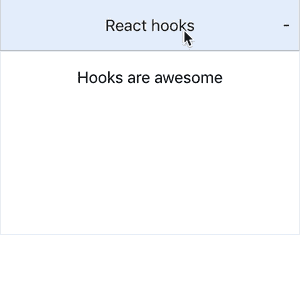*

*我们不仅让它变得漂亮，而且还可以定制。*

*我们构建的组件可定制程度如何？*

*看下面我用同样的组件做了什么！*

****

*这并不需要很多代码。*

```
*`<Expandable>    <Expandable.Header>Reintroducing React</Expandable.Header>    <Expandable.Icon />    <Expandable.Body>     	        <p style={{ opacity: 0.7 }}>          This book is so f*cking amazing! <br />        <a          href='https://leanpub.com/reintroducing-react'          target='_blank'          rel='noopener noreferrer'          >            Go get it now.        </a>       </p>     </Expandable.Body></Expandable>`*
```

*您可以进一步测试通过`style`属性覆盖样式是否也有效。*

```
*`<Expandable>   <Expandable.Header       // look here ?	  style={{ color: 'red', border: '1px solid teal' }}>        Reintroducing React    </Expandable.Header>        ...</Expandable>`* 
```

*下面是结果:*

*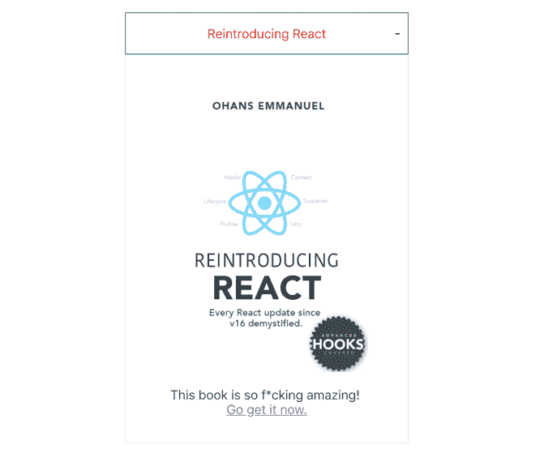

Default Header styles override with the style prop.* 

*耶！它像预期的那样工作。*

***注**:我已经在电子书 (PDF、Epub、Mobi)中介绍了另外 5 种带钩子的高级组件模式[。**你可以完全免费获得**(或者如果你喜欢我的作品，你可以支付任何费用)。](https://leanpub.com/reintroducing-react)*

*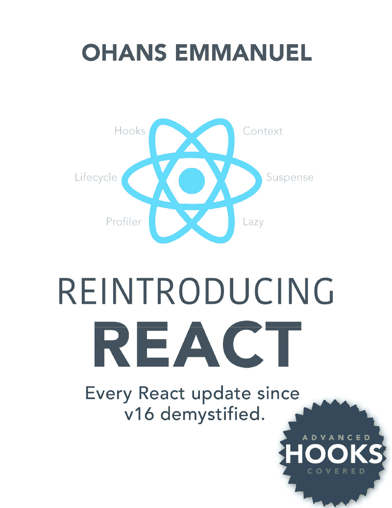

[https://leanpub.com/reintroducing-react](https://leanpub.com/reintroducing-react)* 

### *结论*

*这是一篇关于现代反应变化的长篇论述。如果你还没有完全理解，在日常工作中多花一点时间练习这些例子，我很肯定你会很快掌握的。*

*当你这样做的时候，去做一个对现代 React 有着相当理解的 React 工程师，去用高级钩子模式构建高度可重用的组件。*

*谢谢你跟随我踏上这段旅程。有问题吗？用评论区！*