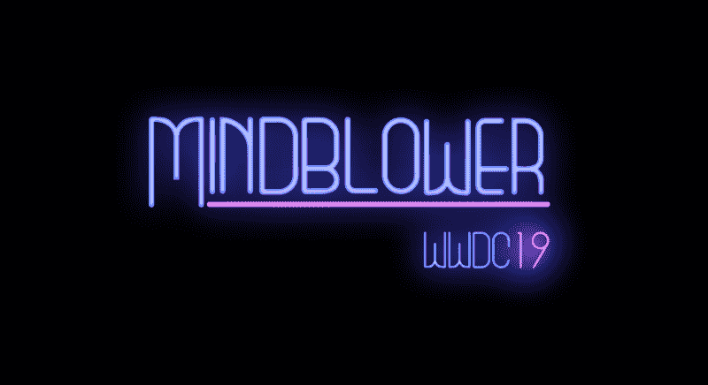
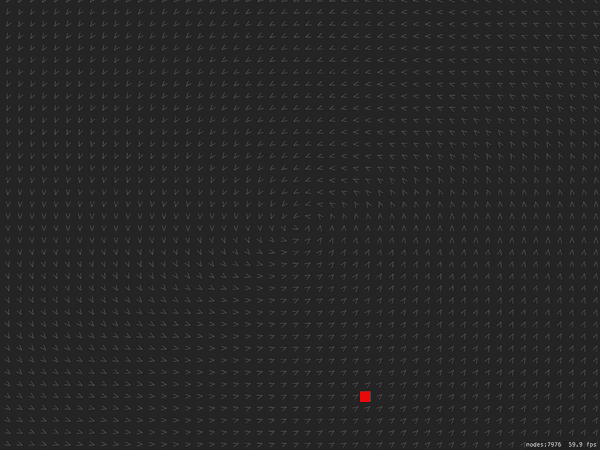
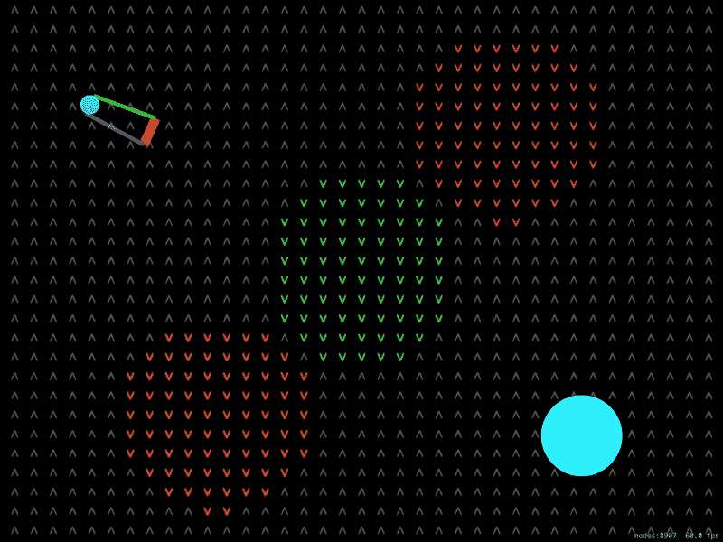
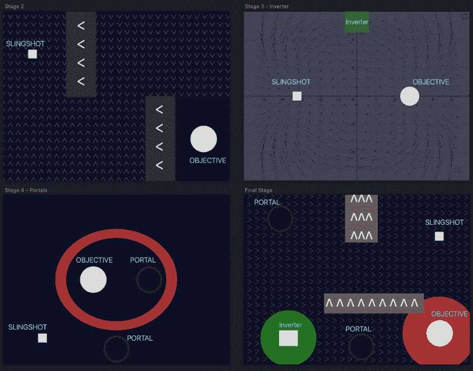
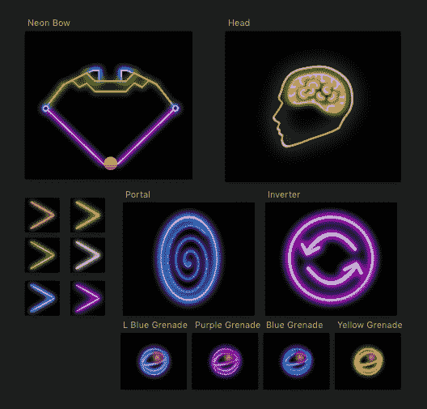
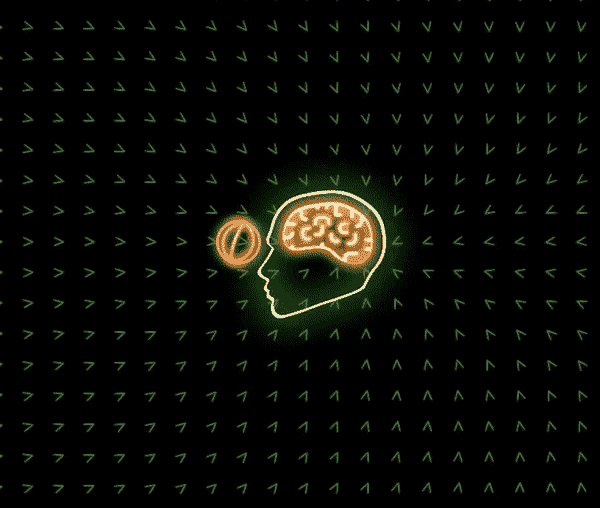

# 我是如何第二次获得参加苹果年度活动的奖学金的

> 原文：<https://www.freecodecamp.org/news/how-i-won-a-scholarship-to-apples-yearly-event-for-the-second-time-f04f5f4636b1/>

作者:雷南·马加宁

# 我是如何第二次获得参加苹果年度活动的奖学金的

### 介绍

这篇文章描述了 *Mindblower* 背后的过程，这款游戏是 *WWDC19 奖学金*的入选作品之一。现在已经在 [AppStore](https://itunes.apple.com/us/app/mindblower-the-game/id1460079689) 和 [GitHub](https://github.com/RenanMagagnin/mindblower-wwdc19) 上有售。

[*WWDC 奖学金*](https://developer.apple.com/wwdc19/scholarships/) 奖励来自世界各地的学生有机会参加苹果公司的年度活动。获得奖学金的开发者将免费获得一张 WWDC 机票、会议住宿和一年的*苹果开发者计划*会员资格。

我是苹果开发者学院的学生，这是我第二次获得奖学金——我去年的项目可以在这里找到。我对这个消息感到难以置信的兴奋，我想我会分享游戏背后的过程，让我再次获得这个机会。

在 *Mindblower* 中，目标是震撼心灵。为了实现这一点，玩家发射粘性手榴弹，这些手榴弹受到矢量场的影响。核心循环就是分析每一关，拿出方案，精准出手。

### 这个想法

灵感来自于对 2018 年*苹果设计奖*获奖者之一的 [*弗罗斯特*](https://www.youtube.com/watch?v=Ry7VFcDNUMA) 中的优化的好奇，以及 *3Blue1Brown* 关于矢量场的[视频的结合。](https://www.youtube.com/watch?v=rB83DpBJQsE)

这个想法是通过使用向量场方程来确定大量实体的速度，从而优化它们的运动。

An early prototype simulating a vortex vector field affecting small entities

### 游戏概念

上面展示的原型证明了这确实是游戏的基本机制。现在，是时候想出有趣游戏的主要元素了:

*   **弹弓:**给定弹弓的固定位置，允许玩家通过确定球的初始速度来射击球。
*   **目标:**在接触到至少一个球时，记录该阶段完成。
*   **障碍矢量场:**这些是为了阻止玩家达到目标而存在的。
*   **反转器:**接触到球后，将载物台内每个向量场的方向旋转 180 度。
*   **传送门:**成对存在，任何球从一个传送门进入，就会从另一个传送门出来。

An early version of the game with a functional slingshot, some different vector fields and the objective

### 水平设计

下一步是创造舞台，以一种有趣的方式，逐步引入游戏元素，并变得越来越有挑战性。

为了实现这一点，有很多向量场方程的实验，以找到适合游戏的方程。然后，这些向量场和其他游戏元素的组合形成了游戏最终版本的阶段。

Mockup of the stages, which gradually introduce all game elements before combining them all in the final stage

### 履行

因为，在这一点上，这个想法已经被很好地定义了，并且各个阶段已经被计划好了，所以很容易识别出需要什么样的系统以及它们需要支持什么样的系统。同样显而易见的是，关键部分将是促进各阶段的建设。

考虑到这一点，矢量场被设计成支持加速度方程、形状、强度、颜色和透明度的定制。

这允许以一种相当优雅和简单的方式创建不同的阶段——甚至支持多个弹弓或目标。它还避免了代码的重复，并实现了为最终游戏计划的阶段中出现的所有合成。

### 设计

这些图形是用 Sketch 和 SpriteKit 粒子创建的。其意图是遵循 WWDC19 的霓虹灯主题，并从字面上理解苹果公司的说法:

> *“写代码。震撼心灵。”*

由弹弓向代表目标的更大的球发射球组成的核心循环被升级。现在，一个霓虹弓向一个要被吹的心灵射出黏黏的手雷。这不仅在视觉上更吸引人，而且更直观。

而且，为了让成功更令人满意，关注它的核心部分很重要:爆发。

这一结果是使用四个不同的粒子和几个 SKActions 以编程方式创建接触时的反弹和四处飞舞的头部碎片(导出为 9 个不同的资源)来实现的。

作为最后的润色，用动画让霓虹灯看起来真实也很重要。为了做到这一点，我们观察了互联网上的大量参考资料，并在代码中使用了大量的 fadeTo(alpha)和 wait(forDuration)操作。

### 声音的

音频是由在线资源和 Garageband 上创建的一些声音效果混合而成的。对于实现，使用了 SpriteKit 操作和 AVFoundation 框架。

使用的背景音乐是朱诺梦想的天堂，在 Youtube 上 NewRetroWave 的 T2 混音带中找到。它非常适合主题和游戏。

### 适应操场簿格式

由于游戏完全是用 Spritekit 制作的，所以转换几乎没有压力，只需要将代码中的几乎所有内容都标记为 *public* 即可。

最后一步是在游戏手册中提供一个说明页。我们的目标是让它只包含必要的指令，同时尽可能保持简洁，以保持对游戏的关注。

### 结论

回想起来，我认为对最终结果的质量贡献最大的是以下几点:

1.  好奇:有趣的想法可以来自任何东西。对我来说，是当我问自己:“ [Frost](https://www.youtube.com/watch?v=Ry7VFcDNUMA) 的人是怎么做到的？我*会怎么做呢？”*
2.  想出一个计划:在考虑实施之前验证想法是至关重要的。对最终目标有一个清晰的概念使得确定最佳方法更加容易。
3.  **为人民创造:**让玩家/用户的体验成为你的第一要务。围绕它做每一个决定。

非常感谢您的阅读。如果你有任何问题，建议或意见，请写在下面的评论区或直接发给我，我将很乐意回答。