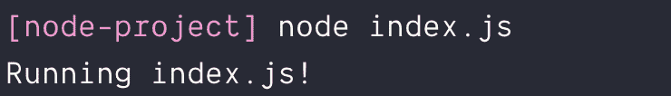
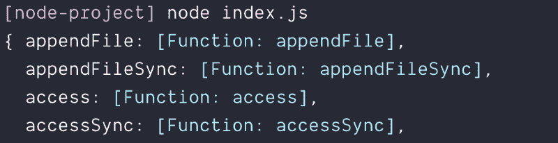
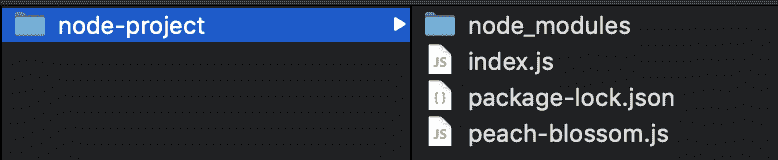
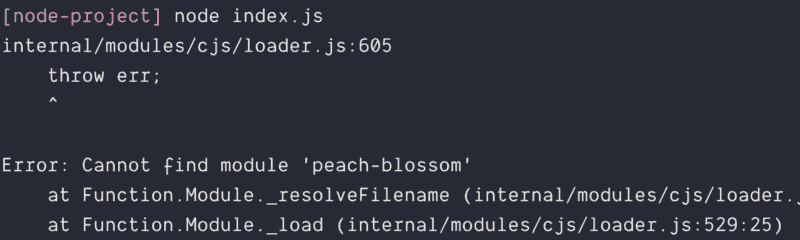

# 如何发布可以在浏览器和节点中使用的包

> 原文：<https://www.freecodecamp.org/news/how-to-publish-packages-that-can-be-used-in-browsers-and-node-c51274dca77c/>

当您创建一个包供其他人使用时，您必须考虑您的用户将在哪里使用您的包。他们会在基于浏览器的环境(或者前端 JavaScript)中使用它吗？他们会在 Node(或者后端 JavaScript)中使用它吗？还是两者都有？

如果您想创建一个在浏览器和节点中都可用包，本文可以提供帮助。

您将了解到:

1.如何编写用于浏览器的包

2.如何编写在节点中使用的包

3.如何发布在浏览器和节点中使用的包

### **编写一个在浏览器中使用的包**

如果你想在前端 JavaScript 中包含一个库，你必须首先用一个`script`标签链接这个库。链接后，您可以随时使用该库。

```
<!-- This is html -->
```

```
<script src="link-to-jquery.js"></script>
```

```
<script>  // You can use jQuery anytime after you link to it  console.log(jQuery)</script>
```

这是因为浏览器中的 JavaScript 共享一个全局范围。链接多少 JavaScript 文件并不重要。它们的行为就好像它们是一个大的 JavaScript 文件。

有了这些信息，我们就可以开始编写一个用于前端世界的库了。

假设您想要创建一个名为`peachBlossom`的库。`peachBlossom`有一个`bloom`功能。您在一个单独的 JavaScript 文件`peach-blossom.js`中编写这个`bloom`函数。

```
// This is js
```

```
// peach-blossom.jsfunction bloom () {  console.log('Bloom!')}
```

您可以通过链接到`peach-blossom.js`文件将`peachBlossom`包含在您的前端 JavaScript 中。一旦你做到了这一点，你就可以在任何地方使用`bloom`。

```
<!-- This is html -->
```

```
<script src="peach-blossom.js"></script><script src="main.js"></script>
```

```
// This is js
```

```
// main.jsbloom() // Bloom!
```

库通常有不止一段代码。我们不想用小变量污染全球范围。我们能做的是将我们想要公开的函数包装在一个立即调用的函数表达式(IIFE)中。

这意味着:

1.我们创建一个函数并立即运行它。我们从函数内部返回这个库，这样我们以后就可以使用这个库了。

在代码中，它看起来有点像这样:

```
// This is js
```

```
// peach-blossom.js const peachBlossom = (function () {  // Write as much code as you want here
```

```
// Return what others can use  return {    bloom: function () {      console.log('Bloom!')    }  }})()
```

然后你可以通过写`peachBlossom.bloom`在任何地方使用`bloom`。

```
// This is js
```

```
// main.jspeachBlossom.bloom() // Bloom!
```

这是编写前端库的基础。

现在，我们来谈谈为 Node 写一个库。

### **为节点**编写包

将库添加到节点不同于将库添加到浏览器。这是因为 Node 没有 HTML 文件和`<scri` pt >标签。

在我们开始为 Node 编写库之前，让我们确保您知道如何运行 Node。

#### 运行节点

首先，您需要确保您的计算机上安装了 Node。如果您尚未安装 Node，您可以从[节点的网站](https://nodejs.org/en/)安装 Node。

一旦安装了节点，您将需要创建一个文件夹来存储您的节点项目。在这种情况下，我们姑且称之为“节点-项目”。

创建文件夹的命令如下:

```
# This is bash
```

```
mkdir node-project
```

然后，您需要导航到`node-project`目录。你可以用`cd`来做:

```
# This is bashcd node-project
```

如果你在命令行上有问题，你可以使用本指南来帮你解决。

接下来，我们要创建一个文件。这将是一个 JavaScript 文件。(我们将在这个文件上运行 Node)。姑且称之为`index.js`。

```
# This is bash
```

```
touch index.js
```


在`index.js`中，我们要写一个`console.log`语句。这是为了让我们知道是否运行该文件。

```
// This is js
```

```
// index.jsconsole.log('Running index.js!')
```

最后可以用`node`运行`index.js`。命令如下:

```
# This is bash
```

```
node index.js
```

一旦运行了`index.js`，您应该会在终端中看到`console.log`。这就是我们如何知道文件已经运行。



#### 向节点添加库

要向 Node 添加库，必须使用`require`语句。一旦添加了库，就可以在同一个 JavaScript 文件中的任何地方使用该库。

这里有一个例子:

```
// This is js
```

```
const fs = require('fs')console.log(fs)
```



当您使用`require`时，Node 在三个地方查找您指定的库:

首先，它检查库是否内置在 Node 中。在这个例子中，`fs`被直接构建到节点中。使用 Node 的话随时可以使用`fs`。

其次，它检查该库是否存在于`node_modules`文件夹中。这些是用户安装的库。您可以通过运行`npm install`将库添加到`node_modules`文件夹中。

这里有一个例子，我们安装了`express`，然后在节点中需要 express:

```
# This is bash
```

```
# Run this in the command linenpm install express
```

```
// This is js 
```

```
// Index.js const express = require('express')console.log(express)
```


第三，如果您将`./`添加到`require`，Node 将查找位于当前目录中的文件。这是我们开始编写`peach-blossom`库的地方。

#### 为 Node 编写第一个库

让我们从创建一个`peach-blossom.js`文件开始。这个文件应该和`index.js`在同一个目录下。

```
// This is js
```

```
touch peach-blossom.js
```



我们可以用`require`把`peach-blossom.js`加到`index.js`上。它看起来是这样的:

```
// This is js 
```

```
const peachBlossom = require('./peach-blossom')
```

在 Node 中，没有共享全局范围的概念。每个文件都有自己的范围。所以，如果你写`peach-blossom.js`好像它是用于前端 JavaScript 的，你将无法使用它。你会得到一个错误。

```
// This is js
```

```
// peach-blossom.js const peachBlossom = (function () { // Write as much code as you want here
```

```
// Return what others can use return { bloom: function () { console.log(‘Bloom!’) } }})()
```

```
// This is js
```

```
// index.js const peachBlossom = require(‘./peach-blossom’)
```



要在 Node 中将变量从一个文件传递到另一个文件，必须编写`module.exports`。传递给`module.exports`的变量可以从另一个文件中检索。

这意味着我们必须在`peach-blossom.js`中写入`module.exports`。

```
// This is js 
```

```
// Write as much code as you want here const peachBlossom = { bloom () { console.log(‘Bloom!’) }}
```

```
// Exports peachBlossom for use in other filesmodule.exports = peachBlossom
```

一旦我们导出了`peachBlossom`，我们就可以在其他文件中使用它:

```
// This is js
```

```
// index.js const peachBlossom = require('./peach-blossom')peachBlossom.bloom() // Bloom!```
```

这种用`require`和`module.exports`在节点中传递变量的格式被称为 **CommonJS** 。

#### 将您的库发布为 npm 包

简而言之，要让您的模块在 Node 中工作，您必须用`module.exports`导出一个变量。其他人可以在他们的代码中`require`这个模块。

此时，您可以将`peach-blossom`移动到一个单独的项目文件夹中，并将其发布为一个 npm 包。你可以使用[本指南](https://zellwk.com/blog/publish-to-npm/)了解更多关于发布流程的信息。

### 编写前端和后端 JavaScript 都可用的模块

让我们花一点时间来调和我们所知道的。

要为前端编写一个库，我们需要将其声明为一个变量。我们希望尽可能只暴露一个变量。

```
// This is js
```

```
const peachBlossom = (function () {  // Write as much code as you want here
```

```
// Return what others can use  return {    bloom: function () {      console.log('Bloom!')    }  }})()
```

要为节点编写一个库，我们需要用`module.exports`导出变量。这里，我们只公开一个变量。

```
// This is js// Write as much code as you want here const peachBlossom = {  bloom () {    console.log('Bloom!')  }}
```

```
// Exports peachBlossom for use in other filesmodule.exports = peachBlossom
```

但这是两种完全不同的格式！如何才能一次编写一个库，并在两种上下文中使用？

进入 UMD。

#### UMD

UMD(通用模块定义)是一段代码，我们可以用它来包装我们的库。这段代码使得在前端和节点中使用一个库成为可能。

看起来有点像这样:

```
// This is js
```

```
(function (root, factory) {    if (typeof define === 'function' && define.amd) {        // AMD. Register as an anonymous module.        define(['b'], factory);    } else if (typeof module === 'object' && module.exports) {        // Node.        module.exports = factory(require('b'));    } else {        // Browser globals (root is window)        root.returnExports = factory(root.b);    }}(typeof self !== 'undefined' ? self : this, function (b) {    // Use b in some fashion.
```

```
// Just return a value to define the module export.    // This example returns an object, but the module    // can return a function as the exported value.    return {};}));
```

哇哦。这就混乱了！停下来。

实际上，我们不需要自己知道如何 UMD 化我们的代码。许多工具，如 Webpack 和 package，让我们能够通过它们 UMD 化我们的代码。

以下是一些示例(及其相关的设置说明):

1. [Gulp-umd](https://github.com/eduardolundgren/gulp-umd)
2。[web pack](https://webpack.js.org/guides/author-libraries/)3。[包裹](https://parceljs.org/cli.html#expose-modules-as-umd)
4。[汇总](https://rollupjs.org/guide/en)

这意味着，如果你想编写既可用于前端 JavaScript 又可用于节点的包，你必须设置这些工具。是的，这使创作过程变得复杂，但是目前我们对此无能为力。

### 包扎

如果你想让你的库在前端 JavaScript 和节点中都工作，你需要用 UMD(通用模块定义)包装你的模块。

如果你想 UMD 化你的代码，当你创作你的包时，你需要使用一个构建工具。这使得创作过程更加复杂。但是为用户提供一个在任何地方使用你的库的选择，这种权衡是值得的。

本文原载于 [*我的博客*](https://zellwk.com/blog/publishing-npm-packages-that-can-be-used-in-browsers-and-node) 。
如果你想要更多的文章来帮助你成为更好的前端开发人员，注册我的[时事通讯](https://zellwk.com/)。