# 主成分分析综述

> 原文：<https://www.freecodecamp.org/news/an-overview-of-principal-component-analysis-6340e3bc4073/>

摩西·比涅利

# 主成分分析综述

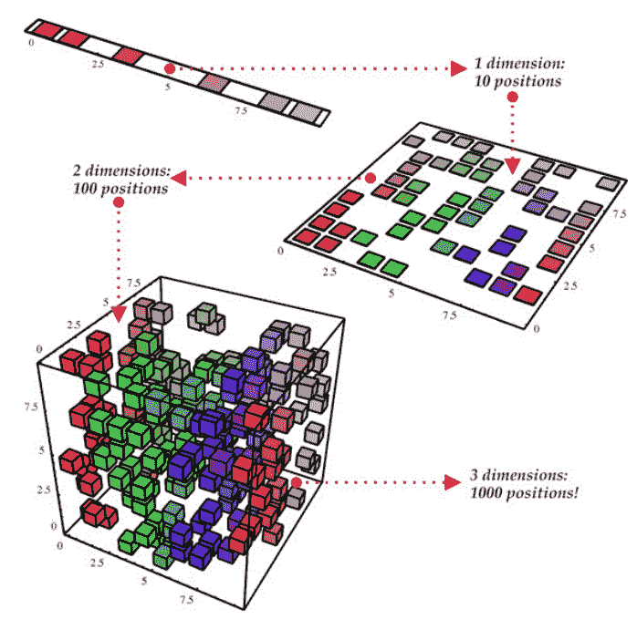

本文将向您解释什么是主成分分析(PCA)，为什么我们需要它，以及我们如何使用它。我会尽量使它简单，同时避免会引起头痛的硬例子或单词。

诚实的时刻:要完全理解这篇文章，对一些线性代数和统计学的基本理解是必不可少的。如果需要，请花几分钟时间回顾以下主题，以便于理解 PCA:

*   向量
*   特征向量
*   本征值
*   差异
*   协方差

### 那么这种算法如何帮助我们呢？这个算法有什么用？

*   确定数据中最相关的变化方向。
*   有助于捕捉最“重要”的特征。
*   由于我们需要处理的数据更少，因此在降维后更容易对数据集进行计算。
*   数据的可视化。

### 简短的口头解释。

假设我们的数据集中有 10 个变量，假设 3 个变量占数据集的 90%，7 个变量占数据集的 10%。

假设我们想要可视化 10 个变量。当然，我们无法做到这一点，我们最多只能看到 3 个变量(也许将来我们能够做到)。

所以我们有一个问题:我们不知道哪个变量捕捉了我们数据中最大的可变性。为了解开这个谜，我们将应用 PCA 算法。输出将告诉我们这些变量是谁。听起来很酷，不是吗？？

### 那么，让 PCA 发挥作用的步骤是什么呢？我们如何运用魔法？

1.  获取要应用算法的数据集。
2.  计算协方差矩阵。
3.  计算特征向量及其特征值。
4.  按照特征值降序排列特征向量。
5.  选择前 K 个特征向量(其中 K 是我们希望最终得到的维数)。
6.  构建新的缩减数据集。

### 是时候用真实数据举例了。

#### 1) **将数据集加载到矩阵:**

我们的主要目标是找出有多少变量对我们来说是最重要的，并且只保留这些变量。

对于这个例子，我们将使用程序“Spyder”来运行 python。我们还将使用嵌入在“sklearn.datasets”中的一个非常酷的数据集，名为“load_iris”。你可以在维基百科上阅读更多关于这个数据集的信息。

首先，我们将加载 iris 模块，并将数据集转换为矩阵。数据集包含 4 个变量和 150 个示例。因此，我们的数据矩阵的维数是:(150，4)。

```
import numpy as npimport pandas as pdfrom sklearn.datasets import load_iris
```

```
irisModule = load_iris()dataset = np.array(irisModule.data)
```

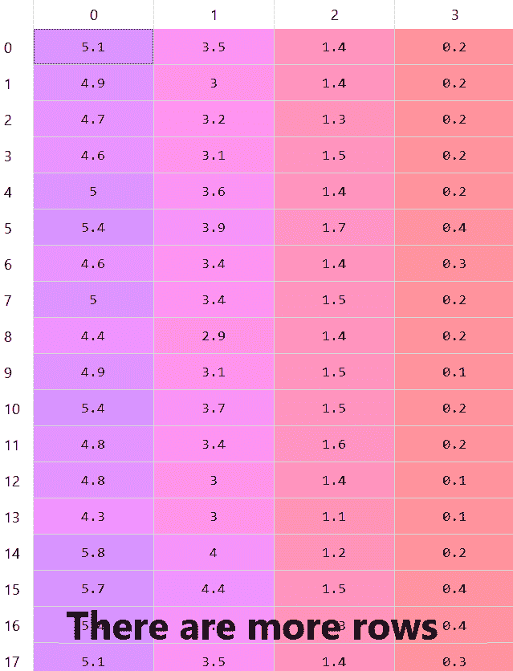

Dataset visualization

这个数据集中有更多的行—正如我们所说的有 150 行，但我们只能看到 17 行。

PCA 的概念是通过在我们的数据矩阵中寻找捕获大部分可变性的方向来降低矩阵的维数。因此，我们想找到他们。

#### 2) **计算协方差矩阵:**

是时候计算我们数据集的协方差矩阵了，但这到底意味着什么呢？为什么我们需要计算协方差矩阵？会是什么样子？

[**方差**](https://en.wikipedia.org/wiki/Variance) 是随机变量与其均值的方差平方的期望值。非正式地说，**它测量一组数字从它们的平均值开始的扩散。**数学定义是:

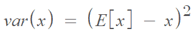

[**协方差**](https://en.wikipedia.org/wiki/Covariance) 是两个随机变量联合变异性的度量。换句话说，任何两个特征如何彼此不同。在数据中寻找模式时，使用协方差非常常见。数学定义是:

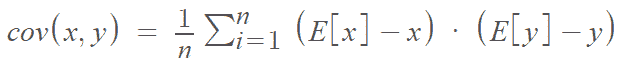

从这个定义，我们可以得出结论，协方差矩阵将是对称的。这很重要，因为这意味着它的特征向量将是实数且非负的，这使我们更容易(我们敢说处理复数比处理实数更容易！)

计算协方差矩阵后，它看起来像这样:

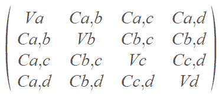

Covariance matrix visualization

你可以看到，主对角线写成 **V** (方差)，其余写成 **C** (协方差)，这是为什么呢？

因为计算同一个变量的协方差基本上就是计算它的方差(如果你不确定为什么——请花几分钟时间了解一下什么是方差和协方差)。

让我们使用以下代码在 Python 中计算数据集的协方差矩阵:

```
covarianceMatrix = pd.DataFrame(data = np.cov(dataset, rowvar = False), columns = irisModule.feature_names, index = irisModule.feature_names)
```

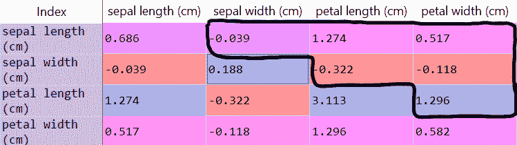

The covariance matrix of the dataset

*   我们对主对角线不感兴趣，因为它们是同一个变量的方差。由于我们试图在数据集中寻找新的模式，**我们将忽略主对角线**。
*   由于矩阵是对称的，协方差(a，b) =协方差(b，a)，**我们只看协方差矩阵(对角线以上)**的顶值。
    关于协方差有一点很重要:如果变量 **a** 和 **b** 的协方差是**正**，这意味着它们**同向变化。**如果 **a** 和 **b** 的协方差为**负**，它们在**不同方向**变化。

#### 3) **计算特征值和特征向量:**

正如我在开头提到的，特征值和特征向量是理解这一步你必须知道的基本术语。因此，我不会解释它，而是移动到计算它们。

与最大特征值相关联的特征向量表示数据具有最大方差的方向。因此，使用特征值，我们将知道什么特征向量捕捉我们的数据中的最大可变性。

```
eigenvalues, eigenvectors = np.linalg.eig(covarianceMatrix)
```

这是特征值的向量，特征值向量的第一个索引与特征向量矩阵的第一个索引相关联。

特征值:

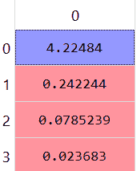

Eigenvalues of the covariance matrix

特征向量矩阵:


Eigenvectors matrix of the covariance matrix

#### 4)选择前 K 个特征值(K 个主分量/轴):

特征值告诉我们在相应的特征向量方向上的变化量。所以特征值最大的特征向量就是可变性最大的方向。我们称这个特征向量为第一主分量(或轴)。从这个逻辑出发，具有第二大特征值的特征向量将被称为第二主分量，以此类推。

我们看到以下值:
【4.224，0.242，0.078，0.023】

让我们将这些值转换成百分比并可视化。我们将获取每个特征值在数据集中所占的百分比。

```
totalSum = sum(eigenvalues)variablesExplained = [(i / totalSum) for i in sorted(eigenvalues, reverse = True)]
```

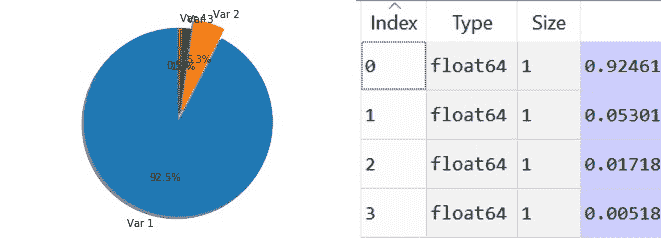

可以清楚地看到，第一个**和特征值占**的 92.5%** 和第二个**占**的 5.3%，第三个和第四个**并没有覆盖总数据集中的太多数据。**因此，我们可以很容易地决定只保留两个变量，第一个和第二个。**

```
`featureVector = eigenvectors[:,:2]`
```

**让我们从数据集中删除第三和第四个变量。重要的是，在这一点上，我们失去了一些信息。降维而不损失一些信息是不可能的(一般位置假设下)。PCA 算法告诉我们正确的方法来减少维度，同时保留关于我们数据的最大信息量。**

**剩下的数据集看起来像这样:**

**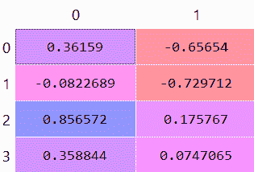

Remaining eigenvectors after removal of two variables** 

#### **5) **建立新的精简数据集:****

**我们希望从 K 个选择的主成分中构建一个新的精简数据集。**

**我们将采用 K 个选择的原则组件(这里 k=2 ),它给出一个大小为(4，2)的矩阵，我们将采用大小为(150，4)的矩阵的原始数据集。**

**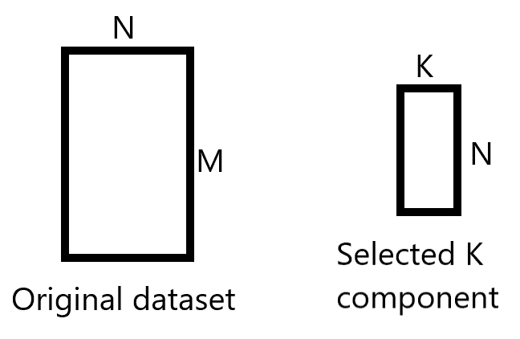

The matrices we need to work with** 

**我们将以这样的方式执行矩阵乘法:**

*   **我们取的第一个矩阵是包含我们选择的 K 分量原理的矩阵，我们转置这个矩阵。**
*   **我们得到的第二个矩阵是原始矩阵，我们转置它。**
*   **此时，我们在这两个矩阵之间执行矩阵乘法。**
*   **在我们执行矩阵乘法之后，我们转置结果矩阵。**

**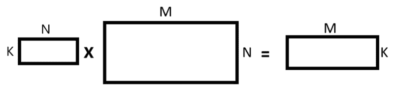

Matrix multiplication** 

```
`featureVectorTranspose = np.transpose(featureVector)datasetTranspose = np.transpose(dataset)newDatasetTranspose = np.matmul(featureVectorTranspose, datasetTranspose)newDataset = np.transpose(newDatasetTranspose)`
```

**在执行矩阵乘法和转置结果矩阵之后，这些是我们得到的新数据的值，它只包含我们选择的 K 个主成分。**

**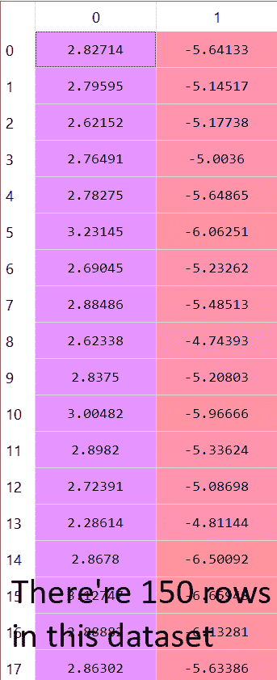**

### **结论**

**正如(我们希望)你现在所看到的，PCA 并不那么难。我们已经使用 Python 很容易地降低了数据集的维度。**

**在我们的数据集中，我们没有造成严重的影响，因为我们只删除了 4 个变量中的 2 个。但让我们假设我们的数据集中有 200 个变量，我们将 200 个变量减少到 3 个，这已经变得更有意义了。**

**希望你今天学到了一些新东西。如有任何问题，请随时在 Linkedin 上联系[陈](https://www.linkedin.com/in/chen-shani-638816184/)或[莫舍比涅利](https://www.linkedin.com/in/moshe-binieli-22b11a137/)。**