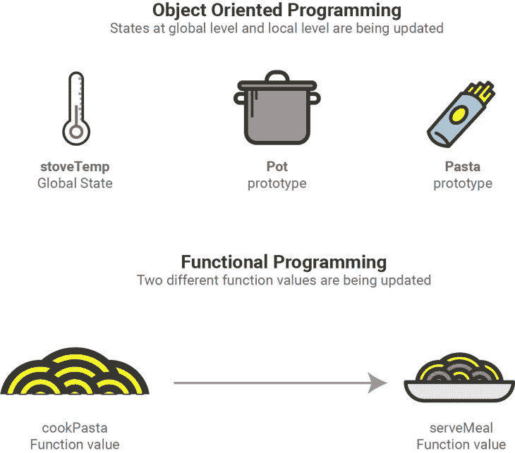
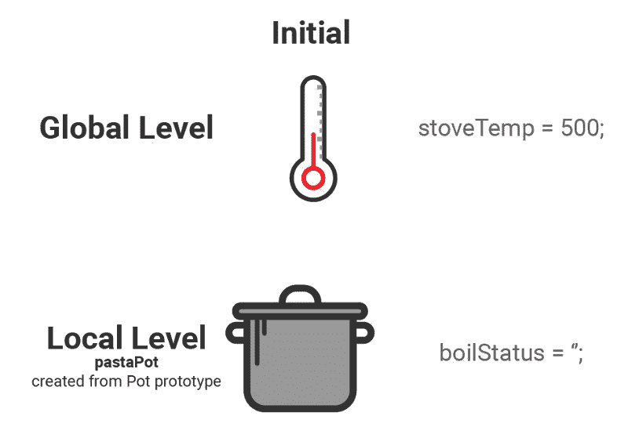
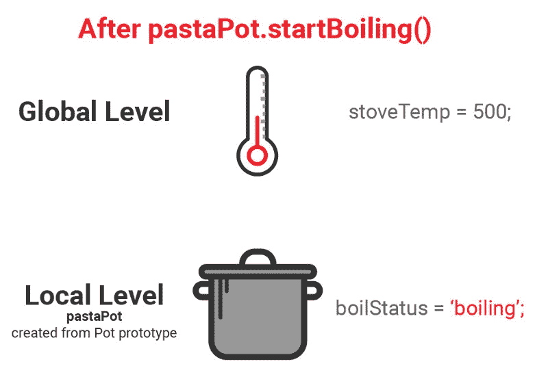
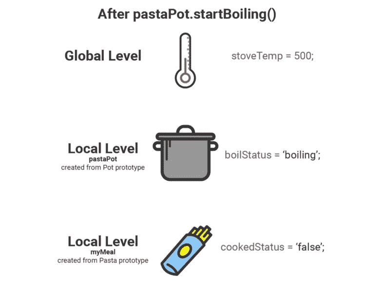
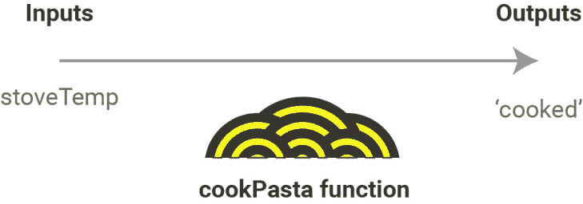
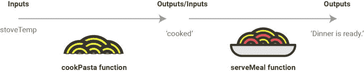

# 通过烹饪一顿简单的饭菜来解释 JavaScript 中的状态

> 原文：<https://www.freecodecamp.org/news/state-in-javascript-explained-by-cooking-a-simple-meal-2baf10a787ee/>

凯文·科诺年科

# 通过烹饪一顿简单的饭菜来解释 JavaScript 中的状态


如果你曾经在家做过饭，那么你就能理解如何在 JavaScript 中使用面向对象的编程方法编写有状态代码。

当你开始编写简单的 JavaScript 程序时，你不需要担心你正在使用的变量的数量，或者不同的函数和对象如何协同工作。

例如，大多数人从使用大量全局变量开始，或者在文件的顶层使用变量。它们不属于任何单独的类、对象或函数。

例如，这是一个名为 *state* 的全局变量:

```
let state = "global";
```

但是一旦你的程序开始涉及许多不同的函数和/或对象，你将需要为你的代码创建一套更严格的规则。

这就是[状态](https://en.wikipedia.org/wiki/State_(computer_science))的概念发挥作用的地方。状态描述整个程序或单个对象的状态。它可以是文本、数字、布尔值或其他数据类型。

这是协调代码的常用工具。例如，一旦你更新了状态，一堆不同的函数可以立即对这种变化做出反应。

[本文描述了 React](https://blog.codeanalogies.com/2016/10/04/react-props-state-explained-through-darth-vaders-hunt-for-the-rebels/) 上下文中的状态，React 是一个流行的 JavaScript 库。

但是你猜怎么着？一旦代码变得复杂，甚至状态也会让您头疼！改变状态会导致意想不到的后果。

我们就此打住。状态是面向对象编程(OOP)中的一个流行工具。但是许多程序员更喜欢函数式编程，它不鼓励状态改变。JavaScript 支持这两种范式。

好吧，一次用了这么多术语。我想找到一种方法来展示 OOP 和函数式编程如何实现相同的目标，即使函数式编程不使用状态。

本教程将展示如何从面向对象和功能的角度烹饪意大利面条和调味汁。

下面是两种不同方法的快速预览:



让我们开始吧。为了理解本教程，你只需要理解 JavaScript 中的函数和对象。

### 面向对象的方法(使用状态)

在上图中，我们展示了制作意大利面晚餐的两种不同方法:

1.  这种方法关注不同工具的状态，比如炉子、锅和意大利面。
2.  这种方法专注于食物本身的发展，而不考虑单个工具(锅、炉子等)的状态。)

面向对象的方法侧重于更新状态，因此我们的代码将具有两个不同级别的状态:

1.  全球，或这一餐的状态。
2.  每个对象的本地。

我们将在本教程中使用 ES6 语法来创建对象。这里有一个全局状态和“锅”原型的例子。

```
let stoveTemp = 500;
```

```
function Pot(){  this.boilStatus = '';  this.startBoiling = function(){    if( stoveTemp > 400)      this.boilStatus = "boiling";  }}
```

```
let pastaPot = new Pot();pastaPot.startBoiling();
```

```
console.log(pastaPot);// Pot { boilStatus = 'boiling'; }
```

**注意:**我简化了`console.log`语句来关注状态更新。

这是该逻辑的一个可视化表示:

**在**之前



之后

****

**有两种状态，当通过`Pot`原型创建`pastaPot`时，它最初有一个空的`boilStatus`。但是接下来，状态发生了变化。**

**我们运行`pastaPot.startBoiling()`，现在`boilStatus`(本地状态)正在“沸腾”，因为`stoveTemp`的全局状态超过 400。**

**现在让我们更进一步。由于`pastaPot`的状态，我们将允许意大利面变得沸腾。**

**下面是我们将添加到上面代码片段中的代码:**

```
`function Pasta (){  this.cookedStatus = false;  this.addToPot = function (boilStatus){    if(boilStatus == "boiling")      this.cookedStatus = true;  }}`
```

```
`let myMeal = new Pasta();myMeal.addToPot(pastaPot.boilStatus);`
```

```
`console.log(myMeal.cookedStatus);// true`
```

**哇哦。一下子这么多。事情是这样的。**

1.  **我们创建了一个新的“Pasta”原型，其中每个对象都有一个名为`cookedStatus`的本地状态**
2.  **我们创建了一个名为`myMeal`的面食新实例**
3.  **我们使用在上一个代码片段中创建的`pastaPot`对象的状态来确定是否应该将`myMeal`中名为`cookedStatus`的状态更新为 cooked。**
4.  **由于`pastaPot`中`boilStatus`的状态是“沸腾”，我们的面食现在熟了！**

**这是一个直观的过程:**

**以前**

****

**在...之后**

****

**现在我们有了一个对象的局部状态，它依赖于另一个对象的局部状态。地方政府依赖于一些全球性的政府！你可以看到这是多么具有挑战性。但是，至少现在很容易理解，因为状态是显式更新的。**

### **功能方法(无状态)**

**为了充分理解状态，您应该能够找到一种方法，在不实际修改状态的情况下，实现与上面代码相同的结果。这就是函数式编程的用处！**

**函数式编程有两个区别于 OOP 的核心价值:不变性和纯函数。**

**我不打算在这些话题上做太多深入的探讨，但是如果你想了解更多，我鼓励你[看看这篇 JavaScript 函数式编程指南](https://opensource.com/article/17/6/functional-javascript)。**

**这两个原则都不鼓励在代码中使用状态修改。这意味着我们不能使用局部或全局状态。**

**相反，函数式编程鼓励我们向单个函数传递参数。我们可以使用外部变量，但不能作为状态使用。**

**下面是一个煮意大利面的函数的例子:**

```
`const stoveTemp = 500;`
```

```
`const cookPasta = (temp) => {  if(temp > 400)    return 'cooked';}`
```

```
`console.log(cookPasta(stoveTemp));// 'cooked'`
```

**此代码将成功返回一个字符串“cooked”。但是请注意，我们没有更新任何对象。该函数只是返回将在下一步中使用的值。**

**相反，我们关注一个函数的输入和输出:`cookPasta`。**

**这种观点着眼于食物本身的转变，而不是用来烹饪食物的工具。这有点难以想象，但是我们不需要让函数依赖于外部状态。**

**它看起来是这样的:**

****

**你可以把它想象成一顿饭进度的“时间线视图”——这个特殊的功能只是涵盖了第一部分，从干意大利面到熟意大利面的转变。**

**现在，当食物端上来时，让我们来看第二部分。下面是提供这顿饭的代码。它将出现在上面的代码块之后:**

```
`const serveMeal = (pasta) => { if (pasta == 'cooked')   return 'Dinner is ready.'}`
```

```
`console.log( serveMeal(cookPasta(stoveTemp)) );// 'Dinner is ready.'`
```

**现在，我们将把`cookPasta`函数的结果直接传递给`serveMeal`函数。同样，我们能够在不改变状态或数据结构的情况下做到这一点。**

**下图使用“时间线视图”展示了这两个功能如何协同工作:**

****

### **对更多可视化教程感兴趣？**

**如果你喜欢这个指南，给它一个“掌声”！**

**此外，如果你想阅读更多关于 HTML、CSS 和 JavaScript 的可视化教程，请查看[主要代码类比网站](http://codeanalogies.com/)中的 50 多个教程。**