# 我们在 2018 年销售 UI 工具赚了 105.2 万美元。这是我们学到的东西。

> 原文：<https://www.freecodecamp.org/news/we-made-1-052-000-in-2018-selling-ui-tools-here-is-what-we-learned-38920d86a296/>

Kanye West is great! Image by [https://unsplash.com/@karinacarvalho](https://unsplash.com/@karinacarvalho)

这听起来很老套，但拥有一个伟大的产品是至关重要的。这话我说过很多次了，从创意 Tim 开始我们就一直遵循这个规律。对我们来说，伟大的产品=伟大的设计+伟大的客户支持+伟大的用户体验。

如果你想了解更多关于 5 年前我们是如何从星巴克开始一切的，请查看这篇文章:[我和我的朋友们是如何将我们的副业发展成每月 17000 美元的生意](https://medium.freecodecamp.org/growing-a-side-project-into-a-17-000-month-business-46024d2aa87f)。那篇文章是两年前写的，我建议你在继续写这篇文章之前读一读，这样你可以更好地理解整个过程。

我们将在这里展示的许多策略可以应用到其他在线业务中，你会看到一个例子，有人如何基于我们发表的另一篇文章创建了一个成功的创业公司。

#### 为什么我们要分享“所有这些秘密”？

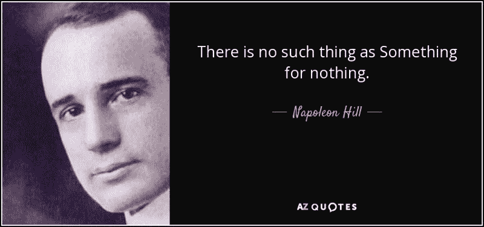

我们所建立的一切都是基于在网上找到的免费信息和免费资源，我认为回馈是我们的责任。有很多想创业或者想规模化的创业者，但是他们不知道如何在不使用付费渠道的情况下获取新用户。我们想帮助这些人，这样他们可以应用一些技术，花更少的时间做实验。

在这个案例研究中，我将介绍我们如何在一个非常拥挤的市场(主题和模板)中，将月收入从 17.000 美元增长到 106.000 美元，增长了约 5 倍。下面是这篇文章的概述:

1.  合作策略(当你放弃的时候就是你失败的时候)
2.  如果你想变得伟大，就呆在伟大的公司附近
3.  增长黑客:从 Github 首页的趋势到产品搜索的持续发布
4.  我们与竞争对手有多么不同，为什么这对我们有用
5.  回馈:教育、赞助和辅导
6.  人们可以将我们的策略应用于不同的业务吗？
7.  下一步是什么？

#### 我们开始吧！:-)

### 1.伙伴关系战略

如果你读过另一篇文章，你就会知道，在不同领域的一些试错之后，从给我们的用户提供设计组件到一些增长黑客，我们终于找到了适合的[产品市场。我们有 77，000 人访问了大约 226，000 次，我们从大约 400 名付费客户那里获得了 22，000 美元的总收入。当我们继续推出新产品时，我们意识到这些人能花的钱是有限的。](https://en.wikipedia.org/wiki/Product/market_fit)

这意味着，如果你有 10 件平均价值为 55 美元的优质产品，就会有 400 人购买。但是，如果你再推出 10 种优质产品，这 400 人仍然只会购买 1 种产品，因为他们的项目需要 1 种产品，而不是 2 或 3 种。这和去超市花 10 美元买 1 瓶牛奶是一样的，即使超市多进了 25 种牛奶也没关系，你不会因为那里有很多牛奶就花 30 美元买 3 瓶牛奶。

发现这一点对我们来说很痛苦，因为我们在想“啊…这个行业很简单，我们推出更多，我们制造更多”。因此，当我们推出新产品时，我们必须做的下一件事是寻找新的合作伙伴，他们希望加入我们，帮助我们向更多的受众提供免费和付费产品。

> “向月亮射击。即使你错过了，你也会在群星中着陆。”

我们开始寻找流量是我们 3-10-20 倍甚至 100 倍的网站。由于我们所有的业务都基于最流行的前端框架， [Bootstrap](https://getbootstrap.com/) ，我们开始寻找所有与 Bootstrap 相关的网站。在大量的电子邮件、请求和拒绝之后，我们认为尝试与 Bootstrap 的创建者合作是很酷也很疯狂的事情。大多数时候人们会这样想:“有很多人忽视我们，我不会问他们，因为他们太大了，他们会忽视我们。还不如待在我的角落里。”

因此，2017 年 6 月 7 日，我们联系了 Bootstrap 的[创建者，并向他们介绍了我们正在做的事情、我们希望通过 Bootstrap 模板实现的目标以及我们的使命。](https://github.com/orgs/twbs/people)

当我们得到他们的回应时，我们非常震惊。为什么？

1.  这是一个积极的回应，说将来会发生一些事情，他们会带着一些想法回来。
2.  我们很高兴他们考虑我们的业务。基本上有成千上万的其他公司/个人在做引导模板。
3.  他们真的回来了。通常，99%的人不会回应你的提议。

那年晚些时候，他们联系我们，告诉我们他们将推出一个官方的 [Bootstrap Marketplace](https://themes.getbootstrap.com/) ，他们希望我们成为第一批 5-7 家公司中的一员。

这里最重要的部分不是我们将开始赚更多的钱，并将通过这种合作关系交付给更多的人。事实上，我们开始直接与 Bootstrap 的创建者交谈，我们得到了关于我们应该如何改进和在 Bootstrap 之上工作的反馈。这比金钱更有价值，也是对我们的另一种认可，证明我们提供的是高质量的产品。

> “框架的创建者最有资格给你最好的反馈，告诉你应该如何使用他们的产品。”

下一个合作伙伴:WordPress。这些年来，我们知道 [WordPress 为全球 30%的网站提供支持](https://venturebeat.com/2018/03/05/wordpress-now-powers-30-of-websites/)，但是我们从来没有在这方面做过任何事情。我们的目标客户群中有知道如何编码的开发者和网络代理。当你为 WordPress 做一些事情的时候，你知道可能会有一些非技术人员试图“一键安装”你的产品，这样就会有问题。然后他们会支持你，对他的经历感到愤怒。

因为我们从来没有为 WordPress 做过任何事情，但是我们想在 WordPress 主题上看到我们的设计，所以我们在这个领域寻找一个可靠的合作伙伴。我们找到了 theme isle T1，这家公司开发了最受欢迎的 WordPress 主题之一，T2 泽里夫 T3。他们和我们来自同一个国家，所以我们开始谈论合作的方式。

我们意识到一个很好的组合是将我们最流行的 UI 套件，材料套件迁移到 WordPress。这样，我们创建了[赫斯缇雅](https://wordpress.org/themes/hestia/)，一个使用我们设计的 WordPress 主题。

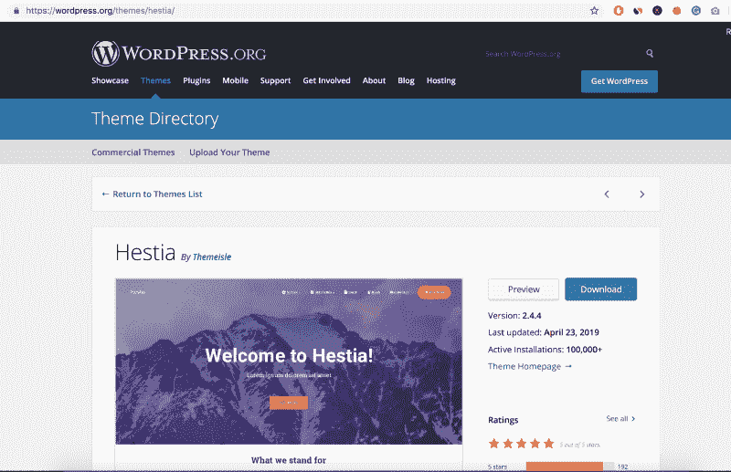

赫斯缇雅获得了巨大的成功。它被下载了成千上万次，目前它有 100，000 多个活跃安装。更重要的是，它是有史以来最受欢迎的十大主题之一。我们还制作了另一个产品， [Orfeo](https://wordpress.org/themes/orfeo/) ，它是在[纸质工具包 2](https://www.creative-tim.com/product/paper-kit-2) 的基础上构建的，并且是 WordPress 最受欢迎的 50 个主题之一。拥有这样的合作伙伴对我们来说真的很重要，因为我们进入了一个新的世界，我们无法独自完成。

我们建立的下一个伙伴关系是我们已经努力了大约两年的事情。不幸的是，这是一个排他性的合作关系，所以我们不能透露谁是幕后黑手的细节。我将向你展示为什么我们花了两年时间来建造它。如果你看我发的第一封邮件，你会发现我犯了一些错误:

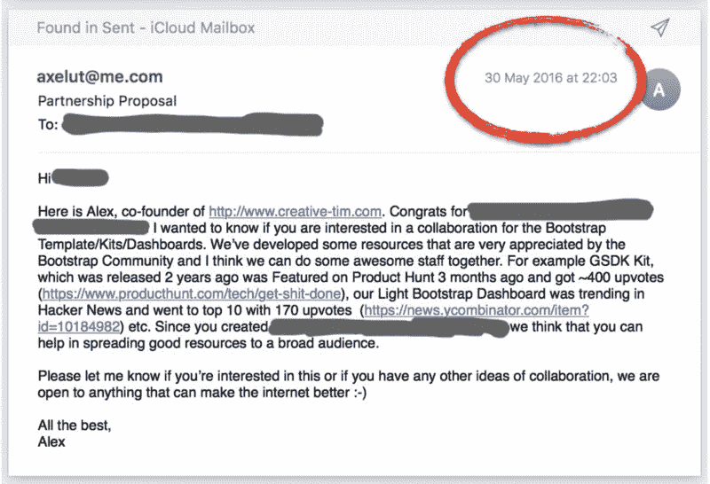

1.  我只谈了我的公司和我，我从来没有告诉他他能从这种合作关系中获得什么(曝光度、金钱、经验等)。)
2.  我没有给出任何细节，比如“我们期望从你的源获得 10.000 次下载”或者“我们认为你的用户会因为高质量而多下载 2 倍的产品”等等。
3.  我没有告诉他我们能为他的生意做些什么

所以我花了 21 个月的时间写了 26 封电子邮件才明白，在从对方那里得到什么之前，我必须改变我的信息，给可能的伴侣一些东西。有时候你不得不艰难地学习。？？‍♂️

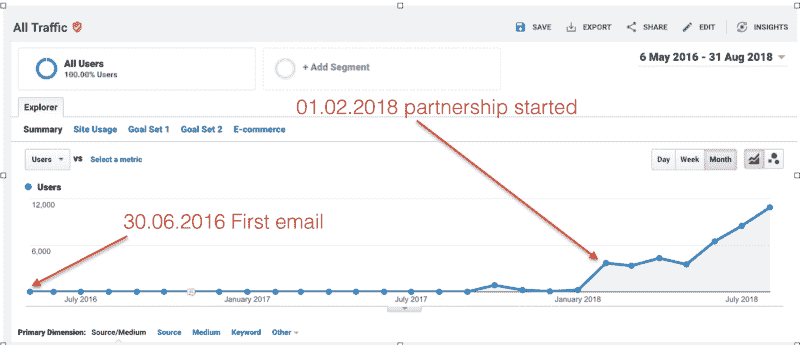

最后，我们的合作伙伴对新的合作很满意，我感觉很好，因为我继续“给他发邮件”,从未放弃。

> “我们在这里学到了重要的一课，那就是你必须先付出，才能得到！”

### 2.如果你想变得伟大，那就和伟大的公司保持密切联系

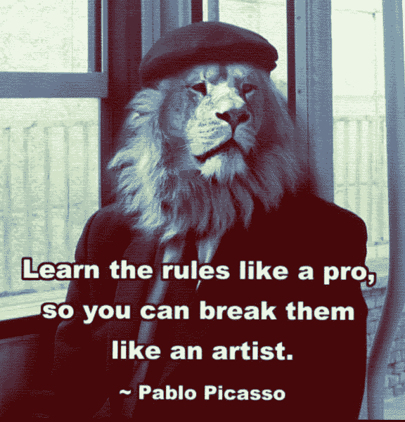

我们总是有这样的理念:向在某个领域拥有数十年经验的其他更杰出的公司学习并从中获得灵感。过去，我们从苹果、劳斯莱斯、Heroku、Invision、Airbnb、Stripe、Dribbble 等公司获得了灵感。我认为，如果你向这些公司学习，你可以建立一个坚如磐石的基础。然后，当你掌握了所有的技能和知识，你就可以开始使用它们，创造出新的独特的东西，就像巴勃罗·毕加索说的那样。

在本文中，我们写了更多关于我们如何构建产品以及策略和实现的内容:“[对引导仪表板的剖析](https://medium.freecodecamp.org/the-anatomy-of-a-bootstrap-dashboard-that-earns-1-000s-each-month-ed3404010d25)”

寻找灵感来源，然后跟随 [InVision](https://www.freecodecamp.org/news/we-made-1-052-000-in-2018-selling-ui-tools-here-is-what-we-learned-38920d86a296/undefined) 多年，我们决定从他们最受欢迎的 UI 套件之一 [Now UI](https://www.invisionapp.com/inside-design/design-resources/now/) 中获取灵感，该套件于 2015 年推出，仅面向设计师。我们想把它作为开发人员新 UI 套件的核心基础。

我们已经获得了 Invision 的批准，我们被允许在 2016 年 11 月 8 日为开发人员构建编码版本。经过 4-5 个月的研究、基于 Invision 原则的规划和开发，我们发布了基于 Bootstrap 的 [HTML 版本。](https://www.creative-tim.com/product/now-ui-kit)

结果和我们的开发人员接受新产品的方式非常好。这个设计很棒，因为是 Invision 做的，而且代码结构非常好，遵循了 Bootstrap 4 原则。就设计+代码+文档而言，这是一个很好的组合。后来我们发现这个产品的成功是因为我们采用了可用的最好的 UI 套件之一，并通过提供编码版本和新元素/页面使它变得更好。

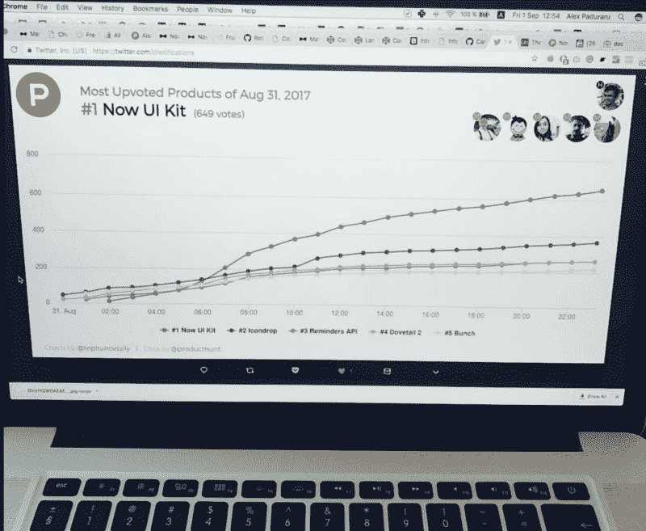

> "接受现存的最好的东西，并使它变得更好。"—亨利·莱斯(劳斯莱斯的联合创始人)

### 3.增长黑客:从产品搜索的持续发布到 Github 首页的趋势或我们国家媒体的专题

由于对 creative-tim.com 的最初推动来自产品搜索，我们决定继续在那里推出产品。在 2014-2015 年推出和在 2018 年推出之间的差异非常大，因为社区增长了很多，每天都有很多新产品发布。这让你很难鹤立鸡群。

发布产品搜索的策略变得非常复杂，我们在实际发布之前工作了大约一周。一切都需要设置，很多人都要参与进来。一些你必须考虑的事情:

1.  在开始发帖之前，你需要准备好所有的图片、产品描述、链接和社交资料。那会节省你很多时间。在这里，我们通常会起草一份未来的帖子，然后在内部与整个团队讨论文本和图像。
2.  你必须确保你的网站不会因为流量的增加而崩溃。我们通常将人们发送到静态生成的内容，因此需要较少的服务器资源。
3.  尽量在本周初(周一)GMT+2 上午 10:15 左右发布，也就是旧金山时间上午 00:15，基本上是产品搜索服务器开始新一天的时候。通过这种方式，你可以确保你有 24 小时的充分曝光时间，并尽可能多地获得支持票。
4.  如果你已经有一群人在使用你的产品，确保你给他们发一封电子邮件，让他们知道你在寻找产品，如果他们喜欢使用该产品，他们可以投票支持。
5.  确保你让你的社交粉丝(脸书、推特、Instagram)知道你正在寻找产品。
6.  如果你发布的是付费产品，确保你创建了一些优惠券，可以被产品搜索社区使用。他们爱他们:D

通过这些步骤，我们成功推出了一些深受社区欢迎的产品:

*   [材料仪表板免费](https://www.producthunt.com/posts/material-dashboard) — 756 张赞成票
*   [现在 UI 套件](https://www.producthunt.com/posts/now-ui-kit) — 1.556 upvotes
*   [材料仪表板所有技术(Bootstrap、React、Vuejs、Angular)](https://www.producthunt.com/posts/material-dashboard-v2) — 505 次投票

当我们在寻找向更多观众展示我们产品的新方法时，我们发现了来自 Froala 的 Diana 写的这篇文章:[如何在一周内获得 3500+ GitHub 星](https://medium.freecodecamp.org/how-to-get-up-to-3500-github-stars-in-one-week-339102b62a8f)。这非常令人兴奋，我们在想，如果他们这样做了，也许我们也可以在 GitHub 上成为潮流，因为我们已经有了开源产品，开发者社区很喜欢它们。

我们遵循了文章中提到的所有步骤，也应用了我们在寻找产品时使用的策略。我们为 Material Dashboard 准备了一个友好的 [Readme 页面，并添加了 Material Dashboard 可用的所有技术(Bootstrap、React、Vuejs、Angular)。我们在社交媒体上发布消息，然后向使用 Material Dashboard 的 90，000 名开发人员发送简讯。在最初的推动下，我们在一天内成为了所有语言的趋势。](https://github.com/creativetimofficial/material-dashboard)

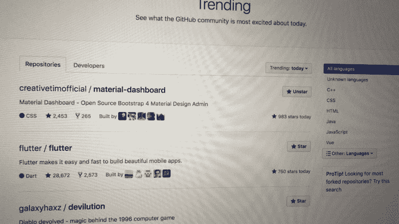

自从我们在一天内将其提升到前 5 名，我们开始向我们的观众宣布我们正在 Github 上成为趋势，这有助于我们让更多的人参与进来。我们在我们的网站上添加了一个横幅，有超过 50，000 人浏览，然后我们在 Hacker News 上发布了回购，奇迹就发生在那里。它出现在第一页，[被大约 430 人](https://news.ycombinator.com/item?id=17373465)投票，9800 人来到 GitHub，他们给了我们大约 2000 颗星。

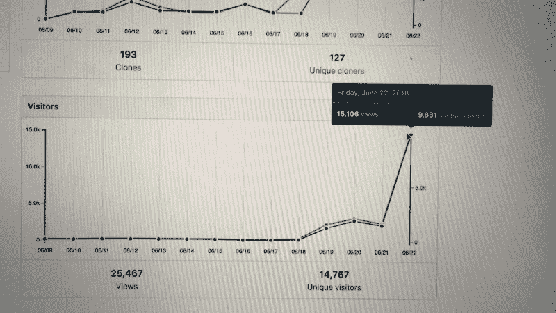

所以那一周我们排在脸书、谷歌和微软前面。

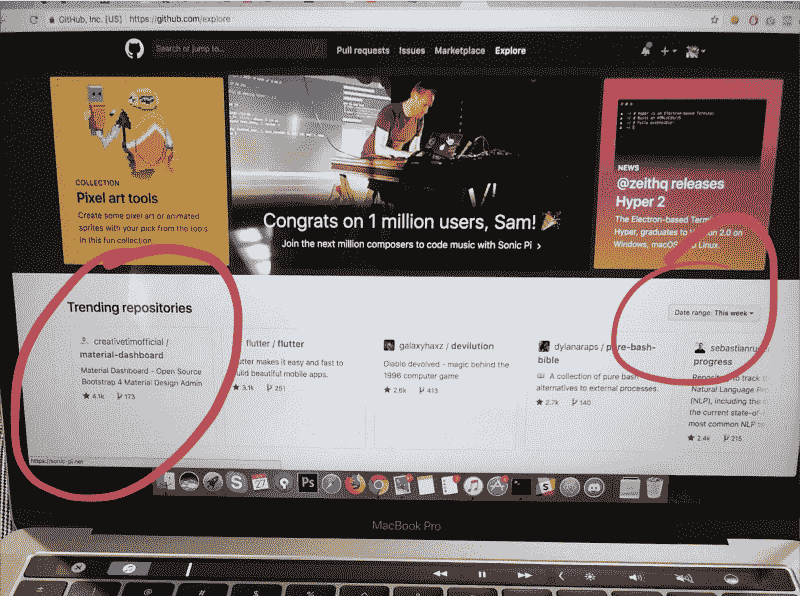

正如 Product Hunt 的创始人 Ryan 所说的那样，在 Product Hunt、Hacker News 或当地媒体上发布不是一个可持续的增长渠道，但这是你创业初期采用的一个很好的策略。

### 4.我们与竞争对手有多么不同，为什么这对我们有用

我们在一个竞争非常激烈的领域经营我们的业务:主题和模板。我见过的大多数企业家认为这是一个死气沉沉的地方，我们不能创造一些相关的东西。我们想证明，如果你有秘密武器，无论多么拥挤，事情都可以在任何空间完成。如果你读了第一篇文章，你就会知道我们的秘密武器是**提供结合了优秀用户体验和优秀客户支持的优秀产品**。

让我们看看在不同市场销售产品的大多数竞争对手。当然，也有一些例外，因为我们在我们的领域不是独一无二的，但让我们看看 95%的公司创造了与我们类似的产品。

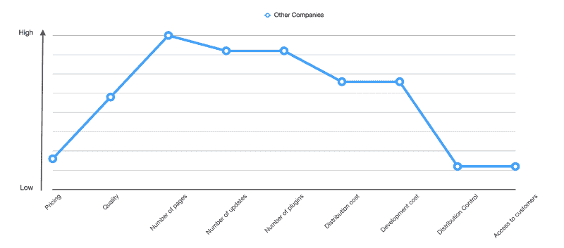

现在，让我们来看看我们的曲线，并对每个点有一点概述:

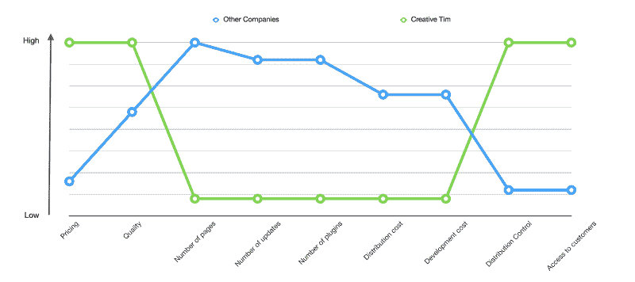

1.  **定价:**当我们开始创业时，我们发现大多数 HTML 模板/主题/工具包/仪表盘的价格在 3 美元到 19 美元之间，而 Wordpress 模板的价格在 49 美元到 69 美元之间。随着时间的推移，事情发生了变化，HTML 模板开始变得更加昂贵。我们做了一些计算，如果我们以 3-19 美元的价格区间起步，我们无法维持我们的业务。我们也在一些商业书籍中读到过**如果价格是你唯一的差异化因素，那么你就有大麻烦了**。所以我们决定对我们的产品收取更多的费用，这样我们就可以灵活地生产出具有顶级质量和客户体验的产品。
2.  质量:从低到高，我们的大多数竞争对手都提供中等质量。这是因为他们投入了大部分资源，这是金钱+时间的组合，来构建更多的页面，更多的插件和更多的更新。这些事情加上发布新产品的压力，让他们没有时间投资于产品的质量和细节。

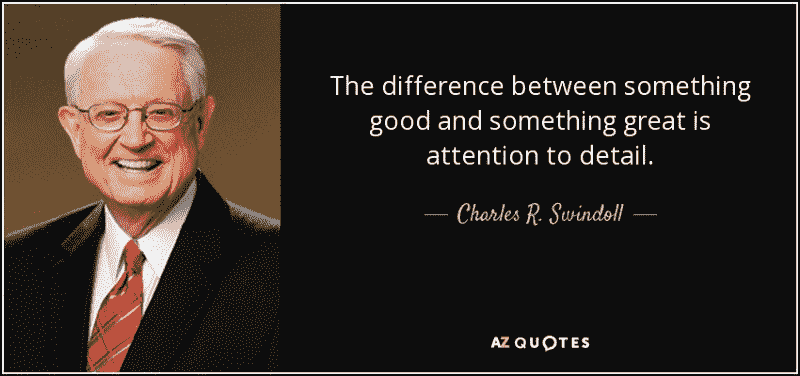

3.页数/示例数:如果你看看所有的市场，你会发现每个人都在开发有成百上千页的产品。这里的问题是，每个产品都带有同一个页面的多个例子，这些例子只有一个目的。例如，您会发现带有五个联系我们页面示例的产品。为什么你要创建五个好的页面，而不是一个简单易用的页面呢？

4.**更新次数:**因为分发是在一个不受创作者控制的平台上进行的，所以当你进行更新时，你的产品就获得了更多的知名度。所以人们只是做大量的更新，不管产品是否需要，只为了出现在别人面前。这里的问题是，如果你没有什么要更新的，你就开始添加更多的页面(**点 3** )或者更多的插件(**点 5** )。

5.插件数量**:**同样的故事可以在外部第三方插件中看到。例如，我们的大多数竞争对手都有 5-7 个不同的 JavaScript 插件做同样的事情。您的客户将只使用 1 个，因此他们很难移除其他 4 到 6 个来开始构建他们需要的东西。

6.**分销成本:**因为我们谈论的是在热门市场上销售产品的公司，他们必须向市场所有者支付 30-55%的收入。这取决于每个市场的条款。在我们的案例中，分发是直接在[我们的网站](https://www.creative-tim.com)上进行的。

7.**开发成本:**考虑到第 2 点、第 3 点和第 5 点，我们了解到这些公司在产品开发上投入了大量资金。但投入是做数量，而不是做质量。在我们的例子中，我们创建了一些内部工具，在那里我们一次编写代码，这是基于相同的设计规则构建更多的产品。通过这种方式，困难的部分(编写产品代码)由工具处理，而我们将大部分时间花在研究、测试新的和不同的想法上，并对细节给予大量关注。

如果你还觉得对细节的关注没那么重要，那就来看看三星 Galaxy S7(上)和苹果 iPhone 6S(下)上的一些基本调校吧。

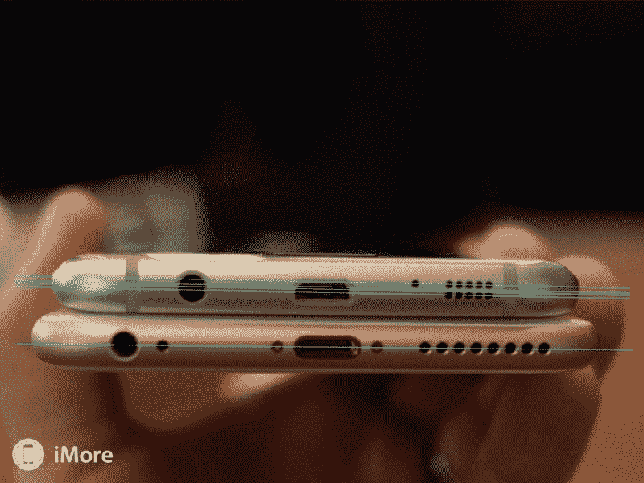

8.分销控制:由于我们的竞争对手在他们不控制的渠道上销售产品，基本上他们做不了什么，他们依赖于市场的所有者。如果所有者决定给某人发送更少的流量或者把产品从特色区域移走，你不能改变这一点。或者，如果我们想一想几周前发生在一个流行市场的另一个案例，所有者停止向创作者付款，并且三个月没有回应……在这种情况下，你能做什么？

在我们的例子中，我们可以做任何对用户有益的事情。此外，在这些年里，我们根据客户的反馈数百次地改变和更新了我们的平台。

9.**接触客户:**在我们竞争对手的例子中，很难直接接触到购买产品的人。在大多数情况下，只有当客户联系您请求支持时，您才能接触到他们。因此，他们不能定制电子邮件活动；他们不能捆绑他们的产品；他们不能在推出新产品时向所有客户宣布，等等。

我们在这里介绍的是一个蓝海战略的概述。如果你想了解更多关于如何为你的企业创造一个新的空间，而不是试图在红海中竞争，请查看[蓝海战略书](https://www.amazon.com/Blue-Ocean-Strategy-Uncontested-Competition/dp/1591396190)。

### 5.回馈:赞助、教育和辅导

在[创意时刻](https://www.creative-tim.com/presentation)我们相信回馈的力量！我们很自豪能够赞助学校、大学、黑客马拉松，并成为我们可以教人们如何成为更好的开发人员、设计师和企业家的活动的一部分。

多年来，我们已经使用了许多由其他公司和开发者制作的免费和开源内容，所以回馈是我们的责任。我们曾经用付费产品的许可证来赞助，在活动中使用产品的人和组织者的反馈非常好。赞助是一件很好的事情，即使我们要花很多时间来交谈，为参与者准备一切。每次活动后，我们还会收到客户支持请求。

目前，我们赞助了 150 多项全球活动，并且每月增加 5-10 项。如果您要为开发者举办一场活动，请在 hello@creative-tim.com 联系我们，我们将非常乐意与您合作。

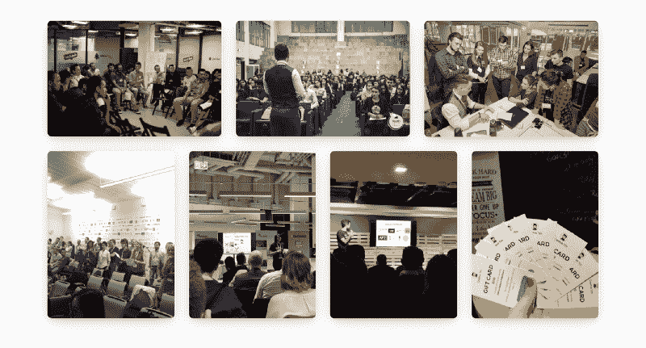

Some photos from events sponsored by us and training sessions

当我们参加不同的活动时，我们意识到我们只能帮助有限的参与者。因此，如果我们想帮助数百万人，我们需要在网上做一些事情，与我们的线下活动并行发展。所以我们开始为用户要求的不同主题制作教程。我们认为测试书面版本和录制视频是有好处的。一些例子:

*   【文章】[如何将 ReactJS 与 WebPack Babel 和 Material Design 配合使用](https://medium.freecodecamp.org/how-to-use-reactjs-with-webpack-4-babel-7-and-material-design-ff754586f618)——**3.9k 拍手**
*   【文章】[如何在 ReactJS 中使用 Redux 结合现实生活中的例子](https://medium.freecodecamp.org/how-to-use-redux-in-reactjs-with-real-life-examples-687ab4441b85) — **1k 拍手**
*   【视频】[关于前端开发的教程](https://www.youtube.com/channel/UCVyTG4sCw-rOvB9oHkzZD1w/videos)——**280k 浏览量**
*   【案例研究】[剖析每月收入 1000 美元的自举仪表板](https://medium.freecodecamp.org/the-anatomy-of-a-bootstrap-dashboard-that-earns-1-000s-each-month-ed3404010d25) — **14k 拍手**

我们也非常自豪，通过我们的合作，我们成功地支持了我们使用的不同框架和插件的许多创作者。例如，在撰写本文时，我们在过去的 12 个月中向流行材料 UI 库贡献了 71，555 美元。

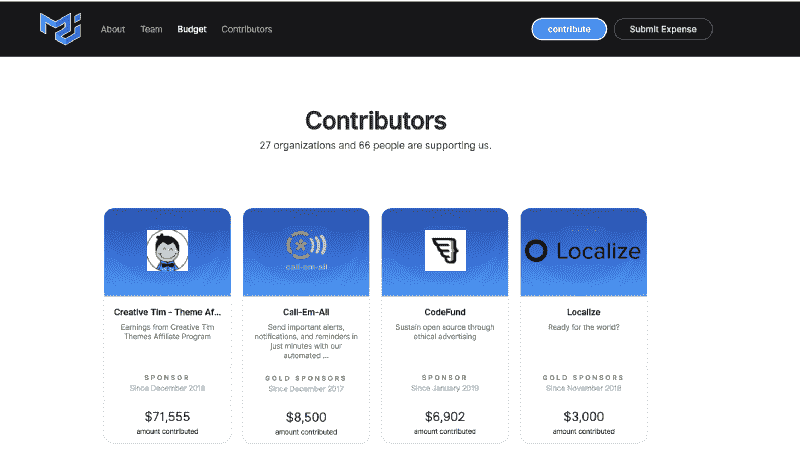

Image from Open Collective: [https://opencollective.com/material-ui#contributors](https://opencollective.com/material-ui#contributors)

### 6.人们可以将我们的策略应用于不同的业务吗？

我们相信每个公司都有足够的空间来创造价值，产生良好的利润，同时也回馈社区，所以我们不害怕分享所有这些战略。

> "创造力的秘密在于知道如何隐藏你的信息来源."——阿尔伯特·爱因斯坦

一些人受到我写的第一篇文章的启发，并设法在不同的环境中创建类似的企业。[威廉·坎迪隆](https://www.freecodecamp.org/news/we-made-1-052-000-in-2018-selling-ui-tools-here-is-what-we-learned-38920d86a296/undefined)就是一个很好的例子。你可以阅读[关于独立黑客的完整采访。](https://www.indiehackers.com/interview/how-transparency-and-good-timing-helped-me-capitalize-on-new-tech-d8032b8929)

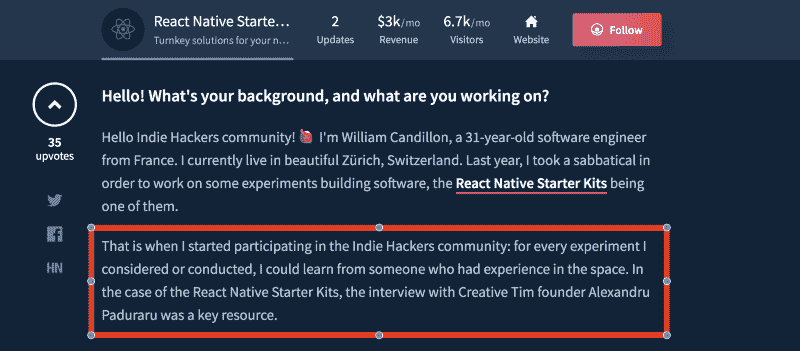

如果你应用了我们的任何策略，请在评论中与社区分享。

### 7.下一步是什么？

在过去的几年里，我们设法在前端生态系统中以我们交付的质量而闻名，我们很自豪地看到我们有超过 700，000 名开发人员在不同的项目中使用我们的产品。我们仍然是这个游戏中的一个微小的玩家，我们有很多东西需要学习和改进。我们总是构建我们所有的产品，并根据客户的要求开始在新的框架上进行迁移。

1.  从今年开始，我们很高兴地通知您，我们发布了第一批可以使用的 [**前端+后端**](https://www.creative-tim.com/search?utf8=%E2%9C%93&q=backend&button=) 解决方案。我们的客户和用户现在可以更容易地发布产品了。你可以在我们的网站上查看 [Node.js](https://www.creative-tim.com/search?utf8=%E2%9C%93&q=node&button=) 和 [Laravel](https://www.creative-tim.com/search?utf8=%E2%9C%93&q=laravel&button=) 示例。我们将根据我们的要求发布更多的后端解决方案。
2.  [ **Mobile** 我们还迁移了我们最受欢迎的产品之一， [Material Kit](https://www.creative-tim.com/product/material-kit) 来 React Native，到目前为止[的评价都很好(4.9/5](https://www.creative-tim.com/product/material-kit-react-native/reviews) )。你可以在这里查看并免费下载。这对我们来说是新的东西，我们了解到建立一个移动优先应用程序与建立一个响应性网站非常不同。我们将为我们所有的设计发布 React 原生版本。
3.  我们已经看到很多人和公司开始在他们的网站上添加插图，这样他们就可以更好地表达他们想要分享的东西。我们还在我们的一些产品中使用了插图，所以我们决定创建更多的插图，并免费提供给社区。这就是一个名为 [Ira 设计](https://iradesign.io/)的内部项目的诞生。我们将继续添加更多的插图和定制这个项目。

以下是该公司这些年来的发展概况。在支付代销商、供应商费用、增值税和其他国家间电子商务税之后，我们通常可以获得大约 75%的净收入。

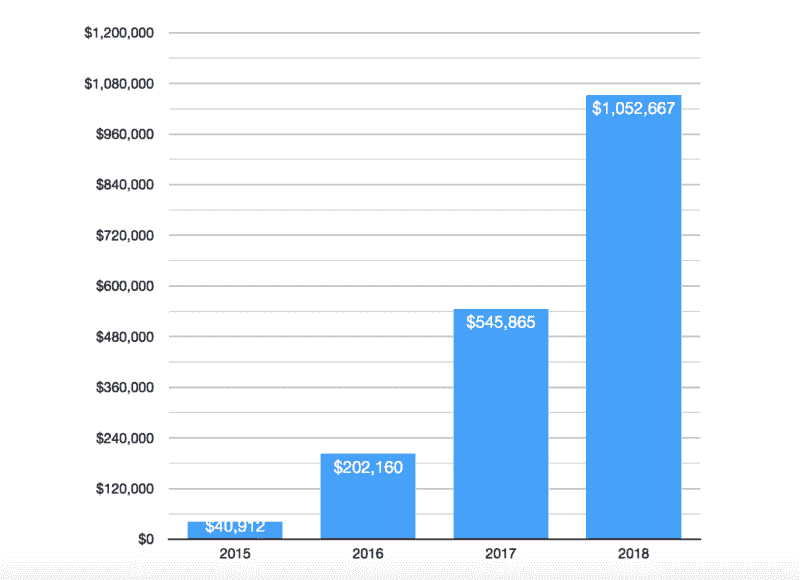

### 感谢您的阅读！

我希望这篇文章能给你一些想法，告诉你如何在你的企业中测试或应用新的策略，甚至创建一个新的策略。让我们在评论中继续讨论，如果你有问题、建议或想和我们一起工作，请随时联系我们的团队或我。

找到我和我们的团队:

*   电子邮件:[alex@creative-tim.com](mailto:alex@creative-tim.com)
*   insta gram:[https://www.instagram.com/alexandru__paduraru/](https://www.instagram.com/alexandru__paduraru/)
*   推特:[https://twitter.com/axelut](https://twitter.com/axelut)
*   官方网站:[https://www.creative-tim.com](http://www.creative-tim.com/?utm_source=indie-hackers)
*   我们的 Github:[https://github.com/creativetimofficial](https://github.com/creativetimofficial)