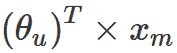
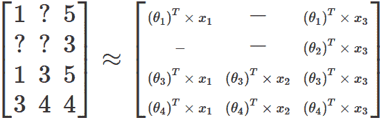
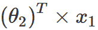

# 推荐系统中奇异值分解与矩阵分解的比较

> 原文：<https://www.freecodecamp.org/news/singular-value-decomposition-vs-matrix-factorization-in-recommender-systems-b1e99bc73599/>

最近，在看了吴恩达教授的[机器学习课程](https://www.coursera.org/learn/machine-learning)的推荐系统课后，我发现自己很不理解矩阵分解是如何工作的。

我知道有时候机器学习中的数学非常晦涩难懂。如果我们把它想成一个黑匣子会更好，但那个模型对我的标准来说非常“神奇”。

在这种情况下，我通常会尝试在谷歌上搜索更多的参考资料，以更好地掌握这个概念。这次我更加困惑了。虽然 Ng 教授将该算法称为(低因子)矩阵分解，但我在互联网上找到了一个不同的术语:奇异值分解。

最让我困惑的是，奇异值分解与 Ng 教授所教的非常不同。人们一直认为它们是一回事。

在本文中，我将总结我的发现，并试图澄清这些术语可能引起的一些混淆。

### 推荐系统

推荐系统只是向某人推荐某样东西的自动化方式。这种系统被电子商务公司、流媒体服务和新闻网站广泛使用。它有助于减少用户在试图找到自己喜欢的东西时的摩擦。

RS 绝对不是一个新东西:至少从 1990 年开始就有了。事实上，最近机器学习炒作的一部分可以归因于对 RS 的兴趣。2006 年，网飞赞助了一场为他们的电影寻找最佳 RS 的比赛，引起了轰动。我们很快就会看到，这一事件与随后的命名混乱有关。

### 矩阵表示

一个人可以想到很多方法来向别人推荐一部电影。事实证明，一个非常好的策略是将电影评级视为用户 x 电影矩阵，如下所示:

Created with [https://sheetsu.com/](https://sheetsu.com/)

在该矩阵中，问号代表用户没有评级的电影。然后，策略是以某种方式预测这些评级，并向用户推荐他们可能喜欢的电影。

### 矩阵分解

参加网飞竞赛的人(特别是西蒙·芬克)非常聪明地意识到，用户的评级不仅仅是随机猜测。评分者可能会遵循一些逻辑，他们将电影中他们喜欢的东西(特定的女演员或流派)与他们不喜欢的东西(长时间或糟糕的笑话)进行权衡，然后得出一个分数。

该过程可由以下类型的线性公式表示:

其中 *xₘ* 是具有电影 *m* 的特征值的列向量，而 *θᵤ* 是具有用户 *u* 赋予每个特征的权重的另一个列向量。每个用户有一组不同的权重，每个电影有一组不同的特征值。

事实证明，如果我们任意固定特征的数量并忽略缺失的评级，我们可以找到一组权重和特征值，它们创建一个新的矩阵，其值接近原始评级矩阵。这可以通过梯度下降来实现，非常类似于线性回归中使用的方法。现在，我们正在同时优化两组参数(权重和特征)。

使用上面我给出的表作为例子，优化问题的结果将生成下面的新矩阵:

请注意，在大多数真实数据集中，结果矩阵不可能是原始矩阵的精确副本，因为在现实生活中，人们不会通过乘法和加法来对电影进行评级。在大多数情况下，评级只是一种直觉，也会受到各种外部因素的影响。尽管如此，我们希望线性公式是一种很好的方式来表达驱动用户评级的主要逻辑。

好了，现在我们有了一个近似矩阵。但这究竟如何帮助我们预测缺失的收视率呢？请记住，为了构建新矩阵，我们创建了一个公式来填充所有值，包括原始矩阵中缺少的值。因此，如果我们想预测用户对某部电影的缺失评分，我们只需获取该电影的所有特征值，乘以该用户的所有权重，然后将所有值相加。因此，在我的示例中，如果我想预测用户 2 对电影 1 的评级，我可以进行以下计算:

为了让事情更清楚，我们可以将*θ’*s 和*x’*s 分离，放入各自的矩阵中(比如说 *P* 和 *Q* )。这实际上是一种矩阵分解，因此被 Ng 教授使用。

矩阵分解基本上就是芬克所做的。他在网飞的比赛中获得了第三名，吸引了很多关注(这是一个第三名比获胜者更有名的有趣例子)。从那以后，他的方法被复制和改进，并且仍然在许多应用中使用。

### 奇异值分解

输入奇异值分解(SVD)。奇异值分解是将一个矩阵分解成三个其他矩阵的一种奇特方法(*a =uσvᵀ*)。SVD 的实现方式保证了这 3 个矩阵具有一些很好的数学性质。

SVD 有很多[的应用。其中之一是主成分分析(PCA)，它只是将一个维度为 *n* 的数据集缩减到维度为 *k* ( *k < n* )。](https://en.wikipedia.org/wiki/Singular_value_decomposition#Applications_of_the_SVD)

我不会给你更多关于 SVDs 的细节，因为[我自己也不知道](https://towardsdatascience.com/svd-8c2f72e264f)。重点是 ****和**** 不是一回事，就像我们用矩阵分解一样。最大的证据是 SVD 创建了 3 个矩阵，而 Funk 的矩阵分解只创建了 2 个。

那么，为什么每次我搜索推荐系统时，SVD 总是出现呢？我不得不挖了一点，但最终，我发现了一些隐藏的宝石。根据路易斯阿格里希的说法:

> 用于推荐系统的矩阵分解算法试图找到两个矩阵:P，Q，例如 P*Q 匹配效用矩阵的已知值。

> *这个原理出现在著名的 SVD++“因式分解遇到邻域”的论文中，不幸的是，该论文使用了“SVD++”这个名称来表示一个与 SVD* 完全没有关系的 ***算法。***

对于记录，我认为 Funk，而不是 SVD++的作者，首先提出了推荐系统的矩阵分解。事实上，SVD++顾名思义，是 Funk 工作的扩展。

Xavier Amatriain 向我们展示了一幅更广阔的画面:

> *让我们首先指出，在建议 ***的上下文中使用的通常被称为“奇异值分解”的方法严格来说并不是矩阵的数学奇异值分解*** ，而是一种通过最小化平方误差损失来计算矩阵的低秩近似的近似方法。一种更准确、更通用的方法是矩阵分解。在 Netflix 奖的背景下，这种方法的最初版本是由 Simon Funk 在他著名的在家尝试博客帖子中提出的。值得注意的是，“真正的奇异值分解”方法在几年前确实被应用于同样的任务，但实际上并不成功。*

维基百科在它的[矩阵分解(推荐系统)](https://en.wikipedia.org/wiki/Matrix_factorization_%28recommender_systems%29)文章中也有类似的信息:

> *Simon Funk 在他的博客文章中提出的原始算法将用户-项目评级矩阵分解为两个低维矩阵的乘积，第一个矩阵为每个用户提供一行，而第二个矩阵为每个项目提供一列。与特定用户或项目相关联的行或列被称为潜在因素。注意，尽管它的名字是 ***，在 FunkSVD 中没有应用奇异值分解。****

总结一下:

1.SVD 是一种有点复杂的数学技术，它将矩阵分解为三个新矩阵，有许多应用，包括 PCA 和 RS。

2.Simon Funk 在 2006 年的网飞竞赛中应用了一个非常聪明的策略，将一个矩阵分解成另外两个矩阵，并使用梯度下降来找到特征和权重的最佳值。 ****不是 SVD**** ，但他还是用了这个词来描述他的技术。

3.芬克所做的更恰当的术语是矩阵分解。

4.由于良好的结果和随之而来的名声，人们仍然称这种技术为 SVD，因为作者就是这么命名的。

我希望这有助于澄清一些事情。