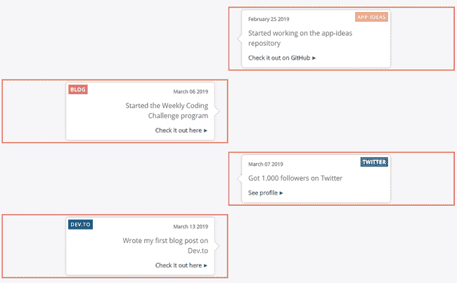
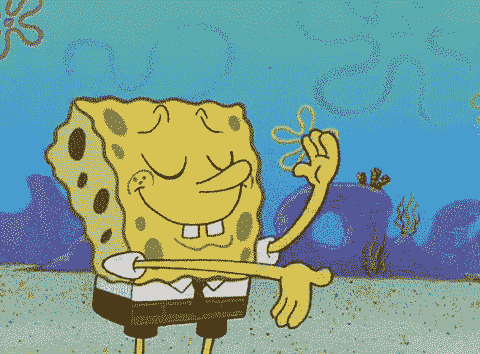

# 如何用 React 创建时间轴组件

> 原文：<https://www.freecodecamp.org/news/how-to-create-a-timeline-component-with-react-1b216f23d3d4/>

这些天我一直在为我的网站做一个新的页面。我想有一个时间表来展示这些年来我的一些职业成就。

我这样做有几个原因:

1.  未来的自己有一天会回头说:“哇…我还记得我做那件事的那一天！实现了那个目标，我是多么开心啊！”我们的成功是一个旅程，而不是目的地，我想写下我一路上实现的每个目标
2.  这可能会吸引更多的客户(我们会看到这是怎么回事？)
3.  在我看来，这是一种不同的投资组合。一个独特的投资组合，也许？？

然而…让我们现在就开始建造吧！

在上图中，你可以看到我们今天将使用 React 构建什么！开始之前，让我们分解一下需要采取的步骤:

1.  创造我们需要的`data`
2.  创建`TimelineItem`组件——每个单独的时间轴条目
3.  创建一个`Timeline`容器——它将接受`data`,并将其传递给`TimelineItem` s
4.  风格一切

### 创建数据

在我们实际创建 React 组件之前，我们需要确切地知道数据将会是什么样子，这样我们就可以规划出 DOM 结构。

对于这个时间轴应用程序，我们需要一个对象的*数组*。我们将这个数组称为:`timelineData`。

让我们看看它会是什么样子:

```
[
    {
        text: 'Wrote my first blog post ever on Medium',
        date: 'March 03 2017',
        category: {
            tag: 'medium',
            color: '#018f69'
        },
        link: {
            url:
                'https://medium.com/@popflorin1705/javascript-coding-challenge-1-6d9c712963d2',
            text: 'Read more'
        }
    },
    {
        // Another object with data
    }
];
```

属性非常简单，对吗？我使用了与我的时间线页面上的数据相似的数据，所以我们可以说这是生产就绪！？

接下来，我们将构建`TimelineItem`组件。这将使用来自上述对象的数据:

### TimelineItem 组件

```
const TimelineItem = ({ data }) => (
    <div className="timeline-item">
        <div className="timeline-item-content">
            <span className="tag" style={{ background: data.category.color }}>
                {data.category.tag}
            </span>
            <time>{data.date}</time>
            <p>{data.text}</p>
            {data.link && (
                <a
                    href={data.link.url}
                    target="_blank"
                    rel="noopener noreferrer"
                >
                    {data.link.text}
                </a>
            )}
            <span className="circle" />
        </div>
    </div>
);
```

我们有以下标签:

1.  div -用作包装材料。这个 div 的宽度将是其父 div 宽度(`50%`)的一半，并且使用`:nth-child(odd)`选择器将每隔一个`.timeline-item` div 放置在**右侧**处
2.  div——另一个包装器(关于我们为什么需要它的更多信息，请见样式部分)
3.  span -该标签将根据类别定制背景颜色
4.  `time` / `date`和`text`
5.  `link` -我们需要检查一下是否提供了一个`link`，因为我们可能并不总是想要一个
6.  这个标签将被用来在中线/横条上放置一个圆

**注意**:当我们到达**CSS**/样式部分时，一切都会变得更有意义，但是在此之前，让我们创建`Timeline`组件:

### 时间轴容器

这个组件将基本上覆盖数组，并为每个对象创建一个组件。我们还添加了一个小检查来确保数组中至少有一个元素:

```
import timelineData from '_path_to_file_';

const Timeline = () =>
    timelineData.length > 0 && (
        <div className="timeline-container">
            {timelineData.map((data, idx) => (
                <TimelineItem data={data} key={idx} />
            ))}
        </div>
    );
```

如上所述，`timelineData`是包含所有所需信息的对象数组。在我的例子中，我把这个数组存储在一个文件中，并把它导入到这里，但是你可以从你自己的数据库或 API 端点获取，这取决于你。

### CSS

**注意:**大多数包装器将是`flexbox`容器，因为我们可以更容易地调整它们的位置。

让我们从`.timeline-container` CSS 开始:

```
.timeline-container {
    display: flex;
    flex-direction: column;
    position: relative;
    margin: 40px 0;
}

.timeline-container::after {
    background-color: #e17b77;
    content: '';
    position: absolute;
    left: calc(50% - 2px);
    width: 4px;
    height: 100%;
}
```

我们使用`::after`选择器在`.timeline-container`的中间创建红线/条。使用`[calc()](https://developer.mozilla.org/en-US/docs/Web/CSS/calc)`功能，我们可以通过从`50%`中减去线的一半大小(`2px`)来将线准确定位在中间。我们需要这样做，因为默认情况下,`left`属性根据元素的左边缘而不是中间来定位它。

现在，让我们转到`.timeline-item`包装器。

下面你可以看到一个例子，说明这些元素是如何在它们的父元素(`.timeline-container`)中定位的。出于演示的目的，我添加了一个边框来突出显示这些包装器:



正如你所看到的，每隔一个包装器就放在右边的**，而内层包装器(`.timeline-item-content`)占据了更少的空间——这些空间是由它内部的`p`标签提供的(大部分)。**

**让我们看看这个的 CSS:**

```
`.timeline-item {
    display: flex;
    justify-content: flex-end;
    padding-right: 30px;
    position: relative;
    margin: 10px 0;
    width: 50%;
}

.timeline-item:nth-child(odd) {
    align-self: flex-end;
    justify-content: flex-start;
    padding-left: 30px;
    padding-right: 0;
}`
```

**这里的**关键**是我们使用了`:nth-child(odd)`选择器，我们将`align-self`属性设置为`flex-end`，意思是:“尽可能向右移动”！**

**因为这些包装器的宽度是`50%`，你可以看到其中两个占据了整个宽度。从现在开始，每次我们想在**右侧**设计不同的风格，我们都必须使用这种方法。**

**接下来，`.timeline-item-content`包装器:**

```
`.timeline-item-content {
    box-shadow: 0 0 5px rgba(0, 0, 0, 0.3);
    border-radius: 5px;
    background-color: #fff;
    display: flex;
    flex-direction: column;
    align-items: flex-end;
    padding: 15px;
    position: relative;
    width: 400px;
    max-width: 70%;
    text-align: right;
}

.timeline-item-content::after {
    content: ' ';
    background-color: #fff;
    box-shadow: 1px -1px 1px rgba(0, 0, 0, 0.2);
    position: absolute;
    right: -7.5px;
    top: calc(50% - 7.5px);
    transform: rotate(45deg);
    width: 15px;
    height: 15px;
}

.timeline-item:nth-child(odd) .timeline-item-content {
    text-align: left;
    align-items: flex-start;
}

.timeline-item:nth-child(odd) .timeline-item-content::after {
    right: auto;
    left: -7.5px;
    box-shadow: -1px 1px 1px rgba(0, 0, 0, 0.2);
}`
```

**我们有几件事要做:**

1.  **这个包装器有一个固定的`width`和一个`max-width`。这是因为我们希望它有一些边界，这意味着如果只有几个单词，我们希望框至少有`400px`宽，但是如果有很多文本，它不应该占据整个空间(来自`.timeline-item`包装器的`50%`，但是文本应该移到下一行- >这就是我们使用第二个 wrappe `r: .timeline-item-cont` ent 的原因**
2.  **根据父元素的不同，`text-align`和`align-items`属性用于将内部元素推到左边或右边**
3.  **指向中间线的小**箭头**由`::after`选择器上应用的样式给出。基本上它是一个盒子，上面有一个旋转的`45deg`**
4.  **如上所述，我们通过用`:nth-child(odd)`选择器选择父节点来设计**右侧**的样式**

**接下来，所有的内部元素:**

```
`.timeline-item-content .tag {
    color: #fff;
    font-size: 12px;
    font-weight: bold;
    top: 5px;
    left: 5px;
    letter-spacing: 1px;
    padding: 5px;
    position: absolute;
    text-transform: uppercase;
}

.timeline-item:nth-child(odd) .timeline-item-content .tag {
    left: auto;
    right: 5px;
}

.timeline-item-content time {
    color: #777;
    font-size: 12px;
    font-weight: bold;
}

.timeline-item-content p {
    font-size: 16px;
    line-height: 24px;
    margin: 15px 0;
    max-width: 250px;
}

.timeline-item-content a {
    font-size: 14px;
    font-weight: bold;
}

.timeline-item-content a::after {
    content: ' ►';
    font-size: 12px;
}

.timeline-item-content .circle {
    background-color: #fff;
    border: 3px solid #e17b77;
    border-radius: 50%;
    position: absolute;
    top: calc(50% - 10px);
    right: -40px;
    width: 20px;
    height: 20px;
    z-index: 100;
}

.timeline-item:nth-child(odd) .timeline-item-content .circle {
    right: auto;
    left: -40px;
}`
```

**这里需要注意几件事:**

1.  **正如您可能已经猜到的那样，`.tag`被放置在`absolute`的位置，因为无论盒子有多大，我们都希望把它放在左上角(或右上角)**
2.  **我们想在标签`a`的后面添加一个小的插入符号*来突出显示它是一个链接***
3.  **我们创建一个`.circle`,并将其直接放置在箭头前面*的中间线/条的顶部***

***我们快完成了！？剩下要做的唯一一件事就是添加 CSS，使所有内容都能在所有屏幕尺寸上响应:***

```
*`@media only screen and (max-width: 1023px) {
    .timeline-item-content {
        max-width: 100%;
    }
}

@media only screen and (max-width: 767px) {
    .timeline-item-content,
    .timeline-item:nth-child(odd) .timeline-item-content {
        padding: 15px 10px;
        text-align: center;
        align-items: center;
    }

    .timeline-item-content .tag {
        width: calc(100% - 10px);
        text-align: center;
    }

    .timeline-item-content time {
        margin-top: 20px;
    }

    .timeline-item-content a {
        text-decoration: underline;
    }

    .timeline-item-content a::after {
        display: none;
    }
}`*
```

***我们有两个媒体问题:***

***在小尺寸的笔记本电脑屏幕上——`max-width: 1023px`——我们希望让`.timeline-item-content`横跨其父屏幕的整个宽度，因为屏幕更小，否则它看起来会被挤压***

1.  ***在手机上— `max-width: 767px`***

*   ***将`.tag`设置为满的`width`(为此，我们不需要忘记从`100%`的总数中减去`10px`——这是因为我们将它定位在`left: 5px`，所以我们移除这个数量的两倍)***
*   ***将所有文本居中，从顶部向下推一点点***
*   ***移除链接上的插入符号并添加下划线—在移动设备上看起来更好？***

***啊…我们完成了！***

******

### ***结论***

***正如我提到的，这个组件在我的[时间轴](https://www.florin-pop.com/timeline)页面上。请查看它的运行情况！？***

***如果这篇文章中有你不明白的地方，请务必联系我，我很乐意回答你的问题！***

***编码快乐！？***

****最初发表于[www.florin-pop.com](https://www.florin-pop.com/blog/2019/04/how-to-create-a-timeline-with-react/)。****