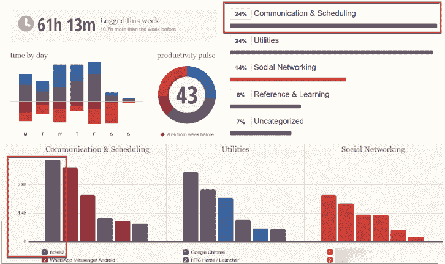
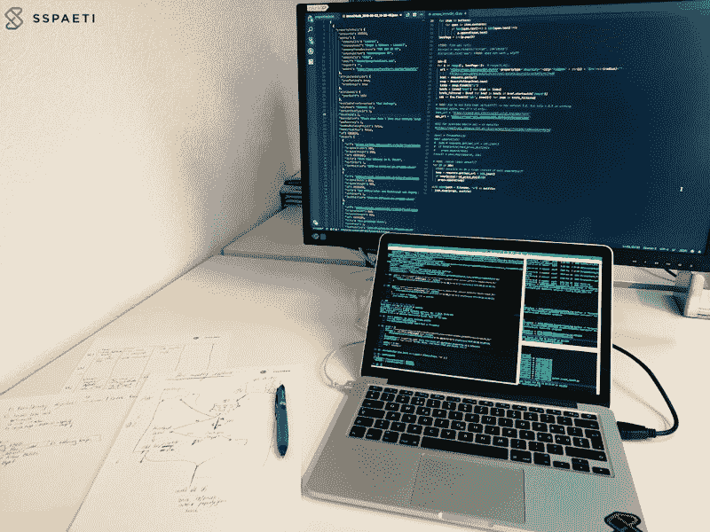

# 为什么你应该抛弃电子邮件，以及我们在工作中应该如何交流

> 原文：<https://www.freecodecamp.org/news/why-you-should-ditch-email-and-the-way-we-should-communicate-at-work-afd5d02652ce/>

电子邮件的第一个例子可以追溯到 1965 年，在麻省理工学院的计算机上一个叫做*邮箱*的程序中找到。除了快速和直接分享的优势外，有几项研究表明，普通办公室工作人员每天会收到 110 条信息。考虑到每次中断需要 20 分钟才能恢复的事实，这是一个主要的干扰，也增加了整体压力。

我问自己工作中没有更聪明的沟通方式(讨论、争辩、辩论)吗？这就是我在这篇文章中所经历的。

### 为什么电子邮件如此受欢迎

让我们先来看看为什么电子邮件如此受欢迎，并且仍然在绝大多数公司中被用作头号沟通工具。

电子邮件的一些优点和巨大优势肯定是可以快速直接地与很多人分享。它与位置无关。一个非常方便的功能，它保留了所有通信的记录，你可以随时返回。

成本显然非常低。一个很大的好处是，这仍然是向目标用户推销产品的最佳方式。

### 电子邮件的坏处

虽然有人可能会说电子邮件是高效的交流方式，但我反对。它是无效的，因为它是基于过时的期望。我们对待电子邮件就像对待一封信一样，每封电子邮件都会在信到达的那一刻立即得到回复。

电子邮件的一个主要问题是分散注意力，这可以被看作是一个开放的待办事项列表，其他人可以把一项任务放在上面。有不同的研究([中断工作的成本](https://www.ics.uci.edu/~gmark/chi08-mark.pdf)、[计算任务的中断和恢复](http://erichorvitz.com/CHI_2007_Iqbal_Horvitz.pdf))，其中一项研究称，员工每三分钟就会转换一次任务，主要是因为电子邮件。36 左右(！！)次一小时。

如果你想完成任务，这些干扰尤其糟糕。一般来说，每次中断都需要 20 分钟左右的时间来回到中断前的状态。因为生产率在更大的垃圾中是最好的，所以屏蔽电子邮件或用其他方式不间断地交流就更重要了。

> “在不受干扰的集中状态下进行专业活动，将你的认知能力推向极限。这些努力创造了新的价值，提高了你的技能，而且很难复制。”卡尔·纽波特(Cal Newport)，作家兼博客写手，他写的是深度工作的概念。

对于纽波特来说，深度工作的好处是不断提高你工作产出的价值，增加你生产的有价值产出的总量，以及更深层次的工作满足感。

除了妨碍你完成日常工作的能力，电子邮件还会增加你的整体压力。我甚至可以说电子邮件阻碍了工作关系。加州大学欧文分校的一项研究证实了这一点，并表示:“没有电子邮件，我们的调查对象更专注于他们的任务，任务更少，压力也更小。”

在所有这些缺点中，也许最大的一个是**缺乏结构**。如果你有电子邮件，所有的东西都会掉进兔子洞。每个人都需要自己整理电子邮件。只有这些任务会占用大量时间，而这些时间本可以更明智地用在项目任务上。

在丢失的结构之上是丢失的历史，如果一个雇员离开公司。许多非常有用和信息丰富的电子邮件以及组织它们的工作都丢失了。

### 在电子邮件上花费更少的时间

测量你的时间是改变你使用电子邮件方式的好方法。我用一个叫做 [RescueTime](https://www.sspaeti.com/blog/tools-i-use#Capture_the_time) 的工具做到了这一点。这样你可以清楚地看到你在每个应用上花了多少时间。总的来说，我把 24%的时间用于交流，包括 WhatsApp、脸书和我的朋友。然而，只有在工作中，我发现自己每天在电子邮件客户端上使用 1 小时或更多。当然，有些是必要的，有些甚至是为了安排会议。但还是太多了，从那以后我试着少用一些，更有效地使用电子邮件。

Captured 24% of the time for communication

然而，一些时间的花费并不是由于我的行为。这是公司，取决于你的团队或公司如何沟通。一些研究表明，普通的办公室工作人员每天会收到 110 条信息，他们花 28%的时间处理邮件。也就是说，一周有 13 个小时或者一年有 650 个小时(T2)在查看电子邮件。想象一下，对于你的组织来说，收回失去的时间是多么的强大！

有些工作中，电子邮件是你的主要工作，比如在呼叫中心工作。在这种情况下，你不能改变或立即受益。但是，正如《福布斯》的这篇文章所说，那些每周花 5 到 20 个小时阅读和写电子邮件的经理们怎么办呢？或者对技术人员来说更是如此，因为他们的主要目的是开发新功能、解决问题和发挥创造力。在这些情况下，电子邮件并不是他们在工作中取得成功应该做的事情。

### 当今通信的需求是什么？

让我们来看看我们对电子邮件，或者更一般的交流有什么要求。除了知道哪些用户在使用哪些通信方式，通常这不仅仅是技术上的调整，更多的是文化上的改变。

由于千禧一代现在是最大的群体(在美国劳动力中)，我们也应该确保我们使用适合他们的方式和工具。千禧一代伴随着技术成长，更熟悉社交媒体中更新的沟通方式。由于电子邮件是在 1965 年首次使用的，我想说它不再是最适合今天需求的了。

### 千禧一代的特征

让我们更深入地了解一下千禧一代的特征。他们喜欢待在一个社区里，成为某个事物的一部分，并有一个真正的目标。他们一直使用手机。他们并不总是那么严厉，他们欣赏诚实，他们希望被倾听。他们希望与高层领导接触，给予反馈和建设性的批评，他们希望每个参与的人都能成功，简明扼要。此外，他们喜欢新工具，更喜欢书面交流。

管理一个重要的项目或处理复杂的任务可能会让人不知所措。大多数千禧一代宁愿不碰电话，使用书面交流方式来简化工作。通过即时消息发送消息是一种快速有效的联系方式。通过社交网络的书面交流也使千禧一代能够在不丢失任何细节的情况下分配项目，并且所有信息都可以在以后回忆起来。这有助于跟踪项目更新，因为参与的每个人都有责任。在这里查看更多关于如何与千禧一代合作的信息以及如何有效地做这件事。

### 如何扭转沟通？我们能做什么

为了适应新一代，我们应该使用有助于实现他们目标的工具。

#### 工具和工作方式

其中最重要的是**你正在使用的工具或平台**。如果你还在使用瀑布方法和微软的 Word 文档，一次只有一个人可以编辑它，这使得共享变得很困难。这样你就不允许反馈和改变你的想法。另一方面，在支持反馈文化的方法中，比如像 [Scrum](https://en.wikipedia.org/wiki/Scrum_(software_development)) 或者类似的，你希望每两周(或者只要你的 Sprint 还在)就有改进和反馈。

**你要用的这个平台或工具的一个特点一定是一切都在同一个地方**。讨论、会议日历、新想法提案、状态更新、文件共享、聊天，甚至客户端访问。也许电子邮件转发和上传重要的电子邮件。但是报告、搜索、通知和最重要的，待办事项/缺陷/故事应该都在一个地方。

或者，如果不可用，使用大多数工具都具有的强大集成。随着工具链每天都在增长，将某些重要的工具集成到您的沟通和管理平台中也很重要。如果您有一个 git 存储库或任何文件共享，您可以添加集成到您的工具中的扩展。

这样你就**最小化** **额外的沟通和协调**，因为你不需要同步任务、状态、公开讨论等。，每个人都可以在一个地方看到所有内容。你可以立即得到反馈，每个人都可以做出贡献。反馈是特定于任务、想法、缺陷等的。就在它该在的地方。

### “收件人”、“抄送”和“密件抄送”字段

在电子邮件中瞄准一大群人是一件很糟糕的事情，尤其是当你需要预先决定谁应该放在“收件人”、“抄送”和“密件抄送”栏中。很容易忘记一个人，更糟糕的是，你把所有想到的人都加了进去。尽量只针对需要的人。

从一个小团队开始，只有当想法或故事变得更加成熟时才扩大。如果你想让每个人都看到它，你只需添加核心团队，并保持访问权限对每个人开放。这样，没有人被遗漏，但他们不会收到大量不必要的通知。再加上他们只能在你有时间或者想看的时候看一看。

由于您可以为每个主题和发件人创建电子邮件规则，这有点麻烦。尤其是在上述工具中，你可以为每个项目、每个讨论、每个任务指定通知。这样，您就可以决定何时以及如何收到通知。在电子邮件中，您会收到随机的非结构化电子邮件通知。

### 办公室及其噪音水平

Productive working setup

除了平台和工具，拥有一个高效的工作环境也很重要。随着越来越多的公司转向开放式办公室，让每个人都呆在一个房间里很有帮助，但这与高效、深入的工作相矛盾。每当有人打电话、进行没有你参加的重要讨论时，你都会被打断，等等。即使你不想听，你的大脑也会听——你总会发现自己在听。

你可以使用带噪音消除功能的耳机和 T2 音乐来集中注意力，这使得工作方式更有效率，但是你在安静的环境中也会更有效率。我喜欢把你的办公室定义为图书馆，就像 J. Fried 和 D. H. Hansson 在他们的书[中描述的那样，工作不一定要疯狂。因为如果你去图书馆，你会希望每个人都保持安静，高效地工作。办公室不也应该这样吗？](https://basecamp.com/books/calm)

开会也一样。当办公室是一个安静的地方时，你需要在会议室进行许多讨论和研讨会。但我会区分会议和富有成效的合作。作为富有成效的一对一研讨会，解决问题肯定会提高生产力(很多！)，长时间的状态更新或无效的讨论，如果它们不是由解决方案驱动的，可以走向另一个方向。

就像塞斯·戈尔丁在他的文章中所说的那样，把会议想象成让你付出了代价。你可能会再三考虑是否以及如何开会:

1.  邀请谁
2.  让会议准时开始
3.  确保每次会议都有明确的目的
4.  管理信息流，包括议程和协调讨论
5.  给每个参加会议的人发一份后续备忘录

### 敏捷和远程工作

如前所述，我认为你应该以敏捷的方式工作。它与上面提到的大部分要点密切相关。如果你工作敏捷，你使用 scrum 或类似的方法，有明确定义的用户故事，使他们容易与你的利益相关者讨论。

为开发人员定义任务。这样你需要更少的同步，因为工具允许你在需要的时候轻松地移动一个用户故事。此外，您可以看到每个人都在做什么，他们可能会在哪里卡住，您可以轻松地计划您的冲刺，也可以轻松地进行远程工作。

### 有什么工具可以做到这一点？

外面有很多工具。以下是一些例子，当然这个列表并不完整:

*   ****——也许是最完整的**
    管理项目、与客户合作、与承包商协调、与团队沟通**
*   **[**懈怠**](https://slack.com)**——非常适合在项目或团队中一对一替代电子邮件**
    让团队沟通变得快速简单的强大工具。**
*   **[**Gitlab**](https://about.gitlab.com/) **—最佳选择非常好地与 git 合作，在整个软件开发生命周期中提交**
    单个应用程序。从项目规划和源代码管理到 CI/CD、监控和安全性。**
*   ******—也许是最好的自由选择**
    团队用来专注于目标、项目和日常任务的工作管理平台****
*   ********—特别适合项目开发，bug 和跟踪**
    问题跟踪产品允许 bug 跟踪和敏捷项目管理******
*   ********——对于小项目和少量人员，非常精简的**
    板、列表和卡片使您能够以有趣、灵活和有益的方式组织和优先化您的项目。******
*   ****[**泰加**](https://taiga.io) **—面向敏捷开发者&设计师和项目经理的开源 basecamp**
    项目管理平台****

****一些不太出名的电子邮件替换工具(按字母顺序排列):****

*   ****[activecollab.com](https://activecollab.com/)****
*   ****[clickup.com](https://clickup.com/)****
*   ****[copperproject.com](https://www.copperproject.com/)****
*   ****[freedcamp.com](https://freedcamp.com/)****
*   ****[glip.com](https://glip.com/)****
*   ****[huddle.com](https://www.huddle.com/)****
*   ****[肚子链接. com](https://www.mavenlink.com/)****
*   ****[monday.com](https://monday.com)****
*   ****[nostromo.io](https://nostromo.io/)****
*   ****[nozbe.com](https://nozbe.com)****
*   ****[php-collab.org](https://www.phpcollab.com/)****
*   ****[proofhub.com](https://www.proofhub.com/)****
*   ****[proworkflow.com](https://www.proworkflow.com/)****
*   ****[teamwork.com](https://www.teamwork.com/)****
*   ****[wrike.com](https://www.wrike.com)****

****这也归结于你的公司如何沟通:例如，记者们倾向于不断地用想法和非常简短的问题相互交流，因此 Slack 可能是最好的选择。****

****还有更激进的工具，其中所有的通信和过程都基于业务工作流。一个例子是 [Tigerconnect](https://www.tigerconnect.com/) 。****

### ****结论****

****无论你做什么决定，是使用电子邮件还是一种新的、更现代的交流方式，记住花在交流上的时间。提高效率，不要分散注意力。此外，写一个原因。不要试图第一个回答。最好仔细考虑一下，只有在能给谈话增加价值的情况下才回复。此外，在你的回答中使用 if-then-else 来预见谈话可能会走向哪里，以避免来回沟通。****

****明确定义何时使用哪个沟通渠道，以及你想要达到什么目的，以避免过多的渠道。****

****最后，使用正确的工具，以一种有效的方式交流是很有趣的，一起解决问题和用户故事，将每周的会议减少到最低限度。不再错过最后期限，不再困惑于“我是这么想的，所以我对此负责”，并且变得前所未有的高效。****

****相关链接:****

*   ****[如何以及为什么使用讨论线索而不是聊天、电子邮件或会议——大本营](https://www.youtube.com/watch?v=37NdXbkRGpE)****
*   ****[你应该用管理软件取代电子邮件的八大理由](https://for-managers.com/replace-email-management-software/)****
*   ****[电子邮件最糟糕的科学原因](https://mic.com/articles/106014/5-reasons-email-is-the-absolute-worst-explained-by-science#.C6y3AWFay)****
*   ****[取代无聊的状态会议或状态更新——大本营](https://www.youtube.com/watch?v=FnOjj-Oe08k)****
*   ****[退出电子邮件如何帮助我的公司更好地沟通](https://thenextweb.com/entrepreneur/2014/11/09/quitting-email-helped-company-team-communicate-better/)****
*   ****[更好工作的关键？电子邮件少，流量多](https://thenextweb.com/entrepreneur/2014/07/29/work-better-email-less/)****
*   ****[改善工作沟通的 10 种简单方法](https://peakon.com/blog/workplace-culture/improve-communication-at-work/)****
*   ****举个重要的例子，脸书最近甚至买下了整个平台:[脸书收购 Redkix(统一通信)](https://techcrunch.com/2018/07/26/facebook-acquires-redkix-to-enhance-communications-on-workplace-by-facebook/)****

*****最初发布于[https://www.sspaeti.com](https://www.sspaeti.com/blog/email-and-the-way-we-should-communicate-at-work/)2019 年 4 月 25 日。*****