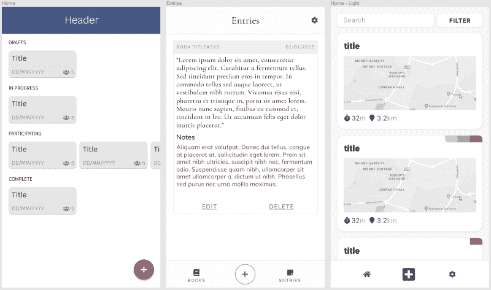

# 作为开发人员，如何提高你的 UI/UX 设计技能

> 原文：<https://www.freecodecamp.org/news/how-to-improve-your-ui-ux-design-skills-as-a-developer-1fd96a49d807/>

如果你在四年前问我，当我成为一名 CS 毕业生时，我认为自己会走什么样的职业道路，我可能会告诉你后端 Java 开发或类似的事情。我从来没有创造性，在绘画遇到画布的那种方式，所以我真的没有考虑过涉及前端开发和设计的职业道路。

众所周知，世事无常。在我的职业生涯中，我对 UI 开发和设计越来越感兴趣。我在工作中非常幸运，能够接触到前端开发，并被允许投入时间来提高成为前端开发人员所必需的技能。

在过去的 12 个月里，我一直在努力提高我对 UI/UX 设计的理解，这既是因为个人兴趣，也是为了让我在与设计师合作时更有效率。

在这篇文章中，我想分享我学到的经验、我收集的资源和我犯的错误，希望其他开发人员能够从我的旅程中吸取教训。

### 目录

*   [不仅仅是天赋](#fb0b)
*   [看，想，偷](#bb43)
*   [学理论](#759a)
*   [造东西](#1373)
*   [不要放弃](#7f61)
*   [资源](#4562)
*   [结论](#d161)

### 不仅仅是天赋

这一点现在对我来说似乎是显而易见的，但曾经有一段时间，我认为设计师是天生的奇才，他们有能力创造出令人惊叹的应用程序和网站。

事实证明他们不是。他们刚刚努力完善他们的工艺。就像学习编码对一些人来说更容易一样，有些人天生就有设计天赋，但是没有努力，天赋并不意味着什么。

设计是可以学习的。不要犯我所犯的错误，把自己一笔勾销，因为你没有传统意义上的创造力。解决编程问题需要创造力；想想用同样的方式解决设计挑战。

### 看，想，偷

正如阅读好的代码会帮助你成为一名更好的开发人员一样，从别人创造的东西中学习也会帮助你成为一名更好的设计师。

下次你访问一个网站或使用一个应用程序时，*看着它，*真正地*思考一下为什么它看起来和行为是这样的。为什么元素被放置在它们原来的位置？为什么那个按钮是一种特殊的颜色？为什么一定要按照一定的顺序执行动作？*

以 Medium 的鼓掌按钮为例。为什么他们不像其他社交媒体网站一样使用“喜欢”按钮呢？在我看来，不这样做是一个聪明的设计决定。相反，他们能够通过精心设计互动来强化推动网站发展的社区理念。给一篇文章或一个回复打 50 个拍子对用户来说是需要时间的，但这有助于他们真正地与他们正在浏览的内容和创建它的人联系起来。

像 [Awwwards](https://www.awwwards.com/) 和 [Dribbble](https://dribbble.com/) 这样的网站在去年对我来说已经证明是无价的。我创作的许多设计都从其他伟大设计师的作品中汲取了*自由派*的灵感。

### 学习理论

当我第一次开始整合自己的设计时，我不明白为什么它们看起来和表现得如此糟糕。流程笨拙，颜色不匹配，布局不一致。

我想作为一个用户，我可以直接投入进去，用我的开发知识和我的关于网站应该如何工作的基本知识，而且会做得很好。

我大错特错了。我最终从开发者的角度创造设计，而不是以设计理论为基础。

开发者知道一个网站如何工作，但是设计师知道一个网站如何表现和感觉。有一个很大的缺口，你只能通过获得设计知识的基础来填补。

为了对设计理论有一个基本的了解，我主要使用了 Medium 和 Udemy。你可以在下一节找到我使用的资源的链接。

### 建造一些东西

任何一个开发者或者 CS 教授都会告诉你，成为一个更好的程序员最好的方法就是写代码。同样的原则也适用于设计。

设计什么并不重要，只要从中学习就好。把它当成一个真正的项目:想想用户。创建线框、模型和原型。迭代原始设计以改进它。你可以使用像 Reddit 这样的网站来获得对你所创造的东西的反馈。

你甚至可以把它和提高你的开发技能结合起来。我最近的大部分兼职项目都是为了提高我的网页开发和设计技能。在你设计好你的项目后，你可以开发它，并看到硬币的两面。

以下是让你开始的一些想法:

*   设计一个*交互。*使用 Medium 的鼓掌按钮获得灵感。
*   为你最喜欢的慈善机构设计一款应用。考虑不同类型的用户:潜在的、不经常光顾的和经常光顾的顾客。
*   设计你的简历。想想你使用的颜色和它们的含义。想想你的简历会被如何使用。只是在屏幕上观看，还是打印出来？这对设计有什么影响？
*   重新设计现有网站。它可能是您当地的运输提供商，也可能是一个全球品牌。将你的设计与原始设计进行比较，从用户的角度思考不同之处。
*   设计一些有形的东西，比如一种新的交通方式，或者是简单的东西如叉子或椅子的替代品。我发现思考日常事物的[设计](https://www.amazon.com/Design-Everyday-Things-Donald-Norman/dp/0465067107/ref=tmm_pap_swatch_0?_encoding=UTF8&qid=&sr=)是一种非常有用的方法，可以让你进入思维模式，设计出一些直观的东西。

### 不要放弃

当我回顾一年前我创造的东西时，很难不退缩。但是每个人都有起点。看到你所创造的进步是值得的。只要你从你正在做的事情中学习，那么你的时间是值得的。

定期记录你所学的知识可能会有所帮助。每个月我都会回顾一些我曾经做过的事情，并尝试从这些经历中获取尽可能多的东西。即使只是为了识别你从阅读文章中获得的一些小信息，这也是一种进步。

Some designs I have created from oldest (left) to newest (right)

### 资源

下面是我最喜欢的工具、文章和课程的一个小集合。你可以找到更多我没有列出的和*。*

#### 工具

[Figma](https://www.figma.com/) —协作设计和原型制作。

[FramerX](https://www.framer.com/) —类似于 Figma，但是添加了 React 和 discoverable 组件。

[coolers](https://coolors.co/)—发现并生成调色板。

[WebAIM 对比度检查器](https://webaim.org/resources/contrastchecker/) —确保您的颜色易于使用。

[原型](https://archetypeapp.com/#) —排版系统编辑器和生成器。

#### 文章

[设计作弊的 7 个实用技巧](https://medium.com/refactoring-ui/7-practical-tips-for-cheating-at-design-40c736799886)

[设计用户界面的 10 个秘籍](https://medium.com/sketch-app-sources/design-cheatsheet-274384775da9)

[我们仍然会犯的 10 个小设计错误](https://uxplanet.org/10-small-design-mistakes-we-still-make-1cd5f60bc708)

[设计更好的表单](https://uxdesign.cc/design-better-forms-96fadca0f49c)

[UX 交付成果的完整列表](https://uxplanet.org/a-complete-list-of-ux-deliverables-d62ccf1de434)

[每个 UI/UX 设计师需要知道的心理学原理](https://uxplanet.org/the-psychology-principles-every-ui-ux-designer-needs-to-know-24116fd65778)

[如何在 UI 设计中运用色彩](https://blog.prototypr.io/how-to-use-colors-in-ui-design-16406ec06753)

[作为 UX 设计师你需要阅读的 16 句名言](https://uxplanet.org/16-quotes-you-need-to-read-as-ux-designer-e47f982e312c)

[单卡产品设计原理](https://blog.prototypr.io/product-design-principles-in-a-single-card-2f6023419a87)

#### 课程

[用户体验设计基础](https://www.udemy.com/course/user-experience-design-fundamentals/) — Udemy

[完整的 App 设计课程——UX、UI 和设计思维](https://www.udemy.com/course/the-complete-app-design-course-ux-and-ui-design/) — Udemy

[UXTraining.com](https://www.uxtraining.com/)

### 结论

我希望你能从我的旅程中学到一些东西。如果你有帮助你学习的设计技巧或资源，我很乐意在回复中听到它们。

感谢阅读！