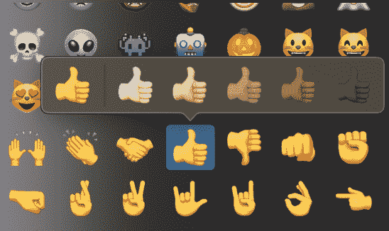

# 在 VueJS 中发现闭包的力量

> 原文：<https://www.freecodecamp.org/news/closures-vuejs-higher-order-functions-emojipicker-f10d3c249a12/>

法比安·欣森坎普

今天的前端技术环境要求工程师了解各种各样的技术，包括框架、库和包。

难怪普通的 JavaScript 技能和深入的知识可能会开始分散。不管你是刚学 JavaScript，还是在刷新基础知识，还是在准备求职面试→这个教程就是为你准备的！

在这里，您将了解普通 JavaScript 闭包有多强大。请注意，本教程带有一个挑战。？这一切都是为了在 VueJS 中构建一个优雅的表情选择器，并通过使用高阶函数来利用闭包。

让我们开始吧！

### 功能范围

尽管闭包是 JavaScript 中最强大的概念之一，但它们很容易被许多人忽略。

然而，了解闭包是最基本的，因为它们定义了函数在执行过程中可以访问哪些变量。更准确地说，闭包定义了一个函数从自己的作用域开始，通过所有父作用域直到全局作用域可以访问的作用域。

要真正掌握闭包，首先必须对作用域有一个坚实的理解。您可能已经亲身体验过 scopes 的影响。每次执行函数时，都会创建一个作用域。每当您在该函数中创建变量时，这些变量只能从函数本身中访问。

当一个函数完成时(通过到达`return`语句或`}`，所有这些变量都被销毁。下次执行该函数时，将应用相同的过程。

让我们看下面的例子来说明这个概念。

```
function square(x){
  const squaredX = x  x;
  console.log(squaredX); // 25
  return squaredX;
}

const squaredA = square(5);

console.log(squaredA); // 25 
console.log(squaredX); // ReferenceError: squaredX is not defined
```

把作用域想象成只有该函数中的代码可以访问的临时上下文。

虽然作用域的生命期非常有限，受到函数执行所需时间的限制，但相比之下，函数的闭包在函数最初定义时就已经创建了。它也将在执行完成后保留。

### 关闭

如前所述，闭包负责定义在函数执行范围内哪些变量是可访问的。理解闭包不提供可用变量的副本，而是提供对它们的引用是很重要的。如果您不熟悉 JavaScript 的参考资料，请查看这篇文章。

```
let globalString = 'A'

function hello(){
  const localString = 'C'
  console.log(globalString, localString);
}

hello(); // A C

globalString = "B";

hello(); // B C
```

这个例子看起来可能很熟悉——没什么特别的。这解释了为什么我们几乎没有意识到闭包有多强大，因为只在全局范围内定义函数是很常见的。

然而，当函数在另一个函数的作用域内定义时，闭包支持强大的技术和模式。在面向对象的架构中，闭包提供了一种简单而有效的方式来建立**数据隐私。在更多的函数式架构中，闭包对于 ****高阶函数**** 和 ****局部应用**** 和**这两种更高级的编程技术是必不可少的。****

### ****高阶函数****

****对其他函数进行操作的函数，无论是将它们作为参数还是通过返回它们，都被称为 ****高阶函数**** 。****

```
`function createMultiplier(multiplier){
  return function(value){
    return value  multiplier;
  }
}

const multiplyBy2 = createMultiplier(2);

console.log(multiplyBy2(5)); //10`
```

**在这里，我们终于可以体验闭包的威力了。即使`createMultiplier`已经成功完成，我们仍然可以访问它的初始`multiplier`属性。**

**这是可能的，因为闭包保留了变量的引用。这些甚至可以跨越多个作用域，并且在上下文终止时不会被破坏。这样，我们仍然可以访问局部变量的特定实例。**

### **数据保密**

```
`function privateVariables(){
  let privateValue = 100;
  return {
    get: function(){
      return privateValue;
    }
  }
}

console.log(privateVariables.get()); //100`
```

**闭包为什么能让我们实现数据隐私？**

**我们可以简单地封闭变量，只允许包含(外部)函数范围内的函数访问它们。**

**除非通过对象的特权方法，否则不能从外部作用域获取数据。这种模式还允许我们对接口而不是实现本身进行编程。**

### **编码挑战:表情符号拾音器**

****

**太好了，这就是我们在 VueJS 中构建强大的东西和利用闭包的力量所需要的全部理论！**

**事实上，高阶函数是最有趣的用例，因为我们在 VueJS 中已经有了数据隐私的概念。**

**基本上，组件已经通过属性和数据对象提供了一个不能从外部访问的接口。**

**它是的一个组件，允许用户在所有可用色调的基础上选择肤色，类似于在智能手机上发送短信的用户体验。**

**从技术上讲，您应该尝试创建一个组件，该组件接收单个表情符号作为道具，并使用高阶函数创建多个点击事件处理程序来选择不同的音调。**

**代码可以查看[沙盒](https://codesandbox.io/s/pw940vx207?fontsize=14)！**

### **暗示**

**表情符号可以存储为字符串值中的 HTML 十六进制代码。双手合十表情符号是🙏。要改变色调，请附上颜色代码。你可以在这里找到代码。**

> *****&# x1f 64 f+&# x1f 3fd =？？*****

### **建筑挑战延伸**

**你想更进一步，看看你是否掌握了闭包？然后传递多个表情符号并让它工作，这样你就可以一次改变多个表情符号的肤色。？**

### **结论**

**闭包是我们可以在相关函数可能已经终止的时候访问父作用域的变量的原因。**

**我们可以在 VueJS 中使用 JavaScript 的这种行为来基于动态参数动态构建方法，而不会因为大量的变量和方法而污染我们的组件。**

**感谢阅读？**

* * *

**最初发表在 https://hinsencamp.com 的博客上。**