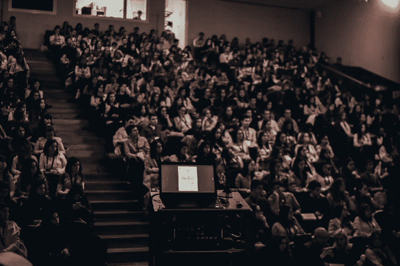
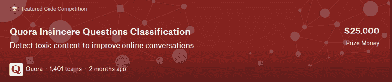
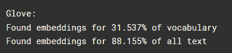
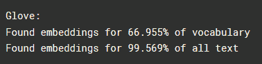
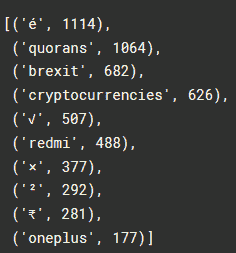
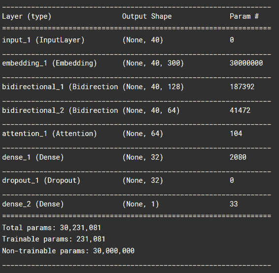

# 我在大学做了一个 Kaggle 竞赛作为学期项目。以下是我学到的。

> 原文：<https://www.freecodecamp.org/news/i-did-a-kaggle-competition-as-a-semester-project-at-uni-heres-what-i-learned-afe36a99d309/>

by Ane Berasategi

# 我在大学做了一个 Kaggle 竞赛作为学期项目。以下是我学到的。

这是我第一次参加比赛，也是我的第一个学期。我不知道我在做什么。

Photo by [Miguel Henriques](https://unsplash.com/@miguel_photo?utm_source=medium&utm_medium=referral) on [Unsplash](https://unsplash.com?utm_source=medium&utm_medium=referral)

这是一个关于我如何决定在一个长达一学期的项目中发挥创造力的故事，我最初的主题选择是如何被粉碎的，以及在最后一分钟做一个 Kaggle 竞赛如何挽救了我的分数。

就我个人背景而言，我学的是电信工程，我有一些软件开发和机器学习的经验，但当时我对 NLP 一无所知。

我上学期开始攻读硕士学位，我参加的第一个主题是 NLP 中的“分类和聚类”。教授在第一周解释了文本处理的基础知识，之后每个学生必须在 NLP 中选择一个分类或聚类问题，记录理论，实现解决方案，并向全班展示。实现可以在学期结束时完成，而不是在演示时立即完成。

> 我是大学新生，所以我决定等一等，观察其他学生做什么。

#### 选择主题

很快，决策树、朴素贝叶斯、随机森林、支持向量机、逻辑回归等主题被挑选出来。我几乎不知道它们是什么，所以一想到我的同事们将这些话题压缩到 30 分钟的演示中，我就很兴奋，我把所有的注意力都放在它们身上，并尽可能地写下所有的笔记。

不幸的是，这些第一次的展示都是纯理论的，因为没有人有时间在学期的早期实施任何东西。我后来了解到，这么早做演示背后的动机是为了“在别人开始之前选择一个简单的主题”和“完成演示”，将算法的实现推迟到学期的晚些时候。

尽管我尽了最大努力，但我还是不明白很多演示文稿。我需要把事情形象化，看代码，看例子。对我来说，理解一个充满数学符号和公式的演示文稿并不容易。

> 几个星期过去了，教授开始催促我们选一个主题，定一个日期来做报告，而我什么也没有。在开始恐慌之前，我等待了更多的演示。

接下来的演示稍微高级一点:LDA、LSI、感知器、NNs、tensorflow、keras 和单词嵌入等等。

我对一些主题(LDA 和 LSI)完全无知，但我知道一些最小的 ML。这些演示确实包含了**代码**，有时甚至太多了。有很多滚动和很少的时间花在分析代码，重点是纯粹的结果。我了解了 tensorflow 和 keras 的起源，每次演示结束时，我都感到筋疲力尽和困惑。尽管我尽了最大努力，我还是没学到多少东西。

> 我是最后留下来选题目的学生之一，教授每次提到‘友情提示’都在看着我。我明白了。

我试图理性地思考:没有多少明显的主题，我想要一个对我和其他学生都有趣的主题，在那里我可以使用一切，而不仅仅是数据结构或 ML 模型。这个主题获得了 6 项 ECTS 奖，我想利用这段时间创作一些让我感到自豪的东西。

我让我的朋友在谷歌上搜索 NLP 中的分类问题，经过一番搜索，我找到了关于**情感分析**的信息。它把一切都包装得很漂亮，我也有了自己的话题。我检查是否有人已经捡起来了，没有人，我告诉教授，他说'终于！'我开始收集我的参考资料。轮子在转动。

接下来的一周，在另一个讲座上，一位客座讲师做了一个非常有趣的关于他的硕士论文的演讲，关于**情感分析**。当然了。我和我的同学们花了 90 分钟了解它，使用它的动机，应用，开发，代码，结果，*一切*。这是一个宏伟的硕士论文和一个非常说明性的讲话，它毁了我的演示。

我仍然可以做我的同一主题的项目，但每个人都听到了这位经验丰富的研究员 90 分钟的彻底演讲，我不可能在几个月内完成他的硕士论文，所以我决定继续寻找一些独特的东西，一些我可以展示的东西，人们会说:“哦”。

> 此时，恐慌模式开启。

我的演示日期是两个月后，我的可怕的主题是没有了，我需要一些东西，快。我正在浏览 Twitter，试图忽略这种压力，这时我看到 Kaggle 宣布了他们全新的 [**Quora 无诚意问题分类竞赛**](https://www.kaggle.com/c/quora-insincere-questions-classification/)**，我记得当时在想:**

*   **Quora？我喜欢 Quora**
*   **不真诚的问题？听起来很有趣！**
*   **分类？这会不会是…**

**我去了网页，确实是文本分类问题。仿佛卡格尔看到了我溺水，并伸出了援助之手。这场比赛可以解决我所有的问题。**

****

1.  **我以前参加过 Kaggle 比赛吗？我在 ML 上做过一些小项目，但从未参加过比赛。**
2.  **这个比赛是为初学者准备的吗？不，它是由 Quora 主办的，有真正的奖品，专业人士为之努力竞争。**
3.  **我有一点点线索从哪里开始吗？不，我没有。**

**所以我去了。做这个项目将是做一些和班上其他人完全不同的事情，当然我很害怕。这是我与自己的精神对话:**

*   **最坏的情况会是什么？**
*   **教授可能会拒绝这个话题。**
*   **好吧假设它被接受了，最坏的事情是什么？**
*   **没有及时完成，没有完整的东西可以展示。**
*   **有道理，如果我有完整的东西呢？**
*   **可能很可怕，比随机分类还糟糕。**
*   **这确实很糟糕。**

**所以我设定了目标，要在两个月内完成一些事情，最好能有一个像样的结果。**

**我热情地向教授提出这个想法，他听了，点点头说:“当然，你可以换个话题”。我也听到了“如果你能成功的话”,但我有点确定最后那句话来自我的内心，他并没有真的说出来。**

**我打算同时做我提交的文档和实现，所以我开始工作。**

#### **卡格尔竞赛**

**因为我的野心很小，所以我没有被冒名顶替综合症困扰。我列出了网站中流行的内核，浏览了一遍，理解了它们，组合了它们，调整了它们，做出了我自己的。**

#### **1.电子设计自动化(Electronic Design Automation)**

**首先要做的是探索性数据分析(EDA)。事后看来，我花了太多时间来探究这些问题，但我不得不说，我不知道自己在做什么，而且我不得不承认，一些不真诚的问题很有趣。我收集了 Quora 归类为不真诚的所有问题，并提取了一些我个人认为有趣的问题。你可以在我的 github 中看到它们。你可以在 kaggle 里看到我的 [EDA。](https://www.kaggle.com/anebzt/quora-eda)**

#### **2.预处理**

**预处理中的策略有点不同，需要更多的时间来理解人们在做什么。我学会了如何使用单词嵌入，调整输入文本，使文本覆盖范围最大化，未知单词的数量最小化。我为自己在如此短的时间内学到了如此多的文本处理知识而感到自豪。**

**我用 Glove 作为预训练的嵌入，文本覆盖在开头:**

****

**从所有使用的不同单词中，31.5%被嵌入识别，从所有使用的文本中，88%被识别。有比其他词更频繁的词，如“the”。一个。等等。这 31.5%的词汇构成了整个文本的 88%。**

**在降低文本、扩展缩写并删除特殊字符和标点符号后，覆盖范围如下:**

****

**词汇表之外的单词(嵌入无法识别的单词)包括以下单词及其出现频率:**

****

**你可以在 kaggle 里看到我的[预处理内核。](https://www.kaggle.com/anebzt/quora-preprocessing-model)**

#### **4.模型**

**在这里，我有限的 ML 知识帮助我走得更快，唯一的瓶颈是决定使用哪种架构。人们使用从 RNNs 到 LSTMs 到 BERT even 的模型，加上 KFold，循环学习率，双向模型，什么？**

**我的压力越来越大，演示日期是在两个星期后，我不明白任何架构。我选择了一个最简单的，可以给我一个体面的分数，我开始与 LSTM 建筑。**

**我把一切联系在一起，我得到了一个结果。一个可怕的结果，但仍然是一个结果。我的基本需求得到满足后，我开始做演示，而我把模型调试作为我的拖延活动。最终我添加了一个关注层，并最终把它变成了一个双向 LSTM。分数还不错。**

****

**我使用的最后一个架构是一个带有注意力层的 BiLSTM。它训练得相当快，给出了一个相对较好的结果。和之前一样，你可以在 kaggle 中看到[整个内核。](https://www.kaggle.com/anebzt/quora-preprocessing-model)**

#### **5.准备工作**

**有生以来第一次，我有太多的材料来做我的报告。我不得不在 30 分钟内削减足够的内容，但也不能再多了，以免我的演讲过于笼统。我必须展示代码，但不仅仅是代码，因为根据我的经验，很难在半个小时内只关注代码。**

**我花了两周时间记录我的代码，添加了我使用过的所有参考资料，以防某处有人认为我独自完成了那个项目，并从我的想象中检索了信息。**

> **在我看来，Kaggle 的开放性和公开的、记录良好的代码的可用性是使用 Kaggle 的最大动机之一。**

**我润色了我的演示文稿，并与同学一起训练，以确保我超过 30 分钟没有说话。我照做了，他们给了我一些提示，以减少我所说的、在幻灯片中展示的以及在代码中再次展示的内容的重复；结果，我做了更简单的滑动代码转换。**

#### **6.演示文稿**

**在我的演示中，我只使用幻灯片来解释竞赛的细节:动机、问题定义、输入数据、指标等。**

**对于 EDA 和预处理，我有一张幻灯片解释我将在代码中显示的内容，后来我切换到代码，然后回到幻灯片并显示我刚刚显示的内容的回顾。最后，我加入了所有我没有时间考虑的高级模型架构。**

**演示进行得非常顺利，我只讲了 30 分钟，随后又进行了 30 分钟的讨论，全班讨论了对不真诚的问题进行分类的不同策略。教授称赞了我的创造力，并说他会考虑改变学期结构，以便更多的学生做与我类似的项目。**

**我认为这是一个成功的项目！**

#### **7.结论**

**因为我不知道在整个项目中我在做什么，我有很多疑虑，做一些与班上其他人完全相反的事情是很危险的，它可能会很好或很糟糕地结束。**

**我认识到，创新有时会得到回报，有计划的冒险是值得的。在这种情况下，我在做任何事情之前都咨询了教授，他也批准了，所以风险更小。**

**我在 Kaggle 比赛中学到了很多，我取得了前 29%的分数，这并不可怕！考虑到这是我第一次参加比赛，我为此感到非常自豪。**

**如果有什么我可以说的，那就是:**

> **如果你在大学或者参加一个课程/项目，利用这段时间去学习，去实验，把自己置身于可能失败但也可能成功的情境中。因为我的项目，我和教授的职业关系变得更加牢固。**

> **如果你能负担得起不仅仅是完成这个科目，考虑超越教授所说的。阅读参考资料，在线研究，提出课题。谁知道你的主动性会把你带到哪里。**

> **最后，**你不必完全做其他学生做的事情**。仅仅因为每个人都遵循某种结构或提交格式，并不意味着它就是正确的。与教授或助教交谈，询问前一年学过这门课的学生，然后有意识地决定你想如何处理这门课。**

**我希望你喜欢我的故事！如果你想了解更多，或者以任何方式联系我，你可以通过 twitter 联系我。**