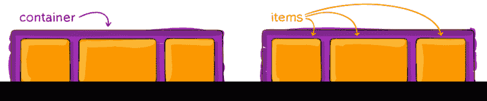
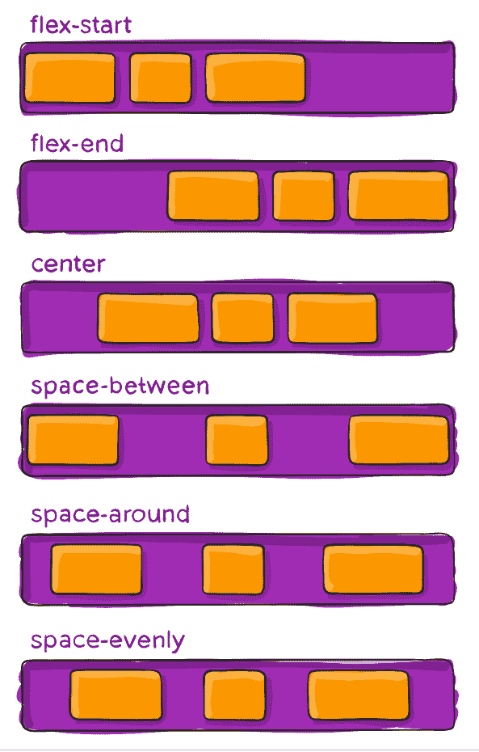
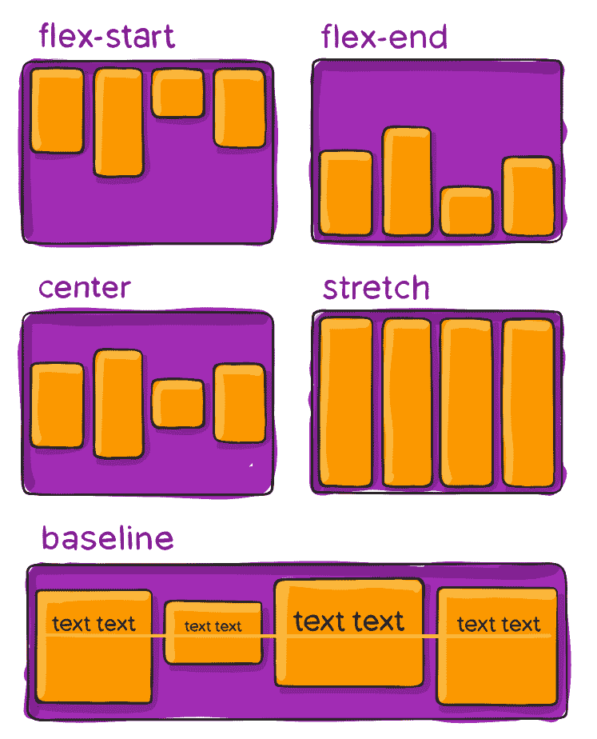

# 你只需要知道这些属性就可以开始喜欢 CSS 了

> 原文：<https://www.freecodecamp.org/news/you-just-need-to-know-these-properties-to-start-loving-css-a06aca6087e9/>

亨利·塔比玛·吉拉尔多

# 你只需要知道这些属性就可以开始喜欢 CSS 了

当你是前端开发的新手时，用 HTML 和 CSS 定位会是一件非常头疼的事情。但在这篇文章中，我将教你如何解决大多数定位问题。你只需要知道这 3 个 CSS 属性。

我是一名拥有 3 年以上前端经验的开发人员。当我学习的时候，我想到了你现在所想的。然后我遇到了 flexbox，定位变得前所未有的简单。

学习 flexbox 的最佳资源之一是 [CSS 技巧指南](https://css-tricks.com/snippets/css/a-guide-to-flexbox/)。在持续使用这个特性之后，我意识到，在大多数情况下，您只需要这三个属性:

> 显示器:flex

> justify-content:$ value；

> align-items:$ value；

我准备借用一下前面提到的的[的一些图片。这样，我可以确保你更容易理解属性是如何工作的。好吧，我们开始吧。](https://css-tricks.com/snippets/css/a-guide-to-flexbox/)

#### 语境

首先，我们需要建立一个工作环境。当我们使用 flexbox 时，我们有两种元素，**容器**，以及在所述容器内的**项目**，正如你在下图中看到的:

Image from CSS Tricks flexbox guide

既然您可以区分容器和它的项目，让我们弄清楚一件事:我们将在这里学习的三个属性**属于容器**。当人们开始使用 flexbox 时，一个常见的错误是为他们的子元素设置以下属性。

#### 显示器:flex

好的，我们需要做的第一件事是将容器的`display`属性设置为`flex`。

使用该属性，可以将容器的直接子元素排列成一行(如上图所示)。

#### 调整内容

此属性定义项目沿主轴(水平轴)的对齐方式。我们可以在下图中看到可能的值及其结果:

Image from CSS Trick flexbox guide

#### 对齐-项目

第三个属性是 **align-items。**该属性定义了项目沿横轴(纵轴)的默认行为。现在，让我们看看这个属性所有可能的值，以及它们如何影响容器内的元素。

Image from CSS Tricks flexbox guide

有了以前的属性，我们就可以开始把东西放在我们想要的地方。但是如果没有例子，这篇文章是不完整的。因此，我将向您展示一些常见的用例。

> 注意:有一个名为 flex-direction 的属性可以交换主轴和横轴的方向。当你使用这个属性时要小心，确保你知道你在做什么。

#### 用例

作为第一个用例，我们将看到一个简化的标题导航栏。标题通常有一个项目在左边，另一个在右边，有时一个或多个在中间。

在这个 Codepen 示例中，只关注名为`.container`的选择器中的 CSS。所有其他风格都是为了给人一个好的外观和感觉。您应该尝试移除中间的项目，然后看看会发生什么。

对于第二个用例，通常，您会希望将一个项目放在其容器的中心。现在，让我们看看如何实现这一目标。

同样，检查名为`.container`的选择器，并试验这些属性的不同值，看看会发生什么。

#### 最后

简单对吗？试试这些属性，看看它们是如何影响元素的，习惯它们，在处理定位时就不会再有任何问题了。

既然您已经看到了如何以最基本和最有用的方式使用 flexbox，我想鼓励您学习更多关于这个特性的知识。你可以阅读 [CSS 招数指南](https://css-tricks.com/snippets/css/a-guide-to-flexbox/)，和 [Flexbox 青蛙](https://flexboxfroggy.com)或者 [Flexbox 僵尸](https://mastery.games/p/flexbox-zombies)一起玩。最后两个选项可以作为一种有趣的方式来教你自己 flexbox 的来龙去脉。

我希望这篇文章对你有所帮助。我很想收到你的来信。如果你想联系我，一定要在推特上用@HenryTabimaG 关注我，在 GitHub 上用@HenryTabima 关注我。如果你想知道某个帖子的具体内容，尽管问。

记住，如果你喜欢这篇文章，请留下一些“掌声”。

