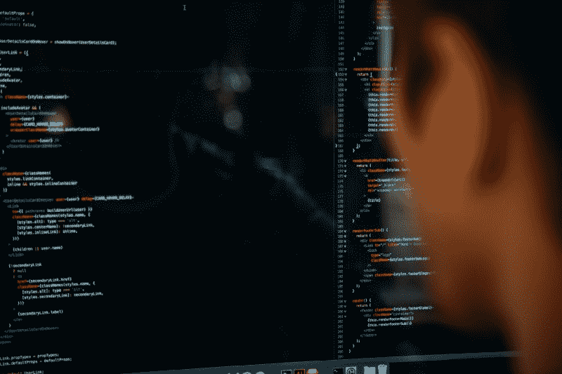

# 如何使用 Firefox 开发工具调试 web 应用程序

> 原文：<https://www.freecodecamp.org/news/how-to-debug-web-apps-with-firefox-developer-tools-64a9f531af90/>

舒坎特·帕尔

# 如何使用 Firefox 开发工具调试 web 应用程序

#### 高级 web 开发的必备知识

Photo by [Charles ?? o](https://unsplash.com/photos/pjAH2Ax4uWk?utm_source=unsplash&utm_medium=referral&utm_content=creditCopyText)n Un[splash](https://unsplash.com/search/photos/coding?utm_source=unsplash&utm_medium=referral&utm_content=creditCopyText)

通过了解如何调试你的网络应用，你可以利用开发者工具来提高你的工作效率。读完这篇文章，你将能够:

*   在您的电脑上调试移动和平板版本的 web 应用程序。
*   [连接手机火狐…](https://unsplash.com/search/photos/coding?utm_source=unsplash&utm_medium=referral&utm_content=creditCopyText)