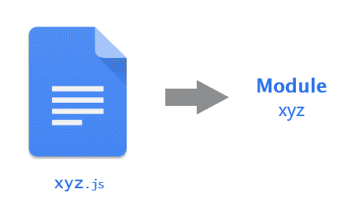
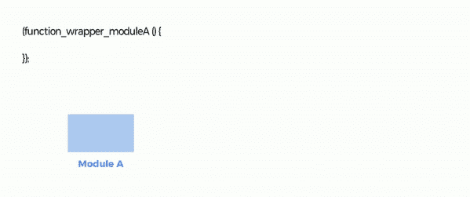
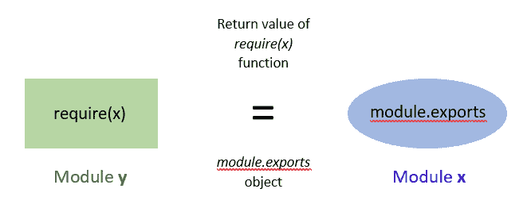

# 关于 Node.js 中的' module' & 'require '你应该知道的一切

> 原文：<https://www.freecodecamp.org/news/require-module-in-node-js-everything-about-module-require-ccccd3ad383/>

斯里什蒂·古普塔

# 关于 Node.js 中的'*模块'* & 'require '你应该知道的一切

### 模块

> Node.js 将每个 JavaScript 文件视为一个独立的模块。

例如，如果您有一个包含一些代码的文件，并且这个文件被命名为`xyz.js`，那么这个文件被视为 Node 中的一个*模块*，您可以说您已经创建了一个名为`xyz`的模块。



JavaScript file in Node.js corresponding to a ‘module’

让我们举个例子来更好地理解这一点。

您有一个名为`circle.js`的文件，它包含计算面积&的逻辑，即给定半径的圆的周长，如下所示:

*circle.js*

你可以调用`circle.js`文件中一个名为`circle`的模块。

您可能想知道为什么需要多个模块？您可以在一个模块中编写所有代码。嗯，写模块化代码是非常重要的。模块化，我的意思是说你的代码应该是独立的，应该是松散耦合的。想象一下，有一个大型应用程序，您将所有代码都写在一个地方，一个文件中。太乱了，对吧？

### 写在模块内部的代码是如何运行的？

在执行编写在模块中的代码之前，Node 将整个代码封装在一个函数包装器中。这个函数包装器的语法是:


All code you write in a module resides in the function wrapper!

`circle`模块的函数包装如下所示:

您可以看到在根级别有一个函数包装器，它包含了在`circle`模块中编写的所有代码。

> 除非明确声明(导出),否则模块内部编写的整个代码都是模块私有的。

这是 Node.js 中拥有模块的最大优势。即使你在一个模块中使用`var`、`let`或`const`关键字定义了一个全局变量，这些变量的作用域也是局部的，而不是全局的。发生这种情况是因为每个模块都有自己的函数包装器，并且在一个函数内部编写的代码是该函数的本地代码，不能在该函数外部访问。



Code written inside a module is private to it!

假设有两个模块——*A*和 *B* 。写在*模块 A* 内部的代码被封装在*模块 A* 对应的函数包装器内。在*模块 B* 中编写的代码也会发生类似的情况。因为与两个模块相关的代码包含在不同的函数中，所以这些函数将不能访问彼此的代码。(还记得 JavaScript 中的每个函数都有自己的局部作用域吗？)这就是为什么*模块 A* 不能访问写在*模块 B* 内部的代码，反之亦然。

节点中的每个模块内都有`exports`、`require`、`module`、`__filename`、`__dirname`五个参数。虽然这些参数对于模块内的代码是全局的，但是它们对于模块是局部的(因为上面解释的函数包装)。这些参数提供了与模块相关的有价值的信息。

让我们重温一下您之前看过的`circle`模块。在这个模块中定义了三个结构——一个常量变量`PI`，一个名为`calculateArea`的函数和另一个名为`calculateCircumference`的函数。需要记住的重要一点是，默认情况下，所有这些构造对于`circle`模块都是私有的。这意味着除非明确指定，否则不能在任何其他模块中使用这些构造。

因此，现在出现的问题是，如何在一个模块中指定一些可以被其他模块使用的东西？这是函数包装器的`module` & `require`参数有用的时候。让我们在本文中讨论这两个参数。

### `**module**`

`module`参数(更确切地说是 Node 中模块的关键字)指的是代表当前模块*的对象。`exports`是`module`对象的一个键，对应的值是一个对象。`module.exports`对象的默认值为`{}`(空对象)。您可以通过在任何模块中记录关键字`module`的值来检查这一点。让我们检查一下`circle`模块中`module`参数的值是什么。*

*circle.js*

注意，在上面给出的文件中，代码的末尾有一个`console.log(module);`语句。当您看到输出时，它将记录`module`对象，该对象有一个名为`exports`的键，该键对应的值是`{}`(一个空对象)。

现在，`module.exports`对象是做什么的？嗯，它被用来定义可以被模块导出的东西。从一个模块导出的任何内容都可以被其他模块使用。出口东西很容易。你只需要把它添加到`module.exports`对象中。向要导出的`module.exports`对象添加内容有三种方法。下面就逐一讨论这些方法。

**方法 1:**
**(定义构造，然后使用多个`module.exports`语句添加属性)**

在第一种方法中，首先定义构造，然后使用多个 *module.exports* 语句，其中每个语句用于从模块中导出一些东西。让我们来看看这个方法的运行情况，看看如何导出在`circle`模块中定义的两个函数。

*circle.js*

正如我之前告诉你的，`module`是一个拥有名为`exports`的键的对象，而这个键(`module.exports`)又由另一个对象组成。现在，如果您注意到上面给出的代码，您所做的就是向`module.exports`对象添加新的属性(键值对)。

第一个属性有关键字`calculateArea` (在第 19 行定义)，写在赋值运算符右边的值是用名称`calculateArea`(在第 9 行)定义的函数。

第二个属性(在第 20 行定义)有键`calculateCircumference` ，值是用名称`calculateCircumference`(在第 16 行)定义的函数。

因此，您已经为`module.exports`对象分配了两个属性(键值对)。

此外，不要忘记您在这里使用了点符号。您也可以使用括号符号将属性分配给`module.exports`对象，并通过在括号符号后指定键来添加函数`calculateArea`和`calculateCircumference`。因此，您可以编写下面两行代码，使用括号符号向`module.exports`对象添加属性，同时替换上面给出的代码中的最后两行(使用点符号):

```
// exporting stuff by adding to module.exports object using the bracket notation
```

```
module.exports['calculateArea'] = calculateArea;module.exports['calculateCircumference'] = calculateCircumference; 
```

现在让我们尝试在添加属性后记录`module.exports`对象的值。请注意，在下面给出的文件中，下面的语句被添加到代码的末尾:

```
// logging the contents of module.exports object after adding properties to it
```

```
console.log(module.exports);
```

*circle.js*

让我们检查一下这段代码的输出，看看是否一切正常。为此，保存您的代码并在您的*终端*中运行以下命令:

```
node circle
```

输出:

```
{    calculateArea: [Function: calculateArea],   calculateCircumference: [Function: calculateCircumference] }
```

添加到`module.exports`对象的构造`calculateArea`和`calculateCircumference`被记录下来。因此，您成功地在`module.exports`对象中添加了两个属性，这样函数`calculateArea`和`calculateCircumference`就可以从`circle`模块导出到其他模块。

在这个方法中，您首先定义了所有的构造，然后使用了多个 *module.exports* 语句，其中每个语句用于向`module.exports`对象添加一个属性。

**方法 2:**
**(定义构造，然后使用单个`module.exports`语句添加属性)**

另一种方法是首先定义所有的构造(就像您在前面的方法中所做的那样)，但是使用一个单独的`module.exports`语句来导出它们。这种方法类似于对象文字表示法的语法，可以一次将所有属性添加到一个对象中。

这里，您使用了对象文字符号，并通过编写一个单独的 *module.exports* 语句，将函数`calculateArea` 和`calculateCircumference`(一次全部)添加到了`module.exports`对象中。

如果您检查这段代码的输出，您将得到与前面使用方法 1 时相同的结果。

**方法三:**
**(在定义构造时向`module.exports`对象添加属性)**

在这种方法中，您可以在定义构造时将它们添加到`module.exports`对象中。让我们看看如何在我们的`circle`模块中采用这种方法。

在上面给出的代码中，您可以看到模块中的函数在定义时被添加到了`module.exports`对象中。让我们看看这是如何工作的。您正在向`module.exports`对象添加一个键`calculateArea`，对应于这个键的值就是函数定义。

请注意，该函数不再有任何名称，它是一个匿名函数，只是被视为一个对象的键值。因此，不能在`circle`模块中引用该函数，也不能通过编写以下语句在该模块中调用该函数:

```
calculateArea(8);
```

如果你尝试执行上面的语句，你会得到一个声明`calculateArea is not defined`的`ReferenceError`。

现在你已经学会了如何指定需要从一个模块中导出什么，你认为另一个模块如何能够使用导出的内容？您需要将该模块导入到其他模块，以便能够在后者中使用从前者导出的内容。这时我们需要讨论另一个名为`require`的参数。

### **要求**

`require`关键字指的是一个函数，用于从另一个模块导入使用`module.exports`对象导出的所有构造。如果您有一个模块 *x* ，其中您正在使用`module.exports`对象导出一些构造，并且您想要在模块 *y* 中导入这些导出的构造，那么您需要使用`require`函数请求模块 *y* 中的模块 *x* 。模块 *y* 中的`require`函数返回的值等于模块 *x* 中的`module.exports`对象。



***require*** function returns **module.exports** object

让我们用前面讨论的例子来理解这一点。您已经有了`circle`模块，您正从该模块导出函数`calculateArea`和`calculateCircumference`。现在，让我们看看如何使用`require`函数在另一个模块中导入导出的内容。

让我们首先创建一个新文件，您将在其中使用从`circle`模块导出的代码。让我们把这个文件命名为`app.js`，你可以称它为`app`模块。

目标是将从`circle`模块导出的所有代码导入到`app`模块中。那么，如何将一个模块中编写的代码包含在另一个模块中呢？

考虑下面给出的`require`函数的语法:

```
const variableToHoldExportedStuff = require('idOrPathOfModule');
```

`require`函数接受一个可以是 ID 或路径的参数。id 是指所需模块的 ID(或名称)。当您使用节点程序包管理器提供的第三方模块或核心模块时，您应该提供 ID 作为参数。另一方面，当您定义了自定义模块时，您应该提供模块的路径作为参数。你可以从[这个](https://nodejs.org/api/modules.html#modules_require_id)链接中了解更多关于 require 函数的信息。

因为您已经定义了一个名为`circle`的定制模块，所以您将把路径作为参数提供给`require`函数。

*app.js*

如果您注意清楚，路径开头的点表示这是一个相对路径，模块`app`和`circle`存储在同一路径。

让我们将`circle`变量登录到控制台，该变量包含由`require`函数返回的结果。让我们看看这个变量包含了什么。

*app.js*

通过保存您的所有代码并在您的终端中运行以下命令来检查输出(如果您安装了`nodemon`包，则不需要后者):

```
node app
```

输出:

```
{ calculateArea: [Function: calculateArea],calculateCircumference: [Function: calculateCircumference] }
```

如您所见，`require`函数返回一个对象，其键是从所需模块(`circle`)中导出的变量/函数的名称。简而言之，`require`函数返回`module.exports`对象。

现在让我们访问从`circle`模块导入的函数。

*app.js*

输出:

```
Area = 200.96, Circumference = 50.24
```

如果我试图访问在`app`模块内的`circle`模块中定义的名为`PI`的变量，你认为会发生什么？

*app.js*

输出:

```
Area = 200.96, Circumference = 50.24pi = undefined
```

你能弄清楚为什么`pi`是`undefined`吗？嗯，这是因为变量`PI`不是从`circle`模块中导出的。还记得我告诉过你，你不能在另一个模块中访问写在一个模块中的代码，因为所有写在一个模块中的代码都是私有的，除非被导出。在这里，你试图访问的东西不是从`circle`模块导出的，而是私有的。

所以，你可能会奇怪为什么没有得到`ReferenceError`。这是因为您试图访问由`require`函数返回的`module.exports`对象中的一个名为`PI`的键。您还知道名为`PI`的键在`module.exports`对象中并不存在。

注意，当您试图访问一个对象中不存在的键时，您得到的结果是`undefined`。这就是为什么你得到的`PI`是`undefined`而不是`ReferenceError`的原因。

现在，让我们从`circle`模块中导出变量`PI`，看看答案是否有变化。

*circle.js*

注意，这里没有使用变量`PI`的名称作为添加到`module.exports`对象的属性的键。相反，你使用了另一个名字，那就是`lifeOfPi`。

这是一件有趣的事情。当您导出某个编码结构时，您可以在添加属性到`module.exports`对象时给键取任何名称。不强制使用与您在定义构造时使用的名称相同的名称。这是因为您可以使用任何有效的标识符作为 JavaScript 对象中的键。因此，在赋值操作符的左侧，您可以使用任何有效的标识符，但是在赋值操作符的右侧，您需要提供一个值，该值被定义为当前模块范围内的一个构造(就像您在“circle”模块中定义的变量和函数一样)。

需要注意的重要一点是，在当前模块中从另一个模块导入内容时，您需要使用导出时使用的相同密钥。

*app.js*

因为您使用了键`lifeOfPi`，所以您需要使用相同的键来访问在`circle`模块中定义的变量`PI`，就像上面给出的代码中所做的那样。

输出:

```
Area = 200.96, Circumference = 50.24pi = 3.14
```

如果您使用变量名而不是导出时使用的密钥，您认为会发生什么情况？简而言之，让我们尝试访问`PI`(变量名称)而不是`lifeOfPi`(导出`PI`时使用的密钥)。

*app.js*

输出:

```
Area = 200.96, Circumference = 50.24pi = undefined
```

这是因为`module.exports`对象不再知道变量`PI`。它只知道添加到其中的密钥。因为用于导出变量`PI`的键是`lifeOfPi`，所以后者只能用于访问前者。

### TL；速度三角形定位法(dead reckoning)

*   Node.js 中的每个文件被称为一个*模块*。
*   在执行模块中编写的代码之前，Node.js 将模块中编写的整个代码转换为函数包装，其语法如下:

```
(function(exports, require, module, __filename, __dirname) { // entire module code lives in here});
```

*   函数包装器确保模块内部编写的所有代码都是私有的，除非明确声明(导出)。参数`exports`、`require`、`module`、`__filename`和`__dirname`充当模块中整个代码的全局变量。因为每个模块都有自己的函数包装器，所以在一个函数包装器中编写的代码对于该函数包装器(读取模块)来说是本地的，并且在另一个函数包装器(读取模块)中是不可访问的。
*   `module`关键字是指代表当前模块的对象。对象有一个名为`exports`的键。`module.exports`是另一个对象，用于定义一个模块可以导出哪些内容，以及哪些内容可以供其他模块使用。简而言之，如果一个模块想要导出一些东西，它应该被添加到`module.exports`对象中。
*   `module.exports`对象的默认值为`{}`。
*   有三种方法可以从模块中导出一些东西，或者向`module.exports`对象添加一些东西:
    1。首先定义所有的构造，然后使用多个`module.exports`语句，每个语句用于导出一个构造。
    2。首先定义所有的构造，然后使用一条`module.exports`语句按照对象文字符号一次性导出所有的构造。
    3。定义构件时，将它们添加到`module.exports`对象中。
*   `require`关键字指的是一个函数，该函数用于从另一个模块导入使用`module.exports`对象导出的所有变量和函数。简而言之，如果一个文件想要导入一些东西，它必须使用下面的语法来声明它:

```
require('idOrPathOfModule');
```

*   从模块中导出内容时，可以使用任何有效的标识符。您不一定需要给出变量/函数的确切名称，作为添加到`module.exports`对象的属性的关键字。只需确保您使用相同的密钥来访问您在导出时使用的内容。