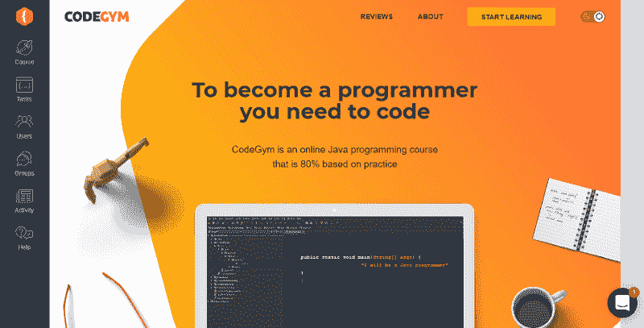

# 为什么学习 Java(或任何编程语言)永远不嫌老

> 原文：<https://www.freecodecamp.org/news/why-you-are-never-too-old-to-learn-java-or-any-programming-language-a62603e89448/>

作者约翰·塞拉斯基

# 为什么学习 Java(或任何编程语言)永远不嫌老

By [Ryan McGuire](https://gratisography.com/photo/author/ryan-mcguire/ "Posts by Ryan McGuire")

> “爱情没有年龄。”

许多人会同意这种说法，但是我们仍然认为现在学习或改变职业已经太晚了。为什么我们不把这种方法用在我们想要实现的任何事情上，尤其是学习新东西的时候，比如编程语言？

我是一名 Java 课程的导师，我有很多 30 岁甚至更大的人开始学习 Java 的例子。事实上，随着年龄的增长，人们变得更有经验、更聪明，他们看待事物的方式也不同，这有助于他们在任何新的开始时都如鱼得水。此外，信息技术中的年龄歧视比其他行业中的要少。它重视技能，而不是程序员的年龄。

在这里，你会发现 5 个有力的论据，说明为什么你不应该忽视你的愿望，应该开始学习 Java。然而，这些原因也适用于其他编程语言。所以，如果你正在寻找灵感的火花，请和我们呆在一起——你一定会在这里找到它。

### 原因 1。随着年龄的增长学习新的东西有助于保持旧处理器的运转

信不信由你，塞萨尔·基利兰最近的医学研究证明了大脑活动对衰老和大脑健康的重大影响。这意味着你训练你的大脑越多，你保持理智的时间就越长。他们还表明，60-90 岁的人只需每天做几个小时的手工艺品和一些爱好，就能改善他们的大脑健康。所以现在，想象一下，一个 30 岁的人的大脑能做什么。

学习编程语言相当于训练你的思维过程——一种精神锻炼，因此你的注意力和专注力会变得更好。

Reddit 上有一个 32 岁的成功故事。他对编程或任何技术方面的东西都一无所知，但现在他在大学学习编程，他说当他开始时——那很艰难，但现在他“思维敏捷”。另外，信不信由你，没人在乎他的年龄。

### 原因二。有很多在线课程和资料——没人知道你的年龄

如今，有很多在线课程，许多人承认它们比线下课程更有效率，带来更积极的结果。原因很简单:IT 行业看重的是你的知识，而不是你的体能，而且你要为自己选择合适的学习时间和节奏。有许多人成功地完成了这些任务，并在很短的时间内获得了他们梦想中的工作。

这里有三个可以学习 Java 的在线资源的例子:

*   CodeGym —一门 80%基于实践的在线 Java 编程课程，旨在从头开始学习。

*   代码学院(code academy)——该项目旨在获得对你未来工作非常有用的技能。

*   此外，Coursera 或 T2 Udemy 平台上还有在线视频课程，这些平台包括来自世界各地在线大学的各种科目的课程。

当然，一旦你开始学习或从事程序员工作，每个人都需要那些 Java 高手的指导支持。此外，Java 开发人员有一个非常强大的社区，这里有一些平台可以帮助你找到必要的信息或询问一些建议。

*   Java 论坛是一个经典的论坛，包含许多主题，为了更快的搜索，它被分成了几个部分。
*   Java world 是一个平台，新闻、博客、专家和许多与 Java 相关的事物都集中在这里。
*   CodeGym Help 是一个面向新来者的社区，在这里他们可以找到及时和适当的支持。

您可以提出任何问题并从用户那里找到一个或多个解决方案的地方:

*   Java subreddit :分享与 Java 相关的问题和主题的解决方案和经验；
*   编程 s [ubreddit](https://www.reddit.com/r/learnprogramming/) :询问和寻找与编程相关的任何问题的解决方案。

博客也很重要——它们观察更新、新特性，以及一般来说，为了更好的 Java 编码体验而新发明或创造的东西。

*   Java Geek 是一个资源，在这里你可以找到对一个案例或一个问题的清晰解释，除此之外，它还被分成不同的类别——与各种技术的交互。
*   [Bench Resources](http://www.benchresources.net/) 是描述 Java 相关问题和案例的另一个来源。它的结构也分为几个部分，以便快速搜索。

当然，永远不要忘记另一个重要的知识来源——书籍。此外，一旦你成为一名程序员，在电脑前工作一整天后，你会想用不同的东西来替换电脑屏幕。

*   凯西·塞拉&伯特·贝茨负责第一个 Java。作者试图通过简单的语言和视觉内容来介绍他们的知识，而不去纠结学习一门面向对象语言有多难。
*   《Java:初学者指南》，作者 Herbert Schildt——以渐进的方式描述 Java 的基础知识，让用户从一开始就理解和深入 Java。

你可能已经注意到有许多在线资源，而这仅仅是个开始。那么，在如此巨大的支持下，是什么阻止了你自由地开始学习 Java 呢？他们不在乎你的年龄，只在乎你的学识。

### 原因三。年龄无关紧要

年龄只是你经历的一个数字。不幸的是，有一种全球性的刻板印象和谬论，认为你必须有一份永久的工作，直到生命的尽头。但是谁说事情应该是这样的呢？你是一个成熟的人，知道自己在寻找什么，知道自己想要得到什么结果。这就是为什么，一旦你决定你想编码——开发这个火花，迟早，它会给你带来回报。

另一个动机是考虑你自己，永远不要和别人比较，因为人们有不同的经历和不同的知识水平。起点应该是你开始学之前就知道的东西。与前一阶段相比，你会惊讶于你的进步。

在我的课程中有一个很好的例子，一个程序员从未有过与技术职业相关的工作。但他决定在 CodeGym 上通过循序渐进的教程，你知道吗？他成功了，得到了他想要的工作。

永远不要害怕“糟糕的代码”或缺乏经验，因为无论你是什么年龄，每个人在开始时都会犯错误，当你磨练你的技能时，他们会逐渐消失。你知道年轻的学生和年长的学生一样担心吗？我会找一份没有经验的工作吗？但是，事实是，一些公司正在寻找经验很少的人来为他们的项目培养专家。此外，技术每天都在发展，它们需要大量的代码和能够创造代码的人。你不可能一口气学会所有的东西:)

### 原因四。学习 Java 就像学习任何其他技能一样

学习 Java 和学习骑自行车没什么不同。没有大的区别。然而，如果你在一个成熟的年龄开始学习骑自行车，你会担心更多，但更有可能的是，你花在它身上的时间会更少。年龄在你的智慧和经验中扮演着重要的角色，因为你会犯错误并知道如何去改正。

编程不仅仅是编码本身，而是寻找人们所面临问题的最佳解决方案。在这方面，你的经验会有很大帮助。因此，拥有另一个领域的背景是一个巨大的优势。许多做了同样步骤的人承认他们的成熟增加了他们的成功。

### 原因五。现在是最好的时机

永远不要推迟你的计划，尽早开始学习，因为合适的时机永远不会到来。如果你等待，只会浪费你宝贵的时间。此外，在以后的生活中，你会比现在有更多的疑虑，开始会更困难。

此外，你将有新的机会换工作，甚至获得晋升或改善目前的工作。不是很吸引人吗？在 Reddit 上很容易找到一个 35 岁左右的人的故事，他经历了与年轻程序员一起工作的艰难历程，以及他所面对的公司内部的企业结构。但这让他变得更强大，他得到这份工作比他想象的还要容易。

### 包裹

如果你是那些处于十字路口的人之一，认为“我太老了，不适合 x，”你应该知道年龄只是时间曝光，这有助于你看到年轻人通常不知道的事情。学习新的东西会让你的心理健康井然有序，你的心智敏锐度会和比你年轻的人持平。

因此，选择在家/在线学习 Java 的方式只是向所有人展示您可以做得更多的另一个完美机会。把这当作获得另一项重要技能。此外，没有人会在意你的年龄，因为 IT 行业非常重视知识。

因此，永远不要放弃你的想法，开始前进。确信无论你选择什么方式，你都会得到巨大的支持。

开始学习 Java 或任何你想学的东西永远都不晚，因为你越早开始学习，你从生活中获得的好处就越多——开始吧！此外，你的实践和知识让你拓宽了你的能力范围，然后，你一定会成为一个成功的人。

所以，如果你觉得你太老了，不适合做这个…

…你不是。